# **Match Transfer to Client — High-Level Design (HLD) with Diagrams**

---

## **1) Purpose and Scope**

### **Purpose Diagram**
```mermaid
graph TD
    A[Match Transfer Module] --> B[Export Matches]
    A --> C[Notify Downstream]

    B --> D[Potential & Perfect Matches]
    B --> E[Client-Consumable Artifact (File)]

    C --> F[Publish File Reference]
    C --> G[To Messaging Topic]
```

### **Scope**
- **Objective**: Periodically export potential and perfect matches for each group/domain to a file and notify downstream systems.
- **Inputs**:
    - `PotentialMatchEntity` and `PerfectMatchEntity` streams from PostgreSQL.
- **Process**:
    - Transforms DB entities into transfer DTOs.
    - Exports to a file via `ExportService`.
    - Publishes a file reference to a Kafka-like topic.
- **Constraints**:
    - Batch/scheduled execution only.
    - High-throughput streaming from the database.

---

## **2) Triggers and Entry Points**

### **Trigger Flow Diagram**
```mermaid
flowchart TD
    A[Scheduler @ Cron] --> B[Trigger scheduledMatchesTransferJob()]
    B --> C{Enumerate Active Domains/Groups}
    C --> D[Submit Per-Group Tasks]
    D --> E[Group-Level Executor]
```

- **Scheduler**: `MatchesTransferScheduler.scheduledMatchesTransferJob`
- **Cron Expression**: `${match.transfer.cron-schedule}`
- **Behavior**:
    - Enumerates active domains and their associated groups.
    - Submits per-group transfer tasks to a dedicated group-level executor.

---

## **3) Architecture Overview**

### **High-Level Architecture Diagram**


### **Key Layers**
- **Orchestration**: Manages scheduled execution and per-group task dispatching.
- **Data Ingestion**: Streams data from PostgreSQL using JDBC.
- **Transformation & Export**: Maps entities, creates export files, and publishes notifications.
- **Concurrency**: Producer-consumer pipeline with a bounded queue for backpressure.

---

## **4) End-to-End Flow**

### **End-to-End Flow Diagram**


### **Detailed Flow**
1. **Scheduler**: Submits an async task for each group.
2. **Processor**:
    - Starts two streaming producers (Potential and Perfect).
    - Maps DB entities to `MatchTransfer` DTOs and enqueues them.
    - Builds a lazy `Stream` that polls the queue.
3. **Export & Send**:
    - `ExportService` consumes the stream and creates a file.
    - A `MatchSuggestionsExchange` message is published to Kafka.
4. **Monitoring**: The scheduler collects metrics and logs for each group.

---

## **5) Components and Responsibilities**

### **Component Responsibility Diagram**

```mermaid
classDiagram
    class MatchesTransferScheduler {
        +Cron trigger
        +Dispatches async per-group transfers
        +Monitors executor health
    }

    class MatchTransferService {
        +Thin facade
        +Delegates to processor
    }

    class MatchTransferProcessor {
        +Coordinates streaming, export, and messaging
        +Producer-consumer pipeline with backpressure
        +Implements resilience (@CircuitBreaker, @Retryable)
    }

    class PotentialMatchStreamingService {
        +JDBC forward-only streaming
        +Retry on SQL errors
    }

    class PerfectMatchStreamingService {
        +JDBC forward-only streaming
        +Retry on SQL errors
    }

    class ExportService {
        <<external>>
        +Consumes stream
        +Produces ExportedFile
    }

    class ScheduleXProducer {
        <<external>>
        +Publishes to messaging topic
    }
```


---

## **6) Data Flow**

### **Data Flow Diagram**
```mermaid
graph TD
    subgraph Input
        A[PotentialMatchEntity Stream]
        B[PerfectMatchEntity Stream]
    end

    subgraph Transformation
        C[Map to MatchTransfer DTO]
        D[Merge Streams via Queue]
    end

    subgraph Output
        E[ExportedFile]
        F[MatchSuggestionsExchange (Kafka)]
    end

    A --> C
    B --> C
    C --> D
    D --> E
    E --> F
```

- **Inputs**: Streams of `PotentialMatchEntity` and `PerfectMatchEntity`.
- **Transform**: Maps entities to a common `MatchTransfer` DTO and merges them.
- **Outputs**: An `ExportedFile` and a `MatchSuggestionsExchange` message.

---

## **7) Concurrency, Backpressure, and Memory**

### **Concurrency Model Diagram**
```mermaid
graph TD
    subgraph Executors
        E1[matchTransferGroupExecutor]
        E2[matchTransferExecutor]
    end

    subgraph Backpressure
        B1[Bounded Queue (capacity=100)]
        B2[queue.put() (blocks if full)]
        B3[queue.poll() (non-blocking)]
    end

    subgraph Memory
        M1[Batch Size (100k)]
        M2[Queue Capacity (100)]
        M3[Worst-Case Memory: 100 * 100k DTOs]
    end
```

- **Executors**: Separate pools for group scheduling and producer/consumer tasks.
- **Backpressure**: A bounded queue blocks producers when full.
- **Memory**: The main risk is the queue size; `batchSize` and `queueCapacity` must be carefully sized.
- **Termination**: An `AtomicBoolean` flag coordinates the shutdown of the consumer.

---

## **8) Resilience and Error Handling**

### **Resilience Mechanisms**
```mermaid
graph TD
    A[Resilience] --> B[Circuit Breaker]
    A --> C[Retries with Backoff]
    A --> D[Error Metrics]
    A --> E[Defensive Checks]

    B --> F[on processMatchTransfer()]
    C --> G[Streaming (SQL)]
    C --> H[Export (Connect/Timeout)]
    D --> I[group_process_failed]
    D --> J[match_process_failed]
    E --> K[Null field filtering]
    E --> L[Interruption handling]
```

- **Circuit Breaker**: Wraps `processMatchTransfer` to prevent cascading failures.
- **Retries**: Applied to both streaming and export operations.
- **Error Metrics**: Dedicated counters for tracking failures.
- **Defensive Checks**: Null filtering and proper interruption handling.

---

## **9) Observability**

### **Observability Dashboard**


- **Gauges**: Monitor executor health and queue depth.
- **Timers**: Track the duration of key operations.
- **Counters**: Count processed batches, records, successes, and failures.

---

## **10) Configuration (Selected)**

| **Key** | **Default** | **Effect** |
|---|---|---|
| `match.transfer.cron-schedule` | N/A | Cron schedule for the job |
| `match.transfer.batch-size` | 100000 | DB fetch size per streamed batch |
| `matchTransferGroupExecutor` | External bean | Controls per-group parallelism |
| `matchTransferExecutor` | External bean | Controls producer/consumer parallelism |
| `Topic suffix` | `matches-suggestions` | Suffix for the Kafka topic name |

---

## **11) Sequence (Per Group)**

### **High-Level Sequence Diagram**


---

## **12) Security & Data Integrity**

| **Concern** | **Mitigation** |
|---|---|
| **Data Integrity** | Raw data transfer; deduplication is downstream responsibility |
| **Security** | Secure storage ACLs and topic authorization |
| **Sensitive Data** | Sanitize fields in `ResponseMakerUtility` mapping |

---

## **13) Risks & Considerations**

| **Risk** | **Recommendation** |
|---|---|
| **Memory Pressure** | Reduce `batchSize` and `queueCapacity`; consider push-based export |
| **Ordering/Duplication** | Add merging/deduplication logic if required by clients |
| **Backpressure Visibility** | Add metrics for the internal `MatchTransfer` queue fill percentage |
| **Failure Semantics** | Ensure producer failures are surfaced and logged clearly |
| **Producer/Consumer Coupling** | Ensure export throughput matches streaming rate to avoid stalls |

---

## **14) Extensibility**

### **Extensibility Points**


- **New Export Formats**: Extend `ExportService` and the `MatchSuggestionsExchange` schema.
- **Additional Match Sources**: Add new streaming services to feed the same queue.
- **Enhanced Processing**: Add deduplication or partitioning logic within the `MatchTransferProcessor`.

---