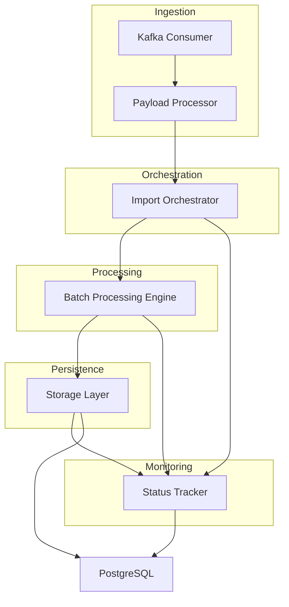
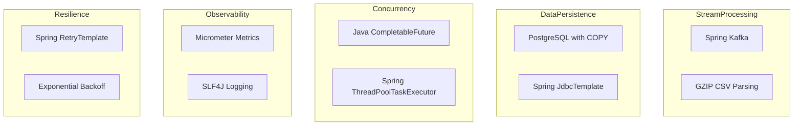

# **High-Level Design (HLD): Nodes Import Module with Diagrams**

---

## **1. Overview**

### **System Purpose Diagram**
```mermaid
graph TD
    A[Nodes Import Module] --> B[Ingest & Validate]
    A --> C[Persist Node Data]
    A --> D[Support Dual Ingestion Patterns]

    B --> E[From Kafka Topics]
    C --> F[To PostgreSQL]
    D --> G[Cost-Based (CSV Files)]
    D --> H[Non-Cost-Based (Reference IDs)]
```

The Nodes Import Module is a robust, asynchronous system designed to ingest, validate, and persist node data from Kafka topics into a PostgreSQL database. It supports both large-scale, file-based imports and lightweight, ID-based imports, leveraging parallel batch processing, dead-letter queues (DLQ), and real-time metrics for high performance and fault tolerance.

---

## **2. Key Components**

### **Component Architecture Diagram**


### **Component Responsibilities**
| **Component** | **Responsibilities** | **Technologies** |
|---|---|---|
| **Kafka Consumer** | Listens to `.*-users` topics, processes messages, and routes failures to DLQ | Spring Kafka, `@KafkaListener`, DLQ routing |
| **Payload Processor** | Validates and parses Kafka messages into `NodeExchange` objects | Spring `@Component`, JSON/GZIP parsing |
| **Import Orchestrator** | Routes valid payloads to cost-based or non-cost-based workflows; initializes job tracking | `ImportJobService`, `NodeImportValidator` |
| **Batch Processing Engine** | Splits large payloads into batches; processes batches in parallel; aggregates results | `CompletableFuture`, `ThreadPoolTaskExecutor` |
| **Storage Layer** | Upserts nodes into PostgreSQL using efficient `COPY` commands; batches metadata inserts | PostgreSQL, Spring `JdbcTemplate`, `COPY` |
| **Status Tracker** | Updates job statuses (e.g., `PROCESSING`, `FAILED`) and emits metrics | `NodesImportStatusUpdater`, Micrometer |

---

## **3. Data Flow**

### **End-to-End Data Flow Diagram**
```mermaid
flowchart TD
    A[Kafka Message] --> B[Kafka Consumer]
    B --> C{Validation & Parsing}
    C -- Valid --> D{Routing}
    C -- Invalid --> E[Dead-Letter Queue (DLQ)]

    D -- Cost-Based --> F[Stream CSV Batches]
    D -- Non-Cost-Based --> G[Partition Reference IDs]

    F --> H[Process Batch in Parallel]
    G --> H

    H --> I[Upsert to PostgreSQL via COPY]
    I --> J[Insert Metadata]
    J --> K[Update Job Status & Metrics]
```

### **Data Flow Stages**
1. **Ingestion**: Kafka messages are consumed from `.*-users` topics by `ScheduleXConsumer`.
2. **Validation & Parsing**:
    - `ScheduleXPayloadProcessor` checks for blank payloads.
    - Parses valid messages into `NodeExchange` objects.
    - Initiates asynchronous processing.
3. **Routing**:
    - **Cost-Based Path**: For file-based payloads (GZIP CSV), `ImportJobService` streams batches.
    - **Non-Cost-Based Path**: For reference ID lists, `ImportJobService` partitions into batches.
4. **Batch Processing**:
    - Batches are processed in parallel via a dedicated thread pool (`nodesImportExecutor`).
    - Each batch is validated and persisted using PostgreSQL `COPY`.
    - Metadata is inserted in batches after node persistence.
5. **Status & Metrics**:
    - `NodesImportStatusUpdater` tracks success/failure counts.
    - Emits metrics (e.g., batch durations, conflict rates).

---

## **4. Fault Tolerance**

### **Resilience Mechanisms Diagram**
```mermaid
graph TD
    A[Fault Tolerance] --> B[Dead-Letter Queue (DLQ)]
    A --> C[Retries with Backoff]
    A --> D[Timeouts]
    A --> E[Consistency Checks]

    B --> F[Invalid Messages]
    C --> G[Transient Failures]
    D --> H[Stalled Operations]
    E --> I[Data Discrepancies]
```

- **Dead-Letter Queue (DLQ)**: Invalid messages are routed to `users-import-dlq` for reprocessing or auditing.
- **Retries**: Transient failures trigger exponential backoff via Spring `RetryTemplate` (max 3 attempts).
- **Timeouts**: Batch processing timeouts (`node-timeout-ms`) fail stalled operations.
- **Consistency Checks**: Validates parsed vs. processed node counts to detect discrepancies.

---

## **5. Scalability**

### **Scalability Architecture Diagram**
```mermaid
graph TD
    A[Scalability] --> B[Concurrency]
    A --> C[Batch Optimization]
    A --> D[Resource Isolation]

    B --> E[Kafka Consumer Parallelism (concurrency=4)]
    B --> F[Dynamic Thread Pooling (max-parallel-futures=4)]

    C --> G[Adjustable Batch Size (default: 1000)]

    D --> H[Dedicated Executors (nodesImportExecutor)]
```

- **Concurrency**:
    - Kafka consumer parallelism (`concurrency=4`).
    - Dynamic thread pooling for batch processing (`max-parallel-futures=4`).
- **Batch Optimization**: Adjustable `batch-size` (default: 1000) balances throughput and resource usage.
- **Resource Isolation**: Dedicated executors (`nodesImportExecutor`) prevent blocking system threads.

---

## **6. Technologies Used**

### **Technology Stack Diagram**


| **Category** | **Technologies** |
|---|---|
| **Stream Processing** | Spring Kafka, GZIP CSV parsing |
| **Data Persistence** | PostgreSQL (with `COPY` for bulk upserts), Spring `JdbcTemplate` |
| **Concurrency** | Java `CompletableFuture`, Spring `ThreadPoolTaskExecutor` |
| **Observability** | Micrometer metrics, SLF4J logging |
| **Resilience** | Spring `RetryTemplate`, exponential backoff |

---