# **Scheduled Perfect Matches Creation — High-Level Design (HLD) with Diagrams**

---

## **1) Purpose and Scope**

### **Purpose Diagram**
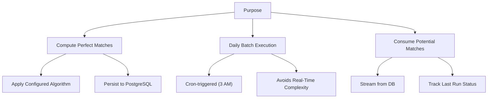

### **Scope**
- **Objective**: Daily computation and persistence of "perfect matches" for each group/domain by consuming existing potential matches.
- **Inputs**:
    - `PotentialMatchEntity` stream from PostgreSQL
    - DB-driven `MatchingConfiguration`
- **Process**:
    - Applies a selected `MatchingStrategy`
    - Tracks per-group last run status
- **Outputs**:
    - `PerfectMatchEntity` written to PostgreSQL
    - Updated `LastRunPerfectMatches` records

---

## **2) Triggers and Entry Points**

### **Trigger Flow Diagram**
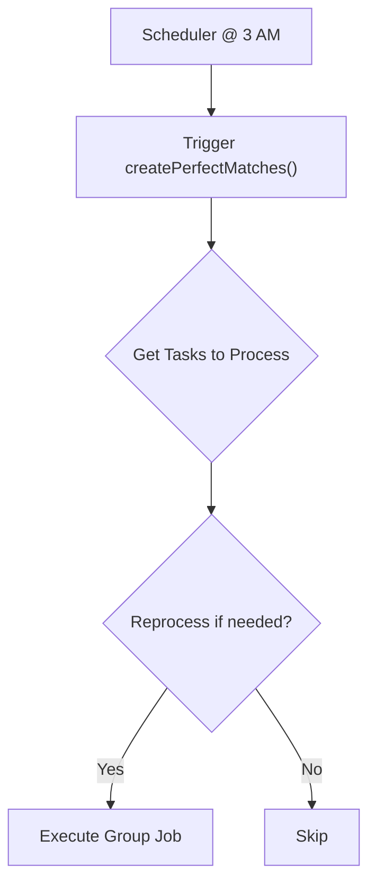

- **Scheduler**: `PerfectMatchesCreationScheduler.createPerfectMatches`
- **Cron**: `0 0 3 * * *` (Asia/Kolkata)
- **Eligibility**: Reprocess if `processedNodes > lastRun.nodeCount` OR `lastRun.status` is `PENDING` or `FAILED`.

---

## **3) Architecture Overview**

### **High-Level Architecture Diagram**
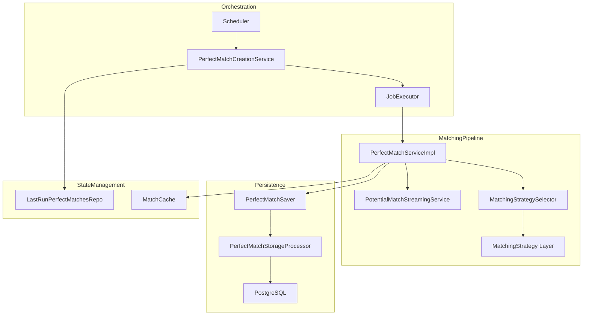

### **Key Layers**
- **Orchestration**: Manages scheduled execution, task discovery, and concurrency control.
- **Matching Pipeline**: Streams potential matches, applies a selected strategy, and manages memory.
- **Strategy Layer**: Pluggable algorithms for perfect match computation.
- **Persistence**: Handles high-performance batch writes to PostgreSQL.

---

## **4) End-to-End Flow (Per Cycle)**

### **End-to-End Flow Diagram**
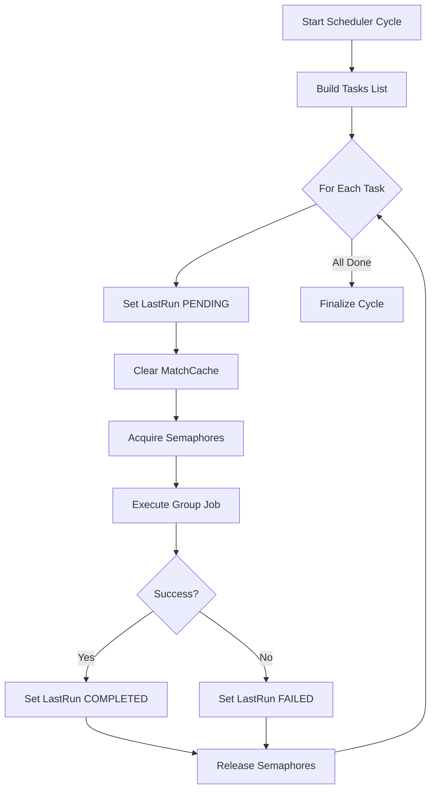

### **Detailed Flow**
1. **Scheduler**: Builds a list of (domain, group) tasks.
2. **For Each Task**:
    - Updates `LastRun` status to `PENDING`.
    - Clears `MatchCache` for the group.
    - Acquires domain and group semaphores.
    - Executes the group job with retries.
3. **On Completion**:
    - Updates `LastRun` to `COMPLETED` or `FAILED`.
    - Releases semaphores.
4. **After All Tasks**: Finalizes the cycle.

---

## **5) Components and Responsibilities**

### **Component Responsibility Diagram**
```mermaid
classDiagram
    class PerfectMatchesCreationScheduler {
        +Cron trigger
        +Iterates tasks
        +@Retry/@CircuitBreaker
    }

    class PerfectMatchCreationService {
        +Discovers tasks
        +Manages concurrency
        +Persists LastRun status
    }

    class PerfectMatchCreationJobExecutor {
        +Per-group execution
        +Retry with backoff
        +Per-group semaphore
    }

    class PerfectMatchServiceImpl {
        +Streams potential matches
        +Memory-aware processing
        +Invokes MatchingStrategy
        +Persists perfect matches
    }

    class MatchingStrategySelector {
        +Resolves strategy bean
    }

    class PotentialMatchStreamingService {
        +JDBC streaming
        +Retry on SQL errors
    }

    class PerfectMatchSaver {
        +Async saving facade
        +Timeout control
    }

    class PerfectMatchStorageProcessor {
        +Batched DB writes
        +COPY + upsert
        +Transactional, @Retryable
    }
```

### **Component Responsibilities**
| **Component** | **Responsibility** |
|---------------|--------------------|
| PerfectMatchesCreationScheduler | Cron trigger, task iteration, high-level retries |
| PerfectMatchCreationService | Task discovery, concurrency management, state persistence |
| PerfectMatchCreationJobExecutor | Per-group execution with retry logic |
| PerfectMatchServiceImpl | Match computation, memory management, persistence |
| MatchingStrategySelector | Strategy resolution based on configuration |
| PotentialMatchStreamingService | High-performance data streaming from PostgreSQL |
| PerfectMatchSaver | Async saving facade with timeouts |
| PerfectMatchStorageProcessor | Batched database writes with upsert |

---

## **6) Data Flow and Persistence**

### **Data Flow Diagram**
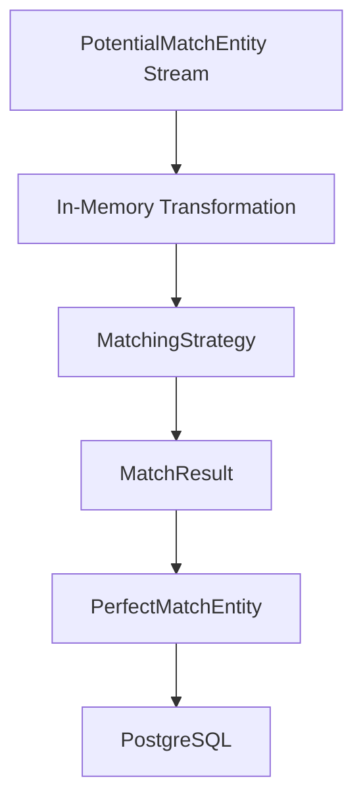

- **Inputs**:
    - `PotentialMatchEntity` stream
    - `MatchingConfiguration`
- **Transformations**:
    - Build per-node top-K adjacency
    - Apply matching strategy
- **Outputs**:
    - `PerfectMatchEntity`
    - `LastRunPerfectMatches`

### **Persistence Details**
- **Mechanism**: `COPY` to a temporary table, then `UPSERT` into the final table.
- **Batching**: Partitions input by `import.batch-size` (default 1000).
- **Resilience**: Timeout and retry mechanisms for robustness.

---

## **7) Concurrency, Backpressure, and Memory**

### **Concurrency Model Diagram**
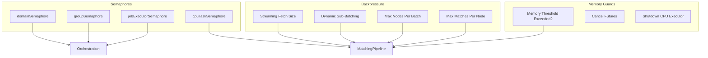

- **Semaphores**: Control concurrency at domain, group, job, and CPU task levels.
- **Backpressure**:
    - Streaming fetch size
    - Dynamic sub-batching based on memory
    - Limits on nodes per batch and matches per node
- **Memory Guards**:
    - Halts processing if memory threshold is exceeded
    - Cancels pending futures to protect the system

---

## **8) Matching Strategies (Pluggable)**

### **Strategy Layer Diagram**
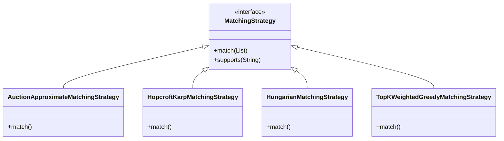

- **AuctionApproximateMatchingStrategy**: Near-optimal one-to-one assignments.
- **HopcroftKarpMatchingStrategy**: Maximum bipartite matching.
- **HungarianMatchingStrategy**: Optimal assignment.
- **TopKWeightedGreedyMatchingStrategy**: Top-K per node (memory-aware).

---

## **9) Resilience, Timeouts, Retries**

### **Resilience Mechanisms**
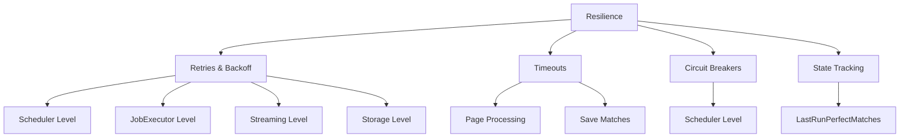

- **Retries**: Applied at scheduler, job executor, streaming, and storage levels.
- **Timeouts**: Page processing, save matches, and top-level operations.
- **Circuit Breakers**: Wraps per-group execution at the scheduler.
- **State Tracking**: `LastRunPerfectMatches` ensures idempotent re-runs.

---

## **10) Observability**

### **Observability Dashboard**
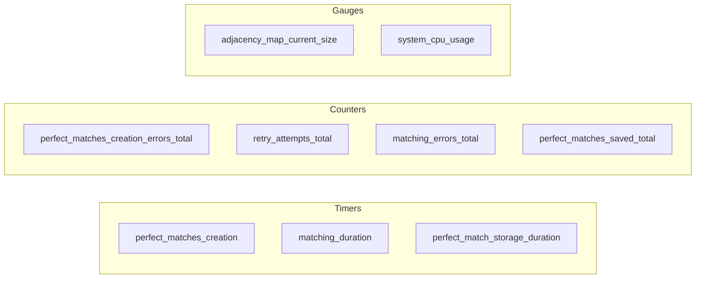

- **Metrics**: Timers, counters, and gauges for all critical operations.
- **Logging**: Consistent tagging (`groupId`, `domainId`, `cycleId`) for traceability.

---

## **11) Configuration (Selected)**

| **Category** | **Key** | **Default** |
|--------------|---------|-------------|
| Scheduling | `cron` | `0 0 3 * * *` |
| Concurrency | `match.max-concurrent-domains` | 2 |
| Retries | `match.max-retries` | 3 |
| Timeouts | `PAGE_PROCESSING_TIMEOUT_SECONDS` | 300 |
| Memory | `matching.max.memory.mb` | 1024 |
| Streaming | `BATCH_SIZE_FROM_CURSOR` | 5000 |

---

## **12) Key Sequences**

### **High-Level Sequence Diagram**
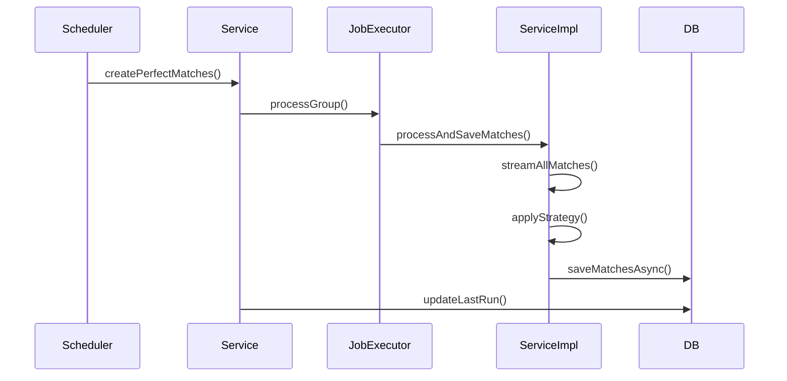

---

## **13) Data and Entities**

| **Entity** | **Purpose** |
|--------------------|-------------|
| `PotentialMatchEntity` | Input data for potential matches |
| `PerfectMatchEntity` | Output data for perfect matches |
| `LastRunPerfectMatches` | State tracking for idempotency and observability |
| `MatchingConfiguration` | Drives strategy selection and behavior |

---

## **14) Risks and Considerations**

| **Risk** | **Mitigation** |
|--------------|----------------|
| Memory Safety | Graceful shutdown on memory threshold breach |
| Concurrency Layering | Verify combined semaphore limits |
| Unused Semaphore | Remove or enforce for backpressure |
| Bean Uniqueness | Ensure unique bean names for strategies |

---

## **15) Extensibility**

### **Extensibility Points**
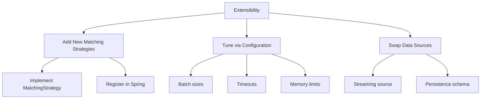

- **New Strategies**: Implement `MatchingStrategy` and register in Spring.
- **Configuration**: Tune batch sizes, timeouts, and memory limits via configuration files.
- **Data Sources**: Swap streaming source or persistence schema with limited changes.

---