# **Scheduled Potential Match Creation — High-Level Design (HLD) with Diagrams**

---

## **1) Purpose and Scope**

### **Purpose Diagram**
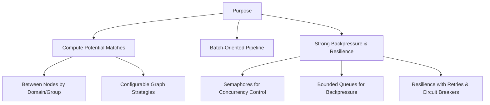

### **Scope**
- **Inputs**: Nodes with metadata and relationships
- **Process**: Compute potential matches using configurable graph strategies
- **Outputs**:
    - Transient edges stored in MapDB for staging/streaming
    - Finalized potential matches upserted into PostgreSQL
- **Constraints**:
    - Batch-oriented processing
    - Strong backpressure and resilience mechanisms

---

## **2) Architecture Overview**

### **High-Level Architecture Diagram**
```mermaid
graph TD
    subgraph Orchestration
        A[Scheduler] --> B[JobExecutor]
    end

    subgraph MatchingPipeline
        B --> C[PotentialMatchService]
        C --> D[NodeFetchService]
        C --> E[WeightFunctionResolver]
        C --> F[GraphPreProcessor]
        F --> G[SymmetricGraphBuilder]
        F --> H[BipartiteGraphBuilder]
    end

    subgraph PersistencePipeline
        G --> I[PotentialMatchComputationProcessor]
        H --> I
        I --> J[QueueManager]
        J --> K[GraphStore (MapDB)]
        J --> L[PotentialMatchSaver]
        L --> M[PostgreSQL]
    end

    subgraph Finalization
        I --> N[MatchesCreationFinalizer]
    end
```

### **Key Components**
- **Orchestration**: Scheduler, JobExecutor
- **Matching Pipeline**: Node fetching, weight function resolution, graph preprocessing, and building
- **Persistence Pipeline**: Queue management, MapDB staging, PostgreSQL persistence
- **Finalization**: Cleanup and completion signaling

---

## **3) End-to-End Flow**

### **End-to-End Flow Diagram**
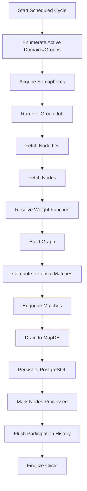

### **Detailed Flow**
1. **Scheduled Cycle**:
    - Triggered by cron schedule
    - Enumerates active domains and groups
    - Acquires semaphores for domain/group concurrency control
2. **Per-Group Job**:
    - Fetches node IDs and nodes
    - Resolves weight function based on metadata
    - Builds graph (symmetric or bipartite)
    - Computes potential matches
3. **Persistence**:
    - Enqueues matches for draining
    - Drains to MapDB for staging
    - Persists to PostgreSQL
4. **Finalization**:
    - Marks nodes as processed
    - Flushes participation history
    - Finalizes cycle and cleans up

---

## **4) Components and Responsibilities**

### **Component Responsibility Diagram**
```mermaid
classDiagram
    class PotentialMatchesCreationScheduler {
        +Scheduled entrypoint
        +Builds task list
        +Triggers JobExecutor
    }

    class PotentialMatchesCreationJobExecutor {
        +Paged per-group processing
        +Retry/backoff
        +Limits concurrent pages
    }

    class PotentialMatchServiceImpl {
        +Fetch node IDs/nodes
        +Derive weight function
        +Drive GraphPreProcessor
    }

    class NodeFetchService {
        +Async, transactional fetch
        +Partitioned fetch of nodes
        +Marks nodes processed
    }

    class WeightFunctionResolver {
        +Chooses metadata-based weight function
        +Registers configurable weight function
    }

    class GraphPreProcessor {
        +Selects strategy: SYMMETRIC/BIPARTITE/AUTO
        +Global build concurrency
        +Deadline watchdog
    }

    class SymmetricGraphBuilder {
        +Index nodes
        +Chunk computation with backpressure
        +Retry on chunks
        +Stream edges for final save
    }

    class BipartiteGraphBuilder {
        +Cartesian chunking across partitions
        +Process chunk matches
        +Persist chunk results to MapDB
        +Rebuild graph from MapDB
    }

    class PotentialMatchComputationProcessorImp {
        +Per-group queue manager
        +Enqueue/de-duplicate
        +Dynamic flush
        +Drain to MapDB and PostgreSQL
    }

    class QueueManagerFactory {
        +Bounded per-group queues
        +Periodic/boosted/blocking flush
        +TTL eviction
    }

    class GraphStore {
        +Transient edges in MapDB
        +Batched writes with commit
        +Stream by group
        +Cleanup
    }

    class PotentialMatchSaver {
        +Async PostgreSQL persistence
        +Temp table + COPY + upsert
        +Deletion and counting
    }
```

### **Component Responsibilities**
| **Component** | **Responsibility** |
|---------------|--------------------|
| PotentialMatchesCreationScheduler | Scheduled entrypoint, task list building, JobExecutor trigger |
| PotentialMatchesCreationJobExecutor | Paged per-group processing with retry/backoff |
| PotentialMatchServiceImpl | Node fetching, weight function resolution, graph preprocessing |
| NodeFetchService | Async, transactional node fetching and marking |
| WeightFunctionResolver | Metadata-based weight function selection |
| GraphPreProcessor | Strategy selection, global build concurrency |
| SymmetricGraphBuilder | Node indexing, chunked computation, edge streaming |
| BipartiteGraphBuilder | Partition chunking, match processing, MapDB persistence |
| PotentialMatchComputationProcessorImp | Queue management, flushing, PostgreSQL persistence |
| QueueManagerFactory | Bounded queue management, flush orchestration |
| GraphStore | Transient edge storage, batched writes, streaming, cleanup |
| PotentialMatchSaver | Async PostgreSQL persistence with upsert |

---

## **5) Concurrency and Backpressure**

### **Concurrency Model Diagram**
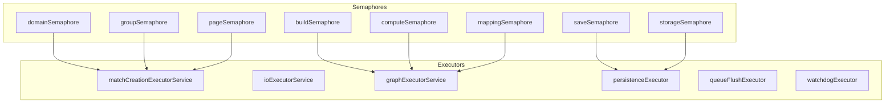

### **Backpressure Mechanisms**
- **Bounded Queues**: Capacity limits to prevent memory overload
- **Dynamic Flush Intervals**: Adjust based on queue fill ratio
- **Boosted Drains**: Triggered at fill ratio thresholds
- **Drops with Metrics**: Track and alert on queue overflows

### **Concurrency Controls**
- **Semaphores**: Control access to domains, groups, pages, builds, computations, mappings, saves
- **Executors**: Separate pools for orchestration, I/O, graph building, persistence, queue flushing, watchdog
- **Acquisition Order**: Domain → Group → Page → Build/Compute/Mapping → Save

---

## **6) Data and Persistence**

### **Data Model Diagram**
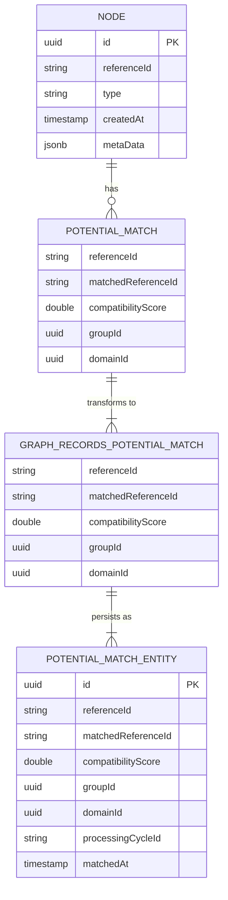

### **Persistence Layers**
- **MapDB (GraphStore)**:
    - Key: `groupId:chunkIndex:referenceId:matchedReferenceId` → serialized `PotentialMatch`
    - Batched persist with commit
    - Streaming and cleanup by group
- **PostgreSQL (PotentialMatchStorageProcessor)**:
    - COPY to temp table + upsert into `public.potential_matches`
    - Upsert key: `(group_id, reference_id, matched_reference_id)`
    - Incremental and finalization save paths

---

## **7) Resilience and Error Handling**

### **Resilience Mechanisms Diagram**
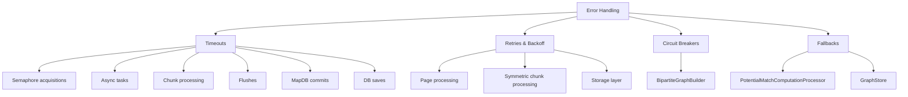

### **Error Handling Strategies**
- **Timeouts**: Applied to semaphore acquisitions, async tasks, chunk processing, flushes, MapDB commits, DB saves
- **Retries & Backoff**:
    - Page processing (configurable)
    - Symmetric chunk processing (exponential backoff)
    - Storage layer (`@Retryable` for batch saves/deletes)
- **Circuit Breakers/Fallbacks**:
    - BipartiteGraphBuilder (Resilience4j `@Retry`/`@CircuitBreaker` with fallback)
    - PotentialMatchComputationProcessor fallbacks for chunk and pending save
    - GraphStore fallbacks for persist/stream/clean
- **Shutdown**: Flush queues, remove instances, cleanup GraphStore, orderly executor termination

---

## **8) Observability**

### **Observability Diagram**
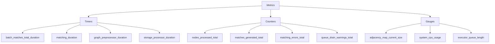

### **Key Metrics**
- **Timers**: End-to-end durations, graph build durations, storage durations
- **Counters**: Nodes processed, matches generated, errors, queue warnings
- **Gauges**: Map sizes, CPU usage, executor queue lengths

### **Logging**
- **Tags**: `groupId`, `domainId`, `cycleId`, `page/chunk`
- **Levels**: Warnings for backpressure, timeouts, partial pages

---

## **9) Configuration & Tuning**

### **Configuration Matrix**
| **Category** | **Key** | **Default** | **Effect** |
|--------------|---------|-------------|------------|
| Scheduling | match.save.delay | 600000 | Fixed delay between cycles (ms) |
| Concurrency | match.max-concurrent-domains | 2 | Domain-level parallelism |
| Paging | match.batch-limit | 500 | Nodes per page request |
| Retries | match.max-retries | 3 | Page retry count |
| Graph Build | graph.max-concurrent-builds | 2 | Build parallelism |
| Queue & Flush | match.queue.capacity | 500k..1M | Bounded queue size |
| Storage | matches.save.batch-size | 5000 | DB batch size |
| MapDB | mapdb.path | d:/web_dev/... | DB file path |

### **Tuning Guidance**
- Increase `maxConcurrentDomains`, pool sizes, and queue capacity to scale throughput
- Adjust `chunkSize`, `node-fetch batch-size`, and commit threads to match I/O bandwidth
- Use flush thresholds and boosted drains to manage bursty loads

---

## **10) Scaling & Capacity Planning**

### **Scaling Diagram**
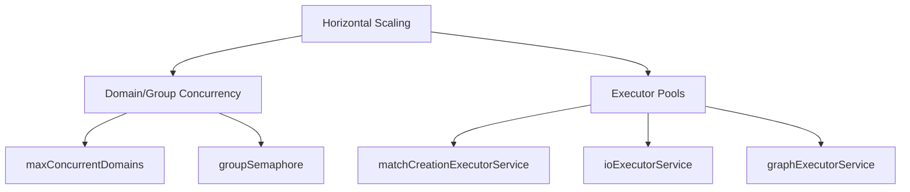

### **Capacity Planning**
- **Horizontal Scaling**: Via domain/group concurrency and executor pools
- **Backpressure**: Ensures bounded memory; queues provide smoothing for bursty producers
- **MapDB**: SSD-backed local paths recommended for low-latency persistence
- **Monitoring**: MapDB commit latency and queue flush throughput are critical

---

## **11) Security & Data Integrity**

### **Security Diagram**
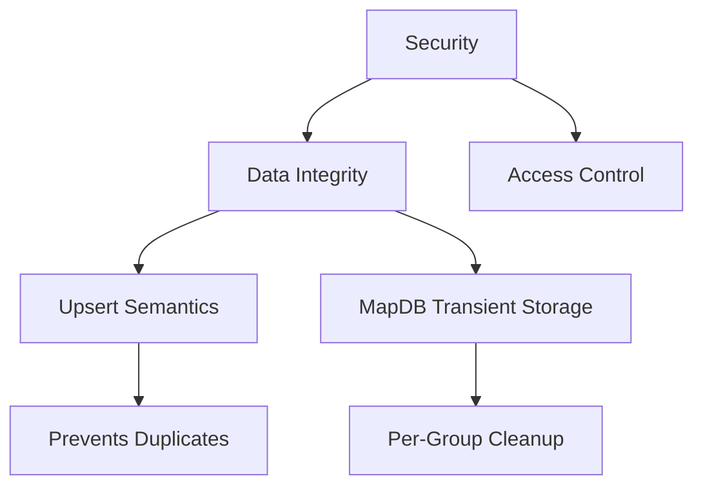

### **Key Measures**
- **Upsert Semantics**: Prevents duplicates in PostgreSQL on `(group_id, reference_id, matched_reference_id)`
- **MapDB**: Transient and per-group cleaned after finalization
- **Credentials**: Managed via Hikari configuration (externalized)
- **Idempotency**: Finalization re-reads edges for final write safely

---

## **12) Trade-offs & Known Considerations**

### **Trade-offs Diagram**
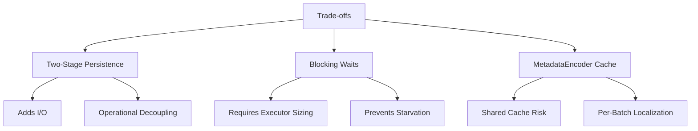

### **Considerations**
- **Two-Stage Persistence**: Adds I/O but provides backpressure and operational decoupling
- **Blocking Waits**: Requires adequate executor sizing to prevent starvation
- **MetadataEncoder Cache**: Batch-global cache reset not ideal if shared; prefer per-batch or strategy-local instances
- **Double-Processing Risk**: Verify dedupe/desired behavior in symmetric pipeline
- **Naming Consistency**: Minor log/metric duplication in GraphStore can be polished

---

## **13) Deployment & Operational Notes**

### **Deployment Diagram**
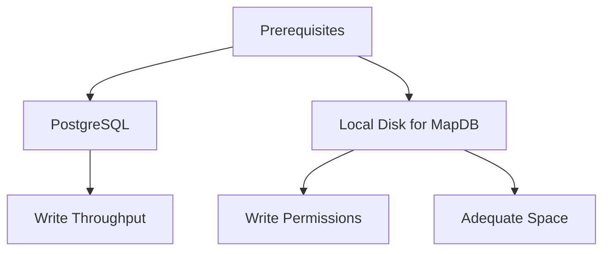

### **Operational Notes**
- **Prerequisites**: PostgreSQL reachable with sufficient write throughput; local disk path for MapDB
- **Shutdown**: Module flushes queues, removes queue managers, cleans GraphStore per group, closes executors
- **Portability**: Ensure `mapdb.path` configured appropriately for target OS/container

---

## **14) Sequence Flows**

### **Symmetric Strategy Flow**
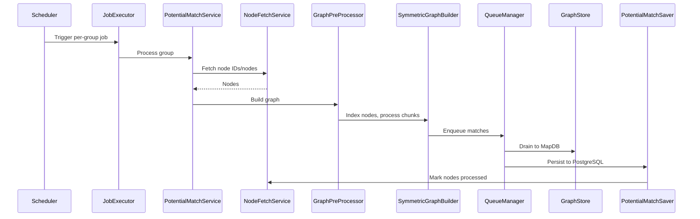

### **Bipartite Strategy Flow**
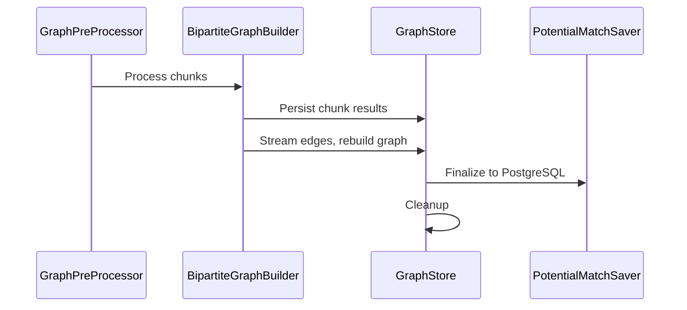

---

## **15) Glossary**

| **Term** | **Definition** |
|----------|----------------|
| **Domain/Group** | Logical segmentation of nodes for matching |
| **CycleId** | Unique identifier for a scheduled processing cycle |
| **MatchType** | SYMMETRIC (same-type nodes) vs BIPARTITE (left/right partitions) |
| **LSH** | Locality Sensitive Hashing for candidate pair narrowing |
| **MapDB** | Embedded key/value store for transient graph edge staging |

---

This completes the High-Level Design (HLD) with comprehensive diagrams for the **Scheduled Potential Match Creation** system.