# **Match Transfer to Client — Low-Level Design (LLD) with Diagrams**

---

## **1. Modules and Relationships**

### **Module Relationship Diagram**
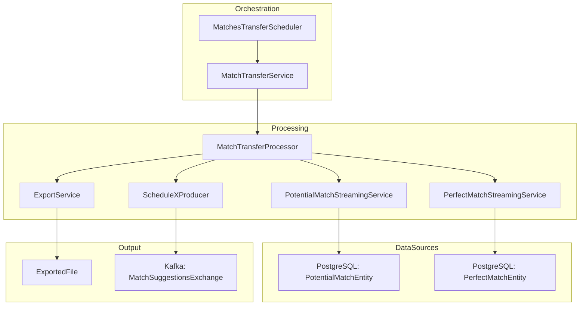

### **Key Relationships**
- **Orchestration**: `MatchesTransferScheduler` → `MatchTransferService` → `MatchTransferProcessor`
- **Data Streaming**: `PotentialMatchStreamingService` and `PerfectMatchStreamingService` fetch data from PostgreSQL
- **Export & Publish**: `ExportService` creates files, `ScheduleXProducer` publishes to Kafka
- **Concurrency**: Uses `matchTransferGroupExecutor` (per-group) and `matchTransferExecutor` (producers/consumer)

---

## **2. Runtime Topology (Executors, Queues, Concurrency)**

### **Runtime Topology Diagram**
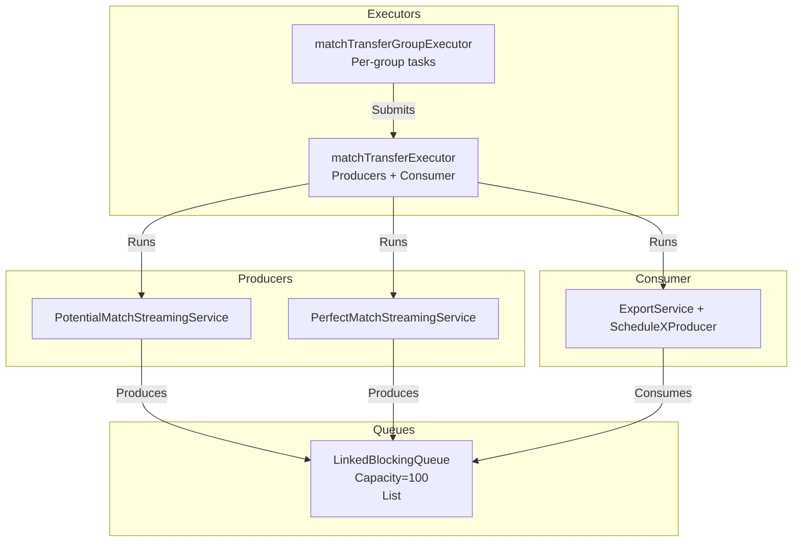

### **Concurrency Model**
- **Producers**: 2 threads per group (Potential + Perfect)
- **Consumer**: 1 thread per group (Export + Publish)
- **Queue**: Bounded blocking queue (capacity=100) with 300ms poll timeout
- **Termination**: AtomicBoolean `done` flag set when both producers complete

---

## **3. Detailed Component Specs**

### **3.1 MatchesTransferScheduler**
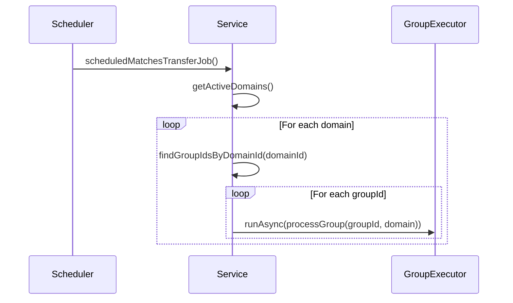

- **Dependencies**: `MatchTransferService`, `MatchingGroupRepository`, `DomainService`, `matchTransferGroupExecutor`
- **Behavior**:
    - Fetches active domains and their groups
    - Submits per-group tasks to `matchTransferGroupExecutor`
    - Registers gauges for executor metrics

### **3.2 MatchTransferService**
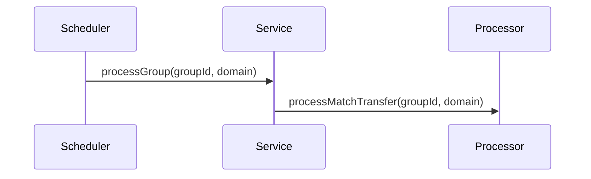

- **Behavior**: Thin wrapper delegating to `MatchTransferProcessor`

### **3.3 MatchTransferProcessor**
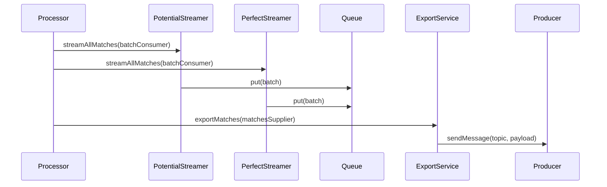

- **Dependencies**: `PotentialMatchStreamingService`, `PerfectMatchStreamingService`, `ExportService`, `ScheduleXProducer`
- **Behavior**:
    - Starts two streaming producers (Potential + Perfect)
    - Uses a bounded queue to buffer batches
    - Exports and publishes matches via a lazy stream supplier
    - Implements circuit breaker and retry logic

### **3.4 PotentialMatchStreamingService**
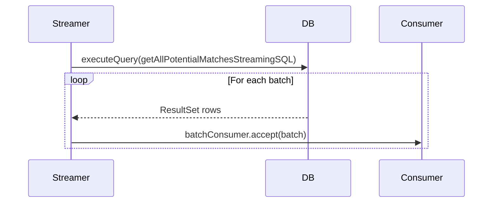

- **Behavior**:
    - Streams `PotentialMatchEntity` from PostgreSQL in batches
    - Retries up to 3 times on `SQLException` with incremental backoff

### **3.5 PerfectMatchStreamingService**
- **Behavior**: Identical to `PotentialMatchStreamingService` but for `PerfectMatchEntity`

---

## **4. Data Model**

### **Data Model Diagram**
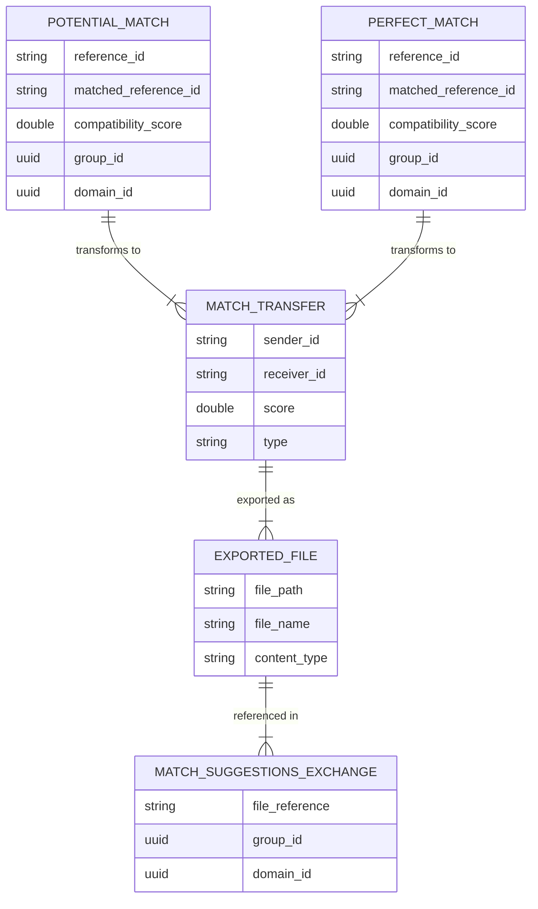

### **Key Entities**
- **PotentialMatchEntity**: Input data for potential matches
- **PerfectMatchEntity**: Input data for perfect matches
- **MatchTransfer**: DTO combining both match types
- **ExportedFile**: File metadata for exported matches
- **MatchSuggestionsExchange**: Kafka message payload

---

## **5. Pipeline Algorithms & Pseudocode**

### **Core Pipeline Algorithm**
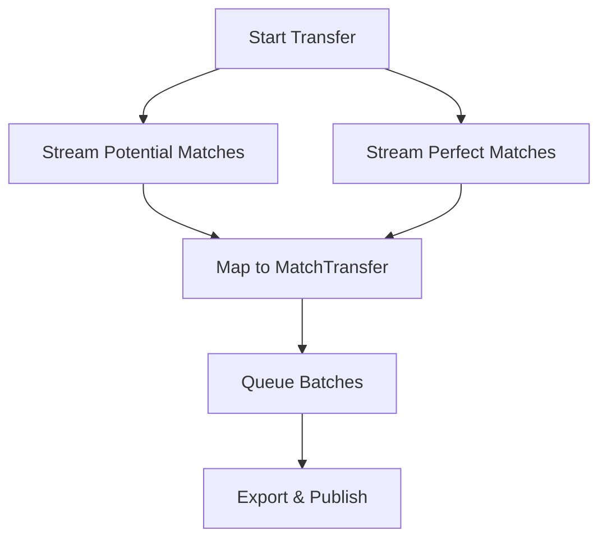

### **Producer-Consumer Loop**
```java
// Producers
CompletableFuture<Void> potentialFuture = runAsync(() ->
    streamPotential(groupId, domainId, batch -> {
        transfers = map(batch);
        queue.put(transfers);
    })
);

CompletableFuture<Void> perfectFuture = runAsync(() ->
    streamPerfect(groupId, domainId, batch -> {
        transfers = map(batch);
        queue.put(transfers);
    })
);

// Consumer
Supplier<Stream<MatchTransfer>> matchesSupplier = () ->
    Stream.generate(() -> queue.poll(300, TimeUnit.MILLISECONDS))
        .takeWhile(batch -> !(done && (batch == null || batch.isEmpty())))
        .filter(Objects::nonNull)
        .flatMap(List::stream);

// Export & Publish
exportAndSend(groupId, domain, matchesSupplier);
```

### **Streaming Algorithm**
```java
for (int retries = 0; retries <= 3; retries++) {
    try (Connection conn; PreparedStatement ps; ResultSet rs) {
        conn.setAutoCommit(false);
        ps.setFetchSize(batchSize);
        while (rs.next()) {
            buffer.add(mapRow(rs));
            if (buffer.size() == batchSize) {
                batchConsumer.accept(buffer);
                buffer = new ArrayList<>(batchSize);
            }
        }
        if (!buffer.isEmpty()) batchConsumer.accept(buffer);
        conn.commit();
        return;
    } catch (SQLException e) {
        if (retries == 3) throw e;
        Thread.sleep(1000 * (retries + 1));
    }
}
```

---

## **6. Error Handling, Timeouts, Retries**

### **Error Handling Flow**
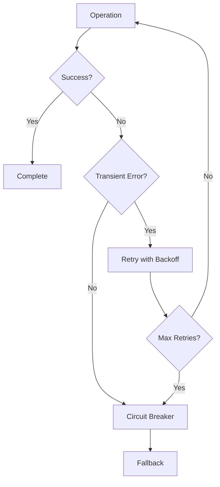

### **Key Mechanisms**
- **Circuit Breaker**: `processMatchTransfer` trips to fallback on repeated failures
- **Retries**:
    - Streaming: 3 retries with incremental backoff (1s, 2s, 3s)
    - Export: `@Retryable` on `ConnectException`/`TimeoutException` (3 attempts, exponential backoff)
- **Queue Operations**:
    - Producers: `queue.put` (blocks if full)
    - Consumer: `queue.poll(300ms)` (non-blocking with timeout)

---

## **7. Metrics and Logging**

### **Metrics Dashboard**
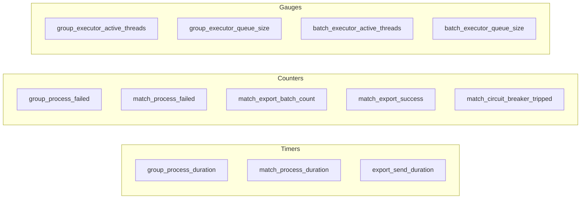

### **Key Metrics**
- **Timers**: `group_process_duration`, `match_process_duration`, `export_send_duration`
- **Counters**: `group_process_failed`, `match_process_failed`, `match_export_success`, `match_circuit_breaker_tripped`
- **Gauges**: Executor thread/queue metrics

### **Logging**
- **Structured Logs**: Include `groupId`, `domainId`, batch sizes, and record counts
- **Error Logs**: Stack traces for exceptions, retry attempts, and circuit breaker trips

---

## **8. Configuration Matrix**

| **Key** | **Default** | **Component** | **Effect** |
|---------|-------------|---------------|------------|
| `match.transfer.cron-schedule` | N/A | Scheduler | Cron schedule for job |
| `match.transfer.batch-size` | 100000 | Streaming | JDBC fetch size and batch list size |
| `matchTransferGroupExecutor` | External bean | Scheduler | Controls per-group parallelism |
| `matchTransferExecutor` | External bean | Processor | Controls producers/consumer concurrency |
| `Topic suffix` | `matches-suggestions` | Processor | Final topic name = domain-name-lc + "-" + suffix |

---

## **9. Execution Sequences**

### **9.1 End-to-End Transfer Sequence**
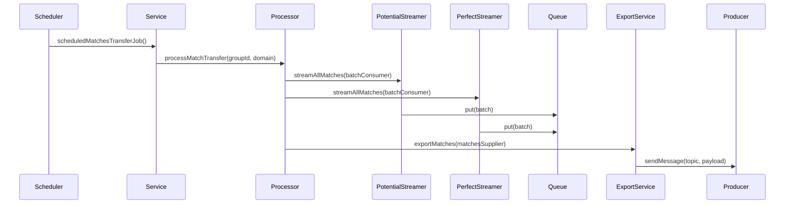

### **9.2 Producer-Consumer Interaction**
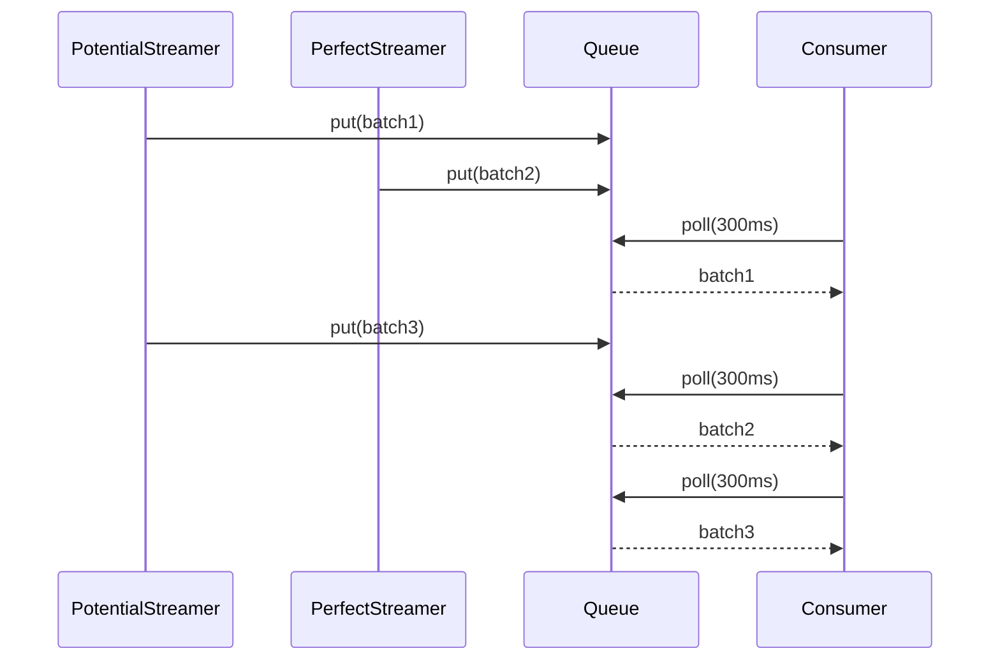

---

## **10. External Contracts and Assumptions**

### **External Service Interfaces**
```mermaid
interfaceDiagram
    interface DomainService {
        + List<Domain> getActiveDomains()
    }

    interface MatchingGroupRepository {
        + List<UUID> findGroupIdsByDomainId(UUID domainId)
    }

    interface ResponseMakerUtility {
        + MatchTransfer buildMatchTransfer(Entity entity)
    }

    interface ExportService {
        + CompletableFuture<ExportedFile> exportMatches(Supplier<Stream<MatchTransfer>>, UUID groupId, UUID domainId)
    }

    interface ScheduleXProducer {
        + void sendMessage(String topic, String key, String payload, boolean sync)
    }
```

### **Assumptions**
- PostgreSQL supports streaming queries with `setFetchSize`
- Kafka topic naming follows `domain-name-lc + "-" + MATCH_EXPORT_TOPIC`
- `ExportedFile` is accessible to clients via the provided path

---

## **11. Risks, Nuances, Recommendations**

### **Risk Mitigation Matrix**
| **Risk** | **Impact** | **Likelihood** | **Mitigation** |
|----------|------------|----------------|----------------|
| Memory pressure from large batches | High | Medium | Reduce `batchSize` or queue capacity |
| Gauge re-registration | Low | High | Register gauges once with strong references |
| Queue deadlock | Medium | Low | Ensure producer exceptions surface to CFs |
| Duplicate matches | Medium | Medium | Add deduplication in consumer if needed |
| Backpressure observability | Medium | High | Publish queue fill ratio metrics |

### **Recommendations**
1. **Memory Management**: Reduce `batchSize` (e.g., 10,000) and queue capacity (e.g., 10) to limit memory usage
2. **Gauge Registration**: Register executor gauges once at startup
3. **Ordering/Deduplication**: Add logic in consumer if client expects uniqueness
4. **Backpressure**: Monitor queue fill ratio and alert on high values
5. **Scheduling**: Ensure `matchTransferGroupExecutor` is sized for peak parallelism

---

## **12. Testing Strategy**

### **Testing Pyramid**
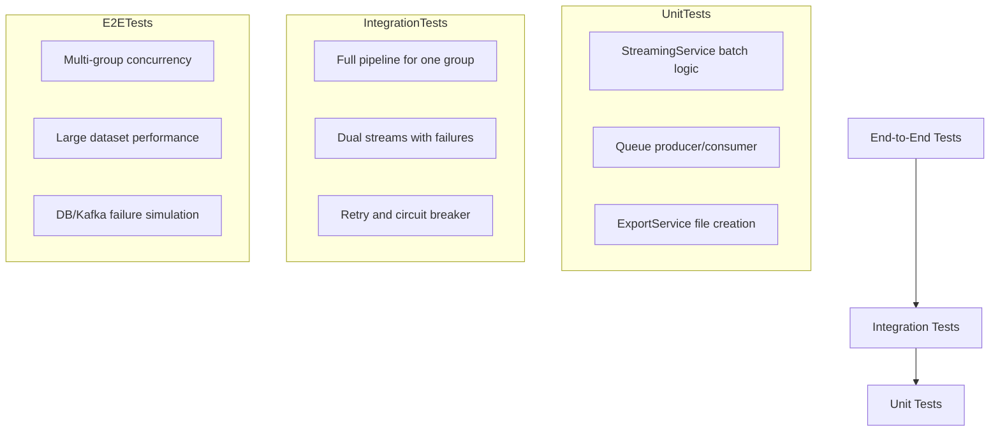

### **Test Categories**
- **Unit Tests**: Streaming batch logic, queue behavior, export file creation
- **Integration Tests**: Full pipeline, dual streams, retry/circuit breaker
- **Performance Tests**: Large datasets, concurrency, memory usage
- **Resilience Tests**: DB/Kafka failures, circuit breaker trips

---