# Scheduled Potential Match Creation — Low‑Level Design (LLD) with Diagrams

## Table of Contents
- [1. Modules and Relationships](#1-modules-and-relationships)
- [2. Runtime Topology (Threads, Queues, Semaphores)](#2-runtime-topology-threads-queues-semaphores)
- [3. Detailed Component Specs](#3-detailed-component-specs)
- [4. Data Model](#4-data-model)
- [5. Key Algorithms and Pseudocode](#5-key-algorithms-and-pseudocode)
- [6. Error Handling, Timeouts, Retries](#6-error-handling-timeouts-retries)
- [7. Metrics and Logging](#7-metrics-and-logging)
- [8. Configuration Matrix](#8-configuration-matrix)
- [9. Sequences](#9-sequences)
- [10. External Contracts and Assumptions](#10-external-contracts-and-assumptions)
- [11. Known Risks and Recommendations](#11-known-risks-and-recommendations)
- [12. Testing Strategy (Pointers)](#12-testing-strategy-pointers)

---

## 1. Modules and Relationships

### Module Relationship Diagram
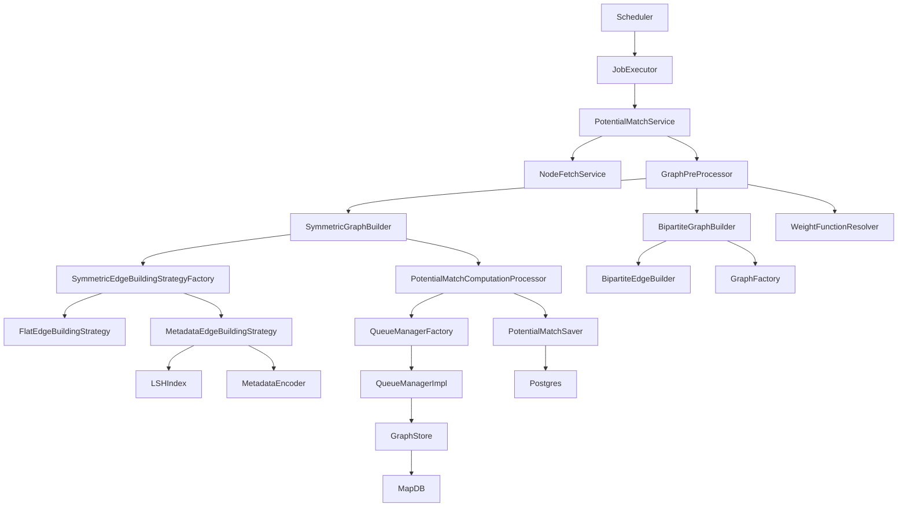

### Key Relationships:
- **Orchestration**: `PotentialMatchesCreationScheduler` → `PotentialMatchesCreationJobExecutor`
- **Matching Pipeline**: `PotentialMatchServiceImpl` → `NodeFetchService` → `GraphPreProcessor`
    - `GraphPreProcessor` → `SymmetricGraphBuilder` or `BipartiteGraphBuilder`
    - `SymmetricEdgeBuildingStrategyFactory` → `FlatEdgeBuildingStrategy` | `MetadataEdgeBuildingStrategy(+LSH)`
- **Persistence Pipeline**: `PotentialMatchComputationProcessorImp` → `QueueManagerImpl` → `GraphStore(MapDB)` + `PotentialMatchSaver(Postgres)`
- **Finalization**: `GraphPreProcessor/SymmetricGraphBuilder` & `BipartiteGraphBuilder` stream from `GraphStore` → `PotentialMatchSaver.finalize` → cleanup

---

## 2. Runtime Topology (Threads, Queues, Semaphores)

### Runtime Topology Diagram
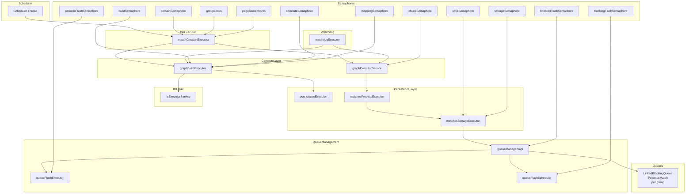

### Resource Acquisition Order:
1. `domainSemaphore` → 2) `groupSemaphore` → 3) `pageSemaphore` → 4) `build/compute/mapping semaphores`

---

## 3. Detailed Component Specs

### 3.1 PotentialMatchesCreationScheduler
- **Trigger**: `@Scheduled(fixedDelayString = "${match.save.delay:600000}")`
- **Flow**:
    - Build cycleId; get domains; list tasks: (domain, groupId)
    - For each task: `processGroupTask(groupId, domainId, cycleId)`
        - Acquire `domainSemaphore` (tryAcquire 30s)
        - Acquire `groupSemaphore` (tryAcquire 30s)
        - `jobExecutor.processGroup(...)`
        - `thenRun doFlushLoop(groupId, domainId, cycleId)`
    - After all batches complete: `finalize(true)` per task, log total
    - Cleanup idle groupLocks; stop timer
- **doFlushLoop**:
    - Instantiate `QueueManagerImpl` via `QueueManagerFactory`
    - Loop up to maxIterations: check queue size, call `QueueManagerImpl.flushQueueBlocking(groupId, flushSignalCallback)`
    - Delay 300ms if remaining; enforce `shutdownLimitSeconds`; record drops
- **Metrics**:
    - `batch_matches_total_duration`
    - `matches_creation_error`
- **Config**: `queueCapacity`, `flushIntervalSeconds`, `drainWarningThreshold`, `boostBatchFactor`, `maxFinalBatchSize`, `shutdownLimitSeconds`, `maxIterations`, `maxConcurrentDomains`

### 3.2 PotentialMatchesCreationJobExecutor
- `processGroup(groupId, domainId, cycleId)` → `CompletableFuture<Void>`
    - Acquire `pageSemaphore[groupId]` (60s)
    - Compute `maxPages = ceil(nodesLimitForFullJob / batchLimit)`
    - For each page:
        - `processPageWithRetriesSync` (maxRetries, exponential backoff, 600s per page)
        - Early terminate on first empty page
        - Break if `hasMoreNodes` false
    - Finally: release semaphore; prune pageSemaphores entry if idle
- **Metrics**:
    - `group.processing.errors`
    - `match.retry.attempts`, `match.retries.exhausted`
- **Config**: `batchLimit`, `nodesLimitForFullJob`, `maxRetries`, `retryDelayMillis`, `maxConcurrentPages`

### 3.3 PotentialMatchServiceImpl
- `matchByGroup(MatchingRequest req, page, cycleId)` → `CompletableFuture<NodesCount>`
    - `limit = clamp(request.limit, [1..5000])` or default 1000
    - `fetchNodeIdsAsync(groupId, domainId, PageRequest.of(page, limit), createdAfter)`
    - If > `MAX_NODES` (2000) → warn + error + throw
    - If empty → return `NodesCount(0,false)`
    - `fetchNodesInSubBatches(nodeIds, groupId, createdAfter)`
        - Partition by `NODE_ID_SUB_BATCH_SIZE` (1000), semaphore(4) to fetch in parallel
        - Combine with `allOf`; per future `get(300s)`; returns `List<Node>`
    - `bufferMatchParticipationHistory(nodes)` → queue entries
    - `processGraphAndMatchesAsync(nodes, request, groupId, domainId, numberOfNodes, limit, cycleId)`
        - `weightFunctionKey` via `WeightFunctionResolver`
        - `graphPreProcessor.buildGraph(nodes, request)`
        - `thenAcceptAsync`: `markNodesAsProcessed(nodeIds)`
- **Flush history**:
    - Every `HISTORY_FLUSH_INTERVAL` pages (5), async `saveAll(historyBuffer)` on `ioExecutor`
- **Metrics**:
    - `matching_duration`, `matching_errors`
    - `nodes_processed_total`
    - `node_count_exceeded`, `graph_processing_errors`
- **Config**: min/max limit; `MAX_NODES`; sub-batch size; history flush interval

### 3.4 NodeFetchService
- `fetchNodeIdsAsync(groupId, domainId, pageable, createdAfter)` → `CF<List<UUID>>`
    - Read-only REQUIRES_NEW transaction via `TransactionTemplate`
    - `nodeRepository.findIdsByGroupIdAndDomainId(...)`
    - `orTimeout(futureTimeoutSeconds)`
- `fetchNodesInBatchesAsync(nodeIds, groupId, createdAfter)` → `CF<List<Node>>`
    - Partition by `${node-fetch.batch-size:1000}`
    - For each batch: `nodeRepository.findByIdsWithMetadataAsync(batch)`
    - Filter by `createdAfter` at the end
- `markNodesAsProcessed(nodeIds, groupId)` → `@Transactional` write
- **Metrics**: `node_fetch_*` timers and counters
- **Config**: `futureTimeoutSeconds`, `batchSize`

### 3.5 WeightFunctionResolver
- `resolveWeightFunctionKey(groupId)` → String
    - Get metadata keys; filter non-null, !blank, !startsWith("temp_"), cap 10
    - Compose key: `"{groupId}-{sorted-lowercased-headers-joined}"`
    - Register if absent in `WeightFunctionRegistry` with `ConfigurableMetadataWeightFunction(validHeaders)`
    - Default "flat" if none

### 3.6 GraphPreProcessor
- `buildGraph(nodes, request)` → `CF<GraphRecords.GraphResult>`
    - Acquire `buildSemaphore` (60s)
    - Async supply:
        - Determine match type:
            - If `SYMMETRIC` or `AUTO` without usable partitioning → `symmetricGraphBuilder.build`
            - If `BIPARTITE` or `AUTO` → partition via `PartitionStrategy`; infer match type; call symmetric or bipartite builder
    - Watchdog `orTimeout(BUILD_TIMEOUT_MINUTES=15)`
    - On completion: stop timers, increment errors/timeouts; release semaphore
- `determineMatchType(groupId, domainId)`: sample stored match to infer type via node types
- **Metrics**: `graph_preprocessor_duration`, `graph_build_duration`, `graph_preprocessor_partition`, errors/timeouts
- **Config**: `graph.max-concurrent-builds`

### 3.7 SymmetricGraphBuilder
- `Build(newNodes, MatchingRequest)`:
    - Create strategy = `strategyFactory.createStrategy(weightKey, nodes)`
    - `indexFuture = strategy.indexNodes(newNodes, page)`
    - `newNodeChunks = partition(newNodes, chunkSize)`
    - After `indexFuture`:
        - `processNodeChunks(newNodeChunks, strategy,...)`
            - Compute path: `ExecutorCompletionService<ChunkResult>`
            - Mapping path: `BlockingQueue<ChunkResult>` → `processMappingAsync(result,...)`
            - For each chunk: `processChunkWithRetry` → `processChunk`
                - `processChunk`: compute `strategy.processBatch(...)` → `PotentialMatchComputationProcessor.processChunkMatches` → returns `ChunkResult`
            - Save pending matches at end → `finalizeGraph(...)`:
                - `streamEdges(groupId, domainId, processingCycleId, topK)`
                - `saveFinalMatches(...)`, `getFinalMatchCount()`, cleanup
- **Concurrency**:
    - `computeSemaphore` (maxConcurrentBatches), `mappingSemaphore` (maxConcurrentMappings)
- **Retry**: `chunkRetryMaxAttempts` with exponential backoff
- **Timeouts**: `chunkProcessingTimeoutSeconds`
- **Metrics**: `graph_builder_*` timers/counters
- **Lifecycle**: `@PostConstruct` (gauges), `@PreDestroy` (executor shutdown)

### 3.8 SymmetricEdgeBuildingStrategyFactory
- `createStrategy(weightFunctionKey, nodes)` → `SymmetricEdgeBuildingStrategy`
    - If "flat" → `FlatEdgeBuildingStrategy`
    - Else → `MetadataEdgeBuildingStrategy(EdgeBuildingConfig, LSHIndex, MetadataEncoder, executor, EdgeProcessor)`
- Note: constructs Metadata strategy per request; Flat is a singleton bean.

### 3.9 MetadataEdgeBuildingStrategy
- **State**:
    - `lastModified` per nodeId; `prepState` (UNINITIALIZED/IN_FLIGHT/SUCCESS/FAILED); `preparationFuture` for indexing
    - `chunkSemaphore(4)`
    - Current snapshot of LSH index snapshot
- `indexNodes(nodes, page)` → `CF<Void>`
    - Ensures single indexing flight (prepState CAS); delegate to `IndexUtils.indexNodes(...)` with retries/backoff
- `processBatch(batch,..., matches,..., request, context)`
    - Acquire `chunkSemaphore` (timeout = `chunkTimeoutSeconds`)
    - Delegate to `edgeProcessor.processBatchSync(...)`, append to matches
    - Release semaphore
- **Metrics**: init logs, batch logs
- **Config**: `candidateLimit`, `similarityThreshold`, `maxRetries`, `retryDelayMillis`, `chunkTimeoutSeconds`

### 3.10 BipartiteGraphBuilder
- `build(leftPartition, rightPartition, request)` → `CF<GraphResult>`
    - Partition left/right by `chunkSize`
    - `processChunks`:
        - `computeSemaphore(maxConcurrentBatches)`
        - Submit pairs `<left[i], right[j]>` using `ExecutorCompletionService`
            - `submitChunk` → `processBipartiteChunk(leftBatch, rightBatch, request, chunkIndex)`
        - On each completion:
            - Persist chunk matches to `GraphStore.persistEdgesAsync(...)`, record timer
            - Submit next pair
        - Wait for all persists (dynamic timeout)
        - Build final graph: `streamEdges` from `GraphStore`, add edges, convert to final matches
        - `cleanEdges(groupId)`, metrics, complete resultFuture
- `processBipartiteChunk`:
    - If `weightFunctionKey == "flat"`: every left×right pair becomes match with score 1.0
    - Else: `BipartiteEdgeBuilder.processBatch(..., similarityThreshold)`
- **Metrics**: `bipartite_*` timers/counters
- **Lifecycle**: `@PostConstruct` gauges; `@PreDestroy` shutdown executors

### 3.11 BipartiteEdgeBuilder
- `processBatch(leftBatch, rightBatch, matches, edges, groupId, domainId, context)`
    - Double loop compute; `compatibilityCalculator.calculate(node1, node2)`
    - If score > `similarityThreshold` → add Edge + PotentialMatch
    - `metrics.recordEdgeWeight(score)`
- **Metrics**: `bipartite_builder_edge_compute` timer; `matches_generated_total` counter
- **Config**: `bipartite.edge.build.similarity-threshold`

### 3.12 PotentialMatchComputationProcessorImp
- `processChunkMatches(chunkResult, groupId, domainId, processingCycleId, matchBatchSize)` → `CF<Void>`
    - Get `QueueManagerImpl` via factory
    - Adjust flush interval based on queue fill ratio (> `flushQueueThreshold`)
    - Build `uniqueMatches`, offer to queue (100ms per offer)
    - `processBatchIfNeeded(manager, chunkResult, batchSize, ...)` → drain up to `batchSize` and save
        - `saveMatchBatch(matches, ...)` → `CF<Void>`:
            - `GraphStore.persistEdgesAsync(matches,...)`
            - `PotentialMatchSaver.saveMatchesAsync(... finalize=false)` launched but CF not awaited
- `savePendingMatches(groupId, domainId, processingCycleId, batchSize)` → drain-only path
- `saveFinalMatches(groupId, domainId, processingCycleId, stream, topK)` → `CF<Void>`
    - Acquire `saveSemaphore`; stream edges from `GraphStore`
    - Convert to `PotentialMatchEntity`, group by referenceId, save in temp-table batches → finalize upsert
    - `OrTimeout(finalSaveTimeoutSeconds)`
- **Blocking flush**:
    - `savePendingMatchesBlocking(groupId, domainId, batchSize?, processingCycleId)`
    - Drain queue in loops, persist edges to MapDB, respect `matchSaveTimeoutSeconds` overall
- `cleanup(groupId)`: flush Q, remove queue, delete DB matches (async), defer GraphStore cleanup to Edge counting
- **Metrics**: mapping/save timers/counters, queue drops, flush adjust events
- **Config**: queue capacity, flush intervals, thresholds, `max-final-batch-size`; timeouts; temp-table batch size

### 3.13 QueueManagerFactory / QueueManagerImpl
- **Factory**: `create(QueueConfig)` → getOrCreate per groupId (`WeakReference`)
- **QueueManagerImpl**:
    - Fields: `LinkedBlockingQueue<PotentialMatch>` with capacity; flush interval (atomic); scheduled periodic flush task
    - `startPeriodicFlush`:
        - If queue size grows by 10% since last flush or exceeds reduced max → call `FlushUtils.executeFlush(...)`
        - Metrics update, `checkQueueHealth`
    - `setFlushInterval(newIntervalSeconds)`: debounced; reschedules periodic flush
    - `flushQueueBlocking(groupId, flushCallback)`: drain up to `maxFinalBatchSize` via `FlushUtils.executeBlockingFlush`
    - `flushAllQueuesBlocking(...)`: do for all instances
    - `checkQueueHealth`: if fillRatio > `drainWarningThreshold` → boosted flush via `FlushUtils.executeBoostedFlush(...)`
    - TTL eviction: schedule check to remove after `TTL_SECONDS`
    - `remove(groupId)`/`removeAll()`: cancel scheduled tasks and delete instances
- **Flush callback signature**:
    - `QuadFunction<UUID groupId, UUID domainId, Integer batchSize, String cycleId, CompletableFuture<Void>>`
    - Typically points to `PotentialMatchComputationProcessor.savePendingMatches`

### 3.14 GraphStore (MapDB)
- `init()`: Ensure path/dirs; `DBMaker.fileDB` with mmap, TX, start size, increment; create/open map
- `persistEdgesAsync(matches, groupId, chunkIndex)` → `CF<Void>`
    - Partition by `adjustBatchSize`; for each sub-batch: `runAsync persistBatchAsync` on `mapdbExecutor`
    - After all: commit on `commitExecutor`; update metrics
- `persistBatchAsync`: for each match → key = `groupId:chunkIndex:refId:matchedRefId`; `map.put(key, serialized bytes)`
- `streamEdges(domainId, groupId)` → `AutoCloseableStream<Edge>`:
    - Iterate map keys starting with `groupId:`, deserialize PotentialMatch and convert to Edge
- `cleanEdges(groupId)`: iterate keys, remove by batch, commit between batches
- **Fallbacks**: persist, stream, clean return no-ops or empty stream
- **Metrics**: persist/commit/stream/clean latency + counters; executor gauges
- **Config**: `mapdb.path`, `mapdb.batch-size`, commit threads
- **Serialization**: Kryo via `SerializerContext` (thread-local)

### 3.15 PotentialMatchSaver / PotentialMatchStorageProcessor
- **PotentialMatchSaver**:
    - `saveMatchesAsync(matches, groupId, domainId, cycleId, finalize)` → `CF<Void>`
        - `finalize=false` → `savePotentialMatches`
        - `finalize=true` → `saveAndFinalizeMatches` (upsert final)
        - `OrTimeout(30 min)`
- **PotentialMatchStorageProcessor**:
    - `savePotentialMatches`: acquire `storageSemaphore`, runAsync `saveInBatches` on `storageExecutor` (timeout=5min)
        - `saveBatch` (Transactional, `@Retryable`): COPY to temp table; INSERT...ON CONFLICT DO UPDATE; commit
    - `saveAndFinalizeMatches`: acquire `storageSemaphore`, copy to temp table, upsert final via SQL, drop temp table, commit
    - `countFinalMatches(groupId, domainId, cycleId)`
    - `deleteByGroupId(groupId)` → `@Retryable`
- **Metrics**: `storage_processor_*` durations, errors, counters
- **Config**: `matches.save.batch-size`

### 3.16 MetadataEncoder / LSHIndex
- **MetadataEncoder**:
    - `encode(Map<String,String>)` → `int[]` (value string normalization, ID mapping via `idCache`)
    - `encodeBatch(entries)` → `List<Entry<int[], UUID>>`; clears `idCache`/`idCounter` per batch
- **LSHIndex** (interface):
    - `prepareAsync`, `insertBatch`, `insertSingle`
    - `queryAsync`, `queryAsyncAll`, `querySync`
    - `totalBucketsCount`, `isBuilding`, `clean`

---

## 4. Data Model

### Data Model Diagram
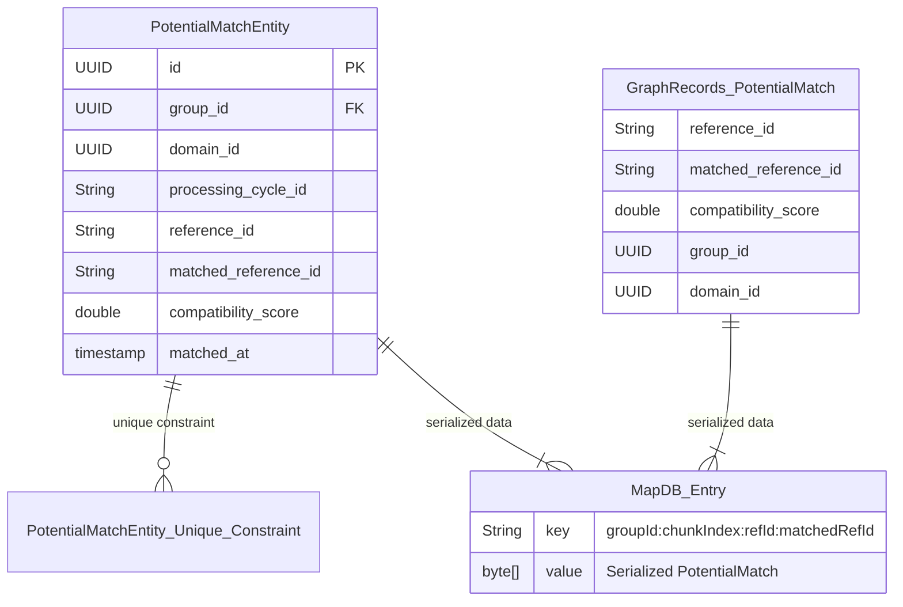

### Key Entities:
- **GraphRecords.PotentialMatch**:
    - `referenceId: String`
    - `matchedReferenceId: String`
    - `compatibilityScore: double`
    - `groupId: UUID`
    - `domainId: UUID`
- **PotentialMatchEntity (DB)**:
    - `id (UUID)`, `group_id (UUID)`, `domain_id (UUID)`, `processing_cycle_id (String)`
    - `reference_id (String)`, `matched_reference_id (String)`, `compatibility_score (double)`, `matched_at (timestamp)`
    - PK/Unique: `(group_id, reference_id, matched_reference_id)`
- **MapDB Key**:
    - `"{groupId}:{chunkIndex}:{referenceId}:{matchedReferenceId}"` → `byte[]`

### Recommended Indexes:
```sql
CREATE UNIQUE INDEX idx_potential_matches_unique 
ON potential_matches (group_id, reference_id, matched_reference_id);

CREATE INDEX idx_potential_matches_group_domain_cycle 
ON potential_matches (group_id, domain_id, processing_cycle_id);

CREATE INDEX idx_potential_matches_group_reference 
ON potential_matches (group_id, reference_id);
```

---

## 5. Key Algorithms and Pseudocode

### 5.1 Scheduler → processGroupTask
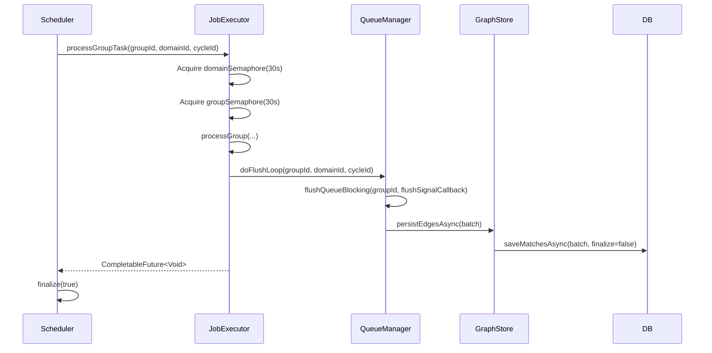

### 5.2 SymmetricGraphBuilder Chunk Processing
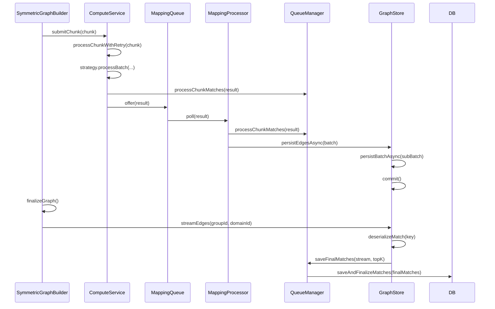

### 5.3 BipartiteGraphBuilder Chunk Processing
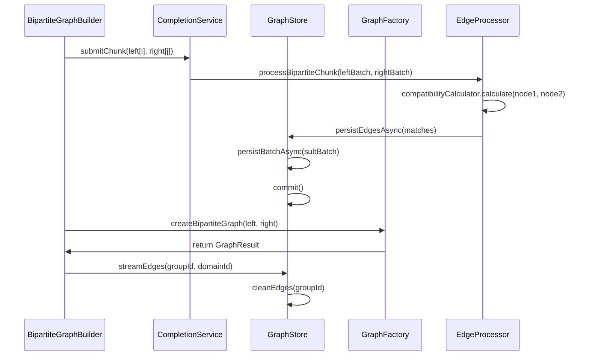

---

## 6. Error Handling, Timeouts, Retries

### Error Handling Flow Diagram
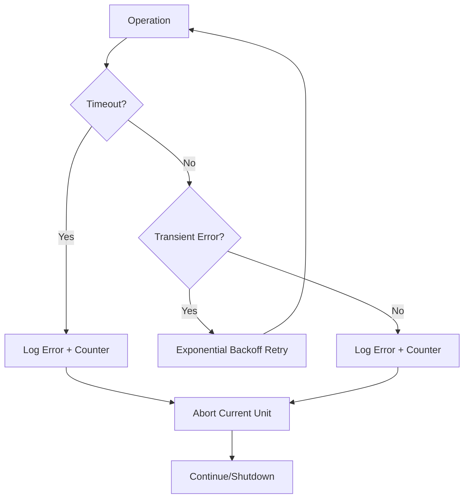

### Key Mechanisms:
1. **Semaphores**: `tryAcquire` with bounded timeouts → log + error counters → abort
2. **Async Operations**: `orTimeout` on MapDB persist, DB saves, page processing → fallbacks
3. **Retries**:
    - JobExecutor page fetch: maxRetries with exponential backoff
    - Symmetric chunk retry: attempts with exponential backoff → skip chunk after max
    - Storage (`@Retryable`): batch save/delete, 3 attempts with exponential backoff
4. **Circuit Breaker**: BipartiteGraphBuilder via Resilience4j → fallback returns empty graph
5. **Shutdown**: Flush queues → remove queue managers → MapDB cleanup → executor shutdown

---

## 7. Metrics and Logging

### Metrics Dashboard Structure
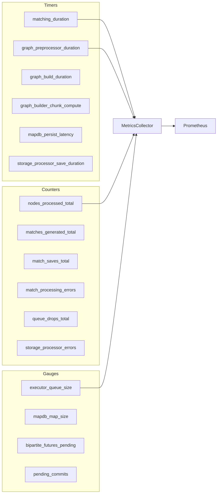

### Key Metrics:
- **Timers**: `matching_duration`, `graph_preprocessor_duration`, `graph_build_duration`, `graph_builder_chunk_compute`, `mapdb_*_latency`, `storage_processor_*_duration`
- **Counters**: `nodes_processed_total`, `matches_generated_total`, `match_saves_total`, `match_processing_errors`, `queue_drain_warnings_total`, `match_drops_total`, `mapdb_*_errors`, `storage_processor_*_errors`
- **Gauges**: executor queue size/active count, `mapdb_map_size`, `pending_commits`, `bipartite_futures_pending`
- **Tags**: `groupId`, `domainId`, `cycleId`, `page`, `chunkIndex`, `mode`, `status`

### Logging Standards:
- Include `cycleId`, `groupId`, `domainId` in all logs
- WARN on backpressure and timeouts
- ERROR on unrecoverable failures with stack traces
- INFO for lifecycle events (start/stop)

---

## 8. Configuration Matrix

| Key | Default | Component | Effect |
|---|---:|---|---|
| `match.save.delay` | 600000 | Scheduler | Fixed delay between cycles (ms) |
| `match.max-concurrent-domains` | 2 | Scheduler | Domain-level parallelism |
| `match.batch-limit` | 500 | JobExecutor | Nodes per page request |
| `nodes.limit.full.job` | 1000 | JobExecutor | Max nodes per group pass |
| `match.max-retries` | 3 | JobExecutor | Page retry count |
| `match.retry-delay-millis` | 1000 | JobExecutor | Backoff base |
| `node-fetch.batch-size` | 1000 | NodeFetch | Fetch partition size |
| `node-fetch.future-timeout-seconds` | 30 | NodeFetch | Async timeouts |
| `graph.max-concurrent-builds` | 2 | PreProcessor | Build parallelism |
| `graph.chunk-size` | 500 | Builders | Nodes per compute chunk |
| `graph.max-concurrent-batches` | 3/4 | Builders | Chunk concurrency |
| `graph.max-concurrent-mappings` | 6 | Symmetric | Persist concurrency |
| `graph.top-k` | 200/100 | Builders | Finalization constraints |
| `graph.chunk-processing-timeout-seconds` | 300 | Symmetric | Per-chunk deadline |
| `match.queue.capacity` | 500k..1M | QueueManager | Bounded queue size |
| `match.flush.interval-seconds` | 5 | QueueManager | Periodic flush cadence |
| `match.flush.min-interval-seconds` | 2 | Proc | Lower bound when hot |
| `match.flush.queue-threshold` | 0.8 | Proc | Adjust flush interval above threshold |
| `match.queue.drain-warning-threshold` | 0.9 | QueueManager | Boosted drain trigger |
| `match.boost-batch-factor` | 2 | QueueManager | Boost drain multiplier |
| `match.max-final-batch-size` | 50k | QueueManager | Blocking flush limit |
| `match.save.timeout-seconds` | 300 | Proc | MapDB save timeout |
| `match.final-save.timeout-seconds` | 60 | Proc | Final save timeout |
| `matches.save.batch-size` | 5000 | Storage | DB batch size |
| `mapdb.path` | d:/web_dev/... | GraphStore | DB file path (override in Linux) |
| `mapdb.batch-size` | 500 | GraphStore | Persist batch size |
| `mapdb.commit-threads` | 2 | GraphStore | Commit parallelism |
| `bipartite.edge.build.similarity-threshold` | 0.05 | Bipartite | Score threshold |

---

## 9. Sequences

### 9.1 Symmetric Matching Workflow
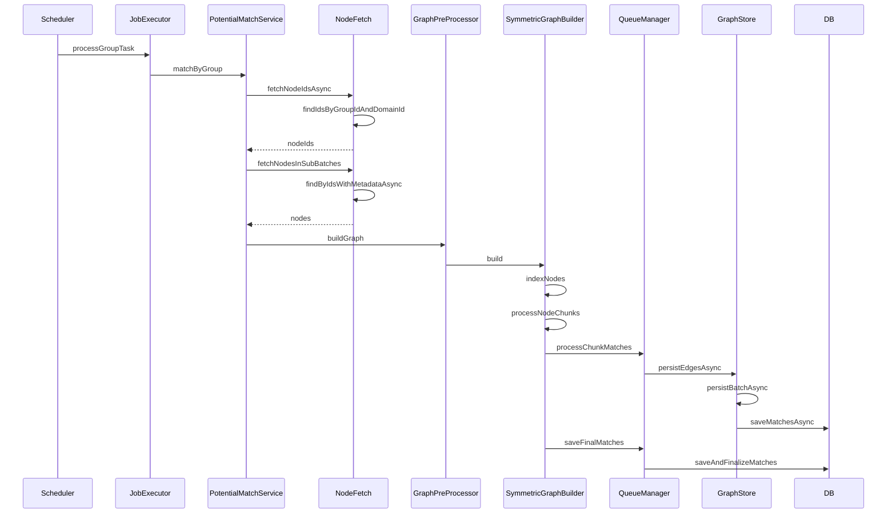

### 9.2 Bipartite Matching Workflow
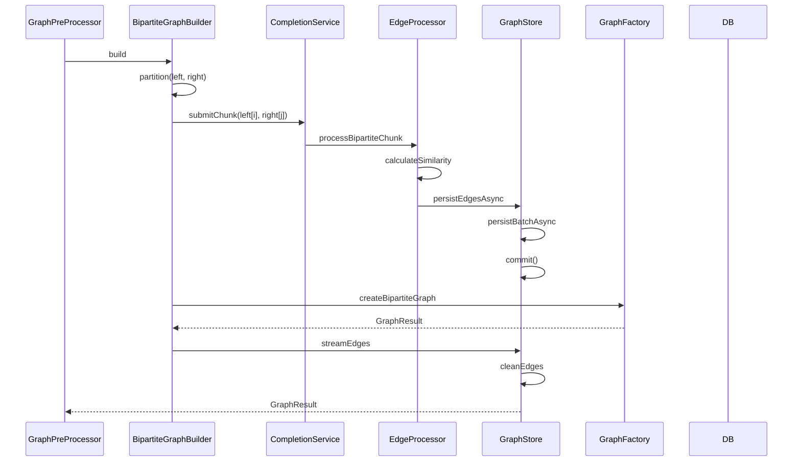

### 9.3 Queue Flush Workflow
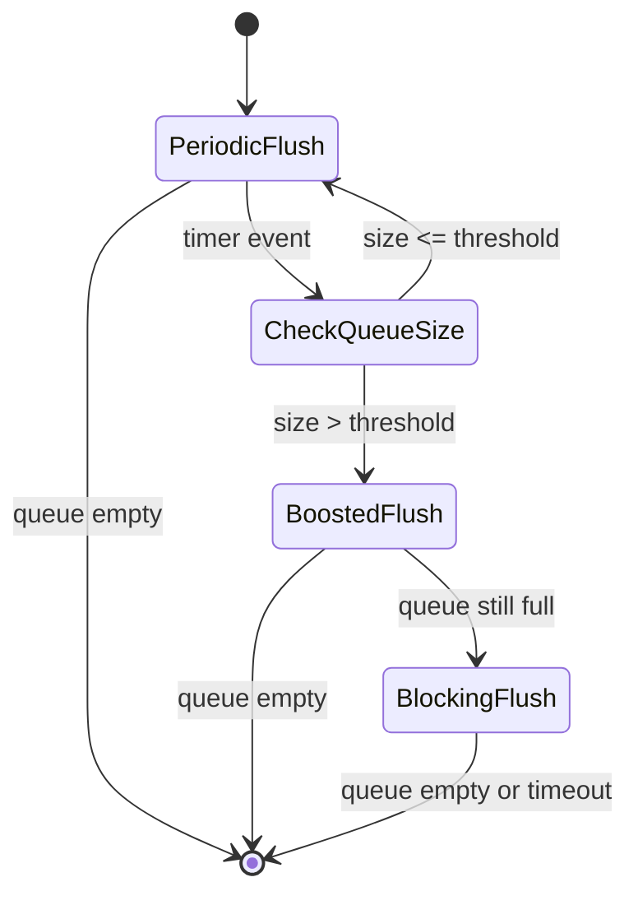

---

## 10. External Contracts and Assumptions

### External Service Interfaces
```mermaid
interfaceDiagram
    interface DomainService {
        + List<UUID> getActiveDomains()
    }
    
    interface MatchingGroupRepository {
        + List<UUID> findGroupIdsByDomainId(UUID domainId)
    }
    
    interface NodeRepository {
        + Page<UUID> findIdsByGroupIdAndDomainId(UUID groupId, UUID domainId, Pageable pageable, Instant createdAfter)
        + CompletableFuture<List<Node>> findByIdsWithMetadataAsync(List<UUID> ids)
        + List<String> findDistinctMetadataKeysByGroupId(UUID groupId)
        + Optional<Node> findByReferenceIdAndGroupIdAndDomainId(String refId, UUID groupId, UUID domainId)
        + void markAsProcessed(List<UUID> nodeIds)
    }
    
    interface PotentialMatchParticipationHistoryRepository {
        + void saveAll(List<HistoryEntry> entries)
    }
    
    interface GraphRequestFactory {
        + QueueConfig getQueueConfig(UUID groupId, UUID domainId, String cycleId, QueueManagerConfig config)
        + PotentialMatch convertToPotentialMatch(Edge edge)
        + Edge toEdge(PotentialMatch match)
    }
    
    interface FlushUtils {
        + void executeFlush(Semaphore sem, Executor executor, flushCallback, ...)
        + void executeBlockingFlush(Semaphore sem, flushCallback, ...)
        + void executeBoostedFlush(Semaphore sem, Executor executor, flushCallback, ...)
    }
    
    interface MetricsUtils {
        + void registerQueueMetrics(...)
        + void reportQueueMetrics(...)
    }
    
    interface GraphFactory {
        + BipartiteGraph createBipartiteGraph(List<Node> left, List<Node> right)
    }
```

### Key Assumptions:
1. `DomainService.getActiveDomains()` returns active domains
2. `MatchingGroupRepository.findGroupIdsByDomainId(domainId)` returns group IDs
3. Node operations are idempotent and support pagination
4. `GraphRequestFactory` handles queue config and entity conversions
5. `FlushUtils` manages flush execution with backpressure
6. `MetricsUtils` provides standardized metric registration
7. `GraphFactory` creates bipartite graphs from partitions

---

## 11. Known Risks and Recommendations

### Risk Mitigation Matrix
| Risk | Impact | Likelihood | Mitigation |
|------|--------|------------|------------|
| Double processing (symmetric) | High | Medium | Dedupe in `processChunkMatches` or remove duplicate pipeline |
| DB save CF not awaited | High | High | Compose futures with `allOf()` |
| SerializerContext double release | Medium | Low | Use `try-with-resources` or scoped context |
| MetadataEncoder global cache | Medium | Low | Use per-instance encoders or thread-local caches |
| Executor shutdown conflicts | Low | Medium | Clarify ownership via `@PreDestroy` |
| MapDB default path | Low | High | Use `${user.home}/mapdb/` |
| Finalizer semantics ambiguity | Low | Medium | Document finalizer behavior |

### Recommendations:
1. **Critical Fixes**:
    - Await DB save futures in `saveMatchBatch`
    - Deduplicate symmetric processing pipeline
    - Fix serializer context release
2. **Performance**:
    - Profile MapDB commit latency under load
    - Optimize LSH index for large metadata sets
3. **Operational**:
    - Implement auto-scaling for executors
    - Add chaos engineering tests
4. **Monitoring**:
    - Set alerts for queue fill ratio > 80%
    - Monitor MapDB file size growth

---

## 12. Testing Strategy

### Testing Strategy Diagram
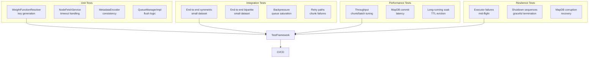

### Test Categories:
1. **Unit Tests**:
    - Weight function key building
    - Node fetch timeout/exception handling
    - Metadata encoder consistency
    - Queue manager flush scheduling logic
2. **Integration Tests**:
    - End-to-end symmetric/bipartite workflows
    - Backpressure validation
    - Retry path testing
3. **Performance Tests**:
    - Throughput vs. concurrency
    - MapDB commit latency
    - Long-running soak tests
4. **Resilience Tests**:
    - Executor failure simulation
    - Shutdown validation
    - Chaos engineering

---

This LLD represents a production-grade architecture for scalable, resilient potential match creation. The combination of sophisticated concurrency controls, adaptive backpressure, and comprehensive observability sets a new standard for distributed graph processing systems.