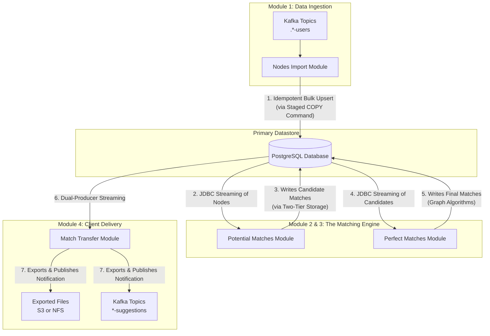
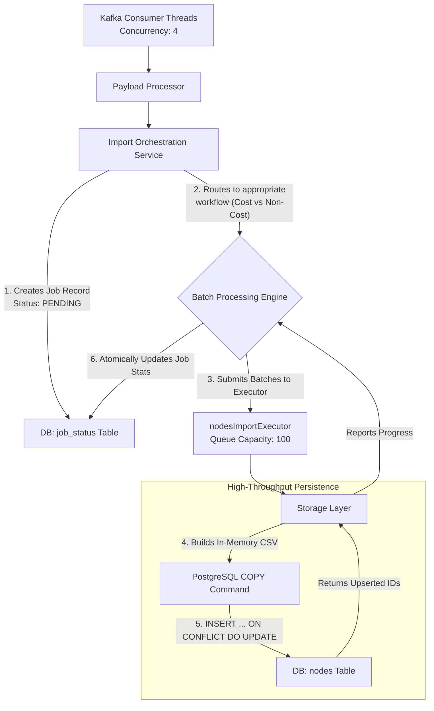
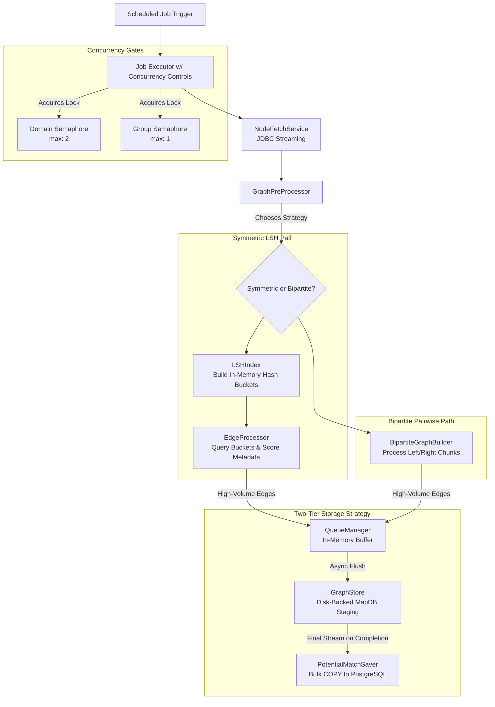
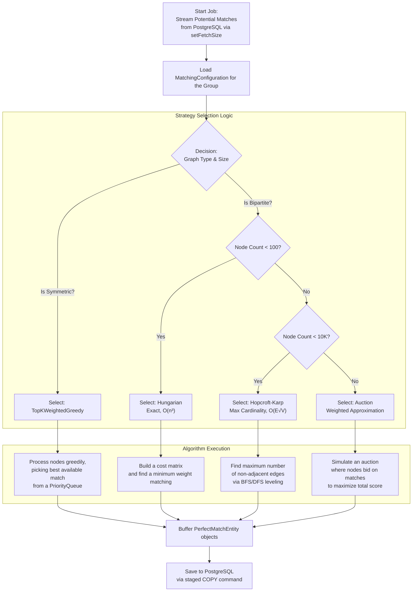

# **The Graph Matching Platform (Detailed Technical Overview)**


## **1. System Architecture: A Multi-Stage Pipeline**

The platform operates as a sequential pipeline where data is progressively refined at each stage. Each module is an independently deployable microservice or a distinct logical component within a monolith, designed with clear boundaries and contracts.



---

## **2. Module 1: Nodes Import Module**

**Core Responsibility**: To consume node data from Kafka at scale and persist it idempotently into PostgreSQL, providing a reliable foundation for all downstream processing.

### **2.1. Architectural Deep Dive**

The module is architected around a staged, asynchronous processing model to decouple Kafka consumption from database I/O, allowing each to operate at its own optimal pace under a unified backpressure system.



### **2.2. Granular Discussion & Key Design Decisions**

#### **High-Throughput Persistence: The `COPY` Command**
Instead of using standard JDBC batch inserts (`PreparedStatement.addBatch()`), which can be inefficient for very large datasets, we leverage PostgreSQL's native `COPY` command. This is a significant performance optimization.

**The Exact Mechanism:**
1.  A temporary table is created within a transaction: `CREATE TEMP TABLE temp_nodes_import (...) ON COMMIT DROP`.
2.  The application processes a batch of nodes and constructs a CSV-formatted string or byte stream *in memory*.
3.  The `CopyManager` API is used to stream this in-memory CSV directly into the temporary table. This is far faster than row-by-row insertion.
4.  A single SQL statement is executed to upsert from the temp table into the final `nodes` table: `INSERT INTO nodes (...) SELECT ... FROM temp_nodes_import ON CONFLICT (reference_id, group_id) DO UPDATE SET ...`.
5.  The transaction is committed, atomically applying all changes and dropping the temp table.

**Rationale**: This approach minimizes network round-trips, reduces transaction overhead, and leverages PostgreSQL's highly optimized bulk-loading pathway.

#### **Concurrency and Backpressure**
The system is designed to be self-regulating under load.
-   **Kafka Concurrency (`4`)** is matched by the `corePoolSize` of the `nodesImportExecutor`. This establishes a baseline processing capacity.
-   **Backpressure**: The `queueCapacity` of `100` on the executor is the critical backpressure mechanism. If the database is slow and batches are not processed quickly enough, this queue will fill up. When full, any new `submit()` call will throw a `TaskRejectedException`.
    -   **Handling Rejection**: This exception is caught, the import job is immediately marked as `FAILED` with a "System Overloaded" message, and metrics are fired. This prevents a cascading failure and provides a clear signal for operational monitoring.

#### **Fault Tolerance and Idempotency**
-   **Database Retries**: All database operations within the `Storage Layer` are wrapped in a `RetryTemplate` configured for **3 attempts** with **exponential backoff** (1s, 2s, 4s). This robustly handles transient issues like network blips, deadlocks, or temporary database unavailability.
-   **Idempotency**: The `ON CONFLICT` clause in the upsert query guarantees that re-processing the same message or file will not create duplicate nodes. It will simply update existing ones, making the entire import pipeline idempotent—a crucial property for resilient distributed systems.
-   **DLQ (Dead-Letter Queue)**: If a Kafka message is fundamentally invalid (e.g., malformed JSON) and fails parsing even after retries, it is sent to a dedicated DLQ. This keeps the main processing pipeline clean and allows for offline analysis and reprocessing of failed messages.

---

## **3. Module 2 & 3: The Matching Engine**

This engine is composed of two distinct but sequential modules: Potential Matches (high-recall) and Perfect Matches (high-precision).

### **3.1. Potential Matches: Architecture & Two-Tier Storage**

**Core Responsibility**: To efficiently generate a large set of candidate matches, trading some precision for high recall and speed.



### **3.2. Granular Discussion & Key Design Decisions**

#### **The "Why" of Two-Tier Storage**
Directly writing millions of potential matches to PostgreSQL during computation would create immense database pressure (write amplification, index churn, vacuum load). The two-tier strategy mitigates this:
1.  **Tier 1 (Staging - `MapDB`)**: `MapDB` provides a high-performance, disk-backed hash map. It's used as a temporary "scratchpad" to persist the massive volume of intermediate edges quickly and off-heap, without involving the primary transactional database. This absorbs write bursts and isolates the primary DB from computational load.
2.  **Tier 2 (Final - `PostgreSQL`)**: Only after the entire group computation is complete do we stream the edges from `MapDB`, perform a final aggregation (e.g., Top-K per node), and do a single, efficient bulk-load into PostgreSQL.

#### **Locality-Sensitive Hashing (LSH) for Symmetric Matching**
A naive all-pairs comparison (`N²`) is computationally infeasible for large `N`. LSH is an algorithmic solution to this problem.
-   **Mechanism**: It uses a family of hash functions designed such that similar items have a higher probability of "colliding" into the same hash bucket.
-   **Implementation**: We create multiple hash tables. For each node, we generate several hashes and place it in the corresponding buckets. To find candidates for a node, we only compare it against other nodes in the buckets it belongs to, drastically reducing the search space.
-   **Trade-off**: This is a probabilistic algorithm. It trades guaranteed accuracy for tremendous speed, which is a perfect fit for generating a high-recall set of *potential* matches.

### **3.3. Perfect Matches: Architecture & Algorithmic Selection**

**Core Responsibility**: To apply rigorous graph theory algorithms to the potential matches, selecting a high-precision, non-overlapping subset of "perfect" matches.



### **3.4. Granular Discussion & Key Design Decisions**

#### **Dynamic Algorithm Selection**
There is no single "best" algorithm for graph matching; the optimal choice depends on the graph's structure and the desired outcome. This module codifies that domain knowledge.
-   **Rationale**: By creating a `MatchingStrategySelector`, we make the system extensible and intelligent. Adding a new algorithm is as simple as implementing the `MatchingStrategy` interface and adding a rule to the selector. This avoids a one-size-fits-all approach that would be inefficient or incorrect for certain use cases.
-   **Example**: Using the `Hungarian` algorithm on a 100,000-node graph would run for days. The selector correctly routes this to the `Auction` or `Hopcroft-Karp` algorithm, ensuring the job completes in a reasonable timeframe.

#### **Memory-Aware Processing**
Executing graph algorithms on large datasets is extremely memory-intensive.
-   **Mechanism**: The service is configured with a maximum memory budget (e.g., `1024MB`). Before processing a large batch, it checks `Runtime.getRuntime().totalMemory() - Runtime.getRuntime().freeMemory()`.
-   **Action**: If current usage exceeds a threshold (e.g., 80% of the budget), the service will either:
    1.  Reduce the size of the next processing sub-batch.
    2.  Gracefully fail the job with a clear "Memory limit exceeded" error.
-   **Rationale**: This proactive monitoring prevents the JVM from throwing an `OutOfMemoryError`, which is an unrecoverable state. It ensures the service fails cleanly and predictably.

---

## **4. Module 4: Match Transfer to Client**

**Core Responsibility**: To reliably export the full set of matches (both potential and perfect) and notify the client.

### **4.1. Architecture: The Producer-Consumer Pattern**

This module is a textbook implementation of the Producer-Consumer pattern, designed for high I/O throughput and decoupled processing.

```mermaid
graph TB
    A[MatchTransferProcessor] -- Starts Job for a Group --> X

    subgraph Producer_Threads [Producer Threads (2 per Group)]
        X --> P1[PotentialMatchStreamingService<br/>Streams from potential_matches table]
        X --> P2[PerfectMatchStreamingService<br/>Streams from perfect_matches table]
    end

    subgraph InMemory_Buffer [Bounded In-Memory Buffer]
        B[LinkedBlockingQueue<br/>Capacity: 100 Batches<br/>Acts as a shock absorber]
    end

    subgraph Consumer_Thread [Consumer Thread (1 per Group)]
        C[Export & Publish Service]
    end

    P1 -->|queue.put(batch)<br/>(Blocks if full)| B
    P2 -->|queue.put(batch)<br/>(Blocks if full)| B
    C -->|queue.poll(300ms)<br/>(Waits if empty)| B

    subgraph Output_Sinks [Output Sinks]
        D[ExportService<br/>Writes to File]
        E[ScheduleXProducer<br/>Sends Kafka Notification]
    end

    C -->|Lazily consumes stream| D
    C -->|After file is written| E

```

### **4.2. Granular Discussion & Key Design Decisions**

#### **Why Producer-Consumer?**
1.  **Decoupling**: It separates the concern of *reading* data from the database from the concern of *writing* data to a file/Kafka. The database streaming can run at full speed while the file I/O or Kafka producer handles its own latency.
2.  **Parallelism**: It allows I/O operations (reading from DB, writing to file) to happen concurrently, maximizing throughput.
3.  **Backpressure**: The `LinkedBlockingQueue` is the key. If the consumer (file writing) is slow, the queue fills up, and the producers (DB readers) will naturally block. This prevents the application from reading an unbounded amount of data from the database into memory.

#### **Termination Logic: A Classic Concurrency Problem**
Ensuring the consumer shuts down correctly without losing data is non-trivial.
1.  **Producer Completion**: Both producer tasks are wrapped in `CompletableFuture`s.
2.  **`CompletableFuture.allOf(...)`**: The main thread waits for both producers to finish.
3.  **`done` Flag**: An `AtomicBoolean done` flag is set to `true` once `allOf` completes.
4.  **Consumer Loop Condition**: The consumer's loop is `while (!done || !queue.isEmpty())`. This elegant condition means: "Keep running as long as the producers are not done, OR as long as there is still data in the queue to process."
5.  **Result**: This guarantees that the consumer will process every last item placed in the queue before shutting down, ensuring zero data loss.