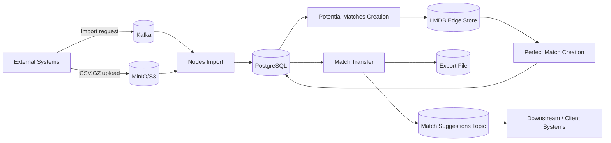
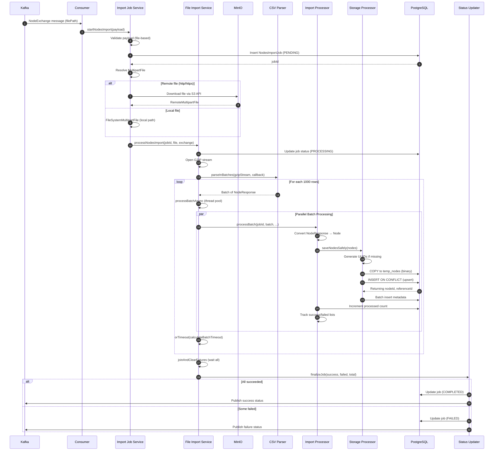
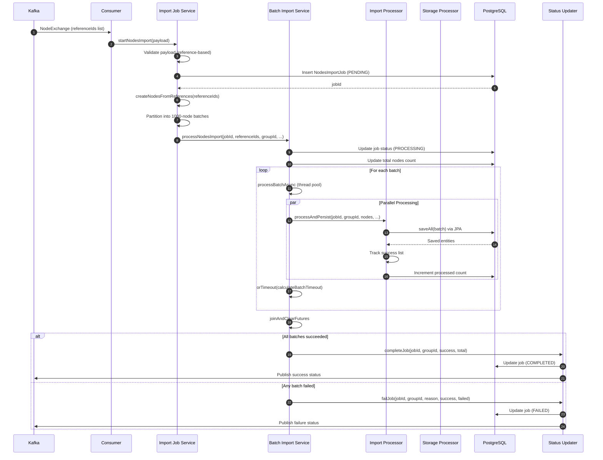
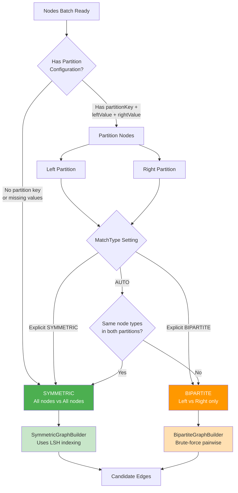
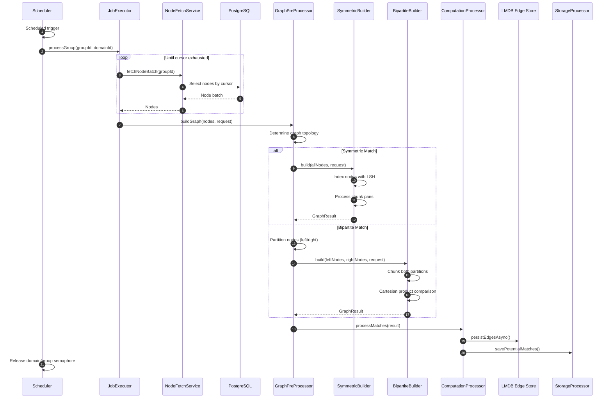
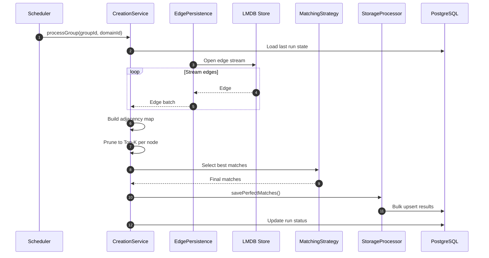
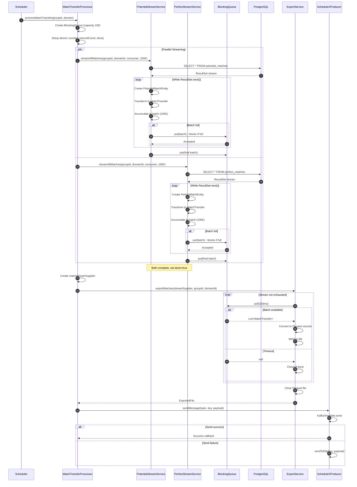

ScheduleX — Overview (with Design Doc Links)
===============================================================

TL;DR
-----
- Batch-based matching engine for large-scale entity pairing
- Avoids O(n²) similarity search via LSH + staged refinement
- Candidate edges are streamed via LMDB; final match records are persisted in PostgreSQL
- Designed for safe re-runs, partial failures, and multi-tenant isolation (domain + group)


What this system does
---------------------
This platform takes raw entity data (called “nodes”), computes which nodes are compatible with each other, selects the best matches, and then delivers those results to client-facing systems.

It runs as a pipeline made of four major stages:

1) Nodes Import
2) Potential Matches Creation
3) Perfect Match Creation
4) Match Transfer to Client

Each stage is designed to handle large volumes, run safely on schedules or triggers, and produce outputs that are reliable to re-run.

High-level flow in one sentence
-------------------------------
We ingest nodes into PostgreSQL → compute candidate relationships (potential matches) → refine those candidates into final selections (perfect matches) → export results to a file and notify downstream consumers.




Scale characteristics (observed)
-------------------------------
These numbers are indicative from development / local runs and are not an SLA.

- Processes 100k+ nodes per run (domain+group dependent)
- Generates millions of candidate edges over time (rate depends on strategy + data shape)
- Streams large edge sets from LMDB without loading the full graph into memory


Key terms 
--------------------------
- Node: A single entity we want to match (user/product/resource).
- Potential Match (candidate edge): A candidate pairing (“edge”) between two nodes, with a compatibility score. Many can exist per node.
- Perfect Match (final match record): The selected best match(es) produced from candidate edges under configured rules (Top-K, symmetric/asymmetric).
- Domain / Group: Logical partitions for multi-tenancy and business segmentation (matching runs per domain+group).
- Cursor / Run State: A saved “position” so incremental processing can resume and avoid reprocessing everything.
- LMDB: A fast local storage used to read/write large edge sets efficiently (often treated as regenerable/staging).
- Export Artifact: A file containing match outputs in a client-consumable format.
- Notification Event: A message (Kafka-like) that tells downstream systems “your file is ready” and where to fetch it.
- Candidate edge: Synonym for “potential match” when discussing graph/LMDB storage.
- Final match record: Synonym for “perfect match” when discussing PostgreSQL outputs and exports.

Stage 1 — Nodes Import 
----------------------------------------
Goal: Bring large sets of nodes into PostgreSQL quickly and safely.

In practice:
- An upstream system requests an import by sending a message.
- The request either points to a compressed CSV file in object storage (MinIO/S3) or includes a reference list.
- The import service streams and parses the input in batches to avoid memory spikes.
- Nodes are written efficiently using PostgreSQL bulk operations (COPY + merge/UPSERT).
- The system records job status so operators and downstream systems know whether the import succeeded, partially succeeded, or failed.

Output:
- Nodes (and metadata) stored in PostgreSQL.
- A job status update (persisted and typically published).

Why this stage matters:
- All later stages depend on clean, consistent node data.
- Idempotent writes let the system safely retry without creating duplicates.

### i) File-Based Import Sequence



### ii) Reference-Based Import Sequence



Stage 2 — Potential Matches Creation (creating candidates)
----------------------------------------------------------
Goal: Generate "candidate match edges" between nodes in each domain/group.

In practice:
- Runs on a schedule and/or incrementally.
- Reads nodes from PostgreSQL and determines the appropriate graph topology:
    - **Symmetric Graphs**: For matching entities of the same type (e.g., user-to-user similarity)
    - **Bipartite Graphs**: For matching entities across two distinct types (e.g., jobs↔candidates, buyers↔sellers)
- Uses a matching strategy based on data shape and configuration:
    - LSH (Locality-Sensitive Hashing) for large-scale similarity detection (symmetric only)
    - Metadata-weighted comparisons when metadata keys and weights matter
    - Flat strategy as a simple fallback for small sets or limited metadata
- Stores candidate edges in LMDB (and optionally PostgreSQL).

Output:
- Candidate edges (potential matches) stored where the next stage can read them efficiently (commonly LMDB).

Why this stage matters:
- It reduces an otherwise explosive "compare everything with everything" problem into a smaller candidate set.

### Graph Topology Decision Flow



### Symmetric vs Bipartite Comparison

| Aspect | Symmetric Graph | Bipartite Graph |
|--------|-----------------|-----------------|
| **Use Case** | Same-type matching (users↔users) | Cross-type matching (jobs↔candidates) |
| **Algorithm** | LSH for approximate neighbors | Exhaustive pairwise comparison |
| **Complexity** | O(N log N) approximate | O(L × R) exact |
| **Accuracy** | Approximate (tunable threshold) | Exact compatibility scores |
| **Partition** | Single node set | Two distinct partitions |
| **Best For** | Large homogeneous datasets | Smaller heterogeneous datasets |

### Main Processing Sequence




Stage 3 — Perfect Match Creation (choosing final matches)
---------------------------------------------------------
Goal: Turn candidate edges into final “best match” results that the business can act on.

In practice:
- Runs on a schedule per domain/group.
- Streams edges from LMDB to avoid loading huge graphs in memory.
- Applies the configured algorithm:
    - Symmetric: treat the match relationship as mutual (requires canonicalization to prevent duplicates)
    - Asymmetric: treat matches as directional (one-way preference/selection rules)
    - pruning (often Top-K per node)
- Writes final results into PostgreSQL using bulk persistence and deduplication rules.

Output:
- Perfect matches stored in PostgreSQL (typically with cycle/run identifiers and timestamps).

Why this stage matters:
- It produces the final deliverable matching output used by client-facing features and reporting.



Stage 4 — Match Transfer to Client (export + notify)
----------------------------------------------------
Goal: Provide clients/downstream systems an easy-to-consume artifact and a reliable notification.

In practice:
- Runs on a schedule per domain/group.
- Streams potential matches and perfect matches out of PostgreSQL using JDBC streaming.
- Converts database entities into a transfer-friendly DTO format.
- Merges both sources via a bounded queue (producer-consumer pipeline) to control memory and add backpressure.
- ExportService writes the data to a file (the client artifact).
- A notification event is published containing the file reference (path/URI, metadata such as counts/checksum).

Output:
- Exported match file (stored in agreed storage).
- A messaging event telling consumers where the file is.

Why this stage matters:
- It decouples internal storage schemas from client consumption needs.
- It supports high-volume delivery without requiring clients to query large DB tables directly.



How the pipeline fits together
------------------------------
- Nodes Import must succeed before meaningful matching can occur.
- Potential Matches builds candidate edges from nodes.
- Perfect Match selects the final best matches from those candidates.
- Match Transfer exports and announces results for downstream systems.

Operational model (how it runs safely)
--------------------------------------
- Batch/scheduled execution: predictable load and simpler operations.
- Concurrency controls: limits how many domains/groups run at once to protect DB and I/O.
- Backpressure: bounded queues prevent “fast producers” from overwhelming “slow consumers.”
- Resilience:
    - Retries for transient failures
    - Circuit breakers to prevent cascading failures
    - Clear per-group failure isolation where possible
- Observability:
    - metrics for throughput, duration, failures
    - executor health and queue depth monitoring
    - structured logs with correlation fields (domainId, groupId, jobId/cycleId)

Links to Design Documents
------------------------
Below are the documents this overview is based on. 


**High-Level Designs (HLD)**
- [Nodes Import](https://github.com/kagit00/schedule_x/blob/master/docs/High%20Level%20Designs/NodesImport.md)
- [Potential Matches Creation](https://github.com/kagit00/schedule_x/blob/master/docs/High%20Level%20Designs/ScheduledPotentialMatchesCreation.md)
- [Perfect Match Creation](https://github.com/kagit00/schedule_x/blob/master/docs/High%20Level%20Designs/ScheduledPerfectMatchesCreation.md)
- [Match Transfer](https://github.com/kagit00/schedule_x/blob/master/docs/High%20Level%20Designs/MatchesTransfer.md)

**Low-Level Designs (LLD)**
- [Nodes Import](https://github.com/kagit00/schedule_x/blob/master/docs/Low%20Level%20Designs/NodesImport.md)
- [Potential Matches Creation](https://github.com/kagit00/schedule_x/blob/master/docs/Low%20Level%20Designs/ScheduledPotentialMatchesCreation.md)
- [Perfect Match Creation](https://github.com/kagit00/schedule_x/blob/master/docs/Low%20Level%20Designs/ScheduledPerfectMatchesCreation.md)
- [Match Transfer](https://github.com/kagit00/schedule_x/blob/master/docs/Low%20Level%20Designs/MatchesTransfer.md)

Suggested reading order 
-------------------------------------------
1) End-to-end overview (this document)
2) Nodes Import HLD + LLD
3) Potential Matches HLD + LLD
4) Perfect Match HLD + LLD
5) Match Transfer HLD + LLD


---

## Failures & Scaling Lessons

While scaling ScheduleX to very large node and edge cardinalities, several non-trivial failures shaped the final architecture:

- Out-of-memory failures while ranking crore-scale potential matches, which forced a move away from in-memory ranking toward disk-backed Top-K selection.
- Severe under-generation of candidate edges due to early LSH candidate caps, leading to full candidate expansion with higher hash-table and band counts.
- Missed matches caused by bucket-isolated processing, resolved by introducing sliding-window cross-batch matching.
- Fragmented similarity space due to per-bucket LSH initialization, corrected using a global, incrementally built LSH index.
- Scheduler stalls after massive edge expansion, requiring explicit backpressure and bounded streaming.
- Deadlocks caused by semaphore starvation in async execution paths, leading to stricter lifecycle management.
- PostgreSQL checkpoint saturation during heavy batch writes, driving WAL and checkpoint tuning.

  These failures only surfaced at scale and directly influenced ScheduleX’s memory, storage, and matching architecture.
---

## Running locally

ScheduleX is not deployed yet. Run it locally with Docker Compose.

### Prerequisites

- Docker Engine + Docker Compose v2
- Free ports on host:
    - `8080` (ScheduleX)
    - `5433` (Postgres exposed on host)
    - `6379` (Redis)
    - `9092` (Kafka)
    - `2181` (ZooKeeper)
- A Docker network named `kafka-network` (required because both compose files use `external: true`)

### 1) Create the shared Docker network

```bash
docker network create kafka-network || true
```

### 2) Start Kafka + ZooKeeper (infra)

Your `infra.yml` brings up ZooKeeper + Kafka and attaches them to the external network:

```bash
docker compose -f infra.yml up -d
```

Verify:

```bash
docker ps --filter "name=zookeeper|kafka"
```

Kafka is advertised as `kafka:9092`, which matches your app config (`SPRING_KAFKA_BOOTSTRAP_SERVERS=kafka:9092`).

### 3) Start ScheduleX + Postgres + Redis

From the repo root (where your main `docker-compose.yml` lives):

```bash
docker compose up -d --build
```

Tail logs:

```bash
docker logs -f schedulex
```

### 4) Verify services

- ScheduleX: http://localhost:8080
- PostgreSQL (from host):
    - Host: `localhost`
    - Port: `5433`
    - DB: `schedulex`
    - User: `postgres`
    - Pass: `postgres`
- Redis: `localhost:6379`

### MinIO note (required for import/export paths)

Your `schedulex` container is configured with:

- `MINIO_ENDPOINT=http://minio:9000`
- `MINIO_BUCKET=flairbit-exports`

So anything that touches object storage (file-based imports / exports) will expect a **MinIO container reachable as `minio` on `kafka-network`**.

If you don’t already run MinIO, add this to `infra.yml`:

```yaml
  minio:
    image: minio/minio:latest
    container_name: minio
    command: server /data --console-address ":9001"
    environment:
      MINIO_ROOT_USER: minioadmin
      MINIO_ROOT_PASSWORD: minioadmin
    ports:
      - "9000:9000"
      - "9001:9001"
    volumes:
      - minio_data:/data
    networks:
      - kafka-network
```

and under `volumes:` add:

```yaml
  minio_data:
```

Then restart infra:

```bash
docker compose -f infra.yml up -d
```

### Volume paths (important for contributors)

Your current compose uses absolute host paths, e.g.:

- `/home/kaustav/.../pgdata:/var/lib/postgresql/data`
- `/home/kaustav/.../graph-store:/app/graph-store`

For contributor-friendliness, consider changing these to relative paths:

```yaml
volumes:
  - ./pgdata:/var/lib/postgresql/data
# and
  - ./graph-store:/app/graph-store
```

and create them once:

```bash
mkdir -p pgdata graph-store
```

### Stopping everything

```bash
docker compose down
docker compose -f infra.yml down
```

---

## Contributing

### How to contribute

1. Fork the repo
2. Create a feature branch:
    - `feat/<name>` for features
    - `fix/<name>` for bug fixes
    - `docs/<name>` for documentation
3. Make small, reviewable commits
4. Open a PR describing:
    - what changed and why
    - how to run/test it locally
    - any expected behavior or performance impact (especially for batch jobs)

### What’s most helpful

- Reliability improvements (idempotency, retries, run-state/cursor correctness)
- Performance improvements (streaming, batching, DB query tuning)
- Better local-dev experience (Docker setup, sample configs, scripts)
- Tests (unit + integration), especially around matching correctness

### Local checks before a PR

From the repo root:

```bash
mvn -DskipTests package
mvn test
```

If your change touches any stage (Import / Potential Matches / Perfect Matches / Transfer), include in the PR notes:
- how re-runs behave (idempotent? deduped?)
- any schema changes or run-state/cursor changes
- any new configuration flags/env vars

### Reporting issues

Please include:
- what you expected vs what happened
- logs (remove secrets)
- how you ran it (Docker / local JVM)
- steps to reproduce

---

Notes 
---------------------
- PostgreSQL is the system of record for nodes and match outputs.
- LMDB is used as a performance layer for edge streaming and may be treated as regenerable depending on implementation.
- Export files and notifications are the public “delivery contract” for clients/downstream systems.


---
