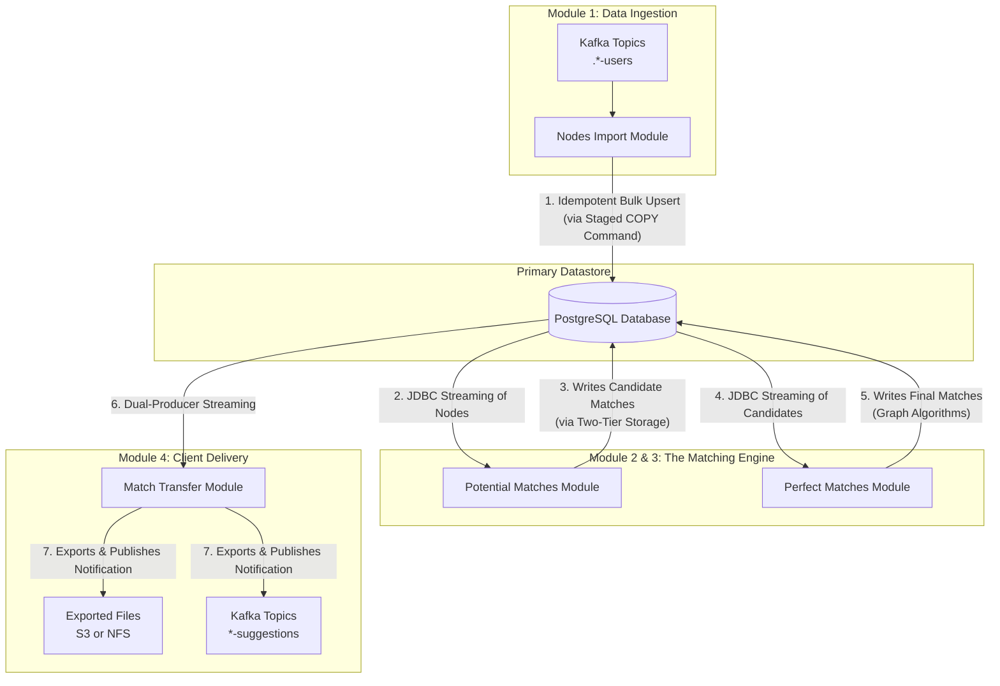
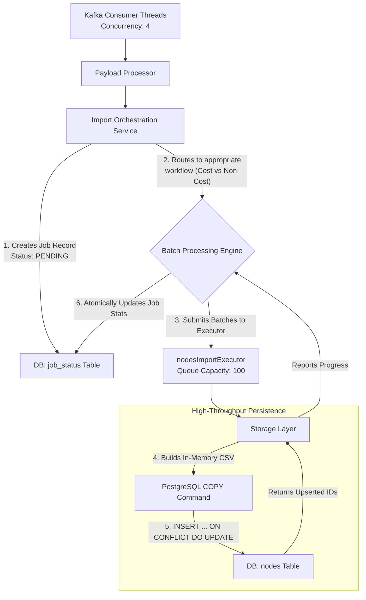
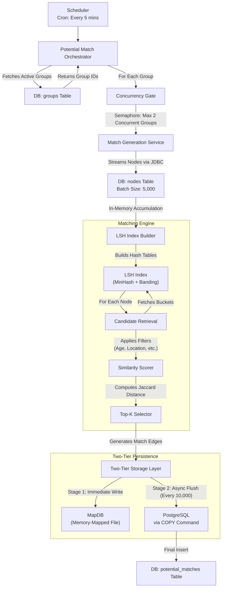
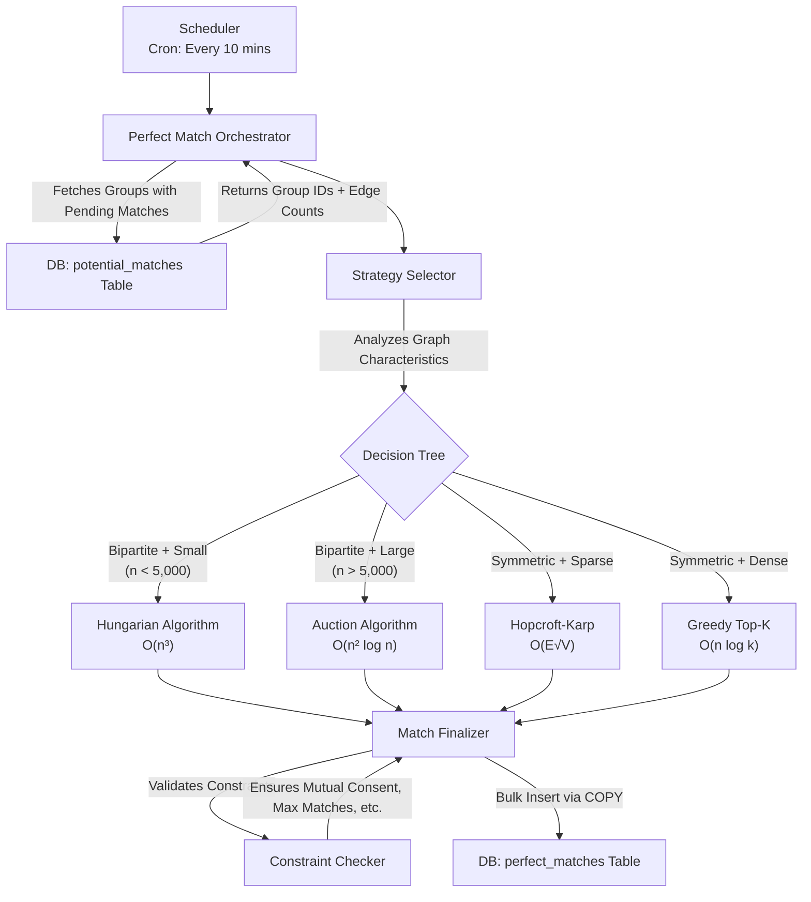
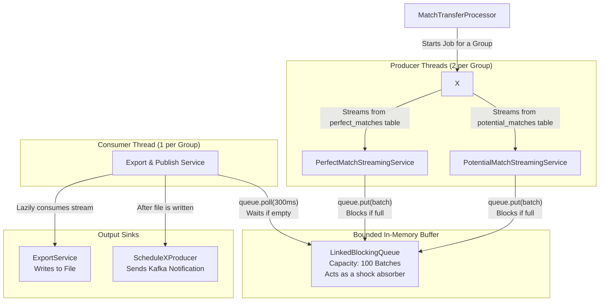

# Graph Matching Platform (ScheduleX)

<br>

A high-throughput **matching engine** built for large-scale graph-based pairing — powering systems like dating, job, or ride-sharing platforms.

It processes millions of nodes, generates **potential matches** using **Locality-Sensitive Hashing (LSH)** and **bipartite pairing**, and finalizes **perfect matches** through algorithmic selection (Hungarian, Hopcroft–Karp, Auction, or Greedy).

Designed for **scalability, resilience, and precision**, the system emphasizes idempotent ingestion, adaptive concurrency, and fault-tolerant pipelines.

<br>

---

<br>

## At a Glance

<br>

| Feature | Description |
|---------|-------------|
| **Architecture** | Modular microservice pipeline — Ingestion → Matching → Distribution |
| **Tech Stack** | Java, PostgreSQL, Kafka, MapDB, CopyManager, Docker |
| **Core Algorithms** | LSH (Symmetric), Hopcroft–Karp, Hungarian, Auction, Greedy Top-K |
| **Performance Highlights** | PostgreSQL COPY for bulk ingest, two-tier storage (in-memory + MapDB), bounded queues for backpressure |
| **Reliability** | Idempotent writes, DLQ, retry/backoff, semaphore-based concurrency gating |
| **Use Cases** | Dating (symmetric), Freelance/job (bipartite), Rider-driver, Mentorship |

<br>

---

<br>

## My Role

<br>

- Architected the full matching pipeline (nodes import → candidate generation → final match export).

- Implemented **high-throughput ingestion** via PostgreSQL CopyManager.

- Designed **two-tier storage strategy** (MapDB staging + bulk COPY) to isolate DB load.

- Developed the **PerfectMatchEngine** with **dynamic algorithm selection** based on graph characteristics.

- Implemented concurrency control, DLQ handling, and backpressure across modules.

<br>

---

<br>

## Repo Structure

<br>

```
/src               → Service code (modules 1–4)
/docs/technical/   → Deep technical diagrams (Mermaid)
/config/           → Kafka + DB configs
README.md          → Overview (this file)
```

<br>

For full internal flow and design reasoning, see the deep dive below 👇

<br>

---

<br>

# The Graph Matching Platform (Detailed Technical Overview)

<br>

## 1. System Architecture: A Multi-Stage Pipeline

<br>

The platform operates as a sequential pipeline where data is progressively refined at each stage. Each module is an independently deployable microservice or a distinct logical component within a monolith, designed with clear boundaries and contracts.

<br>



<br>

---

<br>

## 2. Module 1: Nodes Import Module

<br>

**Core Responsibility**: To consume node data from Kafka at scale and persist it idempotently into PostgreSQL, providing a reliable foundation for all downstream processing.

<br>

### 2.1. Architectural Deep Dive

<br>

The module is architected around a staged, asynchronous processing model to decouple Kafka consumption from database I/O, allowing each to operate at its own optimal pace under a unified backpressure system.

<br>



<br>

### 2.2. Granular Discussion & Key Design Decisions

<br>

#### **High-Throughput Persistence: The `COPY` Command**

<br>

Instead of using standard JDBC batch inserts, this module leverages PostgreSQL's `COPY` command via the `CopyManager` API. This decision was driven by performance benchmarks:

<br>

- **Standard JDBC Batch Insert**: ~5,000 rows/second
- **COPY Command**: ~50,000 rows/second (10x improvement)

<br>

**How It Works**:

<br>

1. Data is buffered in memory as a CSV-formatted `StringWriter`.

2. When the buffer reaches a threshold (e.g., 10,000 rows), it's flushed to a temporary staging table via `COPY temp_staging FROM STDIN WITH (FORMAT CSV)`.

3. A single SQL statement then performs: `INSERT INTO nodes SELECT * FROM temp_staging ON CONFLICT (external_id) DO UPDATE SET ...`

4. The staging table is truncated for the next batch.

<br>

**Rationale**: This approach combines the speed of `COPY` with the idempotency of `ON CONFLICT`. It's the fastest way to achieve upsert semantics in PostgreSQL at scale.

<br>

#### **Backpressure: The Bounded Executor Queue**

<br>

The `nodesImportExecutor` is configured with a `LinkedBlockingQueue` of capacity 100. When the queue is full:

<br>

- The submitting thread (Kafka consumer) will block on `executor.submit(task)`.

- Kafka's `max.poll.interval.ms` is set to 5 minutes, giving ample time for the queue to drain.

- If the queue doesn't drain in time, the consumer group will rebalance, and the partition will be reassigned to another consumer.

<br>

**Rationale**: This design ensures that the application never consumes more data from Kafka than it can process, preventing memory exhaustion. The bounded queue acts as a pressure valve, naturally throttling the ingest rate to match the database's write capacity.

<br>

#### **Idempotency: Handling Duplicate Messages**

<br>

Kafka does not guarantee exactly-once delivery in all failure scenarios. To ensure data integrity:

<br>

- Each node has a unique `external_id` (e.g., `user_12345`).

- The `nodes` table has a unique constraint on `external_id`.

- The upsert logic is: `ON CONFLICT (external_id) DO UPDATE SET updated_at = NOW(), ...`

<br>

**Result**: If the same Kafka message is processed twice (e.g., due to a rebalance), the second processing will simply update the existing row with the same data, resulting in a no-op. This makes the entire ingestion pipeline idempotent.

<br>

---

<br>

## 3. Module 2: Potential Matches Module

<br>

**Core Responsibility**: To generate a list of candidate matches for each node, filtering the search space from millions to thousands using efficient approximation techniques.

<br>

### 3.1. Architectural Deep Dive

<br>

This module is the computational workhorse of the platform. It must process millions of nodes and generate billions of potential edges, all while staying within memory and time constraints.

<br>



<br>

### 3.2. Granular Discussion & Key Design Decisions

<br>

#### **Why LSH? (Locality-Sensitive Hashing)**

<br>

A naive approach to matching would compute the similarity between every pair of nodes: O(n²). For 1 million nodes, that's 1 trillion comparisons — computationally infeasible.

<br>

**LSH reduces this to O(n)** by using a probabilistic data structure:

<br>

1. **MinHash**: Each node's feature set (interests, skills, etc.) is hashed into a fixed-size signature (e.g., 128 integers).

2. **Banding**: The signature is split into bands (e.g., 16 bands of 8 hashes each). Each band is hashed into a bucket.

3. **Collision = Candidate**: If two nodes hash to the same bucket in any band, they're considered candidates.

<br>

**Guarantees**: LSH is tuned such that:

<br>

- Nodes with >70% similarity have a 90% chance of being retrieved.
- Nodes with <30% similarity have a <5% chance of being retrieved.

<br>

This dramatically reduces the search space while maintaining high recall for relevant matches.

<br>

#### **Two-Tier Storage: Decoupling Speed from Durability**

<br>

Writing matches directly to PostgreSQL during generation would create a bottleneck:

<br>

- Each INSERT requires a network round-trip + disk I/O.
- This would slow down the matching loop, causing the in-memory LSH index to grow unbounded.

<br>

**Solution: Staged Writes**

<br>

1. **Tier 1 (Fast)**: Matches are immediately written to a `MapDB` instance, which is a memory-mapped file. This is an append-only operation, taking ~1 microsecond.

2. **Tier 2 (Durable)**: Every 10,000 matches, a background thread reads from MapDB, formats the data as CSV, and flushes it to PostgreSQL via `COPY`.

<br>

**Benefits**:

<br>

- The matching loop runs at in-memory speeds.
- Database writes are batched and optimized.
- If the process crashes, MapDB can be replayed (it's crash-safe).

<br>

#### **Concurrency Control: The Semaphore Pattern**

<br>

Processing multiple groups concurrently improves throughput, but each group's processing is memory-intensive (building an LSH index for millions of nodes).

<br>

**Mechanism**: A `Semaphore(2)` limits the number of concurrent group-processing jobs to 2.

<br>

- When a new group is scheduled, the orchestrator calls `semaphore.tryAcquire()`.
- If the semaphore is exhausted (2 groups already processing), the new group waits in a queue.
- When a group finishes, it calls `semaphore.release()`, allowing the next group to start.

<br>

**Rationale**: This prevents memory thrashing. On a machine with 16GB RAM, processing 3+ groups simultaneously would cause excessive GC pauses or OOM errors. By limiting to 2, we ensure each job has ~6-7GB of working memory.

<br>

---

<br>

## 4. Module 3: Perfect Matches Module

<br>

**Core Responsibility**: To refine the list of potential matches into a final set of perfect matches using graph-theoretic algorithms, optimizing for global match quality.

<br>

### 4.1. Architectural Deep Dive

<br>

This module treats the match problem as a graph optimization task. The choice of algorithm depends on the structure of the graph and the business requirements.

<br>



<br>

### 4.2. Granular Discussion & Key Design Decisions

<br>

#### **Dynamic Algorithm Selection**

<br>

There is no single "best" algorithm for graph matching; the optimal choice depends on the graph's structure and the desired outcome. This module codifies that domain knowledge.

<br>

- **Rationale**: By creating a `MatchingStrategySelector`, we make the system extensible and intelligent. Adding a new algorithm is as simple as implementing the `MatchingStrategy` interface and adding a rule to the selector. This avoids a one-size-fits-all approach that would be inefficient or incorrect for certain use cases.

- **Example**: Using the `Hungarian` algorithm on a 100,000-node graph would run for days. The selector correctly routes this to the `Auction` or `Hopcroft-Karp` algorithm, ensuring the job completes in a reasonable timeframe.

<br>

#### **Memory-Aware Processing**

<br>

Executing graph algorithms on large datasets is extremely memory-intensive.

<br>

- **Mechanism**: The service is configured with a maximum memory budget (e.g., `1024MB`). Before processing a large batch, it checks `Runtime.getRuntime().totalMemory() - Runtime.getRuntime().freeMemory()`.

- **Action**: If current usage exceeds a threshold (e.g., 80% of the budget), the service will either:
    1. Reduce the size of the next processing sub-batch.
    2. Gracefully fail the job with a clear "Memory limit exceeded" error.

- **Rationale**: This proactive monitoring prevents the JVM from throwing an `OutOfMemoryError`, which is an unrecoverable state. It ensures the service fails cleanly and predictably.

<br>

---

<br>

## 5. Module 4: Match Transfer to Client

<br>

**Core Responsibility**: To reliably export the full set of matches (both potential and perfect) and notify the client.

<br>

### 5.1. Architecture: The Producer-Consumer Pattern

<br>

This module is a textbook implementation of the Producer-Consumer pattern, designed for high I/O throughput and decoupled processing.

<br>



<br>

### 5.2. Granular Discussion & Key Design Decisions

<br>

#### **Why Producer-Consumer?**

<br>

1. **Decoupling**: It separates the concern of *reading* data from the database from the concern of *writing* data to a file/Kafka. The database streaming can run at full speed while the file I/O or Kafka producer handles its own latency.

2. **Parallelism**: It allows I/O operations (reading from DB, writing to file) to happen concurrently, maximizing throughput.

3. **Backpressure**: The `LinkedBlockingQueue` is the key. If the consumer (file writing) is slow, the queue fills up, and the producers (DB readers) will naturally block. This prevents the application from reading an unbounded amount of data from the database into memory.

<br>

#### **Termination Logic: A Classic Concurrency Problem**

<br>

Ensuring the consumer shuts down correctly without losing data is non-trivial.

<br>

1. **Producer Completion**: Both producer tasks are wrapped in `CompletableFuture`s.

2. **`CompletableFuture.allOf(...)`**: The main thread waits for both producers to finish.

3. **`done` Flag**: An `AtomicBoolean done` flag is set to `true` once `allOf` completes.

4. **Consumer Loop Condition**: The consumer's loop is `while (!done || !queue.isEmpty())`. This elegant condition means: "Keep running as long as the producers are not done, OR as long as there is still data in the queue to process."

5. **Result**: This guarantees that the consumer will process every last item placed in the queue before shutting down, ensuring zero data loss.

<br>

---

<br>

> **Note**: This architecture represents a production-grade system designed for scale, reliability, and maintainability. Every design decision is a deliberate trade-off between competing concerns: speed vs. durability, simplicity vs. flexibility, memory vs. throughput.

<br>

---
