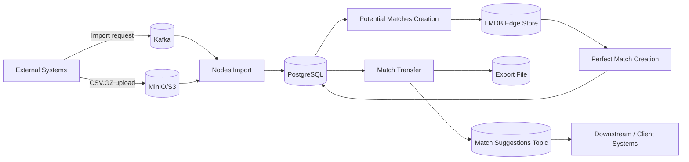
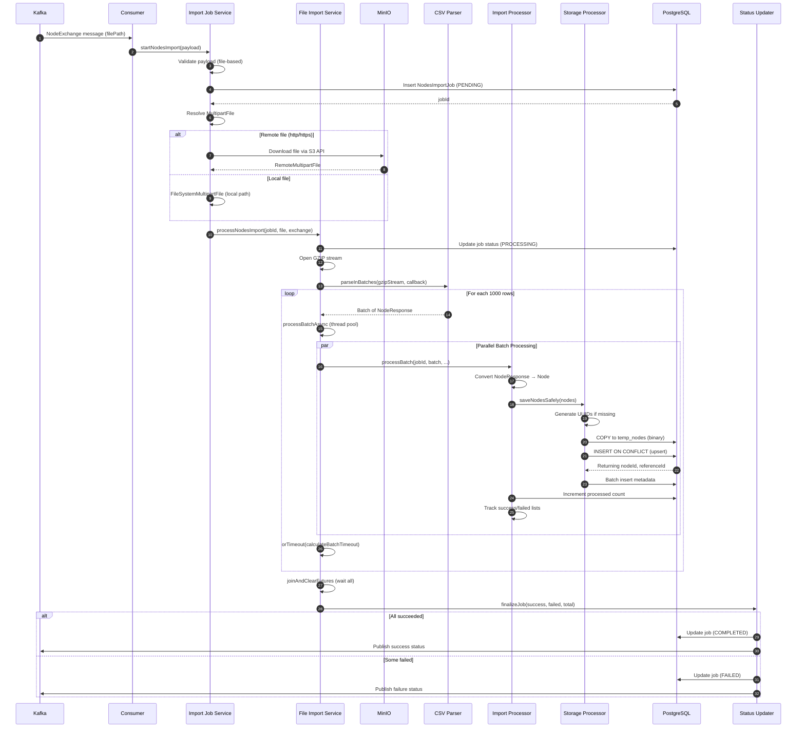
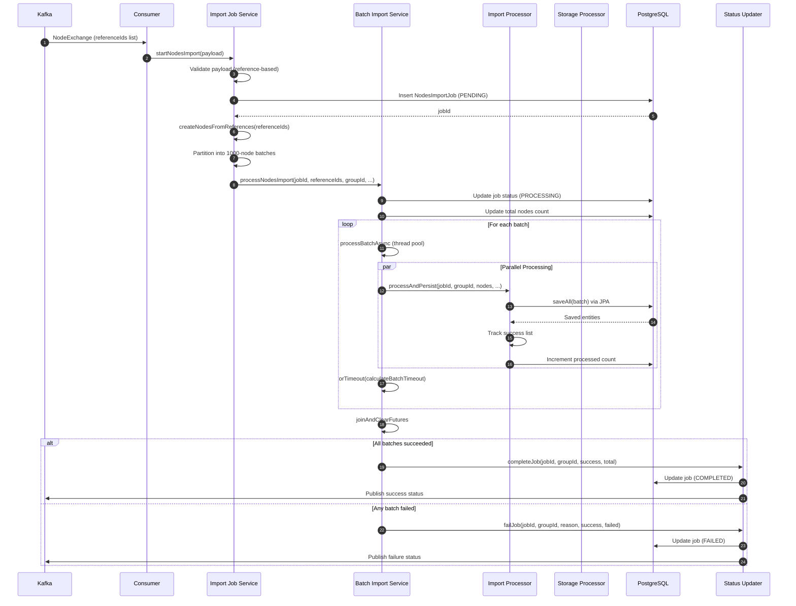
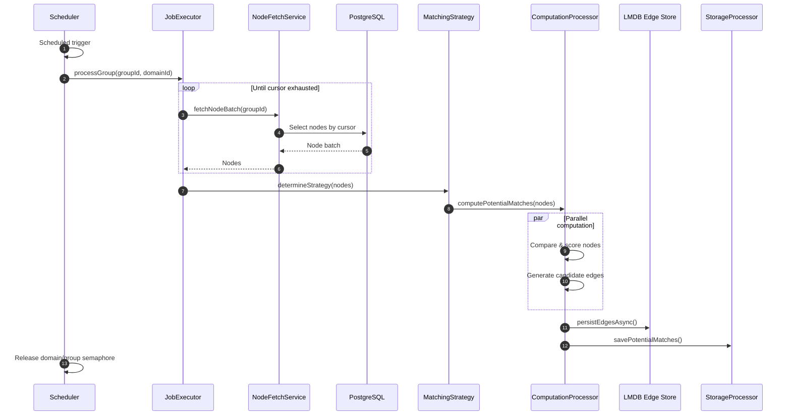
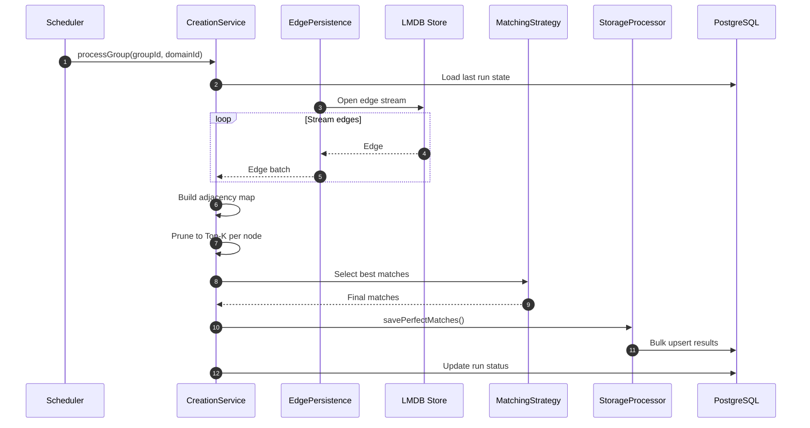
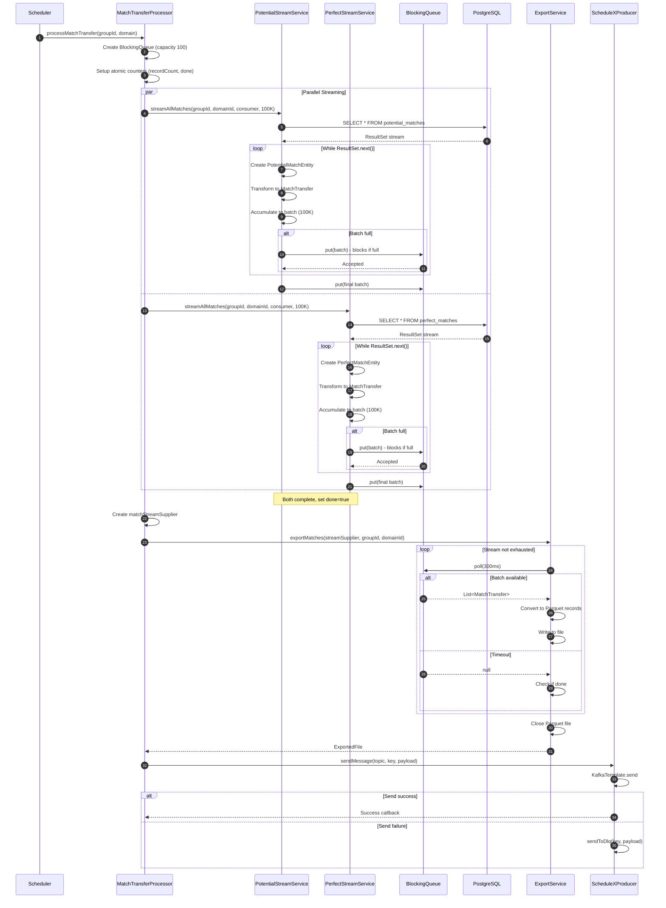

ScheduleX — Overview (with Design Doc Links)
===============================================================

What this system does
---------------------
This platform takes raw entity data (called “nodes”), computes which nodes are compatible with each other, selects the best matches, and then delivers those results to client-facing systems.

It runs as a pipeline made of four major stages:

1) Nodes Import
2) Potential Matches Creation
3) Perfect Match Creation
4) Match Transfer to Client

Each stage is designed to handle large volumes, run safely on schedules or triggers, and produce outputs that are reliable to re-run.

High-level flow in one sentence
-------------------------------
We ingest nodes into PostgreSQL → compute candidate relationships (potential matches) → refine those candidates into final selections (perfect matches) → export results to a file and notify downstream consumers.

Key terms 
--------------------------
- Node: A single entity we want to match (user/product/resource).
- Potential Match: A candidate pairing between two nodes, usually many per node, with a compatibility score.
- Perfect Match: The best match(es) selected from the candidates based on configured rules.
- Domain / Group: Logical partitions for multi-tenancy and business segmentation (matching runs per domain+group).
- Cursor / Run State: A saved “position” so incremental processing can resume and avoid reprocessing everything.
- LMDB: A fast local storage used to read/write large edge sets efficiently (often treated as regenerable/staging).
- Export Artifact: A file containing match outputs in a client-consumable format.
- Notification Event: A message (Kafka-like) that tells downstream systems “your file is ready” and where to fetch it.

Stage 1 — Nodes Import 
----------------------------------------
Goal: Bring large sets of nodes into PostgreSQL quickly and safely.

In practice:
- An upstream system requests an import by sending a message.
- The request either points to a compressed CSV file in object storage (MinIO/S3) or includes a reference list.
- The import service streams and parses the input in batches to avoid memory spikes.
- Nodes are written efficiently using PostgreSQL bulk operations (COPY + merge/UPSERT).
- The system records job status so operators and downstream systems know whether the import succeeded, partially succeeded, or failed.

Output:
- Nodes (and metadata) stored in PostgreSQL.
- A job status update (persisted and typically published).

Why this stage matters:
- All later stages depend on clean, consistent node data.
- Idempotent writes let the system safely retry without creating duplicates.

### i) File-Based Import Sequence

### ii) Reference-Based Import Sequence

Stage 2 — Potential Matches Creation (creating candidates)
----------------------------------------------------------
Goal: Generate “candidate match edges” between nodes in each domain/group.

In practice:
- Runs on a schedule and/or incrementally.
- Reads nodes from PostgreSQL and uses a matching strategy based on data shape and configuration:
    - LSH (Locality-Sensitive Hashing) for large-scale similarity detection
    - Metadata-weighted comparisons when metadata keys and weights matter
    - Flat strategy as a simple fallback for small sets or limited metadata
- Stores candidate edges in LMDB (and optionally PostgreSQL).

Output:
- Candidate edges (potential matches) stored where the next stage can read them efficiently (commonly LMDB).

Why this stage matters:
- It reduces an otherwise explosive “compare everything with everything” problem into a smaller candidate set.

Stage 3 — Perfect Match Creation (choosing final matches)
---------------------------------------------------------
Goal: Turn candidate edges into final “best match” results that the business can act on.

In practice:
- Runs on a schedule per domain/group.
- Streams edges from LMDB to avoid loading huge graphs in memory.
- Applies the configured algorithm:
    - Symmetric: treat the match relationship as mutual (requires canonicalization to prevent duplicates)
    - Asymmetric: treat matches as directional (one-way preference/selection rules)
    - pruning (often Top-K per node)
- Writes final results into PostgreSQL using bulk persistence and deduplication rules.

Output:
- Perfect matches stored in PostgreSQL (typically with cycle/run identifiers and timestamps).

Why this stage matters:
- It produces the final deliverable matching output used by client-facing features and reporting.

Stage 4 — Match Transfer to Client (export + notify)
----------------------------------------------------
Goal: Provide clients/downstream systems an easy-to-consume artifact and a reliable notification.

In practice:
- Runs on a schedule per domain/group.
- Streams potential matches and perfect matches out of PostgreSQL using JDBC streaming.
- Converts database entities into a transfer-friendly DTO format.
- Merges both sources via a bounded queue (producer-consumer pipeline) to control memory and add backpressure.
- ExportService writes the data to a file (the client artifact).
- A notification event is published containing the file reference (path/URI, metadata such as counts/checksum).

Output:
- Exported match file (stored in agreed storage).
- A messaging event telling consumers where the file is.

Why this stage matters:
- It decouples internal storage schemas from client consumption needs.
- It supports high-volume delivery without requiring clients to query large DB tables directly.

How the pipeline fits together
------------------------------
- Nodes Import must succeed before meaningful matching can occur.
- Potential Matches builds candidate edges from nodes.
- Perfect Match selects the final best matches from those candidates.
- Match Transfer exports and announces results for downstream systems.

Operational model (how it runs safely)
--------------------------------------
- Batch/scheduled execution: predictable load and simpler operations.
- Concurrency controls: limits how many domains/groups run at once to protect DB and I/O.
- Backpressure: bounded queues prevent “fast producers” from overwhelming “slow consumers.”
- Resilience:
    - Retries for transient failures
    - Circuit breakers to prevent cascading failures
    - Clear per-group failure isolation where possible
- Observability:
    - metrics for throughput, duration, failures
    - executor health and queue depth monitoring
    - structured logs with correlation fields (domainId, groupId, jobId/cycleId)

Links to Design Documents
------------------------
Below are the documents this overview is based on. 

High-Level Designs (HLD)
- Nodes Import System — HLD  
  Link: https://github.com/kagit00/schedule_x/blob/master/docs/High%20Level%20Designs/NodesImport.md
- Potential Matches Creation System — HLD  
  Link: https://github.com/kagit00/schedule_x/blob/master/docs/High%20Level%20Designs/ScheduledPotentialMatchesCreation.md
- Perfect Match Creation System — HLD  
  Link: https://github.com/kagit00/schedule_x/blob/master/docs/High%20Level%20Designs/ScheduledPerfectMatchesCreation.md
- Match Transfer to Client — HLD  
  Link: https://github.com/kagit00/schedule_x/blob/master/docs/High%20Level%20Designs/MatchesTransfer.md

Low-Level Designs (LLD)
- Nodes Import System — LLD  
  Link: https://github.com/kagit00/schedule_x/blob/master/docs/Low%20Level%20Designs/NodesImport.md
- Potential Matches Creation System — LLD  
  Link: https://github.com/kagit00/schedule_x/blob/master/docs/Low%20Level%20Designs/ScheduledPotentialMatchesCreation.md
- Perfect Match Creation System — LLD  
  Link: https://github.com/kagit00/schedule_x/blob/master/docs/Low%20Level%20Designs/ScheduledPerfectMatchesCreation.md
- Match Transfer to Client — LLD  
  Link: https://github.com/kagit00/schedule_x/blob/master/docs/Low%20Level%20Designs/MatchesTransfer.md

Suggested reading order 
-------------------------------------------
1) End-to-end overview (this document)
2) Nodes Import HLD + LLD
3) Potential Matches HLD + LLD
4) Perfect Match HLD + LLD
5) Match Transfer HLD + LLD

Notes 
---------------------
- PostgreSQL is the system of record for nodes and match outputs.
- LMDB is used as a performance layer for edge streaming and may be treated as regenerable depending on implementation.
- Export files and notifications are the public “delivery contract” for clients/downstream systems.
