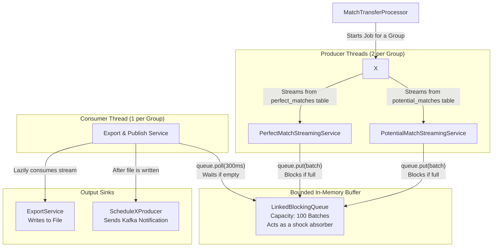

# **Graph Matching Platform (ScheduleX)**

A high-throughput **matching engine** built for large-scale graph-based pairing — powering systems like dating, job, or ride-sharing platforms.  
It processes millions of nodes, generates **potential matches** using **Locality-Sensitive Hashing (LSH)** and **bipartite pairing**, and finalizes **perfect matches** through algorithmic selection (Hungarian, Hopcroft–Karp, Auction, or Greedy).  
Designed for **scalability, resilience, and precision**, the system emphasizes idempotent ingestion, adaptive concurrency, and fault-tolerant pipelines.

---

## **At a Glance**

| Feature | Description |
|----------|-------------|
| **Architecture** | Modular microservice pipeline — Ingestion → Matching → Distribution |
| **Tech Stack** | Java, PostgreSQL, Kafka, MapDB, CopyManager, Docker |
| **Core Algorithms** | LSH (Symmetric), Hopcroft–Karp, Hungarian, Auction, Greedy Top-K |
| **Performance Highlights** | PostgreSQL COPY for bulk ingest, two-tier storage (in-memory + MapDB), bounded queues for backpressure |
| **Reliability** | Idempotent writes, DLQ, retry/backoff, semaphore-based concurrency gating |
| **Use Cases** | Dating (symmetric), Freelance/job (bipartite), Rider-driver, Mentorship |

---

## **My Role**

- Architected the full matching pipeline (nodes import → candidate generation → final match export).  
- Implemented **high-throughput ingestion** via PostgreSQL CopyManager.  
- Designed **two-tier storage strategy** (MapDB staging + bulk COPY) to isolate DB load.  
- Developed the **PerfectMatchEngine** with **dynamic algorithm selection** based on graph characteristics.  
- Implemented concurrency control, DLQ handling, and backpressure across modules.

---

## **Repo Structure**

```

/src               → Service code (modules 1–4)
/docs/technical/   → Deep technical diagrams (Mermaid)
/config/           → Kafka + DB configs
README.md          → Overview (this file)

````

For full internal flow and design reasoning, see the deep dive below 👇  
---

# **The Graph Matching Platform (Detailed Technical Overview)**

## **1. System Architecture: A Multi-Stage Pipeline**

The platform operates as a sequential pipeline where data is progressively refined at each stage. Each module is an independently deployable microservice or a distinct logical component within a monolith, designed with clear boundaries and contracts.

```mermaid
graph TD
    subgraph Ingestion [Module 1: Data Ingestion]
        A["Kafka Topics<br/>.*-users"] --> B[Nodes Import Module]
    end

    subgraph Persistence [Primary Datastore]
        C[(PostgreSQL Database)]
    end

    subgraph Computation [Module 2 & 3: The Matching Engine]
        D[Potential Matches Module]
        E[Perfect Matches Module]
    end

    subgraph Distribution [Module 4: Client Delivery]
        F[Match Transfer Module]
        G["Exported Files<br/>S3 or NFS"]
        H["Kafka Topics<br/>*-suggestions"]
    end

    %% Data Flow
    B -- "1. Idempotent Bulk Upsert<br/>(via Staged COPY Command)" --> C
    C -- "2. JDBC Streaming of Nodes" --> D
    D -- "3. Writes Candidate Matches<br/>(via Two-Tier Storage)" --> C
    C -- "4. JDBC Streaming of Candidates" --> E
    E -- "5. Writes Final Matches<br/>(Graph Algorithms)" --> C
    C -- "6. Dual-Producer Streaming" --> F
    F -- "7. Exports & Publishes Notification" --> G & H

````

---

## **2. Module 1: Nodes Import Module**

**Core Responsibility**: To consume node data from Kafka at scale and persist it idempotently into PostgreSQL, providing a reliable foundation for all downstream processing.

### **2.1. Architectural Deep Dive**

The module is architected around a staged, asynchronous processing model to decouple Kafka consumption from database I/O, allowing each to operate at its own optimal pace under a unified backpressure system.

```mermaid
graph TD
    A["Kafka Consumer Threads<br/>Concurrency: 4"] --> B[Payload Processor]
    B --> C[Import Orchestration Service]

    C -->|"1. Creates Job Record<br/>Status: PENDING"| F["DB: job_status Table"]
    C -->|"2. Routes to appropriate<br/>workflow (Cost vs Non-Cost)"| D{Batch Processing Engine}
    D -->|"3. Submits Batches to Executor"| G["nodesImportExecutor<br/>Queue Capacity: 100"]
    G --> E[Storage Layer]

    subgraph High_Throughput_Persistence ["High-Throughput Persistence"]
        E -->|"4. Builds In-Memory CSV"| H["PostgreSQL COPY Command"]
        H -->|"5. INSERT ... ON CONFLICT DO UPDATE"| I["DB: nodes Table"]
    end

    I -->|"Returns Upserted IDs"| E
    E -->|"Reports Progress"| D
    D -->|"6. Atomically Updates Job Stats"| F
```

## **2.2. Granular Discussion & Key Design Decisions**

#### **High-Throughput Persistence: The `COPY` Command**

Instead of using standard JDBC batch inserts...

[... keep the remainder of your existing document exactly as is ...]

---

## **4. Module 4: Match Transfer to Client**

**Core Responsibility**: To reliably export the full set of matches (both potential and perfect) and notify the client.

### **4.1. Architecture: The Producer-Consumer Pattern**


---

### **3.4. Granular Discussion & Key Design Decisions**

#### **Dynamic Algorithm Selection**
There is no single "best" algorithm for graph matching; the optimal choice depends on the graph's structure and the desired outcome. This module codifies that domain knowledge.
-   **Rationale**: By creating a `MatchingStrategySelector`, we make the system extensible and intelligent. Adding a new algorithm is as simple as implementing the `MatchingStrategy` interface and adding a rule to the selector. This avoids a one-size-fits-all approach that would be inefficient or incorrect for certain use cases.
-   **Example**: Using the `Hungarian` algorithm on a 100,000-node graph would run for days. The selector correctly routes this to the `Auction` or `Hopcroft-Karp` algorithm, ensuring the job completes in a reasonable timeframe.

#### **Memory-Aware Processing**
Executing graph algorithms on large datasets is extremely memory-intensive.
-   **Mechanism**: The service is configured with a maximum memory budget (e.g., `1024MB`). Before processing a large batch, it checks `Runtime.getRuntime().totalMemory() - Runtime.getRuntime().freeMemory()`.
-   **Action**: If current usage exceeds a threshold (e.g., 80% of the budget), the service will either:
    1.  Reduce the size of the next processing sub-batch.
    2.  Gracefully fail the job with a clear "Memory limit exceeded" error.
-   **Rationale**: This proactive monitoring prevents the JVM from throwing an `OutOfMemoryError`, which is an unrecoverable state. It ensures the service fails cleanly and predictably.

---

## **4. Module 4: Match Transfer to Client**

**Core Responsibility**: To reliably export the full set of matches (both potential and perfect) and notify the client.

### **4.1. Architecture: The Producer-Consumer Pattern**

This module is a textbook implementation of the Producer-Consumer pattern, designed for high I/O throughput and decoupled processing.


### **4.2. Granular Discussion & Key Design Decisions**

#### **Why Producer-Consumer?**
1.  **Decoupling**: It separates the concern of *reading* data from the database from the concern of *writing* data to a file/Kafka. The database streaming can run at full speed while the file I/O or Kafka producer handles its own latency.
2.  **Parallelism**: It allows I/O operations (reading from DB, writing to file) to happen concurrently, maximizing throughput.
3.  **Backpressure**: The `LinkedBlockingQueue` is the key. If the consumer (file writing) is slow, the queue fills up, and the producers (DB readers) will naturally block. This prevents the application from reading an unbounded amount of data from the database into memory.

#### **Termination Logic: A Classic Concurrency Problem**
Ensuring the consumer shuts down correctly without losing data is non-trivial.
1.  **Producer Completion**: Both producer tasks are wrapped in `CompletableFuture`s.
2.  **`CompletableFuture.allOf(...)`**: The main thread waits for both producers to finish.
3.  **`done` Flag**: An `AtomicBoolean done` flag is set to `true` once `allOf` completes.
4.  **Consumer Loop Condition**: The consumer's loop is `while (!done || !queue.isEmpty())`. This elegant condition means: "Keep running as long as the producers are not done, OR as long as there is still data in the queue to process."
5.  **Result**: This guarantees that the consumer will process every last item placed in the queue before shutting down, ensuring zero data loss.