# **GraphMatch Engine**
### *A Scalable, Fault-Tolerant Matchmaking System for High-Volume Node Similarity & Pairing*

---

## **Overview**
**GraphMatch Engine** is a **distributed, batch-oriented matchmaking platform** that processes millions of user nodes across domains and generates **high-quality potential and perfect matches** using **Locality-Sensitive Hashing (LSH)**, **metadata scoring**, and **optimal pairing algorithms**.

The system is **resilient**, **observable**, and **scalable**, delivering matches to clients via **file exports** and **Kafka streams**.

---

# **Detailed UML & Architecture Diagrams**

---

## **1. High-Level System Architecture**

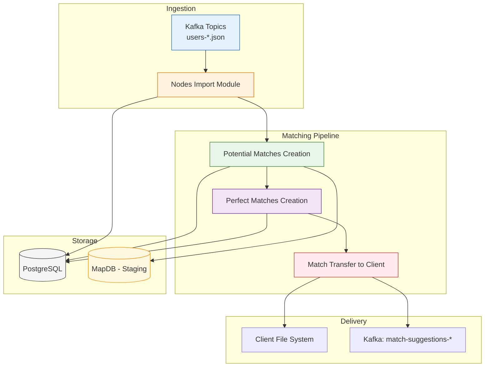

---

## **2. Module Interaction Sequence**

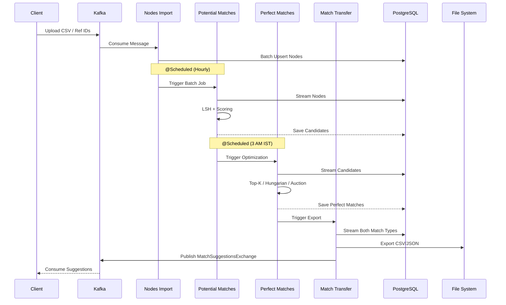

---

## **3. Class Diagram – Core Entities & Relationships**

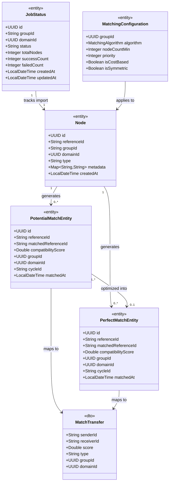

---

## **4. Nodes Import Module – Detailed Class Diagram**

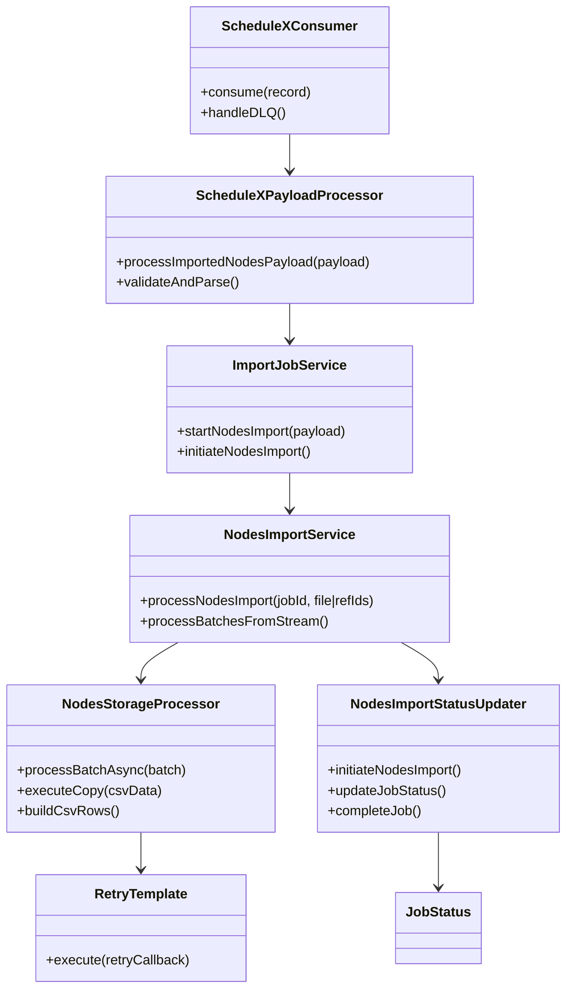

---

## **5. Potential Matches – Class Diagram with LSH & Graph Builders**

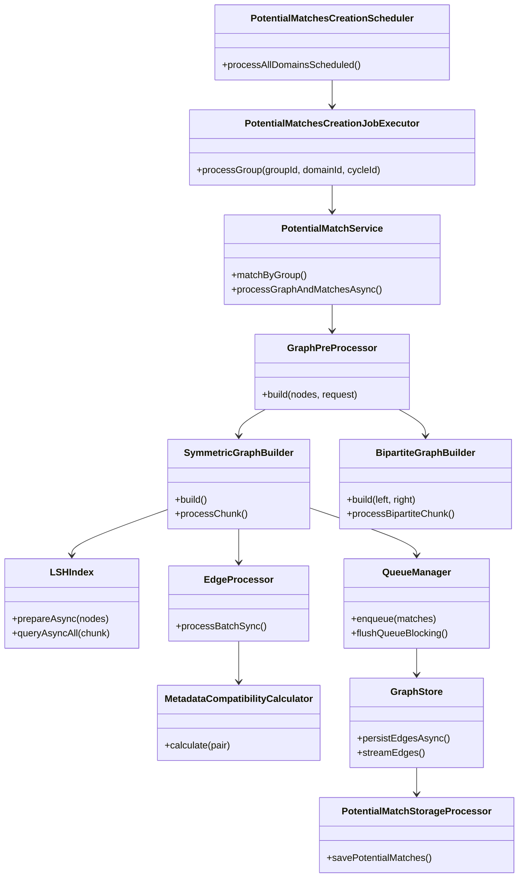

---

## **6. Perfect Matches – Strategy Pattern Class Diagram**

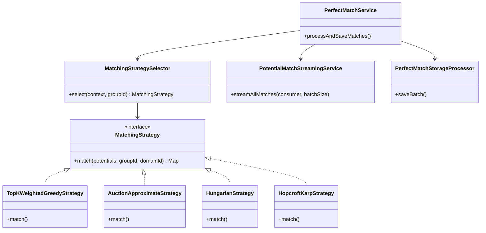

---

## **7. Match Transfer – Producer-Consumer Class Diagram**

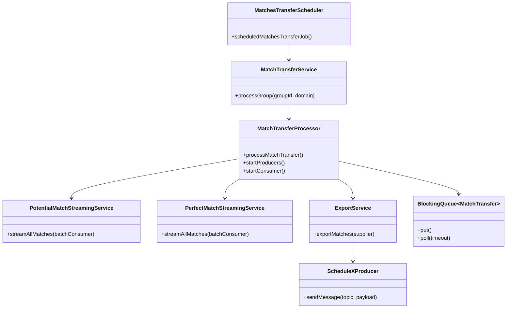

---

## **8. Sequence Diagram – Cost-Based Node Import (Streaming CSV)**

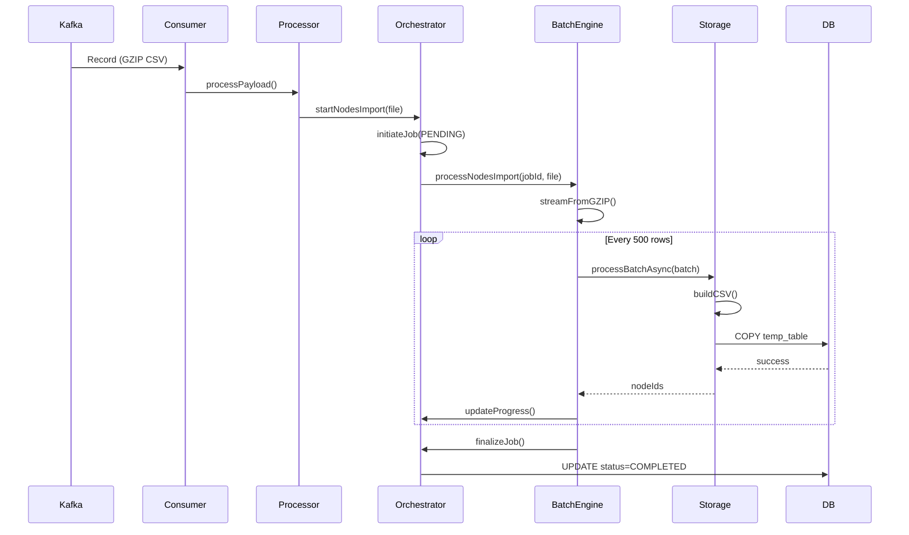

---

## **9. Sequence Diagram – LSH-Based Potential Matching (Symmetric)**

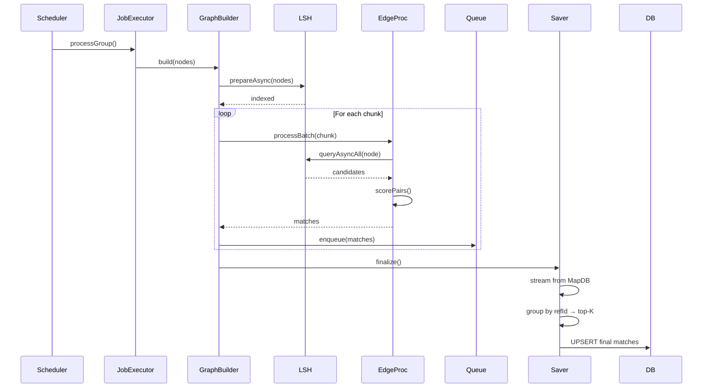

---

## **10. Sequence Diagram – Match Transfer (Producer-Consumer)**

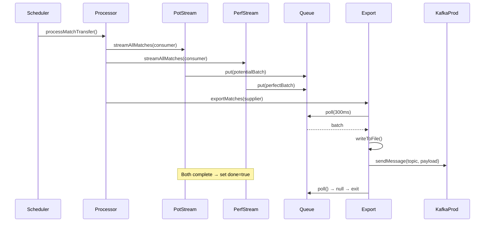

---

## **11. State Diagram – Job Lifecycle**

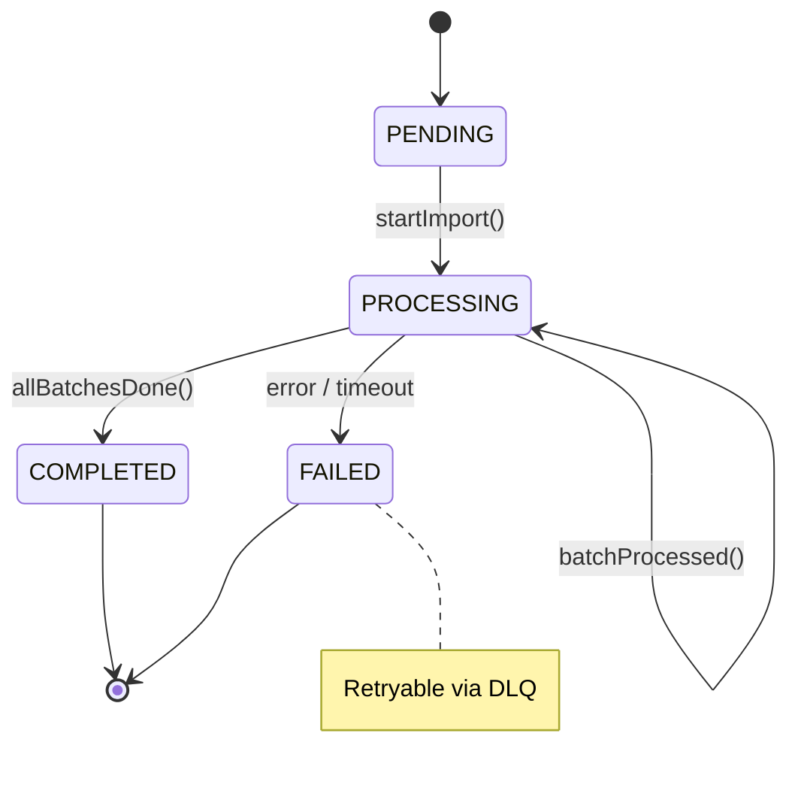

---

## **12. Deployment & Runtime Topology**

```mermaid
graph TB
    subgraph "Kubernetes Pod"
        S1[Scheduler<br>@Scheduled]
        W1[Worker 1]
        W2[Worker 2]
    end

    subgraph "Thread Pools"
        TP1[nodesImportExecutor<br>core=4, max=8]
        TP2[matchTransferExecutor<br>core=4, max=8]
        TP3[potentialMatchExecutor<br>core=8]
    end

    subgraph "External"
        K[(Kafka)]
        P[(PostgreSQL)]
        M[(MapDB)]
        F[File Share]
    end

    S1 --> TP1
    W1 --> TP2
    W2 --> TP3
    TP1 --> P
    TP3 --> M
    TP3 --> P
    TP2 --> F
    TP2 --> K
```

---

## **13. Data Flow Diagram (DFD) – Level 1**

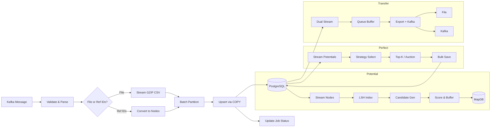

---

## **Why This System Excels**

| Feature | Implementation |
|-------|----------------|
| **Zero OOM** | Memory-aware batching, GC hooks |
| **No Data Loss** | Idempotent upserts, DLQ |
| **Full Traceability** | `jobId`, `cycleId` in logs & DB |
| **Configurable Algorithms** | Strategy pattern + DB config |
| **Production Ready** | Circuit breakers, retries, fallbacks |

---

**GraphMatch Engine** — *Precision at Scale, Built to Last.*