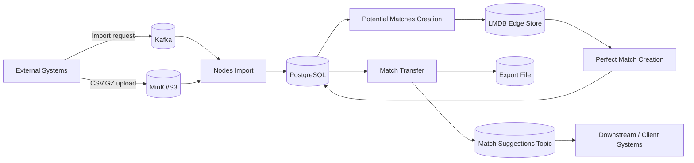
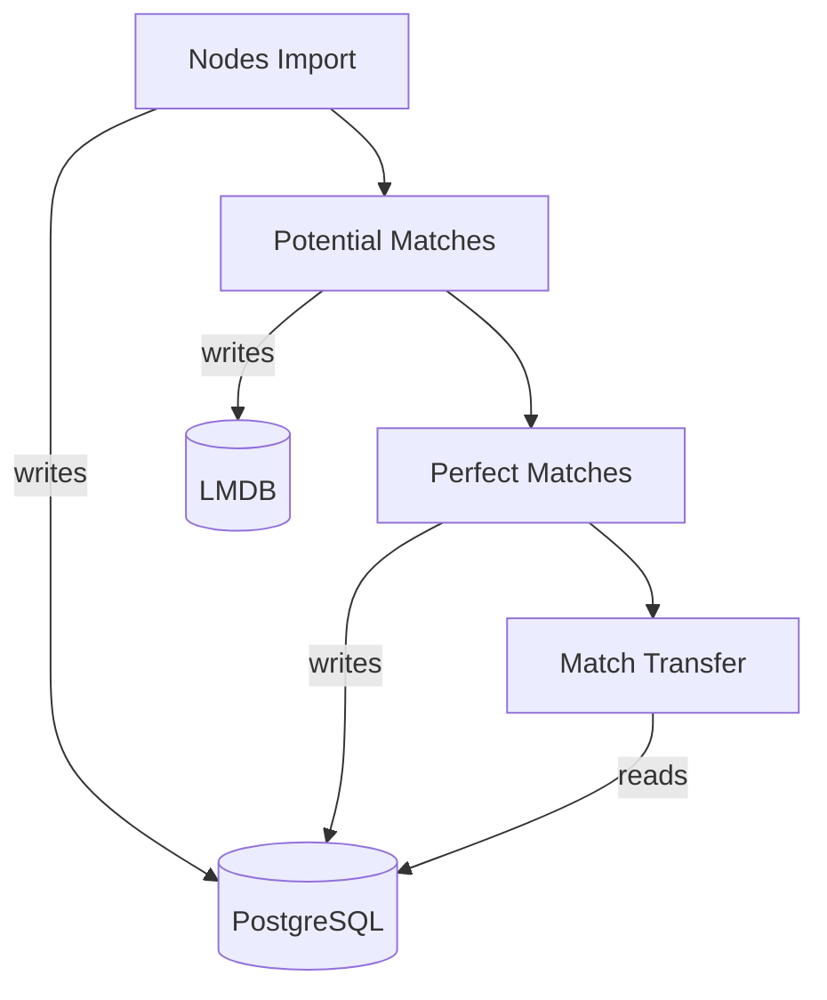

# Matching Pipeline — Overview

This platform ingests **nodes**, generates **potential matches**, computes **perfect matches**, and then **exports match results** to clients as a file with a downstream notification.

---

## End-to-End Flow

---

## 1) Nodes Import

**Goal:** Load nodes into PostgreSQL reliably and at high volume.

**How it works**
- Import request arrives via Kafka (file-based or reference-based).
- For file-based imports, the service downloads a CSV.GZ from MinIO/S3 and streams it in batches.
- Nodes are persisted using bulk writes (COPY + merge/UPSERT).
- A job status update is persisted and published.

**Output:** `nodes` (and metadata) in PostgreSQL.

---

## 2) Potential Matches Creation

**Goal:** Generate candidate match relationships efficiently.

**How it works**
- Runs on a schedule and/or incrementally (cursor-based).
- Fetches relevant nodes for each (domain, group).
- Selects a strategy (LSH / metadata-weighted / flat) based on configuration and data shape.
- Computes candidate edges and applies pruning (e.g., Top‑K) to control volume.
- Persists candidate edges to LMDB (and optionally to PostgreSQL depending on configuration).

**Output:** Candidate edges (primarily in LMDB for fast streaming).

---

## 3) Perfect Match Creation

**Goal:** Convert candidate edges into final “best” matches.

**How it works**
- Runs on a schedule per (domain, group).
- Streams edges from LMDB (forward-only, memory-efficient).
- Applies configured algorithm:
    - **Symmetric**: mutual / canonicalized pairing
    - **Asymmetric**: one-way selection rules
- Writes perfect matches to PostgreSQL using bulk persistence.

**Output:** `perfect_matches` in PostgreSQL.

---

## 4) Match Transfer to Client

**Goal:** Export matches as a client-consumable file and notify downstream systems.

**How it works**
- Runs on a schedule per (domain, group).
- Streams **potential** and **perfect** matches from PostgreSQL.
- Maps records to a transfer DTO and merges streams via a bounded queue (backpressure).
- `ExportService` writes the output file.
- Publishes a notification event containing the file reference.

**Output:** Exported file + message on the match-suggestions topic.

---

## Scheduling and Concurrency

- Each stage is **batch/scheduled** (with per-group task execution).
- Concurrency is controlled using **executors + permits** to avoid overloading DB and storage.
- Backpressure is enforced where streaming meets export (bounded queue).

---

## Operational Notes

- **Idempotency:** Writes use unique constraints and merge/UPSERT behavior to support safe reruns.
- **Resilience:** Retries and circuit breakers protect dependencies (DB, storage, export, messaging).
- **Observability:** Metrics track throughput, duration, failures, and executor health.

---

## Module Map (Logical)

