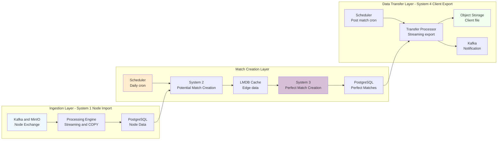

# Matchmaking Platform System: End-to-End Flow

This README provides a high-level overview of the Matchmaking Platform's core data pipeline, detailing the journey of an entity from initial ingestion to final match recommendation delivery.

The system is built on an event-driven, scheduled batch processing architecture, designed for extreme scalability, resilience, and high-quality graph computation.

---

## 1. Core Architectural Flow

The entire pipeline is divided into four distinct, sequential stages, governed primarily by scheduled batch jobs after the initial event-driven ingestion.

### **1.1 End-to-End Data Pipeline Diagram**

---

## 2. Component Deep Dive and Data Flow

Each system operates independently, consuming the output of the previous stage, ensuring transactional integrity and high throughput for its specific function.

### **2.1 System 1: Node Import System (Ingestion)**

**Goal:** Rapidly ingest and persist new entity data.

| Aspect | Details |
| :--- | :--- |
| **Trigger** | Real-time Kafka event (`NodeExchange` message) or file reference from MinIO/S3. |
| **Core Process** | Streams CSV/JSON payload, validates format, normalizes metadata. |
| **High Performance** | Utilizes **PostgreSQL COPY Protocol** for bulk, high-speed inserts (UPSERT logic). |
| **Output** | Writes validated `Node` and `Metadata` records to the primary **PostgreSQL** database. |
| **Resilience** | DLQ (Dead Letter Queue) for message processing failures; transactional integrity. |

---

### **2.2 System 2: Potential Match Creation**

**Goal:** Compute initial, high-volume compatibility relationships (Edges) using graph algorithms.

| Aspect | Details |
| :--- | :--- |
| **Trigger** | **Daily Scheduled Batch** (e.g., 01:28 IST). |
| **Core Process** | Reads `Node` data, applies similarity strategies (e.g., **LSH - Locality Sensitive Hashing**) to compute pairwise relationships. |
| **High Performance** | Uses **LMDB (Lightning Memory-Mapped Database)** as a transient, ultra-fast local edge cache to stream graph data without heavy database I/O. |
| **Output** | `PotentialMatchEntity` records saved to PostgreSQL; temporary edges stored in LMDB. |
| **Scalability** | Domain-based partitioning; uses concurrency controls (Semaphores) to manage resource usage. |

---

### **2.3 System 3: Perfect Match Creation**

**Goal:** Optimize potential matches using domain-specific algorithms to find the absolute best fit.

| Aspect | Details |
| :--- | :--- |
| **Trigger** | **Daily Scheduled Batch**, running immediately after Potential Match completion. |
| **Core Process** | Streams high-volume edges from LMDB, applies complex symmetric/asymmetric matching algorithms to assign final compatibility scores. |
| **High Performance** | Operates on a **streaming, memory-efficient graph model**; avoids loading the entire graph into heap memory. |
| **Output** | `PerfectMatchEntity` records written to PostgreSQL, replacing or updating older matches. |
| **Resilience** | Circuit Breakers prevent cascading failures; Advisory Locks ensure exclusive processing per group. |

---

### **2.4 System 4: Match Transfer to Client**

**Goal:** Deliver the final, computed match results to client-facing systems securely and efficiently.

| Aspect | Details |
| :--- | :--- |
| **Trigger** | **Post-Match Scheduled Batch**, running after Perfect Match completion. |
| **Core Process** | **Streams** `PotentialMatch` and `PerfectMatch` entities from PostgreSQL, maps them to client DTOs, and merges the two streams into a single output file. |
| **High Performance** | **Producer-Consumer pipeline** with a bounded queue to manage backpressure; streams directly to object storage (MinIO/S3). |
| **Output** | 1. **Exported File** (e.g., CSV/JSON) in Object Storage. 2. **Kafka Notification** (`MatchSuggestionsExchange`) containing the file reference. |
| **Delivery** | Client systems consume the notification and securely fetch the file from object storage. |

---

## 3. Technology and Non-Functional Summary

This system adheres to strict performance and reliability requirements enabled by its technology choices.

### **3.1 Core Technology Stack**

| Layer | Technology | Key Rationale |
| :--- | :--- | :--- |
| **Application** | Java 17, Spring Boot 3.x | Stability, concurrency tools, and enterprise ecosystem. |
| **Database** | PostgreSQL 15 | ACID compliance, `JSONB` for flexible metadata, and high-performance bulk operations (`COPY`). |
| **Cache/Graph I/O** | LMDB (Embedded KV Store) | Memory-mapped I/O provides near-zero-copy, lightning-fast reads for graph streaming. |
| **Messaging** | Apache Kafka | High-throughput, durable messaging for ingestion and notification. |
| **Resilience** | Resilience4j, Spring Retry | Automated failure handling, circuit breaking, and backoff strategies. |
| **Observability** | Prometheus, Grafana, ELK | Comprehensive monitoring of business metrics, application health, and resource consumption. |

### **3.2 Key Non-Functional Requirements (NFRs)**

| Metric | Target | Implemented Strategy |
| :--- | :--- | :--- |
| **Daily Volume** | 5M Nodes | Horizontal scaling, LMDB/PostgreSQL optimization. |
| **Processing Latency** | < 15 min (per full cycle) | Streaming I/O, parallel thread pool execution. |
| **System Availability** | 99.9% | Active-Passive deployment, automatic failover. |
| **Ingestion Throughput** | 10K nodes/sec | PostgreSQL COPY Protocol. |
| **Edge Computation Rate** | 500K edges/min | LSH for sub-linear complexity, LMDB streaming. |
| **Data Integrity** | ACID Compliant | Transactional boundaries, UPSERT/Advisory Locks. |

---

## 4. Operational Model

### **4.1 Deployment Strategy**

The system employs a **Blue-Green Deployment** strategy for production releases to ensure zero downtime. Instances are run in an **Active-Passive** configuration, utilizing shared PostgreSQL and dedicated local LMDB instances, ensuring rapid failover capability.

### **4.2 Monitoring and Alerts**

The pipeline is instrumented with Micrometer, exposing critical metrics to Prometheus:

*   **Business Metrics**: Job Success Rate, End-to-End Latency, Match Volume.
*   **Performance Metrics**: Edge Computation Rate, DB Write TPS, Executor Queue Depth.
*   **Operational Alerts**: PagerDuty notifications are triggered for P0/P1 incidents (e.g., DB connection pool exhaustion, high error rates, processing timeouts).

By integrating these four specialized systems, the platform provides a robust, scalable, and highly reliable engine for transforming raw data into actionable match recommendations.