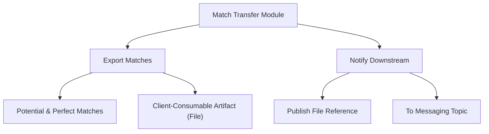
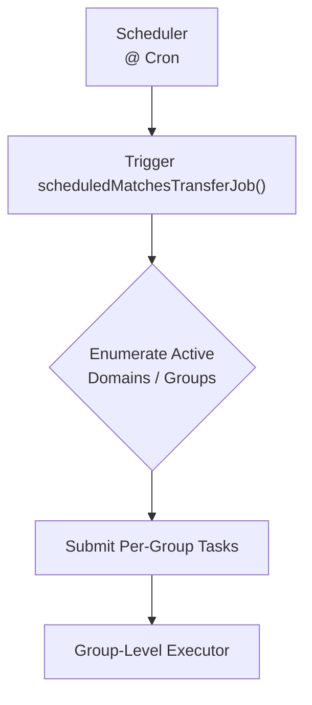
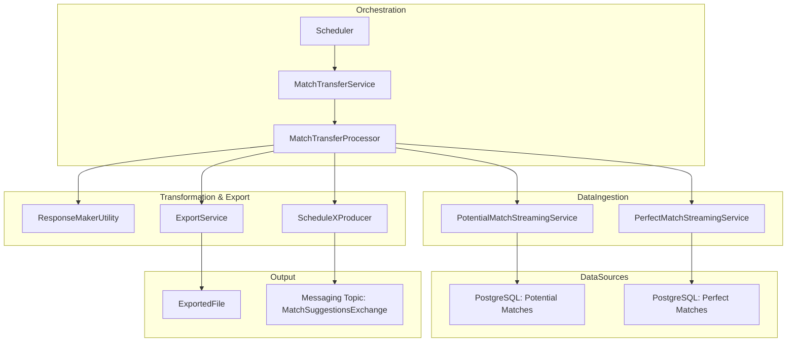
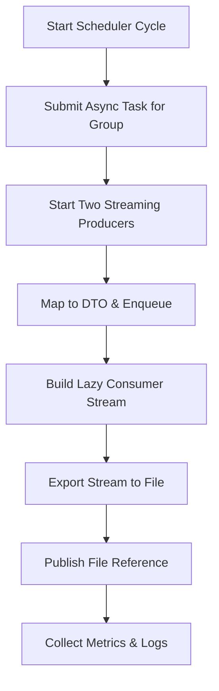
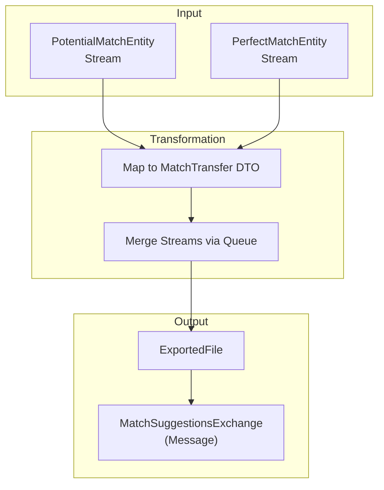
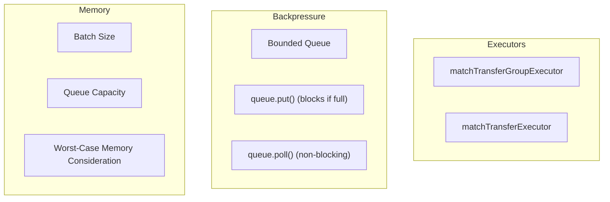
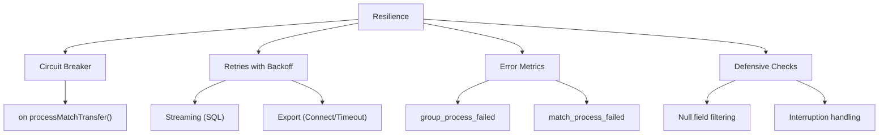
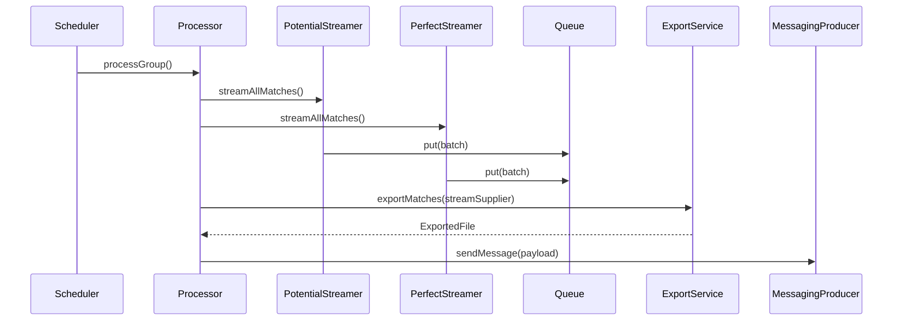
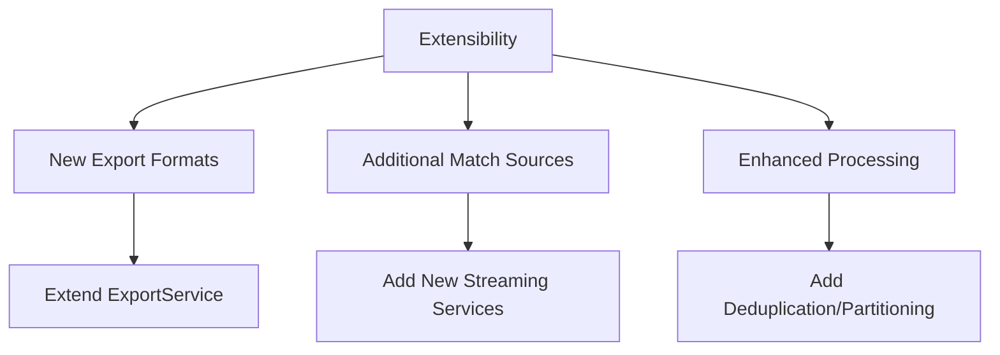

# **Match Transfer to Client — High-Level Design (HLD) with Diagrams**

---

## **1) Purpose and Scope**

### **Purpose Diagram**

### **Scope**
- **Objective**: Periodically export potential and perfect matches for each group/domain to a file and notify downstream systems.
- **Inputs**:
    - Streams of `PotentialMatchEntity` and `PerfectMatchEntity` from PostgreSQL.
- **Process**:
    - Transforms database entities into transfer DTOs.
    - Exports to a file via `ExportService`.
    - Publishes a file reference to a messaging topic.
- **Constraints**:
    - Batch/scheduled execution.
    - High-throughput streaming from the database.

---

## **2) Triggers and Entry Points**

### **Trigger Flow Diagram**

- **Scheduler**: `MatchesTransferScheduler.scheduledMatchesTransferJob`
- **Cron Expression**: Configurable via property (e.g., `${match.transfer.cron-schedule}`)
- **Behavior**:
    - Enumerates active domains and their associated groups.
    - Submits per-group transfer tasks to a dedicated group-level executor.

---

## **3) Architecture Overview**

### **High-Level Architecture Diagram**

### **Key Layers**
- **Orchestration**: Manages scheduled execution and per-group task dispatching.
- **Data Ingestion**: Streams data from PostgreSQL using JDBC.
- **Transformation & Export**: Maps entities, creates export files, and publishes notifications.
- **Concurrency**: Producer-consumer pipeline with a bounded queue for backpressure.

---

## **4) End-to-End Flow**

### **End-to-End Flow Diagram**

### **Detailed Flow**
1. **Scheduler**: Submits an async task for each group.
2. **Processor**:
    - Starts two streaming producers (Potential and Perfect).
    - Maps database entities to `MatchTransfer` DTOs and enqueues them.
    - Builds a lazy `Stream` that polls the queue.
3. **Export & Send**:
    - `ExportService` consumes the stream and creates a file.
    - A message is published to the messaging topic.
4. **Monitoring**: Collects metrics and logs for each group.

---

## **5) Components and Responsibilities**

### **Component Responsibility Diagram**

```mermaid
classDiagram
    class MatchesTransferScheduler {
        +Cron trigger
        +Dispatches async per-group transfers
        +Monitors executor health
    }

    class MatchTransferService {
        +Thin facade
        +Delegates to processor
    }

    class MatchTransferProcessor {
        +Coordinates streaming, export, and messaging
        +Producer-consumer pipeline with backpressure
        +Implements resilience mechanisms
    }

    class PotentialMatchStreamingService {
        +JDBC forward-only streaming
    }

    class PerfectMatchStreamingService {
        +JDBC forward-only streaming
    }

    class ExportService {
        <<external>>
        +Consumes stream
        +Produces ExportedFile
    }

    class ScheduleXProducer {
        <<external>>
        +Publishes to messaging topic
    }
```

---

## **6) Data Flow**

### **Data Flow Diagram**

- **Inputs**: Streams of `PotentialMatchEntity` and `PerfectMatchEntity`.
- **Transform**: Maps entities to a common `MatchTransfer` DTO and merges them.
- **Outputs**: An `ExportedFile` and a message on the topic.

---

## **7) Concurrency, Backpressure, and Memory**

### **Concurrency Model Diagram**

- **Executors**: Separate pools for group scheduling and producer/consumer tasks.
- **Backpressure**: A bounded queue blocks producers when full.
- **Memory**: The queue size represents the primary consideration; batch size and queue capacity should be configured appropriately.
- **Termination**: An `AtomicBoolean` flag coordinates the shutdown of the consumer.

---

## **8) Resilience and Error Handling**

### **Resilience Mechanisms**

- **Circuit Breaker**: Applied to `processMatchTransfer` to prevent cascading failures.
- **Retries**: Applied to streaming and export operations.
- **Error Metrics**: Dedicated counters for tracking failures.
- **Defensive Checks**: Null filtering and proper interruption handling.

---

## **9) Design Characteristics (Intended)**

- **Concurrency**: Asynchronous per-group processing with dedicated executors.
- **Backpressure Handling**: Built-in via bounded queue to prevent overload.
- **Resilience**: Integration of circuit breakers and retry mechanisms.
- **Observability**: Provision for gauges, timers, and counters to monitor executor health, operation durations, and processing outcomes.

---

## **10) Configuration Considerations**

| **Key** | **Purpose** |
|---|---|
| `match.transfer.cron-schedule` | Defines the schedule for the job |
| `match.transfer.batch-size` | Controls DB fetch size per streamed batch |
| `matchTransferGroupExecutor` | Manages per-group parallelism |
| `matchTransferExecutor` | Manages producer/consumer parallelism |
| `Topic suffix` | Defines suffix for the messaging topic name |

---

## **11) Sequence (Per Group)**

### **High-Level Sequence Diagram**

---

## **12) Security & Data Integrity**

| **Concern** | **Mitigation** |
|---|---|
| **Data Integrity** | Raw data transfer; deduplication is downstream responsibility |
| **Security** | Secure storage ACLs and topic authorization |
| **Sensitive Data** | Sanitize fields in `ResponseMakerUtility` mapping |

---

## **13) Risks & Considerations**

| **Risk** | **Recommendation** |
|---|---|
| **Memory Pressure** | Adjust batch size and queue capacity; consider push-based export |
| **Ordering/Duplication** | Add merging/deduplication logic if required by clients |
| **Backpressure Visibility** | Include metrics for internal queue fill percentage |
| **Failure Semantics** | Ensure producer failures are surfaced and logged clearly |
| **Producer/Consumer Coupling** | Balance export throughput with streaming rate to avoid stalls |

---

## **14) Extensibility**

### **Extensibility Points**

- **New Export Formats**: Extend `ExportService` and the message schema.
- **Additional Match Sources**: Add new streaming services to feed the same queue.
- **Enhanced Processing**: Add deduplication or partitioning logic within the `MatchTransferProcessor`.