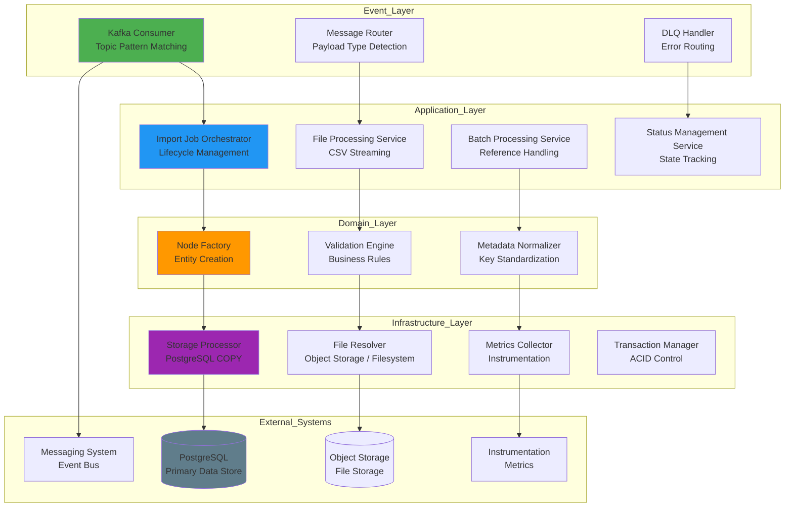
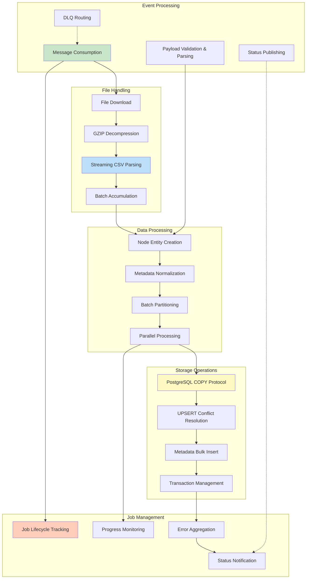
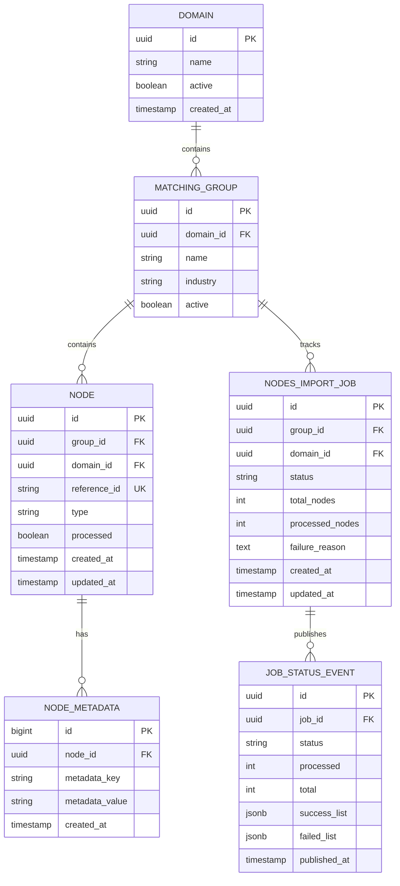
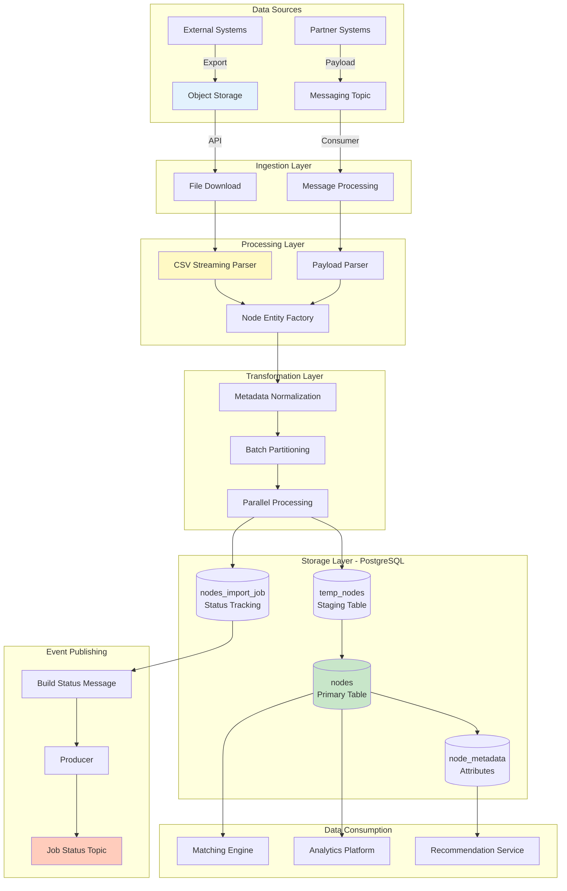
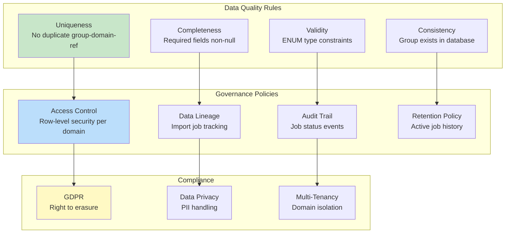

# Node Import System - High-Level Design Document


---

This document describes the architectural design of a node import pipeline developed as part of an independent backend systems project. The focus is on system structure, data flow, and correctness rather than production deployment or operational tuning.

## Table of Contents

1. [Executive Summary](#1-executive-summary)
2. [System Architecture](#3-system-architecture)
3. [Functional Architecture](#4-functional-architecture)
4. [Technology Stack](#6-technology-stack)
5. [Data Architecture](#7-data-architecture)

---

## 1. Executive Summary

### 1.1 System Overview

The **Node Import System** is an event-driven data ingestion system designed to process entity imports into the matching engine ecosystem. It consumes import requests from messaging topics, processes CSV files from object storage or reference lists, and bulk-loads entities into PostgreSQL with comprehensive error handling, status tracking, and instrumentation.

---

## 3. System Architecture

### 3.1 Logical Architecture



---

## 4. Functional Architecture

### 4.1 Core Capabilities



### 4.2 Processing Pipeline

```mermaid
flowchart LR
    A[Event Trigger] --> B{Message Type?}
    
    B -->|File-Based Import| C[Download File]
    B -->|Reference-Based Import| D[Create Nodes from IDs]
    
    C --> E[Stream GZIP CSV]
    E --> F[Parse Configurable Batches]
    
    D --> G[Partition into Configurable Batches]
    
    F --> H[Convert to Node Entities]
    G --> H
    
    H --> I[Parallel Batch Processing<br/>Bounded Concurrency]
    
    I --> J[PostgreSQL COPY to temp_nodes]
    J --> K[UPSERT via INSERT ON CONFLICT]
    K --> L[Bulk Insert Metadata]
    
    L --> M{All Batches Done?}
    M -->|Yes| N[Aggregate Results]
    M -->|More| I
    
    N --> O{Success Rate?}
    O -->|100%| P[Status: COMPLETED]
    O -->|<100%| Q[Status: FAILED]
    
    P --> R[Publish to Messaging System<br/>Job Status Topic]
    Q --> R
    
    style A fill:#4CAF50
    style E fill:#2196F3
    style I fill:#FF9800
    style J fill:#9C27B0
    style R fill:#F44336
```



### 4.3 Feature Matrix

| Feature | Priority | Design Coverage | Implementation Notes |
|---------|----------|-----------------|----------------------|
| **File-Based Import (CSV)** | P0 | Supported | GZIP streaming + PostgreSQL COPY |
| **Reference-Based Import** | P0 | Supported | List of IDs → Node creation |
| **Object Storage Integration** | P0 | Supported | S3-compatible API for file download |
| **Local Filesystem Support** | P1 | Supported | Direct file access |
| **DLQ Error Handling** | P0 | Supported | Auto-routing + manual replay |
| **Job Status Tracking** | P0 | Supported | State machine + messaging publishing |
| **Metadata Normalization** | P1 | Supported | Header standardization |
| **Batch Timeout Management** | P1 | Supported | Dynamic timeout calculation |
| **Parallel Processing** | P0 | Supported | Configurable concurrent batch workers |
| **Transaction Safety** | P0 | Supported | ACID via TransactionTemplate |
| **Retry Mechanism** | P1 | Supported | Retry with backoff |
| **REST API for Manual Trigger** | P2 | Planned | HTTP endpoint for on-demand imports |
| **Real-time Progress Updates** | P2 | Planned | WebSocket or SSE for live status |
| **Schema Validation** | P3 | Planned | JSON Schema for payload validation |

---

## 6. Technology Stack

### 6.1 Technology Landscape

```mermaid
graph TB
    subgraph "Application Tier"
        A1[Java]
        A2[Spring Boot]
        A3[Spring Kafka]
        A4[Spring Data JPA]
    end
    
    subgraph "Event Tier"
        B1[Apache Kafka]
        B2[Kafka Connect (Conceptual)]
        B3[Schema Registry (Conceptual)]
    end
    
    subgraph "Storage Tier"
        C1[PostgreSQL]
        C2[S3-Compatible Object Storage]
        C3[Connection Pooling]
    end
    
    subgraph "Instrumentation (Design Intent)"
        D1[Metrics Framework]
        D2[Structured Logging]
    end
    
    subgraph "Deployment Targets (Conceptual)"
        E1[Docker Containers]
        E2[Container Orchestration (Conceptual)]
        E3[Cloud Platforms (Conceptual)]
    end
    
    A1 --> B1
    A2 --> C1
    A3 --> D1
    B1 --> E1
    
    style A1 fill:#4CAF50
    style B1 fill:#2196F3
    style C1 fill:#FF9800
    style D1 fill:#9C27B0
    style E1 fill:#F44336
```

### 6.2 Technology Selection Rationale

| Technology | Purpose | Alternatives Considered | Decision Rationale |
|------------|---------|------------------------|-------------------|
| **Java** | Programming Language | Kotlin, Go | Long-term support, ecosystem maturity |
| **Spring Boot** | Application Framework | Quarkus, Micronaut | Enterprise integration, productivity |
| **Kafka** | Event Streaming | RabbitMQ, Message Queues | High throughput, durability |
| **PostgreSQL** | Primary Database | MySQL, MongoDB | JSONB support, COPY protocol, ACID compliance |
| **S3-Compatible Storage** | Object Storage | Direct Filesystem | Standardized API, flexibility |
| **Spring Kafka** | Kafka Client | Native Client | Integration, error handling support |
| **Metrics Framework** | Instrumentation | Alternative Libraries | Vendor-neutral design |
| **Connection Pooling** | Database Efficiency | Alternative Pools | Performance and reliability |

### 6.3 Dependency Management

```yaml
Key Dependencies:
  Spring Boot:
    - spring-boot-starter-web
    - spring-boot-starter-data-jpa
    - spring-boot-starter-actuator
  
  Kafka:
    - spring-kafka
  
  Database:
    - postgresql
    - Connection Pooling
  
  File Processing:
    - S3 Client
    - CSV Library
  
  Utilities:
    - lombok
    - jackson-databind
    - guava
  
  Testing:
    - junit-jupiter
    - mockito-core
    - testcontainers
```

---

## 7. Data Architecture

### 7.1 Conceptual Data Model



### 7.2 Data Flow Architecture



### 7.3 Data Quality & Governance



---

## Appendix A: Glossary

| Term | Definition |
|------|------------|
| **Node** | An entity (user, product, resource) in the matching system |
| **Import Job** | A tracked instance of a bulk node import operation |
| **DLQ** | Dead Letter Queue - topic for failed messages |
| **COPY Protocol** | PostgreSQL bulk loading mechanism (binary format) |
| **UPSERT** | INSERT with ON CONFLICT DO UPDATE (idempotent insert) |
| **MinIO** | S3-compatible object storage system |
| **WAL** | Write-Ahead Log (PostgreSQL transaction log) |

---

## Appendix B: References

**Design Documentation**:
- Node Import System - Low-Level Design (LLD)
- Messaging Topic Configuration Guide
- PostgreSQL COPY Protocol Best Practices

**External References**:
- [Spring Kafka Documentation](https://spring.io/projects/spring-kafka)
- [PostgreSQL COPY Documentation](https://www.postgresql.org/docs/current/sql-copy.html)
- [S3 API Documentation](https://docs.aws.amazon.com/AmazonS3/latest/API/Welcome.html)