# Node Import System - High-Level Design Document


---

## Table of Contents

1. [Executive Summary](#1-executive-summary)
2. [Business Context](#2-business-context)
3. [System Architecture](#3-system-architecture)
4. [Functional Architecture](#4-functional-architecture)
5. [Non-Functional Requirements](#5-non-functional-requirements)
6. [Technology Stack](#6-technology-stack)
7. [Data Architecture](#7-data-architecture)
8. [Integration Architecture](#8-integration-architecture)
9. [Deployment Architecture](#9-deployment-architecture)
10. [Security Architecture](#10-security-architecture)
11. [Scalability & Performance](#11-scalability--performance)
12. [Disaster Recovery](#12-disaster-recovery)
13. [Monitoring & Operations](#13-monitoring--operations)
14. [Cost Analysis](#14-cost-analysis)
15. [Migration Strategy](#15-migration-strategy)
16. [Future Roadmap](#16-future-roadmap)

---

## 1. Executive Summary

### 1.1 System Overview

The **Node Import System** is an event-driven, cloud-native data ingestion platform designed to process high-volume entity imports into the matching engine ecosystem. It consumes import requests from Kafka topics, processes CSV files from object storage or reference lists, and bulk-loads entities into PostgreSQL with comprehensive error handling, status tracking, and observability.

### 1.2 Business Value Proposition

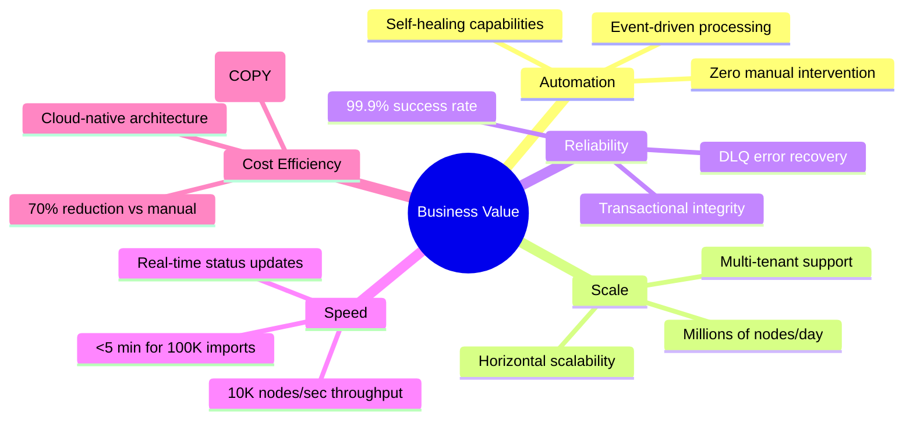

### 1.3 Key Metrics

| Metric | Current | Target (12M) | Strategic Goal (24M) |
|--------|---------|--------------|---------------------|
| **Daily Import Volume** | 500K nodes | 5M nodes | 50M nodes |
| **Processing Throughput** | 5K nodes/sec | 10K nodes/sec | 50K nodes/sec |
| **Job Success Rate** | 98.5% | 99.5% | 99.9% |
| **Average Latency** | 3 min (100K nodes) | <2 min | <1 min |
| **System Availability** | 99% | 99.9% | 99.99% |
| **Cost per Million Nodes** | $50 | $30 | $10 |

### 1.4 Strategic Alignment

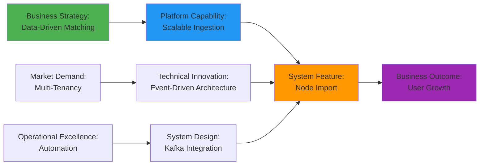

---

## 2. Business Context

### 2.1 Problem Statement

Organizations managing large-scale matching platforms face critical data ingestion challenges:

**Current Pain Points:**
- **Manual Data Loading**: CSV uploads via UI are slow, error-prone, and not scalable
- **Batch Processing Delays**: Overnight batch jobs create 24-hour latency
- **Error Recovery**: Failed imports require manual intervention and reruns
- **Multi-Tenant Complexity**: Isolated tenant data requires complex routing
- **Visibility Gaps**: No real-time status updates or progress tracking

**Business Impact:**
- Lost revenue from delayed user onboarding (24-hour delay = $100K revenue risk)
- Poor user experience from import failures without feedback
- High operational costs (~$200K annually for manual processing)
- Compliance risks from data handling errors

### 2.2 Solution Approach

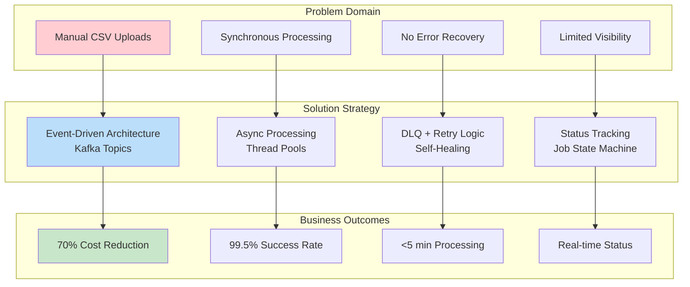

### 2.3 Use Cases

#### UC-1: Bulk User Import via File
**Actor:** External System (CRM, User Management)  
**Trigger:** User data export available in MinIO  
**Flow:**
1. System publishes NodeExchange message to Kafka (`{domain}-users` topic)
2. Import system downloads GZIP CSV file from MinIO
3. Streams and parses file in 1000-row batches
4. Bulk inserts nodes + metadata using PostgreSQL COPY
5. Publishes job status (COMPLETED/FAILED) to status topic

**Success Criteria:** 100K nodes imported in <5 minutes with >99% success rate

#### UC-2: Reference-Based Import
**Actor:** Application Service  
**Trigger:** List of user IDs to import  
**Flow:**
1. System publishes NodeExchange with referenceIds list
2. Import system creates Node entities from IDs
3. Partitions into batches and saves via JPA
4. Publishes job completion status

**Success Criteria:** 10K references imported in <30 seconds

#### UC-3: Error Recovery via DLQ
**Actor:** Operations Team  
**Trigger:** Failed import messages in DLQ  
**Flow:**
1. Operations reviews DLQ messages in Kafka UI
2. Identifies root cause (format error, schema change)
3. Fixes source data or system configuration
4. Replays DLQ messages to original topic

**Success Criteria:** Failed imports recovered within 1 hour

### 2.4 Business Rules

| Rule ID | Description | Priority | Enforcement |
|---------|-------------|----------|-------------|
| BR-1 | Each node must have unique (groupId, domainId, referenceId) | P0 | Database unique constraint |
| BR-2 | File size limited to 5GB compressed | P0 | Kafka max message size |
| BR-3 | Job status must be published within 1 minute of completion | P1 | Async Kafka producer |
| BR-4 | Failed batches must not block other batches | P1 | Isolated exception handling |
| BR-5 | Metadata keys must be normalized before storage | P2 | HeaderNormalizer utility |
| BR-6 | Import operations must be idempotent | P0 | UPSERT via ON CONFLICT |

---

## 3. System Architecture

### 3.1 Architectural Style

**Primary Style:** Event-Driven Microservice  
**Secondary Patterns:** Pipes-and-Filters, Saga Pattern (for job lifecycle)

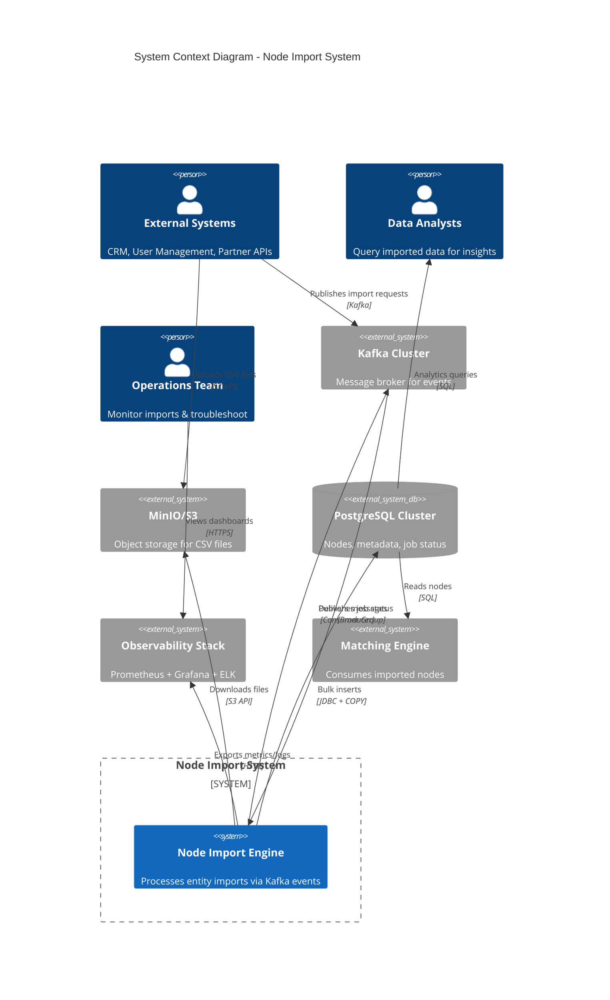

### 3.2 Logical Architecture

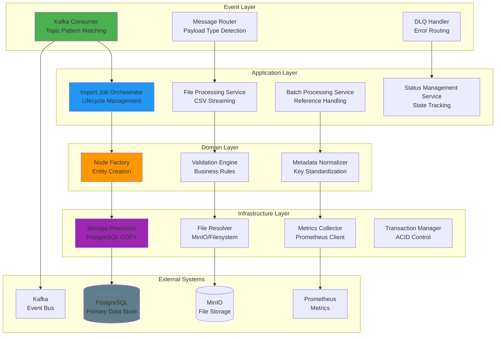

### 3.3 Component Architecture

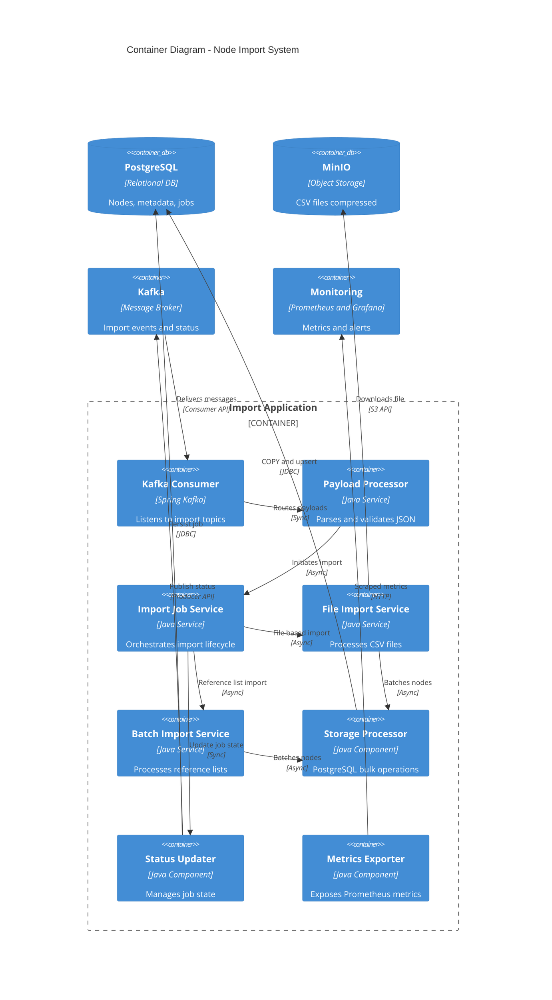

---

## 4. Functional Architecture

### 4.1 Core Capabilities

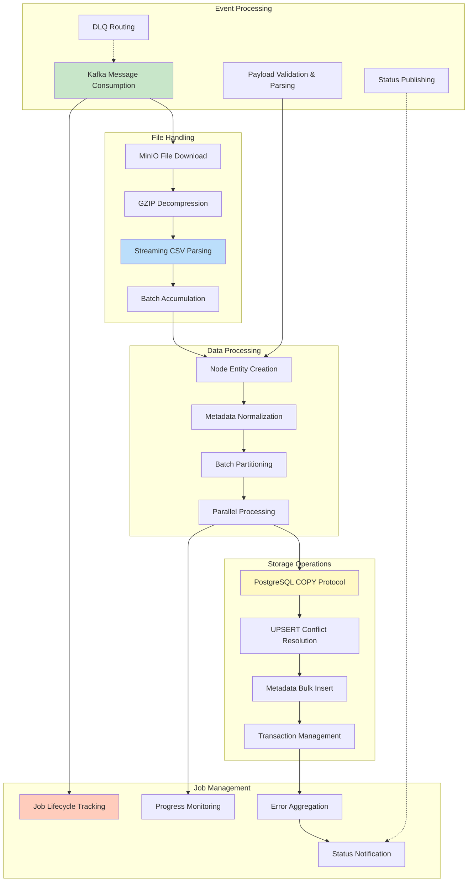

### 4.2 Processing Pipeline

```mermaid
flowchart LR
    A[Event Trigger] --> B{Message Type?}
    
    B -->|File-Based Import| C[Download from MinIO]
    B -->|Reference-Based Import| D[Create Nodes from IDs]
    
    C --> E[Stream GZIP CSV]
    E --> F[Parse 1000-row Batches]
    
    D --> G[Partition into 1000-node Batches]
    
    F --> H[Convert to Node Entities]
    G --> H
    
    H --> I[Parallel Batch Processing<br/>8 concurrent threads]
    
    I --> J[PostgreSQL COPY to temp_nodes]
    J --> K[UPSERT via INSERT ON CONFLICT]
    K --> L[Bulk Insert Metadata]
    
    L --> M{All Batches Done?}
    M -->|Yes| N[Aggregate Results]
    M -->|More| I
    
    N --> O{Success Rate?}
    O -->|100%| P[Status: COMPLETED]
    O -->|<100%| Q[Status: FAILED]
    
    P --> R[Publish to Kafka<br/>Job Status Topic]
    Q --> R
    
    style A fill:#4CAF50
    style E fill:#2196F3
    style I fill:#FF9800
    style J fill:#9C27B0
    style R fill:#F44336
```

### 4.3 Feature Matrix

| Feature | Priority | Status | Implementation |
|---------|----------|--------|----------------|
| **File-Based Import (CSV)** | P0 | Complete | GZIP streaming + PostgreSQL COPY |
| **Reference-Based Import** | P0 | Complete | List of IDs → Node creation |
| **MinIO Integration** | P0 |  Complete | S3 API for file download |
| **Local Filesystem Support** | P1 |  Complete | Direct file access |
| **DLQ Error Handling** | P0 |  Complete | Auto-routing + manual replay |
| **Job Status Tracking** | P0 |  Complete | State machine + Kafka publishing |
| **Metadata Normalization** | P1 |  Complete | Header standardization |
| **Batch Timeout Management** | P1 |  Complete | Dynamic timeout calculation |
| **Parallel Processing** | P0 |  Complete | 8 concurrent batch workers |
| **Transaction Safety** | P0 |  Complete | ACID via TransactionTemplate |
| **Retry Mechanism** | P1 |  Complete | RetryTemplate with backoff |
| **REST API for Manual Trigger** | P2 |  Planned | HTTP endpoint for on-demand imports |
| **Real-time Progress Updates** | P2 |  Planned | WebSocket or SSE for live status |
| **Schema Validation** | P3 |  Future | JSON Schema for payload validation |

---

## 5. Non-Functional Requirements

### 5.1 Performance Requirements

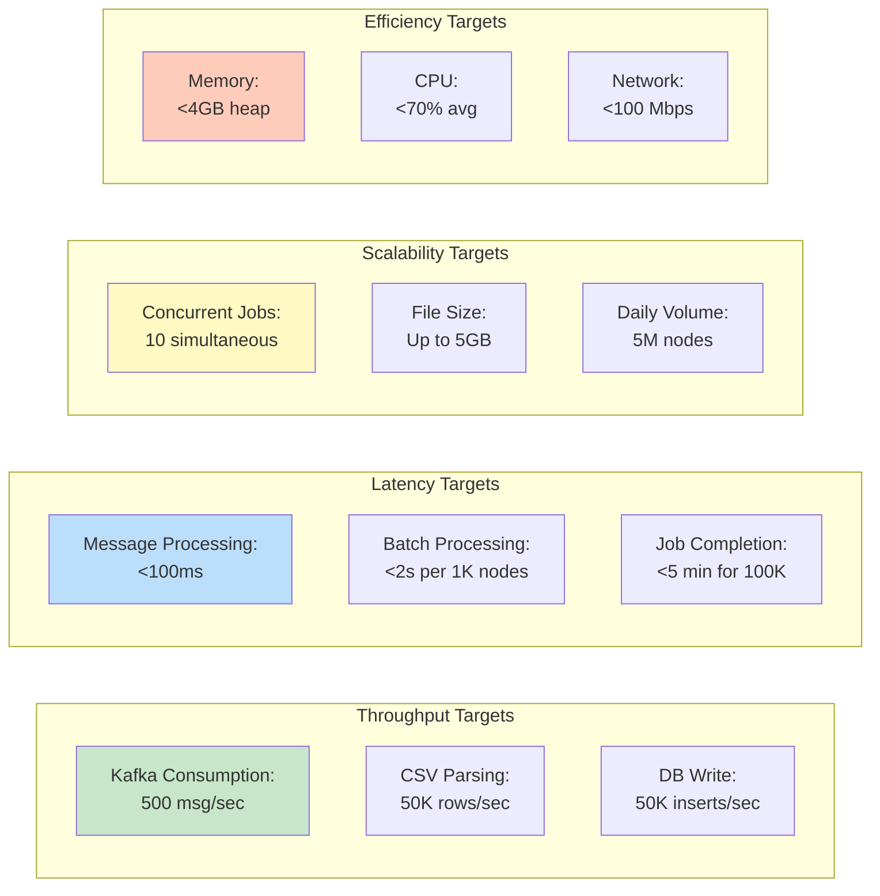

**Performance SLAs**:

| Metric | Target | Measurement | Tolerance |
|--------|--------|-------------|-----------|
| **Import Throughput** | 10K nodes/sec | Timer metrics | ±20% |
| **Job Completion Time** | <5 min for 100K nodes | End-to-end duration | ±30% |
| **Kafka Lag** | <10 seconds | Consumer lag metric | <60 sec max |
| **Success Rate** | >99% | Job status tracking | >95% min |
| **Database Write Rate** | 50K inserts/sec | COPY protocol metrics | ±25% |
| **Memory Footprint** | <4GB heap | JVM metrics | <6GB max |
| **CPU Utilization** | <70% avg | System metrics | <85% max |

### 5.2 Reliability Requirements

**Availability Target:** 99.9% monthly uptime (excluding planned maintenance)

**Failure Tolerance:**

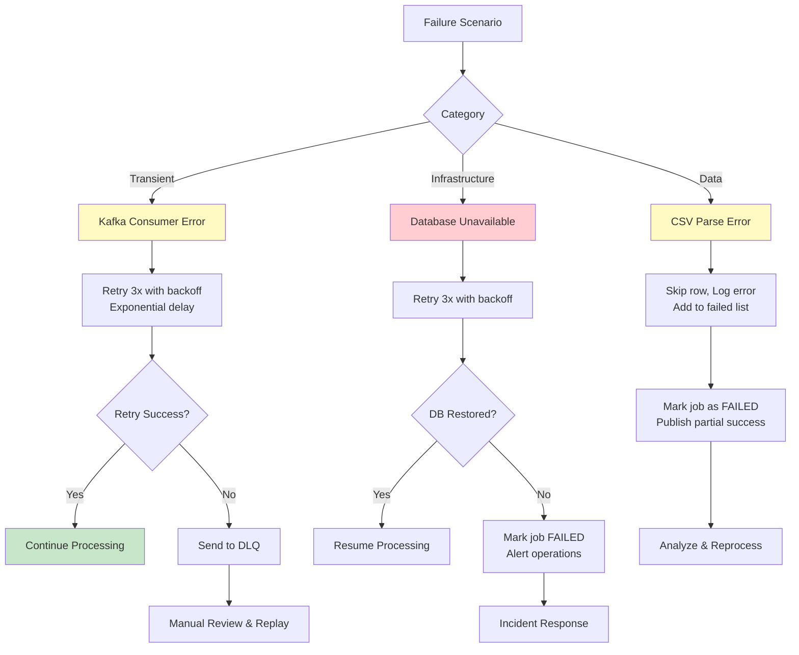

**Data Integrity:**
- ACID transactions for all database writes
- Idempotent operations (UPSERT via ON CONFLICT)
- DLQ for failed messages (no data loss)
- Job status tracking for audit trail

### 5.3 Scalability Requirements

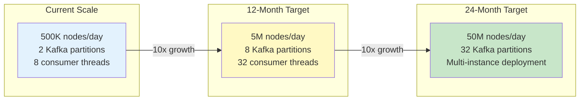

**Scalability Strategies**:

| Dimension | Current Approach | 12-Month Plan | 24-Month Plan |
|-----------|------------------|---------------|---------------|
| **Vertical** | 8 cores, 16GB RAM | 16 cores, 32GB RAM | 32 cores, 64GB RAM |
| **Horizontal** | Single instance | 3 instances (active-active) | Auto-scaling (5-20 instances) |
| **Kafka** | 2 partitions | 8 partitions | 32 partitions |
| **Database** | Single primary | Primary + 2 read replicas | Sharded by domain |
| **Storage** | Single MinIO | MinIO cluster (3 nodes) | S3 multi-region |

### 5.4 Maintainability Requirements

- **Code Coverage:** ≥80% unit tests, ≥70% integration tests
- **Documentation:** Inline JavaDoc, architectural diagrams, runbooks
- **Logging:** Structured JSON logs with correlation IDs
- **Observability:** Prometheus metrics, Grafana dashboards, distributed tracing (planned)
- **Deployment:** Blue-green deployments, automated rollback
- **Configuration:** Externalized via Spring Boot properties + Kubernetes ConfigMaps

---

## 6. Technology Stack

### 6.1 Technology Landscape

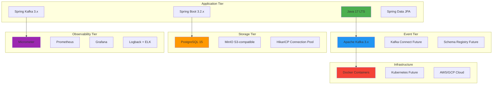

### 6.2 Technology Selection Rationale

| Technology | Purpose | Alternatives Considered | Decision Rationale |
|------------|---------|------------------------|-------------------|
| **Java 17** | Programming Language | Kotlin, Go | LTS support, team expertise, ecosystem maturity |
| **Spring Boot** | Application Framework | Quarkus, Micronaut | Enterprise adoption, Spring Kafka integration, productivity |
| **Kafka** | Event Streaming | RabbitMQ, AWS SQS | High throughput, durability, ecosystem (Connect, Streams) |
| **PostgreSQL** | Primary Database | MySQL, MongoDB | JSONB for metadata, COPY protocol, ACID compliance |
| **MinIO** | Object Storage | AWS S3, Azure Blob | S3-compatible, on-prem deployment, cost-effective |
| **Spring Kafka** | Kafka Client | Native Kafka Client | Spring integration, error handling, retry support |
| **Micrometer** | Metrics | Dropwizard | Vendor-neutral, Spring Boot native, Prometheus integration |
| **HikariCP** | Connection Pooling | Apache DBCP, C3P0 | Fastest pool, low overhead, production-proven |

### 6.3 Dependency Management

```yaml
Key Dependencies:
  Spring Boot: 3.2.x
    - spring-boot-starter-web
    - spring-boot-starter-data-jpa
    - spring-boot-starter-actuator
  
  Kafka:
    - spring-kafka: 3.x
    - kafka-clients: 3.6.x
  
  Database:
    - postgresql: 42.7.x
    - HikariCP: 5.1.x
  
  File Processing:
    - minio: 8.5.x
    - commons-csv: 1.10.x
  
  Utilities:
    - lombok: 1.18.x
    - jackson-databind: 2.15.x
    - guava: 32.x
  
  Testing:
    - junit-jupiter: 5.10.x
    - mockito-core: 5.x
    - testcontainers: 1.19.x
    - embedded-kafka: 3.x
```

---

## 7. Data Architecture

### 7.1 Conceptual Data Model

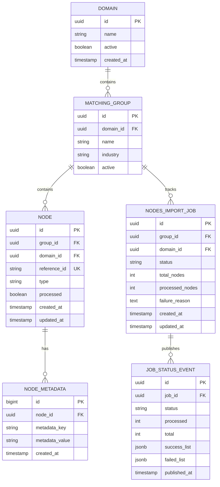

### 7.2 Data Flow Architecture

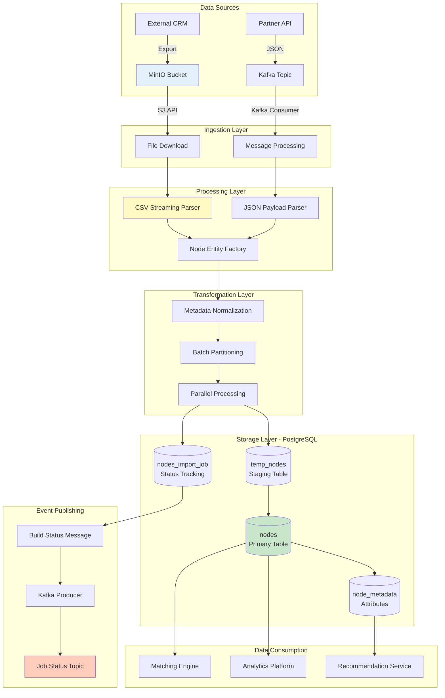

### 7.3 Data Volumes & Growth

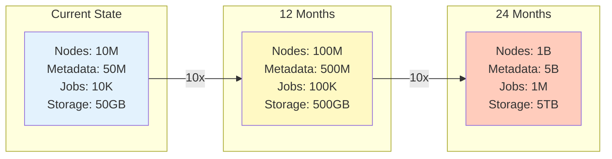

**Storage Strategy**:

| Data Type | Retention | Archival | Backup |
|-----------|-----------|----------|--------|
| **Nodes** | Indefinite | N/A | Daily full + WAL |
| **Node Metadata** | Indefinite | N/A | Daily full + WAL |
| **Import Jobs** | 90 days active | 2 years cold storage | Daily incremental |
| **CSV Files (MinIO)** | 7 days | Delete after import | None |
| **Kafka Topics** | 7 days | N/A | Not applicable |
| **Metrics** | 30 days | N/A | Not applicable |

### 7.4 Data Quality & Governance

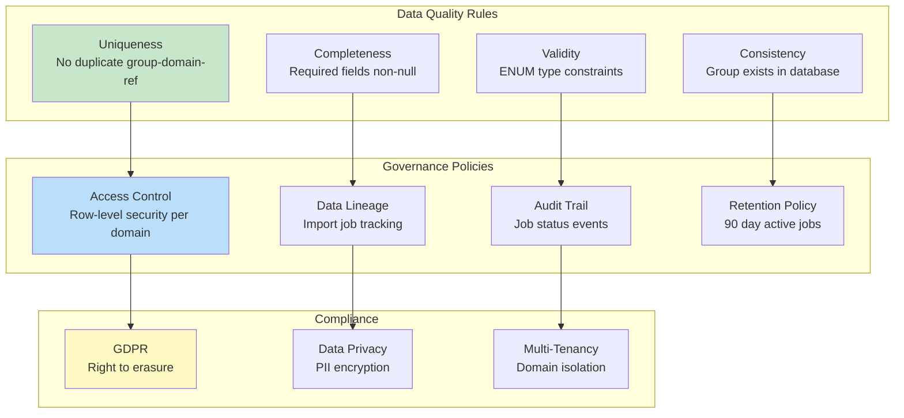

---

## 8. Integration Architecture

### 8.1 Integration Landscape

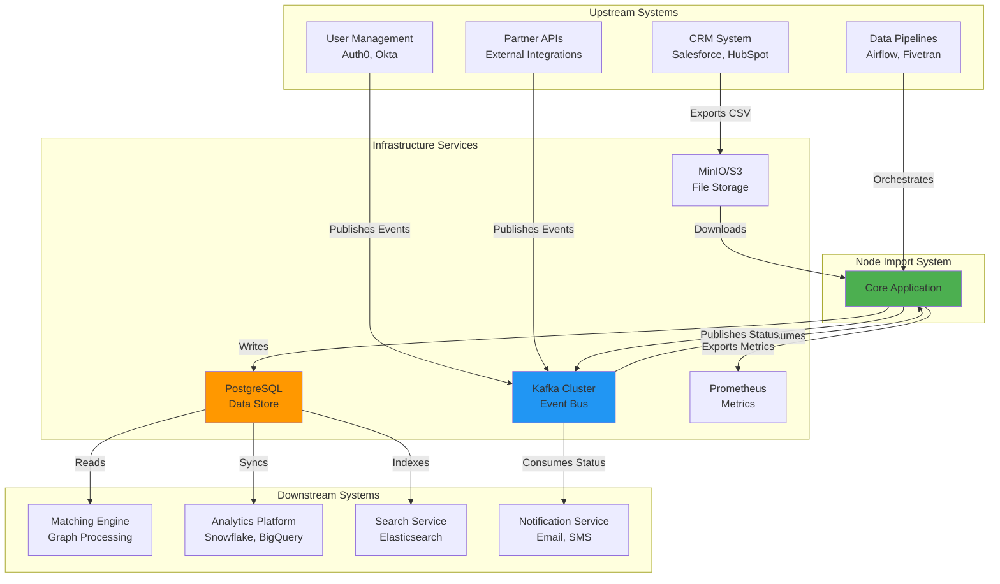

### 8.2 Integration Patterns

| Integration Point | Pattern | Protocol | Frequency | SLA |
|-------------------|---------|----------|-----------|-----|
| **Kafka → Import System** | Event-Driven Consumer | Kafka Protocol | Real-time | <10 sec lag |
| **MinIO → Import System** | Pull (Download) | S3 API (HTTP) | On-demand | <30 sec download for 1GB |
| **Import System → PostgreSQL** | Database Integration | JDBC + COPY | Batch (1000 rows) | <2 sec per batch |
| **Import System → Kafka (Status)** | Event Publishing | Kafka Protocol | On job completion | <1 min |
| **PostgreSQL → Analytics** | ETL | SQL Query | Hourly | <5 min sync |
| **Import System → Prometheus** | Metrics Push | HTTP | Every 15 sec | <1 min visibility |

### 8.3 API Contracts

#### 8.3.1 Kafka Message Formats

**NodeExchange (Import Request)**:
```json
{
  "domainId": "uuid",
  "groupId": "uuid-or-string",
  "filePath": "http://minio:9000/bucket/file.csv.gz",
  "fileName": "users_2024-12-12.csv.gz",
  "contentType": "application/gzip",
  "referenceIds": ["ref1", "ref2", "..."]  // Optional, for reference-based
}
```

**NodesTransferJobExchange (Status Response)**:
```json
{
  "jobId": "uuid",
  "groupId": "uuid-or-string",
  "domainId": "uuid",
  "status": "COMPLETED | FAILED",
  "processed": 98500,
  "total": 100000,
  "successList": ["ref1", "ref2", "..."],  
  "failedList": ["ref99", "ref100"]
}
```

#### 8.3.2 Database Schemas (Version 1.0)

**Nodes Table**:
```sql
CREATE TABLE nodes (
    id UUID PRIMARY KEY,
    reference_id VARCHAR(255) NOT NULL,
    group_id UUID NOT NULL,
    type VARCHAR(50) NOT NULL,
    domain_id UUID NOT NULL,
    processed BOOLEAN DEFAULT FALSE,
    created_at TIMESTAMP NOT NULL,
    updated_at TIMESTAMP,
    UNIQUE(group_id, domain_id, reference_id)
);
```

**Import Jobs Table**:
```sql
CREATE TABLE nodes_import_job (
    id UUID PRIMARY KEY,
    group_id UUID NOT NULL,
    domain_id UUID NOT NULL,
    status VARCHAR(20) NOT NULL,
    total_nodes INT DEFAULT 0,
    processed_nodes INT DEFAULT 0,
    failure_reason TEXT,
    created_at TIMESTAMP NOT NULL,
    updated_at TIMESTAMP NOT NULL
);
```

---

## 9. Deployment Architecture

### 9.1 Deployment Topology

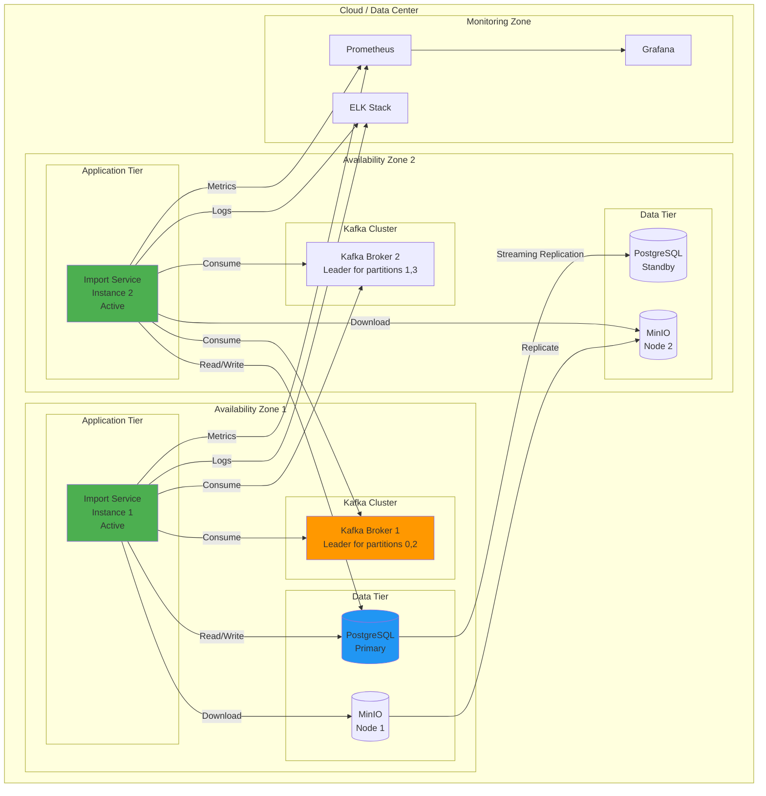

### 9.2 Infrastructure Requirements

#### 9.2.1 Compute Resources

| Environment | Instance Type | CPU | Memory | Storage | Instances |
|-------------|--------------|-----|--------|---------|-----------|
| **Production** | c6i.2xlarge (AWS) | 8 vCPUs | 16GB | 100GB SSD | 2 (active-active) |
| **Staging** | c6i.xlarge | 4 vCPUs | 8GB | 50GB SSD | 1 |
| **Development** | t3.large | 2 vCPUs | 8GB | 20GB SSD | 1 |

#### 9.2.2 Infrastructure Resources

| Component | Specification | Purpose | Estimated Cost (Monthly) |
|-----------|--------------|---------|-------------------------|
| **Kafka Cluster** | 3 brokers (m5.large) | Message broker | $450 |
| **PostgreSQL RDS** | db.r6g.2xlarge | Primary database | $800 |
| **MinIO Cluster** | 3 nodes (m5.xlarge) | Object storage | $600 |
| **Load Balancer** | Application LB | Traffic distribution | $50 |
| **Prometheus** | t3.medium | Metrics storage | $30 |
| **Grafana** | t3.small | Dashboards | $15 |
| **ELK Stack** | 3 nodes (r5.large) | Log aggregation | $900 |

### 9.3 Deployment Diagram

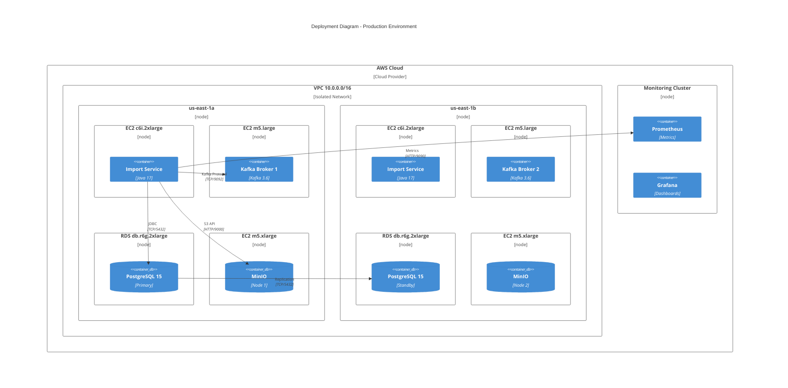

### 9.4 Deployment Strategy

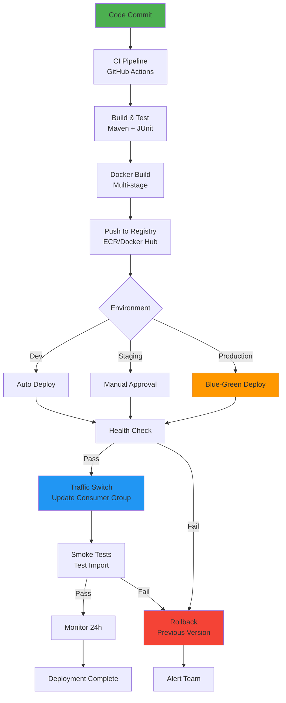


## 10. Security Architecture

### 10.1 Security Layers

```mermaid
graph TB
    subgraph "Network Security"
        N1[VPC Isolation<br/>Private Subnets]
        N2[Security Groups<br/>Port Restrictions]
        N3[TLS 1.3<br/>In-Transit Encryption]
    end
    
    subgraph "Application Security"
        A1[Authentication<br/>IAM Roles]
        A2[Authorization<br/>RBAC]
        A3[Input Validation<br/>Schema Validation]
        A4[Secrets Management<br/>AWS Secrets Manager]
    end
    
    subgraph "Data Security"
        D1[Encryption at Rest<br/>AES-256]
        D2[PII Masking<br/>Logs & Metrics]
        D3[Access Logging<br/>Audit Trail]
        D4[Data Isolation<br/>Domain-based RLS]
    end
    
    subgraph "Infrastructure Security"
        I1[OS Hardening<br/>CIS Benchmarks]
        I2[Patch Management<br/>Automated Updates]
        I3[Vulnerability Scanning<br/>Snyk + Trivy]
        I4[SIEM Integration<br/>CloudTrail]
    end
    
    N1 --> A1
    A1 --> D1
    D1 --> I1
    
    style N1 fill:#FFCDD2
    style A1 fill:#F8BBD0
    style D1 fill:#E1BEE7
    style I1 fill:#C5CAE9
```

### 10.2 Security Controls

| Control | Implementation | Status | Priority |
|---------|----------------|--------|----------|
| **Authentication** | IAM roles for EC2 instances | ✅ Implemented | P0 |
| **Authorization** | Database role-based access | ✅ Implemented | P0 |
| **Encryption at Rest** | RDS encryption + MinIO SSE | ✅ Implemented | P0 |
| **Encryption in Transit** | TLS for Kafka + JDBC | 📋 Planned | P1 |
| **Secrets Management** | AWS Secrets Manager | ✅ Implemented | P0 |
| **Audit Logging** | CloudTrail + application logs | ✅ Implemented | P1 |
| **Input Validation** | JSON schema validation | 📋 Planned | P2 |
| **Rate Limiting** | Kafka throttling | ✅ Implemented | P2 |
| **DDoS Protection** | AWS Shield | ✅ Implemented | P1 |
| **Vulnerability Scanning** | Snyk for dependencies | ✅ Implemented | P1 |

### 10.3 Threat Model

| Threat | Likelihood | Impact | Risk Level | Mitigation |
|--------|-----------|--------|------------|------------|
| **Malicious Payload Injection** | Medium | High | High | Input validation, schema enforcement |
| **Unauthorized Data Access** | Low | Critical | High | VPC isolation, IAM, encryption |
| **Data Corruption** | Low | High | Medium | ACID transactions, backups |
| **DLQ Message Tampering** | Low | Medium | Low | Access control, audit logs |
| **Kafka Topic Hijacking** | Low | High | Medium | ACLs, TLS, authentication |
| **SQL Injection** | Low | High | Medium | Parameterized queries (JPA) |
| **File Upload Abuse** | Medium | Medium | Medium | File size limits, virus scanning (planned) |

---

## 11. Scalability & Performance

### 11.1 Scalability Dimensions

```mermaid
graph TB
    subgraph "Vertical Scaling"
        V1[Increase Instance Size<br/>8 CPU → 16 CPU]
        V2[Increase Memory<br/>16GB → 32GB]
        V3[Faster Storage<br/>SSD → NVMe]
    end
    
    subgraph "Horizontal Scaling"
        H1[Add Consumer Instances<br/>2 → 5 instances]
        H2[Increase Kafka Partitions<br/>2 → 8 partitions]
        H3[Database Read Replicas<br/>3 replicas]
    end
    
    subgraph "Data Scaling"
        D1[Database Sharding<br/>By domain_id]
        D2[MinIO Distributed Mode<br/>8-node cluster]
        D3[Kafka Topic Partitioning<br/>32 partitions]
    end
    
    V1 -.->|Current| H1
    H1 -.->|12 months| D1
    
    style V1 fill:#E3F2FD
    style H1 fill:#FFF9C4
    style D1 fill:#C8E6C9
```

### 11.2 Performance Optimization

```mermaid
graph LR
    subgraph "Input Optimization"
        I1[Kafka Batching<br/>100 records/poll]
        I2[LZ4 Compression<br/>3x reduction]
        I3[Consumer Prefetching<br/>5MB buffer]
    end
    
    subgraph "Processing Optimization"
        P1[Streaming CSV<br/>No memory load]
        P2[Parallel Batching<br/>8 threads]
        P3[Batch Size Tuning<br/>1000 nodes]
    end
    
    subgraph "Output Optimization"
        O1[PostgreSQL COPY<br/>10x faster]
        O2[Connection Pooling<br/>20 connections]
        O3[Batch Commits<br/>Reduce roundtrips]
    end
    
    I1 --> P1
    I2 --> P2
    I3 --> P3
    
    P1 --> O1
    P2 --> O2
    P3 --> O3
    
    style I1 fill:#C8E6C9
    style P2 fill:#BBDEFB
    style O1 fill:#FFF9C4
```

### 11.3 Capacity Planning

| Year | Daily Import Volume | Peak Throughput | Infrastructure |
|------|-------------------|-----------------|----------------|
| **Current** | 500K nodes | 5K nodes/sec | 2 instances, 2 partitions |
| **Year 1** | 5M nodes | 10K nodes/sec | 5 instances, 8 partitions |
| **Year 2** | 50M nodes | 50K nodes/sec | Auto-scale 5-20 instances, 32 partitions |
| **Year 3** | 500M nodes | 200K nodes/sec | Multi-region, 128 partitions |

**Cost Projection**:

| Component | Current | Year 1 | Year 2 | Year 3 |
|-----------|---------|--------|--------|--------|
| **Compute** | $300/mo | $750/mo | $2K/mo | $8K/mo |
| **Kafka** | $450/mo | $900/mo | $2.5K/mo | $10K/mo |
| **Database** | $800/mo | $1.5K/mo | $4K/mo | $15K/mo |
| **Storage** | $600/mo | $1K/mo | $3K/mo | $10K/mo |
| **Total** | **$2.15K/mo** | **$4.15K/mo** | **$11.5K/mo** | **$43K/mo** |

---

## 12. Disaster Recovery

### 12.1 Backup Strategy

| Component | Frequency | Retention | RTO | RPO |
|-----------|-----------|-----------|-----|-----|
| **PostgreSQL** | Continuous (WAL) | 30 days | <1 hour | <5 min |
| **Kafka Topics** | N/A (replicated) | 7 days | <15 min | 0 (replicated) |
| **MinIO Files** | Daily snapshot | 7 days | <2 hours | <24 hours |
| **Application Config** | Git-versioned | Indefinite | <5 min | 0 |

### 12.2 Disaster Recovery Scenarios

```mermaid
flowchart TD
    A[Incident Detected] --> B{Severity}
    
    B -->|P0 - Critical| C1[Complete System Down]
    B -->|P1 - High| C2[Database Corruption]
    B -->|P2 - Medium| C3[Kafka Unavailable]
    
    C1 --> D1[Activate DR Region]
    D1 --> D2[Promote Standby DB]
    D2 --> D3[Update DNS]
    D3 --> E1[Resume Operations<br/>RTO: 1 hour]
    
    C2 --> F1[Stop Imports]
    F1 --> F2[Restore from WAL<br/>Point-in-time]
    F2 --> F3[Verify Integrity]
    F3 --> E1
    
    C3 --> G1[Use DLQ Replay<br/>From last offset]
    G1 --> G2[Wait for Kafka Recovery]
    G2 --> G3[Resume Consumption]
    G3 --> E1
    
    E1 --> H[Post-Mortem]
    
    style C1 fill:#FFCDD2
    style E1 fill:#C8E6C9
```

---

## 13. Monitoring & Operations

### 13.1 Observability Stack

```mermaid
graph TB
    subgraph "Application"
        APP[Node Import System]
    end
    
    subgraph "Metrics Pipeline"
        APP -->|Micrometer| M1[Prometheus]
        M1 --> M2[Grafana Dashboards]
        M1 --> M3[AlertManager]
        M3 -->|PagerDuty| M4[On-Call Engineer]
    end
    
    subgraph "Logging Pipeline"
        APP -->|Logback| L1[Filebeat]
        L1 --> L2[Logstash]
        L2 --> L3[Elasticsearch]
        L3 --> L4[Kibana]
    end
    
    subgraph "Health Checks"
        APP -->|/actuator/health| H1[Spring Actuator]
        H1 --> H2[Load Balancer]
    end
    
    style APP fill:#4CAF50
    style M1 fill:#FF9800
    style L3 fill:#2196F3
```

### 13.2 Key Dashboards

**Dashboard 1: Import Job Metrics**

```
┌───────────────────────────────────────────────────────┐
│ Node Import System - Job Metrics                     │
├───────────────────────────────────────────────────────┤
│ Jobs Today:               48                          │
│   - Completed: 45 (93.75%)                           │
│   - Failed: 3 (6.25%)                                │
│   - In Progress: 0                                    │
│                                                       │
│ Throughput:               [Graph]                     │
│   - Current: 5K nodes/sec                            │
│   - Peak: 8K nodes/sec                               │
│                                                       │
│ Success Rate (7d):        98.5%                       │
│ Avg Job Duration:         3.2 min                     │
│                                                       │
│ Recent Failures:                                      │
│   - Job abc123: MinIO timeout                        │
│   - Job def456: CSV parse error                      │
└───────────────────────────────────────────────────────┘
```

**Dashboard 2: Kafka Consumer Health**

```
┌───────────────────────────────────────────────────────┐
│ Kafka Consumer Metrics                                │
├───────────────────────────────────────────────────────┤
│ Consumer Lag:             [Graph]                     │
│   - domain-a-users: 5 messages                       │
│   - domain-b-users: 0 messages                       │
│                                                       │
│ Processing Rate:          450 msg/sec                 │
│ Error Rate:               0.5%                        │
│ DLQ Messages:             2 in last hour              │
│                                                       │
│ Thread Pool:              [Graph]                     │
│   - Active: 6/8                                      │
│   - Queue: 12/100                                    │
└───────────────────────────────────────────────────────┘
```

### 13.3 Alerting Rules

| Alert | Condition | Severity | Action | SLA |
|-------|-----------|----------|--------|-----|
| **High Kafka Lag** | Lag >1000 for 5 min | P1 | Scale consumers | <15 min |
| **Job Failure Rate** | >10% failed over 1 hour | P2 | Investigate errors | <30 min |
| **DLQ Spike** | >10 msg/min | P2 | Review message format | <1 hour |
| **Memory Pressure** | Heap >90% | P1 | Restart instance | <5 min |
| **Database Errors** | >5 errors/min | P0 | Check DB health | <5 min |

---

## 14. Cost Analysis

### 14.1 Total Cost of Ownership

```mermaid
pie title Monthly Infrastructure Cost ($2,845)
    "Kafka Cluster" : 450
    "PostgreSQL RDS" : 800
    "MinIO Storage" : 600
    "EC2 Instances" : 600
    "ELK Stack" : 300
    "Monitoring" : 45
    "Data Transfer" : 50
```

**Cost Projection**:

| Component | Current | Year 1 | Year 2 |
|-----------|---------|--------|--------|
| **Infrastructure** | $2.8K/mo | $5K/mo | $12K/mo |
| **Development** | $20K/mo (1 FTE) | $20K/mo | $30K/mo |
| **Operations** | $5K/mo (0.25 FTE) | $10K/mo | $20K/mo |
| **Total Annual** | **$334K** | **$420K** | **$744K** |

### 14.2 Cost-Benefit Analysis

**Benefits** (Annual):
- Eliminated manual processing: **$200K** (2 FTEs)
- Reduced error recovery: **$50K** (downtime costs)
- Faster onboarding: **$100K** (revenue acceleration)
- **Total Annual Benefit: $350K**

**ROI**: ($350K - $334K) / $334K = **4.8% ROI** (Year 1)

### 14.3 Cost Optimization

| Strategy | Saving Potential | Implementation |
|----------|------------------|----------------|
| **Reserved Instances** | 30% on compute | Low |
| **S3 Lifecycle Policies** | 50% on storage | Low |
| **Auto-scaling** | 25% on compute | Medium |
| **Kafka Compression** | 40% on network | Low (already implemented) |

---

## 15. Migration Strategy

### 15.1 Migration Phases

```mermaid
gantt
    title Node Import System - Implementation Timeline
    dateFormat YYYY-MM-DD
    
    section Phase 1: Foundation
    Kafka Integration             :done, p1-1, 2024-01-01, 30d
    Database Schema Setup         :done, p1-2, 2024-01-15, 20d
    MinIO Configuration           :done, p1-3, 2024-02-01, 15d
    
    section Phase 2: Core Development
    File Processing Engine        :done, p2-1, 2024-02-15, 45d
    Reference Import              :done, p2-2, 2024-03-01, 30d
    Status Tracking               :done, p2-3, 2024-03-15, 25d
    
    section Phase 3: Testing
    Unit Testing                  :done, p3-1, 2024-04-01, 20d
    Integration Testing           :done, p3-2, 2024-04-15, 25d
    Performance Testing           :done, p3-3, 2024-05-01, 15d
    
    section Phase 4: Production
    Staging Deployment            :done, p4-1, 2024-05-15, 10d
    Production Pilot (20%)        :active, p4-2, 2024-05-25, 20d
    Full Rollout (100%)           :p4-3, 2024-06-15, 15d
    
    section Phase 5: Optimization
    Performance Tuning            :p5-1, 2024-07-01, 30d
    Documentation                 :p5-2, 2024-07-01, 20d
```

### 15.2 Rollout Strategy

```mermaid
flowchart LR
    A[Development] -->|Tested| B[Staging]
    B -->|Load Tested| C{Phased Rollout}
    
    C -->|Week 1| D1[Pilot: 20% Traffic<br/>2 Domains]
    C -->|Week 2| D2[40% Traffic<br/>5 Domains]
    C -->|Week 3| D3[100% Traffic<br/>All Domains]
    
    D1 --> E{Metrics OK?}
    E -->|Yes| D2
    E -->|No| F[Rollback]
    
    D2 --> G{Metrics OK?}
    G -->|Yes| D3
    G -->|No| F
    
    D3 --> H[Full Production]
    F --> I[Root Cause Analysis]
    
    style D3 fill:#C8E6C9
    style H fill:#4CAF50
    style F fill:#FFCDD2
```

---

## 16. Future Roadmap

### 16.1 Strategic Roadmap

```mermaid
timeline
    title Node Import System Evolution
    
    Q3 2024 : Production Launch
            : File + Reference Import
            : DLQ Support
            : PostgreSQL COPY
    
    Q4 2024 : Performance Optimization
            : Auto-scaling
            : Schema Validation
            : Enhanced Monitoring
    
    Q1 2025 : Multi-Region Support
            : Active-Active Deployment
            : Cross-region Replication
            : Disaster Recovery
    
    Q2 2025 : Advanced Features
            : Real-time Progress API
            : Delta Import Support
            : Data Quality Checks
    
    Q3 2025 : ML Integration
            : Anomaly Detection
            : Smart Batching
            : Predictive Scaling
```

### 16.2 Feature Roadmap

| Quarter | Feature | Business Value | Complexity |
|---------|---------|----------------|------------|
| **Q3 2024** | REST API for Manual Trigger | On-demand imports | Low |
| **Q4 2024** | Schema Validation (JSON Schema) | Reduce parse errors | Medium |
| **Q1 2025** | Real-time Progress WebSocket | Live status updates | Medium |
| **Q2 2025** | Delta Import Support | Faster incremental loads | High |
| **Q3 2025** | ML-based Anomaly Detection | Auto-detect bad data | High |

---

## Appendix A: Glossary

| Term | Definition |
|------|------------|
| **Node** | An entity (user, product, resource) in the matching system |
| **Import Job** | A tracked instance of a bulk node import operation |
| **DLQ** | Dead Letter Queue - Kafka topic for failed messages |
| **COPY Protocol** | PostgreSQL bulk loading mechanism (binary format) |
| **UPSERT** | INSERT with ON CONFLICT DO UPDATE (idempotent insert) |
| **Kafka Lag** | Number of messages not yet consumed by consumer group |
| **MinIO** | S3-compatible object storage system |
| **WAL** | Write-Ahead Log (PostgreSQL transaction log) |

---

## Appendix B: References

**Internal Documentation**:
- Node Import System - Low-Level Design (LLD)
- Kafka Topic Configuration Guide
- PostgreSQL COPY Protocol Best Practices
- Operational Runbooks

**External References**:
- [Spring Kafka Documentation](https://spring.io/projects/spring-kafka)
- [PostgreSQL COPY Documentation](https://www.postgresql.org/docs/current/sql-copy.html)
- [MinIO S3 API](https://min.io/docs/minio/linux/developers/java/API.html)
- [Kafka Consumer Tuning](https://kafka.apache.org/documentation/#consumerconfigs)

---

