# Node Import System - High-Level Design Document


---

## Table of Contents

1. [Executive Summary](#1-executive-summary)
2. [System Architecture](#3-system-architecture)
3. [Functional Architecture](#4-functional-architecture)
4. [Non-Functional Requirements](#5-non-functional-requirements)
5. [Technology Stack](#6-technology-stack)
6. [Data Architecture](#7-data-architecture)
7. [Integration Architecture](#8-integration-architecture)


---

## 1. Executive Summary

### 1.1 System Overview

The **Node Import System** is an event-driven, cloud-native data ingestion platform designed to process high-volume entity imports into the matching engine ecosystem. It consumes import requests from Kafka topics, processes CSV files from object storage or reference lists, and bulk-loads entities into PostgreSQL with comprehensive error handling, status tracking, and observability.


## 3. System Architecture

### 3.1 Architectural Style

**Primary Style:** Event-Driven Modular Monolith
**Secondary Patterns:** Pipes-and-Filters, Saga Pattern (for job lifecycle)

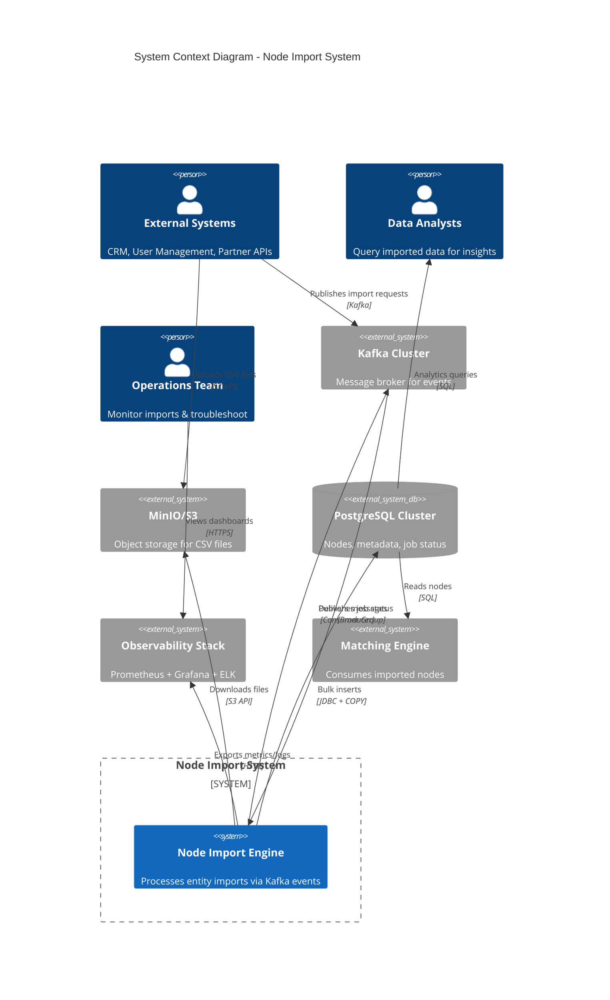

### 3.2 Logical Architecture

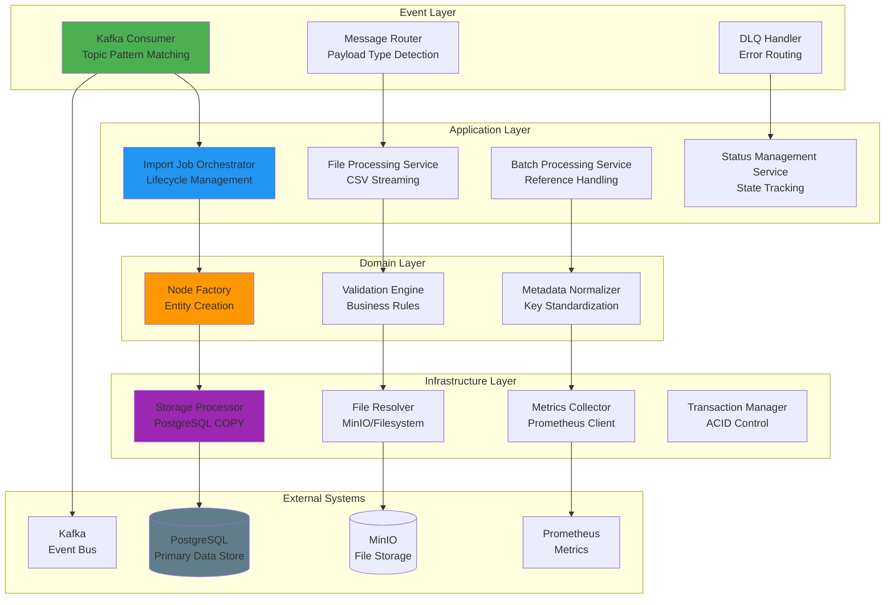

### 3.3 Component Architecture

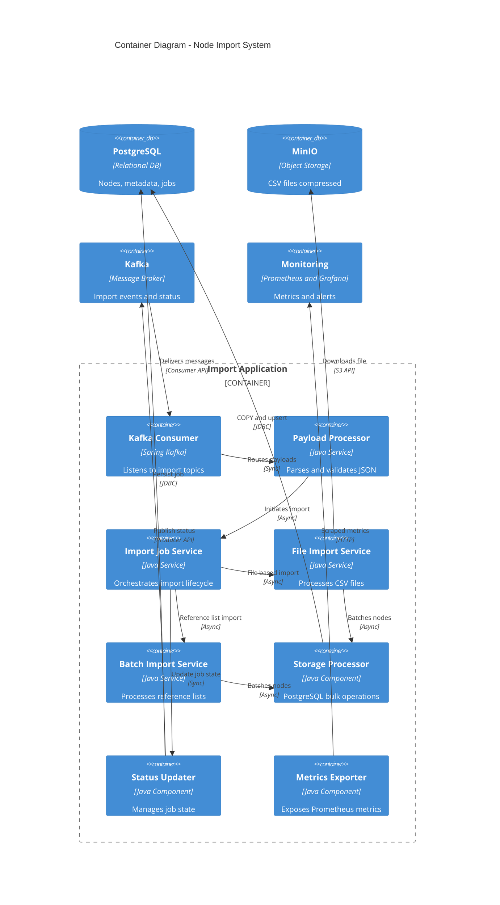

---

## 4. Functional Architecture

### 4.1 Core Capabilities

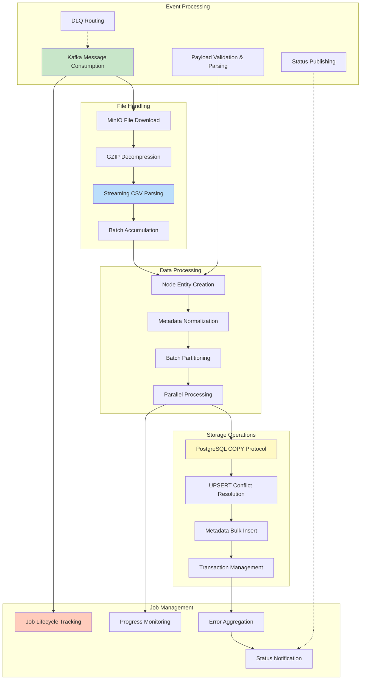

### 4.2 Processing Pipeline

```mermaid
flowchart LR
    A[Event Trigger] --> B{Message Type?}
    
    B -->|File-Based Import| C[Download from MinIO]
    B -->|Reference-Based Import| D[Create Nodes from IDs]
    
    C --> E[Stream GZIP CSV]
    E --> F[Parse 1000-row Batches]
    
    D --> G[Partition into 1000-node Batches]
    
    F --> H[Convert to Node Entities]
    G --> H
    
    H --> I[Parallel Batch Processing<br/>8 concurrent threads]
    
    I --> J[PostgreSQL COPY to temp_nodes]
    J --> K[UPSERT via INSERT ON CONFLICT]
    K --> L[Bulk Insert Metadata]
    
    L --> M{All Batches Done?}
    M -->|Yes| N[Aggregate Results]
    M -->|More| I
    
    N --> O{Success Rate?}
    O -->|100%| P[Status: COMPLETED]
    O -->|<100%| Q[Status: FAILED]
    
    P --> R[Publish to Kafka<br/>Job Status Topic]
    Q --> R
    
    style A fill:#4CAF50
    style E fill:#2196F3
    style I fill:#FF9800
    style J fill:#9C27B0
    style R fill:#F44336
```

### 4.3 Feature Matrix

| Feature | Priority | Status | Implementation |
|---------|----------|--------|----------------|
| **File-Based Import (CSV)** | P0 | Complete | GZIP streaming + PostgreSQL COPY |
| **Reference-Based Import** | P0 | Complete | List of IDs → Node creation |
| **MinIO Integration** | P0 |  Complete | S3 API for file download |
| **Local Filesystem Support** | P1 |  Complete | Direct file access |
| **DLQ Error Handling** | P0 |  Complete | Auto-routing + manual replay |
| **Job Status Tracking** | P0 |  Complete | State machine + Kafka publishing |
| **Metadata Normalization** | P1 |  Complete | Header standardization |
| **Batch Timeout Management** | P1 |  Complete | Dynamic timeout calculation |
| **Parallel Processing** | P0 |  Complete | 8 concurrent batch workers |
| **Transaction Safety** | P0 |  Complete | ACID via TransactionTemplate |
| **Retry Mechanism** | P1 |  Complete | RetryTemplate with backoff |
| **REST API for Manual Trigger** | P2 |  Planned | HTTP endpoint for on-demand imports |
| **Real-time Progress Updates** | P2 |  Planned | WebSocket or SSE for live status |
| **Schema Validation** | P3 |  Future | JSON Schema for payload validation |

---

## 5. Non-Functional Requirements

### 5.1 Performance Requirements

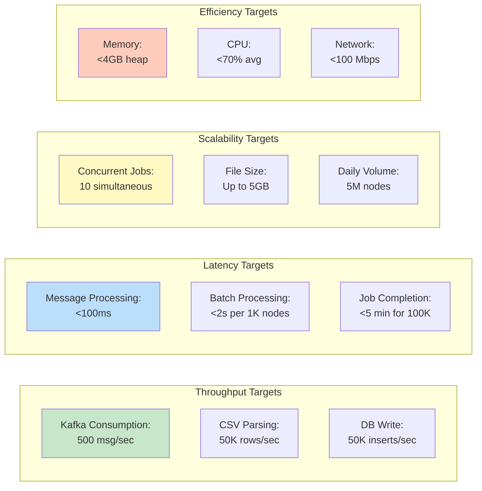

**Performance SLAs**:

| Metric | Target | Measurement | Tolerance |
|--------|--------|-------------|-----------|
| **Import Throughput** | 10K nodes/sec | Timer metrics | ±20% |
| **Job Completion Time** | <5 min for 100K nodes | End-to-end duration | ±30% |
| **Kafka Lag** | <10 seconds | Consumer lag metric | <60 sec max |
| **Success Rate** | >99% | Job status tracking | >95% min |
| **Database Write Rate** | 50K inserts/sec | COPY protocol metrics | ±25% |
| **Memory Footprint** | <4GB heap | JVM metrics | <6GB max |
| **CPU Utilization** | <70% avg | System metrics | <85% max |

### 5.2 Reliability Requirements

**Availability Target:** 99.9% monthly uptime (excluding planned maintenance)

**Failure Tolerance:**

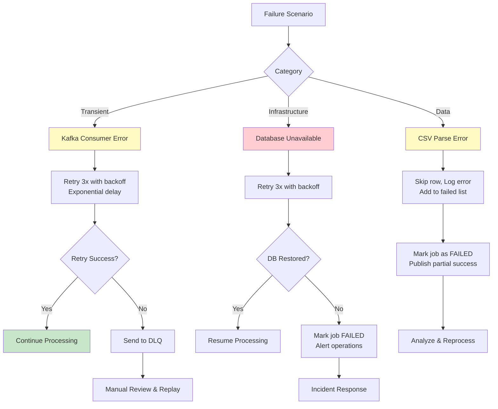

**Data Integrity:**
- ACID transactions for all database writes
- Idempotent operations (UPSERT via ON CONFLICT)
- DLQ for failed messages (no data loss)
- Job status tracking for audit trail

### 5.3 Scalability Requirements

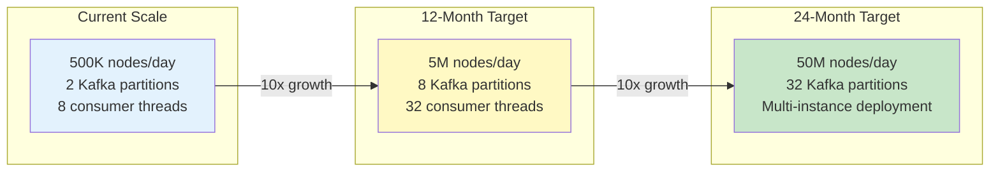

**Scalability Strategies**:

| Dimension | Current Approach | 12-Month Plan | 24-Month Plan |
|-----------|------------------|---------------|---------------|
| **Vertical** | 8 cores, 16GB RAM | 16 cores, 32GB RAM | 32 cores, 64GB RAM |
| **Horizontal** | Single instance | 3 instances (active-active) | Auto-scaling (5-20 instances) |
| **Kafka** | 2 partitions | 8 partitions | 32 partitions |
| **Database** | Single primary | Primary + 2 read replicas | Sharded by domain |
| **Storage** | Single MinIO | MinIO cluster (3 nodes) | S3 multi-region |

### 5.4 Maintainability Requirements

- **Code Coverage:** ≥80% unit tests, ≥70% integration tests
- **Documentation:** Inline JavaDoc, architectural diagrams, runbooks
- **Logging:** Structured JSON logs with correlation IDs
- **Observability:** Prometheus metrics, Grafana dashboards, distributed tracing (planned)
- **Deployment:** Blue-green deployments, automated rollback
- **Configuration:** Externalized via Spring Boot properties + Kubernetes ConfigMaps

---

## 6. Technology Stack

### 6.1 Technology Landscape

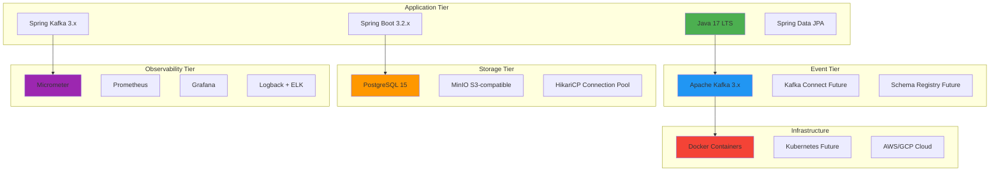

### 6.2 Technology Selection Rationale

| Technology | Purpose | Alternatives Considered | Decision Rationale |
|------------|---------|------------------------|-------------------|
| **Java 17** | Programming Language | Kotlin, Go | LTS support, team expertise, ecosystem maturity |
| **Spring Boot** | Application Framework | Quarkus, Micronaut | Enterprise adoption, Spring Kafka integration, productivity |
| **Kafka** | Event Streaming | RabbitMQ, AWS SQS | High throughput, durability, ecosystem (Connect, Streams) |
| **PostgreSQL** | Primary Database | MySQL, MongoDB | JSONB for metadata, COPY protocol, ACID compliance |
| **MinIO** | Object Storage | AWS S3, Azure Blob | S3-compatible, on-prem deployment, cost-effective |
| **Spring Kafka** | Kafka Client | Native Kafka Client | Spring integration, error handling, retry support |
| **Micrometer** | Metrics | Dropwizard | Vendor-neutral, Spring Boot native, Prometheus integration |
| **HikariCP** | Connection Pooling | Apache DBCP, C3P0 | Fastest pool, low overhead, production-proven |

### 6.3 Dependency Management

```yaml
Key Dependencies:
  Spring Boot: 3.2.x
    - spring-boot-starter-web
    - spring-boot-starter-data-jpa
    - spring-boot-starter-actuator
  
  Kafka:
    - spring-kafka: 3.x
    - kafka-clients: 3.6.x
  
  Database:
    - postgresql: 42.7.x
    - HikariCP: 5.1.x
  
  File Processing:
    - minio: 8.5.x
    - commons-csv: 1.10.x
  
  Utilities:
    - lombok: 1.18.x
    - jackson-databind: 2.15.x
    - guava: 32.x
  
  Testing:
    - junit-jupiter: 5.10.x
    - mockito-core: 5.x
    - testcontainers: 1.19.x
    - embedded-kafka: 3.x
```

---

## 7. Data Architecture

### 7.1 Conceptual Data Model

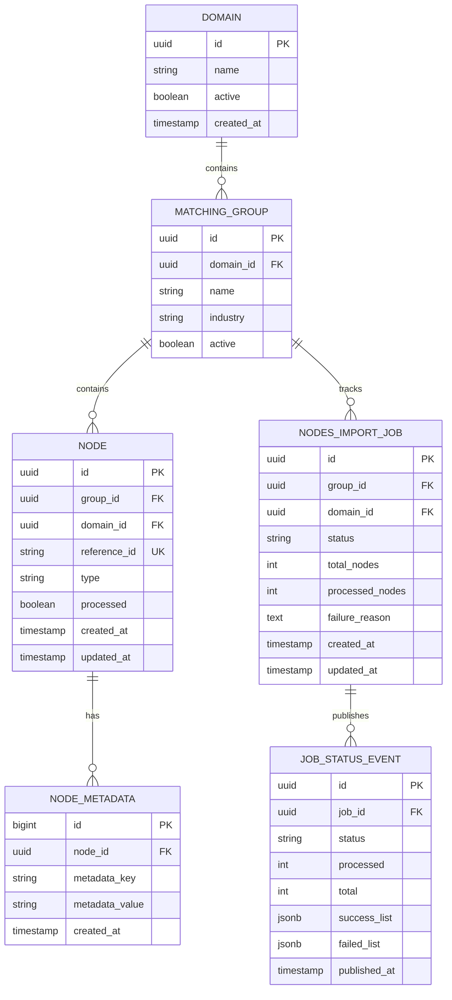

### 7.2 Data Flow Architecture

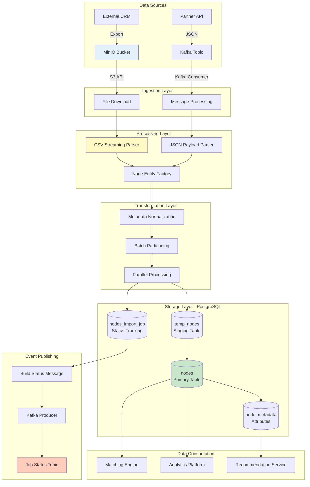

### 7.3 Data Volumes & Growth

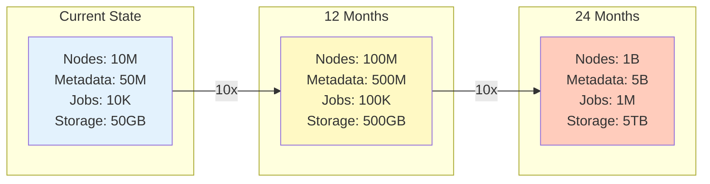

**Storage Strategy**:

| Data Type | Retention | Archival | Backup |
|-----------|-----------|----------|--------|
| **Nodes** | Indefinite | N/A | Daily full + WAL |
| **Node Metadata** | Indefinite | N/A | Daily full + WAL |
| **Import Jobs** | 90 days active | 2 years cold storage | Daily incremental |
| **CSV Files (MinIO)** | 7 days | Delete after import | None |
| **Kafka Topics** | 7 days | N/A | Not applicable |
| **Metrics** | 30 days | N/A | Not applicable |

### 7.4 Data Quality & Governance

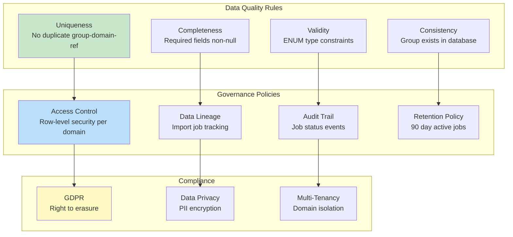

---

## 8. Integration Architecture

### 8.1 Integration Landscape

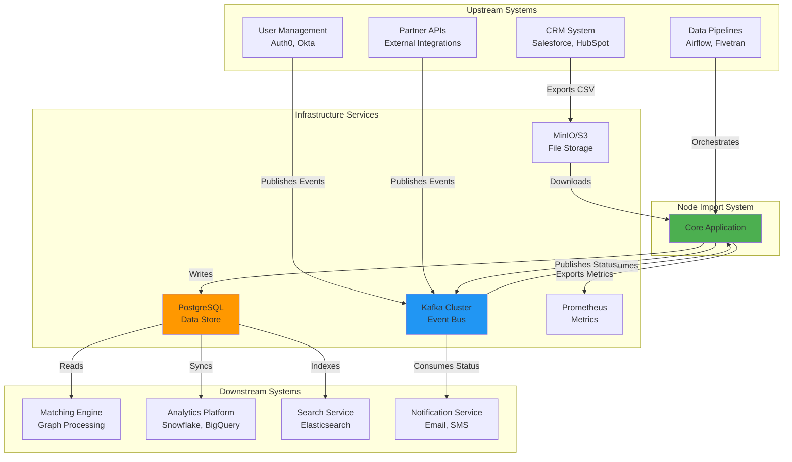

### 8.2 Integration Patterns

| Integration Point | Pattern | Protocol | Frequency | SLA |
|-------------------|---------|----------|-----------|-----|
| **Kafka → Import System** | Event-Driven Consumer | Kafka Protocol | Real-time | <10 sec lag |
| **MinIO → Import System** | Pull (Download) | S3 API (HTTP) | On-demand | <30 sec download for 1GB |
| **Import System → PostgreSQL** | Database Integration | JDBC + COPY | Batch (1000 rows) | <2 sec per batch |
| **Import System → Kafka (Status)** | Event Publishing | Kafka Protocol | On job completion | <1 min |
| **PostgreSQL → Analytics** | ETL | SQL Query | Hourly | <5 min sync |
| **Import System → Prometheus** | Metrics Push | HTTP | Every 15 sec | <1 min visibility |

### 8.3 API Contracts

#### 8.3.1 Kafka Message Formats

**NodeExchange (Import Request)**:
```json
{
  "domainId": "uuid",
  "groupId": "uuid-or-string",
  "filePath": "http://minio:9000/bucket/file.csv.gz",
  "fileName": "users_2024-12-12.csv.gz",
  "contentType": "application/gzip",
  "referenceIds": ["ref1", "ref2", "..."]  // Optional, for reference-based
}
```

**NodesTransferJobExchange (Status Response)**:
```json
{
  "jobId": "uuid",
  "groupId": "uuid-or-string",
  "domainId": "uuid",
  "status": "COMPLETED | FAILED",
  "processed": 98500,
  "total": 100000,
  "successList": ["ref1", "ref2", "..."],  
  "failedList": ["ref99", "ref100"]
}
```

#### 8.3.2 Database Schemas (Version 1.0)

**Nodes Table**:
```sql
CREATE TABLE nodes (
    id UUID PRIMARY KEY,
    reference_id VARCHAR(255) NOT NULL,
    group_id UUID NOT NULL,
    type VARCHAR(50) NOT NULL,
    domain_id UUID NOT NULL,
    processed BOOLEAN DEFAULT FALSE,
    created_at TIMESTAMP NOT NULL,
    updated_at TIMESTAMP,
    UNIQUE(group_id, domain_id, reference_id)
);
```

**Import Jobs Table**:
```sql
CREATE TABLE nodes_import_job (
    id UUID PRIMARY KEY,
    group_id UUID NOT NULL,
    domain_id UUID NOT NULL,
    status VARCHAR(20) NOT NULL,
    total_nodes INT DEFAULT 0,
    processed_nodes INT DEFAULT 0,
    failure_reason TEXT,
    created_at TIMESTAMP NOT NULL,
    updated_at TIMESTAMP NOT NULL
);
```

---


## Appendix A: Glossary

| Term | Definition |
|------|------------|
| **Node** | An entity (user, product, resource) in the matching system |
| **Import Job** | A tracked instance of a bulk node import operation |
| **DLQ** | Dead Letter Queue - Kafka topic for failed messages |
| **COPY Protocol** | PostgreSQL bulk loading mechanism (binary format) |
| **UPSERT** | INSERT with ON CONFLICT DO UPDATE (idempotent insert) |
| **Kafka Lag** | Number of messages not yet consumed by consumer group |
| **MinIO** | S3-compatible object storage system |
| **WAL** | Write-Ahead Log (PostgreSQL transaction log) |

---

## Appendix B: References

**Internal Documentation**:
- Node Import System - Low-Level Design (LLD)
- Kafka Topic Configuration Guide
- PostgreSQL COPY Protocol Best Practices
- Operational Runbooks

**External References**:
- [Spring Kafka Documentation](https://spring.io/projects/spring-kafka)
- [PostgreSQL COPY Documentation](https://www.postgresql.org/docs/current/sql-copy.html)
- [MinIO S3 API](https://min.io/docs/minio/linux/developers/java/API.html)
- [Kafka Consumer Tuning](https://kafka.apache.org/documentation/#consumerconfigs)

---

