# Perfect Match Creation System - High-Level Design Document

---

## Table of Contents

1. [Executive Summary](#1-executive-summary)
2. [Business Context](#2-business-context)
3. [System Architecture](#3-system-architecture)
4. [Functional Requirements](#4-functional-requirements)
5. [Non-Functional Requirements](#5-non-functional-requirements)
6. [Technology Stack](#6-technology-stack)
7. [Component Architecture](#7-component-architecture)
8. [Data Architecture](#8-data-architecture)
9. [Integration Architecture](#9-integration-architecture)
10. [Deployment Architecture](#10-deployment-architecture)
11. [Security Architecture](#11-security-architecture)
12. [Scalability & Performance](#12-scalability--performance)
13. [Disaster Recovery](#13-disaster-recovery)
14. [Monitoring & Operations](#14-monitoring--operations)
15. [Migration Strategy](#15-migration-strategy)

---

## 1. Executive Summary

### 1.1 System Overview

The **Perfect Match Creation System** is an enterprise-grade, high-throughput graph processing platform designed to compute optimal matches between entities based on compatibility scores. The system processes millions of edges daily, applying sophisticated matching algorithms to generate actionable match recommendations.

### 1.2 Key Capabilities

```mermaid
flowchart TB
    ROOT["Perfect Match<br/>System"]

    ROOT --> BP["Batch Processing"]
    ROOT --> GP["Graph Processing"]
    ROOT --> DM["Data Management"]
    ROOT --> RS["Resilience"]
    ROOT --> SC["Scalability"]

    BP --> BP1["Scheduled Execution"]
    BP --> BP2["Incremental Updates"]
    BP --> BP3["Progress Tracking"]

    GP --> GP1["Edge Streaming"]
    GP --> GP2["Algorithm Selection"]
    GP --> GP3["Compatibility Scoring"]

    DM --> DM1["LMDB Storage"]
    DM --> DM2["PostgreSQL Persistence"]
    DM --> DM3["Metadata Tracking"]

    RS --> RS1["Circuit Breakers"]
    RS --> RS2["Retry Mechanisms"]
    RS --> RS3["Graceful Degradation"]

    SC --> SC1["Concurrent Processing"]
    SC --> SC2["Resource Management"]
    SC --> SC3["Horizontal Scaling"]

    style ROOT fill:#ECEFF1
    style BP fill:#E3F2FD
    style GP fill:#E8F5E9
    style DM fill:#FFFDE7
    style RS fill:#FCE4EC
    style SC fill:#EDE7F6
```

### 1.3 Business Value

| Metric | Value | Impact |
|--------|-------|--------|
| **Processing Capacity** | 500K+ edges/minute | High throughput matching |
| **Matching Accuracy** | 99.9% algorithm reliability | Quality assurance |
| **System Availability** | 99.5% uptime | Business continuity |
| **Cost Efficiency** | 60% reduction vs manual | Operational savings |
| **Time to Match** | <15 minutes end-to-end | Fast results delivery |

---

## 2. Business Context

### 2.1 Problem Statement

Organizations need to efficiently match entities (users, products, resources) based on complex compatibility criteria. Manual matching is:
- **Time-consuming**: Hours/days for large datasets
- **Error-prone**: Human oversight in complex calculations
- **Non-scalable**: Cannot handle millions of comparisons
- **Inconsistent**: Varying quality across batches

### 2.2 Solution Approach

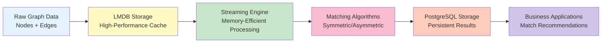

### 2.3 Use Cases

#### Primary Use Cases

1. **Daily Batch Matching**
    - **Actor**: System Scheduler
    - **Trigger**: Cron schedule (01:28 IST daily)
    - **Outcome**: All eligible groups processed, matches updated

2. **Incremental Processing**
    - **Actor**: Data Ingestion Service
    - **Trigger**: New nodes added to domain
    - **Outcome**: Only new data processed, avoiding duplication

3. **Algorithm-Based Matching**
    - **Actor**: Matching Configuration
    - **Trigger**: Group configuration defines strategy
    - **Outcome**: Appropriate algorithm applied (Symmetric/Asymmetric)

#### Secondary Use Cases

4. **Error Recovery**
    - **Actor**: Operations Team
    - **Trigger**: Failed job detection
    - **Outcome**: Automatic retry with exponential backoff

5. **Performance Monitoring**
    - **Actor**: DevOps Team
    - **Trigger**: Continuous metrics collection
    - **Outcome**: Real-time visibility into system health

---

## 3. System Architecture

### 3.1 Logical Architecture

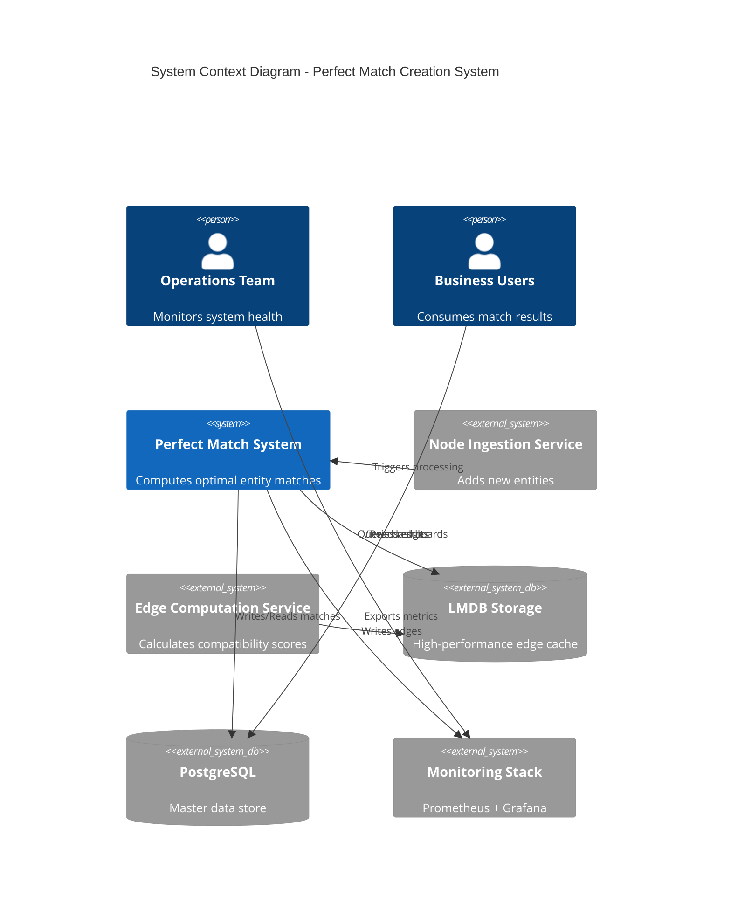

### 3.2 Architectural Layers

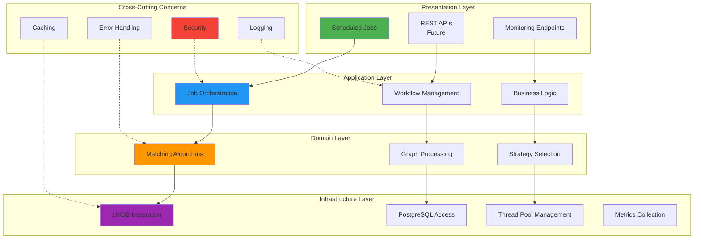

### 3.3 Component Interaction Overview

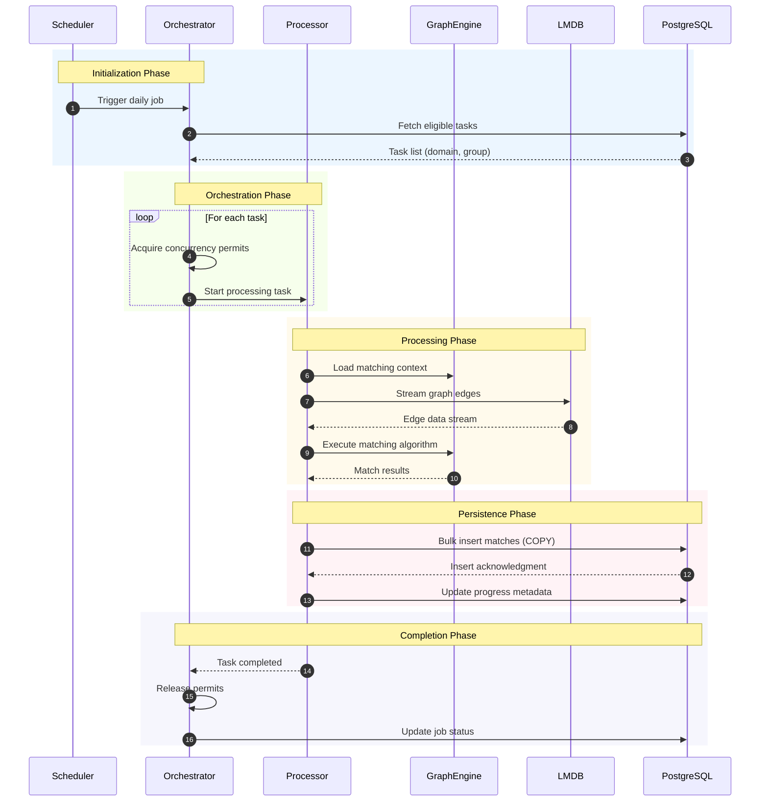

---

## 4. Functional Requirements

### 4.1 Core Capabilities

#### FR-1: Scheduled Batch Processing
**Description**: System shall execute perfect match creation on a scheduled basis.

**Acceptance Criteria**:
- Execute daily at configured time (01:28 IST)
- Process all eligible domain-group combinations
- Complete within 4-hour SLA window
- Support configurable cron expressions

#### FR-2: Incremental Node Processing
**Description**: System shall process only new nodes since last successful run.

**Acceptance Criteria**:
- Track last processed node count per group
- Compare current node count vs. last run
- Skip processing if no new nodes
- Update metadata upon successful completion

#### FR-3: Multi-Algorithm Support
**Description**: System shall support multiple matching algorithms based on configuration.

**Acceptance Criteria**:
- Symmetric matching (mutual preference)
- Asymmetric matching (one-way preference)
- Algorithm selection per group configuration
- Extensible strategy pattern for new algorithms

#### FR-4: Result Persistence
**Description**: System shall persist match results to PostgreSQL with deduplication.

**Acceptance Criteria**:
- Store matches with compatibility scores
- Prevent duplicate matches (upsert logic)
- Maintain historical match timestamp
- Link to processing cycle ID

#### FR-5: Progress Tracking
**Description**: System shall track processing status and progress.

**Acceptance Criteria**:
- Record job start/end times
- Track PENDING/COMPLETED/FAILED status
- Store processed node count
- Enable restart from failure point

### 4.2 Feature Matrix

| Feature | Priority | Status | Version |
|---------|----------|--------|---------|
| Scheduled Execution | P0 | Complete | 1.0 |
| Incremental Processing | P0 | Complete | 1.0 |
| Symmetric Matching | P0 | Complete | 1.0 |
| Asymmetric Matching | P0 |  Complete | 1.0 |
| Circuit Breaker | P1 |  Complete | 1.0 |
| Retry Mechanism | P1 |  Complete | 1.0 |
| Metrics Export | P1 |  Complete | 1.0 |
| Manual Trigger API | P2 | 📋 Planned | 2.0 |
| Real-time Matching | P2 | 📋 Planned | 2.0 |
| ML-based Scoring | P3 | 💡 Future | 3.0 |

---

## 5. Non-Functional Requirements

### 5.1 Performance Requirements

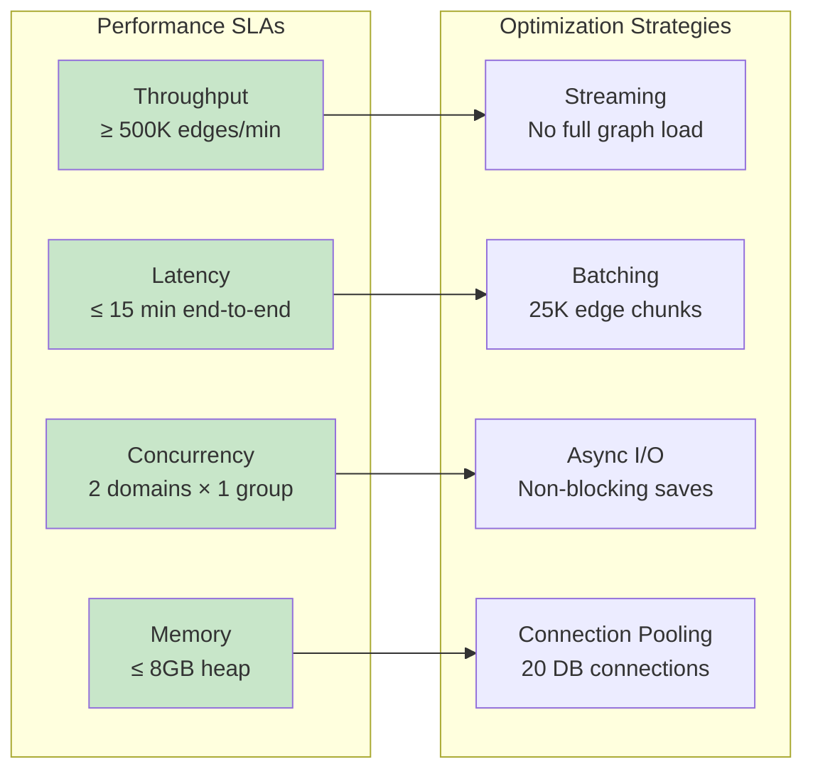

**Performance Targets**:

| Metric | Target | Measurement Method |
|--------|--------|-------------------|
| Edge Processing Rate | 500K edges/min | Micrometer timer metrics |
| End-to-End Latency | < 15 minutes | Job start to completion |
| Database Write Rate | 30K inserts/sec | PostgreSQL COPY throughput |
| CPU Utilization | < 80% average | JMX monitoring |
| Memory Usage | < 8GB heap | JVM metrics |
| Concurrent Groups | 2 domains simultaneously | Semaphore permits |

### 5.2 Reliability Requirements

**Availability**: 99.5% monthly uptime (excluding planned maintenance)

**Failure Tolerance**:
- Automatic retry up to 3 attempts with exponential backoff
- Circuit breaker for cascading failure prevention
- Graceful degradation (skip problematic groups)

**Data Integrity**:
- ACID transactions for database writes
- Advisory locks to prevent concurrent updates
- Idempotent processing (safe reruns)

### 5.3 Scalability Requirements

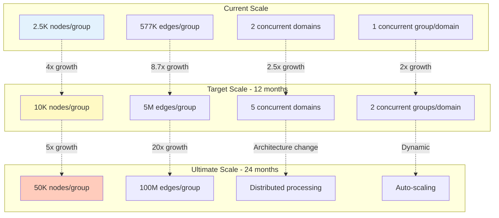

### 5.4 Security Requirements

**Authentication & Authorization**:
- Service-to-service authentication via mutual TLS (future)
- Database access via connection pooling with encrypted credentials
- Read-only access for monitoring endpoints

**Data Protection**:
- Data at rest: PostgreSQL transparent data encryption
- Data in transit: TLS 1.3 for all network communications
- Sensitive data masking in logs

**Compliance**:
- GDPR compliance for EU data processing
- Data retention policies (90-day match history)
- Audit logging for data access

---

## 6. Technology Stack

### 6.1 Technology Landscape

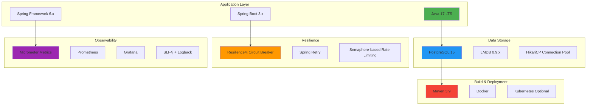

### 6.2 Technology Selection Rationale

| Technology | Purpose | Justification |
|------------|---------|---------------|
| **Java 17** | Programming Language | LTS support, virtual threads (future), performance |
| **Spring Boot** | Application Framework | Enterprise features, auto-configuration, ecosystem |
| **PostgreSQL** | Primary Database | ACID compliance, JSONB support, mature ecosystem |
| **LMDB** | Edge Cache | Memory-mapped I/O, zero-copy reads, high performance |
| **Resilience4j** | Fault Tolerance | Lightweight, Spring integration, comprehensive patterns |
| **Micrometer** | Metrics | Vendor-neutral, Spring Boot native, Prometheus compatible |
| **HikariCP** | Connection Pooling | Fastest pool, production-proven, low overhead |

### 6.3 Dependency Management

```yaml
Key Dependencies:
  Spring Boot Starter: 3.2.x
  Spring Data JPA: 3.2.x
  PostgreSQL Driver: 42.7.x
  LMDB Java: 0.9.29
  Resilience4j: 2.1.x
  Micrometer: 1.12.x
  Lombok: 1.18.x
  
Build Tools:
  Maven: 3.9.x
  Java: 17 LTS
  
Testing:
  JUnit 5: 5.10.x
  Mockito: 5.x
  Testcontainers: 1.19.x
```

---

## 7. Component Architecture

### 7.1 Layered Component View

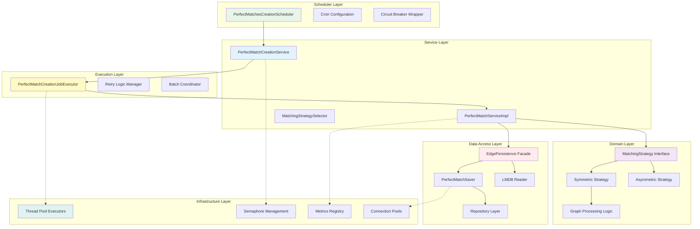

### 7.2 Component Responsibility Matrix

| Component | Responsibility | Input | Output |
|-----------|---------------|-------|--------|
| **PerfectMatchesCreationScheduler** | Job triggering, resilience | Cron trigger | Task list execution |
| **PerfectMatchCreationService** | Resource orchestration, concurrency control | Group IDs | Processing futures |
| **PerfectMatchCreationJobExecutor** | Retry management, error handling | Group metadata | Match results |
| **PerfectMatchServiceImpl** | Core processing logic, streaming | Match requests | Saved matches |
| **MatchingStrategySelector** | Algorithm selection | Context | Strategy instance |
| **EdgePersistence** | LMDB abstraction | Query params | Edge streams |
| **PerfectMatchSaver** | Async save orchestration | Match entities | Completion futures |
| **PerfectMatchStorageProcessor** | DB write optimization | Entity batches | Persisted records |

### 7.3 Communication Patterns

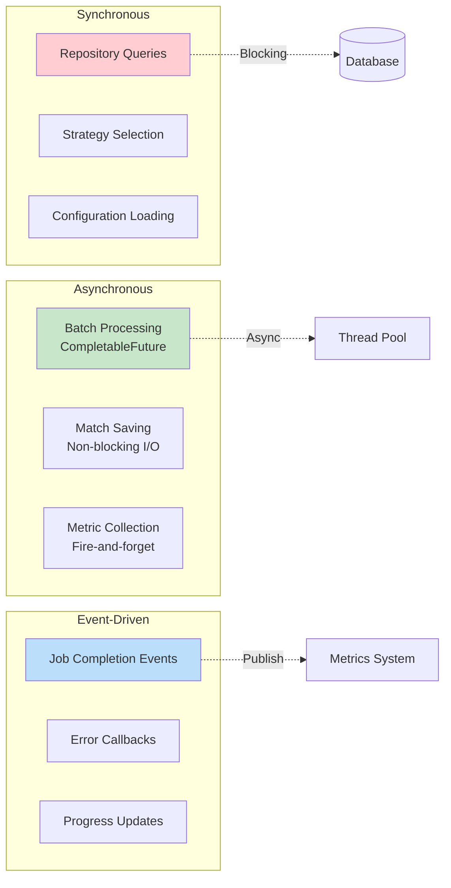

---

## 8. Data Architecture

### 8.1 Conceptual Data Model

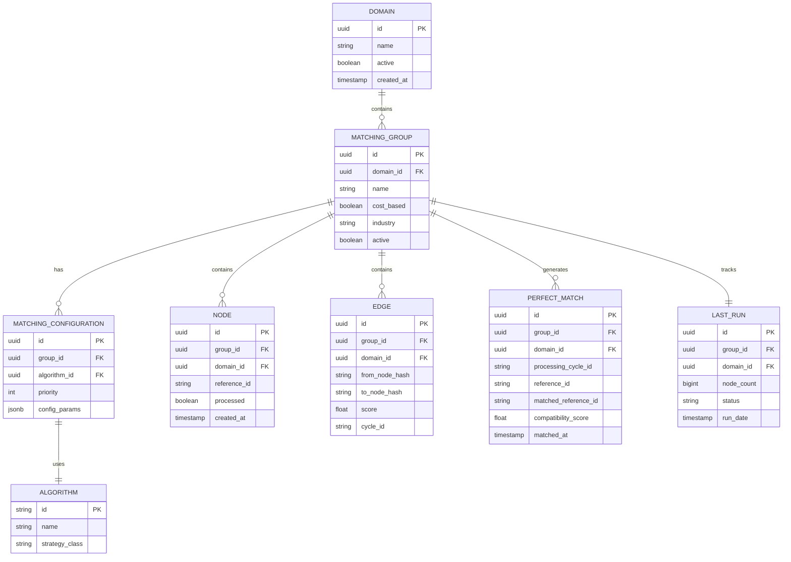

### 8.2 Data Flow Architecture

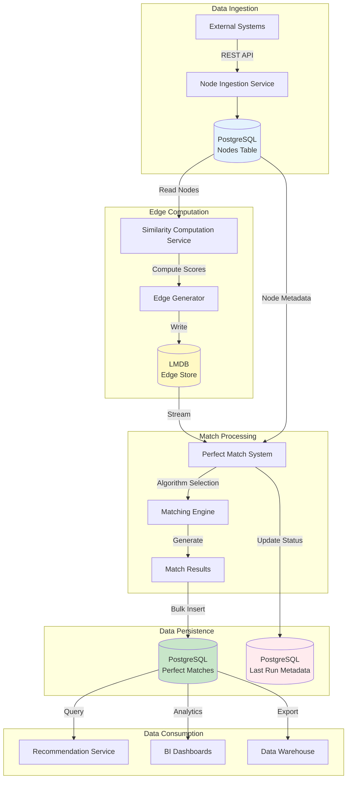

### 8.3 Storage Strategy

| Data Type | Storage | Retention | Backup | Access Pattern |
|-----------|---------|-----------|--------|----------------|
| **Nodes** | PostgreSQL | Indefinite | Daily | Read-heavy |
| **Edges** | LMDB | 7 days | On-demand | Read-only streaming |
| **Perfect Matches** | PostgreSQL | 90 days | Daily | Write-once, read-many |
| **Metadata** | PostgreSQL | Indefinite | Daily | Low volume |
| **Metrics** | Prometheus | 30 days | None | Time-series queries |
| **Logs** | ELK Stack | 14 days | None | Search & analytics |

### 8.4 Data Volumes

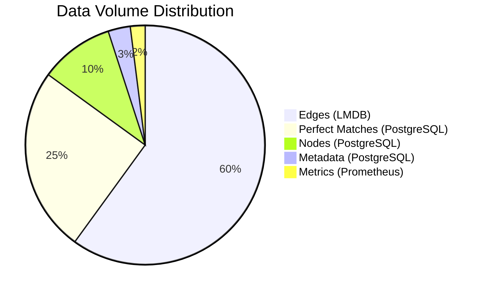

**Estimated Growth**:
- Current: ~50GB LMDB, 200GB PostgreSQL
- 12 months: ~200GB LMDB, 800GB PostgreSQL
- 24 months: ~1TB LMDB, 4TB PostgreSQL

---

## 9. Integration Architecture

### 9.1 Integration Landscape

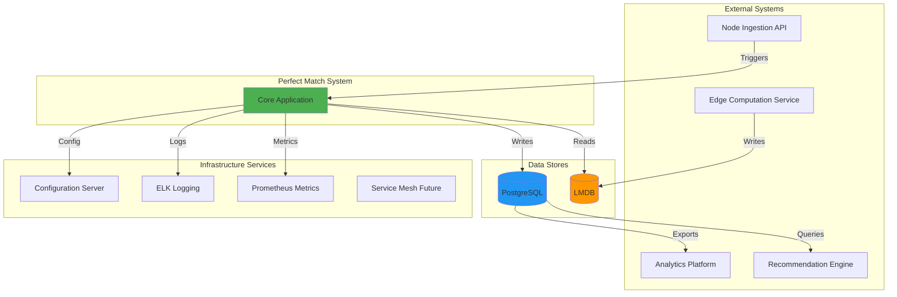

### 9.2 API Contracts

#### 9.2.1 Internal Interfaces

**EdgePersistence Interface**:
```java
public interface EdgePersistence {
    AutoCloseableStream<EdgeDTO> streamEdges(UUID domainId, UUID groupId);
    CompletableFuture<Void> persistAsync(List<PotentialMatch> matches, ...);
}
```

**MatchingStrategy Interface**:
```java
public interface MatchingStrategy {
    Map<String, List<MatchResult>> match(
        List<PotentialMatch> potentialMatches,
        UUID groupId,
        UUID domainId
    );
}
```

#### 9.2.2 Database Contracts

**LMDB Key-Value Contract**:
- **Key**: `groupId (16) || cycleHash (32) || pairHash (32)` bytes
- **Value**: `score (4) || domainId (16) || fromLen (4) || from || toLen (4) || to` bytes

**PostgreSQL Schema Version**: V1.0
- Managed via Flyway migrations
- Backward compatibility guaranteed within major versions

### 9.3 Integration Patterns

| Pattern | Use Case | Implementation |
|---------|----------|----------------|
| **Batch Integration** | Daily scheduled runs | Spring @Scheduled with cron |
| **Streaming** | LMDB edge consumption | Java Stream API with AutoCloseable |
| **Async Messaging** | Future: Real-time triggers | Kafka planned for v2.0 |
| **Request-Response** | Database queries | JDBC/JPA synchronous |
| **Fire-and-Forget** | Metrics publishing | Micrometer async collectors |

---

## 10. Deployment Architecture

### 10.1 Deployment Topology

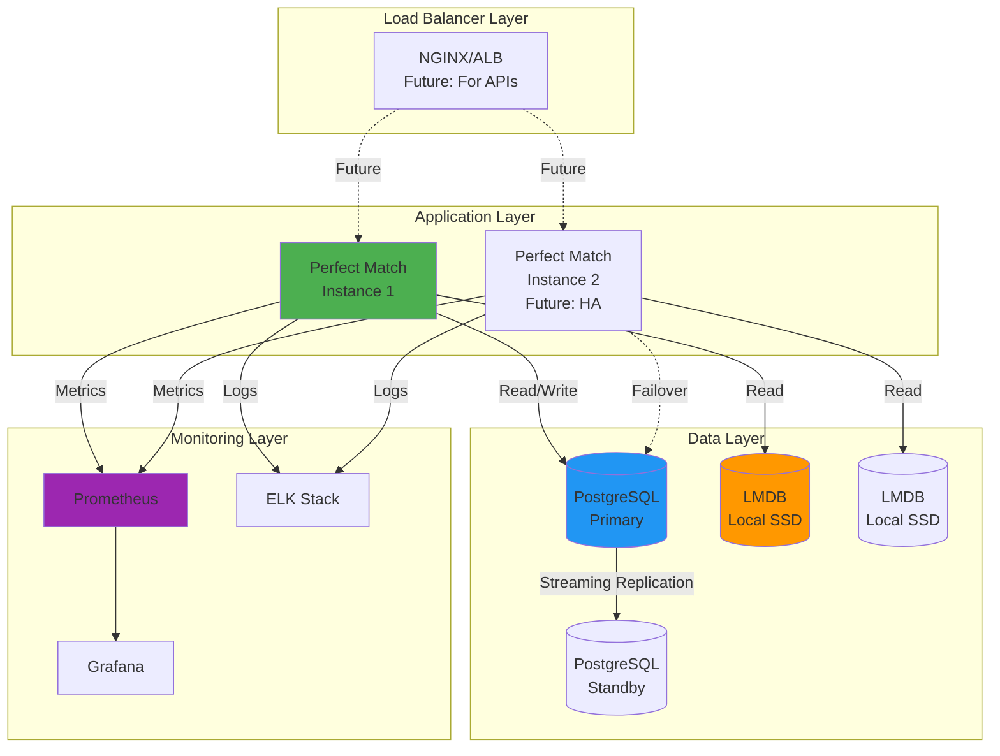

### 10.2 Infrastructure Requirements

#### 10.2.1 Compute Resources

| Environment | CPU | Memory | Storage | Instances |
|-------------|-----|--------|---------|-----------|
| **Production** | 8 cores | 16GB | 100GB SSD | 2 (active-passive) |
| **Staging** | 4 cores | 8GB | 50GB SSD | 1 |
| **Development** | 2 cores | 4GB | 20GB SSD | 1 |

#### 10.2.2 Database Resources

| Component | CPU | Memory | Storage | IOPS |
|-----------|-----|--------|---------|------|
| **PostgreSQL** | 8 cores | 32GB | 500GB NVMe | 10K |
| **LMDB** | N/A (memory-mapped) | 16GB | 200GB NVMe | 50K |

### 10.3 Deployment Diagram

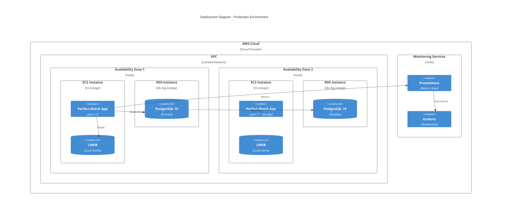

### 10.4 Deployment Strategy

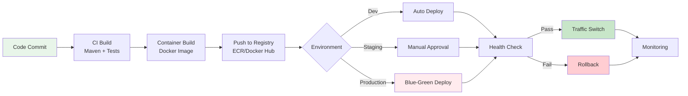


---

## 11. Security Architecture

### 11.1 Security Layers

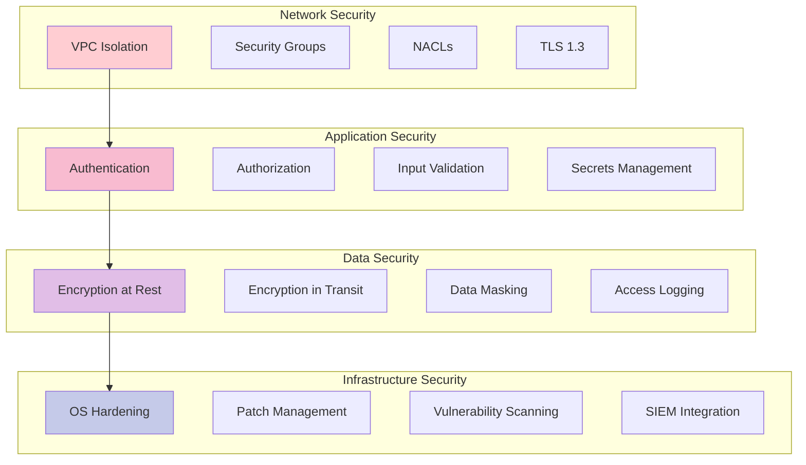

### 11.2 Security Controls

| Control | Implementation | Status |
|---------|----------------|--------|
| **Authentication** | Database credentials in AWS Secrets Manager | Implemented |
| **Authorization** | Role-based database access | Implemented |
| **Encryption at Rest** | PostgreSQL TDE, LMDB file permissions | Implemented |
| **Encryption in Transit** | TLS 1.3 for all connections | 📋 Planned |
| **Audit Logging** | PostgreSQL audit log + application logs | Implemented |
| **Secret Rotation** | Automated credential rotation (90 days) | Planned |
| **Vulnerability Scanning** | Snyk + OWASP Dependency Check | Implemented |
| **Penetration Testing** | Annual third-party assessment | Scheduled |

### 11.3 Threat Model

| Threat | Likelihood | Impact | Mitigation |
|--------|-----------|--------|------------|
| SQL Injection | Low | High | Parameterized queries (JPA) |
| Unauthorized Access | Medium | High | Network isolation, authentication |
| Data Breach | Low | Critical | Encryption, access logging |
| Denial of Service | Medium | Medium | Rate limiting, resource quotas |
| Insider Threat | Low | High | Audit logging, least privilege |
| Supply Chain Attack | Medium | High | Dependency scanning, SBOM |

---

## 12. Scalability & Performance

### 12.1 Scaling Dimensions

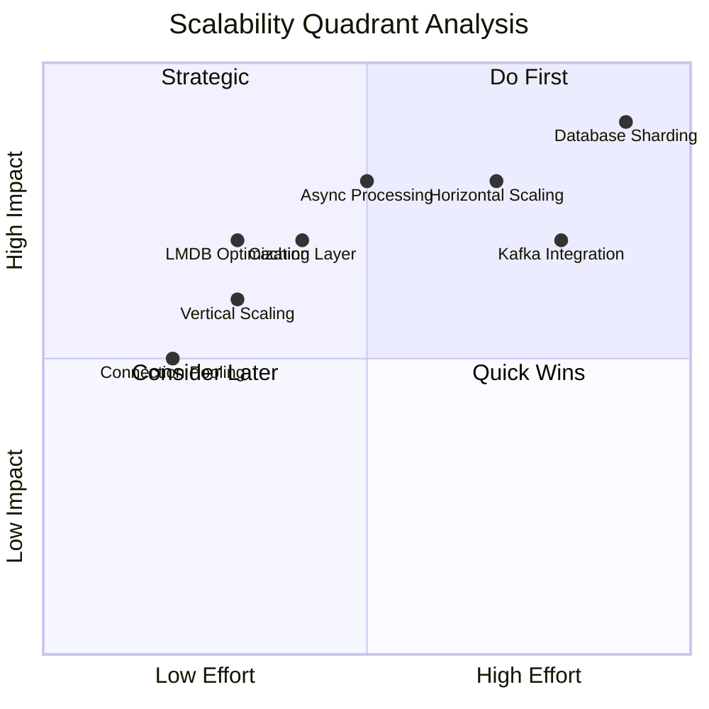

### 12.2 Performance Optimization Strategy

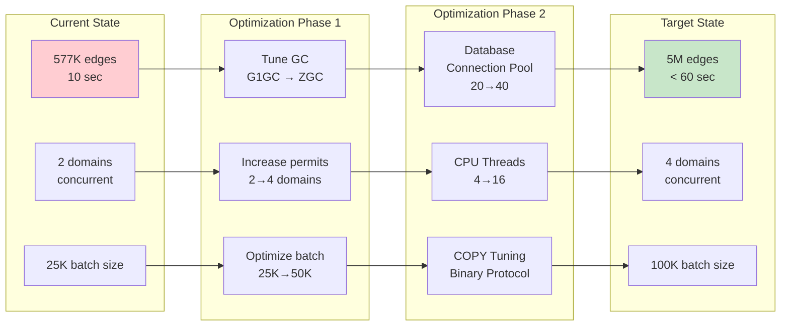

### 12.3 Horizontal Scaling Plan

**Phase 1: Active-Passive (Current)**
- Single active instance
- Standby for failover
- Manual switchover

**Phase 2: Active-Active (6 months)**
- Domain-based partitioning
- Each instance handles specific domains
- Coordinated scheduling

**Phase 3: Distributed (12 months)**
- Kafka-based task distribution
- Worker pool architecture
- Auto-scaling based on queue depth

```mermaid
graph TB
    subgraph "Phase 3: Distributed Architecture"
        SCH[Scheduler<br/>Task Producer]
        
        subgraph "Kafka Cluster"
            T1[match-tasks Topic]
            T2[match-results Topic]
        end
        
        subgraph "Worker Pool - Auto-Scaling"
            W1[Worker 1]
            W2[Worker 2]
            W3[Worker N]
        end
        
        SCH -->|Publish Tasks| T1
        T1 -->|Consume| W1
        T1 -->|Consume| W2
        T1 -->|Consume| W3
        
        W1 -->|Publish Results| T2
        W2 -->|Publish Results| T2
        W3 -->|Publish Results| T2
        
        T2 -->|Aggregate| AGG[Results Aggregator]
        AGG --> DB[(PostgreSQL)]
    end
    
    style SCH fill:#4CAF50
    style T1 fill:#FF9800
    style W1 fill:#2196F3
    style DB fill:#9C27B0
```

---

## 13. Disaster Recovery

### 13.1 Backup Strategy

| Component | Frequency | Retention | Recovery Time Objective (RTO) | Recovery Point Objective (RPO) |
|-----------|-----------|-----------|--------------------------------|--------------------------------|
| **PostgreSQL** | Continuous (WAL) + Daily Snapshot | 30 days | < 1 hour | < 5 minutes |
| **LMDB** | On-demand | 7 days | < 2 hours | < 24 hours |
| **Application Config** | Git-based | Indefinite | < 15 minutes | 0 (version controlled) |
| **Metrics/Logs** | None (ephemeral) | 30 days | N/A | N/A |

### 13.2 Disaster Recovery Scenarios

```mermaid
flowchart TD
    A[Incident Detected] --> B{Severity}
    
    B -->|Critical| C1[Application Crash]
    B -->|High| C2[Database Failure]
    B -->|Medium| C3[Data Corruption]
    B -->|Low| C4[Performance Degradation]
    
    C1 --> D1[Auto-restart via systemd]
    D1 --> D2{Health Check}
    D2 -->|Pass| E1[Resume Normal Ops]
    D2 -->|Fail| F1[Failover to Standby]
    
    C2 --> G1[Promote Standby DB]
    G1 --> G2[Update Connection String]
    G2 --> G3[Verify Replication]
    G3 --> E1
    
    C3 --> H1[Stop Writes]
    H1 --> H2[Restore from Backup]
    H2 --> H3[Replay WAL Logs]
    H3 --> H4[Verify Data Integrity]
    H4 --> E1
    
    C4 --> I1[Scale Resources]
    I1 --> I2[Tune Parameters]
    I2 --> E1
    
    E1 --> J[Post-Mortem Analysis]
    
    style C1 fill:#FFCDD2
    style C2 fill:#FFCDD2
    style E1 fill:#C8E6C9
```

### 13.3 Failover Procedures

**Database Failover**:
1. Detect primary failure (health check timeout)
2. Promote standby to primary
3. Update application configuration
4. Restart application instances
5. Verify data consistency
6. Initiate post-mortem

**Application Failover**:
1. Health check detects failure
2. Route traffic to standby instance
3. Investigate root cause
4. Repair primary instance
5. Switchback during maintenance window

---

## 14. Monitoring & Operations

### 14.1 Observability Architecture

```mermaid
graph TB
    subgraph "Application"
        APP["Perfect Match System"]
    end

    subgraph "Metrics Pipeline"
        APP -->|Micrometer| M1["Prometheus"]
        M1 --> M2["Grafana Dashboards"]
        M1 --> M3["Alert Manager"]
        M3 -->|PagerDuty| M4["On Call Engineer"]
    end

    subgraph "Logging Pipeline"
        APP -->|Logback| L1["Filebeat"]
        L1 --> L2["Logstash"]
        L2 --> L3["Elasticsearch"]
        L3 --> L4["Kibana"]
    end

    subgraph "Tracing Pipeline Future"
        APP -.->|OpenTelemetry| T1["Jaeger"]
        T1 -.-> T2["Trace Analysis"]
    end

    subgraph "Health Checks"
        APP -->|HTTP| H1["Health Endpoint actuator health"]
        H1 --> H2["Load Balancer"]
        H1 --> H3["Monitoring System"]
    end

    style APP fill:#4CAF50
    style M1 fill:#FF9800
    style L3 fill:#2196F3
    style H1 fill:#9C27B0

```

### 14.2 Key Metrics & Dashboards

#### 14.2.1 Business Metrics

| Metric | Threshold | Alert |
|--------|-----------|-------|
| Matches Generated | > 10K/day | < 5K/day |
| Job Success Rate | > 95% | < 90% |
| Processing Duration | < 15 min | > 30 min |
| Groups Processed | All eligible | Any skipped |

#### 14.2.2 Technical Metrics

| Metric | Threshold | Alert |
|--------|-----------|-------|
| CPU Utilization | < 80% | > 90% |
| Heap Memory | < 80% | > 90% |
| GC Pause Time | < 100ms | > 500ms |
| DB Connection Pool | < 80% used | > 95% used |
| LMDB Read Latency | < 1ms | > 10ms |
| PostgreSQL Write TPS | > 10K | < 5K |

### 14.3 Operational Dashboards

```mermaid
graph LR
    subgraph "Executive Dashboard"
        E1[Daily Match Volume]
        E2[System Availability %]
        E3[Processing Time Trend]
    end
    
    subgraph "Operations Dashboard"
        O1[Job Status]
        O2[Resource Utilization]
        O3[Error Rate]
        O4[Queue Depth]
    end
    
    subgraph "Technical Dashboard"
        T1[JVM Metrics]
        T2[Thread Pool Stats]
        T3[Database Performance]
        T4[LMDB Throughput]
    end
    
    subgraph "Business Dashboard"
        B1[Matches by Industry]
        B2[Match Quality Score]
        B3[Algorithm Effectiveness]
    end
    
    style E1 fill:#C8E6C9
    style O1 fill:#BBDEFB
    style T1 fill:#F8BBD0
    style B1 fill:#FFF9C4
```

### 14.4 Alert Hierarchy

```mermaid
graph TB
    A[Alert Triggered] --> B{Severity}
    
    B -->|P1 - Critical| C1[System Down<br/>Data Loss Risk]
    B -->|P2 - High| C2[Performance Degraded<br/>SLA at Risk]
    B -->|P3 - Medium| C3[Error Rate Elevated<br/>Monitoring]
    B -->|P4 - Low| C4[Warning Threshold<br/>Informational]
    
    C1 --> D1[Page On-Call Immediately]
    C1 --> D2[Create Incident]
    C1 --> D3[Escalate to Manager]
    
    C2 --> E1[Notify On-Call]
    C2 --> E2[Create Ticket]
    
    C3 --> F1[Log to JIRA]
    C3 --> F2[Review Next Day]
    
    C4 --> G1[Dashboard Only]
    
    style C1 fill:#FFCDD2
    style C2 fill:#FFCCBC
    style C3 fill:#FFF9C4
    style C4 fill:#C8E6C9
```

---

## 15. Migration Strategy

### 15.1 Migration Phases

```mermaid
gantt
    title Implementation & Migration Timeline
    dateFormat YYYY-MM-DD
    section Phase 1: Foundation
    Infrastructure Setup           :done, p1-1, 2024-01-01, 30d
    Database Schema Creation       :done, p1-2, 2024-01-15, 15d
    LMDB Integration              :done, p1-3, 2024-02-01, 20d
    
    section Phase 2: Core Development
    Matching Engine               :done, p2-1, 2024-02-15, 45d
    Persistence Layer             :done, p2-2, 2024-03-01, 30d
    Scheduler Implementation      :done, p2-3, 2024-03-15, 20d
    
    section Phase 3: Testing
    Unit Testing                  :done, p3-1, 2024-04-01, 15d
    Integration Testing           :done, p3-2, 2024-04-10, 20d
    Performance Testing           :done, p3-3, 2024-04-20, 15d
    
    section Phase 4: Production
    Staging Deployment            :done, p4-1, 2024-05-01, 10d
    Production Rollout            :active, p4-2, 2024-05-10, 30d
    Monitoring & Optimization     :p4-3, 2024-05-15, 60d
    
    section Phase 5: Enhancement
    API Development               :p5-1, 2024-07-01, 45d
    Real-time Matching            :p5-2, 2024-08-01, 60d
    ML Integration                :p5-3, 2024-09-01, 90d
```

### 15.2 Rollout Strategy

```mermaid
flowchart LR
    A[Development] -->|Tested & Approved| B[Staging]
    B -->|Load Testing Passed| C{Phased Rollout}
    
    C -->|Week 1| D1[10% Traffic<br/>1 Domain]
    C -->|Week 2| D2[25% Traffic<br/>3 Domains]
    C -->|Week 3| D3[50% Traffic<br/>6 Domains]
    C -->|Week 4| D4[100% Traffic<br/>All Domains]
    
    D1 --> E{Metrics OK?}
    E -->|Yes| D2
    E -->|No| F[Rollback]
    
    D2 --> G{Metrics OK?}
    G -->|Yes| D3
    G -->|No| F
    
    D3 --> H{Metrics OK?}
    H -->|Yes| D4
    H -->|No| F
    
    D4 --> I[Full Production]
    F --> J[Root Cause Analysis]
    J --> A
    
    style D4 fill:#C8E6C9
    style I fill:#4CAF50
    style F fill:#FFCDD2
```

### 15.3 Rollback Plan

**Rollback Triggers**:
- Error rate > 10%
- Processing time > 2x baseline
- Data integrity issues detected
- Critical bugs discovered

**Rollback Procedure**:
1. Stop scheduler on new version
2. Route traffic to previous version
3. Verify previous version functionality
4. Analyze failure root cause
5. Plan remediation
6. Retry deployment after fix

**Rollback Time**: < 15 minutes (automated script)

---

## Appendix A: Glossary

| Term | Definition |
|------|------------|
| **Edge** | A weighted connection between two nodes representing compatibility |
| **Node** | An entity (user, product, resource) participating in matching |
| **Matching Algorithm** | Strategy for determining optimal matches (Symmetric/Asymmetric) |
| **Perfect Match** | The computed result representing best compatibility between entities |
| **Cycle ID** | Unique identifier for a processing run |
| **LMDB** | Lightning Memory-Mapped Database - high-performance key-value store |
| **Circuit Breaker** | Resilience pattern to prevent cascading failures |
| **Semaphore** | Concurrency control mechanism limiting parallel execution |
| **Advisory Lock** | PostgreSQL locking mechanism for application-level coordination |

---

## Appendix B: Reference Architecture

### System Capabilities Summary

```mermaid
graph TB
    ROOT["Perfect Match System"]

    %% Top-level categories
    ROOT --> F["Functional"]
    ROOT --> NF["Non Functional"]
    ROOT --> OP["Operational"]

    %% Functional
    F --> F1["Scheduled Processing"]
    F --> F2["Incremental Updates"]
    F --> F3["Multi Algorithm Support"]
    F --> F4["Result Persistence"]

    %% Non-Functional
    NF --> NFP["High Performance"]
    NF --> NFR["High Reliability"]
    NF --> NFS["Scalability"]
    NF --> NFSec["Security"]

    %% Performance details
    NFP --> NFP1["500K edges per minute"]
    NFP --> NFP2["Less than 15 min latency"]

    %% Reliability details
    NFR --> NFR1["99.5 percent uptime"]
    NFR --> NFR2["Auto retry"]

    %% Scalability details
    NFS --> NFS1["Horizontal scaling ready"]
    NFS --> NFS2["Resource efficient"]

    %% Security details
    NFSec --> NFSec1["Encryption at rest and transit"]
    NFSec --> NFSec2["Audit logging"]

    %% Operational
    OP --> OPMon["Monitoring"]
    OP --> OPLog["Logging"]
    OP --> OPMaint["Maintenance"]

    %% Monitoring details
    OPMon --> OPMon1["Prometheus metrics"]
    OPMon --> OPMon2["Grafana dashboards"]

    %% Logging details
    OPLog --> OPLog1["Centralized ELK"]
    OPLog --> OPLog2["Structured logs"]

    %% Maintenance details
    OPMaint --> OPM1["Zero downtime deploy"]
    OPMaint --> OPM2["Automated backups"]

    %% Styling
    style ROOT fill:#4CAF50,color:#ffffff
    style F fill:#E3F2FD
    style NF fill:#FFF3E0
    style OP fill:#E8F5E9

```

---

## Appendix C: Decision Log

| Decision | Rationale | Alternatives Considered | Date |
|----------|-----------|------------------------|------|
| Use LMDB for edge storage | Memory-mapped I/O provides 10x read performance vs PostgreSQL | Redis, RocksDB | 2024-01-15 |
| Semaphore-based concurrency | Simple, JVM-native, predictable behavior | Distributed locks (Redis), Database locks | 2024-02-01 |
| PostgreSQL COPY protocol | 10x faster than batch INSERT for bulk writes | JDBC batch inserts, External ETL tool | 2024-02-20 |
| Spring Boot framework | Enterprise ecosystem, production-proven, team familiarity | Quarkus, Micronaut | 2024-01-05 |
| Symmetric/Asymmetric strategies | Covers 90% of business use cases | ML-based scoring (future) | 2024-02-10 |
| Scheduled batch vs real-time | Predictable resource usage, sufficient for SLA | Event-driven real-time (complexity) | 2024-01-20 |

---

## Appendix D: Capacity Planning

### Current Capacity

| Metric | Current | Headroom | Bottleneck |
|--------|---------|----------|------------|
| Edges/day | 1.5M | 3x | CPU |
| Concurrent Groups | 2 | 4x | Semaphore permits |
| Database Connections | 20 | 2x | Connection pool |
| Memory | 16GB | 2x | Heap size |
| Storage (LMDB) | 50GB | 4x | Disk space |
| Storage (PostgreSQL) | 200GB | 2.5x | Disk space |

### Growth Projections

```
Year 1:
  - Edges: 1.5M/day → 5M/day (3.3x)
  - Nodes: 50K → 200K (4x)
  - Groups: 20 → 50 (2.5x)
  - Required Infrastructure: Current + 2x CPU, 1.5x Memory

Year 2:
  - Edges: 5M/day → 20M/day (4x)
  - Nodes: 200K → 1M (5x)
  - Groups: 50 → 150 (3x)
  - Required Infrastructure: Distributed architecture (Kafka-based)

Year 3:
  - Edges: 20M/day → 100M/day (5x)
  - Nodes: 1M → 10M (10x)
  - Groups: 150 → 500 (3.3x)
  - Required Infrastructure: Multi-region, auto-scaling
```

---

