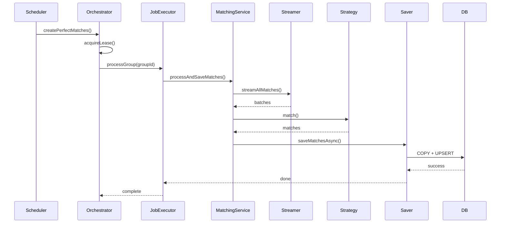
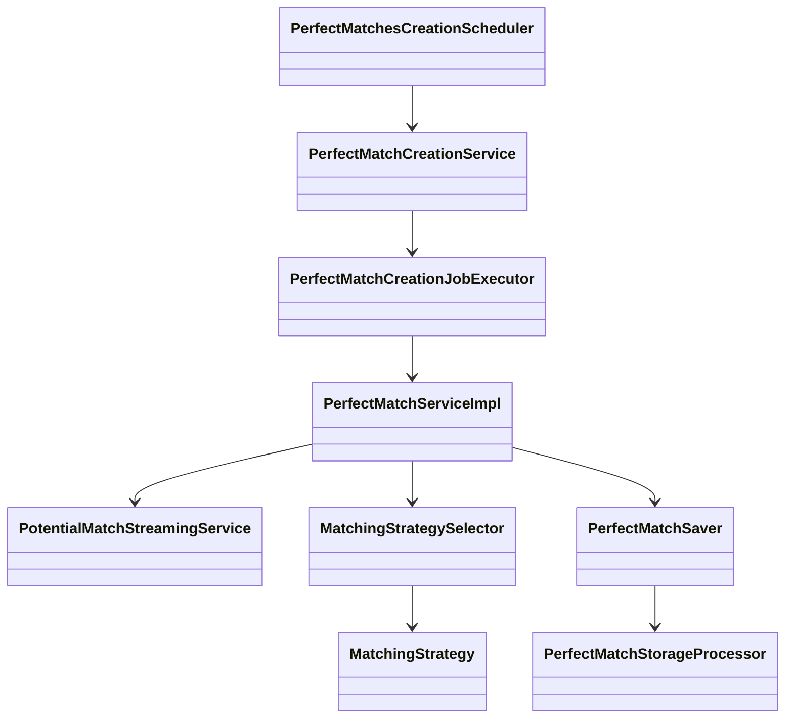

# Scheduled Perfect Matches Creation — High-Level Design (HLD)

---

## 1. Purpose & Scope

### 1.1 Purpose

Compute and persist **Perfect Matches** daily by consuming pre-computed **Potential Matches**. This batch runs at 03:00 IST and produces high-quality, non-overlapping matchings per group/domain using configurable strategies (TopKWeightedGreedy, Hopcroft–Karp, Hungarian, AuctionApproximate).

### 1.2 Scope

**In scope**

* Scheduled orchestration and task discovery (domains/groups).
* Streaming potential matches from PostgreSQL.
* Strategy-based match computation.
* Efficient, idempotent persistence to PostgreSQL.
* Observability, retries, circuit-breakers, and memory safety.

**Out of scope**

* Real-time matching pipelines.
* UI components.

### 1.3 Goals / NFRs

* **Scalability**: Support 10K+ nodes per group; default memory cap 1GB.
* **SLOs**: Default processing target: 10K nodes < 60 minutes (tunable).
* **Reliability**: Retries (3), circuit-breaker, idempotency via `LastRunPerfectMatches`.
* **Observability**: Micrometer metrics + logs with `cycleId`.
* **Security**: Least-privilege DB role for batch operations.

---

## 2. Triggers & Single-Run Guarantee

### 2.1 Schedule

* Cron: `0 0 3 * * *` (Asia/Kolkata)
* Entry method: `PerfectMatchesCreationScheduler.createPerfectMatches()`

### 2.2 Single-run (Leader Lease)

Prevent duplicate runs in multi-instance deployments:

* Attempt to acquire a cluster-wide lease at job start using one of:

    * **DB lease**: `SELECT ... FOR UPDATE SKIP LOCKED` on a singleton `batch_leases` row (recommended if DB is available and latency is acceptable).
    * **Redis lease**: RedLock with TTL ≥ expected max runtime (for multi-dc use consider tombstone/lease refresh).
* If lease not acquired → log and exit cycle.

**Snippet (conceptual)**:

```sql
BEGIN;
SELECT id FROM batch_leases WHERE name='perfect_matches' FOR UPDATE SKIP LOCKED;
-- if selected, proceed and update last_run; else commit and exit
COMMIT;
```

---

## 3. Architecture Overview

### 3.1 Major Components

* **Scheduler** (`PerfectMatchesCreationScheduler`) — cron + leader lease + high-level retries.
* **Orchestrator** (`PerfectMatchCreationService`) — task discovery, concurrency orchestration.
* **Job Executor** (`PerfectMatchCreationJobExecutor`) — per-group execution with retries and group-level lock.
* **Matching Service** (`PerfectMatchServiceImpl`) — streams potentials, builds adjacency, invokes matching strategy, buffers results.
* **PotentialMatchStreamingService** — JDBC forward-only streaming with fetch size and backpressure.
* **Strategy Layer** (`MatchingStrategySelector` + `MatchingStrategy` implementations) — TopK, Auction, Hopcroft-Karp, Hungarian.
* **Persistence** (`PerfectMatchSaver` + `PerfectMatchStorageProcessor`) — async batching, `COPY` → `UPSERT`.
* **Finalizer** (`MatchesCreationFinalizer`) — cleanup and GC hints.
* **State**: `LastRunPerfectMatches`, `MatchingConfiguration`, `MatchCache`.

### 3.2 High-level flow (brief)

1. Scheduler fires → acquires lease.
2. Orchestrator builds tasks list (domains/groups).
3. For each eligible task: mark `LastRun`=PENDING, clear cache, acquire semaphores/locks, invoke job executor.
4. Job executor streams potentials, builds graph (memory-aware), selects strategy, computes matches.
5. Saver performs `COPY` to temp table and atomic `UPSERT`.
6. Mark `LastRun` COMPLETED or FAILED; release locks; finalizer runs.

---

## 4. Data Flow & Persistence

### 4.1 Inputs / Outputs

* **Input**: `PotentialMatchEntity` (refId, matchedRefId, score, metadata), `MatchingConfiguration`.
* **Output**: `PerfectMatchEntity` (refId, matchedRefId, score, matchedAt, cycleId), `LastRunPerfectMatches`.

### 4.2 Streaming

* Use **JDBC forward-only** `PreparedStatement` with `setFetchSize(BATCH_SIZE_FROM_CURSOR)` (default 5000).
* Avoid OFFSET / LIMIT on large tables.
* Streaming retry: 3 attempts with exponential backoff (1s, 2s, 4s).

### 4.3 Persistence pattern (fast + idempotent)

1. Buffer match entities into batches (default 1000).
2. For each batch:

    * Binary `COPY` into a **temporary staging table**.
    * Atomic `UPSERT` into `perfect_matches` (use primary key/unique constraint).
    * Clean staging table.
3. Optional: set `synchronous_commit=off` during bulk import for throughput; document tradeoffs.

**UPSERT pseudo-SQL**:

```sql
COPY temp_perfect_matches FROM STDIN WITH (FORMAT binary);
INSERT INTO perfect_matches (cols...)
SELECT cols... FROM temp_perfect_matches
ON CONFLICT (ref_id, matched_ref_id) DO UPDATE SET score = EXCLUDED.score, matched_at = EXCLUDED.matched_at;
```

---

## 5. Concurrency, Backpressure & Memory

### 5.1 In-process semaphores (single-instance)

* `domainSemaphore` (maxConcurrentDomains, default 2)
* `groupSemaphore` (max 1 per group)
* `cpuTaskSemaphore` (processors * 2)

### 5.2 Multi-instance (production)

* Use **distributed locks** (Redis / DB lease) for domain/group semaphores to prevent concurrent processing of same domain/group across instances.
* If only single instance is deployed, in-process semaphores are acceptable.

### 5.3 Memory Guard & Backpressure

* Config: `matching.max.memory.mb` (default 1024 MB) and `matching.memory.guard.threshold` (default 0.8).
* Monitor:

    * JVM heap usage
    * `adjacency_map_current_size` (gauge)
* Policy on breach:

    1. On crossing 80%: lower streaming fetch size (÷2), reduce sub-batch size, attempt soft `System.gc()` once.
    2. If still above threshold: abort group job gracefully → set `LastRun.status=FAILED` and capture heap dump (if configured and allowed).
* No partial in-memory processing that risks OOM; alternative: implement external partial-aggregation (out-of-core) future enhancement.

---

## 6. Matching Strategy Selection

### 6.1 Decision rules (configurable)

* If `group.isSymmetric && group.isCostBased` → **TopKWeightedGreedy**
* Else if bipartite AND total distinct nodes ≤ `matching.strategy.hungarian.maxNodes` (default 100) → **Hungarian**
* Else if bipartite AND distinct nodes ≤ `matching.strategy.hopcroft.maxNodes` (default 10000) → **HopcroftKarp**
* Else → **AuctionApproximateMatchingStrategy** (scalable approximate)

Make thresholds tunable via config keys:

* `matching.strategy.hungarian.maxNodes`
* `matching.strategy.hopcroft.maxNodes`

### 6.2 Strategy summary

* **TopKWeightedGreedy** — streaming-friendly, memory-aware, good for symmetric cost-based graphs.
* **Hungarian** — exact, O(n^3), limited to small graphs.
* **Hopcroft–Karp** — max cardinality for bipartite graphs, O(E sqrt(V)), medium scale.
* **AuctionApproximate** — scalable approximate assignment for very large graphs.

---

## 7. Resilience, Retries & Timeouts

### 7.1 Retry policies

* **Scheduler**: maxRetries = 3 (1s, 2s, 4s), circuit-breaker opens after 5 consecutive failures for that group for 15 minutes.
* **JobExecutor**: maxRetries = 3 with exponential backoff; if retries fail → mark group `FAILED`.
* **Streaming**: retry 3x for transient SQL errors.
* **Storage**: retry 3x for transient DB errors; ensure idempotence via COPY→UPSERT.

### 7.2 Timeouts

* `PAGE_PROCESSING_TIMEOUT_SECONDS` (default 300)
* Per-batch save timeout (configurable)
* Overall cycle timeout (configurable via scheduler orchestration)

### 7.3 Fallbacks

* On final failure set `LastRun.status = FAILED`, emit metric `perfect_matches_creation_errors_total` and alert. Avoid silent data corruption.

---

## 8. Observability & Logging

### 8.1 Metrics (Micrometer)

* **Counters**

    * `perfect_matches_creation_total{domainId,groupId}` — completed cycles
    * `perfect_matches_creation_errors_total{domainId,groupId}` — failures
    * `perfect_matches_saved_total{domainId,groupId,cycleId}`
* **Timers**

    * `matching_duration{domainId,groupId,cycleId}`
    * `perfect_match_storage_duration{domainId,groupId,cycleId}`
* **Gauges**

    * `adjacency_map_current_size`
    * `system_heap_usage_mb`
* **Tracing / Logs**

    * Every log line for a run must include `cycleId`, `groupId`, `domainId`.
    * Sample structured log fields: `{level, timestamp, cycleId, groupId, domainId, message, metrics...}`.

### 8.2 Dashboards / Alerts

* SLO breach: alert if `matching_duration` > configured SLO for 3 consecutive runs.
* OOM/heap threshold: alert if heap > 90% or memory guard triggered.
* Failed cycles rate: alert when `perfect_matches_creation_errors_total` spikes.

---

## 9. Security & Permissions

* Use a **dedicated DB role** for this batch with only required privileges:

    * `SELECT` on potential matches tables
    * `CREATE TEMP TABLE`
    * `INSERT`, `UPDATE` on `perfect_matches`
    * `EXECUTE` on helper functions if any
* Do **not** use superuser credentials.
* Store DB credentials/secrets in a secure vault (HashiCorp Vault, AWS Secrets Manager, etc.), not in plain environment variables.
* Audit DB operations (optional): log batch imports with `cycleId` and row counts.

---

## 10. Testing & Rollout Strategy

### 10.1 Local / Dev

* `TestDataSeeder` for dev profile seeds `MatchingConfiguration` and small datasets.

### 10.2 Dry-run mode

* support `--dry-run` where matches are computed but not persisted (useful for correctness and perf testing).

### 10.3 Canary / Progressive rollout

* Canary: run new strategy for small % of groups (e.g., 1–5%) and compare match-quality metrics.
* Gate promotion on metrics thresholds (match count, average score, SLOs).

### 10.4 QA checks

* Unit tests for strategies.
* Integration tests using embedded Postgres for streaming + COPY path.
* Backward compatibility tests for `UPSERT` schema changes.

---

## 11. Configuration (selected keys & defaults)

| Key                                    |       Default | Description               |
| -------------------------------------- | ------------: | ------------------------- |
| `cron`                                 | `0 0 3 * * *` | scheduler                 |
| `match.max-concurrent-domains`         |           `2` | domain semaphore          |
| `match.max-retries`                    |           `3` | default retries           |
| `PAGE_PROCESSING_TIMEOUT_SECONDS`      |         `300` | per page timeout          |
| `matching.max.memory.mb`               |        `1024` | heap guard                |
| `matching.memory.guard.threshold`      |         `0.8` | fraction to trigger guard |
| `BATCH_SIZE_FROM_CURSOR`               |        `5000` | JDBC fetchSize            |
| `import.batch-size`                    |        `1000` | COPY batch size           |
| `matching.strategy.hungarian.maxNodes` |         `100` | threshold                 |
| `matching.strategy.hopcroft.maxNodes`  |       `10000` | threshold                 |

---

## 12. Sequence & Class Diagrams

### 12.1 High-Level Sequence



### 12.2 Class diagram (summary)



---

## 13. Risks & Mitigations

| Risk                                       | Mitigation                                                     |
| ------------------------------------------ | -------------------------------------------------------------- |
| Duplicate runs in multi-instance           | Leader lease (DB/Redis) + idempotent `LastRun` state           |
| OOM while building adjacency               | Memory guard, adaptive backpressure, abort and fail-safe       |
| Slow DB writes                             | Binary COPY + UPSERT, `synchronous_commit` tradeoff documented |
| Deadlock on semaphores                     | Timeouts on locks + distributed semaphore with TTL             |
| Strategy misuse (Hungarian on huge graphs) | Hard thresholds + configuration overrides                      |
| Security leakage (DB creds)                | Vault-managed secrets + least-priv roles                       |

---

## 14. Operational Runbook (brief)

**Start cycle**

* Scheduler acquires lease, starts orchestrator.

**If cycle fails**

* Check `perfect_matches_creation_errors_total` and `LastRunPerfectMatches`.
* Inspect logs filtered by `cycleId`.
* If OOM: inspect heap dump, increase `matching.max.memory.mb` or lower batch sizes.

**Restore**

* Re-run failed group via explicit admin job (idempotent via `LastRun`).

---

## 15. Appendix — Useful snippets & examples

### A. JDBC streaming (Java pseudo)

```java
PreparedStatement ps = conn.prepareStatement(sql, ResultSet.TYPE_FORWARD_ONLY, ResultSet.CONCUR_READ_ONLY);
ps.setFetchSize(BATCH_SIZE_FROM_CURSOR);
ResultSet rs = ps.executeQuery();
while (rs.next()) {
  // read, buffer, backpressure checks
}
```

### B. COPY + UPSERT pattern (Postgres)

1. CREATE TEMP TABLE temp_perfect_matches (...);
2. Use `CopyManager` binary COPY to `temp_perfect_matches`.
3. `INSERT INTO perfect_matches SELECT ... FROM temp_perfect_matches ON CONFLICT (...) DO UPDATE ...;`
4. DROP temp table.

### C. Circuit-breaker & retry config (conceptual)

```yaml
resilience:
  scheduler:
    maxRetries: 3
    backoffMs: 1000
    circuitBreaker:
      failureThreshold: 5
      openForSeconds: 900
```

---

