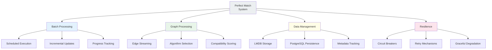
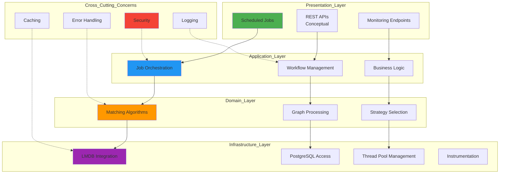
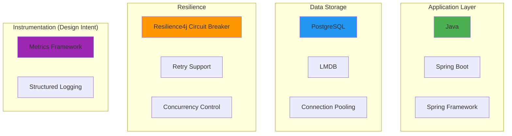
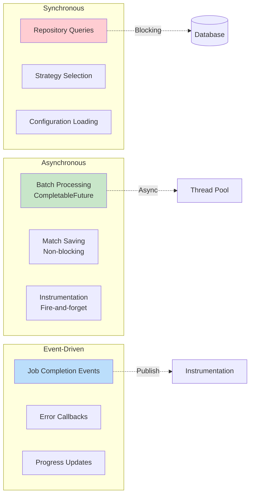
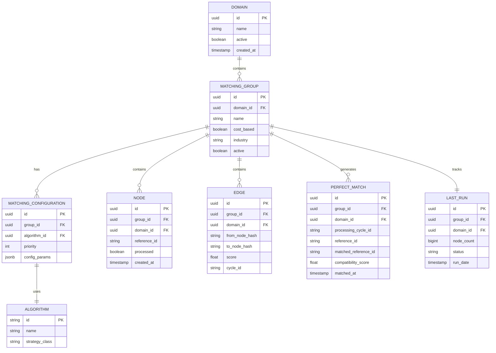
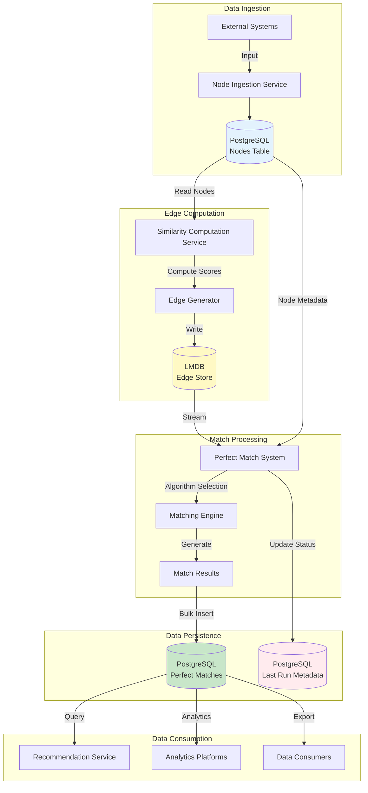

# Perfect Match Creation System - High-Level Design Document

---

This document describes the architectural design of a batch-oriented graph processing system developed as part of an independent backend systems project. The focus is on system structure, data flow, algorithm selection, and correctness rather than production deployment or operational characteristics.

## Table of Contents

1. [Executive Summary](#1-executive-summary)
2. [System Architecture](#3-system-architecture)
3. [Functional Requirements](#4-functional-requirements)
4. [Technology Stack](#6-technology-stack)
5. [Component Architecture](#7-component-architecture)
6. [Data Architecture](#8-data-architecture)

---

## 1. Executive Summary

### 1.1 System Overview

The **Perfect Match Creation System** is a batch-oriented graph processing system designed to generate optimal matches between entities based on compatibility scores.

### 1.2 Key Capabilities

---

## 3. System Architecture

### 3.1 Architectural Layers

### 3.2 Component Interaction Overview

---

## 4. Functional Requirements

### 4.1 Core Capabilities

#### FR-1: Scheduled Batch Processing
**Description**: The system executes perfect match creation on a scheduled basis.

**Acceptance Criteria**:
- Executes according to configurable schedule
- Processes eligible domain-group combinations
- Supports configurable cron expressions

#### FR-2: Incremental Node Processing
**Description**: The system processes only new nodes since the last successful run.

**Acceptance Criteria**:
- Tracks last processed node count per group
- Compares current node count against previous run
- Skips processing if no new nodes
- Updates metadata upon successful completion

#### FR-3: Multi-Algorithm Support
**Description**: The system supports multiple matching algorithms based on configuration.

**Acceptance Criteria**:
- Symmetric matching (mutual preference)
- Asymmetric matching (one-way preference)
- Algorithm selection per group configuration
- Extensible strategy pattern for new algorithms

#### FR-4: Result Persistence
**Description**: The system persists match results to PostgreSQL with deduplication.

**Acceptance Criteria**:
- Stores matches with compatibility scores
- Prevents duplicate matches (upsert logic)
- Maintains historical match timestamp
- Links to processing cycle identifier

#### FR-5: Progress Tracking
**Description**: The system tracks processing status and progress.

**Acceptance Criteria**:
- Records job start/end times
- Tracks status states
- Stores processed node count
- Supports restart from failure point

### 4.2 Feature Coverage

| Feature | Priority | Design Coverage | Notes |
|---------|----------|-----------------|-------|
| Scheduled Execution | P0 | Supported | Configurable scheduling |
| Incremental Processing | P0 | Supported | Metadata-based tracking |
| Symmetric Matching | P0 | Supported | Mutual preference algorithm |
| Asymmetric Matching | P0 | Supported | One-way preference algorithm |
| Circuit Breaker | P1 | Supported | Resilience pattern |
| Retry Mechanism | P1 | Supported | Automated retries |
| Manual Trigger API | P2 | Planned | On-demand execution |
| Real-time Matching | P2 | Planned | Event-driven processing |
| ML-based Scoring | P3 | Planned | Future enhancement |

---

## 6. Technology Stack

### 6.1 Technology Landscape

### 6.2 Technology Selection Rationale

| Technology | Purpose | Justification |
|------------|---------|---------------|
| **Java** | Programming Language | Long-term support and performance |
| **Spring Boot** | Application Framework | Enterprise features and ecosystem |
| **PostgreSQL** | Primary Database | ACID compliance and extensions |
| **LMDB** | Edge Cache | Memory-mapped I/O and read performance |
| **Resilience4j** | Fault Tolerance | Lightweight and comprehensive patterns |

---

## 7. Component Architecture

### 7.1 Layered Component View

### 7.2 Component Responsibility Matrix

| Component | Responsibility | Input | Output |
|-----------|---------------|-------|--------|
| **PerfectMatchesCreationScheduler** | Job triggering, resilience | Configuration | Task list execution |
| **PerfectMatchCreationService** | Resource orchestration, concurrency control | Group identifiers | Processing coordination |
| **PerfectMatchCreationJobExecutor** | Retry management, error handling | Group metadata | Match results |
| **PerfectMatchServiceImpl** | Core processing logic, streaming | Match requests | Saved matches |
| **MatchingStrategySelector** | Algorithm selection | Context | Strategy instance |
| **EdgePersistence** | LMDB abstraction | Query parameters | Edge streams |
| **PerfectMatchSaver** | Save orchestration | Match entities | Completion status |
| **PerfectMatchStorageProcessor** | Write optimization | Entity batches | Persisted records |

### 7.3 Communication Patterns

---

## 8. Data Architecture

### 8.1 Conceptual Data Model

### 8.2 Data Flow Architecture

---

## Appendix A: Glossary

| Term | Definition |
|------|------------|
| **Edge** | A weighted connection between two nodes representing compatibility |
| **Node** | An entity participating in matching |
| **Matching Algorithm** | Strategy for determining optimal matches (Symmetric/Asymmetric) |
| **Perfect Match** | The computed result representing best compatibility between entities |
| **Cycle ID** | Unique identifier for a processing run |
| **LMDB** | Lightning Memory-Mapped Database - high-performance key-value store |
| **Circuit Breaker** | Resilience pattern to prevent cascading failures |
| **Semaphore** | Concurrency control mechanism limiting parallel execution |
| **Advisory Lock** | Database locking mechanism for application-level coordination |