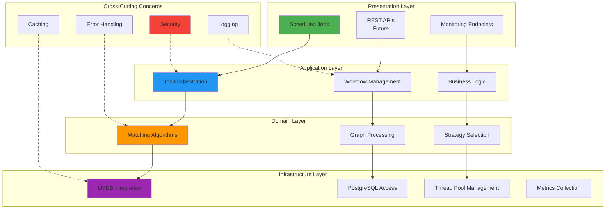
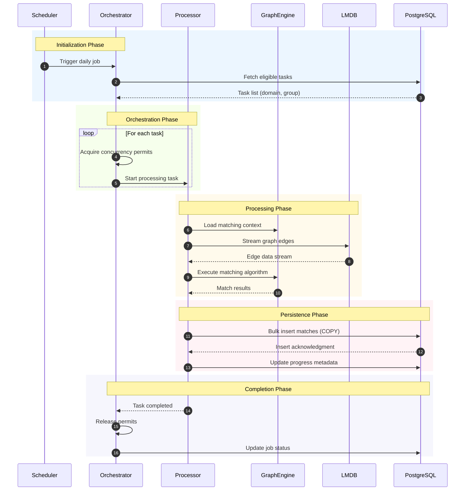
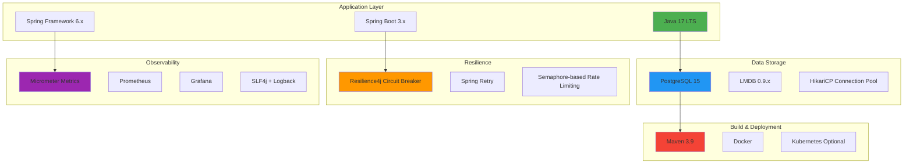
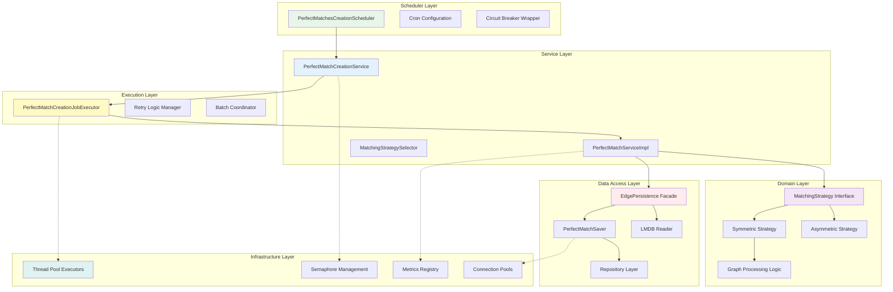
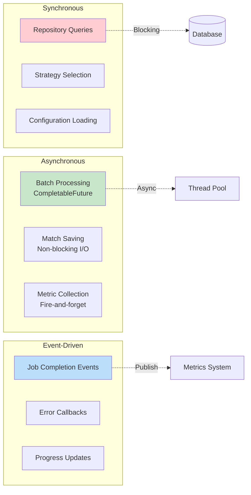
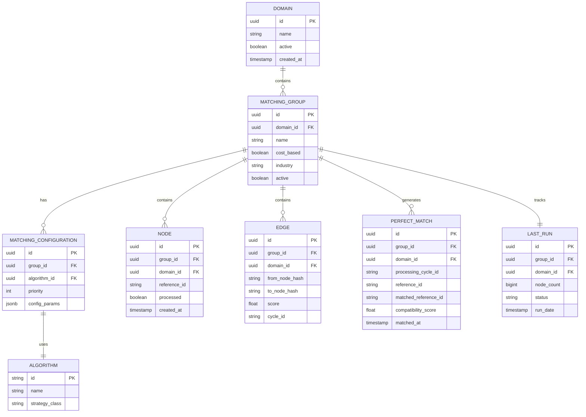
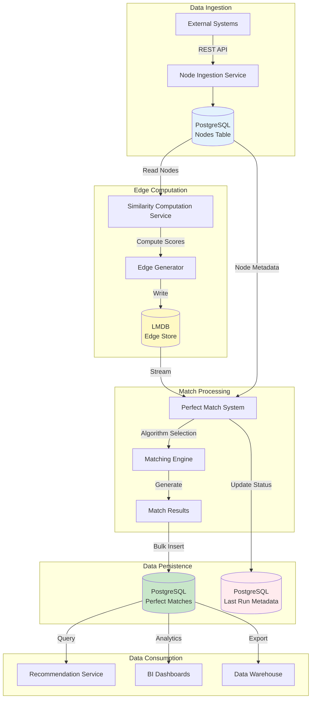
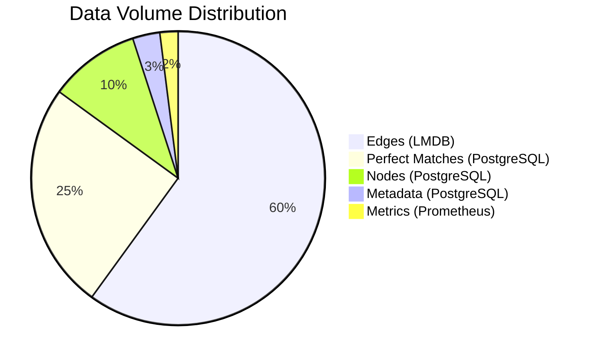

# Perfect Match Creation System - High-Level Design Document

---

## Table of Contents

1. [Executive Summary](#1-executive-summary)
2. [System Architecture](#3-system-architecture)
3. [Functional Requirements](#4-functional-requirements)
4. [Technology Stack](#6-technology-stack)
5. [Component Architecture](#7-component-architecture)
6. [Data Architecture](#8-data-architecture)


---

## 1. Executive Summary

### 1.1 System Overview

The **Perfect Match Creation System** is an enterprise-grade, high-throughput graph processing platform designed to compute optimal matches between entities based on compatibility scores. The system processes millions of edges daily, applying sophisticated matching algorithms to generate actionable match recommendations.

### 1.2 Key Capabilities

```mermaid
flowchart TB
    ROOT["Perfect Match<br/>System"]

    ROOT --> BP["Batch Processing"]
    ROOT --> GP["Graph Processing"]
    ROOT --> DM["Data Management"]
    ROOT --> RS["Resilience"]
    ROOT --> SC["Scalability"]

    BP --> BP1["Scheduled Execution"]
    BP --> BP2["Incremental Updates"]
    BP --> BP3["Progress Tracking"]

    GP --> GP1["Edge Streaming"]
    GP --> GP2["Algorithm Selection"]
    GP --> GP3["Compatibility Scoring"]

    DM --> DM1["LMDB Storage"]
    DM --> DM2["PostgreSQL Persistence"]
    DM --> DM3["Metadata Tracking"]

    RS --> RS1["Circuit Breakers"]
    RS --> RS2["Retry Mechanisms"]
    RS --> RS3["Graceful Degradation"]

    SC --> SC1["Concurrent Processing"]
    SC --> SC2["Resource Management"]
    SC --> SC3["Horizontal Scaling"]

    style ROOT fill:#ECEFF1
    style BP fill:#E3F2FD
    style GP fill:#E8F5E9
    style DM fill:#FFFDE7
    style RS fill:#FCE4EC
    style SC fill:#EDE7F6
```




## 3. System Architecture


### 3.1 Architectural Layers



### 3.2 Component Interaction Overview



---

## 4. Functional Requirements

### 4.1 Core Capabilities

#### FR-1: Scheduled Batch Processing
**Description**: System shall execute perfect match creation on a scheduled basis.

**Acceptance Criteria**:
- Execute daily at configured time (01:28 IST)
- Process all eligible domain-group combinations
- Complete within 4-hour SLA window
- Support configurable cron expressions

#### FR-2: Incremental Node Processing
**Description**: System shall process only new nodes since last successful run.

**Acceptance Criteria**:
- Track last processed node count per group
- Compare current node count vs. last run
- Skip processing if no new nodes
- Update metadata upon successful completion

#### FR-3: Multi-Algorithm Support
**Description**: System shall support multiple matching algorithms based on configuration.

**Acceptance Criteria**:
- Symmetric matching (mutual preference)
- Asymmetric matching (one-way preference)
- Algorithm selection per group configuration
- Extensible strategy pattern for new algorithms

#### FR-4: Result Persistence
**Description**: System shall persist match results to PostgreSQL with deduplication.

**Acceptance Criteria**:
- Store matches with compatibility scores
- Prevent duplicate matches (upsert logic)
- Maintain historical match timestamp
- Link to processing cycle ID

#### FR-5: Progress Tracking
**Description**: System shall track processing status and progress.

**Acceptance Criteria**:
- Record job start/end times
- Track PENDING/COMPLETED/FAILED status
- Store processed node count
- Enable restart from failure point

### 4.2 Feature Matrix

| Feature | Priority | Status | Version |
|---------|----------|--------|---------|
| Scheduled Execution | P0 | Complete | 1.0 |
| Incremental Processing | P0 | Complete | 1.0 |
| Symmetric Matching | P0 | Complete | 1.0 |
| Asymmetric Matching | P0 |  Complete | 1.0 |
| Circuit Breaker | P1 |  Complete | 1.0 |
| Retry Mechanism | P1 |  Complete | 1.0 |
| Metrics Export | P1 |  Complete | 1.0 |
| Manual Trigger API | P2 | 📋 Planned | 2.0 |
| Real-time Matching | P2 | 📋 Planned | 2.0 |
| ML-based Scoring | P3 | 💡 Future | 3.0 |

---


## 6. Technology Stack

### 6.1 Technology Landscape



### 6.2 Technology Selection Rationale

| Technology | Purpose | Justification |
|------------|---------|---------------|
| **Java 17** | Programming Language | LTS support, virtual threads (future), performance |
| **Spring Boot** | Application Framework | Enterprise features, auto-configuration, ecosystem |
| **PostgreSQL** | Primary Database | ACID compliance, JSONB support, mature ecosystem |
| **LMDB** | Edge Cache | Memory-mapped I/O, zero-copy reads, high performance |
| **Resilience4j** | Fault Tolerance | Lightweight, Spring integration, comprehensive patterns |
| **Micrometer** | Metrics | Vendor-neutral, Spring Boot native, Prometheus compatible |
| **HikariCP** | Connection Pooling | Fastest pool, production-proven, low overhead |

### 6.3 Dependency Management

```yaml
Key Dependencies:
  Spring Boot Starter: 3.2.x
  Spring Data JPA: 3.2.x
  PostgreSQL Driver: 42.7.x
  LMDB Java: 0.9.29
  Resilience4j: 2.1.x
  Micrometer: 1.12.x
  Lombok: 1.18.x
  
Build Tools:
  Maven: 3.9.x
  Java: 17 LTS
  
Testing:
  JUnit 5: 5.10.x
  Mockito: 5.x
  Testcontainers: 1.19.x
```

---

## 7. Component Architecture

### 7.1 Layered Component View



### 7.2 Component Responsibility Matrix

| Component | Responsibility | Input | Output |
|-----------|---------------|-------|--------|
| **PerfectMatchesCreationScheduler** | Job triggering, resilience | Cron trigger | Task list execution |
| **PerfectMatchCreationService** | Resource orchestration, concurrency control | Group IDs | Processing futures |
| **PerfectMatchCreationJobExecutor** | Retry management, error handling | Group metadata | Match results |
| **PerfectMatchServiceImpl** | Core processing logic, streaming | Match requests | Saved matches |
| **MatchingStrategySelector** | Algorithm selection | Context | Strategy instance |
| **EdgePersistence** | LMDB abstraction | Query params | Edge streams |
| **PerfectMatchSaver** | Async save orchestration | Match entities | Completion futures |
| **PerfectMatchStorageProcessor** | DB write optimization | Entity batches | Persisted records |

### 7.3 Communication Patterns



---

## 8. Data Architecture

### 8.1 Conceptual Data Model



### 8.2 Data Flow Architecture



### 8.3 Storage Strategy

| Data Type | Storage | Retention | Backup | Access Pattern |
|-----------|---------|-----------|--------|----------------|
| **Nodes** | PostgreSQL | Indefinite | Daily | Read-heavy |
| **Edges** | LMDB | 7 days | On-demand | Read-only streaming |
| **Perfect Matches** | PostgreSQL | 90 days | Daily | Write-once, read-many |
| **Metadata** | PostgreSQL | Indefinite | Daily | Low volume |
| **Metrics** | Prometheus | 30 days | None | Time-series queries |
| **Logs** | ELK Stack | 14 days | None | Search & analytics |

### 8.4 Data Volumes



**Estimated Growth**:
- Current: ~50GB LMDB, 200GB PostgreSQL
- 12 months: ~200GB LMDB, 800GB PostgreSQL
- 24 months: ~1TB LMDB, 4TB PostgreSQL

---


## Appendix A: Glossary

| Term | Definition |
|------|------------|
| **Edge** | A weighted connection between two nodes representing compatibility |
| **Node** | An entity (user, product, resource) participating in matching |
| **Matching Algorithm** | Strategy for determining optimal matches (Symmetric/Asymmetric) |
| **Perfect Match** | The computed result representing best compatibility between entities |
| **Cycle ID** | Unique identifier for a processing run |
| **LMDB** | Lightning Memory-Mapped Database - high-performance key-value store |
| **Circuit Breaker** | Resilience pattern to prevent cascading failures |
| **Semaphore** | Concurrency control mechanism limiting parallel execution |
| **Advisory Lock** | PostgreSQL locking mechanism for application-level coordination |

---

## Appendix B: Reference Architecture

### System Capabilities Summary

```mermaid
graph TB
    ROOT["Perfect Match System"]

    %% Top-level categories
    ROOT --> F["Functional"]
    ROOT --> NF["Non Functional"]
    ROOT --> OP["Operational"]

    %% Functional
    F --> F1["Scheduled Processing"]
    F --> F2["Incremental Updates"]
    F --> F3["Multi Algorithm Support"]
    F --> F4["Result Persistence"]

    %% Non-Functional
    NF --> NFP["High Performance"]
    NF --> NFR["High Reliability"]
    NF --> NFS["Scalability"]
    NF --> NFSec["Security"]

    %% Performance details
    NFP --> NFP1["500K edges per minute"]
    NFP --> NFP2["Less than 15 min latency"]

    %% Reliability details
    NFR --> NFR1["99.5 percent uptime"]
    NFR --> NFR2["Auto retry"]

    %% Scalability details
    NFS --> NFS1["Horizontal scaling ready"]
    NFS --> NFS2["Resource efficient"]

    %% Security details
    NFSec --> NFSec1["Encryption at rest and transit"]
    NFSec --> NFSec2["Audit logging"]

    %% Operational
    OP --> OPMon["Monitoring"]
    OP --> OPLog["Logging"]
    OP --> OPMaint["Maintenance"]

    %% Monitoring details
    OPMon --> OPMon1["Prometheus metrics"]
    OPMon --> OPMon2["Grafana dashboards"]

    %% Logging details
    OPLog --> OPLog1["Centralized ELK"]
    OPLog --> OPLog2["Structured logs"]

    %% Maintenance details
    OPMaint --> OPM1["Zero downtime deploy"]
    OPMaint --> OPM2["Automated backups"]

    %% Styling
    style ROOT fill:#4CAF50,color:#ffffff
    style F fill:#E3F2FD
    style NF fill:#FFF3E0
    style OP fill:#E8F5E9

```




---

