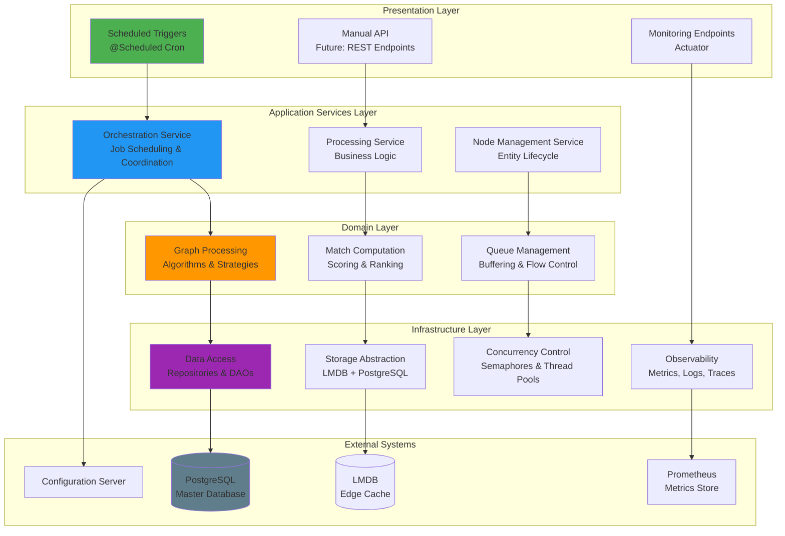
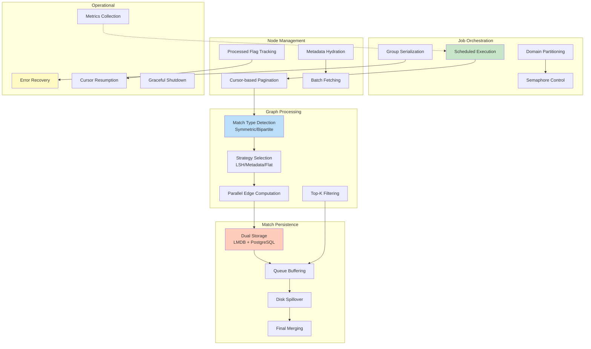
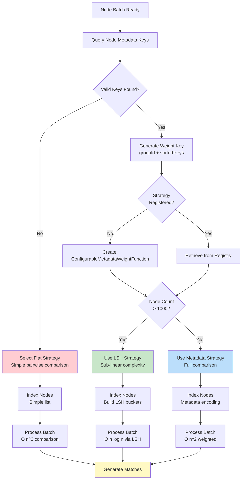
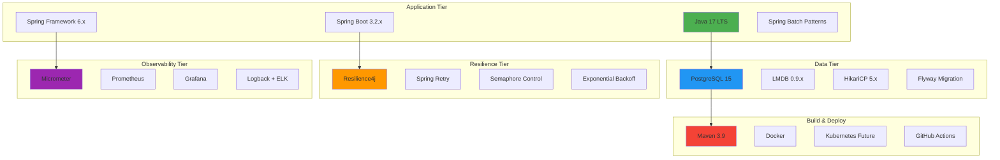
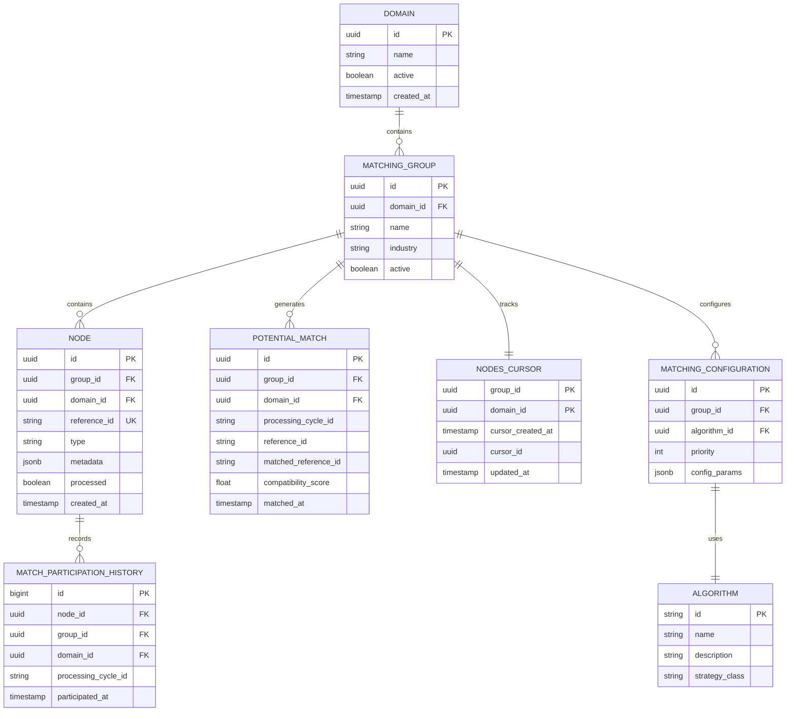
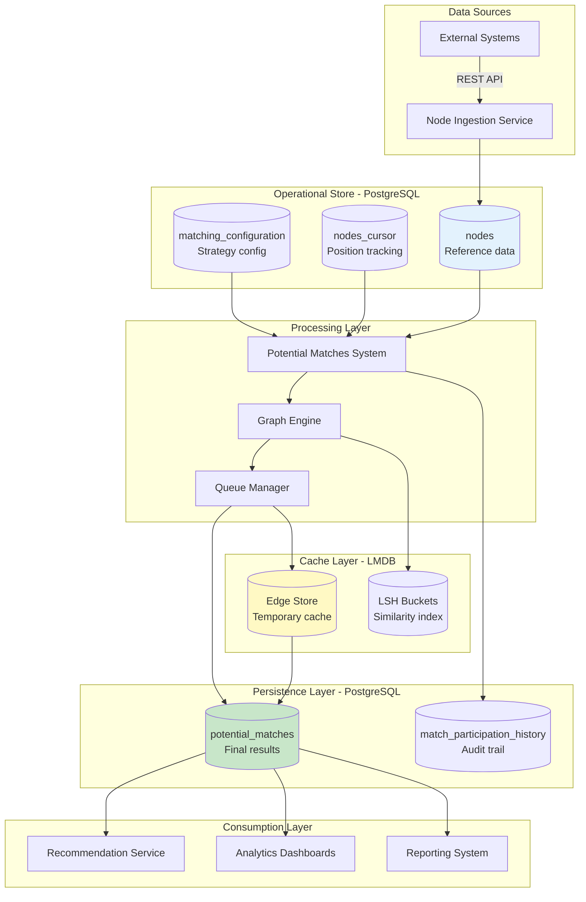
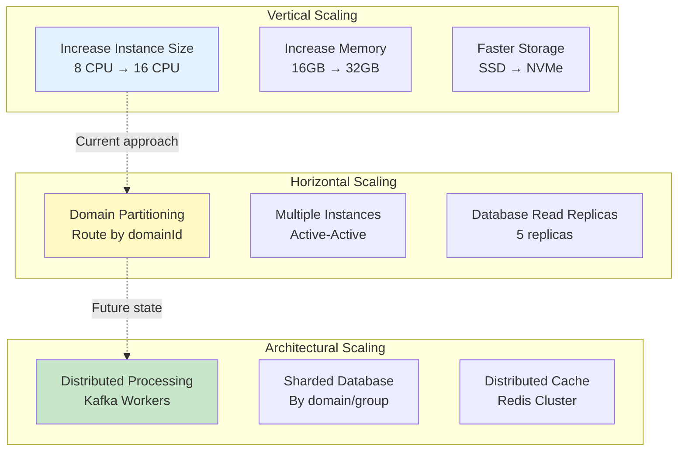
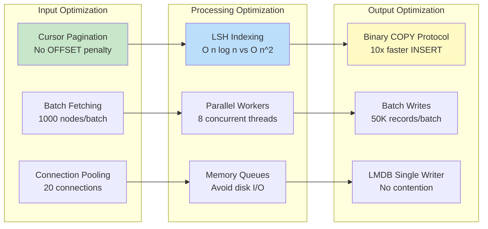
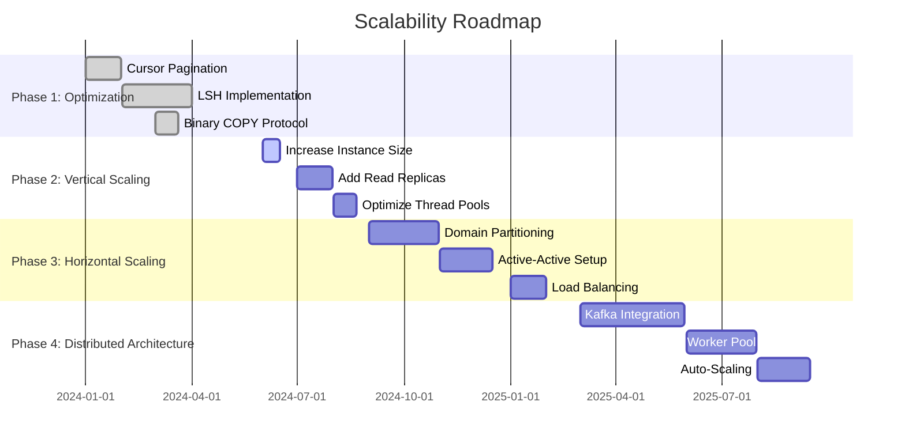

# Potential Matches Creation System - High-Level Design Document


---

## Table of Contents

1. [Executive Summary](#1-executive-summary)
2. [System Architecture](#3-system-architecture)
3. [Functional Architecture](#4-functional-architecture)
4. [Technology Stack](#6-technology-stack)
5. [Data Architecture](#7-data-architecture)
6. [Scalability & Performance](#11-scalability--performance)


---

## 1. Executive Summary

### 1.1 System Overview

The **Potential Matches Creation System** is an enterprise-grade graph processing platform designed to compute and persist compatibility relationships between entities at scale. The system processes millions of nodes daily, generating match recommendations using sophisticated algorithms including LSH (Locality-Sensitive Hashing), metadata-based weighting, and flat comparison strategies.


## 3. System Architecture


### 3.1 Logical Architecture




## 4. Functional Architecture

### 4.1 Core Capabilities



### 4.2 Processing Pipeline

```mermaid
flowchart LR
    A[Scheduled<br/>Trigger] --> B[Get Active<br/>Domains]
    B --> C[For Each<br/>Domain]
    C --> D[Get Groups<br/>per Domain]
    D --> E{Acquire<br/>Domain Sem?}
    
    E -->|Timeout| F[Skip & Log]
    E -->|Success| G[Load Cursor<br/>Position]
    
    G --> H[Fetch Node Batch<br/>1000 IDs]
    H --> I{Nodes Found?}
    
    I -->|No| J[Empty Streak++]
    J --> K{Streak >= 3?}
    K -->|Yes| L[End Group]
    K -->|No| H
    
    I -->|Yes| M[Hydrate Metadata]
    M --> N[Build Graph]
    N --> O[Compute Edges]
    O --> P[Enqueue Matches]
    
    P --> Q{Queue Full?}
    Q -->|Yes| R[Spill to Disk]
    Q -->|No| S[Keep in Memory]
    
    R --> T[Flush Batch]
    S --> T
    
    T --> U[Save to LMDB]
    T --> V[Save to PostgreSQL]
    
    U --> W[Mark Processed]
    V --> W
    W --> X[Update Cursor]
    X --> H
    
    L --> Y[Drain Queue]
    Y --> Z[Final Save<br/>LMDB → SQL]
    Z --> AA[Release Semaphore]
    AA --> AB[Next Group]
    
    style A fill:#4CAF50
    style N fill:#2196F3
    style P fill:#FF9800
    style T fill:#9C27B0
    style Z fill:#F44336
```



### 4.3 Algorithm Selection Logic



---


## 6. Technology Stack

### 6.1 Technology Landscape



### 6.2 Technology Selection Rationale

| Technology | Purpose | Alternatives Considered | Decision Rationale |
|------------|---------|------------------------|-------------------|
| **Java 17** | Programming Language | Kotlin, Scala | LTS support, team expertise, virtual threads roadmap |
| **Spring Boot** | Application Framework | Quarkus, Micronaut | Ecosystem maturity, enterprise support, productivity |
| **PostgreSQL** | Primary Database | MySQL, Oracle | JSONB support, COPY protocol, open source |
| **LMDB** | Edge Cache | RocksDB, Redis | Memory-mapped I/O, zero-copy, embedded |
| **Resilience4j** | Fault Tolerance | Hystrix (deprecated), Sentinel | Lightweight, functional, Spring integration |
| **Micrometer** | Metrics | Dropwizard Metrics | Vendor-neutral, Spring Boot native |
| **Prometheus** | Metrics Store | InfluxDB, Datadog | Pull model, PromQL, open source |
| **Grafana** | Visualization | Kibana, Chronograf | Flexibility, plugin ecosystem, community |

### 6.3 Dependency Management

```yaml
Key Dependencies:
  Spring Boot: 3.2.x
    - spring-boot-starter-web
    - spring-boot-starter-data-jpa
    - spring-boot-starter-actuator
  
  Database:
    - postgresql: 42.7.x
    - HikariCP: 5.1.x (transitive)
    - lmdbjava: 0.9.29
  
  Resilience:
    - resilience4j-spring-boot3: 2.1.x
    - spring-retry: 2.0.x
  
  Utilities:
    - lombok: 1.18.x
    - guava: 32.x
    - caffeine: 3.1.x
  
  Testing:
    - junit-jupiter: 5.10.x
    - mockito-core: 5.x
    - testcontainers: 1.19.x
```

---

## 7. Data Architecture

### 7.1 Conceptual Data Model



### 7.2 Data Flow Architecture




## 11. Scalability & Performance

### 11.1 Scalability Dimensions



### 11.2 Performance Optimization Strategies



### 11.3 Scaling Roadmap



---


## Appendix A: Glossary

| Term | Definition |
|------|------------|
| **Node** | An entity (user, product, resource) participating in matching |
| **Edge** | A weighted connection representing compatibility between nodes |
| **Potential Match** | A computed relationship with compatibility score |
| **Cursor** | Position marker for incremental processing |
| **Cycle ID** | Unique identifier for a processing run |
| **LSH** | Locality-Sensitive Hashing - algorithm for similarity search |
| **LMDB** | Lightning Memory-Mapped Database - embedded key-value store |
| **Semaphore** | Concurrency control mechanism limiting parallel execution |
| **Advisory Lock** | PostgreSQL application-level locking |
| **COPY Protocol** | PostgreSQL bulk data loading mechanism |

---

## Appendix B: References

**Internal Documentation**:
- Perfect Match Creation System - Low-Level Design (LLD)
- Database Schema Documentation
- API Documentation (Swagger)
- Operational Runbooks

**External References**:
- [Spring Boot Documentation](https://spring.io/projects/spring-boot)
- [PostgreSQL COPY Documentation](https://www.postgresql.org/docs/current/sql-copy.html)
- [LMDB Documentation](https://lmdb.readthedocs.io/)
- [LSH Algorithm Papers](https://en.wikipedia.org/wiki/Locality-sensitive_hashing)
- [Resilience4j Guide](https://resilience4j.readme.io/)

---


