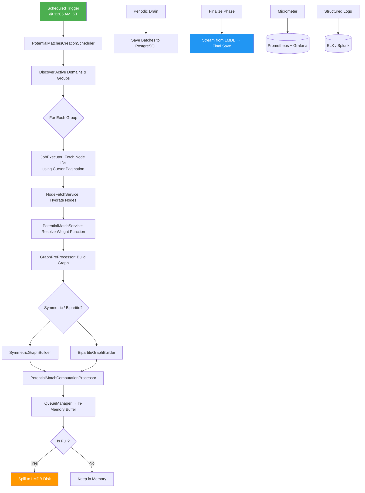

# High-Level Design (HLD) Document
## **Potential Matches Creation Module**


---

## Table of Contents

1. [Overview](#1-overview)
2. [Business Context & Use Cases](#2-business-context--use-cases)
3. [Goals & Non-Functional Requirements](#3-goals--non-functional-requirements)
4. [High-Level Architecture Diagram](#4-high-level-architecture-diagram)
5. [Component Overview](#5-component-overview)
6. [Data Flow](#6-data-flow)
7. [Concurrency Model](#7-concurrency-model)
8. [Error Handling & Resilience](#8-error-handling--resilience)
9. [Observability Strategy](#9-observability-strategy)
10. [Scalability & Deployment](#10-scalability--deployment)
11. [Open Questions](#11-open-questions)

---

## 1. Overview

The **Potential Matches Creation Module** is a **batch processing engine** that computes similarity-based matches between large-scale datasets using graph algorithms and metadata-driven logic.

It runs daily to identify potential matches across millions of nodes — such as users, products, or entities — based on behavioral patterns, attributes, and contextual data.

This system powers use cases like:
- Candidate-job matching
- Fraud ring detection
- Identity resolution
- Product recommendations

Designed for **high throughput**, **fault tolerance**, and **memory efficiency**, it leverages spill-to-disk buffering (via LMDB), cursor-based resumption, and bulk database operations.

---

## 2. Business Context & Use Cases

### 2.1 Problem Statement

Organizations need to find meaningful connections in massive datasets where manual review is impossible. For example:
- A job platform wants to match 10M candidates with relevant openings.
- A fraud team needs to detect suspicious account clusters.
- An identity system must link profiles across platforms.

These require **pairwise comparisons** at scale — which becomes computationally expensive without optimization.

### 2.2 Key Use Cases

| Use Case | Description |
|--------|-------------|
| **Daily Match Generation** | Run once per day to generate new matches for all active groups |
| **Resume After Failure** | Restart mid-cycle and continue from last cursor point |
| **Dynamic Scoring Logic** | Adjust match weights per group based on available metadata |
| **Final Persistence** | Land results into PostgreSQL for querying and reporting |

---

## 3. Goals & Non-Functional Requirements

| Category | Requirement |
|--------|------------|
| **Throughput** | Process up to **50 million nodes/day** |
| **Latency** | Complete full cycle within **<3 hours** |
| **Reliability** | Resume after crash; no data loss |
| **Fault Tolerance** | Retry transient failures automatically |
| **Observability** | Full metrics, logs, tracing |
| **Memory Safety** | Avoid OOM via spill-to-disk (LMDB) |
| **Concurrency Control** | Limit parallel domains; serialize per group |
| **Idempotency** | Ensure exactly-once match generation per `(groupId, cycleId)` |
| **Graceful Shutdown** | Flush pending matches before exit |
| **Extensibility** | Support future real-time ingestion |

---

## 4. High-Level Architecture Diagram



> 🔁 The entire process repeats until all groups are processed.

---

## 5. Component Overview

| Component | Responsibility |
|--------|----------------|
| `PotentialMatchesCreationScheduler` | Top-level orchestrator; schedules daily run, manages concurrency, chains tasks |
| `PotentialMatchesCreationJobExecutor` | Drives node fetching using time+ID cursor; applies overlap to avoid missed records |
| `NodeFetchService` | Retrieves unprocessed node IDs and hydrates full objects from DB |
| `PotentialMatchServiceImpl` | Coordinates batch processing: resolves weight function, triggers graph build |
| `WeightFunctionResolver` | Dynamically selects scoring strategy based on node metadata schema |
| `GraphPreProcessor` | Decides whether to build symmetric or bipartite graph |
| `SymmetricGraphBuilder` | Computes pairwise matches using chunked cross-product |
| `PotentialMatchComputationProcessorImp` | Handles buffering, draining, final save, and cleanup |
| `GraphStore` | Unified persistence layer for edges and LSH buckets |
| `UnifiedWriteOrchestrator` | Thread-safe writer for LMDB (single-threaded queue) |
| `PotentialMatchSaver` + `StorageProcessor` | Finalizes matches into PostgreSQL using binary `COPY` and merge |

---

## 6. Data Flow

### Step-by-Step Execution

1. **Trigger**
    - Daily cron (`0 5 11 * * *`, IST) starts the cycle.
    - Generates unique `cycleId`.

2. **Discovery**
    - Fetch all `Domain`s → get associated `MatchingGroup`s.
    - Create work items: `(domainId, groupId)` tuples.

3. **Per-Group Processing Chain**
   ```text
   [Fetch IDs by Cursor] 
       → [Hydrate Nodes] 
       → [Build Graph] 
       → [Compute Edges] 
       → [Enqueue Matches]
   ```

4. **Buffering & Spilling**
    - Matches go into `QueueManagerImpl`.
    - If memory fills → spills to **LMDB on disk**.

5. **Drain Phase**
    - Background task drains queue → saves batches to PostgreSQL.

6. **Final Save**
    - At end of cycle:
        - Stream remaining edges from LMDB.
        - Bulk copy into PostgreSQL via `COPY FROM STDIN BINARY`.
        - Merge using `ON CONFLICT DO UPDATE`.

7. **Cleanup**
    - Close queue manager.
    - Delete spill files.
    - Release domain semaphore.

---

## 7. Concurrency Model

| Constraint | Mechanism |
|----------|-----------|
| Max Concurrent Domains | Semaphore (`maxConcurrentDomains`, default: `2`) |
| Per-Group Serial Execution | `groupLocks: Map<UUID, CompletableFuture>` ensures only one task runs at a time |
| LMDB Writer Safety | Single-threaded `UnifiedWriteOrchestrator` prevents MDB_BAD_RSLOT errors |
| DB Read Throttling | Semaphore (`dbFetchSemaphore`, permits=4) limits concurrent hydration |
| Final Save Control | Semaphore (`storageSemaphore`, permits=16) limits concurrent DB writes |

> All executors are externally configured and injected via `@Qualifier`.

---

## 8. Error Handling & Resilience

| Risk | Mitigation |
|------|-----------|
| Transient DB Errors | Retry with exponential backoff (up to 3x) |
| Network Latency | Timeout guards (30s–3h) |
| OOM Risk | Spill-to-disk via LMDB when memory pressure detected |
| Restart During Cycle | Resume via persisted cursor (`NodesCursor`) |
| Duplicate Execution | Advisory lock per `groupId` in PostgreSQL |
| Queue Overflow | Reject enqueue, emit metric, rely on retry later |
| Final Save Failure | Alert and fail cycle |
| Thread Interruption | Restore interrupt flag; propagate safely |

### Critical Safeguards:
- `orTimeout()` on all long-running futures
- `tryAcquire(timeout)` on semaphores
- Graceful shutdown with flush timeout (5 min)
- Backpressure detection during drain

---

## 9. Observability Strategy

### 9.1 Logging
- Structured JSON logs with fields:
    - `cycleId`
    - `groupId`
    - `domainId`
    - `status`
    - `error_message`
- Levels:
    - `INFO`: Progress, start/end events
    - `DEBUG`: Internal steps
    - `ERROR`: Exceptions with stack traces

### 9.2 Metrics (Micrometer)

| Metric Type | Example Names |
|-----------|---------------|
| Timers | `batch_matches_total_duration`, `matching_batch_duration` |
| Counters | `match.job.failed_max_retries`, `final_save.error` |
| Gauges | `write_queue_size`, `graph_build_queue_length` |
| Histograms | `lsh.txn.buckets_per_txn` |

Integrated with:
- **Prometheus**: Scrapes `/actuator/metrics`
- **Grafana**: Dashboards for cycle duration, error rates, queue size

### 9.3 Tracing
- Not implemented yet.
- Future scope: Integrate OpenTelemetry for distributed trace context.

---

## 10. Scalability & Deployment

### 10.1 Horizontal Scaling

Scale out via **domain sharding**:

| Instance | Filters By |
|--------|------------|
| Instance 0 | `domainId % 2 == 0` |
| Instance 1 | `domainId % 2 == 1` |

Each instance processes disjoint sets → zero coordination needed.

> Can scale to N instances if required.

### 10.2 Deployment Options

| Option | Description |
|-------|------------|
| **Standalone Spring Boot App** | Simple deployment; suitable for PoC |
| **Kubernetes Pod** | Production-ready; supports auto-restart, monitoring |
| **JVM Tuning** | `-Xmx8g`, `-XX:+UseZGC`, disable biased locking |

### 10.3 CI/CD Pipeline

```text
Code → Unit Tests → Integration Tests → Build Docker Image → Push to Registry → ArgoCD Sync → Kubernetes
```

Rollback plan: Revert image tag → monitor metrics.

---

## 11. Open Questions

| Question | Status |
|--------|--------|
| Can we support real-time ingestion alongside batch? | Planned Q3 – evaluate Kafka/Kinesis |
| Should we shard further by `tenantId`? | Under review – depends on multi-tenancy roadmap |
| Can we replace advisory locks with Redis-based coordination? | Exploring – but adds complexity |
| Is there value in caching frequently used metadata? | Yes – considering Caffeine cache |
| Can we reduce finalization time via parallel merge? | Limited by primary key constraints |


---
