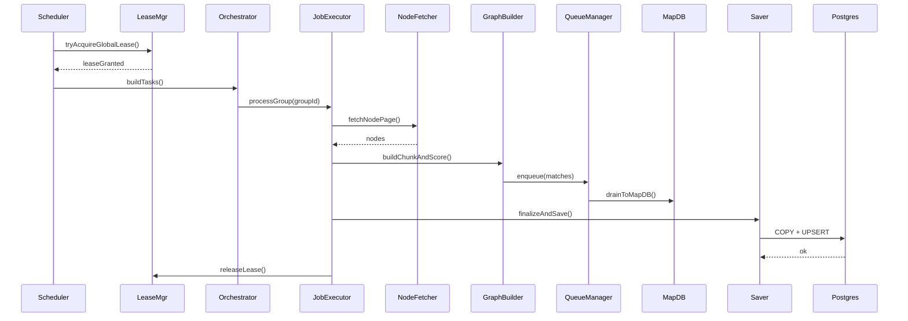
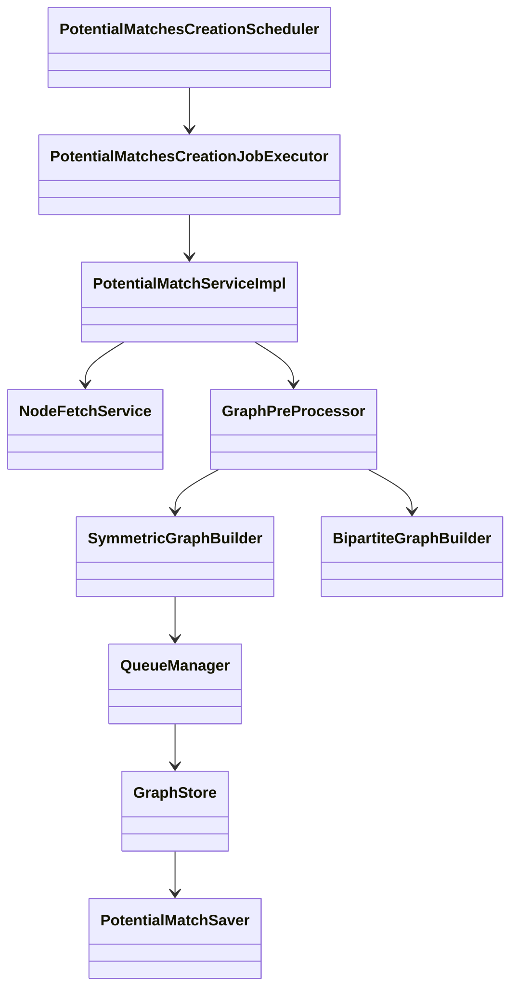

# Scheduled Potential Match Creation — High-Level Design (HLD)

---

## 0. Intent — short and merciless

This HLD describes a resilient, backpressure-aware, scheduled batch that computes **Potential Matches** per domain/group, stages them in MapDB, and persists final potential matches to PostgreSQL for downstream consumption by the Perfect Matches job. Designed to run safely in **multi-instance production** with cluster coordination and operational guardrails.

---

## 1. Purpose & Scope

### 1.1 Purpose

* Produce high-quality **Potential Match** edges between nodes per domain/group using pluggable matching strategies (LSH, metadata rules, bipartite chunking).
* Stage transient edges in **MapDB** for fast writes and streaming.
* Finalize results into **PostgreSQL** via `COPY` → `UPSERT`.

### 1.2 Scope

**In scope**

* Scheduled orchestration, domain/group discovery and locking.
* Node fetching, weight function selection, LSH or bipartite builders.
* QueueManager per-group, MapDB staging, finalization pipeline to Postgres.
* Observability, retries, circuit breakers, backpressure.

**Out of scope**

* Real-time matching (Kafka stream processing).
* UI or consumer-facing APIs (consumers read `potential_matches` table).

### 1.3 Goals / NFRs

* **Safety**: Avoid OOMs, avoid duplicate concurrent group processing.
* **Throughput**: Tunable to process groups with up to 10k–100k nodes (configurable).
* **Resilience**: Retries, circuit breakers, idempotent persistence.
* **Observability**: Metrics + tracing with `processing_cycle_id` (aka `cycleId`).
* **Security**: Least-privileged DB role for batch ops.

---

## 2. Scheduling & Guaranteed Ordering

### 2.1 Schedule

* Default cron (configurable): `0 0 1 * * *` (UTC) — production suggests earlier-night run to allow downstream PerfectMatches at 03:00 IST; configure per site needs.
* Entrypoint: `PotentialMatchesCreationScheduler.processAllDomainsScheduled()`.

### 2.2 Inter-job dependency (must)

To prevent the PerfectMatches job from reading partial data:

* **Completion marker**: At the end of each group run, write `LastRunPotentialMatches{groupId,domainId,processing_cycle_id,status}` with `status=COMPLETED` and timestamp.
* **PerfectMatches job**: MUST check `LastRunPotentialMatches` for `COMPLETED` before consuming that group’s `potential_matches`.

Use this OR schedule the two jobs with enough buffer. No marker → no consumption. Period.

---

## 3. Architecture Overview

### 3.1 Logical components

* **Scheduler** (`PotentialMatchesCreationScheduler`) — cron + leader-lease + high-level retries.
* **JobExecutor** (`PotentialMatchesCreationJobExecutor`) — per-group orchestration with retries, page semaphores.
* **PotentialMatchServiceImpl** — orchestrates fetch → build → compute → enqueue.
* **NodeFetchService** — paged, transactional node retrieval.
* **WeightFunctionResolver** — chooses score/weight function per group.
* **GraphPreProcessor** — selects SYMMETRIC / BIPARTITE / AUTO path and enforces build concurrency.
* **SymmetricGraphBuilder** / **BipartiteGraphBuilder** — LSH index build / bipartite chunking.
* **QueueManager** (per-group) — bounded buffer, boosted drain triggers, TTL eviction.
* **GraphStore (MapDB)** — transient staging, batched writes, streamable by group.
* **PotentialMatchSaver** / **PotentialMatchStorageProcessor** — COPY → UPSERT into `public.potential_matches`.
* **MatchesCreationFinalizer** — final flush, cleanup, and completion marker update.

### 3.2 Multi-instance readiness

* **Leader-lease** before starting a global cycle (DB or Redis lease).
* **Distributed semaphores** for domain/group/page (Redis or DB-backed) to ensure mutually-exclusive processing across instances.
* In-process semaphores only valid if deployed singleton (profile: `singleton`).

---

## 4. Data Flow (end-to-end)

1. Scheduler fires and attempts to acquire **global lease**.
2. Build list of active domains/groups to process.
3. For each group:

    * Acquire **domain semaphore** and **group semaphore** (distributed).
    * Set `LastRunPotentialMatches.status = PENDING` and create `processing_cycle_id` (UUID).
    * Clear/initialize per-group QueueManager & caches.
    * Fetch node IDs (keyset pagination), load nodes in sub-batches.
    * Resolve weight function and build graph:

        * Symmetric path: LSH index build → chunk queries → edge scoring.
        * Bipartite path: left/right chunk Cartesian scoring → immediate staging.
    * Enqueue candidate potential matches to QueueManager (bounded).
    * QueueManager drains to MapDB (periodic or boosted).
    * When group completes, Finalizer:

        * Force queue flush → MapDB commit.
        * Stream MapDB edges, compute per-node Top-K if required, group results into batches.
        * Save to Postgres via `COPY` → `UPSERT`.
        * Set `LastRunPotentialMatches.status = COMPLETED` (or FAILED).
    * Release semaphores and continue.

---

## 5. Data Model & Schema (summary)

### `potential_matches` (final)

```sql
CREATE TABLE public.potential_matches (
  id UUID PRIMARY KEY DEFAULT gen_random_uuid(),
  group_id UUID NOT NULL,
  domain_id UUID NOT NULL,
  processing_cycle_id VARCHAR(36) NOT NULL,
  reference_id VARCHAR(255) NOT NULL,
  matched_reference_id VARCHAR(255) NOT NULL,
  compatibility_score DOUBLE PRECISION NOT NULL,
  matched_at TIMESTAMP WITH TIME ZONE NOT NULL DEFAULT now(),
  UNIQUE (group_id, reference_id, matched_reference_id)
);
```

### `LastRunPotentialMatches`

```sql
CREATE TABLE last_run_potential_matches (
  group_id UUID PRIMARY KEY,
  domain_id UUID NOT NULL,
  processing_cycle_id VARCHAR(36),
  status VARCHAR(16), -- PENDING|COMPLETED|FAILED
  started_at TIMESTAMP,
  finished_at TIMESTAMP
);
```

**Contract**: DB `processing_cycle_id` ↔ application `cycleId` (UUID string). Always include it in logs and metrics.

---

## 6. Persistence & Upsert Semantics

### MapDB staging

* Key format: `groupId:chunkIndex:referenceId:matchedReferenceId` → serialized `PotentialMatch`.
* MapDB config: disk-backed HTreeMap, periodic commits, TTL per-group for cleanup.

### Final persistence (safe & fast)

* Batch size: default `matches.save.batch-size = 5000`.
* For each batch:

    1. Create temp table `temp_potential_matches`.
    2. Binary `COPY` from client (CopyManager) to temp table.
    3. `INSERT INTO potential_matches SELECT * FROM temp_potential_matches ON CONFLICT ... DO UPDATE ...`.
    4. DROP temp table.

### Conflict resolution (dedupe policy)

Keep the row with *highest* `compatibility_score`. Example UPSERT:

```sql
INSERT INTO potential_matches (group_id, domain_id, processing_cycle_id, reference_id, matched_reference_id, compatibility_score, matched_at)
SELECT group_id, domain_id, processing_cycle_id, reference_id, matched_reference_id, compatibility_score, matched_at FROM temp_potential_matches
ON CONFLICT (group_id, reference_id, matched_reference_id)
DO UPDATE SET
  compatibility_score = GREATEST(potential_matches.compatibility_score, EXCLUDED.compatibility_score),
  matched_at = EXCLUDED.matched_at,
  processing_cycle_id = EXCLUDED.processing_cycle_id;
```

**Important**: This makes persistence idempotent for retries (same or lower score rows won’t overwrite higher scores).

---

## 7. Concurrency & Backpressure

### Semaphores & Executors

* **Global lease** (single-run per cluster cycle).
* **Domain semaphore** (default 2).
* **Group semaphore** (1 per group).
* **Page semaphore** (max concurrent page fetches per group).
* **Build semaphores** (limit parallel LSH builds).
* **Save semaphore** (limit concurrent DB copy/upssert operations).

Executors:

* `matchCreationExecutorService` for orchestration.
* `graphExecutorService` for compute (chunk workers).
* `ioExecutorService` for node fetch & MapDB writes.
* `persistenceExecutor` for COPY/upsert.

### QueueManager

* Per-group bounded queue (`match.queue.capacity`, default 500k).
* Boosted drain when queue fill ratio > `drainWarningThreshold` (config).
* On queue full: emit `match_drops_total{reason="queue_full"}` and trigger boosted drain. Do not crash; fail-safe and alert.

---

## 8. Memory & LSH guards

* Config:

    * `matching.max.memory.mb` (default 1024)
    * `matching.memory.guard.threshold` (default 0.8)
    * `graph.max-nodes-per-build` (default 10000)
* Monitor heap usage and `adjacency_map_current_size`.
* On threshold breach:

    1. Halve fetchSize and reduce chunkSize; attempt soft `System.gc()`.
    2. If still over threshold, abort group gracefully (set `LastRun=FAILED`), capture heap dump (if allowed), and alert.
* For large groups > `graph.max-nodes-per-build`, switch to chunked, out-of-core processing or AuctionApproximate-like fallbacks.

---

## 9. Resilience (timeouts, retries, CB)

### Retry policies (defaults)

* `match.max-retries = 3`
* Exponential backoff: 1s, 2s, 4s.
* Circuit-breaker: open after 5 consecutive failures for a group; open duration 15 minutes.

### Where applied

* Node fetch page retries.
* Chunk processing retries.
* MapDB commit retries.
* COPY/UPSERT retries (idempotent).

### Fallbacks

* LSH build failure → fall back to flat-chunk scoring or mark group failed depending on config.
* MapDB write failure → fail group; surface alert.

---

## 10. Observability & Monitoring

### Canonical metrics (Micrometer)

* Counters:

    * `potential_matches_generated_total{groupId,domainId,processing_cycle_id}`
    * `potential_matches_saved_total{groupId,domainId,processing_cycle_id}`
    * `match_drops_total{reason,groupId,domainId}`
* Timers:

    * `batch_matches_total_duration{groupId,domainId,processing_cycle_id}`
    * `graph_build_duration{groupId}`
    * `storage_processor_batch_duration{groupId}`
* Gauges:

    * `adjacency_map_current_size{groupId}`
    * `system_heap_usage_mb`
    * `queue_manager_size{groupId}`
* Logs: include `{cycleId, groupId, domainId, page, chunk}` in structured logs.

### Alerts (suggested)

* `increase(match_drops_total[5m]) > 100`
* `graph_build_errors > 0`
* `heap_usage > matching.max.memory.mb * 0.9`
* `too_many_groups_failed_in_window` (configurable)

---

## 11. MapDB Operational Rules (don’t ignore this)

* **Flush policy**: MapDB is flushed to disk on every forced drain, and periodic commits every `mapdb.commit.interval.seconds` (default 5s).
* **Disk sizing**: Provisioned disk ≥ `match.queue.capacity * avgSerializedMatchSize * safetyFactor` (calculate with measured sizes; default safetyFactor=1.5).
* **TTL & cleanup**: Per-group entries removed after finalization; MapDB compaction scheduled daily during low load.
* **Failure**: If MapDB write or disk error occurs, mark group `FAILED` and alert. Do **not** continue processing for that group.
* **Placement**: Use SSD-backed local disk, not network mount. Containerized: mount a dedicated volume.

---

## 12. Testing & Rollout

### Modes

* **Dry-run**: `--dry-run` computes matches and writes to logs/metrics but does not persist to PostgreSQL (useful for correctness and perf).
* **Canary**: Run new strategy for X% groups (e.g., 1–5%); compare metrics before broad rollout.

### Testing matrix

* Unit tests for all `MatchingStrategy` implementations.
* Integration tests with embedded Postgres and MapDB.
* Load test: simulate high queue fill, MapDB flush, and concurrent groups.
* Chaos tests: disk full, DB timeout, node fetch failures, and leader lease loss.

---

## 13. Security & Permissions

* Use dedicated DB role for batch:

    * `SELECT` on node tables
    * `CREATE TEMP TABLE`, `INSERT`, `UPDATE` on `potential_matches`
    * Avoid superuser
* Store DB credentials in a secret manager (Vault, AWS Secrets Manager).
* Audit `COPY` operations (log batch sizes and `cycleId`).
* Limit access to MapDB files to process user only.

---

## 14. Configuration (selected keys & defaults)

| Key                               |       Default | Purpose              |
| --------------------------------- | ------------: | -------------------- |
| `cron`                            | `0 0 1 * * *` | schedule             |
| `match.max-concurrent-domains`    |           `2` | domain parallelism   |
| `match.max-retries`               |           `3` | retries              |
| `matching.max.memory.mb`          |        `1024` | memory guard         |
| `matching.memory.guard.threshold` |         `0.8` | guard fraction       |
| `graph.max-nodes-per-build`       |       `10000` | LSH build threshold  |
| `BATCH_SIZE_FROM_CURSOR`          |        `5000` | node fetch fetchSize |
| `match.queue.capacity`            |      `500000` | per-group buffer     |
| `import.batch-size`               |        `5000` | COPY batch size      |
| `mapdb.commit.interval.seconds`   |           `5` | MapDB commit         |

---

## 15. Sequence & Class Diagrams

### 15.1 High-level sequence



### 15.2 Class diagram (summary)



---

## 16. Operational Runbook (cheat sheet)

**Start-of-day checks**

* Ensure `mapdb.path` volume free space > threshold.
* Postgres reachable and WAL retention adequate.
* Monitoring dashboards up.

**If a group fails**

* Inspect `LastRunPotentialMatches` for `processing_cycle_id`.
* Check MapDB status and commit logs for group.
* If MapDB disk full: free space or increase volume; re-run group after cleanup.
* For DB COPY failures: inspect temp table logs; re-run save with same `processing_cycle_id` (idempotent).

**Recovery**

* Re-run a group manually via admin job; uses `processing_cycle_id` to avoid duplicate score regressions because UPSERT logic chooses highest score.

---

## 17. Trade-offs & Limitations

* **Two-stage persistence (MapDB + Postgres)** adds operational complexity (MapDB lifecycle) but provides backpressure and high write throughput.
* **Not exactly-once** across cluster reboots — UPSERT strategy mitigates duplicates, but consumers must accept "latest best-scored" semantics.
* **Large groups** may need vertical scaling or sharding; consider sharding by `domainId` for horizontal scale in future.

---

## 18. Future improvements (roadmap)

* Replace MapDB with durable streaming (Kafka/Redis Streams) for distributed durability and replay.
* Implement distributed checkpointing for group-level resume after crash.
* Move LSH to an external index (HNSW/FAISS) for higher recall and persistent indices.
* Add ML-based ranking step post-persistence.

---

## 19. Appendix — Useful snippets

### Global lease (DB conceptual)

```sql
BEGIN;
SELECT id FROM batch_leases WHERE name='potential_matches' FOR UPDATE SKIP LOCKED;
-- if row returned -> hold lease and proceed; else COMMIT and exit cycle
COMMIT;
```

### UPSERT (keep highest score)—Postgres

(See section 6; copy-paste ready.)

### JDBC streaming (node fetch pseudo)

```java
PreparedStatement ps = conn.prepareStatement(sql, ResultSet.TYPE_FORWARD_ONLY, ResultSet.CONCUR_READ_ONLY);
ps.setFetchSize(BATCH_SIZE_FROM_CURSOR);
ResultSet rs = ps.executeQuery();
while(rs.next()) { /* read node, buffer, backpressure checks */ }
```

---
