# Potential Matches Creation System - High-Level Design Document


---

## Table of Contents

1. [Executive Summary](#1-executive-summary)
2. [System Architecture](#3-system-architecture)
3. [Functional Architecture](#4-functional-architecture)
4. [Non-Functional Requirements](#5-non-functional-requirements)
5. [Technology Stack](#6-technology-stack)
6. [Data Architecture](#7-data-architecture)
7. [Integration Architecture](#8-integration-architecture)
8. [Scalability & Performance](#11-scalability--performance)


---

## 1. Executive Summary

### 1.1 System Overview

The **Potential Matches Creation System** is an enterprise-grade graph processing platform designed to compute and persist compatibility relationships between entities at scale. The system processes millions of nodes daily, generating match recommendations using sophisticated algorithms including LSH (Locality-Sensitive Hashing), metadata-based weighting, and flat comparison strategies.

### 1.2 Business Value Proposition

```mermaid
flowchart TB
    ROOT["Business Value"]

    ROOT --> AUTO["Automation"]
    ROOT --> SC["Scale"]
    ROOT --> QL["Quality"]
    ROOT --> EF["Efficiency"]
    ROOT --> INT["Intelligence"]

    AUTO --> A1["Eliminates manual matching"]
    AUTO --> A2["Reduces human error"]
    AUTO --> A3["24/7 processing capability"]

    SC --> S1["Millions of entities"]
    SC --> S2["Billions of comparisons"]
    SC --> S3["Sub-linear complexity"]

    QL --> Q1["Algorithmic consistency"]
    QL --> Q2["Configurable strategies"]
    QL --> Q3["Continuous improvement"]

    EF --> E1["Cost reduction vs manual"]
    EF --> E2["Fast processing time"]
    EF --> E3["Resource optimization"]

    INT --> I1["LSH similarity detection"]
    INT --> I2["Metadata weighting"]
    INT --> I3["Adaptive learning"]

    style ROOT fill:#ECEFF1
    style AUTO fill:#E3F2FD
    style SC fill:#E8F5E9
    style QL fill:#FFFDE7
    style EF fill:#FCE4EC
    style INT fill:#EDE7F6

```

### 1.3 Key Metrics

| Metric | Current Capacity | Target (12 months) | Strategic Goal (24 months) |
|--------|------------------|-------------------|---------------------------|
| **Nodes Processed/Day** | 50K | 500K | 5M |
| **Match Computations/Sec** | 100K | 500K | 2M |
| **Processing Latency** | 15 min/group | <10 min/group | <5 min/group |
| **System Availability** | 99.5% | 99.9% | 99.99% |
| **Concurrent Domains** | 2 | 5 | 20 |
| **Storage Footprint** | 200GB | 2TB | 20TB |

### 1.4 Strategic Alignment

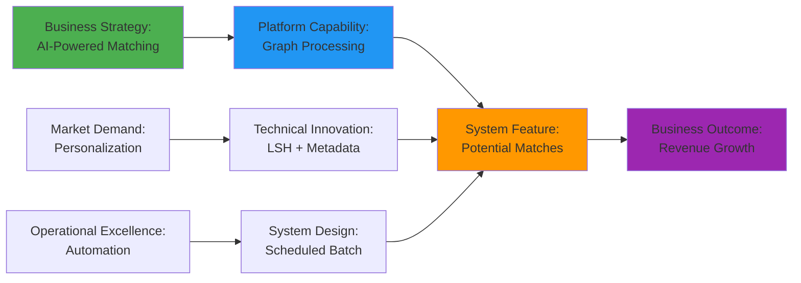

---


## 3. System Architecture

### 3.1 Architectural Style

**Primary Style:** Event-Driven Batch Processing  
**Secondary Patterns:** Microkernel, Pipes-and-Filters

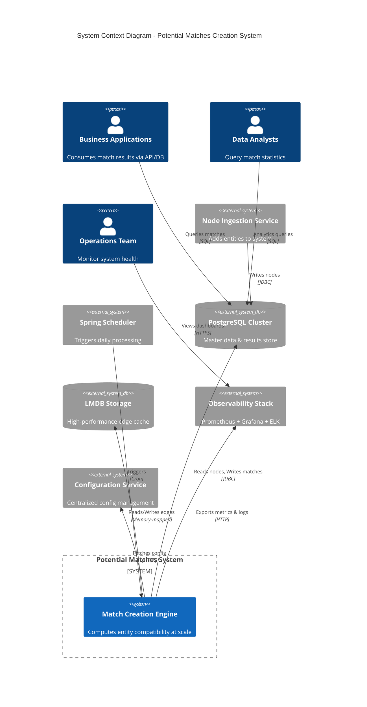

### 3.2 Logical Architecture

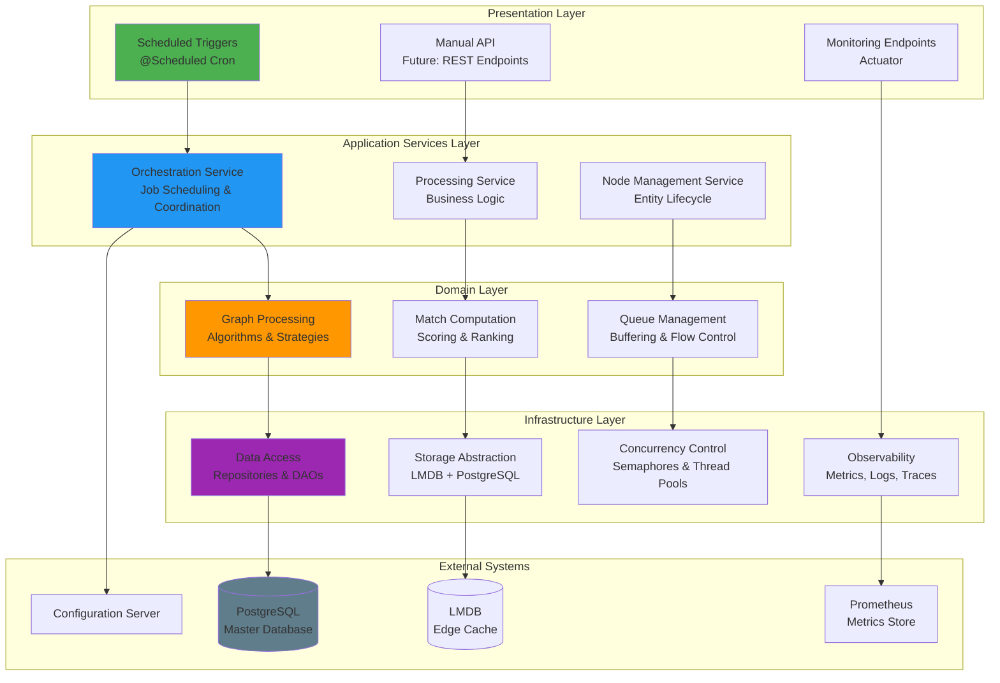

### 3.3 Component Architecture

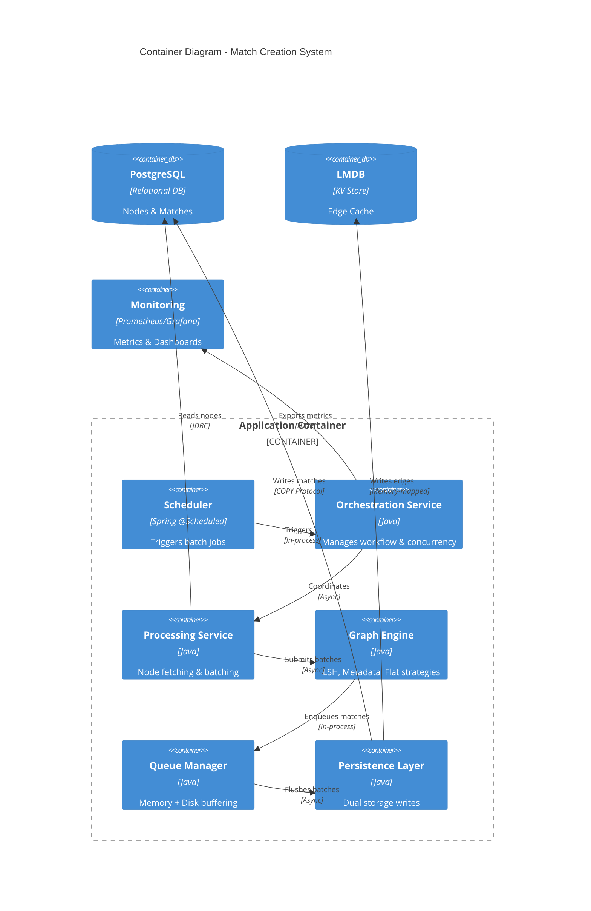

---

## 4. Functional Architecture

### 4.1 Core Capabilities

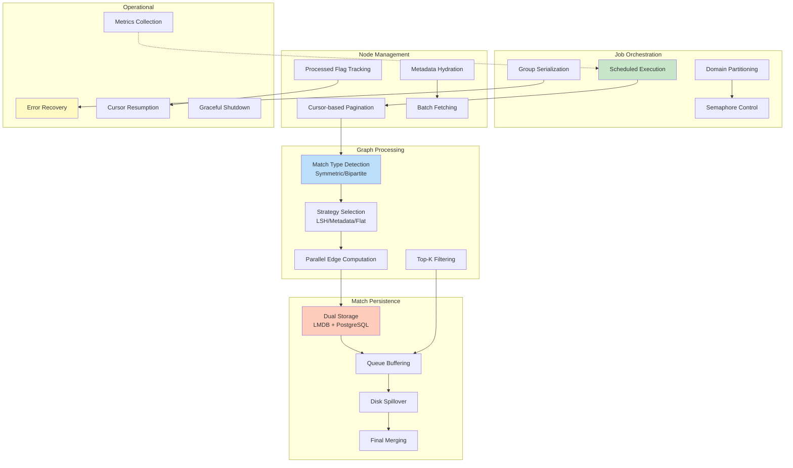

### 4.2 Processing Pipeline

```mermaid
flowchart LR
    A[Scheduled<br/>Trigger] --> B[Get Active<br/>Domains]
    B --> C[For Each<br/>Domain]
    C --> D[Get Groups<br/>per Domain]
    D --> E{Acquire<br/>Domain Sem?}
    
    E -->|Timeout| F[Skip & Log]
    E -->|Success| G[Load Cursor<br/>Position]
    
    G --> H[Fetch Node Batch<br/>1000 IDs]
    H --> I{Nodes Found?}
    
    I -->|No| J[Empty Streak++]
    J --> K{Streak >= 3?}
    K -->|Yes| L[End Group]
    K -->|No| H
    
    I -->|Yes| M[Hydrate Metadata]
    M --> N[Build Graph]
    N --> O[Compute Edges]
    O --> P[Enqueue Matches]
    
    P --> Q{Queue Full?}
    Q -->|Yes| R[Spill to Disk]
    Q -->|No| S[Keep in Memory]
    
    R --> T[Flush Batch]
    S --> T
    
    T --> U[Save to LMDB]
    T --> V[Save to PostgreSQL]
    
    U --> W[Mark Processed]
    V --> W
    W --> X[Update Cursor]
    X --> H
    
    L --> Y[Drain Queue]
    Y --> Z[Final Save<br/>LMDB → SQL]
    Z --> AA[Release Semaphore]
    AA --> AB[Next Group]
    
    style A fill:#4CAF50
    style N fill:#2196F3
    style P fill:#FF9800
    style T fill:#9C27B0
    style Z fill:#F44336
```

### 4.3 Algorithm Selection Logic

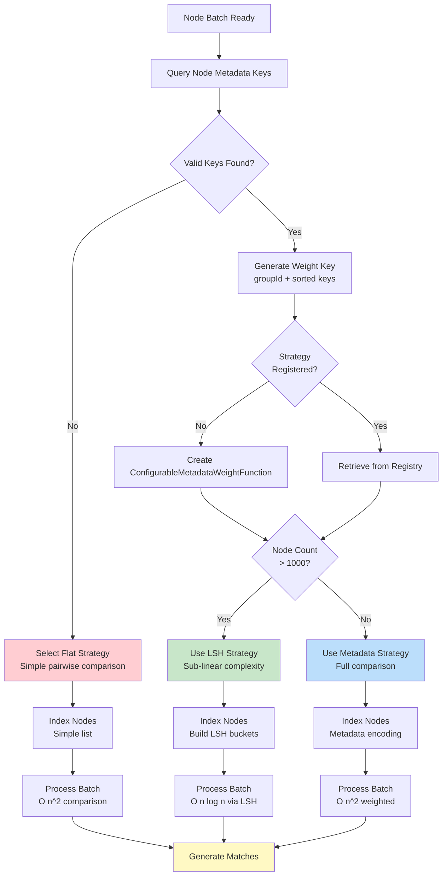

---

## 5. Non-Functional Requirements

### 5.1 Performance Requirements

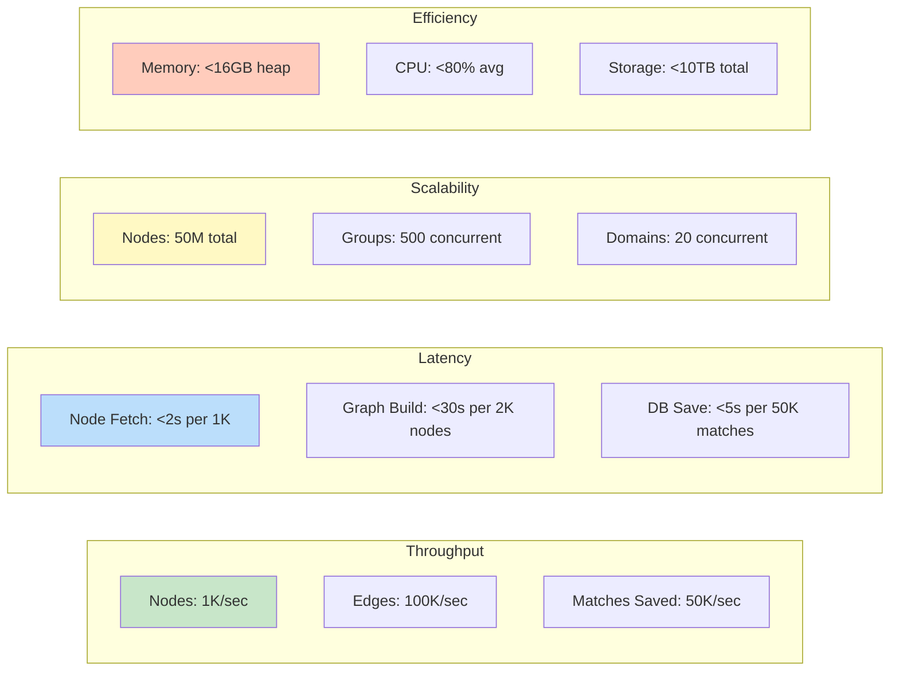

**Performance SLAs**:

| Metric | Target | Measurement | Tolerance |
|--------|--------|-------------|-----------|
| **Job Completion Time** | <15 min per group | End-to-end timer | ±20% |
| **Node Processing Rate** | ≥1000 nodes/sec | Counter/duration | ±15% |
| **Edge Computation Rate** | ≥100K edges/sec | Counter/duration | ±20% |
| **Database Write Rate** | ≥50K inserts/sec | PostgreSQL COPY | ±25% |
| **LMDB Read Latency** | <1ms p95 | Histogram | <5ms p99 |
| **Memory Utilization** | <80% heap | JVM metrics | <90% max |
| **CPU Utilization** | <70% avg | System metrics | <85% max |

### 5.2 Reliability Requirements

**Availability Target:** 99.5% monthly uptime (excluding planned maintenance)

**Failure Tolerance:**

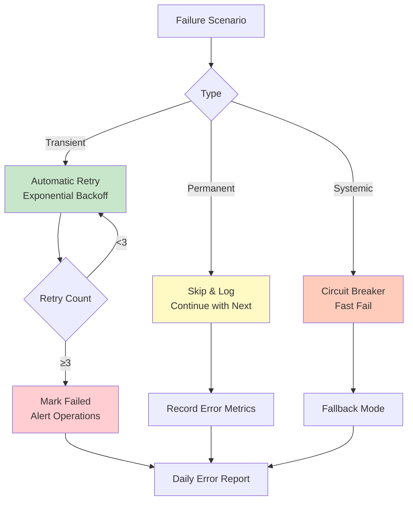

**Data Integrity:**
- ACID transactions for all database writes
- Cursor-based resumability (no data loss on failure)
- Idempotent processing (safe to rerun)
- Advisory locks prevent concurrent updates

### 5.3 Scalability Requirements

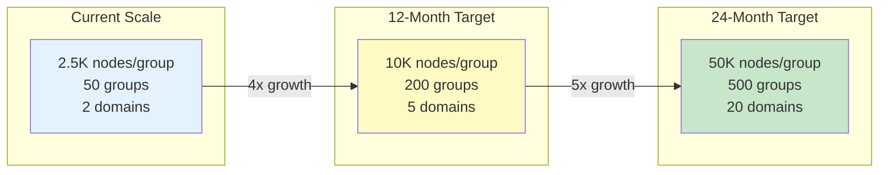

**Scalability Strategies**:

| Dimension | Current Approach | Future Enhancement |
|-----------|------------------|-------------------|
| **Vertical** | 16GB RAM, 8 CPUs | 32GB RAM, 16 CPUs |
| **Horizontal** | Active-Passive | Domain-based Partitioning |
| **Storage** | Single PostgreSQL | Read replicas + Sharding |
| **Compute** | Thread pools | Distributed workers (Kafka) |
| **Caching** | LMDB local | Distributed cache (Redis) |

### 5.4 Maintainability Requirements

- **Code Coverage:** ≥80% unit tests, ≥60% integration tests
- **Documentation:** Inline JavaDoc, README per module
- **Logging:** Structured JSON logs, correlation IDs
- **Observability:** Prometheus metrics, Grafana dashboards
- **Deployment:** Blue-green deployments, rollback capability
- **Configuration:** Externalized via Spring Cloud Config

---

## 6. Technology Stack

### 6.1 Technology Landscape

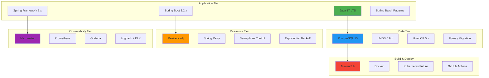

### 6.2 Technology Selection Rationale

| Technology | Purpose | Alternatives Considered | Decision Rationale |
|------------|---------|------------------------|-------------------|
| **Java 17** | Programming Language | Kotlin, Scala | LTS support, team expertise, virtual threads roadmap |
| **Spring Boot** | Application Framework | Quarkus, Micronaut | Ecosystem maturity, enterprise support, productivity |
| **PostgreSQL** | Primary Database | MySQL, Oracle | JSONB support, COPY protocol, open source |
| **LMDB** | Edge Cache | RocksDB, Redis | Memory-mapped I/O, zero-copy, embedded |
| **Resilience4j** | Fault Tolerance | Hystrix (deprecated), Sentinel | Lightweight, functional, Spring integration |
| **Micrometer** | Metrics | Dropwizard Metrics | Vendor-neutral, Spring Boot native |
| **Prometheus** | Metrics Store | InfluxDB, Datadog | Pull model, PromQL, open source |
| **Grafana** | Visualization | Kibana, Chronograf | Flexibility, plugin ecosystem, community |

### 6.3 Dependency Management

```yaml
Key Dependencies:
  Spring Boot: 3.2.x
    - spring-boot-starter-web
    - spring-boot-starter-data-jpa
    - spring-boot-starter-actuator
  
  Database:
    - postgresql: 42.7.x
    - HikariCP: 5.1.x (transitive)
    - lmdbjava: 0.9.29
  
  Resilience:
    - resilience4j-spring-boot3: 2.1.x
    - spring-retry: 2.0.x
  
  Utilities:
    - lombok: 1.18.x
    - guava: 32.x
    - caffeine: 3.1.x
  
  Testing:
    - junit-jupiter: 5.10.x
    - mockito-core: 5.x
    - testcontainers: 1.19.x
```

---

## 7. Data Architecture

### 7.1 Conceptual Data Model

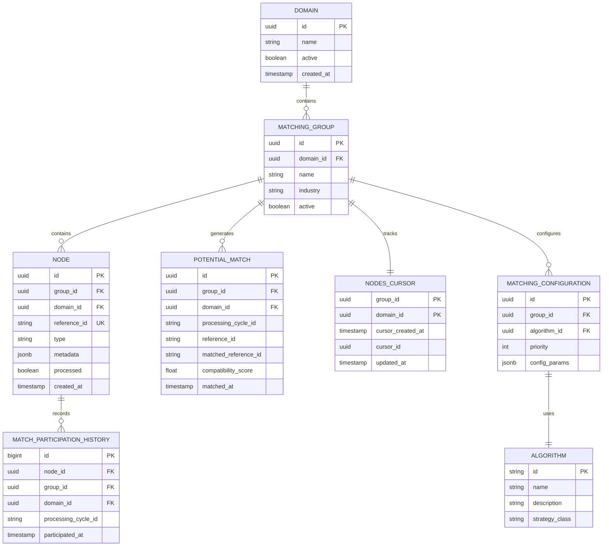

### 7.2 Data Flow Architecture

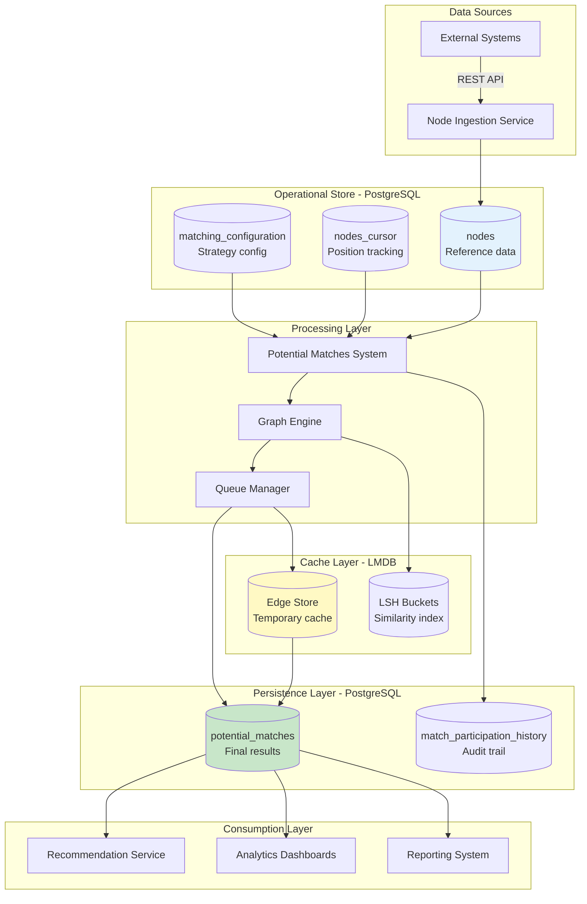

### 7.3 Data Volumes & Growth

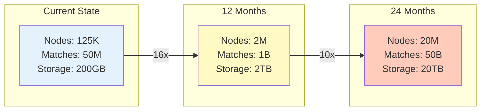

**Storage Strategy**:

| Data Type | Retention | Archival | Backup |
|-----------|-----------|----------|--------|
| **Nodes** | Indefinite | N/A | Daily full + WAL |
| **Potential Matches** | 90 days active | Annual archive | Daily incremental |
| **LMDB Edges** | 7 days | Delete on finalize | On-demand snapshot |
| **Cursor State** | Indefinite | N/A | Included in DB backup |
| **Audit Logs** | 1 year | Cold storage | Weekly |

### 7.4 Data Quality & Governance

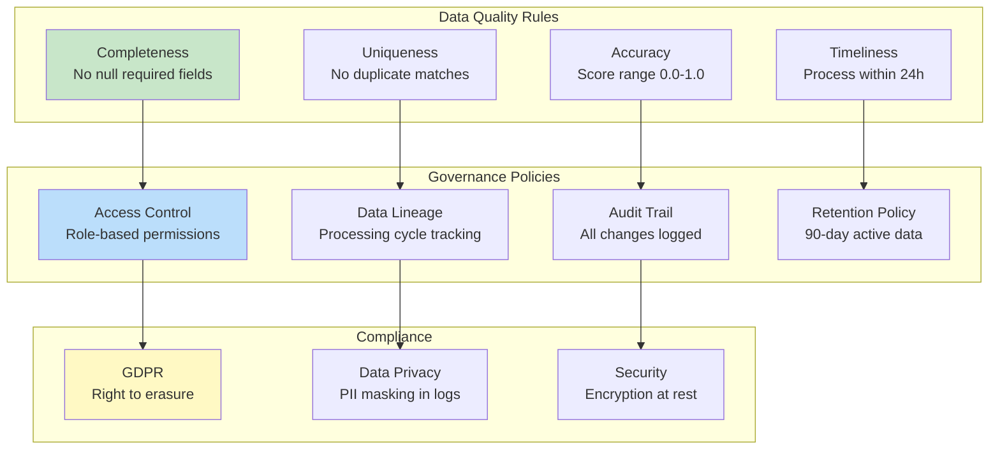

---

## 8. Integration Architecture

### 8.1 Integration Landscape

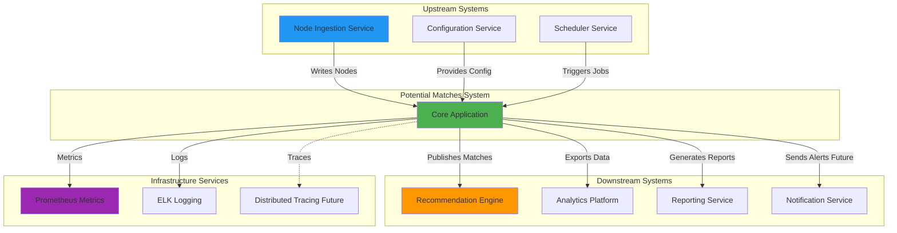

### 8.2 Integration Patterns

| Integration Point | Pattern | Protocol | Frequency |
|-------------------|---------|----------|-----------|
| **Node Ingestion → PostgreSQL** | Database Integration | JDBC | Real-time |
| **Scheduler → Application** | Event-Driven | In-process (Spring) | Daily (11:05 IST) |
| **Application → PostgreSQL** | Database Integration | JDBC + COPY | Batch (every 5 sec) |
| **Application → LMDB** | Embedded Database | Memory-mapped | Continuous |
| **Application → Prometheus** | Push/Pull | HTTP | Every 15 sec |
| **Application → Configuration** | Request-Response | HTTP/REST | On startup |
| **PostgreSQL → Analytics** | ETL | SQL Query | Hourly |

### 8.3 API Contracts

#### 8.3.1 Internal Interfaces

```java
// Node Fetch Interface
public interface NodeFetchService {
    CompletableFuture<CursorPage> fetchNodeIdsByCursor(
        UUID groupId, UUID domainId, int limit, String cycleId);
    
    CompletableFuture<List<NodeDTO>> fetchNodesInBatchesAsync(
        List<UUID> nodeIds, UUID groupId, LocalDateTime createdAfter);
    
    void markNodesAsProcessed(List<UUID> nodeIds, UUID groupId);
}

// Match Processing Interface
public interface PotentialMatchService {
    CompletableFuture<NodesCount> processNodeBatch(
        List<UUID> nodeIds, MatchingRequest request);
}

// Storage Interface
public interface PotentialMatchSaver {
    CompletableFuture<Void> saveMatchesAsync(
        List<PotentialMatchEntity> matches, 
        UUID groupId, UUID domainId, String processingCycleId, boolean finalize);
}
```

#### 8.3.2 Database Contracts

**Node Table Schema** (Version 1.0):
```sql
CREATE TABLE nodes (
    id UUID PRIMARY KEY,
    group_id UUID NOT NULL,
    domain_id UUID NOT NULL,
    reference_id VARCHAR(255) NOT NULL,
    type VARCHAR(50),
    metadata JSONB,
    processed BOOLEAN DEFAULT FALSE,
    created_at TIMESTAMP NOT NULL,
    UNIQUE(group_id, domain_id, reference_id)
);
```

**Match Table Schema** (Version 1.0):
```sql
CREATE TABLE potential_matches (
    id UUID PRIMARY KEY,
    group_id UUID NOT NULL,
    domain_id UUID NOT NULL,
    processing_cycle_id VARCHAR(255),
    reference_id VARCHAR(255) NOT NULL,
    matched_reference_id VARCHAR(255) NOT NULL,
    compatibility_score FLOAT NOT NULL,
    matched_at TIMESTAMP NOT NULL,
    UNIQUE(group_id, reference_id, matched_reference_id)
);
```

---

## 11. Scalability & Performance

### 11.1 Scalability Dimensions

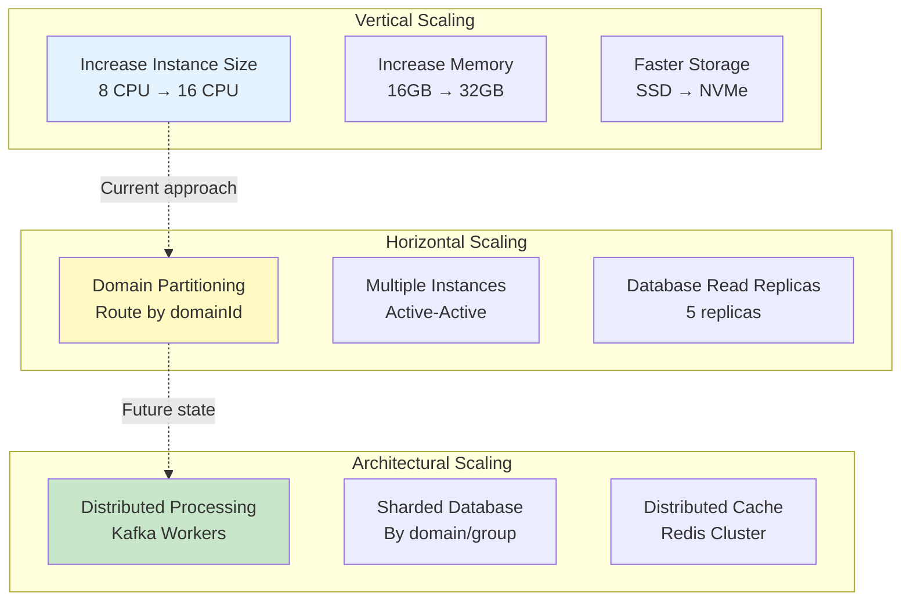

### 11.2 Performance Optimization Strategies

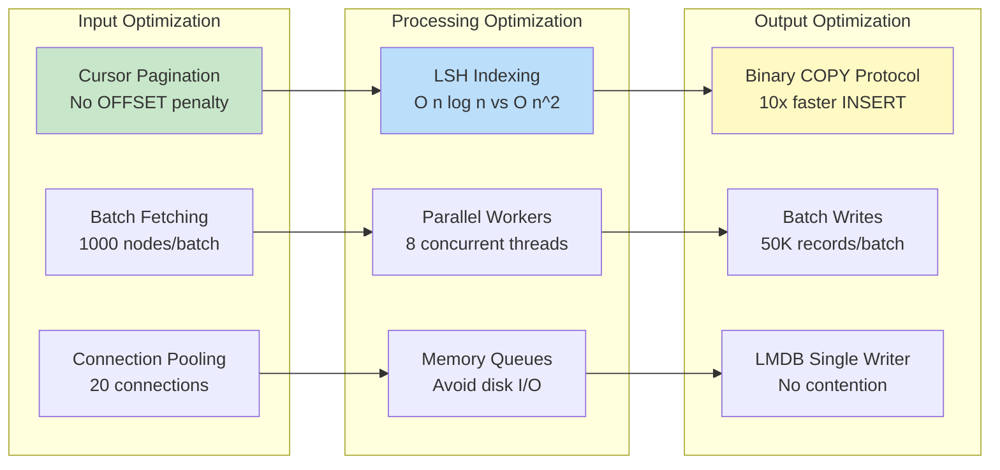

### 11.3 Scaling Roadmap

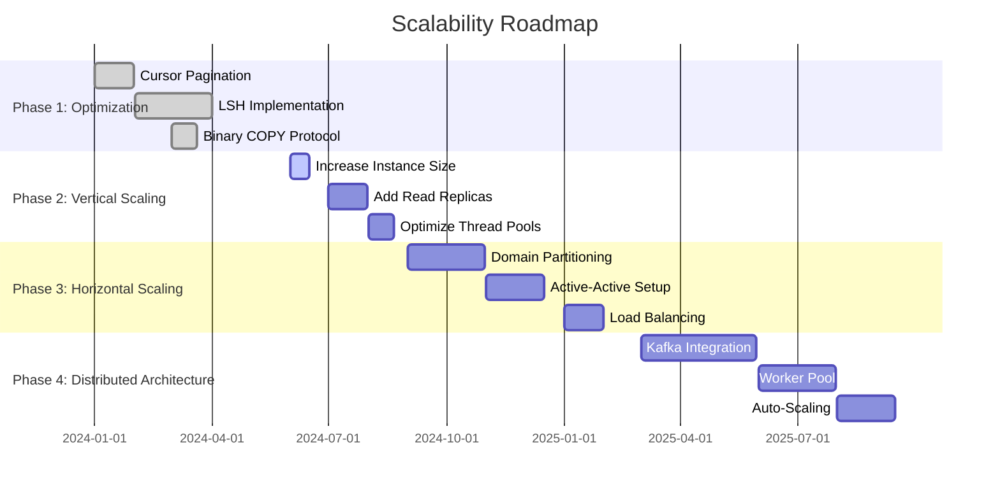

**Capacity Planning**:

| Year | Nodes/Day | Matches/Day | Storage | Infrastructure Cost |
|------|-----------|-------------|---------|-------------------|
| **Current** | 50K | 10M | 200GB | $5K/month |
| **Year 1** | 500K | 100M | 2TB | $15K/month |
| **Year 2** | 5M | 1B | 20TB | $50K/month |
| **Year 3** | 50M | 50B | 200TB | $200K/month |

---


## Appendix A: Glossary

| Term | Definition |
|------|------------|
| **Node** | An entity (user, product, resource) participating in matching |
| **Edge** | A weighted connection representing compatibility between nodes |
| **Potential Match** | A computed relationship with compatibility score |
| **Cursor** | Position marker for incremental processing |
| **Cycle ID** | Unique identifier for a processing run |
| **LSH** | Locality-Sensitive Hashing - algorithm for similarity search |
| **LMDB** | Lightning Memory-Mapped Database - embedded key-value store |
| **Semaphore** | Concurrency control mechanism limiting parallel execution |
| **Advisory Lock** | PostgreSQL application-level locking |
| **COPY Protocol** | PostgreSQL bulk data loading mechanism |

---

## Appendix B: References

**Internal Documentation**:
- Perfect Match Creation System - Low-Level Design (LLD)
- Database Schema Documentation
- API Documentation (Swagger)
- Operational Runbooks

**External References**:
- [Spring Boot Documentation](https://spring.io/projects/spring-boot)
- [PostgreSQL COPY Documentation](https://www.postgresql.org/docs/current/sql-copy.html)
- [LMDB Documentation](https://lmdb.readthedocs.io/)
- [LSH Algorithm Papers](https://en.wikipedia.org/wiki/Locality-sensitive_hashing)
- [Resilience4j Guide](https://resilience4j.readme.io/)

---


