# Potential Matches Creation System - High-Level Design Document

---

This document describes the architectural design of a batch-oriented potential-match computation pipeline developed as part of an independent backend systems project. The focus is on system structure, algorithmic flow, and correctness rather than production deployment, tuning, or capacity planning.

## Table of Contents

1. [Executive Summary](#1-executive-summary)
2. [System Architecture](#3-system-architecture)
3. [Functional Architecture](#4-functional-architecture)
4. [Technology Stack](#6-technology-stack)
5. [Data Architecture](#7-data-architecture)

---

## 1. Executive Summary

### 1.1 System Overview

The **Potential Matches Creation System** is a batch-oriented graph processing design for computing and persisting compatibility relationships between entities using strategies such as Locality-Sensitive Hashing (LSH), metadata weighting, and flat comparison.

---

## 3. System Architecture

### 3.1 Logical Architecture

---

## 4. Functional Architecture

### 4.1 Core Capabilities

### 4.2 Processing Pipeline

```mermaid
flowchart LR
    A[Scheduled<br/>Trigger] --> B[Get Active<br/>Domains]
    B --> C[For Each<br/>Domain]
    C --> D[Get Groups<br/>per Domain]
    D --> E{Acquire<br/>Domain Sem?}
    
    E -->|Timeout| F[Skip & Log]
    E -->|Success| G[Load Cursor<br/>Position]
    
    G --> H[Fetch Node Batch]
    H --> I{Nodes Found?}
    
    I -->|No| J[Empty Streak++]
    J --> K{Streak Exceeded?}
    K -->|Yes| L[End Group]
    K -->|No| H
    
    I -->|Yes| M[Hydrate Metadata]
    M --> N[Build Graph]
    N --> O[Compute Edges]
    O --> P[Enqueue Matches]
    
    P --> Q{Queue Full?}
    Q -->|Yes| R[Spill to Disk]
    Q -->|No| S[Keep in Memory]
    
    R --> T[Flush Batch]
    S --> T
    
    T --> U[Save to LMDB]
    T --> V[Save to PostgreSQL]
    
    U --> W[Mark Processed]
    V --> W
    W --> X[Update Cursor]
    X --> H
    
    L --> Y[Drain Queue]
    Y --> Z[Final Save<br/>LMDB → SQL]
    Z --> AA[Release Semaphore]
    AA --> AB[Next Group]
    
    style A fill:#4CAF50
    style N fill:#2196F3
    style P fill:#FF9800
    style T fill:#9C27B0
    style Z fill:#F44336
```

### 4.3 Algorithm Selection Logic

---

## 6. Technology Stack

### 6.1 Technology Landscape

### 6.2 Technology Selection Rationale

| Technology | Purpose | Justification |
|------------|---------|---------------|
| **Java** | Programming Language | Long-term support and ecosystem |
| **Spring Boot** | Application Framework | Enterprise features and productivity |
| **PostgreSQL** | Primary Database | ACID compliance and extensions |
| **LMDB** | Edge Cache | Memory-mapped I/O and read performance |
| **Resilience4j** | Fault Tolerance | Lightweight and comprehensive patterns |

---

## 7. Data Architecture

### 7.1 Conceptual Data Model

### 7.2 Data Flow Architecture

---

## Appendix A: Glossary

| Term | Definition |
|------|------------|
| **Node** | An entity participating in matching |
| **Edge** | A weighted connection representing compatibility between nodes |
| **Potential Match** | A computed relationship with compatibility score |
| **Cursor** | Position marker for incremental processing |
| **Cycle ID** | Unique identifier for a processing run |
| **LSH** | Locality-Sensitive Hashing - algorithm for similarity search |
| **LMDB** | Lightning Memory-Mapped Database - embedded key-value store |
| **Semaphore** | Concurrency control mechanism limiting parallel execution |
| **Advisory Lock** | Database application-level locking |
| **COPY Protocol** | PostgreSQL bulk data loading mechanism |

---

## Appendix B: References

**Design Documentation**:
- Potential Matches Creation System - Low-Level Design (LLD)
- Database Schema Documentation
- API Documentation

**External References**:
- [Spring Boot Documentation](https://spring.io/projects/spring-boot)
- [PostgreSQL COPY Documentation](https://www.postgresql.org/docs/current/sql-copy.html)
- [LMDB Documentation](https://lmdb.readthedocs.io/)
- [Locality-Sensitive Hashing](https://en.wikipedia.org/wiki/Locality-sensitive_hashing)
- [Resilience4j Guide](https://resilience4j.readme.io/)