# Potential Matches Creation System - High-Level Design Document


---

## Table of Contents

1. [Executive Summary](#1-executive-summary)
2. [Business Context](#2-business-context)
3. [System Architecture](#3-system-architecture)
4. [Functional Architecture](#4-functional-architecture)
5. [Non-Functional Requirements](#5-non-functional-requirements)
6. [Technology Stack](#6-technology-stack)
7. [Data Architecture](#7-data-architecture)
8. [Integration Architecture](#8-integration-architecture)
9. [Deployment Architecture](#9-deployment-architecture)
10. [Security Architecture](#10-security-architecture)
11. [Scalability & Performance](#11-scalability--performance)
12. [Disaster Recovery & Business Continuity](#12-disaster-recovery--business-continuity)
13. [Monitoring & Operations](#13-monitoring--operations)
14. [Migration & Rollout Strategy](#14-migration--rollout-strategy)
15. [Cost Analysis](#15-cost-analysis)
16. [Future Roadmap](#16-future-roadmap)

---

## 1. Executive Summary

### 1.1 System Overview

The **Potential Matches Creation System** is an enterprise-grade graph processing platform designed to compute and persist compatibility relationships between entities at scale. The system processes millions of nodes daily, generating match recommendations using sophisticated algorithms including LSH (Locality-Sensitive Hashing), metadata-based weighting, and flat comparison strategies.

### 1.2 Business Value Proposition


### 1.3 Key Metrics

| Metric | Current Capacity | Target (12 months) | Strategic Goal (24 months) |
|--------|------------------|-------------------|---------------------------|
| **Nodes Processed/Day** | 50K | 500K | 5M |
| **Match Computations/Sec** | 100K | 500K | 2M |
| **Processing Latency** | 15 min/group | <10 min/group | <5 min/group |
| **System Availability** | 99.5% | 99.9% | 99.99% |
| **Concurrent Domains** | 2 | 5 | 20 |
| **Storage Footprint** | 200GB | 2TB | 20TB |

### 1.4 Strategic Alignment


---

## 2. Business Context

### 2.1 Problem Statement

Organizations managing large networks of entities (users, products, resources) face critical challenges:

**Current Pain Points:**
- **Manual Matching**: Requires significant human effort, error-prone
- **Scalability Bottleneck**: Cannot handle exponential growth in entities
- **Latency Issues**: Days/weeks to compute matches for large datasets
- **Inconsistent Quality**: Varying match quality across different operators
- **Cost Inefficiency**: High operational costs for manual processes

**Business Impact:**
- Lost revenue opportunities due to delayed matches
- Poor user experience from irrelevant recommendations
- High operational costs (~$500K annually for manual matching)
- Competitive disadvantage in time-to-market

### 2.2 Solution Approach


### 2.3 Use Cases

#### UC-1: Daily Batch Matching
**Actor:** System Scheduler  
**Trigger:** Cron schedule (11:05 IST daily)  
**Flow:**
1. System identifies active domains and groups
2. For each group, fetch unprocessed nodes
3. Build graph and compute edges
4. Persist matches to dual storage
5. Update processing status and cursor

**Success Criteria:** All eligible groups processed within 4-hour window

#### UC-2: Incremental Node Processing
**Actor:** Data Ingestion Service  
**Trigger:** New nodes added to domain  
**Flow:**
1. System tracks last processed cursor position
2. Fetch only nodes created after cursor
3. Compute matches for new nodes
4. Update cursor to new position

**Success Criteria:** Only new data processed, no duplication

#### UC-3: Multi-Strategy Matching
**Actor:** Business Configuration  
**Trigger:** Group-specific strategy selection  
**Flow:**
1. System analyzes node metadata structure
2. Select appropriate strategy (LSH/Metadata/Flat)
3. Apply strategy to compute compatibility scores
4. Persist scored matches

**Success Criteria:** Optimal algorithm applied per group

### 2.4 Business Rules

| Rule ID | Description | Priority | Enforcement |
|---------|-------------|----------|-------------|
| BR-1 | Only process nodes where `processed=false` | P0 | Database query filter |
| BR-2 | Maintain cursor position for resumability | P0 | Transaction-scoped persistence |
| BR-3 | Prevent duplicate matches for same pair | P0 | Database unique constraint |
| BR-4 | Skip groups with zero new nodes | P1 | Service-level logic |
| BR-5 | Limit concurrent domain processing | P1 | Semaphore control (2 permits) |
| BR-6 | Apply backpressure when queue full | P2 | Disk spillover mechanism |

---

## 3. System Architecture

### 3.1 Architectural Style

**Primary Style:** Event-Driven Batch Processing  
**Secondary Patterns:** Microkernel, Pipes-and-Filters


### 3.2 Logical Architecture


### 3.3 Component Architecture


---

## 4. Functional Architecture

### 4.1 Core Capabilities


### 4.2 Processing Pipeline

```mermaid
flowchart LR
    A[Scheduled<br/>Trigger] --> B[Get Active<br/>Domains]
    B --> C[For Each<br/>Domain]
    C --> D[Get Groups<br/>per Domain]
    D --> E{Acquire<br/>Domain Sem?}
    
    E -->|Timeout| F[Skip & Log]
    E -->|Success| G[Load Cursor<br/>Position]
    
    G --> H[Fetch Node Batch<br/>1000 IDs]
    H --> I{Nodes Found?}
    
    I -->|No| J[Empty Streak++]
    J --> K{Streak >= 3?}
    K -->|Yes| L[End Group]
    K -->|No| H
    
    I -->|Yes| M[Hydrate Metadata]
    M --> N[Build Graph]
    N --> O[Compute Edges]
    O --> P[Enqueue Matches]
    
    P --> Q{Queue Full?}
    Q -->|Yes| R[Spill to Disk]
    Q -->|No| S[Keep in Memory]
    
    R --> T[Flush Batch]
    S --> T
    
    T --> U[Save to LMDB]
    T --> V[Save to PostgreSQL]
    
    U --> W[Mark Processed]
    V --> W
    W --> X[Update Cursor]
    X --> H
    
    L --> Y[Drain Queue]
    Y --> Z[Final Save<br/>LMDB → SQL]
    Z --> AA[Release Semaphore]
    AA --> AB[Next Group]
    
    style A fill:#4CAF50
    style N fill:#2196F3
    style P fill:#FF9800
    style T fill:#9C27B0
    style Z fill:#F44336
```



### 4.3 Algorithm Selection Logic


---

## 5. Non-Functional Requirements

### 5.1 Performance Requirements


**Performance SLAs**:

| Metric | Target | Measurement | Tolerance |
|--------|--------|-------------|-----------|
| **Job Completion Time** | <15 min per group | End-to-end timer | ±20% |
| **Node Processing Rate** | ≥1000 nodes/sec | Counter/duration | ±15% |
| **Edge Computation Rate** | ≥100K edges/sec | Counter/duration | ±20% |
| **Database Write Rate** | ≥50K inserts/sec | PostgreSQL COPY | ±25% |
| **LMDB Read Latency** | <1ms p95 | Histogram | <5ms p99 |
| **Memory Utilization** | <80% heap | JVM metrics | <90% max |
| **CPU Utilization** | <70% avg | System metrics | <85% max |

### 5.2 Reliability Requirements

**Availability Target:** 99.5% monthly uptime (excluding planned maintenance)

**Failure Tolerance:**

```mermaid
graph TB
    A[Failure Scenario] --> B{Type}
    
    B -->|Transient| C[Automatic Retry<br/>Exponential Backoff]
    B -->|Permanent| D[Skip & Log<br/>Continue with Next]
    B -->|Systemic| E[Circuit Breaker<br/>Fast Fail]
    
    C --> F{Retry Count}
    F -->|<3| C
    F -->|≥3| G[Mark Failed<br/>Alert Operations]
    
    D --> H[Record Error Metrics]
    E --> I[Fallback Mode]
    
    G --> J[Daily Error Report]
    H --> J
    I --> J
    
    style C fill:#C8E6C9
    style D fill:#FFF9C4
    style E fill:#FFCCBC
    style G fill:#FFCDD2
```



**Data Integrity:**
- ACID transactions for all database writes
- Cursor-based resumability (no data loss on failure)
- Idempotent processing (safe to rerun)
- Advisory locks prevent concurrent updates

### 5.3 Scalability Requirements


**Scalability Strategies**:

| Dimension | Current Approach | Future Enhancement |
|-----------|------------------|-------------------|
| **Vertical** | 16GB RAM, 8 CPUs | 32GB RAM, 16 CPUs |
| **Horizontal** | Active-Passive | Domain-based Partitioning |
| **Storage** | Single PostgreSQL | Read replicas + Sharding |
| **Compute** | Thread pools | Distributed workers (Kafka) |
| **Caching** | LMDB local | Distributed cache (Redis) |

### 5.4 Maintainability Requirements

- **Code Coverage:** ≥80% unit tests, ≥60% integration tests
- **Documentation:** Inline JavaDoc, README per module
- **Logging:** Structured JSON logs, correlation IDs
- **Observability:** Prometheus metrics, Grafana dashboards
- **Deployment:** Blue-green deployments, rollback capability
- **Configuration:** Externalized via Spring Cloud Config

---

## 6. Technology Stack

### 6.1 Technology Landscape


### 6.2 Technology Selection Rationale

| Technology | Purpose | Alternatives Considered | Decision Rationale |
|------------|---------|------------------------|-------------------|
| **Java 17** | Programming Language | Kotlin, Scala | LTS support, team expertise, virtual threads roadmap |
| **Spring Boot** | Application Framework | Quarkus, Micronaut | Ecosystem maturity, enterprise support, productivity |
| **PostgreSQL** | Primary Database | MySQL, Oracle | JSONB support, COPY protocol, open source |
| **LMDB** | Edge Cache | RocksDB, Redis | Memory-mapped I/O, zero-copy, embedded |
| **Resilience4j** | Fault Tolerance | Hystrix (deprecated), Sentinel | Lightweight, functional, Spring integration |
| **Micrometer** | Metrics | Dropwizard Metrics | Vendor-neutral, Spring Boot native |
| **Prometheus** | Metrics Store | InfluxDB, Datadog | Pull model, PromQL, open source |
| **Grafana** | Visualization | Kibana, Chronograf | Flexibility, plugin ecosystem, community |

### 6.3 Dependency Management

```yaml
Key Dependencies:
  Spring Boot: 3.2.x
    - spring-boot-starter-web
    - spring-boot-starter-data-jpa
    - spring-boot-starter-actuator
  
  Database:
    - postgresql: 42.7.x
    - HikariCP: 5.1.x (transitive)
    - lmdbjava: 0.9.29
  
  Resilience:
    - resilience4j-spring-boot3: 2.1.x
    - spring-retry: 2.0.x
  
  Utilities:
    - lombok: 1.18.x
    - guava: 32.x
    - caffeine: 3.1.x
  
  Testing:
    - junit-jupiter: 5.10.x
    - mockito-core: 5.x
    - testcontainers: 1.19.x
```

---

## 7. Data Architecture

### 7.1 Conceptual Data Model


### 7.2 Data Flow Architecture


### 7.3 Data Volumes & Growth


**Storage Strategy**:

| Data Type | Retention | Archival | Backup |
|-----------|-----------|----------|--------|
| **Nodes** | Indefinite | N/A | Daily full + WAL |
| **Potential Matches** | 90 days active | Annual archive | Daily incremental |
| **LMDB Edges** | 7 days | Delete on finalize | On-demand snapshot |
| **Cursor State** | Indefinite | N/A | Included in DB backup |
| **Audit Logs** | 1 year | Cold storage | Weekly |

### 7.4 Data Quality & Governance


---

## 8. Integration Architecture

### 8.1 Integration Landscape


### 8.2 Integration Patterns

| Integration Point | Pattern | Protocol | Frequency |
|-------------------|---------|----------|-----------|
| **Node Ingestion → PostgreSQL** | Database Integration | JDBC | Real-time |
| **Scheduler → Application** | Event-Driven | In-process (Spring) | Daily (11:05 IST) |
| **Application → PostgreSQL** | Database Integration | JDBC + COPY | Batch (every 5 sec) |
| **Application → LMDB** | Embedded Database | Memory-mapped | Continuous |
| **Application → Prometheus** | Push/Pull | HTTP | Every 15 sec |
| **Application → Configuration** | Request-Response | HTTP/REST | On startup |
| **PostgreSQL → Analytics** | ETL | SQL Query | Hourly |

### 8.3 API Contracts

#### 8.3.1 Internal Interfaces

```java
// Node Fetch Interface
public interface NodeFetchService {
    CompletableFuture<CursorPage> fetchNodeIdsByCursor(
        UUID groupId, UUID domainId, int limit, String cycleId);
    
    CompletableFuture<List<NodeDTO>> fetchNodesInBatchesAsync(
        List<UUID> nodeIds, UUID groupId, LocalDateTime createdAfter);
    
    void markNodesAsProcessed(List<UUID> nodeIds, UUID groupId);
}

// Match Processing Interface
public interface PotentialMatchService {
    CompletableFuture<NodesCount> processNodeBatch(
        List<UUID> nodeIds, MatchingRequest request);
}

// Storage Interface
public interface PotentialMatchSaver {
    CompletableFuture<Void> saveMatchesAsync(
        List<PotentialMatchEntity> matches, 
        UUID groupId, UUID domainId, String processingCycleId, boolean finalize);
}
```

#### 8.3.2 Database Contracts

**Node Table Schema** (Version 1.0):
```sql
CREATE TABLE nodes (
    id UUID PRIMARY KEY,
    group_id UUID NOT NULL,
    domain_id UUID NOT NULL,
    reference_id VARCHAR(255) NOT NULL,
    type VARCHAR(50),
    metadata JSONB,
    processed BOOLEAN DEFAULT FALSE,
    created_at TIMESTAMP NOT NULL,
    UNIQUE(group_id, domain_id, reference_id)
);
```

**Match Table Schema** (Version 1.0):
```sql
CREATE TABLE potential_matches (
    id UUID PRIMARY KEY,
    group_id UUID NOT NULL,
    domain_id UUID NOT NULL,
    processing_cycle_id VARCHAR(255),
    reference_id VARCHAR(255) NOT NULL,
    matched_reference_id VARCHAR(255) NOT NULL,
    compatibility_score FLOAT NOT NULL,
    matched_at TIMESTAMP NOT NULL,
    UNIQUE(group_id, reference_id, matched_reference_id)
);
```

---

## 9. Deployment Architecture

### 9.1 Deployment Topology


### 9.2 Infrastructure Requirements

#### 9.2.1 Compute Resources

| Environment | Instance Type | CPU | Memory | Storage | Instances |
|-------------|--------------|-----|--------|---------|-----------|
| **Production** | c6i.2xlarge | 8 vCPUs | 16GB | 200GB SSD | 2 (active-passive) |
| **Staging** | c6i.xlarge | 4 vCPUs | 8GB | 100GB SSD | 1 |
| **Development** | t3.large | 2 vCPUs | 8GB | 50GB SSD | 1 |

#### 9.2.2 Database Resources

| Component | Instance Type | CPU | Memory | Storage | IOPS |
|-----------|--------------|-----|--------|---------|------|
| **PostgreSQL Primary** | db.r6g.2xlarge | 8 vCPUs | 64GB | 1TB NVMe | 20K |
| **PostgreSQL Standby** | db.r6g.2xlarge | 8 vCPUs | 64GB | 1TB NVMe | 20K |
| **LMDB** | Local SSD | N/A | 16GB mapped | 200GB NVMe | 50K |

### 9.3 Deployment Diagram


### 9.4 Deployment Strategy

```mermaid
graph TB
    A[Code Commit] --> B[CI Pipeline<br/>GitHub Actions]
    B --> C[Build & Test<br/>Maven + JUnit]
    C --> D[Docker Build<br/>Create Image]
    D --> E[Push to Registry<br/>ECR/Docker Hub]
    
    E --> F{Environment}
    
    F -->|Dev| G[Auto Deploy<br/>No Approval]
    F -->|Staging| H[Manual Approval<br/>QA Team]
    F -->|Production| I[Blue-Green Deploy<br/>Ops Team]
    
    G --> J[Health Check]
    H --> J
    I --> J
    
    J -->|Pass| K[Traffic Switch<br/>Update LB]
    J -->|Fail| L[Rollback<br/>Previous Version]
    
    K --> M[Smoke Tests]
    M -->|Pass| N[Deployment Complete]
    M -->|Fail| L
    
    L --> O[Alert Team]
    
    style A fill:#4CAF50
    style I fill:#FF9800
    style K fill:#2196F3
    style L fill:#F44336
```


---

## 10. Security Architecture

### 10.1 Security Layers

```mermaid
graph TB
    subgraph "Network Security"
        N1[VPC Isolation<br/>10.0.0.0/16]
        N2[Security Groups<br/>Port-level ACLs]
        N3[Network ACLs<br/>Subnet-level]
        N4[TLS 1.3<br/>All external traffic]
    end
    
    subgraph "Application Security"
        A1[Authentication<br/>IAM Roles]
        A2[Authorization<br/>RBAC]
        A3[Input Validation<br/>Bean Validation]
        A4[Secrets Management<br/>AWS Secrets Manager]
    end
    
    subgraph "Data Security"
        D1[Encryption at Rest<br/>AES-256]
        D2[Encryption in Transit<br/>TLS 1.3]
        D3[Data Masking<br/>PII in logs]
        D4[Access Logging<br/>Audit trail]
    end
    
    subgraph "Infrastructure Security"
        I1[OS Hardening<br/>CIS Benchmarks]
        I2[Patch Management<br/>Monthly updates]
        I3[Vulnerability Scanning<br/>Snyk + OWASP]
        I4[SIEM Integration<br/>AWS GuardDuty]
    end
    
    N1 --> A1
    A1 --> D1
    D1 --> I1
    
    style N1 fill:#FFCDD2
    style A1 fill:#F8BBD0
    style D1 fill:#E1BEE7
    style I1 fill:#C5CAE9
```

### 10.2 Security Controls

| Control | Implementation | Status | Priority |
|---------|----------------|--------|----------|
| **Authentication** | AWS IAM roles for EC2 instances | ✅ Implemented | P0 |
| **Authorization** | PostgreSQL role-based access | ✅ Implemented | P0 |
| **Encryption at Rest** | RDS encryption + LMDB file permissions | ✅ Implemented | P0 |
| **Encryption in Transit** | TLS 1.3 for DB connections | 📋 Planned | P1 |
| **Secrets Management** | AWS Secrets Manager integration | ✅ Implemented | P0 |
| **Audit Logging** | PostgreSQL audit log + application logs | ✅ Implemented | P1 |
| **Vulnerability Scanning** | Snyk + OWASP Dependency Check | ✅ Implemented | P1 |
| **Penetration Testing** | Annual third-party assessment | 📋 Scheduled Q3 | P2 |
| **Data Masking** | PII redaction in logs | ✅ Implemented | P1 |
| **Network Isolation** | VPC with private subnets | ✅ Implemented | P0 |

### 10.3 Threat Model

```mermaid
graph LR
    subgraph "Threats"
        T1[SQL Injection]
        T2[Unauthorized Access]
        T3[Data Breach]
        T4[Denial of Service]
        T5[Insider Threat]
    end
    
    subgraph "Mitigations"
        M1[JPA Parameterized Queries]
        M2[Network Isolation + IAM]
        M3[Encryption + Access Logs]
        M4[Rate Limiting + Semaphores]
        M5[Audit Logs + Least Privilege]
    end
    
    T1 -->|Mitigated by| M1
    T2 -->|Mitigated by| M2
    T3 -->|Mitigated by| M3
    T4 -->|Mitigated by| M4
    T5 -->|Mitigated by| M5
    
    style T1 fill:#FFCDD2
    style M1 fill:#C8E6C9
```

**Risk Assessment**:

| Threat | Likelihood | Impact | Risk Level | Mitigation Priority |
|--------|-----------|--------|------------|-------------------|
| SQL Injection | Low | High | Medium | P1 - JPA protects |
| Unauthorized Access | Medium | High | High | P0 - Implemented |
| Data Breach | Low | Critical | High | P0 - Encryption enabled |
| Denial of Service | Medium | Medium | Medium | P1 - Semaphores + rate limiting |
| Insider Threat | Low | High | Medium | P2 - Audit logs |
| Supply Chain Attack | Medium | High | High | P1 - Dependency scanning |

---

## 11. Scalability & Performance

### 11.1 Scalability Dimensions

```mermaid
graph TB
    subgraph "Vertical Scaling"
        V1[Increase Instance Size<br/>8 CPU → 16 CPU]
        V2[Increase Memory<br/>16GB → 32GB]
        V3[Faster Storage<br/>SSD → NVMe]
    end
    
    subgraph "Horizontal Scaling"
        H1[Domain Partitioning<br/>Route by domainId]
        H2[Multiple Instances<br/>Active-Active]
        H3[Database Read Replicas<br/>5 replicas]
    end
    
    subgraph "Architectural Scaling"
        A1[Distributed Processing<br/>Kafka Workers]
        A2[Sharded Database<br/>By domain/group]
        A3[Distributed Cache<br/>Redis Cluster]
    end
    
    V1 -.->|Current approach| H1
    H1 -.->|Future state| A1
    
    style V1 fill:#E3F2FD
    style H1 fill:#FFF9C4
    style A1 fill:#C8E6C9
```

### 11.2 Performance Optimization Strategies

```mermaid
graph LR
    subgraph "Input Optimization"
        I1[Cursor Pagination<br/>No OFFSET penalty]
        I2[Batch Fetching<br/>1000 nodes/batch]
        I3[Connection Pooling<br/>20 connections]
    end
    
    subgraph "Processing Optimization"
        P1[LSH Indexing<br/>O n log n vs O n^2]
        P2[Parallel Workers<br/>8 concurrent threads]
        P3[Memory Queues<br/>Avoid disk I/O]
    end
    
    subgraph "Output Optimization"
        O1[Binary COPY Protocol<br/>10x faster INSERT]
        O2[Batch Writes<br/>50K records/batch]
        O3[LMDB Single Writer<br/>No contention]
    end
    
    I1 --> P1
    I2 --> P2
    I3 --> P3
    P1 --> O1
    P2 --> O2
    P3 --> O3
    
    style I1 fill:#C8E6C9
    style P1 fill:#BBDEFB
    style O1 fill:#FFF9C4
```

### 11.3 Scaling Roadmap

```mermaid
gantt
    title Scalability Roadmap
    dateFormat YYYY-MM-DD
    
    section Phase 1: Optimization
    Cursor Pagination          :done, p1-1, 2024-01-01, 30d
    LSH Implementation         :done, p1-2, 2024-02-01, 60d
    Binary COPY Protocol       :done, p1-3, 2024-03-01, 20d
    
    section Phase 2: Vertical Scaling
    Increase Instance Size     :active, p2-1, 2024-06-01, 15d
    Add Read Replicas          :p2-2, 2024-07-01, 30d
    Optimize Thread Pools      :p2-3, 2024-08-01, 20d
    
    section Phase 3: Horizontal Scaling
    Domain Partitioning        :p3-1, 2024-09-01, 60d
    Active-Active Setup        :p3-2, 2024-11-01, 45d
    Load Balancing             :p3-3, 2025-01-01, 30d
    
    section Phase 4: Distributed Architecture
    Kafka Integration          :p4-1, 2025-03-01, 90d
    Worker Pool                :p4-2, 2025-06-01, 60d
    Auto-Scaling               :p4-3, 2025-08-01, 45d
```

**Capacity Planning**:

| Year | Nodes/Day | Matches/Day | Storage | Infrastructure Cost |
|------|-----------|-------------|---------|-------------------|
| **Current** | 50K | 10M | 200GB | $5K/month |
| **Year 1** | 500K | 100M | 2TB | $15K/month |
| **Year 2** | 5M | 1B | 20TB | $50K/month |
| **Year 3** | 50M | 50B | 200TB | $200K/month |

---

## 12. Disaster Recovery & Business Continuity

### 12.1 Backup Strategy

```mermaid
graph TB
    subgraph "Backup Types"
        B1[PostgreSQL WAL<br/>Continuous]
        B2[PostgreSQL Snapshot<br/>Daily]
        B3[LMDB Snapshot<br/>On-demand]
        B4[Application Config<br/>Git-versioned]
    end
    
    subgraph "Retention"
        R1[WAL: 7 days]
        R2[Daily: 30 days]
        R3[Weekly: 6 months]
        R4[Monthly: 2 years]
    end
    
    subgraph "Recovery Objectives"
        O1[RTO: <1 hour]
        O2[RPO: <5 minutes]
    end
    
    B1 --> R1
    B2 --> R2
    B2 --> R3
    B2 --> R4
    
    R1 --> O2
    R2 --> O1
    
    style B1 fill:#C8E6C9
    style O1 fill:#FFCCBC
```

| Component | Frequency | Retention | Recovery Time Objective (RTO) | Recovery Point Objective (RPO) |
|-----------|-----------|-----------|-------------------------------|-------------------------------|
| **PostgreSQL WAL** | Continuous | 7 days | <1 hour | <5 minutes |
| **PostgreSQL Snapshot** | Daily 2 AM | 30 days | <2 hours | <24 hours |
| **LMDB Data** | On-demand | 7 days | <4 hours | <7 days (regenerable) |
| **Application Config** | Git commit | Indefinite | <15 minutes | 0 (versioned) |
| **Metrics/Logs** | N/A (ephemeral) | 30 days | N/A | N/A |

### 12.2 Disaster Recovery Scenarios

```mermaid
flowchart TD
    A[Incident Detected] --> B{Severity}
    
    B -->|P0 - Critical| C1[Complete System Failure]
    B -->|P1 - High| C2[Database Corruption]
    B -->|P2 - Medium| C3[Performance Degradation]
    B -->|P3 - Low| C4[Minor Error Spike]
    
    C1 --> D1[Activate DR Site<br/>Promote Standby]
    D1 --> D2[Update DNS<br/>Route Traffic]
    D2 --> D3[Verify Functionality]
    D3 --> E1[Resume Operations]
    
    C2 --> F1[Stop Writes<br/>Isolate Issue]
    F1 --> F2[Restore from Backup<br/>Point-in-time Recovery]
    F2 --> F3[Replay WAL Logs]
    F3 --> F4[Verify Data Integrity]
    F4 --> E1
    
    C3 --> G1[Scale Resources<br/>Add Capacity]
    G1 --> G2[Optimize Queries<br/>Add Indexes]
    G2 --> E1
    
    C4 --> H1[Monitor & Log]
    H1 --> E1
    
    E1 --> I[Post-Mortem Analysis]
    
    style C1 fill:#FFCDD2
    style E1 fill:#C8E6C9
```

### 12.3 Business Continuity Plan

**Failover Procedures**:

1. **Database Failover** (RTO: 60 minutes)
    - Detect primary failure via health check timeout
    - Promote standby to primary using `pg_ctl promote`
    - Update application connection string
    - Restart application instances
    - Verify replication lag = 0
    - Initiate post-mortem

2. **Application Failover** (RTO: 15 minutes)
    - Detect instance failure via health check
    - Route traffic to standby instance
    - Investigate root cause
    - Repair primary instance
    - Plan switchback during maintenance window

3. **Data Center Failover** (RTO: 2 hours)
    - Activate secondary data center
    - Restore from cross-region backup
    - Update DNS records
    - Verify all services operational
    - Communicate to stakeholders

**Communication Plan**:

| Stakeholder | Notification Method | SLA |
|-------------|-------------------|-----|
| **Engineering Team** | PagerDuty + Slack | Immediate |
| **Operations** | Email + SMS | <15 min |
| **Product Management** | Email | <1 hour |
| **Customers** | Status page | <2 hours |
| **Executive Leadership** | Email + Call | <4 hours |

---

## 13. Monitoring & Operations

### 13.1 Observability Stack

```mermaid
graph TB
    subgraph "Application"
        APP[Potential Matches System]
    end
    
    subgraph "Metrics Pipeline"
        APP -->|Micrometer| M1[Prometheus]
        M1 --> M2[Grafana Dashboards]
        M1 --> M3[Alertmanager]
        M3 -->|Email/Slack| M4[On-Call Engineer]
        M3 -->|PagerDuty| M5[Incident Response]
    end
    
    subgraph "Logging Pipeline"
        APP -->|Logback| L1[Filebeat]
        L1 --> L2[Logstash]
        L2 --> L3[Elasticsearch]
        L3 --> L4[Kibana]
    end
    
    subgraph "Tracing Pipeline Future"
        APP -.->|OpenTelemetry| T1[Jaeger]
        T1 -.-> T2[Trace Analysis UI]
    end
    
    subgraph "Health Checks"
        APP -->|/actuator/health| H1[Spring Boot Actuator]
        H1 --> H2[Load Balancer]
        H1 --> H3[Monitoring System]
    end
    
    style APP fill:#4CAF50
    style M1 fill:#FF9800
    style L3 fill:#2196F3
    style T1 fill:#9C27B0
```

### 13.2 Key Metrics Dashboard

```mermaid
graph LR
    subgraph "Business Metrics"
        BM1[Matches Created/Day<br/>Target: >10M]
        BM2[Job Success Rate<br/>Target: >95%]
        BM3[Processing Duration<br/>Target: <15 min]
    end
    
    subgraph "Technical Metrics"
        TM1[Node Processing Rate<br/>Target: >1K/sec]
        TM2[Edge Computation Rate<br/>Target: >100K/sec]
        TM3[DB Write TPS<br/>Target: >50K/sec]
    end
    
    subgraph "Operational Metrics"
        OM1[Error Rate<br/>Target: <5%]
        OM2[Queue Depth<br/>Target: <500K]
        OM3[Memory Usage<br/>Target: <80%]
    end
    
    subgraph "Infrastructure Metrics"
        IM1[CPU Utilization<br/>Target: <70%]
        IM2[DB Connection Pool<br/>Target: <80%]
        IM3[LMDB Read Latency<br/>Target: <1ms p95]
    end
    
    style BM1 fill:#C8E6C9
    style TM1 fill:#BBDEFB
    style OM1 fill:#FFF9C4
    style IM1 fill:#FFCCBC
```

### 13.3 Alert Hierarchy

| Alert | Threshold | Severity | Notification | SLA |
|-------|-----------|----------|--------------|-----|
| **System Down** | Health check fails 3x | P0 - Critical | Page on-call immediately | <5 min |
| **High Error Rate** | >10% errors over 5 min | P1 - High | Slack + Email | <15 min |
| **Processing Timeout** | Job duration >60 min | P1 - High | Slack + Email | <30 min |
| **Memory Pressure** | Heap usage >90% | P1 - High | Slack + Email | <15 min |
| **DB Connection Pool** | Active >95% | P1 - High | Slack + Email | <10 min |
| **Queue Overflow** | Rejected >100 over 1 min | P2 - Medium | Slack | <1 hour |
| **Slow Queries** | >5 queries >10 sec | P2 - Medium | Slack | <2 hours |
| **Disk Space** | >85% used | P3 - Low | Email | Next day |

### 13.4 Operational Runbooks

**Runbook: High Error Rate**

```
Title: High Error Rate Alert (>10% errors)
Severity: P1
Expected Response Time: <15 minutes

Steps:
1. Check Grafana dashboard for error breakdown
2. Query Kibana for recent error logs
3. Identify error pattern (SQL, timeout, NPE, etc.)
4. Check recent deployments (last 24 hours)
5. If deployment-related: Initiate rollback
6. If infrastructure: Check DB/LMDB health
7. If data: Identify problematic group/domain
8. Apply mitigation (skip group, scale resources)
9. Create incident ticket
10. Monitor recovery
11. Schedule post-mortem
```

---

## 14. Migration & Rollout Strategy

### 14.1 Migration Phases

```mermaid
gantt
    title System Migration & Rollout Timeline
    dateFormat YYYY-MM-DD
    
    section Phase 1: Foundation
    Infrastructure Setup         :done, p1-1, 2024-01-01, 30d
    Database Schema Migration    :done, p1-2, 2024-01-15, 20d
    LMDB Integration            :done, p1-3, 2024-02-01, 25d
    
    section Phase 2: Core Development
    Graph Processing Engine      :done, p2-1, 2024-02-15, 45d
    Dual Persistence Layer       :done, p2-2, 2024-03-15, 30d
    Queue Management             :done, p2-3, 2024-04-01, 20d
    
    section Phase 3: Testing & Validation
    Unit Testing                 :done, p3-1, 2024-04-15, 15d
    Integration Testing          :done, p3-2, 2024-05-01, 20d
    Performance Testing          :done, p3-3, 2024-05-15, 15d
    User Acceptance Testing      :done, p3-4, 2024-06-01, 10d
    
    section Phase 4: Production Rollout
    Staging Deployment           :done, p4-1, 2024-06-10, 10d
    Production Pilot (10%)       :active, p4-2, 2024-06-20, 15d
    Production Expansion (50%)   :p4-3, 2024-07-05, 20d
    Full Production (100%)       :p4-4, 2024-07-25, 15d
    
    section Phase 5: Optimization
    Monitoring & Tuning          :p5-1, 2024-08-10, 30d
    Documentation                :p5-2, 2024-08-10, 20d
    Knowledge Transfer           :p5-3, 2024-09-01, 15d
```

### 14.2 Rollout Strategy

```mermaid
flowchart LR
    A[Development] -->|Tested & Approved| B[Staging]
    B -->|Load Testing Passed| C{Phased Rollout}
    
    C -->|Week 1| D1[Pilot: 10% Traffic<br/>5 Groups]
    C -->|Week 2| D2[25% Traffic<br/>15 Groups]
    C -->|Week 3| D3[50% Traffic<br/>30 Groups]
    C -->|Week 4| D4[100% Traffic<br/>All Groups]
    
    D1 --> E{Metrics OK?}
    E -->|Yes| D2
    E -->|No| F[Rollback]
    
    D2 --> G{Metrics OK?}
    G -->|Yes| D3
    G -->|No| F
    
    D3 --> H{Metrics OK?}
    H -->|Yes| D4
    H -->|No| F
    
    D4 --> I[Full Production]
    F --> J[Root Cause Analysis]
    J --> A
    
    style D4 fill:#C8E6C9
    style I fill:#4CAF50
    style F fill:#FFCDD2
```

**Rollout Criteria**:

| Phase | Groups | Success Criteria | Rollback Trigger |
|-------|--------|------------------|------------------|
| **Pilot (10%)** | 5 low-risk groups | Error rate <5%, Duration <20 min | Error rate >10% |
| **Expansion (25%)** | 15 groups | All pilot criteria maintained | Error rate >8% |
| **Scale (50%)** | 30 groups | Throughput >50K matches/min | Duration >25 min |
| **Full (100%)** | All groups | System availability >99% | Critical failures |

### 14.3 Rollback Plan

**Rollback Triggers**:
- Error rate exceeds 10% for 10 consecutive minutes
- Processing time exceeds 2x baseline
- Data corruption detected
- Critical bugs discovered in production

**Rollback Procedure** (15-minute SLA):
```
1. Alert team (Immediate)
2. Stop scheduler on new version
3. Route traffic to previous version
4. Verify previous version health
5. Mark current nodes as unprocessed
6. Reset cursor to last known good position
7. Analyze failure logs
8. Plan remediation
9. Schedule retry after fix
```

---

## 15. Cost Analysis

### 15.1 Total Cost of Ownership (TCO)

```mermaid
pie title Monthly Infrastructure Cost Breakdown ($15K)
    "Compute (EC2)" : 4000
    "Database (RDS)" : 6000
    "Storage (EBS/S3)" : 2000
    "Networking (Data Transfer)" : 1000
    "Monitoring (CloudWatch)" : 500
    "Backup & DR" : 1000
    "Support & Operations" : 500
```

**Cost Projection**:

| Component | Current (Month) | Year 1 | Year 2 | Year 3 |
|-----------|----------------|--------|--------|--------|
| **Compute** | $4K | $8K | $20K | $50K |
| **Database** | $6K | $12K | $30K | $80K |
| **Storage** | $2K | $5K | $15K | $40K |
| **Networking** | $1K | $2K | $5K | $15K |
| **Monitoring** | $500 | $1K | $3K | $8K |
| **Backup & DR** | $1K | $2K | $5K | $12K |
| **Support** | $500 | $1K | $2K | $5K |
| **Total** | **$15K** | **$31K** | **$80K** | **$210K** |


---

## 16. Future Roadmap

### 16.1 Strategic Roadmap

```mermaid
timeline
    title System Evolution Roadmap
    
    Q3 2024 : Current State
            : Batch Processing
            : LMDB + PostgreSQL
            : 50K nodes/day
    
    Q4 2024 : Performance Optimization
            : LSH Tuning
            : Connection Pool Optimization
            : Monitoring Enhancements
    
    Q1 2025 : Horizontal Scaling
            : Domain Partitioning
            : Active-Active Setup
            : Read Replicas (5x)
    
    Q2 2025 : Real-time Matching
            : Kafka Integration
            : Stream Processing
            : Sub-second latency
    
    Q3 2025 : ML Integration
            : Embedding-based Matching
            : Reinforcement Learning
            : Auto-tuning Algorithms
    
    Q4 2025 : Global Distribution
            : Multi-region Deployment
            : CDN Integration
            : Edge Computing
```

### 16.2 Feature Roadmap

| Quarter | Feature | Business Value | Complexity |
|---------|---------|----------------|------------|
| **Q3 2024** | API for Manual Triggers | On-demand processing | Low |
| **Q4 2024** | Advanced Metrics Dashboard | Better observability | Low |
| **Q1 2025** | Real-time Match Updates | Immediate results | High |
| **Q2 2025** | ML-based Scoring | Improved quality | High |
| **Q3 2025** | GraphQL Query API | Flexible data access | Medium |
| **Q4 2025** | Multi-tenant Support | SaaS offering | Very High |

### 16.3 Technical Debt & Improvements

```mermaid
graph TB
    subgraph "Current Technical Debt"
        D1[Monolithic Codebase<br/>Split into modules]
        D2[Limited Test Coverage<br/>Increase to 90%]
        D3[Manual Deployment<br/>Full CI/CD]
        D4[Single-region<br/>Multi-region DR]
    end
    
    subgraph "Planned Improvements"
        I1[Microservices Architecture]
        I2[Contract Testing]
        I3[GitOps Deployment]
        I4[Active-Active Multi-region]
    end
    
    D1 -.->|Q1 2025| I1
    D2 -.->|Q4 2024| I2
    D3 -.->|Q3 2024| I3
    D4 -.->|Q2 2025| I4
    
    style D1 fill:#FFCDD2
    style I1 fill:#C8E6C9
```

---

## Appendix A: Glossary

| Term | Definition |
|------|------------|
| **Node** | An entity (user, product, resource) participating in matching |
| **Edge** | A weighted connection representing compatibility between nodes |
| **Potential Match** | A computed relationship with compatibility score |
| **Cursor** | Position marker for incremental processing |
| **Cycle ID** | Unique identifier for a processing run |
| **LSH** | Locality-Sensitive Hashing - algorithm for similarity search |
| **LMDB** | Lightning Memory-Mapped Database - embedded key-value store |
| **Semaphore** | Concurrency control mechanism limiting parallel execution |
| **Advisory Lock** | PostgreSQL application-level locking |
| **COPY Protocol** | PostgreSQL bulk data loading mechanism |

---

## Appendix B: References

**Internal Documentation**:
- Perfect Match Creation System - Low-Level Design (LLD)
- Database Schema Documentation
- API Documentation (Swagger)
- Operational Runbooks

**External References**:
- [Spring Boot Documentation](https://spring.io/projects/spring-boot)
- [PostgreSQL COPY Documentation](https://www.postgresql.org/docs/current/sql-copy.html)
- [LMDB Documentation](https://lmdb.readthedocs.io/)
- [LSH Algorithm Papers](https://en.wikipedia.org/wiki/Locality-sensitive_hashing)
- [Resilience4j Guide](https://resilience4j.readme.io/)

---

## Appendix C: Change Log

| Version | Date | Author | Changes |
|---------|------|--------|---------|
| 0.1 | 2024-01-15 | Architecture Team | Initial draft |
| 0.5 | 2024-03-01 | Architecture Team | Added deployment architecture |
| 0.8 | 2024-05-15 | Architecture Team | Performance testing results |
| 1.0 | 2024-06-12 | Architecture Team | Production-ready approval |

---

