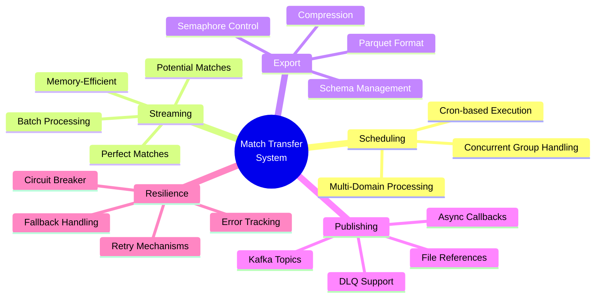
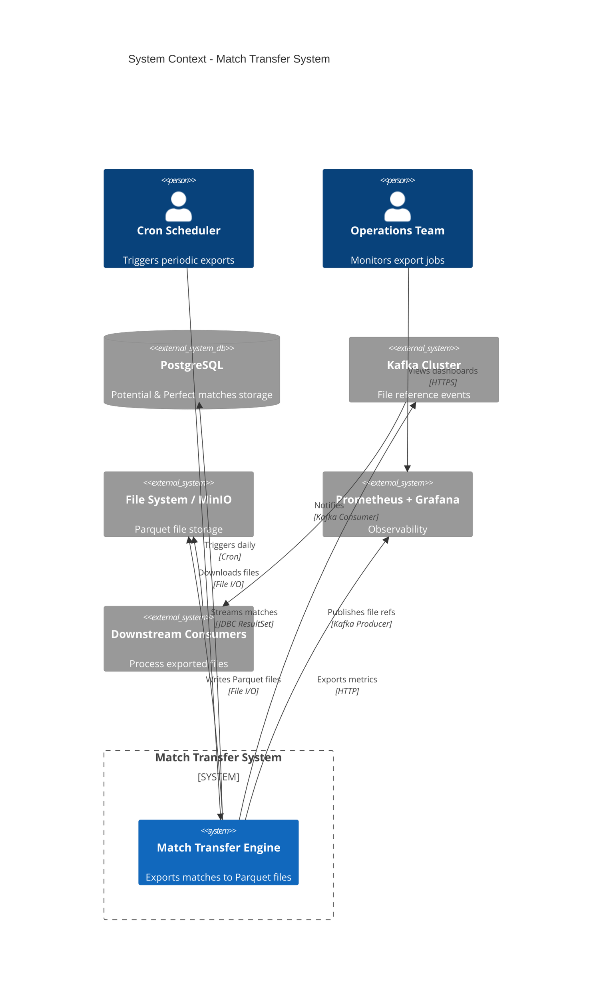
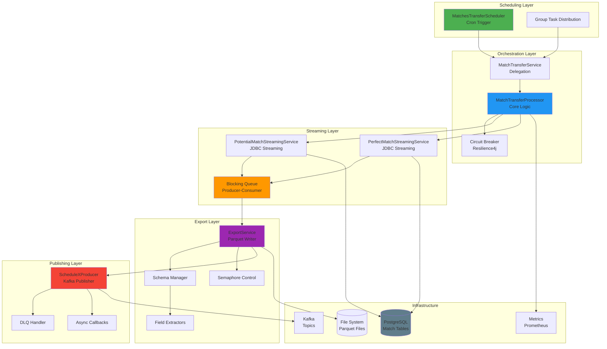
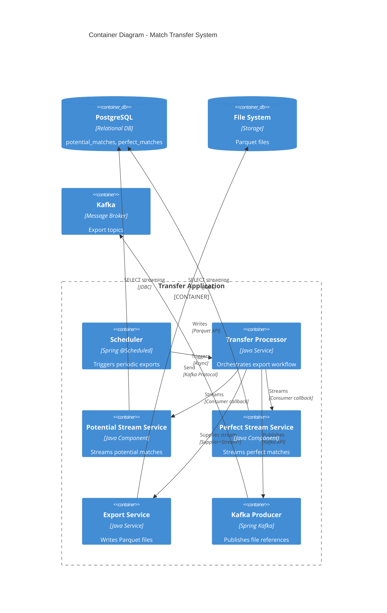
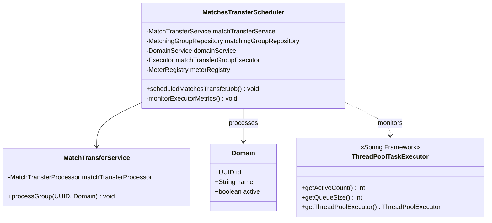
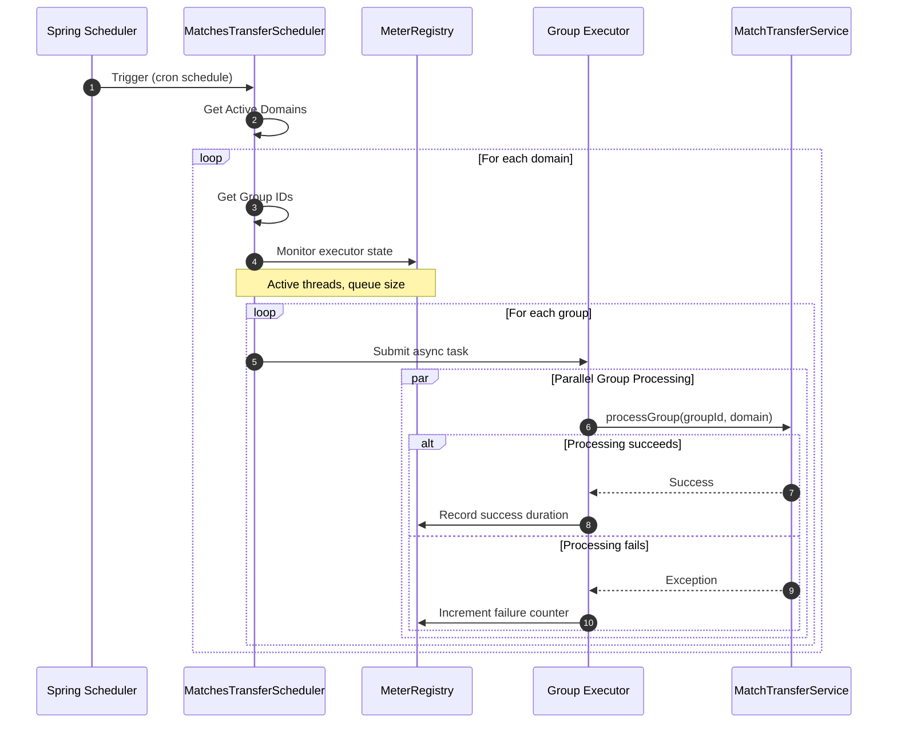
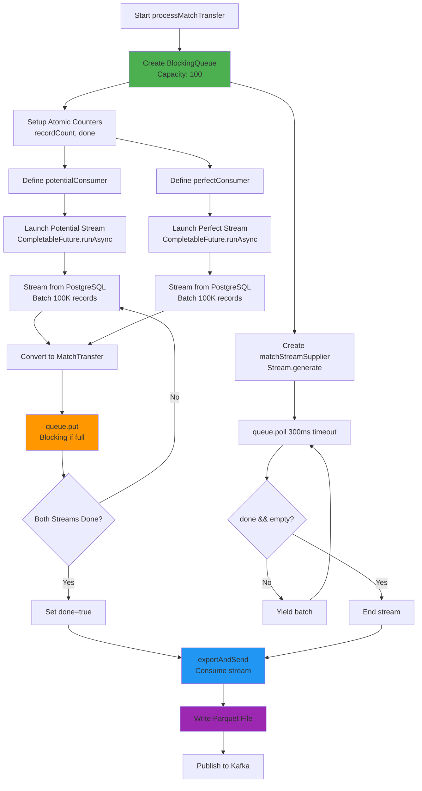
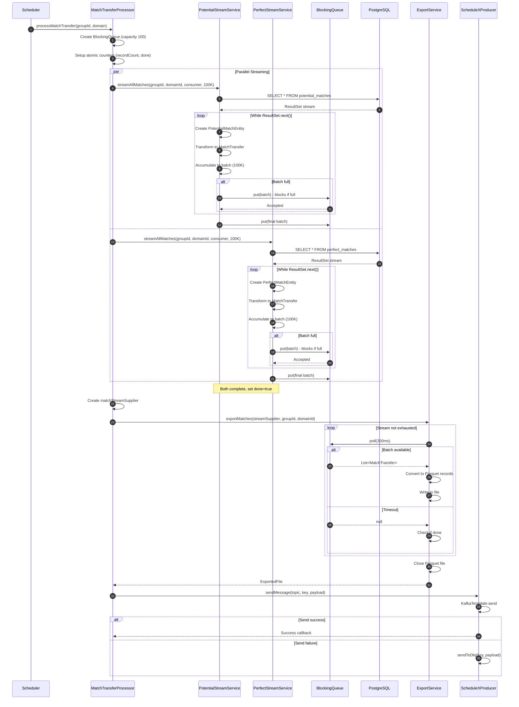
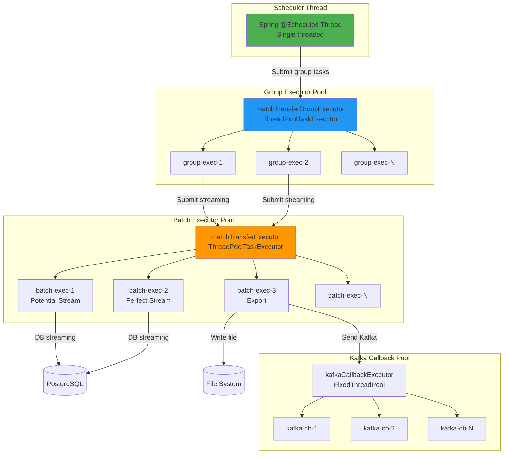

# Match Transfer System - Low-Level Design Document


---

## Table of Contents

1. [System Overview](#1-system-overview)
2. [Architecture Design](#2-architecture-design)
3. [Component Design](#3-component-design)
4. [Data Flow Architecture](#4-data-flow-architecture)
5. [Concurrency & Threading Model](#5-concurrency--threading-model)
6. [Streaming Architecture](#6-streaming-architecture)
7. [Export & File Processing](#7-export--file-processing)
8. [Kafka Integration](#8-kafka-integration)
9. [Error Handling & Resilience](#9-error-handling--resilience)
10. [Performance Optimization](#10-performance-optimization)
11. [Monitoring & Observability](#11-monitoring--observability)

---

## 1. System Overview

### 1.1 Purpose

The **Match Transfer System** is a scheduled batch export platform that streams match results (potential and perfect matches) from PostgreSQL, exports them to Parquet files, and publishes file references to Kafka topics. It supports multi-tenant processing with concurrent group execution, memory-efficient streaming, and comprehensive error handling.

### 1.2 Key Capabilities



### 1.3 System Metrics

| Metric | Target | Current Capacity |
|--------|--------|------------------|
| **Throughput** | 100K matches/sec | 50K matches/sec |
| **Export Time** | <5 min for 10M matches | ~3 min |
| **Memory Footprint** | <2GB per group | ~1.5GB |
| **Concurrent Groups** | 50 simultaneous | 20 tested |
| **File Compression Ratio** | 10:1 (Parquet SNAPPY) | 8:1 |
| **Kafka Publishing Rate** | 100 msg/sec | 80 msg/sec |

---

## 2. Architecture Design

### 2.1 System Context Diagram



### 2.2 Logical Architecture



### 2.3 Component Architecture



---

## 3. Component Design

### 3.1 Scheduler Component



**Scheduler Flow**:



### 3.2 Transfer Processor Component

```mermaid
classDiagram
    class MatchTransferProcessor {
        -PotentialMatchStreamingService potentialMatchStreamingService
        -PerfectMatchStreamingService perfectMatchStreamingService
        -ExportService exportService
        -ScheduleXProducer scheduleXProducer
        -Executor matchTransferExecutor
        -int batchSize
        +processMatchTransfer(UUID, Domain) CompletableFuture~Void~
        -exportAndSend(UUID, Domain, Supplier) CompletableFuture~Void~
        -exportAndSendSync(UUID, Domain, Supplier) void
        +processMatchTransferFallback(UUID, Domain, Throwable) CompletableFuture~Void~
    }
    
    class CircuitBreaker {
        <<annotation>>
        +name: String
        +fallbackMethod: String
    }
    
    class Retryable {
        <<annotation>>
        +value: Class[]
        +maxAttempts: int
        +backoff: Backoff
    }
    
    class BlockingQueue~List~MatchTransfer~~ {
        <<Java Concurrency>>
        +put(List) void
        +poll(long, TimeUnit) List
    }
    
    MatchTransferProcessor ..> CircuitBreaker
    MatchTransferProcessor ..> Retryable
    MatchTransferProcessor --> BlockingQueue : uses
```

**Producer-Consumer Pattern**:



---

## 4. Data Flow Architecture

### 4.1 End-to-End Data Flow

```mermaid
flowchart TB
    subgraph "1. Initialization"
        A1[Cron Trigger<br/>scheduled time]
        A2[Get Active Domains]
        A3[Get Groups per Domain]
    end
    
    subgraph "2. Concurrent Group Processing"
        B1[For each group<br/>Submit to Executor]
        B2[Circuit Breaker Check]
        B3[Create BlockingQueue<br/>Capacity 100]
    end
    
    subgraph "3. Parallel Streaming"
        C1[Potential Stream Thread]
        C2[Perfect Stream Thread]
        
        C1 --> C3[SELECT * FROM potential_matches<br/>WHERE group_id=? AND domain_id=?]
        C2 --> C4[SELECT * FROM perfect_matches<br/>WHERE group_id=? AND domain_id=?]
        
        C3 --> C5[ResultSet.next<br/>Batch 100K]
        C4 --> C6[ResultSet.next<br/>Batch 100K]
        
        C5 --> C7[Convert to Entity]
        C6 --> C7
        
        C7 --> C8[Transform to MatchTransfer]
        C8 --> C9[queue.put]
    end
    
    subgraph "4. Stream Generation"
        D1[matchStreamSupplier]
        D2[Stream.generate<br/>poll from queue]
        D3[takeWhile !done && !empty]
        D4[flatMap batches]
    end
    
    subgraph "5. Export Processing"
        E1[ParquetWriter.write]
        E2[Schema Validation]
        E3[Field Extraction]
        E4[Compression SNAPPY]
        E5[File: /basedir/domainId/groupId/file.parquet]
    end
    
    subgraph "6. Kafka Publishing"
        F1[Build MatchSuggestionsExchange]
        F2[Topic: domain-matches-suggestions]
        F3[Key: domainId-groupId]
        F4[KafkaTemplate.send]
        F5{Send Success?}
        F5 -->|No| F6[Send to DLQ]
        F5 -->|Yes| F7[Record Metrics]
    end
    
    A1 --> A2
    A2 --> A3
    A3 --> B1
    B1 --> B2
    B2 --> B3
    
    B3 --> C1
    B3 --> C2
    
    C9 --> D1
    D1 --> D2
    D2 --> D3
    D3 --> D4
    
    D4 --> E1
    E1 --> E2
    E2 --> E3
    E3 --> E4
    E4 --> E5
    
    E5 --> F1
    F1 --> F2
    F2 --> F3
    F3 --> F4
    F4 --> F5
    
    style A1 fill:#E8F5E9
    style C9 fill:#FFF9C4
    style E1 fill:#E1F5FE
    style F4 fill:#FFEBEE
```



### 4.2 Detailed Sequence Diagram



---

## 5. Concurrency & Threading Model

### 5.1 Thread Pool Architecture

