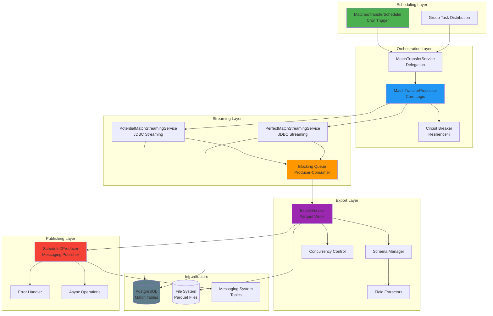
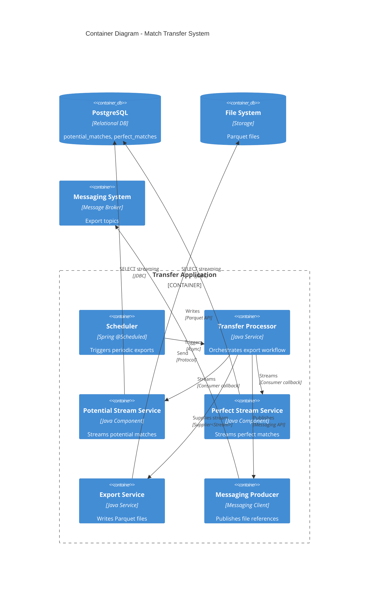
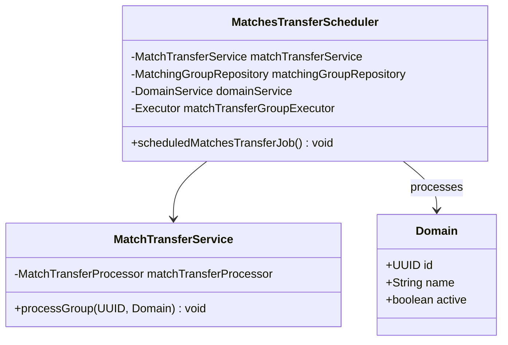
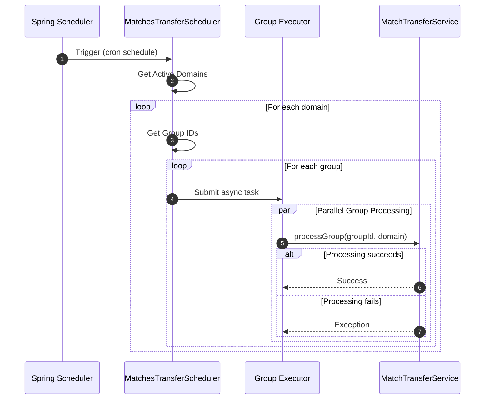
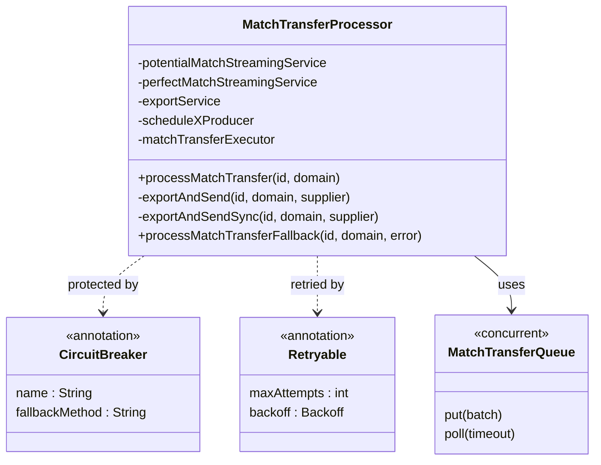
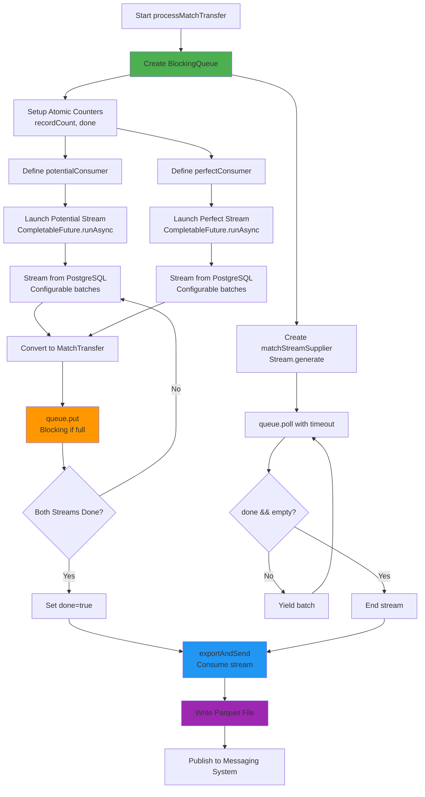
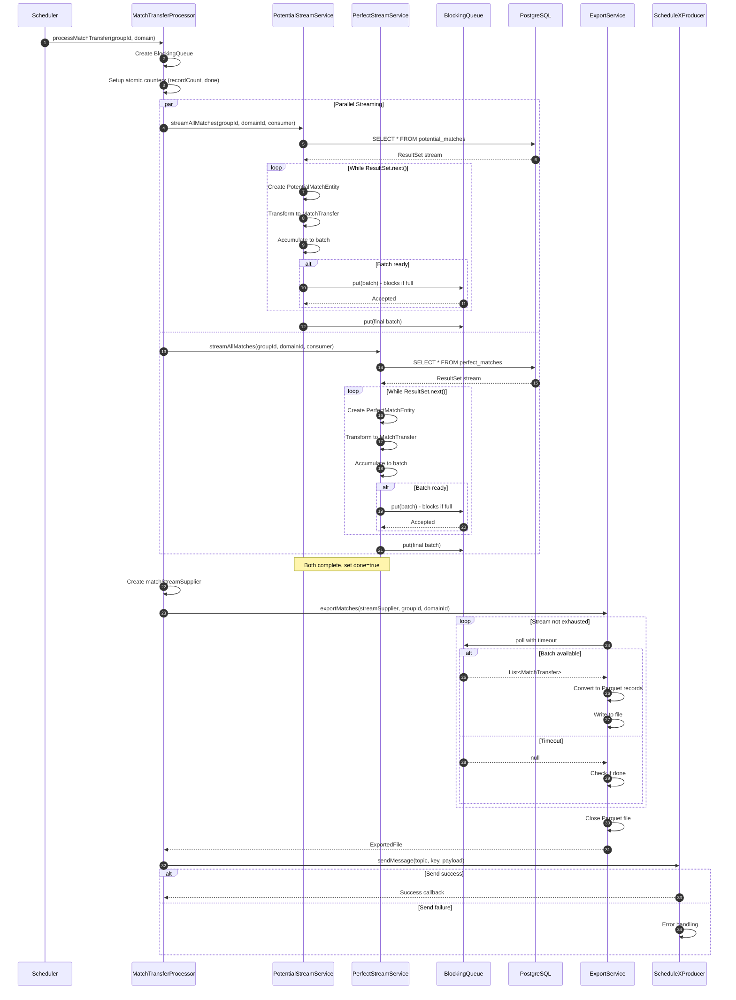

# Match Transfer System - Low-Level Design Document

---

This document describes the low-level design and reference implementation of a batch-oriented match export pipeline, focusing on correctness, data flow, and concurrency patterns rather than production deployment or operational tuning.

## Table of Contents

1. [System Overview](#1-system-overview)
2. [Architecture Design](#2-architecture-design)
3. [Component Design](#3-component-design)
4. [Data Flow Architecture](#4-data-flow-architecture)

---

## 1. System Overview

### 1.1 Purpose

The **Match Transfer System** is a scheduled batch export component that streams match results (potential and perfect matches) from PostgreSQL, exports them to Parquet files, and publishes file references to messaging topics. It supports group-isolated batch processing with fault handling.

### 1.2 Key Capabilities

```mermaid
graph TB
    ROOT[Match Transfer System]

    ROOT --> S[Scheduling]
    ROOT --> ST[Streaming]
    ROOT --> E[Export]
    ROOT --> P[Publishing]
    ROOT --> R[Resilience]

    S --> S1[Cron Based Execution]
    S --> S2[Multi Domain Processing]
    S --> S3[Concurrent Group Handling]

    ST --> ST1[Potential Matches Stream]
    ST --> ST2[Perfect Matches Stream]
    ST --> ST3[Memory Efficient Processing]
    ST --> ST4[Batch Processing]

    E --> E1[Parquet Format]
    E --> E2[Compression]
    E --> E3[Schema Management]
    E --> E4[Concurrency Control]

    P --> P1[Messaging Topics]
    P --> P2[File References]
    P --> P3[Error Handling]
    P --> P4[Async Operations]

    R --> R1[Circuit Breaker]
    R --> R2[Retry Mechanisms]
    R --> R3[Fallback Handling]
    R --> R4[Error Tracking]

```

---

## 2. Architecture Design

### 2.1 Logical Architecture

### 2.2 Component Architecture

---

## 3. Component Design

### 3.1 Scheduler Component

**Scheduler Flow**:

### 3.2 Transfer Processor Component

**Producer-Consumer Pattern**:

---

## 4. Data Flow Architecture

### 4.1 End-to-End Data Flow

```mermaid
flowchart TB
    subgraph "1. Initialization"
        A1[Cron Trigger<br/>scheduled time]
        A2[Get Active Domains]
        A3[Get Groups per Domain]
    end
    
    subgraph "2. Concurrent Group Processing"
        B1[For each group<br/>Submit to Executor]
        B2[Circuit Breaker Check]
        B3[Create BlockingQueue]
    end
    
    subgraph "3. Parallel Streaming"
        C1[Potential Stream Thread]
        C2[Perfect Stream Thread]
        
        C1 --> C3[SELECT * FROM potential_matches<br/>WHERE group_id=? AND domain_id=?]
        C2 --> C4[SELECT * FROM perfect_matches<br/>WHERE group_id=? AND domain_id=?]
        
        C3 --> C5[ResultSet.next<br/>Configurable batches]
        C4 --> C6[ResultSet.next<br/>Configurable batches]
        
        C5 --> C7[Convert to Entity]
        C6 --> C7
        
        C7 --> C8[Transform to MatchTransfer]
        C8 --> C9[queue.put]
    end
    
    subgraph "4. Stream Generation"
        D1[matchStreamSupplier]
        D2[Stream.generate<br/>poll from queue]
        D3[takeWhile !done && !empty]
        D4[flatMap batches]
    end
    
    subgraph "5. Export Processing"
        E1[ParquetWriter.write]
        E2[Schema Validation]
        E3[Field Extraction]
        E4[Compression]
        E5[File path based on identifiers]
    end
    
    subgraph "6. Messaging Publishing"
        F1[Build Message Payload]
        F2[Topic based on identifiers]
        F3[Key based on identifiers]
        F4[Send Message]
        F5{Send Success?}
        F5 -->|No| F6[Error Handling]
        F5 -->|Yes| F7[Completion]
    end
    
    A1 --> A2
    A2 --> A3
    A3 --> B1
    B1 --> B2
    B2 --> B3
    
    B3 --> C1
    B3 --> C2
    
    C9 --> D1
    D1 --> D2
    D2 --> D3
    D3 --> D4
    
    D4 --> E1
    E1 --> E2
    E2 --> E3
    E3 --> E4
    E4 --> E5
    
    E5 --> F1
    F1 --> F2
    F2 --> F3
    F3 --> F4
    F4 --> F5
    
    style A1 fill:#E8F5E9
    style C9 fill:#FFF9C4
    style E1 fill:#E1F5FE
    style F4 fill:#FFEBEE
```

### 4.2 Detailed Sequence Diagram

