# Nodes Import Module — Low‑Level Design (LLD) with Diagrams

## Table of Contents
- [1. Modules and Relationships](#1-modules-and-relationships)
- [2. Runtime Topology (Threads, Queues, Semaphores)](#2-runtime-topology-threads-queues-semaphores)
- [3. Detailed Component Specs](#3-detailed-component-specs)
- [4. Data Model](#4-data-model)
- [5. Key Algorithms and Pseudocode](#5-key-algorithms-and-pseudocode)
- [6. Error Handling, Timeouts, Retries](#6-error-handling-timeouts-retries)
- [7. Metrics and Logging](#7-metrics-and-logging)
- [8. Configuration Matrix](#8-configuration-matrix)
- [9. Sequences](#9-sequences)
- [10. External Contracts and Assumptions](#10-external-contracts-and-assumptions)
- [11. Known Risks and Recommendations](#11-known-risks-and-recommendations)
- [12. Testing Strategy (Pointers)](#12-testing-strategy-pointers)

---

## 1. Modules and Relationships

### Module Relationship Diagram
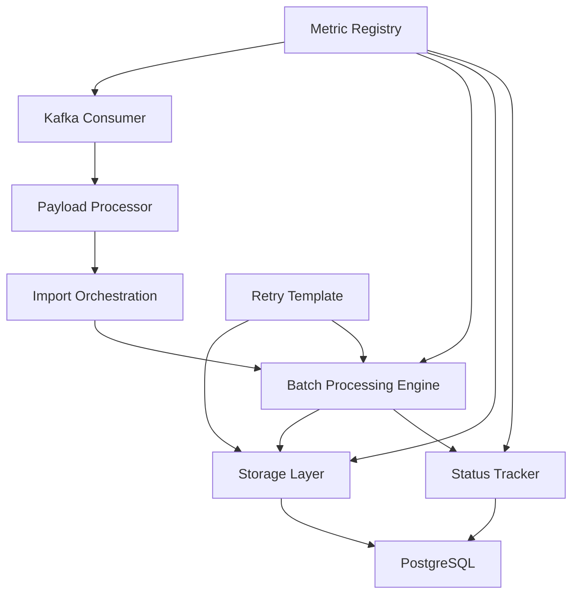

### Key Relationships:
- **Kafka Consumer** → **Payload Processor**: Consumes messages and delegates processing
- **Payload Processor** → **Import Orchestration**: Validates payloads and initiates import jobs
- **Import Orchestration** → **Batch Processing Engine**: Manages cost-based vs non-cost-based workflows
- **Batch Processing Engine** → **Storage Layer**: Processes nodes in batches and persists to DB
- **Batch Processing Engine** → **Status Tracker**: Updates job status throughout processing
- **Storage Layer** → **PostgreSQL**: Executes batch upserts using COPY command
- **Retry Template** → **Storage Layer/Batch Engine**: Provides fault tolerance for database operations
- **Metric Registry** → All components: Collects observability metrics

---

## 2. Runtime Topology (Threads, Queues, Semaphores)

### Runtime Topology Diagram
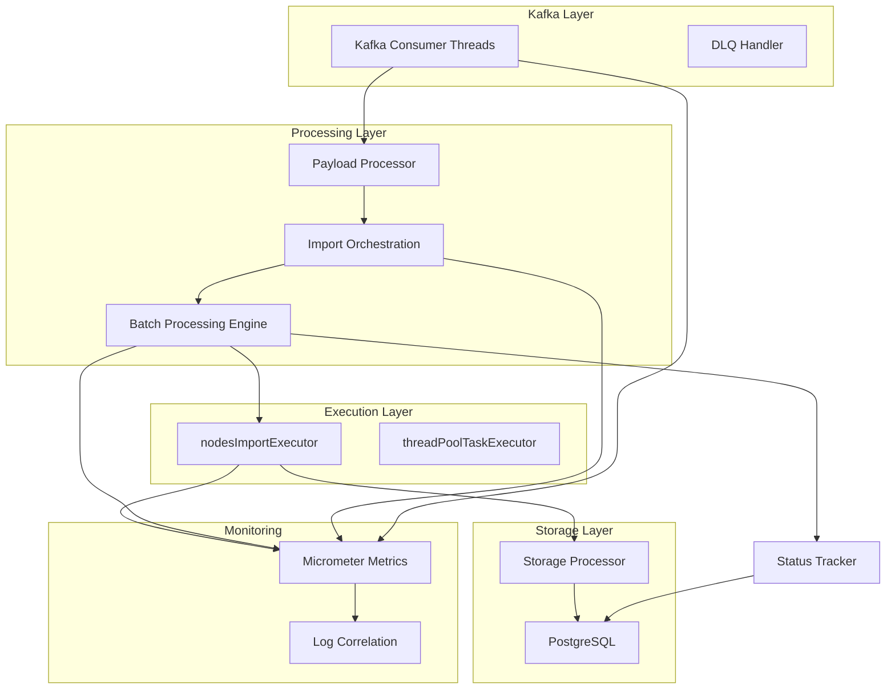

### Thread Pool Configuration:
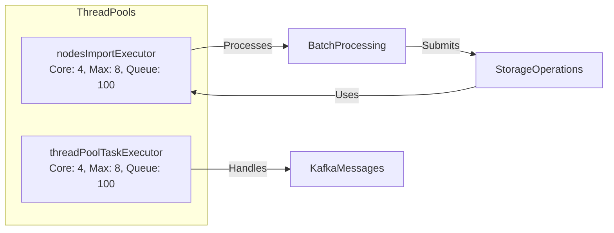

### Resource Management:
- **Backpressure**: Executor queue capacity (100) limits concurrent batch processing
- **Throttling**: `maxParallelFutures` limits parallel batch processing within a single import job
- **Timeout Control**: Per-batch timeouts (500ms) and global job timeouts

---

## 3. Detailed Component Specs

### 3.1 Kafka Consumer (`ScheduleXConsumer`)
- **Configuration**:
    - Topic pattern: `.*-users` (matches all user-related topics)
    - Group ID: `nodes-import-group`
    - Concurrency: 4 consumer threads
    - DLQ: `users-import-dlq` for failed messages
- **Message Flow**:
    - Consumes messages from Kafka topics
    - Delegates to `payloadProcessor.processImportedNodesPayload()`
    - Routes failed messages to DLQ with original headers
- **Error Handling**:
    - Uses Spring Retry via `RetryTemplate`
    - DLQ messages include `__TypeId__` header for traceability
- **Metrics**:
    - `kafka_consumer_messages_received`
    - `kafka_consumer_messages_processed`
    - `kafka_consumer_errors`

### 3.2 Payload Processing (`ScheduleXPayloadProcessor`)
- **Validation & Parsing**:
    - Checks for null/blank payloads
    - Parses JSON into `NodeExchange` objects
    - Handles parsing errors gracefully
- **Delegation**:
    - Forwards validated payloads to `importJobService.startNodesImport()`
    - Async error handling with `exceptionally()`
- **Key Structures**:
  ```mermaid
  classDiagram
      class NodeExchange {
          +String groupId
          +UUID domainId
          +MultipartFile file
          +List<String> referenceIds
          +boolean isValidForCostBased()
          +boolean isValidForNonCostBased()
      }
      
      class MultipartFile {
          +String getOriginalFilename()
          +InputStream getInputStream()
          +boolean isEmpty()
      }
  ```

### 3.3 Import Orchestration (`ImportJobServiceImpl`)
- **Payload Validation**:
    - `isValidPayloadForCostBasedNodes()`: Checks for file input
    - `isValidPayloadForNonCostBasedNodes()`: Checks for reference IDs
- **Job Initialization**:
    - Generates unique job ID
    - Updates job status in DB
    - Routes to appropriate processing path
- **Error Handling**:
    - Global exception handling with `handle()`
    - Updates job status on failure
- **Metrics**:
    - `node_import_jobs_started`
    - `node_import_jobs_completed`
    - `node_import_jobs_failed`

### 3.4 Batch Processing Engine (`NodesImportService`)
- **Cost-Based Processing**:
    - Streams CSV data from GZIP-compressed files
    - Processes in batches with controlled parallelism
    - Uses `CsvParser.parseInBatches()` for streaming
- **Non-Cost-Based Processing**:
    - Converts reference IDs to Node objects
    - Partitions into batches for parallel processing
    - Uses `CompletableFuture.allOf()` for coordination
- **Concurrency Control**:
    - Limits parallel futures with `maxParallelFutures`
    - Uses dedicated executor for batch processing
- **Timeouts**:
    - Per-batch timeout (500ms default)
    - Global job timeout
- **Metrics**:
    - `node_import_batch_duration`
    - `node_import_batches_processed`
    - `node_import_batch_failures`

### 3.5 Storage Layer (`NodesStorageProcessor`)
- **Upsert Mechanism**:
    - Generates UUIDs for new nodes
    - Builds CSV data for batch processing
    - Uses PostgreSQL `COPY` for efficient bulk operations
- **Transaction Management**:
    - Uses Spring's `TransactionTemplate`
    - Manual connection management for COPY operations
    - Automatic rollback on failure
- **Batch Processing**:
    - Partitions nodes into configurable batch sizes
    - Applies retry logic for transient failures
    - Tracks conflict rates during upserts
- **Metrics**:
    - `node_import_total_duration`
    - `node_import_conflict_updates`
    - `node_import_metadata_duration`

### 3.6 Status Tracking (`NodesImportStatusUpdater`)
- **Database Schema**:
  ```sql
  CREATE TABLE job_status (
      id UUID PRIMARY KEY,
      group_id VARCHAR(255) NOT NULL,
      domain_id UUID NOT NULL,
      status VARCHAR(50) NOT NULL CHECK (status IN ('PENDING', 'PROCESSING', 'COMPLETED', 'FAILED')),
      total_nodes INT DEFAULT 0,
      success_count INT DEFAULT 0,
      failed_count INT DEFAULT 0,
      created_at TIMESTAMPTZ DEFAULT NOW(),
      updated_at TIMESTAMPTZ DEFAULT NOW()
  );
  ```
- **Operations**:
    - `initiateNodesImport()`: Creates new job record
    - `updateJobStatus()`: Updates job status
    - `updateTotalNodes()`: Sets expected node count
    - `completeJob()`: Finalizes successful job
    - `failJob()`: Records failure details
- **Metrics Integration**:
    - Emits success/failure counters with domain/group tags

### 3.7 Fault Tolerance (`RetryTemplate`)
- **Configuration**:
    - Max attempts: 3
    - Initial interval: 1000ms
    - Multiplier: 2.0 (exponential backoff)
    - Max interval: 10000ms
- **Usage**:
    - Applied to database operations in storage layer
    - Handles transient database errors
    - Prevents cascading failures

### 3.8 Concurrency Management
- **Thread Pool Configuration**:
  ```java
  @Bean(name = "nodesImportExecutor")
  public ThreadPoolTaskExecutor nodesImportExecutor() {
      ThreadPoolTaskExecutor executor = new ThreadPoolTaskExecutor();
      executor.setCorePoolSize(4); // Matches Kafka concurrency
      executor.setMaxPoolSize(8); // Scales under load
      executor.setQueueCapacity(100); // Backpressure: reject if queue full
      executor.setThreadNamePrefix("nodes-import-");
      executor.initialize();
      return executor;
  }
  ```
- **Backpressure Handling**:
    - Rejects tasks when queue is full
    - Updates job status to FAILED on rejection
    - Increments error metrics

### 3.9 Observability
- **Metrics**:
    - Timers: `node_import_batch_duration`, `node_import_total_duration`, `node_import_metadata_duration`
    - Counters: `node_import_success`, `node_import_failures`, `node_import_conflict_updates`
- **Log Correlation**:
    - All logs include `jobId` for traceability
    - Structured logging with domain/group context
- **Monitoring**:
    - Real-time tracking of import progress
    - Alerting on high failure rates or slow processing

---

## 4. Data Model

### Data Model Diagram
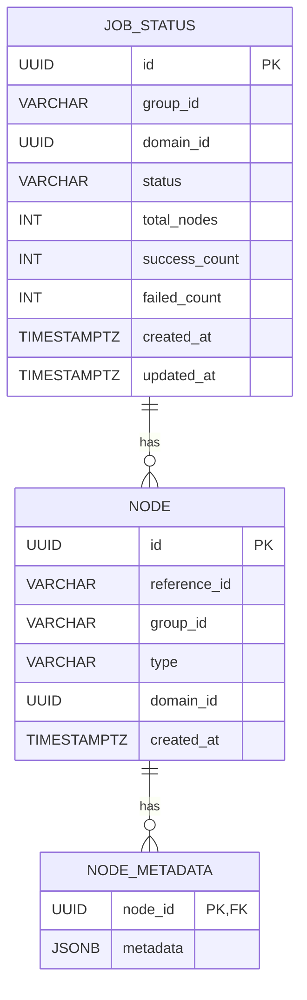

### Key Entities:
- **job_status**:
    - Tracks import job lifecycle (PENDING → PROCESSING → COMPLETED/FAILED)
    - Records success/failure counts for reporting
- **nodes**:
    - Core entity for user nodes
    - Unique constraint on (reference_id, group_id)
- **node_metadata**:
    - Stores additional node properties as JSONB
    - One-to-one relationship with nodes

### Index Recommendations:
```sql
CREATE INDEX idx_job_status_group_domain ON job_status (group_id, domain_id);
CREATE UNIQUE INDEX idx_nodes_reference_group ON nodes (reference_id, group_id);
CREATE INDEX idx_nodes_domain ON nodes (domain_id);
```

---

## 5. Key Algorithms and Pseudocode

### 5.1 Cost-Based Import Workflow
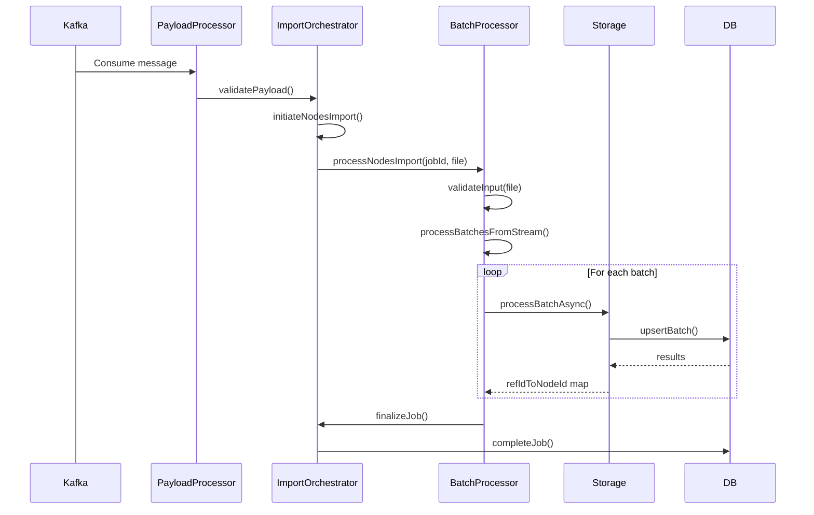

### 5.2 Non-Cost-Based Import Workflow
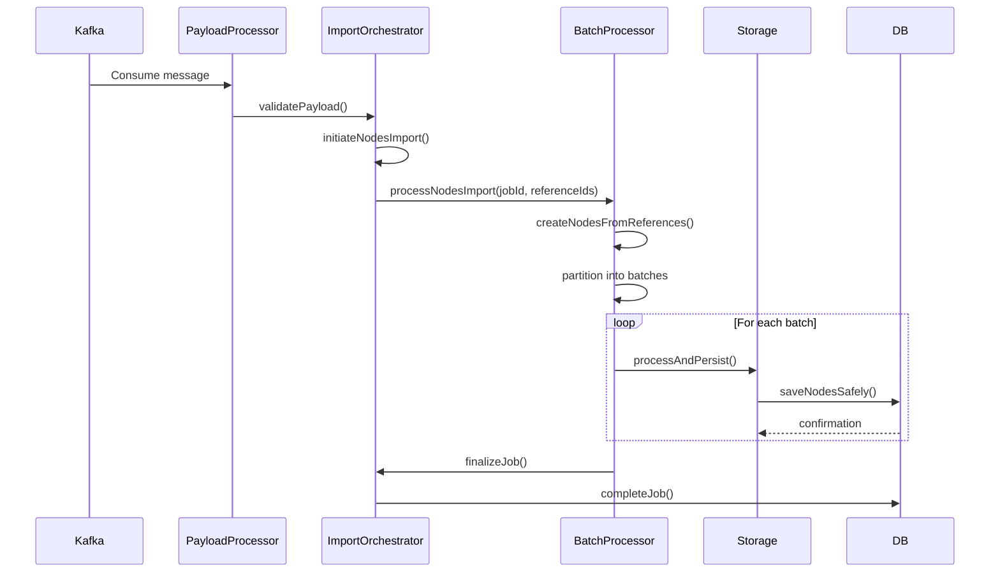

### 5.3 Batch Processing Algorithm
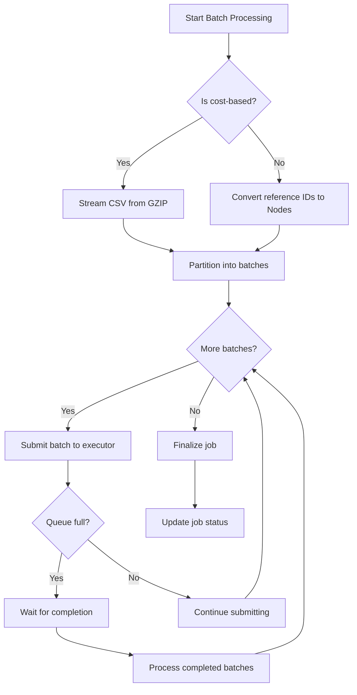

### 5.4 Database Upsert Algorithm
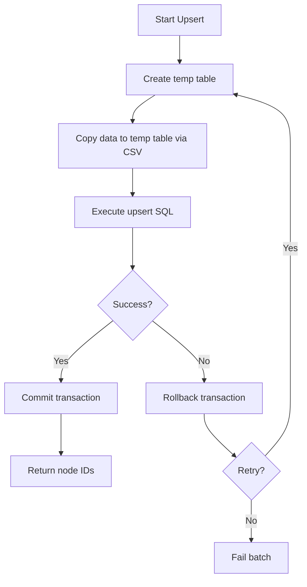

---

## 6. Error Handling, Timeouts, Retries

### Error Handling Flow Diagram
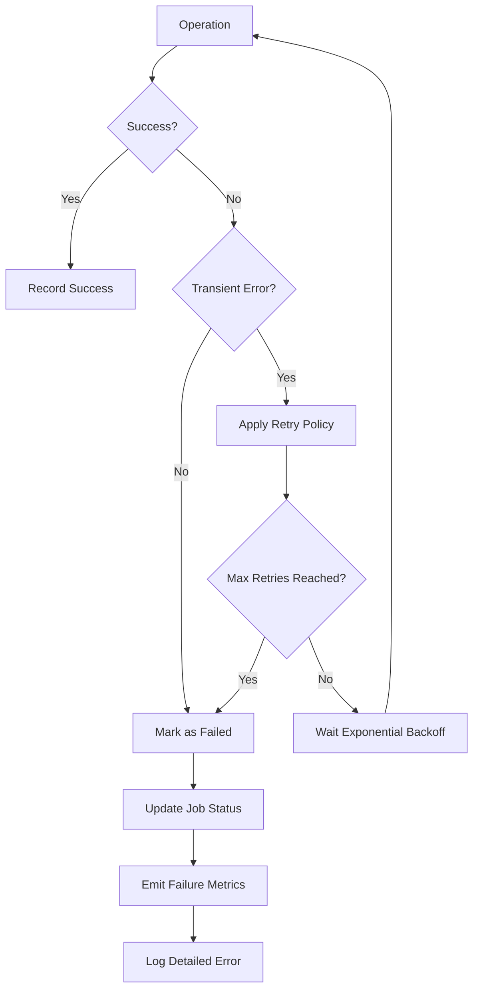

### Key Mechanisms:
1. **Kafka Consumer Errors**:
    - Failed messages routed to DLQ after retries
    - Original headers preserved for debugging
    - `__TypeId__` header maintains object type information

2. **Batch Processing Errors**:
    - Per-batch timeouts (500ms default)
    - Failed reference IDs tracked separately
    - Global job timeout prevents hung imports

3. **Database Operation Errors**:
    - Retry template with exponential backoff
    - 3 max attempts with increasing delays
    - Automatic rollback on failure

4. **Backpressure Handling**:
    - Executor queue capacity limits concurrent work
    - Task rejection triggers job failure
    - Prevents system overload during spikes

---

## 7. Metrics and Logging

### Metrics Dashboard Structure
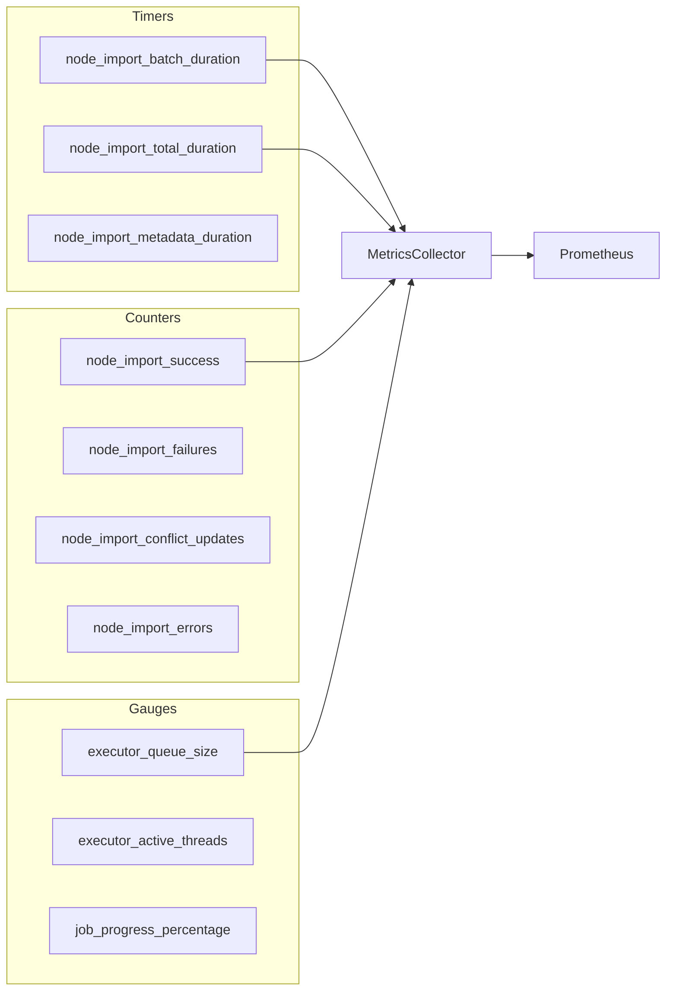

### Key Metrics:
- **Timers**:
    - `node_import_batch_duration`: Time to process individual batches
    - `node_import_total_duration`: Total time per import job
    - `node_import_metadata_duration`: Time to process metadata
- **Counters**:
    - `node_import_success`: Successful node imports (tagged by domain/group)
    - `node_import_failures`: Failed node imports (tagged by domain/group)
    - `node_import_conflict_updates`: Number of existing nodes updated
    - `node_import_errors`: General error count
- **Gauges**:
    - `executor_queue_size`: Current size of processing queue
    - `executor_active_threads`: Number of active worker threads
    - `job_progress_percentage`: Percentage completion for active jobs

### Logging Standards:
- **Structured Logging**:
  ```json
  {
    "jobId": "a1b2c3d4-...",
    "groupId": "marketing",
    "domainId": "e5f6g7h8-...",
    "message": "Completed batch of 100 nodes",
    "batchSize": 100,
    "durationMs": 42
  }
  ```
- **Critical Log Points**:
    - Job start/completion
    - Batch processing milestones
    - Error conditions with stack traces
    - Retry attempts and outcomes
- **Correlation**:
    - All logs include `jobId` for traceability
    - Domain and group context included in all logs

---

## 8. Configuration Matrix

| Key | Default | Component | Effect |
|-----|---------|-----------|--------|
| `kafka.consumer.concurrency` | 4 | Kafka Consumer | Number of consumer threads |
| `node.import.timeout.ms` | 500 | Batch Processor | Per-batch processing timeout |
| `node.import.global.timeout.ms` | 300000 | Batch Processor | Global job timeout (5 min) |
| `node.import.executor.core-pool-size` | 4 | Thread Pool | Core number of worker threads |
| `node.import.executor.max-pool-size` | 8 | Thread Pool | Maximum worker threads |
| `node.import.executor.queue-capacity` | 100 | Thread Pool | Backpressure threshold |
| `node.import.batch.size` | 500 | Storage Layer | Database batch size |
| `node.import.retry.max-attempts` | 3 | Retry Template | Maximum retry attempts |
| `node.import.retry.initial-interval` | 1000 | Retry Template | First retry delay (ms) |
| `node.import.retry.multiplier` | 2.0 | Retry Template | Exponential backoff multiplier |
| `node.import.retry.max-interval` | 10000 | Retry Template | Maximum retry delay (ms) |
| `node.import.max-parallel-futures` | 4 | Batch Processor | Max concurrent batches per job |

---

## 9. Sequences

### 9.1 Complete Cost-Based Import Sequence
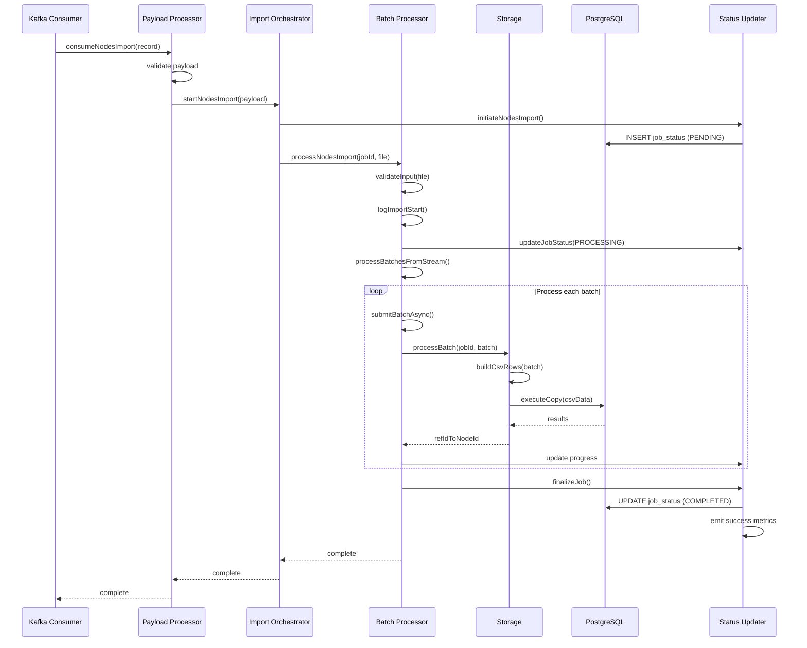

### 9.2 Error Handling Sequence
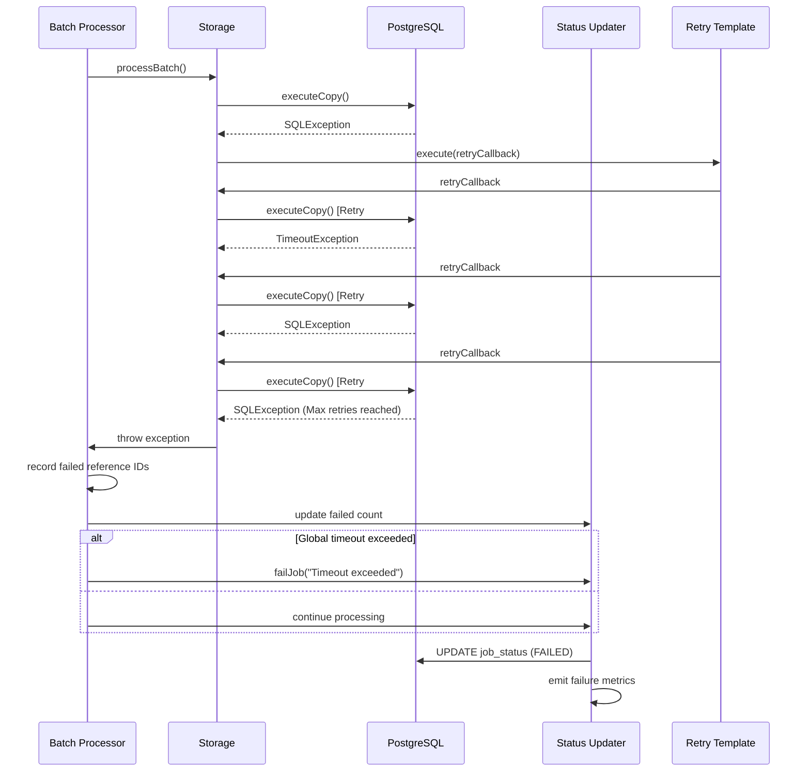

### 9.3 Backpressure Handling Sequence
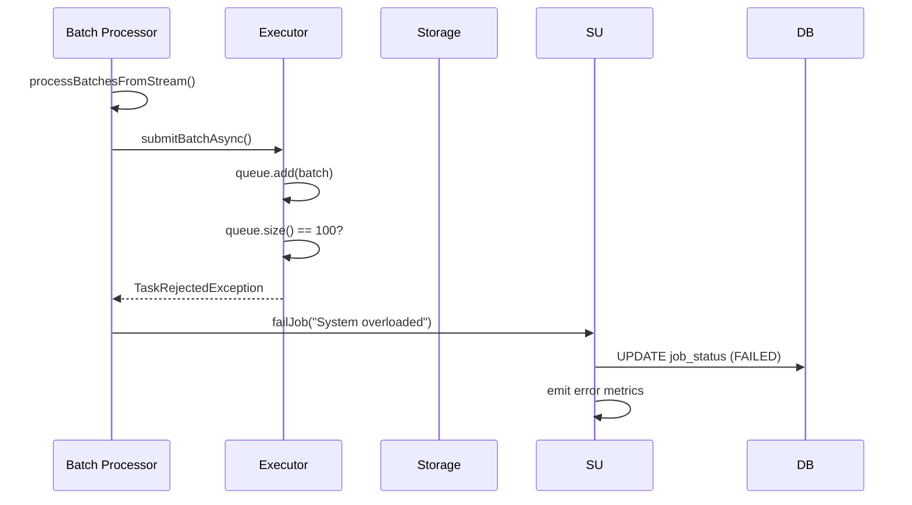

---

## 10. External Contracts and Assumptions

### External Service Interfaces
```mermaid
classDiagram
    class KafkaConsumer {
        <<interface>>
        + consume(ConsumerRecord)
    }

    class GroupConfigService {
        <<interface>>
        + MatchingGroup getGroupConfig(groupId, domainId)
    }

    class GraphRequestFactory {
        <<interface>>
        + List~Node~ createNodesFromReferences(referenceIds, groupId, nodeType, domainId)
    }

    class CsvParser {
        <<interface>>
        + void parseInBatches(InputStream, NodeResponseFactory, Consumer)
    }

    class NodeResponseFactory {
        <<interface>>
        + NodeResponse createFromCsvRow(String[])
    }

    class QueryUtils {
        <<interface>>
        + String getNodesTempTableSQL()
        + String getNodesUpsertSQL()
    }

```

### Key Assumptions:
1. **Kafka Topics**:
    - Topics follow naming convention `*-users`
    - Messages contain valid JSON payloads

2. **File Format**:
    - Cost-based imports use GZIP-compressed CSV
    - CSV has expected headers (reference_id, etc.)

3. **Database**:
    - PostgreSQL 12+ with `pgcrypto` for `gen_random_uuid()`
    - Proper indexing on `nodes` table

4. **Node Types**:
    - Only USER nodes are imported through this module
    - Other node types handled elsewhere

5. **Idempotency**:
    - Import operations are idempotent
    - Duplicate reference IDs update existing nodes

---

## 11. Known Risks and Recommendations

### Risk Mitigation Matrix
| Risk | Impact | Likelihood | Mitigation |
|------|--------|------------|------------|
| Large file processing | High | Medium | Implement file chunking and checkpointing |
| Database connection leaks | Medium | Low | Use try-with-resources for connections |
| Memory pressure from large reference ID lists | Medium | High | Stream reference IDs instead of loading all at once |
| Deadlocks during concurrent upserts | Low | Medium | Ensure proper transaction isolation levels |
| Inconsistent job status on failure | Medium | High | Use transactional status updates |
| Slow COPY operations under load | Medium | Medium | Monitor and adjust PostgreSQL configuration |

### Recommendations:
1. **Critical Improvements**:
    - Add file size limits to prevent OOM errors
    - Implement streaming for reference ID lists
    - Add transactional boundaries for status updates

2. **Performance Optimizations**:
    - Tune PostgreSQL `work_mem` for COPY operations
    - Consider using `COPY` directly from client for larger datasets
    - Add connection pool monitoring

3. **Resilience Enhancements**:
    - Add circuit breaker pattern for database operations
    - Implement dead-letter queue reprocessing mechanism
    - Add job resumption capability

4. **Operational Improvements**:
    - Add admin API for monitoring active jobs
    - Implement automated cleanup of old job records
    - Add alerts for long-running jobs

---

## 12. Testing Strategy (Pointers)

### Testing Strategy Diagram
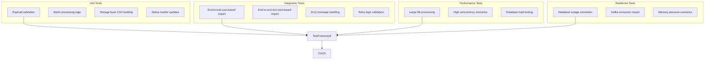

### Test Categories:
1. **Unit Tests**:
    - Payload validation logic
    - Batch processing algorithms
    - CSV formatting and parsing
    - Status update calculations

2. **Integration Tests**:
    - End-to-end import workflows (both cost-based and non-cost-based)
    - DLQ message handling and reprocessing
    - Retry logic with simulated failures
    - Database transaction boundaries

3. **Performance Tests**:
    - Large file processing (1GB+)
    - High concurrency scenarios (multiple jobs simultaneously)
    - Database load testing with realistic dataset sizes
    - Memory usage profiling

4. **Resilience Tests**:
    - Database outage simulation (connection failures)
    - Kafka consumer restart scenarios
    - Memory pressure tests (large reference ID lists)
    - Network partition testing

5. **Chaos Engineering**:
    - Randomly kill database connections during COPY
    - Simulate slow network for Kafka consumers
    - Inject latency in storage layer operations

---

