# Node Import System - Low-Level Design Document


---

## Table of Contents

1. [System Overview](#1-system-overview)
2. [Architecture Design](#2-architecture-design)
3. [Component Design](#3-component-design)
4. [Data Flow Architecture](#4-data-flow-architecture)
5. [Kafka Integration](#5-kafka-integration)
6. [File Processing Engine](#6-file-processing-engine)
7. [Storage Architecture](#7-storage-architecture)
8. [Error Handling & Resilience](#8-error-handling--resilience)
9. [Performance Optimization](#9-performance-optimization)
10. [Monitoring & Operations](#10-monitoring--operations)

---

## 1. System Overview

### 1.1 Purpose

The **Node Import System** is an event-driven, high-throughput data ingestion platform that processes entity (node) imports from Kafka topics. It supports both file-based imports (GZIP CSV) from MinIO/filesystem and reference-based imports (list of IDs), with comprehensive error handling, status tracking, and PostgreSQL bulk loading via COPY protocol.

### 1.2 Key Capabilities


### 1.3 System Metrics

| Metric | Target | Current Capacity |
|--------|--------|------------------|
| **Throughput** | 10K nodes/sec | 5K nodes/sec |
| **File Size** | Up to 5GB GZIP | 2GB tested |
| **Kafka Lag** | <10 sec | <5 sec |
| **Job Success Rate** | >99% | 98.5% |
| **Processing Time** | <5 min for 100K nodes | ~3 min |
| **Memory Footprint** | <4GB heap | ~2GB |

---

## 2. Architecture Design

### 2.1 System Context Diagram


### 2.2 Logical Architecture


### 2.3 Component Architecture


---

## 3. Component Design

### 3.1 Kafka Consumer Component


**Consumer Flow**:


### 3.2 Payload Processor Component


**Payload Processing Decision Tree**:


### 3.3 Import Job Service Component


**Import Type Decision Logic**:


---

## 4. Data Flow Architecture

### 4.1 End-to-End Data Flow


### 4.2 File-Based Import Sequence

```mermaid
sequenceDiagram
    autonumber
    participant Kafka
    participant Consumer
    participant JobSvc as Import Job Service
    participant FileSvc as File Import Service
    participant MinIO
    participant Parser as CSV Parser
    participant Processor as Import Processor
    participant Storage as Storage Processor
    participant DB as PostgreSQL
    participant Status as Status Updater
    
    Kafka->>Consumer: NodeExchange message (filePath)
    Consumer->>JobSvc: startNodesImport(payload)
    
    JobSvc->>JobSvc: Validate payload (file-based)
    JobSvc->>DB: Insert NodesImportJob (PENDING)
    DB-->>JobSvc: jobId
    
    JobSvc->>JobSvc: Resolve MultipartFile
    
    alt Remote file (http/https)
        JobSvc->>MinIO: Download file via S3 API
        MinIO-->>JobSvc: RemoteMultipartFile
    else Local file
        JobSvc->>JobSvc: FileSystemMultipartFile (local path)
    end
    
    JobSvc->>FileSvc: processNodesImport(jobId, file, exchange)
    FileSvc->>DB: Update job status (PROCESSING)
    
    FileSvc->>FileSvc: Open GZIP stream
    FileSvc->>Parser: parseInBatches(gzipStream, callback)
    
    loop For each 1000 rows
        Parser-->>FileSvc: Batch of NodeResponse
        FileSvc->>FileSvc: processBatchAsync (thread pool)
        
        par Parallel Batch Processing
            FileSvc->>Processor: processBatch(jobId, batch, ...)
            Processor->>Processor: Convert NodeResponse → Node
            Processor->>Storage: saveNodesSafely(nodes)
            
            Storage->>Storage: Generate UUIDs if missing
            Storage->>DB: COPY to temp_nodes (binary)
            Storage->>DB: INSERT ON CONFLICT (upsert)
            DB-->>Storage: Returning nodeId, referenceId
            
            Storage->>DB: Batch insert metadata
            
            Processor->>DB: Increment processed count
            Processor->>Processor: Track success/failed lists
        end
        
        FileSvc->>FileSvc: orTimeout(calculateBatchTimeout)
    end
    
    FileSvc->>FileSvc: joinAndClearFutures (wait all)
    FileSvc->>Status: finalizeJob(success, failed, total)
    
    alt All succeeded
        Status->>DB: Update job (COMPLETED)
        Status->>Kafka: Publish success status
    else Some failed
        Status->>DB: Update job (FAILED)
        Status->>Kafka: Publish failure status
    end
```



### 4.3 Reference-Based Import Sequence


---

## 5. Kafka Integration

### 5.1 Kafka Configuration Architecture


**Kafka Consumer Configuration**:

```yaml
Consumer Settings:
  bootstrap.servers: ${KAFKA_BROKERS}
  group.id: nodes-import-group (dynamic per listener)
  auto.offset.reset: earliest
  max.partition.fetch.bytes: 5MB
  fetch.max.bytes: 5MB
  max.poll.records: 100
  session.timeout.ms: 45000
  heartbeat.interval.ms: 15000
  max.poll.interval.ms: 600000 (10 minutes)
  
Producer Settings:
  linger.ms: 10
  batch.size: 32KB
  buffer.memory: 32MB
  max.block.ms: 5000
  retries: 3
  retry.backoff.ms: 200
  acks: 1
  max.request.size: 5MB
  compression.type: lz4
```

### 5.2 Topic Patterns & Routing


### 5.3 Error Handling Flow


**Error Handling Strategy**:

| Error Type | Handling | Retry | DLQ | Recovery |
|------------|----------|-------|-----|----------|
| **Null Payload** | Immediate DLQ | No | Yes | Manual review |
| **Parse Failure** | Immediate DLQ | No | Yes | Fix & replay |
| **Processing Exception** | Application retry | 3x | Yes | Automatic |
| **Timeout (120s)** | Log & continue | No | No | Metrics alert |
| **Kafka Exception** | Framework retry | 3x | Yes | Auto-recover |

---

## 6. File Processing Engine

### 6.1 MultipartFile Abstraction


**File Resolution Logic**:


### 6.2 CSV Streaming Processing


**Batch Processing with Timeout**:


**Configuration**:

```yaml
import:
  node-timeout-per-node-ms: 50      # 50ms per node
  min-batch-timeout-ms: 1000        # Minimum 1 second
  max-batch-timeout-ms: 30000       # Maximum 30 seconds
  max-parallel-futures: 8           # Concurrent batches
  join-timeout-seconds: 30          # Wait for all batches
```

### 6.3 Parallel Batch Management

```mermaid
stateDiagram-v2
    [*] --> Idle: System Ready
    
    Idle --> Reading: Start CSV Stream
    
    Reading --> Buffering: Accumulate 1000 rows
    Buffering --> BatchReady: Buffer full
    
    BatchReady --> CheckParallel: Create CompletableFuture
    
    CheckParallel --> Submit: futures.size() < 8
    CheckParallel --> Wait: futures.size() >= 8
    
    Wait --> Cleanup: removeIf(isDone)
    Cleanup --> Submit: Slots available
    
    Submit --> Processing: Execute in thread pool
    
    Processing --> Success: Batch completes
    Processing --> Timeout: Exceeds timeout
    Processing --> Error: Exception thrown
    
    Success --> Reading: More rows?
    Timeout --> MarkFailed: Add to failed list
    Error --> MarkFailed
    
    MarkFailed --> Reading: More rows?
    
    Reading --> AllRead: Stream exhausted
    AllRead --> JoinAll: joinAndClearFutures
    
    JoinAll --> WaitCompletion: allOf(futures).get(30s)
    
    WaitCompletion --> Finalize: All complete
    WaitCompletion --> ForceCancel: Timeout after 30s
    
    ForceCancel --> Finalize
    
    Finalize --> [*]: Job complete
```

---

## 7. Storage Architecture

### 7.1 PostgreSQL COPY Protocol Implementation

```mermaid
classDiagram
    class NodesStorageProcessor {
        -JdbcTemplate jdbcTemplate
        -NodeMetadataBatchWriter metadataBatchWriter
        -TransactionTemplate transactionTemplate
        -RetryTemplate retryTemplate
        -int batchSize
        +saveNodesSafely(List~Node~) CompletableFuture~Void~
        -upsertNodes(List~Node~) ConcurrentHashMap
        -upsertBatch(List~Node~, Map) void
        -buildCsvRows(List~Node~) String
        -executeCopy(String) List~Map~
        -insertMetadata(List~Node~, Collection~UUID~) void
    }
    
    class CopyManager {
        <<PostgreSQL>>
        +copyIn(String, InputStream) void
    }
    
    class NodeMetadataBatchWriter {
        +batchInsertMetadata(Map~UUID, Map~String,String~~) void
    }
    
    NodesStorageProcessor --> CopyManager : uses
    NodesStorageProcessor --> NodeMetadataBatchWriter : delegates
```

**COPY Protocol Flow**:

```mermaid
sequenceDiagram
    autonumber
    participant Processor as NodesStorageProcessor
    participant Txn as TransactionTemplate
    participant DS as DataSource
    participant Conn as Connection
    participant Copy as CopyManager
    participant DB as PostgreSQL
    
    Processor->>Processor: Partition nodes into 1000-node batches
    
    loop For each batch
        Processor->>Txn: execute(status -> ...)
        Txn->>DS: getConnection()
        DS-->>Txn: Connection
        
        Txn->>Conn: setAutoCommit(false)
        
        Txn->>Conn: createStatement()
        Txn->>DB: CREATE TEMP TABLE temp_nodes (...)
        
        Txn->>Processor: buildCsvRows(batch)
        Processor-->>Txn: TSV string data
        
        Txn->>Txn: new ByteArrayInputStream(csvData)
        Txn->>Copy: new CopyManager(conn.unwrap(BaseConnection))
        
        Txn->>Copy: copyIn("COPY temp_nodes FROM STDIN WITH CSV DELIMITER '\t'", stream)
        Copy->>DB: Stream TSV data (binary protocol)
        DB-->>Copy: Rows copied
        
        Txn->>Conn: prepareStatement(UPSERT_SQL)
        Txn->>DB: INSERT INTO nodes SELECT * FROM temp_nodes<br/>ON CONFLICT (group_id, domain_id, reference_id)<br/>DO UPDATE SET type = EXCLUDED.type, ...<br/>RETURNING id, reference_id, group_id
        
        DB-->>Txn: ResultSet with nodeId mappings
        
        Txn->>Processor: Store referenceId → nodeId mapping
        
        Txn->>Conn: commit()
        
        Processor->>Processor: Record metrics (duration, count)
    end
    
    Processor->>Processor: Collect all valid nodeIds
    Processor->>Processor: insertMetadata(nodes, validNodeIds)
```

**TSV Format (Tab-Separated Values)**:

```
UUID\tReferenceId\tGroupId\tType\tDomainId\tCreatedAt
550e8400-e29b-41d4-a716-446655440000\tuser123\t123e4567-...\tUSER\t789e0123-...\t2024-12-12T10:00:00
...
```

**UPSERT SQL**:

```sql
INSERT INTO public.nodes (id, reference_id, group_id, type, domain_id, created_at)
SELECT id, reference_id, group_id, type, domain_id, created_at
FROM temp_nodes
ON CONFLICT (group_id, domain_id, reference_id)
DO UPDATE SET
    type = EXCLUDED.type,
    created_at = EXCLUDED.created_at
RETURNING id, reference_id, group_id;
```

### 7.2 Metadata Batch Insert

```mermaid
flowchart TD
    A[Nodes with Metadata] --> B[Filter: validNodeIds only]
    B --> C[Extract metadata maps<br/>Map~UUID, Map~String,String~~]
    
    C --> D{Metadata Empty?}
    D -->|Yes| E[Skip, Return]
    D -->|No| F[NodeMetadataBatchWriter<br/>batchInsertMetadata]
    
    F --> G[Flatten to List~NodeMetadata~]
    G --> H[Partition into 1000-record batches]
    
    H --> I[For each batch]
    I --> J[CREATE TEMP TABLE temp_node_metadata]
    J --> K[COPY to temp table]
    K --> L[INSERT ON CONFLICT DO UPDATE]
    L --> M[COMMIT]
    
    M --> N[Record Metrics]
    N --> O[Return]
    
    style A fill:#4CAF50
    style F fill:#2196F3
    style K fill:#FF9800
```

### 7.3 Transaction & Retry Strategy

```mermaid
graph TB
    subgraph "Retry Template Configuration"
        A[Max Attempts: 3]
        B[Backoff: Exponential<br/>Initial: 500ms<br/>Multiplier: 2<br/>Max: 5000ms]
        C[Retry On: SQLException,<br/>DataAccessException]
    end
    
    subgraph "Transaction Template Configuration"
        D[Propagation: REQUIRED]
        E[Isolation: READ_COMMITTED]
        F[Timeout: 60 seconds]
    end
    
    subgraph "Execution Flow"
        G[retryTemplate.execute]
        H[transactionTemplate.execute]
        I[Database Operation]
    end
    
    A --> G
    B --> G
    C --> G
    
    D --> H
    E --> H
    F --> H
    
    G --> H
    H --> I
    
    I --> J{Result?}
    J -->|Success| K[Commit & Return]
    J -->|SQLException| L{Retry < 3?}
    
    L -->|Yes| M[Backoff & Retry]
    L -->|No| N[Rollback & Throw]
    
    M --> G
    
    style K fill:#C8E6C9
    style N fill:#FFCDD2
```

**Retry Backoff Example**:

| Attempt | Delay | Total Time |
|---------|-------|------------|
| 1 | 0ms | 0ms |
| 2 | 500ms | 500ms |
| 3 | 1000ms (500×2) | 1500ms |
| Failure | - | Give up |

---

## 8. Error Handling & Resilience

### 8.1 Error Handling Hierarchy

```mermaid
graph TB
    subgraph "Layer 1: Kafka Consumer"
        L1A[Message Validation]
        L1B[DLQ Routing]
        L1C[Async Timeout 120s]
    end
    
    subgraph "Layer 2: Framework (Spring Kafka)"
        L2A[DefaultErrorHandler]
        L2B[ExponentialBackoff Max 3]
        L2C[DeadLetterPublishingRecoverer]
    end
    
    subgraph "Layer 3: Application Processing"
        L3A[Payload Parsing<br/>safeParse with null checks]
        L3B[Validation<br/>NodeImportValidator]
        L3C[File Resolution<br/>IOException handling]
    end
    
    subgraph "Layer 4: Batch Processing"
        L4A[Batch Timeout<br/>orTimeout calculated]
        L4B[Exception Tracking<br/>success/failed lists]
        L4C[Join Timeout 30s<br/>Cancel on timeout]
    end
    
    subgraph "Layer 5: Storage"
        L5A[RetryTemplate 3 attempts]
        L5B[TransactionTemplate<br/>Rollback on error]
        L5C[COPY Failure Recovery<br/>Rollback transaction]
    end
    
    L1A --> L2A
    L1B --> L2C
    L2A --> L3A
    L3A --> L4A
    L4A --> L5A
    
    style L1A fill:#E8F5E9
    style L2A fill:#E3F2FD
    style L3A fill:#FFF9C4
    style L4A fill:#F3E5F5
    style L5A fill:#FFEBEE
```

### 8.2 Failure Scenarios & Recovery

```mermaid
flowchart TD
    A[Processing Started] --> B{Failure Type?}
    
    B -->|Kafka Consumer Failure| C1[Message Validation Failed]
    B -->|File Download Failure| C2[MinIO Connection Error]
    B -->|Parse Failure| C3[CSV Format Invalid]
    B -->|Batch Timeout| C4[Processing Exceeds Timeout]
    B -->|Database Failure| C5[COPY Protocol Error]
    B -->|Join Timeout| C6[Batches Not Completing]
    
    C1 --> D1[Send to DLQ<br/>Increment dlq_messages metric]
    C2 --> D2[Retry 3x with backoff<br/>Log error, Return null]
    C3 --> D3[Skip row, Continue parsing<br/>Add to failed list]
    C4 --> D4[Cancel future<br/>Add batch to failed list]
    C5 --> D5[Rollback transaction<br/>Retry 3x]
    C6 --> D6[Cancel all futures<br/>Mark job FAILED]
    
    D1 --> E1[Manual Review Required]
    D2 --> E2[Alert Operations]
    D3 --> E3[Job FAILED with partial success]
    D4 --> E3
    D5 --> E4{Retry Exhausted?}
    D6 --> E5[RuntimeException thrown]
    
    E4 -->|Yes| E3
    E4 -->|No| F[Retry with backoff]
    
    E3 --> G[Publish FAILED status to Kafka]
    E5 --> G
    
    G --> H[Update job status in DB]
    H --> I[Record error metrics]
    
    style C1 fill:#FFCDD2
    style C2 fill:#FFCDD2
    style C5 fill:#FFCDD2
    style E3 fill:#FFF9C4
    style I fill:#9C27B0
```

### 8.3 Status Tracking State Machine

```mermaid
stateDiagram-v2
    [*] --> PENDING: Job Created

    PENDING --> PROCESSING: Start Import

    PROCESSING --> COMPLETED: All batches succeeded
    PROCESSING --> FAILED: Critical or partial failure

    FAILED --> [*]: Publish failure status
    COMPLETED --> [*]: Publish success status

    note right of PENDING
        Initial state
        Job ID assigned
    end note

    note right of PROCESSING
        Batches in progress
        Processed count increasing
    end note

    note right of COMPLETED
        All nodes processed
        Success count equals total
    end note

    note right of FAILED
        Error occurred
        Success plus failed equals total
        Failure reason stored
    end note

```

**Status Update Events**:

| Event | From Status | To Status | Database Update | Kafka Message |
|-------|------------|-----------|-----------------|---------------|
| **Job Created** | N/A | PENDING | INSERT job row | No |
| **Processing Started** | PENDING | PROCESSING | UPDATE status | No |
| **Batch Completed** | PROCESSING | PROCESSING | INCREMENT processed | No |
| **All Success** | PROCESSING | COMPLETED | UPDATE status, SET reason=null | Yes (success) |
| **Partial Failure** | PROCESSING | FAILED | UPDATE status, SET reason | Yes (failed) |
| **Critical Error** | PROCESSING | FAILED | UPDATE status, SET reason | Yes (failed) |

---

## 9. Performance Optimization

### 9.1 Throughput Optimization

```mermaid
graph LR
    subgraph "Input Optimization"
        I1["Kafka Partitioning<br/>Parallel consumers"]
        I2["Batch Fetching<br/>100 records per poll"]
        I3["Compression<br/>LZ4 enabled"]
    end

    subgraph "Processing Optimization"
        P1["Streaming CSV<br/>No full memory load"]
        P2["Parallel Batch Processing<br/>Eight concurrent tasks"]
        P3["Thread Pool Sizing<br/>Eight threads"]
    end

    subgraph "Storage Optimization"
        S1["PostgreSQL COPY<br/>Much faster than INSERT"]
        S2["Batch Size<br/>One thousand records"]
        S3["Transaction Batching<br/>Reduced commit frequency"]
    end

    I1 --> P1
    I2 --> P2
    I3 --> P3

    P1 --> S1
    P2 --> S2
    P3 --> S3

    style I1 fill:#C8E6C9
    style P2 fill:#BBDEFB
    style S1 fill:#FFF9C4

```

**Performance Benchmarks**:

| Operation | Throughput | Latency (p95) |
|-----------|-----------|---------------|
| **Kafka Consumption** | 500 msg/sec | <50ms |
| **CSV Parsing** | 50K rows/sec | <20ms per 1K batch |
| **Node Conversion** | 100K nodes/sec | <10ms per 1K batch |
| **PostgreSQL COPY** | 50K inserts/sec | <200ms per 1K batch |
| **Metadata Insert** | 30K inserts/sec | <300ms per 1K batch |
| **End-to-End (100K nodes)** | ~5K nodes/sec | ~20 sec total |

### 9.2 Memory Management

```mermaid
pie title Memory Allocation 4GB Heap
    "Kafka Buffers" : 15
    "Thread Pools" : 20
    "CSV Parsing Buffers" : 25
    "Node Objects in Batches" : 30
    "Database Connection Pool" : 5
    "Metadata Maps" : 3
    "Runtime Overhead" : 2

```

**Memory Optimization Techniques**:

| Technique | Benefit | Implementation |
|-----------|---------|----------------|
| **Streaming CSV Parsing** | No full file in memory | Read → Parse → Process → Discard |
| **Batch Limiting** | Cap concurrent batches | `maxParallelFutures = 8` |
| **Direct ByteBuffers** | Off-heap for large data | MinIO InputStream direct buffers |
| **Connection Pooling** | Reuse connections | HikariCP with max 20 connections |
| **Future Cleanup** | Remove completed futures | `futures.removeIf(isDone)` |

### 9.3 Thread Pool Configuration

```mermaid
graph TB
    subgraph "Kafka Consumer Pool"
        K1[Core: 8<br/>Max: 8<br/>Queue: 100]
        K2[Name: kafka-consumer-*]
        K3[Policy: CallerRunsPolicy]
    end
    
    subgraph "Node Import Pool"
        N1[Core: 8<br/>Max: 16<br/>Queue: 500]
        N2[Name: nodes-import-*]
        N3[Policy: CallerRunsPolicy]
    end
    
    subgraph "General Task Pool"
        G1[Core: 4<br/>Max: 8<br/>Queue: 100]
        G2[Name: task-executor-*]
        G3[Policy: CallerRunsPolicy]
    end
    
    K1 --> K2
    K2 --> K3
    
    N1 --> N2
    N2 --> N3
    
    G1 --> G2
    G2 --> G3
    
    style K1 fill:#E3F2FD
    style N1 fill:#C8E6C9
    style G1 fill:#FFF9C4
```

**Rejection Policy (CallerRunsPolicy)**:
- When queue is full, the calling thread executes the task
- Provides automatic backpressure
- Prevents OutOfMemoryError from unbounded queuing

---

## 10. Monitoring & Operations

### 10.1 Metrics Architecture

```mermaid
graph TB
    subgraph "Application Metrics"
        A1[kafka_processing_time<br/>Timer by topic, groupId]
        A2[kafka_processing_errors<br/>Counter by topic]
        A3[node_import_batch_processed<br/>Counter by jobId]
        A4[node_import_batch_timeout<br/>Counter by jobId]
        A5[node_import_batch_duration<br/>Timer by ops]
    end
    
    subgraph "Kafka Metrics"
        K1[kafka_consumer_executor_active_threads<br/>Gauge]
        K2[kafka_consumer_executor_queue_size<br/>Gauge]
        K3[kafka_dlq_messages<br/>Counter by topic]
    end
    
    subgraph "Storage Metrics"
        S1[node_import_total_duration<br/>Timer]
        S2[node_import_metadata_duration<br/>Timer]
        S3[node_import_conflict_updates<br/>Counter]
    end
    
    subgraph "Job Metrics"
        J1[node_import_jobs_completed<br/>Counter by groupId]
        J2[node_import_jobs_failed<br/>Counter by groupId]
        J3[node_import_unexpected_errors<br/>Counter by groupId]
    end
    
    A1 --> REG[Micrometer Registry]
    A2 --> REG
    A3 --> REG
    A4 --> REG
    A5 --> REG
    K1 --> REG
    K2 --> REG
    K3 --> REG
    S1 --> REG
    S2 --> REG
    S3 --> REG
    J1 --> REG
    J2 --> REG
    J3 --> REG
    
    REG --> PROM[Prometheus]
    PROM --> GRAF[Grafana Dashboards]
    
    style REG fill:#4CAF50
    style PROM fill:#FF5722
    style GRAF fill:#2196F3
```

### 10.2 Operational Dashboards

**Dashboard 1: Kafka Consumer Health**

```
┌─────────────────────────────────────────────────────────┐
│ Kafka Consumer Metrics                                  │
├─────────────────────────────────────────────────────────┤
│ Consumer Lag (by topic):           [Graph]              │
│   - domain-a-users: 12 messages                         │
│   - domain-b-users: 0 messages                          │
│                                                          │
│ Processing Rate (msg/sec):         [Graph]              │
│   - Current: 450/sec                                    │
│   - Peak: 500/sec                                       │
│                                                          │
│ Error Rate:                        [Graph]              │
│   - Processing Errors: 0.5%                             │
│   - DLQ Messages: 2 in last hour                        │
│                                                          │
│ Thread Pool Utilization:           [Graph]              │
│   - Active Threads: 6/8                                 │
│   - Queue Size: 15/100                                  │
└─────────────────────────────────────────────────────────┘
```

**Dashboard 2: Import Job Status**

```
┌─────────────────────────────────────────────────────────┐
│ Node Import Jobs (Last 24 Hours)                        │
├─────────────────────────────────────────────────────────┤
│ Job Summary:                                            │
│   - Total Jobs: 48                                      │
│   - Completed: 45 (93.75%)                              │
│   - Failed: 3 (6.25%)                                   │
│   - In Progress: 0                                      │
│                                                          │
│ Processing Throughput:              [Graph]             │
│   - Nodes/sec: 5000                                     │
│   - Total Nodes Today: 2.4M                             │
│                                                          │
│ Average Job Duration:               [Graph]             │
│   - Small (<10K nodes): 30s                             │
│   - Medium (10-100K): 3min                              │
│   - Large (>100K): 15min                                │
│                                                          │
│ Recent Failures:                                        │
│   - JobID: abc123 | Reason: MinIO timeout              │
│   - JobID: def456 | Reason: CSV parse error            │
└─────────────────────────────────────────────────────────┘
```

### 10.3 Alerting Rules

| Alert | Condition | Severity | Action |
|-------|-----------|----------|--------|
| **High DLQ Rate** | DLQ messages > 10/min | P2 | Investigate message format |
| **Kafka Lag Increasing** | Lag > 1000 for 5 min | P1 | Scale consumers |
| **Job Failure Rate** | Failed jobs > 10% over 1 hour | P2 | Review error logs |
| **Processing Timeout** | Batch timeouts > 5/min | P3 | Check DB performance |
| **Memory Pressure** | Heap usage > 90% | P1 | Restart application |
| **Thread Pool Exhausted** | Active threads = Max for 2 min | P2 | Increase pool size |

---

## Appendix A: Database Schema

### A.1 Core Tables

```sql
-- Nodes Import Job Table
CREATE TABLE public.nodes_import_job (
    id UUID PRIMARY KEY DEFAULT gen_random_uuid(),
    group_id UUID NOT NULL,
    domain_id UUID NOT NULL,
    status VARCHAR(20) NOT NULL,  -- PENDING, PROCESSING, COMPLETED, FAILED
    total_nodes INT DEFAULT 0,
    processed_nodes INT DEFAULT 0,
    failure_reason TEXT,
    created_at TIMESTAMP NOT NULL DEFAULT NOW(),
    updated_at TIMESTAMP NOT NULL DEFAULT NOW()
);

CREATE INDEX idx_import_job_status ON nodes_import_job(status);
CREATE INDEX idx_import_job_group ON nodes_import_job(group_id, domain_id);

-- Nodes Table
CREATE TABLE public.nodes (
    id UUID PRIMARY KEY DEFAULT gen_random_uuid(),
    reference_id VARCHAR(255) NOT NULL,
    group_id UUID NOT NULL,
    type VARCHAR(50) NOT NULL,
    domain_id UUID NOT NULL,
    processed BOOLEAN DEFAULT FALSE,
    created_at TIMESTAMP NOT NULL DEFAULT NOW(),
    updated_at TIMESTAMP,
    CONSTRAINT uq_node_reference UNIQUE (group_id, domain_id, reference_id)
);

CREATE INDEX idx_nodes_group_domain ON nodes(group_id, domain_id);
CREATE INDEX idx_nodes_processed ON nodes(group_id, domain_id, processed);

-- Node Metadata Table
CREATE TABLE public.node_metadata (
    id BIGSERIAL PRIMARY KEY,
    node_id UUID NOT NULL REFERENCES nodes(id) ON DELETE CASCADE,
    metadata_key VARCHAR(255) NOT NULL,
    metadata_value TEXT,
    created_at TIMESTAMP NOT NULL DEFAULT NOW(),
    CONSTRAINT uq_node_metadata UNIQUE (node_id, metadata_key)
);

CREATE INDEX idx_metadata_node ON node_metadata(node_id);
CREATE INDEX idx_metadata_key ON node_metadata(metadata_key);
```

---

## Appendix B: Configuration Reference

```yaml
# Kafka Configuration
spring:
  kafka:
    bootstrap-servers: ${KAFKA_BROKERS:localhost:9092}
    consumer:
      group-id: schedulex-consumer-group
      auto-offset-reset: earliest
      max-poll-records: 100
    producer:
      acks: 1
      compression-type: lz4

# Import Configuration
import:
  batch-size: 1000
  node-timeout-per-node-ms: 50
  min-batch-timeout-ms: 1000
  max-batch-timeout-ms: 30000
  max-parallel-futures: 8
  join-timeout-seconds: 30

nodes:
  import:
    timeout-ms: 50000

# Thread Pool Configuration
executor:
  kafka-consumer:
    core-pool-size: 8
    max-pool-size: 8
    queue-capacity: 100
    thread-name-prefix: kafka-consumer-
  
  nodes-import:
    core-pool-size: 8
    max-pool-size: 16
    queue-capacity: 500
    thread-name-prefix: nodes-import-

# MinIO Configuration
minio:
  endpoint: ${MINIO_ENDPOINT:http://localhost:9000}
  access-key: ${MINIO_ACCESS_KEY}
  secret-key: ${MINIO_SECRET_KEY}
  bucket: ${MINIO_BUCKET:nodes-import}

# Database Configuration
spring:
  datasource:
    hikari:
      maximum-pool-size: 20
      minimum-idle: 5
      connection-timeout: 30000
      max-lifetime: 1800000
```

---

