# Node Import System - Low-Level Design Document


---

This document describes the low-level design and reference implementation of a node import pipeline, focusing on correctness, data flow, and concurrency patterns rather than production deployment, tuning, or observed performance.

## Table of Contents

1. [System Overview](#1-system-overview)
2. [Architecture Design](#2-architecture-design)
3. [Component Design](#3-component-design)
4. [Data Flow Architecture](#4-data-flow-architecture)
5. [Kafka Integration](#5-kafka-integration)
6. [File Processing Engine](#6-file-processing-engine)
7. [Storage Architecture](#7-storage-architecture)
8. [Error Handling & Resilience](#8-error-handling--resilience)

---

## 1. System Overview

### 1.1 Purpose

The **Node Import System** is an event-driven data ingestion component that processes entity (node) imports from messaging topics. It supports both file-based imports (GZIP CSV) from object storage or filesystem and reference-based imports (list of IDs), with error handling and PostgreSQL bulk loading via COPY protocol.

### 1.2 Key Capabilities


---

## 2. Architecture Design

### 2.1 Logical Architecture


### 2.2 Component Architecture


---

## 3. Component Design

### 3.1 Kafka Consumer Component


**Consumer Flow**:


### 3.2 Payload Processor Component


**Payload Processing Decision Tree**:


### 3.3 Import Job Service Component


**Import Type Decision Logic**:


---

## 4. Data Flow Architecture

### 4.1 End-to-End Data Flow


### 4.2 File-Based Import Sequence

```mermaid
sequenceDiagram
    autonumber
    participant Kafka
    participant Consumer
    participant JobSvc as Import Job Service
    participant FileSvc as File Import Service
    participant Storage
    participant Parser as CSV Parser
    participant Processor as Import Processor
    participant DB as PostgreSQL
    participant Status as Status Updater
    
    Kafka->>Consumer: NodeExchange message (filePath)
    Consumer->>JobSvc: startNodesImport(payload)
    
    JobSvc->>JobSvc: Validate payload (file-based)
    JobSvc->>DB: Insert NodesImportJob (PENDING)
    DB-->>JobSvc: jobId
    
    JobSvc->>JobSvc: Resolve MultipartFile
    
    alt Remote file
        JobSvc->>Storage: Download file
        Storage-->>JobSvc: RemoteMultipartFile
    else Local file
        JobSvc->>JobSvc: FileSystemMultipartFile
    end
    
    JobSvc->>FileSvc: processNodesImport(jobId, file, exchange)
    FileSvc->>DB: Update job status (PROCESSING)
    
    FileSvc->>FileSvc: Open GZIP stream
    FileSvc->>Parser: parseInBatches(gzipStream, callback)
    
    loop For each batch
        Parser-->>FileSvc: Batch of NodeResponse
        FileSvc->>FileSvc: processBatchAsync (thread pool)
        
        par Parallel Batch Processing
            FileSvc->>Processor: processBatch(jobId, batch, ...)
            Processor->>Processor: Convert NodeResponse → Node
            Processor->>Storage: saveNodesSafely(nodes)
            
            Storage->>Storage: Generate UUIDs if missing
            Storage->>DB: COPY to temp_nodes
            Storage->>DB: INSERT ON CONFLICT (upsert)
            DB-->>Storage: Node mappings
            
            Storage->>DB: Batch insert metadata
            
            Processor->>DB: Increment processed count
            Processor->>Processor: Track success/failed lists
        end
        
        FileSvc->>FileSvc: orTimeout(configurable)
    end
    
    FileSvc->>FileSvc: joinAndClearFutures (final wait)
    FileSvc->>Status: finalizeJob(success, failed, total)
    
    alt All succeeded
        Status->>DB: Update job (COMPLETED)
        Status->>Kafka: Publish success status
    else Some failed
        Status->>DB: Update job (FAILED)
        Status->>Kafka: Publish failure status
    end
```



### 4.3 Reference-Based Import Sequence


---

## 5. Kafka Integration

### 5.1 Kafka Configuration Architecture


**Kafka Consumer Configuration**:

Consumers are configured with bounded polling, retries, and error handling routing. All limits are externally configurable.

### 5.2 Topic Patterns & Routing


### 5.3 Error Handling Flow


---

## 6. File Processing Engine

### 6.1 MultipartFile Abstraction


**File Resolution Logic**:


### 6.2 CSV Streaming Processing


**Batch Processing with Timeout**:


### 6.3 Parallel Batch Management


---

## 7. Storage Architecture

### 7.1 PostgreSQL COPY Protocol Implementation

```mermaid
classDiagram
    class NodesStorageProcessor {
        -JdbcTemplate jdbcTemplate
        -NodeMetadataBatchWriter metadataBatchWriter
        -TransactionTemplate transactionTemplate
        -RetryTemplate retryTemplate
        +saveNodesSafely(List~Node~) CompletableFuture~Void~
        -upsertNodes(List~Node~) ConcurrentHashMap
        -upsertBatch(List~Node~, Map) void
        -buildCsvRows(List~Node~) String
        -executeCopy(String) List~Map~
        -insertMetadata(List~Node~, Collection~UUID~) void
    }
    
    class CopyManager {
        <<PostgreSQL>>
        +copyIn(String, InputStream) void
    }
    
    class NodeMetadataBatchWriter {
        +batchInsertMetadata(Map~UUID, Map~String,String~~) void
    }
    
    NodesStorageProcessor --> CopyManager : uses
    NodesStorageProcessor --> NodeMetadataBatchWriter : delegates
```

**COPY Protocol Flow**:

```mermaid
sequenceDiagram
    autonumber
    participant Processor as NodesStorageProcessor
    participant Txn as TransactionTemplate
    participant DS as DataSource
    participant Conn as Connection
    participant Copy as CopyManager
    participant DB as PostgreSQL
    
    Processor->>Processor: Partition nodes into batches
    
    loop For each batch
        Processor->>Txn: execute(status -> ...)
        Txn->>DS: getConnection()
        DS-->>Txn: Connection
        
        Txn->>Conn: setAutoCommit(false)
        
        Txn->>Conn: createStatement()
        Txn->>DB: CREATE TEMP TABLE temp_nodes (...)
        
        Txn->>Processor: buildCsvRows(batch)
        Processor-->>Txn: TSV string data
        
        Txn->>Txn: new ByteArrayInputStream(csvData)
        Txn->>Copy: new CopyManager(conn.unwrap(BaseConnection))
        
        Txn->>Copy: copyIn("COPY temp_nodes FROM STDIN WITH CSV DELIMITER '\t'", stream)
        Copy->>DB: Stream TSV data
        DB-->>Copy: Rows copied
        
        Txn->>Conn: prepareStatement(UPSERT_SQL)
        Txn->>DB: INSERT INTO nodes SELECT * FROM temp_nodes<br/>ON CONFLICT DO UPDATE
        
        DB-->>Txn: ResultSet with node mappings
        
        Txn->>Processor: Store mappings
        
        Txn->>Conn: commit()
    end
    
    Processor->>Processor: Collect valid nodeIds
    Processor->>Processor: insertMetadata(nodes, validNodeIds)
```

**TSV Format (Tab-Separated Values)**:

```
UUID\tReferenceId\tGroupId\tType\tDomainId\tCreatedAt
...
```

**UPSERT SQL**:

```sql
INSERT INTO public.nodes (id, reference_id, group_id, type, domain_id, created_at)
SELECT id, reference_id, group_id, type, domain_id, created_at
FROM temp_nodes
ON CONFLICT (group_id, domain_id, reference_id)
DO UPDATE SET
    type = EXCLUDED.type,
    created_at = EXCLUDED.created_at
RETURNING id, reference_id, group_id;
```

### 7.2 Metadata Batch Insert

```mermaid
flowchart TD
    A[Nodes with Metadata] --> B[Filter: validNodeIds only]
    B --> C[Extract metadata maps]
    
    C --> D{Metadata Empty?}
    D -->|Yes| E[Skip, Return]
    D -->|No| F[NodeMetadataBatchWriter<br/>batchInsertMetadata]
    
    F --> G[Flatten to List~NodeMetadata~]
    G --> H[Partition batches]
    
    H --> I[For each batch]
    I --> J[CREATE TEMP TABLE temp_node_metadata]
    J --> K[COPY to temp table]
    K --> L[INSERT ON CONFLICT DO UPDATE]
    L --> M[COMMIT]
    
    M --> N[Return]
    
    style A fill:#4CAF50
    style F fill:#2196F3
    style K fill:#FF9800
```

### 7.3 Transaction & Retry Strategy

```mermaid
graph TB
    subgraph "Retry Template"
        A[Attempts configurable]
        B[Backoff configurable]
        C[Retry On: DataAccessException]
    end
    
    subgraph "Transaction Template"
        D[Propagation: REQUIRED]
        E[Isolation: READ_COMMITTED]
    end
    
    subgraph "Execution Flow"
        G[retryTemplate.execute]
        H[transactionTemplate.execute]
        I[Database Operation]
    end
    
    A --> G
    B --> G
    C --> G
    
    D --> H
    E --> H
    
    G --> H
    H --> I
    
    I --> J{Result?}
    J -->|Success| K[Commit & Return]
    J -->|Exception| L{Retry available?}
    
    L -->|Yes| M[Backoff & Retry]
    L -->|No| N[Rollback & Throw]
    
    M --> G
    
    style K fill:#C8E6C9
    style N fill:#FFCDD2
```

---

## 8. Error Handling & Resilience

### 8.1 Error Handling Hierarchy

```mermaid
graph TB
    subgraph "Layer 1: Kafka Consumer"
        L1A[Message Validation]
        L1B[Error Routing]
        L1C[Async Timeout]
    end
    
    subgraph "Layer 2: Framework"
        L2A[ErrorHandler]
        L2B[Backoff]
        L2C[Recovery]
    end
    
    subgraph "Layer 3: Application Processing"
        L3A[Payload Parsing]
        L3B[Validation]
        L3C[File Resolution]
    end
    
    subgraph "Layer 4: Batch Processing"
        L4A[Batch Timeout]
        L4B[Exception Tracking]
        L4C[Join Timeout]
    end
    
    subgraph "Layer 5: Storage"
        L5A[RetryTemplate]
        L5B[TransactionTemplate<br/>Rollback on error]
        L5C[COPY Failure Recovery]
    end
    
    L1A --> L2A
    L1B --> L2C
    L2A --> L3A
    L3A --> L4A
    L4A --> L5A
    
    style L1A fill:#E8F5E9
    style L2A fill:#E3F2FD
    style L3A fill:#FFF9C4
    style L4A fill:#F3E5F5
    style L5A fill:#FFEBEE
```

### 8.2 Failure Scenarios & Recovery

```mermaid
flowchart TD
    A[Processing Started] --> B{Failure Type?}
    
    B -->|Kafka Consumer Failure| C1[Message Validation Failed]
    B -->|File Download Failure| C2[Connection Error]
    B -->|Parse Failure| C3[CSV Format Invalid]
    B -->|Batch Timeout| C4[Processing Exceeds Timeout]
    B -->|Database Failure| C5[COPY Error]
    B -->|Join Timeout| C6[Batches Not Completing]
    
    C1 --> D1[Error handling]
    C2 --> D2[Retry with backoff]
    C3 --> D3[Skip row, Continue]
    C4 --> D4[Cancel future<br/>Add to failed list]
    C5 --> D5[Rollback transaction<br/>Retry]
    C6 --> D6[Cancel futures<br/>Mark job FAILED]
    
    D2 --> E2[Error handling if exhausted]
    D5 --> E4{Retry exhausted?}
    
    E4 -->|Yes| E3[Mark job FAILED]
    E4 -->|No| F[Retry]
    
    E3 --> G[Publish FAILED status]
    D6 --> G
    
    G --> H[Update job status in DB]
    
    style C1 fill:#FFCDD2
    style C2 fill:#FFCDD2
    style C5 fill:#FFCDD2
    style E3 fill:#FFF9C4
```

### 8.3 Status Tracking State Machine

```mermaid
stateDiagram-v2
    [*] --> PENDING: Job Created

    PENDING --> PROCESSING: Start Import

    PROCESSING --> COMPLETED: All batches succeeded
    PROCESSING --> FAILED: Failure detected

    FAILED --> [*]: Publish failure status
    COMPLETED --> [*]: Publish success status

    note right of PENDING
        Initial state
        Job ID assigned
    end note

    note right of PROCESSING
        Batches in progress
        Processed count increasing
    end note

    note right of COMPLETED
        All nodes processed
        Success
    end note

    note right of FAILED
        Error occurred
        Failure reason stored
    end note

```

**Status Update Events**:

| Event | From Status | To Status | Database Update | Messaging Message |
|-------|------------|-----------|-----------------|-------------------|
| **Job Created** | N/A | PENDING | INSERT job row | No |
| **Processing Started** | PENDING | PROCESSING | UPDATE status | No |
| **Batch Completed** | PROCESSING | PROCESSING | INCREMENT processed | No |
| **All Success** | PROCESSING | COMPLETED | UPDATE status | Yes (success) |
| **Failure** | PROCESSING | FAILED | UPDATE status, SET reason | Yes (failed) |

---

## Appendix A: Database Schema

### A.1 Core Tables

```sql
-- Nodes Import Job Table
CREATE TABLE public.nodes_import_job (
    id UUID PRIMARY KEY DEFAULT gen_random_uuid(),
    group_id UUID NOT NULL,
    domain_id UUID NOT NULL,
    status VARCHAR(20) NOT NULL,  -- PENDING, PROCESSING, COMPLETED, FAILED
    total_nodes INT DEFAULT 0,
    processed_nodes INT DEFAULT 0,
    failure_reason TEXT,
    created_at TIMESTAMP NOT NULL DEFAULT NOW(),
    updated_at TIMESTAMP NOT NULL DEFAULT NOW()
);

CREATE INDEX idx_import_job_status ON nodes_import_job(status);
CREATE INDEX idx_import_job_group ON nodes_import_job(group_id, domain_id);

-- Nodes Table
CREATE TABLE public.nodes (
    id UUID PRIMARY KEY DEFAULT gen_random_uuid(),
    reference_id VARCHAR(255) NOT NULL,
    group_id UUID NOT NULL,
    type VARCHAR(50) NOT NULL,
    domain_id UUID NOT NULL,
    processed BOOLEAN DEFAULT FALSE,
    created_at TIMESTAMP NOT NULL DEFAULT NOW(),
    updated_at TIMESTAMP,
    CONSTRAINT uq_node_reference UNIQUE (group_id, domain_id, reference_id)
);

CREATE INDEX idx_nodes_group_domain ON nodes(group_id, domain_id);
CREATE INDEX idx_nodes_processed ON nodes(group_id, domain_id, processed);

-- Node Metadata Table
CREATE TABLE public.node_metadata (
    id BIGSERIAL PRIMARY KEY,
    node_id UUID NOT NULL REFERENCES nodes(id) ON DELETE CASCADE,
    metadata_key VARCHAR(255) NOT NULL,
    metadata_value TEXT,
    created_at TIMESTAMP NOT NULL DEFAULT NOW(),
    CONSTRAINT uq_node_metadata UNIQUE (node_id, metadata_key)
);

CREATE INDEX idx_metadata_node ON node_metadata(node_id);
CREATE INDEX idx_metadata_key ON node_metadata(metadata_key);
```