# Perfect Match Creation System - Low-Level Design Document

## Table of Contents
1. [System Overview](#1-system-overview)
2. [Architecture](#2-architecture)
3. [Component Design](#3-component-design)
4. [Data Flow](#4-data-flow)
5. [Concurrency Model](#5-concurrency-model)
6. [Error Handling & Resilience](#6-error-handling--resilience)
7. [Performance Optimization](#7-performance-optimization)
8. [Database Design](#8-database-design)

---

## 1. System Overview

### 1.1 Purpose
The Perfect Match Creation System is a high-throughput, distributed graph processing engine designed to compute optimal matches between nodes based on compatibility scores. It processes millions of edges from LMDB storage, applies matching algorithms, and persists results to PostgreSQL.

### 1.2 Key Features
- **Scheduled Batch Processing**: Cron-based execution at configurable intervals
- **Incremental Processing**: Tracks processed nodes to avoid redundant computation
- **Concurrent Execution**: Multi-level semaphore-based concurrency control
- **Resilient Design**: Circuit breakers, retries, and graceful degradation
- **Streaming Architecture**: Memory-efficient LMDB edge streaming
- **ACID Guarantees**: PostgreSQL COPY protocol with advisory locks

---

## 2. Architecture

### 2.1 High-Level Architecture

```mermaid
graph TB
    subgraph "Scheduler Layer"
        SCH[PerfectMatchesCreationScheduler<br/>@Scheduled Cron]
    end
    
    subgraph "Orchestration Layer"
        SVC[PerfectMatchCreationService<br/>Semaphore Control]
        EXE[PerfectMatchCreationJobExecutor<br/>Retry Logic]
    end
    
    subgraph "Processing Layer"
        IMPL[PerfectMatchServiceImpl<br/>Edge Streaming & Batching]
        STRAT[MatchingStrategySelector<br/>Algorithm Selection]
    end
    
    subgraph "Storage Layer"
        EDGE[EdgePersistence<br/>LMDB Reader]
        SAVER[PerfectMatchSaver<br/>Save Queue Manager]
        STORE[PerfectMatchStorageProcessor<br/>PostgreSQL Writer]
    end
    
    subgraph "Data Sources"
        LMDB[(LMDB<br/>Edge Store)]
        PG[(PostgreSQL<br/>Match Results)]
        META[(PostgreSQL<br/>Metadata)]
    end
    
    SCH -->|Process Groups| SVC
    SVC -->|Acquire Semaphores| EXE
    EXE -->|Execute with Retry| IMPL
    IMPL -->|Select Strategy| STRAT
    IMPL -->|Stream Edges| EDGE
    IMPL -->|Save Matches| SAVER
    SAVER -->|Async Write| STORE
    
    EDGE -->|Read| LMDB
    STORE -->|COPY Protocol| PG
    SVC -->|Track Progress| META
    
    style SCH fill:#e1f5ff
    style SVC fill:#fff4e1
    style IMPL fill:#e8f5e9
    style STORE fill:#fce4ec
```

### 2.2 Component Layer Diagram

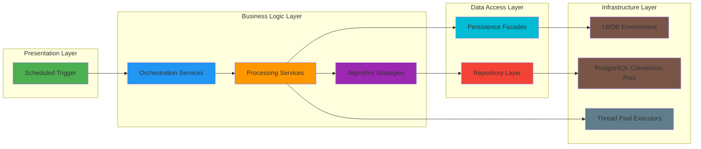

---

## 3. Component Design

### 3.1 Scheduler Component

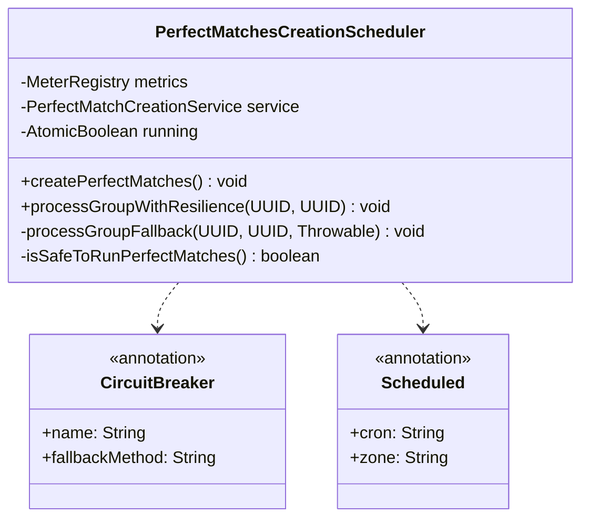

**Responsibilities:**
- Trigger scheduled execution at configured cron time
- Prevent concurrent runs using `AtomicBoolean`
- Apply circuit breaker pattern for resilience
- Collect metrics for monitoring

**Key Design Decisions:**
- **Single-run guarantee**: `compareAndSet` ensures only one execution at a time
- **Async processing**: Uses `CompletableFuture.allOf` to process groups concurrently
- **Self-injection**: Uses `@Lazy` self-reference for AOP proxy (circuit breaker)

### 3.2 Service Orchestration Component

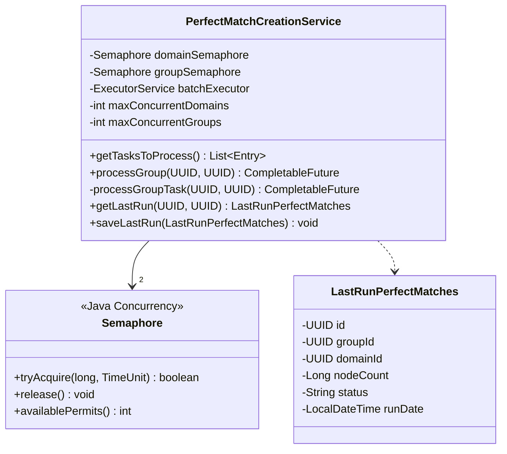

**Concurrency Control:**
```java
// Two-level semaphore hierarchy
domainSemaphore (permits=2)  // Max 2 domains concurrently
    ├─> groupSemaphore (permits=1)  // Max 1 group per domain
```

**Task Selection Logic:**
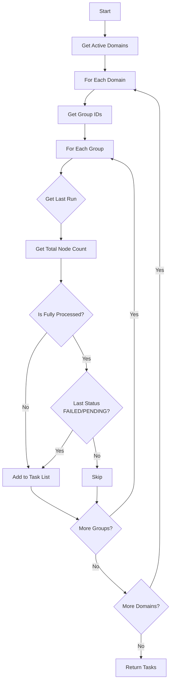

### 3.3 Job Executor Component

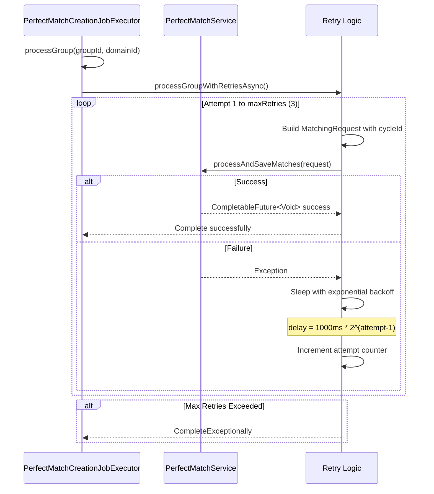

**Retry Strategy:**
| Attempt | Delay     | Formula                    |
|---------|-----------|----------------------------|
| 1       | 0ms       | Initial attempt            |
| 2       | 1000ms    | 1000 * 2^0                |
| 3       | 2000ms    | 1000 * 2^1                |
| Failure | -         | CompleteExceptionally      |

### 3.4 Processing Engine Component

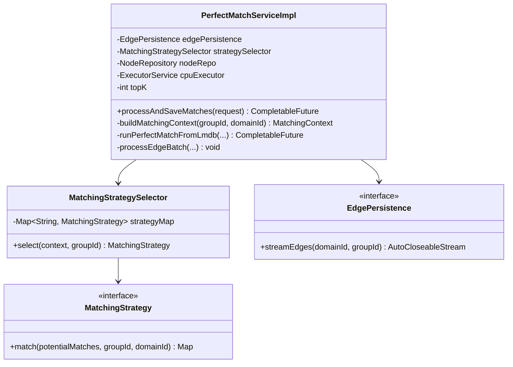

**Processing Pipeline:**

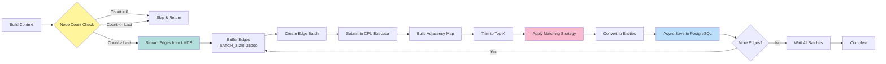

---

## 4. Data Flow

### 4.1 End-to-End Data Flow

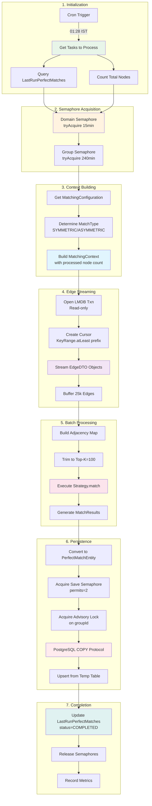

### 4.2 Edge Streaming Detail

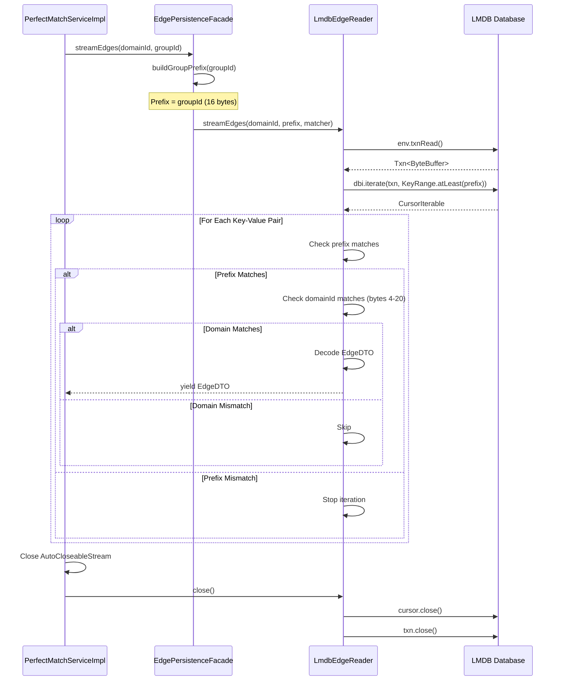

**LMDB Key Structure:**
```
┌─────────────────┬─────────────────┬─────────────────────┐
│   Group ID      │   Cycle Hash    │   Node Pair Hash    │
│   16 bytes      │   32 bytes      │   32 bytes          │
│   (2 longs)     │   (SHA-256)     │   (SHA-256)         │
└─────────────────┴─────────────────┴─────────────────────┘
      UUID           cycleId hash      sorted(a,b) hash
   MSB + LSB        deterministic     deterministic
```

**LMDB Value Structure:**
```
┌────────┬─────────────┬──────────┬──────────┬────────┬──────────┬────────┐
│ Score  │  Domain ID  │ FromLen  │ FromHash │ ToLen  │ ToHash   │        │
│ 4 byte │  16 bytes   │ 4 bytes  │ N bytes  │4 bytes │ M bytes  │        │
│ float  │   UUID      │  int     │  UTF-8   │ int    │  UTF-8   │        │
└────────┴─────────────┴──────────┴──────────┴────────┴──────────┴────────┘
```

### 4.3 Matching Algorithm Flow

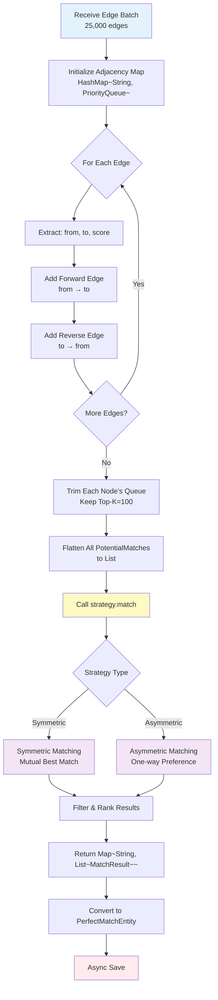

---

## 5. Concurrency Model

### 5.1 Thread Pool Architecture

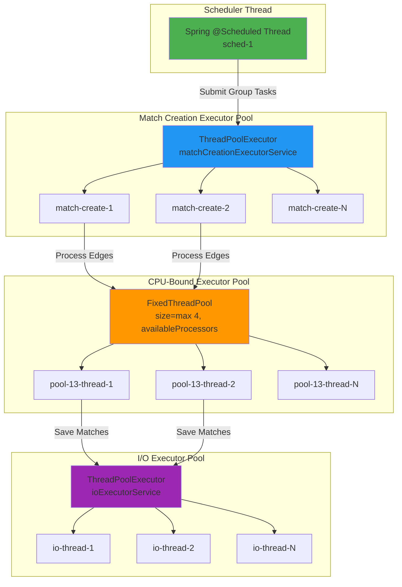

### 5.2 Semaphore Control Flow

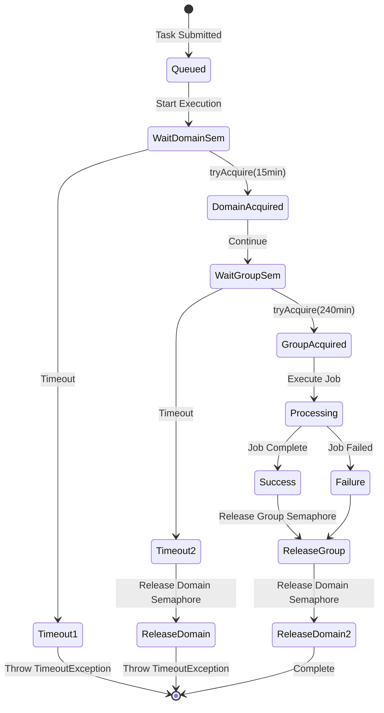

**Semaphore Configuration:**

| Semaphore | Permits | Timeout | Purpose |
|-----------|---------|---------|---------|
| `domainSemaphore` | 2 | 15 min | Limit concurrent domains |
| `groupSemaphore` | 1 | 240 min | Serialize groups per domain |
| `saveSemaphore` | 2 | N/A | Limit concurrent DB writes |
| `storageSemaphore` | 16 | N/A | Limit storage processor concurrency |

### 5.3 Concurrency Patterns

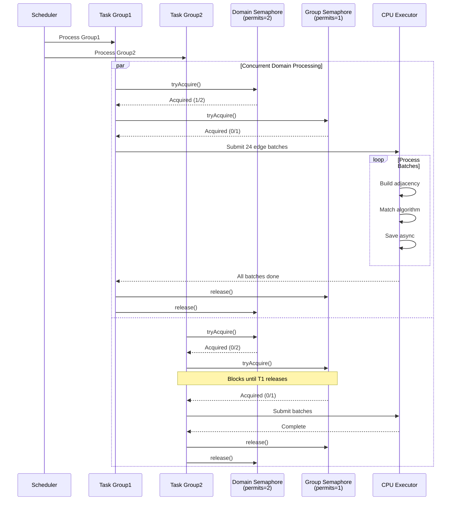

---

## 6. Error Handling & Resilience

### 6.1 Resilience Architecture

```mermaid
graph TB
    subgraph "Layer 1: Circuit Breaker"
        CB[Resilience4j CircuitBreaker<br/>perfectMatchesGroup]
        CB -->|Open| FB1[Fallback: Update Status FAILED]
        CB -->|Half-Open| RETRY1[Allow Limited Requests]
        CB -->|Closed| PROCEED1[Normal Processing]
    end
    
    subgraph "Layer 2: Retry Mechanism"
        RT[Exponential Backoff Retry<br/>maxAttempts=3]
        RT -->|Attempt 1| EXEC1[Execute]
        RT -->|Attempt 2<br/>delay=1s| EXEC2[Execute]
        RT -->|Attempt 3<br/>delay=2s| EXEC3[Execute]
        EXEC3 -->|Still Fails| FB2[CompleteExceptionally]
    end
    
    subgraph "Layer 3: Timeout Protection"
        TO[CompletableFuture Timeout]
        TO -->|Semaphore: 15min| TO1[Domain Lock Timeout]
        TO -->|Semaphore: 240min| TO2[Group Lock Timeout]
        TO -->|Save: 30min| TO3[Storage Timeout]
    end
    
    subgraph "Layer 4: Database Resilience"
        DB[Database Layer]
        DB -->|Deadlock| DBR[@Retryable with backoff]
        DB -->|Advisory Lock| AL[PostgreSQL pg_try_advisory_lock]
        DB -->|COPY Failure| CANCEL[CopyIn.cancelCopy]
    end
    
    PROCEED1 --> RT
    RT --> TO
    TO --> DB
    
    style CB fill:#FFCDD2
    style RT fill:#F8BBD0
    style TO fill:#E1BEE7
    style DB fill:#C5CAE9
```

### 6.2 Error Handling Flow

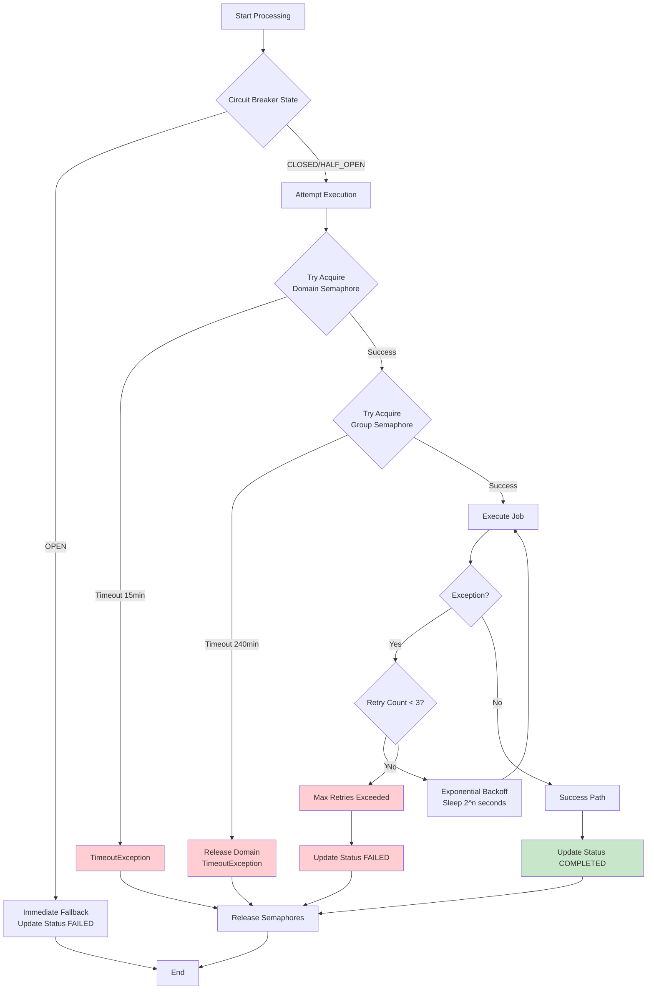

### 6.3 Exception Hierarchy

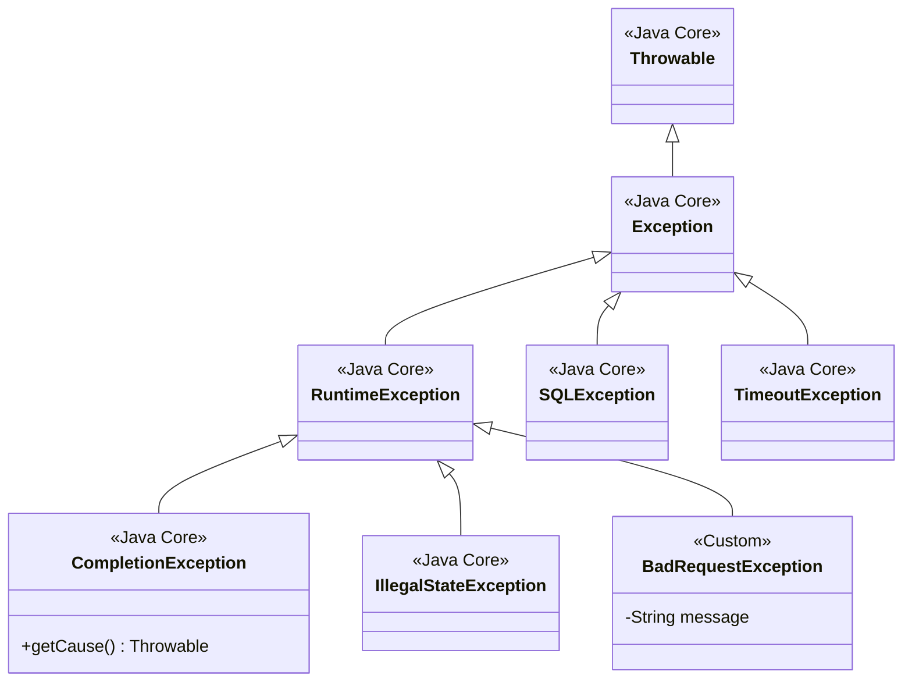

**Exception Handling Strategy:**

| Exception Type | Handling Strategy | Retry | Fallback |
|----------------|-------------------|-------|----------|
| `TimeoutException` | Release semaphores, log error | No | Set status FAILED |
| `SQLException` (Deadlock) | `@Retryable` with backoff | Yes (3x) | Rollback transaction |
| `CompletionException` | Unwrap cause, log, propagate | Depends on cause | Circuit breaker fallback |
| `InterruptedException` | Restore interrupt flag, fail fast | No | Set status FAILED |
| `IllegalStateException` | Log error, complete exceptionally | No | Return empty result |

---

## 7. Performance Optimization

### 7.1 Batch Processing Strategy

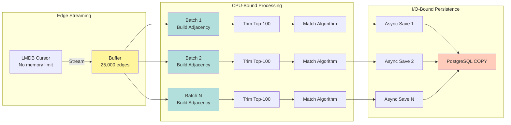

### 7.2 Memory Management

**Heap Memory Profile:**

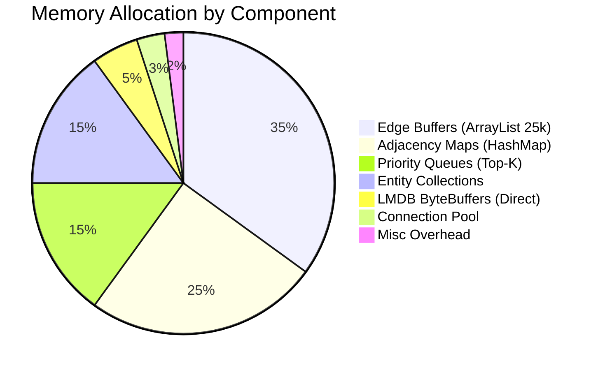

**Memory Optimization Techniques:**

| Technique | Implementation | Benefit |
|-----------|----------------|---------|
| **Direct ByteBuffers** | LMDB `ThreadLocal<ByteBuffer>` | Off-heap, no GC pressure |
| **Batch Clearing** | `buffer.clear()` after copy | Reuse ArrayList capacity |
| **Priority Queue Trimming** | `while (pq.size() > topK) pq.poll()` | Cap memory per node |
| **Stream Processing** | `AutoCloseableStream` | No full graph in memory |
| **Copy-on-Submit** | `List.copyOf(buffer)` | Immutable batches |

### 7.3 Database Optimization

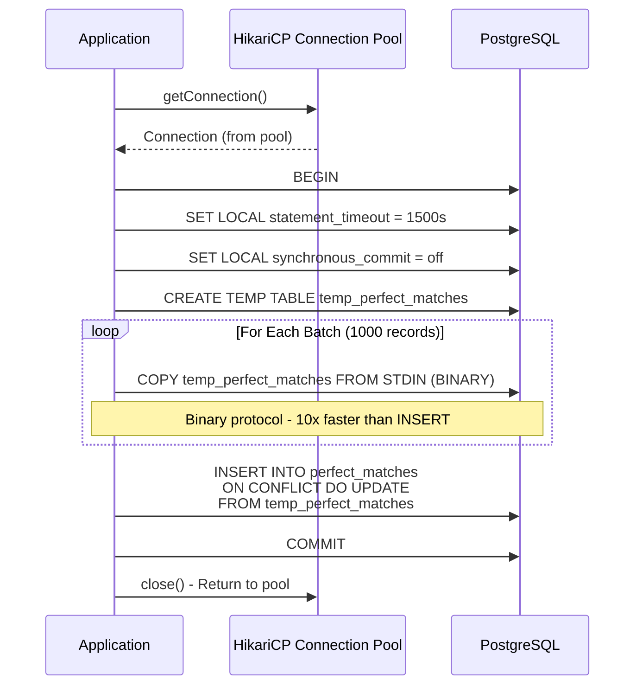

**PostgreSQL Optimizations:**

| Setting | Value | Impact |
|---------|-------|--------|
| `synchronous_commit` | `off` | 2-3x write throughput |
| `statement_timeout` | `1500s` | Prevent indefinite locks |
| `lock_timeout` | `10s` | Fast-fail on contention |
| Binary COPY | Enabled | 10x faster than text INSERT |
| Advisory Locks | Group-level | Prevent concurrent writes |
| Temp Tables | Session-scoped | No WAL overhead |

### 7.4 Throughput Metrics

**Target Performance:**

```
┌─────────────────────────────────────────────────────────┐
│ Metric                    │ Value                       │
├───────────────────────────┼─────────────────────────────┤
│ Edge Stream Rate          │ ~70,000 edges/sec          │
│ Batch Processing          │ 25,000 edges/batch         │
│ Concurrent Batches        │ 4-16 (CPU-bound)           │
│ Match Generation Rate     │ ~50,000 matches/sec        │
│ DB Write Rate             │ ~30,000 inserts/sec (COPY) │
│ End-to-End Latency        │ ~10 sec for 577k edges     │
│ Memory Footprint          │ <2GB heap per group        │
└─────────────────────────────────────────────────────────┘
```

---

## 8. Database Design

### 8.1 Schema Design

```mermaid
erDiagram
    PERFECT_MATCHES ||--o{ LAST_RUN_PERFECT_MATCHES : tracks
    PERFECT_MATCHES ||--|| MATCHING_GROUPS : belongs_to
    MATCHING_GROUPS ||--|| MATCHING_CONFIGURATIONS : has
    MATCHING_CONFIGURATIONS ||--|| ALGORITHMS : uses
    
    PERFECT_MATCHES {
        uuid id PK
        uuid group_id FK
        uuid domain_id
        uuid processing_cycle_id
        string reference_id
        string matched_reference_id
        float compatibility_score
        timestamp matched_at
        index idx_group_domain
        index idx_reference
        unique uq_group_ref_matched
    }
    
    LAST_RUN_PERFECT_MATCHES {
        uuid id PK
        uuid group_id FK
        uuid domain_id
        bigint node_count
        string status
        timestamp run_date
        unique uq_domain_group
    }
    
    MATCHING_GROUPS {
        uuid id PK
        uuid domain_id
        string name
        boolean cost_based
        string industry
        boolean active
    }
    
    MATCHING_CONFIGURATIONS {
        uuid id PK
        uuid group_id FK
        uuid algorithm_id FK
        int priority
        jsonb config_params
    }
    
    ALGORITHMS {
        string id PK
        string name
        string description
        string strategy_class
    }
```

### 8.2 Index Strategy

```sql
-- Primary lookup patterns
CREATE INDEX CONCURRENTLY idx_pm_group_domain 
    ON perfect_matches(group_id, domain_id);

CREATE INDEX CONCURRENTLY idx_pm_reference 
    ON perfect_matches(reference_id) 
    WHERE matched_at > NOW() - INTERVAL '30 days';

CREATE INDEX CONCURRENTLY idx_pm_cycle 
    ON perfect_matches(processing_cycle_id);

-- Prevent duplicates
CREATE UNIQUE INDEX uq_pm_group_ref_matched 
    ON perfect_matches(group_id, reference_id, matched_reference_id);

-- Last run tracking
CREATE UNIQUE INDEX uq_last_run_domain_group 
    ON last_run_perfect_matches(domain_id, group_id);

-- Partial index for active groups
CREATE INDEX idx_groups_active 
    ON matching_groups(domain_id, id) 
    WHERE active = true;
```

### 8.3 Transaction Isolation

```mermaid
sequenceDiagram
    participant T1 as Transaction 1<br/>(Group A)
    participant T2 as Transaction 2<br/>(Group A)
    participant PG as PostgreSQL
    
    T1->>PG: SELECT pg_try_advisory_lock('group-a-hash')
    PG-->>T1: true (lock acquired)
    
    T2->>PG: SELECT pg_try_advisory_lock('group-a-hash')
    PG-->>T2: false (lock held by T1)
    T2->>T2: Wait or fail
    
    T1->>PG: BEGIN
    T1->>PG: COPY temp_perfect_matches
    T1->>PG: INSERT ... ON CONFLICT DO UPDATE
    T1->>PG: COMMIT
    T1->>PG: RESET ALL (releases advisory lock)
    
    Note over T2: T1 committed, lock released
    T2->>PG: SELECT pg_try_advisory_lock('group-a-hash')
    PG-->>T2: true (lock acquired)
```

**Lock Hierarchy:**

```
Application Semaphores (JVM-level)
    ↓
PostgreSQL Advisory Locks (DB-level)
    ↓
Row-level Locks (Automatic)
```

---

## 9. Monitoring & Observability

### 9.1 Metrics Collection

```mermaid
graph TB
    subgraph "Application Metrics"
        M1[perfect_match_duration_seconds<br/>Timer]
        M2[perfect_matches_saved_total<br/>Counter]
        M3[perfect_match_batch_errors<br/>Counter]
        M4[retry_attempts_total<br/>Counter]
        M5[max_retries_exceeded<br/>Counter]
    end
    
    subgraph "JVM Metrics"
        J1[jvm_memory_used_bytes<br/>Gauge]
        J2[jvm_gc_pause_seconds<br/>Timer]
        J3[jvm_threads_states<br/>Gauge]
    end
    
    subgraph "System Metrics"
        S1[system_cpu_usage<br/>Gauge]
        S2[process_cpu_usage<br/>Gauge]
        S3[hikaricp_connections_active<br/>Gauge]
    end
    
    M1 --> REG[MeterRegistry]
    M2 --> REG
    M3 --> REG
    M4 --> REG
    M5 --> REG
    J1 --> REG
    J2 --> REG
    J3 --> REG
    S1 --> REG
    S2 --> REG
    S3 --> REG
    
    REG --> PROM[Prometheus Exporter]
    PROM --> GRAF[Grafana Dashboards]
    
    style REG fill:#4CAF50
    style PROM fill:#FF5722
    style GRAF fill:#2196F3
```

### 9.2 Key Metrics

| Metric Name | Type | Labels | Purpose |
|-------------|------|--------|---------|
| `perfect_match_duration_seconds` | Timer | groupId, domainId, cycleId, status | End-to-end latency |
| `perfect_matches_saved_total` | Counter | groupId, domainId, cycleId | Throughput tracking |
| `perfect_match_batch_errors` | Counter | groupId, domainId, cycleId | Error rate |
| `retry_attempts_total` | Counter | groupId, domainId, attempt, errorType | Retry frequency |
| `batch_perfect_matches_duration` | Timer | groupId, domainId | Per-batch timing |
| `hikaricp_connections_active` | Gauge | pool | DB connection usage |

### 9.3 Logging Strategy

```
┌─────────────────────────────────────────────────────────────┐
│ Log Level │ Event                                           │
├───────────┼─────────────────────────────────────────────────┤
│ INFO      │ - Job start/completion                          │
│           │ - Semaphore acquisition/release                 │
│           │ - Batch submission counts                       │
│           │ - Match save confirmations                      │
├───────────┼─────────────────────────────────────────────────┤
│ WARN      │ - Node count = 0                                │
│           │ - Retry attempts                                │
│           │ - Slow queries (>1s)                            │
├───────────┼─────────────────────────────────────────────────┤
│ ERROR     │ - Semaphore timeout                             │
│           │ - Max retries exceeded                          │
│           │ - Database failures                             │
│           │ - COPY protocol errors                          │
├───────────┼─────────────────────────────────────────────────┤
│ DEBUG     │ - Individual batch processing                   │
│           │ - Edge iteration details                        │
│           │ - Match result details                          │
└─────────────────────────────────────────────────────────────┘
```

---

## 10. Deployment Considerations

### 10.1 Configuration Properties

```yaml
# Scheduling
scheduling:
  perfect-match:
    cron: "0 28 1 * * *"  # 01:28 IST daily
    zone: "Asia/Kolkata"

# Concurrency Control
match:
  max-concurrent-domains: 2
  max-concurrent-groups: 1
  max-retries: 3
  retry-delay-millis: 1000

# Processing
matching:
  topk:
    count: 100

perfectmatch:
  node-stability-minutes: 10

# Database
import:
  batch-size: 1000

spring:
  datasource:
    hikari:
      maximum-pool-size: 20
      minimum-idle: 5
      connection-timeout: 30000
      idle-timeout: 600000
      max-lifetime: 1800000

# Resilience4j
resilience4j:
  circuitbreaker:
    instances:
      perfectMatchesGroup:
        failure-rate-threshold: 50
        wait-duration-in-open-state: 60s
        sliding-window-size: 10
        permitted-number-of-calls-in-half-open-state: 3
```

### 10.2 Resource Requirements

```
┌────────────────────────────────────────────────────┐
│ Resource          │ Minimum    │ Recommended      │
├───────────────────┼────────────┼──────────────────┤
│ JVM Heap          │ 4GB        │ 8GB              │
│ CPU Cores         │ 4          │ 8-16             │
│ LMDB Disk         │ 50GB SSD   │ 200GB NVMe       │
│ PostgreSQL        │ 16GB RAM   │ 32GB RAM         │
│ Network           │ 1 Gbps     │ 10 Gbps          │
│ Connection Pool   │ 10 conns   │ 20 conns         │
└────────────────────────────────────────────────────┘
```

---

## 11. Future Enhancements

1. **Distributed Processing**: Implement Apache Kafka for task distribution across multiple nodes
2. **Incremental Updates**: Delta processing instead of full recomputation
3. **Caching Layer**: Redis for frequently accessed match results
4. **ML Integration**: Use machine learning models for match scoring
5. **Real-time Streaming**: Kafka Streams for continuous match updates
6. **GraphQL API**: Query interface for match exploration
7. **A/B Testing**: Framework for algorithm comparison

---

## Appendix A: Sequence Diagram - Complete Flow

```mermaid
sequenceDiagram
    autonumber
    participant SCH as Scheduler
    participant SVC as CreationService
    participant EXE as JobExecutor
    participant IMPL as ServiceImpl
    participant EDGE as EdgePersistence
    participant LMDB as LMDB Store
    participant STRAT as MatchingStrategy
    participant SAVER as MatchSaver
    participant STORE as StorageProcessor
    participant PG as PostgreSQL
    
    SCH->>SCH: @Scheduled Trigger (01:28 IST)
    SCH->>SVC: getTasksToProcess()
    SVC->>PG: Query LastRunPerfectMatches
    SVC->>PG: Count Nodes
    PG-->>SVC: Tasks List
    
    loop For Each Group
        SCH->>SVC: processGroup(groupId, domainId)
        SVC->>SVC: tryAcquire domainSemaphore (15min)
        SVC->>SVC: tryAcquire groupSemaphore (240min)
        
        SVC->>EXE: processGroup(groupId, domainId)
        
        loop Retry up to 3 times
            EXE->>IMPL: processAndSaveMatches(request)
            IMPL->>PG: Get LastRun & Node Count
            
            alt Node Count > Last Processed
                IMPL->>EDGE: streamEdges(domainId, groupId)
                EDGE->>LMDB: Open Txn, Create Cursor
                
                loop Stream Edges
                    LMDB-->>EDGE: EdgeDTO
                    EDGE-->>IMPL: EdgeDTO
                    IMPL->>IMPL: Buffer until 25k
                    
                    alt Buffer Full
                        IMPL->>IMPL: Submit Batch to cpuExecutor
                        
                        par Process Batch
                            IMPL->>IMPL: Build Adjacency Map
                            IMPL->>IMPL: Trim to Top-K
                            IMPL->>STRAT: match(potentialMatches)
                            STRAT-->>IMPL: Map<String, List<MatchResult>>
                            IMPL->>IMPL: Convert to Entities
                            IMPL->>SAVER: saveMatchesAsync()
                            
                            SAVER->>STORE: savePerfectMatches()
                            STORE->>PG: Acquire Advisory Lock
                            STORE->>PG: CREATE TEMP TABLE
                            STORE->>PG: COPY Binary Data
                            STORE->>PG: UPSERT from Temp
                            STORE->>PG: COMMIT
                            STORE->>PG: Release Advisory Lock
                        end
                    end
                end
                
                IMPL->>IMPL: Wait for all batches
                IMPL-->>EXE: Success
                EXE-->>SVC: Success
            else
                IMPL-->>EXE: Skip (no new nodes)
            end
        end
        
        SVC->>PG: Update LastRun (status=COMPLETED)
        SVC->>SVC: Release groupSemaphore
        SVC->>SVC: Release domainSemaphore
    end
    
    SCH->>SCH: Job Complete
```

---