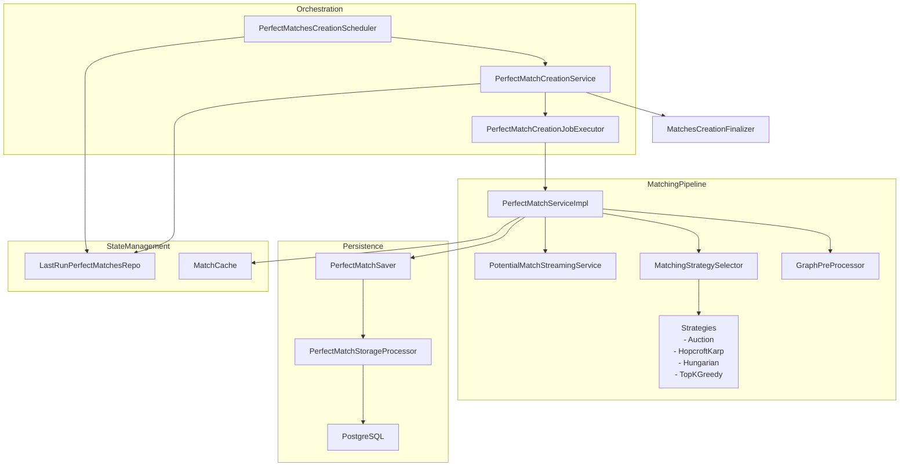
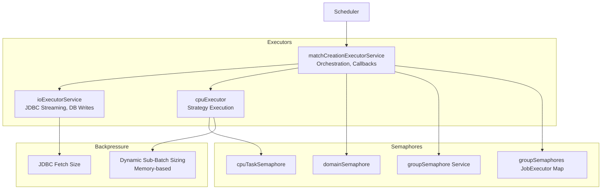
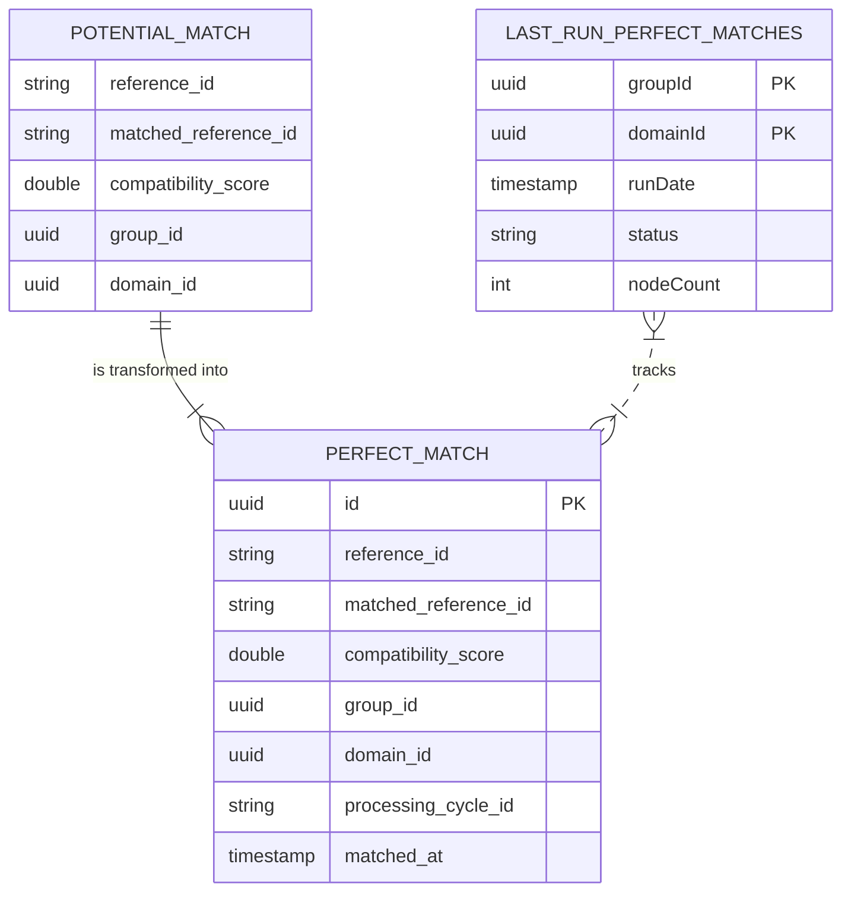
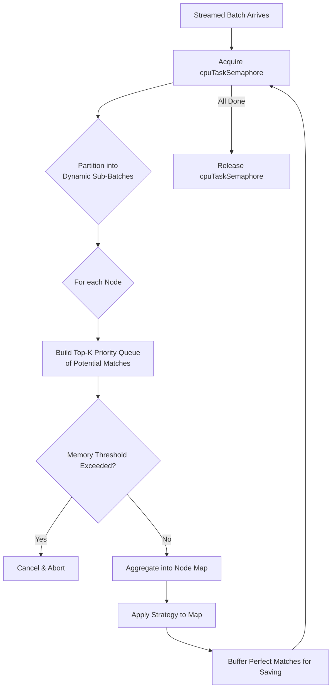
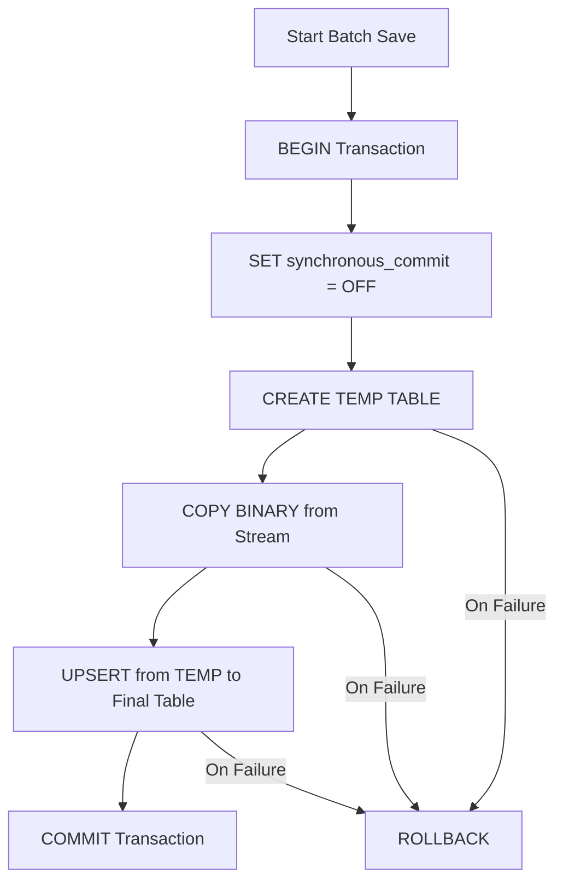
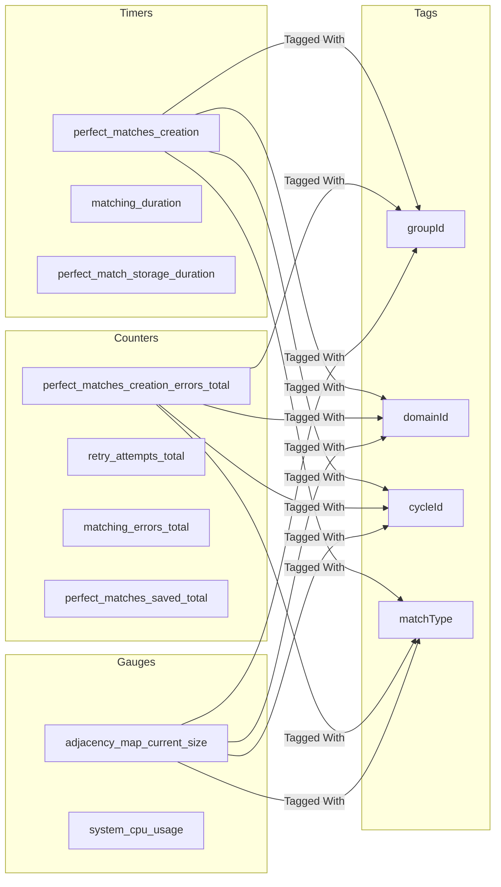
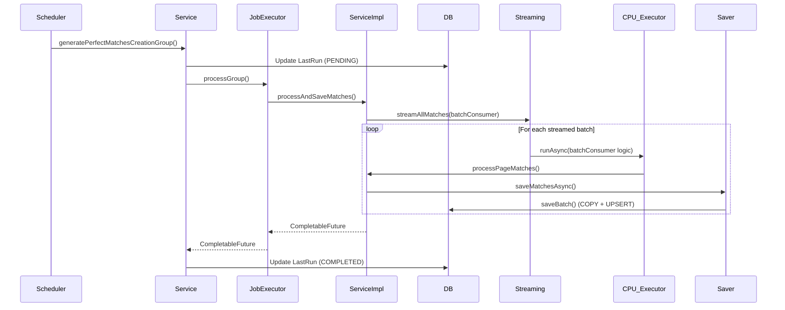
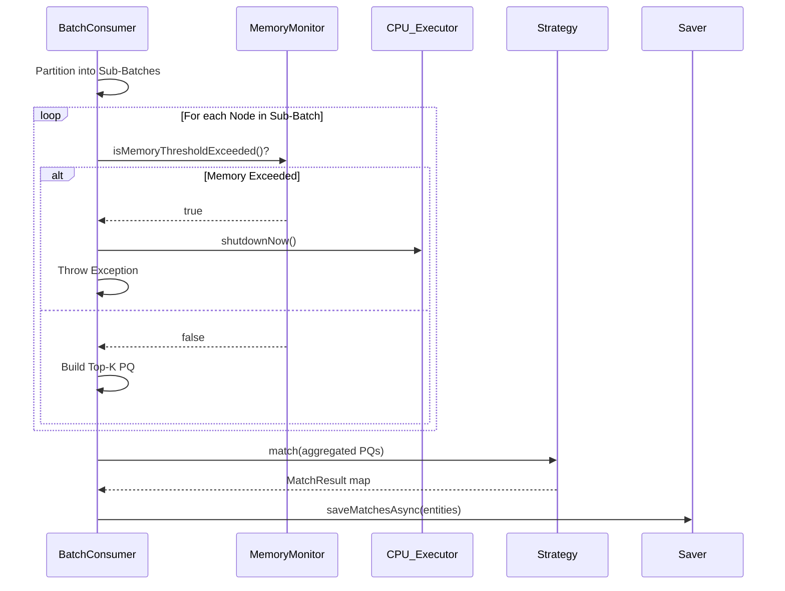
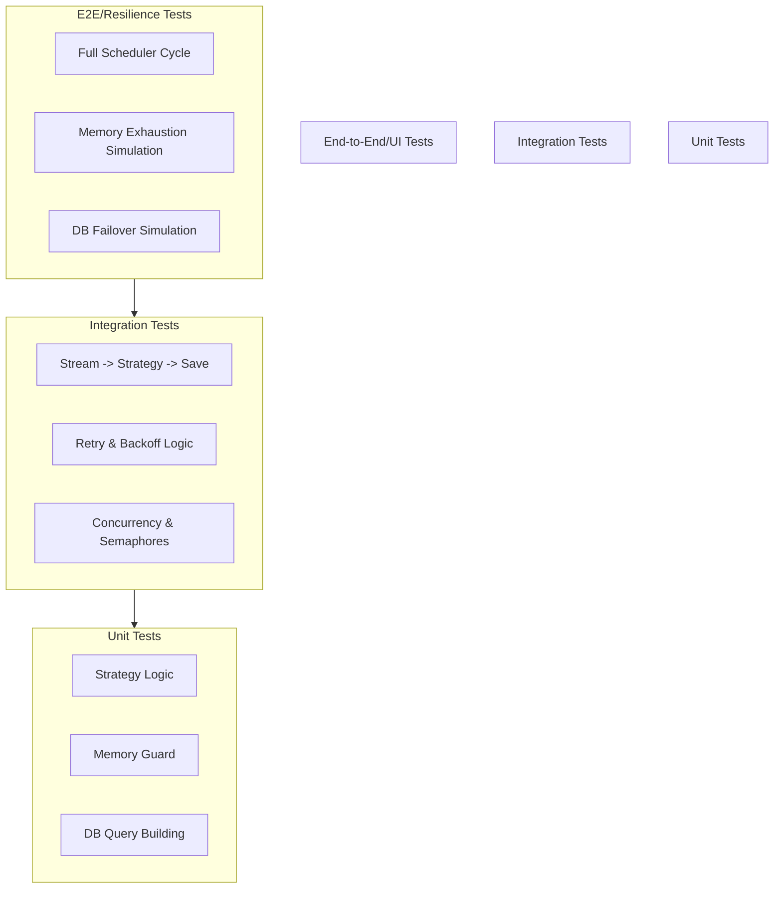

---
# Scheduled Perfect Matches Creation — Low‑Level Design (LLD) with Diagrams

## Table of Contents
- [1. Modules and Relationships](#1-modules-and-relationships)
- [2. Runtime Topology (Threads, Semaphores, Concurrency)](#2-runtime-topology-threads-semaphores-concurrency)
- [3. Detailed Component Specs](#3-detailed-component-specs)
- [4. Data Model](#4-data-model)
- [5. Key Algorithms & Pseudocode](#5-key-algorithms--pseudocode)
- [6. Error Handling, Timeouts, Retries](#6-error-handling-timeouts-retries)
- [7. Metrics and Logging](#7-metrics-and-logging)
- [8. Configuration Matrix](#8-configuration-matrix)
- [9. Execution Sequences](#9-execution-sequences)
- [10. External Contracts and Assumptions](#10-external-contracts-and-assumptions)
- [11. Risks, Nuances, Recommendations](#11-risks-nuances-recommendations)
- [12. Testing Strategy](#12-testing-strategy)

---

## 1. Modules and Relationships

### Module Relationship Diagram


- **Orchestration**: `PerfectMatchesCreationScheduler` → `PerfectMatchCreationService` → `PerfectMatchCreationJobExecutor`
- **Matching Pipeline**: `PerfectMatchServiceImpl` → `MatchingStrategySelector` → `MatchingStrategy`
- **Data Access & Persistence**:
    - `PotentialMatchStreamingService` (read `PotentialMatchEntity` stream)
    - `PerfectMatchSaver` → `PerfectMatchStorageProcessor` (save `PerfectMatchEntity`)
- **Utilities/Supporting**:
    - `GraphPreProcessor.determineMatchType` (type inference)
    - `MatchesCreationFinalizer` (signal end-of-batch)
    - `MatchCache.clearMatches(groupId)` at start of per-group run

---

## 2. Runtime Topology (Threads, Semaphores, Concurrency)

### Runtime Topology Diagram


- **Executors**:
    - `matchCreationExecutorService`: Orchestration, job executor callbacks
    - `ioExecutorService`: JDBC streaming and storage writer
    - `cpuExecutor`: CPU-bound sub-batch processing and strategy execution
- **Semaphores**:
    - `PerfectMatchCreationService`: `domainSemaphore` (fair), `groupSemaphore` (fair)
    - `PerfectMatchCreationJobExecutor`: Per-group semaphore map (`maxConcurrentGroups`)
    - `PerfectMatchServiceImpl`: `cpuTaskSemaphore` ≈ 2 × `availableProcessors`
- **Acquisition Order (to avoid deadlocks)**:
    1. `domainSemaphore`
    2. `groupSemaphore` (service level)
    3. `JobExecutor groupSemaphore` (per-group map)
    4. `cpuTaskSemaphore` (per streamed batch)
- **Backpressure & Memory**:
    - Stream fetch size (`BATCH_SIZE_FROM_CURSOR`)
    - Dynamic sub-batch sizing (based on live memory usage vs `matching.max.memory.mb` × `threshold`)
    - `NODES_PER_PROCESSING_BATCH`, `MAX_NODES_PER_BATCH`, `maxMatchesPerNode`

---

## 3. Detailed Component Specs

### 3.1 PerfectMatchesCreationScheduler
- **Schedule**: `@Scheduled(cron = "0 0 3 * * *", zone = "Asia/Kolkata")`
- **Flow**:
    - Start timer `perfect_matches_creation`.
    - `tasks = perfectMatchCreationService.getTasksToProcess()`.
    - For each task (domain, group): `generatePerfectMatchesCreationGroup(groupId, domainId)`
        - `@Retry/@CircuitBreaker` guarded.
        - Inside: Update `LastRun` to `PENDING`; clear cache; `perfectMatchCreationService.processAllDomains()`; update `LastRun` to `COMPLETED` with processed count.
- **Fallback**: Marks `lastRun` `FAILED`.
- **Metrics**: `perfect_matches_creation` timer, `perfect_matches_creation_errors_total`, `perfect_matches_creation_fallback`.

### 3.2 PerfectMatchCreationService
- **Responsibilities**:
    - Discover tasks: For active domains/groups, compute `shouldProcess`: `processedNodes > lastRun.nodeCount` OR `lastRun.status` ∈ `{PENDING, FAILED, null}`.
    - Maintain `LastRunPerfectMatches` (read/write).
    - Concurrency: `domainSemaphore(maxConcurrentDomains)`, `groupSemaphore(maxConcurrentGroups)`.
    - Orchestrate a "perfect-match batch" for all eligible tasks.
- **`processAllDomains`**:
    - New `cycleId`; build task list; submit `processGroupTask` for each.
    - Wait for all, then `MatchesCreationFinalizer.finalize(true)`.
- **`processGroupTask(groupId, domainId, cycleId)`**:
    - `LastRun := PENDING`.
    - Acquire `domainSemaphore` (3 min) → `groupSemaphore` (3 min).
    - `jobExecutor.processGroup(...).thenRunAsync`: update `LastRun` to `COMPLETED`.
    - Release semaphores; on exception: `matches_creation_error` counter, `LastRun := FAILED`.
- **Metrics**: `batch_perfect_matches_total_duration`, `batch_perfect_matches_duration`, `task_processing_duration`.

### 3.3 PerfectMatchCreationJobExecutor
- **`processGroup(groupId, domainId, cycleId)` → `CompletableFuture<Void>`**:
    - Per-group semaphore (`groupSemaphores` map); acquire (60s).
    - `processGroupWithRetriesAsync(...)`: recursive retries with exponential backoff, delegates to `perfectMatchService`.
    - Release semaphore; remove map entry when idle.
- **Metrics**: `semaphore_acquire_timeout`, `group_processing_errors`, `max_retries_exceeded`, `retry_attempts_total`.

### 3.4 PerfectMatchServiceImpl
- **Dependencies**: `PotentialMatchStreamingService`, `PerfectMatchSaver`, `MatchingStrategySelector`, etc.
- **Key Config**: `maxMatchesPerNode`, `maxMemoryMb`, `PAGE_PROCESSING_TIMEOUT_SECONDS`, `SAVE_MATCHES_TIMEOUT_SECONDS`.
- **`processAndSaveMatches(request)`**:
    - Build context (config, match type).
    - `thenCompose → processMatchesWithCursor(...)`.
    - On completion: stop `matching_duration` timer; increment `matching_errors_total` on failure.
- **`processMatchesWithCursor(context, ...)`**:
    - Select `MatchingStrategy`.
    - `PotentialMatchStreamingService.streamAllMatches(..., batchConsumer, ...)`
    - **`batchConsumer`**:
        - Acquire `cpuTaskSemaphore`.
        - For each sub-batch (dynamic size):
            - Group nodes; build priority queues (top-K); aggregate into `nodeMap`.
            - If memory threshold exceeded → `memoryExceeded=true`, cancel futures, `cpuExecutor.shutdownNow`, throw.
            - Periodically, call `processPageMatches(nodeMap, strategy, ...)`.
        - Release `cpuTaskSemaphore`.
        - `orTimeout(PAGE_PROCESSING_TIMEOUT_SECONDS)`.
    - Wait all page futures; on error, cancel others.
- **`processPageMatches(nodeMap, ...)`**:
    - `strategy.match(...)` → `Map<String, List<MatchResult>>`.
    - Buffer `PerfectMatchEntity`; save in batches via `perfectMatchSaver`.
- **Memory Safety**: `adjustBatchSize()`, `isMemoryThresholdExceeded()`.

### 3.5 PotentialMatchStreamingService
- **`streamAllMatches(...)`**:
    - JDBC (forward-only, read-only) with fetch size.
    - Reads rows, validates, buffers, and calls `batchConsumer`.
    - Retries up to 3 times on `SQLException` with incremental sleep.

### 3.6 MatchingStrategySelector
- **`select(context, groupId)`**:
    - Loads `MatchingGroup` and `MatchingConfiguration`.
    - Looks up strategy in `strategyMap` by algorithm name.

### 3.7 Strategies
- **Common Interface**: `match(...)`, `supports(...)`.
- **Implementations**: `AuctionApproximateMatchingStrategy`, `HopcroftKarpMatchingStrategy`, `HungarianMatchingStrategy`, `TopKWeightedGreedyMatchingStrategy`.

### 3.8 PerfectMatchSaver
- **`saveMatchesAsync(...)`**:
    - Delegates to `PerfectMatchStorageProcessor.savePerfectMatches`.
    - Global timeout: 30 minutes.
    - Shutdown guard.

### 3.9 PerfectMatchStorageProcessor
- **`savePerfectMatches(...)`**:
    - Wraps `saveInBatches` on `ioExecutor` with timeout.
    - Partitions into batches and calls `saveBatch`.
- **`saveBatch(...)`**: `[@Transactional, @Retryable]`
    - `SET synchronous_commit = OFF`.
    - Create `TEMP TABLE`, `COPY BINARY`, then `UPSERT` into final table.

### 3.10 GraphPreProcessor.determineMatchType
- Streams one `PotentialMatchEntity`, loads corresponding `Nodes`.
- If node types are equal → `SYMMETRIC`; else `BIPARTITE`.
- Defaults to `BIPARTITE` on any exception.

---

## 4. Data Model

### Data Model Diagram


### Key Entities:
- **PotentialMatchEntity (Input)**: `group_id`, `domain_id`, `reference_id`, `matched_reference_id`, `compatibility_score`.
- **PerfectMatchEntity (Output)**: `id`, `group_id`, `domain_id`, `processing_cycle_id`, `reference_id`, `matched_reference_id`, `compatibility_score`.
- **LastRunPerfectMatches (State)**: `groupId`, `domainId`, `runDate`, `status`, `nodeCount`.

### Recommended Indexes:
```sql
CREATE UNIQUE INDEX idx_perfect_matches_unique
ON perfect_matches (group_id, reference_id, matched_reference_id);

CREATE INDEX idx_perfect_matches_cycle
ON perfect_matches (group_id, domain_id, processing_cycle_id);
```

---

## 5. Key Algorithms & Pseudocode

### Main Orchestration Flow
```mermaid
flowchart TD
    A[Scheduler @ 3 AM] --> B{Get Tasks to Process}
    B --> C{For Each Group}
    C --> D[Update LastRun to PENDING]
    D --> E[Acquire Domain & Group Semaphores]
    E --> F[Execute Job w/ Retries]
    F --> G[Stream Potential Matches]
    G --> H[Process in Sub-Batches (CPU-bound)]
    H --> I[Apply Matching Strategy]
    I --> J[Save Perfect Matches (I/O-bound)]
    J --> K[Update LastRun to COMPLETED]
    K --> L[Release Semaphores]
    
    F -- On Failure --> M[Update LastRun to FAILED]
    M --> L
```

### In-Memory Batch Processing


### High-Performance DB Upsert


---

## 6. Error Handling, Timeouts, Retries

### Error Handling Decision Flow
```mermaid
graph TD
    A[Operation Fails] --> B{Is it a<br>Transient Error?<br>(e.g., SQLException)}
    B -- Yes --> C{Retries Left?}
    C -- Yes --> D[Wait Exponential Backoff]
    D --> E[Retry Operation]
    C -- No --> F[Log Exhaustion & Abort]
    B -- No --> G{Is it a<br>Fatal Error?<br>(e.g., Memory Exceeded)}
    G -- Yes --> H[Cancel All Tasks &<br>Update Status to FAILED]
    G -- No --> I[Log as Unhandled & Abort]
```

- **Scheduler/Service**: `@Retry` and `@CircuitBreaker` per group; fallback updates `LastRun` to `FAILED`.
- **JobExecutor**: Retries with exponential backoff.
- **`PerfectMatchServiceImpl`**: `orTimeout` on CPU tasks and saves; memory guard causes full cancellation.
- **Streaming**: Retries on `SQLException`.
- **Storage**: `@Retryable` `saveBatch` for transient DB errors.

---

## 7. Metrics and Logging

### Metrics Dashboard Overview


- **Timers**: `perfect_matches_creation`, `matching_duration`, `perfect_match_storage_duration`.
- **Counters**: `perfect_matches_creation_errors_total`, `retry_attempts_total`, `matching_errors_total`, `perfect_matches_saved_total`.
- **Gauges**: `adjacency_map_current_size`, `system_cpu_usage`.
- **Logging**: Consistent tags (`groupId`, `domainId`, `cycleId`) are crucial for tracing and debugging.

---

## 8. Configuration Matrix

| Key | Default | Component | Effect |
|---|---:|---|---|
| `cron` | `0 0 3 * * *` | Scheduler | Daily trigger (Asia/Kolkata) |
| `match.max-concurrent-domains` | 2 | Service | Domain-level parallelism |
| `match.max-concurrent-groups` | 1 | Service/JobExecutor | Parallel groups |
| `match.max-retries` | 3 | JobExecutor | Group retries |
| `matching.topk.count` | 100 | Service/Strategies | Top‑K matches per node |
| `matching.max.memory.mb` | 1024 | Service | Memory ceiling for dynamic batching |
| `PAGE_PROCESSING_TIMEOUT_SECONDS` | 300 | Service | CPU batch timeout |
| `BATCH_SIZE_FROM_CURSOR` | 5000 | Streaming | JDBC fetch size |
| `import.batch-size` | 1000 | Storage | COPY/upsert batch size |

---

## 9. Execution Sequences

### 9.1 End-to-End Group Processing Sequence


### 9.2 Memory-Guarded Batch Processing


---

## 10. External Contracts and Assumptions
- **Repositories**: `DomainService`, `MatchingGroupRepository`, `LastRunPerfectMatchesRepository`, `NodeRepository`, `MatchingConfigurationRepository`.
- **Utilities**: `GraphPreProcessor`, `QueryUtils`, `GraphRequestFactory`.
- **Serializers**: `PerfectMatchSerializer` for `COPY BINARY`.
- **Assumptions**:
    - The `potential_matches` table is populated and finalized before this job runs.
    - PostgreSQL is the target database, supporting `COPY BINARY` and `TEMP` tables.
    - The scheduler timezone (`Asia/Kolkata`) is correctly configured on the host.

---

## 11. Risks, Nuances, Recommendations
- **Duplicate Orchestration**: The scheduler's loop (`generatePerfectMatchesCreationGroup`) and the service's `processAllDomains` might lead to redundant processing. **Recommendation**: Refactor to have `processAllDomains` called only once per schedule.
- **Over-Constrained Concurrency**: Having two layers of `groupSemaphore`s could be confusing and overly restrictive. **Recommendation**: Simplify to a single group-level semaphore.
- **`cpuExecutor.shutdownNow()`**: This is a harsh measure that affects all tasks on the executor. **Recommendation**: Ensure this executor is *exclusively* for this module, or use task-level cancellation tokens instead.
- **Unused Semaphore**: The `PerfectMatchSaver.saveSemaphore` is declared but not used. **Recommendation**: Implement it to provide write backpressure or remove it.

---

## 12. Testing Strategy

### Testing Pyramid


- **Unit**: Test individual strategy logic, memory guard triggers, and `saveBatch` SQL generation.
- **Integration**: Verify the full pipeline for a single group (stream → strategy → save), test retry mechanisms, and validate semaphore behavior.
- **Performance**: Use large `potential_matches` data sets to tune batch sizes and observe memory usage.
- **Resilience**: Simulate `memoryExceeded` scenarios, kill executors mid-run, and test DB failover to ensure the system recovers gracefully.