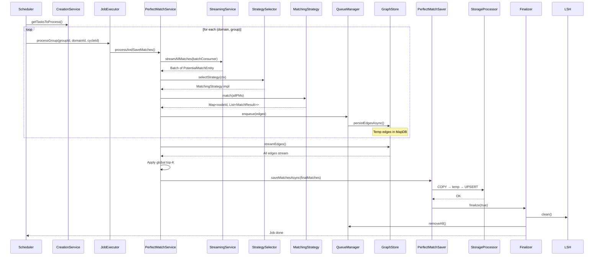
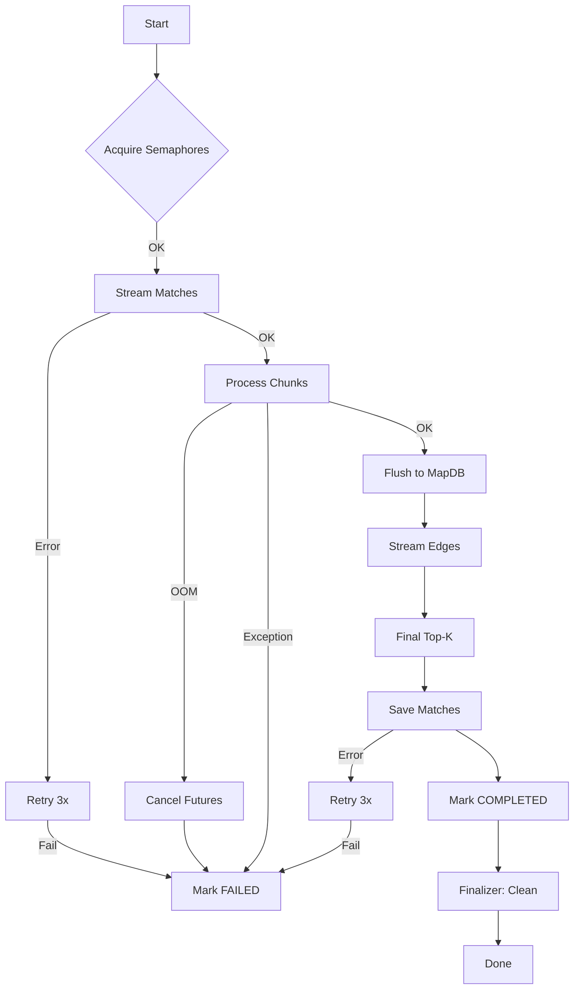

# Perfect‑Matches Creation Module – Low‑Level Design (LLD)

> **Goal** – Produce a *deterministic, high‑quality* set of **perfect matches** (the “gold‑standard” matches) for every active `groupId` / `domainId` pair every night.  
> The flow is similar to the “potential‑matches” pipeline but adds **strict top‑K per node**, **strategy‑driven graph processing**, and a **stream‑save** pattern that works on *already‑persisted* potential‑match data.

---

## High‑Level Overview

```mermaid
graph TD
    S[PerfectMatchesCreationScheduler<br/>(cron 03:00 IST)] -->|tasks| SC[PerfectMatchCreationService]
    SC -->|domain/group semaphores| PEX[PerfectMatchCreationJobExecutor]
    PEX -->|processGroup| PMS[PerfectMatchServiceImpl]
    PMS -->|stream potential matches| PSS[PerfectMatchStreamingService]
    PSS -->|batch → Consumer| PMS
    PMS -->|select strategy| MSS[MatchingStrategySelector]
    MSS -->|strategy| MS[MatchingStrategy<br/>(Greedy, Hungarian, etc)]
    MS -->|graph → top-K| PMR[PerfectMatchResultBuilder]
    PMR -->|buffer| QM[QueueManager<br/>(reused from potenial-matches)]
    QM -->|periodic flush| GS[GraphStore<br/>(MapDB temporary edge store)]
    GS -->|final stream| PMS2[PerfectMatchServiceImpl<br/>(final-stage)]
    PMS2 -->|save final top-K| PMSV[PerfectMatchSaver]
    PMSV -->|COPY/UPSERT| PMST[PerfectMatchStorageProcessor<br/>→ PostgreSQL]
    PMST -->|metrics / cleanup| FM[MatchesCreationFinalizer]
    FM -->|clean LSH, queues, GC| LSH[LSHIndex<br/>(shared with potential-matches)]
```

> **Note**: The **perfect‑matches** pipeline runs **once per day** (cron) and **only on the leader** (see §9). All components (queues, LSH, MapDB) are **re‑used** from the potential‑matches module for DRYness.

---

## 2️⃣ Component‑by‑Component Deep Dive

| Component | Primary Responsibility | Key Methods | Concurrency Controls | Important Config |
|-----------|------------------------|-------------|----------------------|------------------|
| **PerfectMatchesCreationScheduler** | Top‑level cron driver (`@Scheduled(cron="0 0 3 * * *", zone="Asia/Kolkata")`). Builds `(domain, groupId)` tasks via `PerfectMatchCreationService.getTasksToProcess()`. | `createPerfectMatches()`, `generatePerfectMatchesCreationGroup()` (retry + circuit‑breaker) | None – fires job | `perfect_matches_creation` timer, error counters |
| **PerfectMatchCreationService** | Orchestrates **domain‑ and group‑level throttling**. Creates `cycleId`, launches `CompletableFuture` per group. Persists `LastRunPerfectMatches`. | `getTasksToProcess()`, `processAllDomains()`, `processGroupTask()` | `domainSemaphore` (default: 2)<br>`groupSemaphore` (default: 1) | `match.max-concurrent-domains`, `match.max-concurrent-groups` |
| **PerfectMatchCreationJobExecutor** | Acquires per‑group semaphore and delegates to `PerfectMatchService.processAndSaveMatches()`. Handles retries. | `processGroup()`, `processGroupWithRetriesAsync()` | `groupSemaphores` (per group, max: 1) | `match.max-retries`, `match.retry-delay-millis` |
| **PerfectMatchServiceImpl** | Core **graph‑building + top‑K extraction**. Streams potential matches → chunks → builds adjacency → applies strategy → persists edges → final top‑K → save. | `processAndSaveMatches()`, `processMatchesWithCursor()`, `processPageMatches()` | `cpuTaskSemaphore`<br>`memoryExceeded` flag | `matching.topk.count` (100), `matching.max.memory.mb` (1024) |
| **PerfectMatchStreamingService** | **Streaming SELECT** of potential matches using JDBC cursor (`TYPE_FORWARD_ONLY`). | `streamAllMatches(groupId, domainId, batchConsumer, batchSize)` | Runs in `ioExecutor` | `node-fetch.batch-size`, `node-fetch.future-timeout-seconds` |
| **MatchingStrategySelector** | Selects algorithm (`Greedy`, `Hungarian`, etc.) based on `MatchingConfiguration`. | `select(MatchingContext ctx, UUID groupId)` | Pure lookup | `matching.configuration` table |
| **MatchingStrategy** (interface) | Pluggable algorithms. Receives `List<PotentialMatch>`, returns `Map<nodeId, List<MatchResult>>` (top‑K). | `match(allPMs, groupId, domainId)` | Stateless, runs in `cpuExecutor` | `matching.topk.count` |
| **PerfectMatchSaver** | Forwards batch to `PerfectMatchStorageProcessor`. Bounds concurrent DB‑COPY. | `saveMatchesAsync(...)` | `saveSemaphore` (2 permits) | `import.batch-size` |
| **PerfectMatchStorageProcessor** | **Bulk‑load** via `COPY → temp → UPSERT`. Retries on failure. | `savePerfectMatches(...)` | `ioExecutor` | `import.batch-size`, `SAVE_OPERATION_TIMEOUT_MS` |
| **MatchesCreationFinalizer** | Cleans LSH, queues, forces GC. | `finalize(cycleCompleted)` | Post‑completion | – |
| **QueueManager / Factory** | Buffers matches before MapDB flush. | `enqueue()`, `flushQueueBlocking()` | `periodic, boostedFlushSemaphore` | `match.queue.capacity`, `match.flush.interval-seconds` |
| **GraphStore** | MapDB‑based temporary edge store. | `persistEdgesAsync()`, `streamEdges()`, `cleanEdges()` | `mapdbExecutor`, `commitExecutor` | `mapdb.batch-size`, `mapdb.commit-threads` |

---

## 3️⃣ Data Model Snapshot

```sql
-- Potential matches (input)
CREATE TABLE potential_matches (
    id UUID PRIMARY KEY,
    group_id UUID NOT NULL,
    domain_id UUID NOT NULL,
    processing_cycle_id VARCHAR(36) NOT NULL,
    reference_id VARCHAR(255) NOT NULL,
    matched_reference_id VARCHAR(255) NOT NULL,
    compatibility_score DOUBLE PRECISION NOT NULL,
    matched_at TIMESTAMP NOT NULL,
    UNIQUE (group_id, reference_id, matched_reference_id)
);

-- Perfect matches (output)
CREATE TABLE perfect_matches (
    id UUID PRIMARY KEY,
    group_id UUID NOT NULL,
    domain_id UUID NOT NULL,
    processing_cycle_id VARCHAR(36) NOT NULL,
    reference_id VARCHAR(255) NOT NULL,
    matched_reference_id VARCHAR(255) NOT NULL,
    compatibility_score DOUBLE PRECISION NOT NULL,
    matched_at TIMESTAMP NOT NULL,
    UNIQUE (group_id, reference_id, matched_reference_id)
);

-- Bookkeeping
CREATE TABLE last_run_perfect_matches (
    id UUID PRIMARY KEY,
    group_id UUID NOT NULL,
    domain_id UUID NOT NULL,
    run_date TIMESTAMP,
    node_count BIGINT,
    status VARCHAR(20)  -- PENDING, COMPLETED, FAILED
);
```

> `perfect_matches` is **append‑only**; `UPSERT` ensures idempotence.

---

## 4️⃣ End‑to‑End Sequence (per group)



---

## 5️⃣ Concurrency & Back‑Pressure Model

| Resource | Guard | Max Permits | Purpose |
|--------|-------|-------------|--------|
| `domainSemaphore` | `Semaphore` | 2 | Limit concurrent domains |
| `groupSemaphore` | `Semaphore` | 1 | Exactly-once per group |
| `groupSemaphores` | `ConcurrentMap<UUID, Semaphore>` | 1 per group | Parallel groups |
| `cpuTaskSemaphore` | `Semaphore` | `availableProcessors * 2` | CPU‑bound tasks |
| `saveSemaphore` | `Semaphore` | 2 | Concurrent COPY |
| `periodicFlushSemaphore` | `Semaphore` | 2 | Flush coordination |

**Back‑pressure**:
- Queue > `drainWarningThreshold` → **boosted flush**
- `enqueue()` timeout → drop + metric
- MapDB commit timeout → group **FAILED**

---

## 6️⃣ Fault‑Tolerance & Retry

### Retry Summary

| Layer | Mechanism | Max | Back-off | Fallback |
|------|----------|-----|---------|---------|
| Scheduler | `@Retry` + `@CircuitBreaker` | 3 | Exponential | Mark **FAILED** |
| Executor | Manual loop | `maxRetries` | `delay * 2^n` | Bubble up |
| Streaming | Manual retry | 3 | 1s, 2s, 3s | **FAILED** |
| Storage | `@Retryable` | 3 | 1→2→4s | **FAILED** |

### Failure Flow



---

## 7️⃣ Observability (Micrometer)

| Metric | Tags | Type | Emitted |
|-------|------|------|--------|
| `perfect_matches_creation` | `groupId` | Counter | Success |
| `perfect_matches_creation_errors_total` | `groupId` | Counter | Failure |
| `matching_duration` | `groupId`, `cycleId` | Timer | Full run |
| `perfect_match_storage_duration` | `groupId` | Timer | COPY+UPSERT |
| `match_drops_total` | `reason` | Counter | Queue overflow |
| `queue_drain_warnings_total` | `groupId` | Counter | Boosted flush |
| `heap_usage_before/after_cleanup` | – | Gauge | Finalizer |

---

## 8️⃣ Throughput vs Latency – Sizing

| Param | Default | Tuning Tip |
|------|--------|-----------|
| `matching.topk.count` | 100 | ↑ only if needed |
| `matching.max.memory.mb` | 1024 | < 80% JVM heap |
| `node-fetch.batch-size` | 500 | Balance memory vs round-trips |
| `import.batch-size` | 1000 | ↑ for throughput |
| `match.max-concurrent-groups` | 1 | ↑ to 2–3 on 16‑core |
| `match.flush.interval-seconds` | 5 | ↓ if queue grows fast |

---

## 9️⃣ Horizontal Scaling

| Concern | Solution |
|--------|----------|
| **Leader** | K8s Lease / Redis Redlock |
| **Group Locks** | Redis `SETNX` + TTL |
| **QueueManager** | Replace with **Redis Streams** |
| **MapDB** | Local + **sharding** (`groupId % N`) |
| **DB** | Concurrent COPY → same PostgreSQL |

**Simple Sharding**: Each node processes `groupId % NUM_NODES == nodeIndex`

---

## 🔧 Chunk Processing Flow

```mermaid
flowchart TD
    subgraph Chunk [ ]
        A[Receive Batch] --> B[Group by nodeId]
        B --> C[PriorityQueue per node]
        C --> D[Trim to maxMatchesPerNode]
        D --> E[Run MatchingStrategy]
        E --> F[Convert to PerfectMatchEntity]
        F --> G[Buffer]
        G --> H{Buffer ≥ batchSize?}
        H -->|Yes| I[saveMatchesAsync()]
        H -->|No| J[Next Batch]
        I --> K[Clear Buffer]
    end
```

> Runs in `cpuExecutor`, bounded by `cpuTaskSemaphore`

---

## 📦 Supporting Classes

| Class | Role |
|------|------|
| `MatchingContext` | Config context |
| `MatchResult` | DTO: `partnerId`, `score` |
| `PerfectMatchEntity` | JPA entity |
| `PerfectMatchSerializer` | `COPY` serializer |
| `BinaryCopyInputStream` | List → InputStream |
| `QueryUtils` | SQL strings |
| `LastRunPerfectMatchesRepository` | JPA repo |

---

## 🛡️ Cleanup

| When | Action |
|------|--------|
| After group | Release semaphores, `finalize(true)` |
| Shutdown | `@PreDestroy` → shutdown executors |
| OOM | Cancel futures, mark **FAILED**, clean |
| Batch fail | Log, continue other groups |

---
