# Perfect Match Creation System - Low-Level Design Document

*Based on a reference implementation*

---

This document describes the low-level design and reference implementation of a batch-oriented perfect-match computation engine, focusing on correctness, data flow, and algorithmic structure rather than production deployment, tuning, or observed performance.

## Table of Contents

1. [System Overview](#1-system-overview)
2. [Architecture](#2-architecture)
3. [Component Design](#3-component-design)
4. [Data Flow](#4-data-flow)
5. [Concurrency Model](#5-concurrency-model)
6. [Error Handling & Resilience](#6-error-handling--resilience)
7. [Database Design](#7-database-design)

---

## 1. System Overview

### 1.1 Purpose

The **Perfect Match Creation System** is a batch-oriented graph processing engine designed to compute optimal matches between nodes based on compatibility scores.

### 1.2 Key Features

- **Scheduled Batch Processing**: Configurable execution
- **Incremental Processing**: Tracks processed nodes to avoid redundant computation
- **Concurrent Execution**: Multi-level concurrency control
- **Resilient Design**: Circuit breakers and retries
- **Streaming Architecture**: Memory-efficient edge streaming
- **Persistence Guarantees**: PostgreSQL storage with advisory locks

---

## 2. Architecture

### 2.1 High-Level Architecture

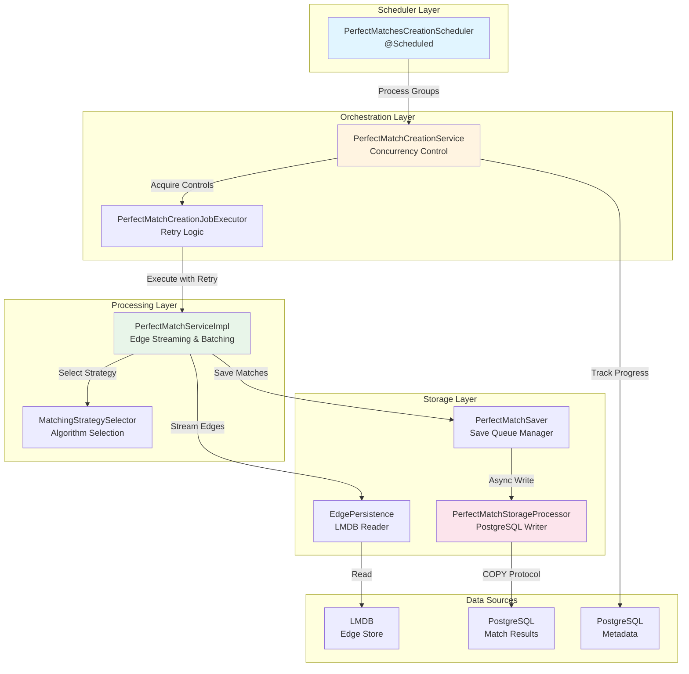
```mermaid
graph TB
    subgraph "Scheduler Layer"
        SCH["PerfectMatchesCreationScheduler<br/>@Scheduled"]
    end

    subgraph "Orchestration Layer"
        SVC["PerfectMatchCreationService<br/>Concurrency Control"]
        EXE["PerfectMatchCreationJobExecutor<br/>Retry Logic"]
    end

    subgraph "Processing Layer"
        IMPL["PerfectMatchServiceImpl<br/>Edge Streaming & Batching"]
        STRAT["MatchingStrategySelector<br/>Algorithm Selection"]
    end

    subgraph "Storage Layer"
        EDGE["EdgePersistence<br/>LMDB Reader"]
        SAVER["PerfectMatchSaver<br/>Save Queue Manager"]
        STORE["PerfectMatchStorageProcessor<br/>PostgreSQL Writer"]
    end

    subgraph "Data Sources"
        LMDB["LMDB<br/>Edge Store"]
        PG["PostgreSQL<br/>Match Results"]
        META["PostgreSQL<br/>Metadata"]
    end

    SCH -->|Process Groups| SVC
    SVC -->|Acquire Controls| EXE
    EXE -->|Execute with Retry| IMPL
    IMPL -->|Select Strategy| STRAT
    IMPL -->|Stream Edges| EDGE
    IMPL -->|Save Matches| SAVER
    SAVER -->|Async Write| STORE

    EDGE -->|Read| LMDB
    STORE -->|COPY Protocol| PG
    SVC -->|Track Progress| META

    style SCH fill:#e1f5ff
    style SVC fill:#fff4e1
    style IMPL fill:#e8f5e9
    style STORE fill:#fce4ec

```

### 2.2 Component Layer Diagram

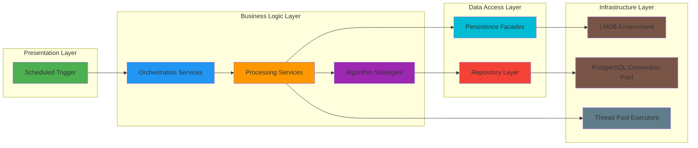
```mermaid
graph LR
    subgraph "Presentation Layer"
        A[Scheduled Trigger]
    end
    
    subgraph "Business Logic Layer"
        B[Orchestration Services]
        C[Processing Services]
        D[Algorithm Strategies]
    end
    
    subgraph "Data Access Layer"
        E[Repository Layer]
        F[Persistence Facades]
    end
    
    subgraph "Infrastructure Layer"
        G[LMDB Environment]
        H[PostgreSQL Connection Pool]
        I[Thread Pool Executors]
    end
    
    A --> B
    B --> C
    C --> D
    C --> F
    D --> E
    F --> G
    E --> H
    C --> I
    
    style A fill:#4CAF50
    style B fill:#2196F3
    style C fill:#FF9800
    style D fill:#9C27B0
    style E fill:#F44336
    style F fill:#00BCD4
    style G fill:#795548
    style H fill:#795548
    style I fill:#607D8B
```

---

## 3. Component Design

### 3.1 Scheduler Component

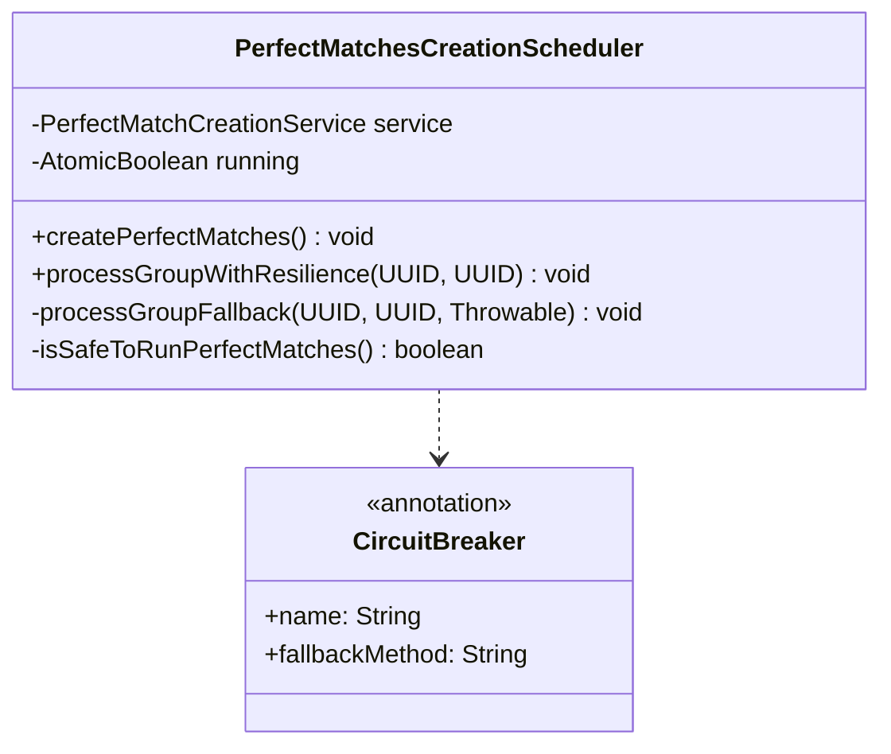
```mermaid
classDiagram
    class PerfectMatchesCreationScheduler {
        -PerfectMatchCreationService service
        -AtomicBoolean running
        +createPerfectMatches() void
        +processGroupWithResilience(UUID, UUID) void
        -processGroupFallback(UUID, UUID, Throwable) void
        -isSafeToRunPerfectMatches() boolean
    }
    
    class CircuitBreaker {
        <<annotation>>
        +name: String
        +fallbackMethod: String
    }
    
    PerfectMatchesCreationScheduler ..> CircuitBreaker
```

**Responsibilities:**
- Trigger scheduled execution
- Prevent concurrent runs
- Apply circuit breaker pattern
- Coordinate group processing

**Key Design Decisions:**
- Single-run guarantee using atomic flag
- Asynchronous group processing
- Resilience integration

### 3.2 Service Orchestration Component

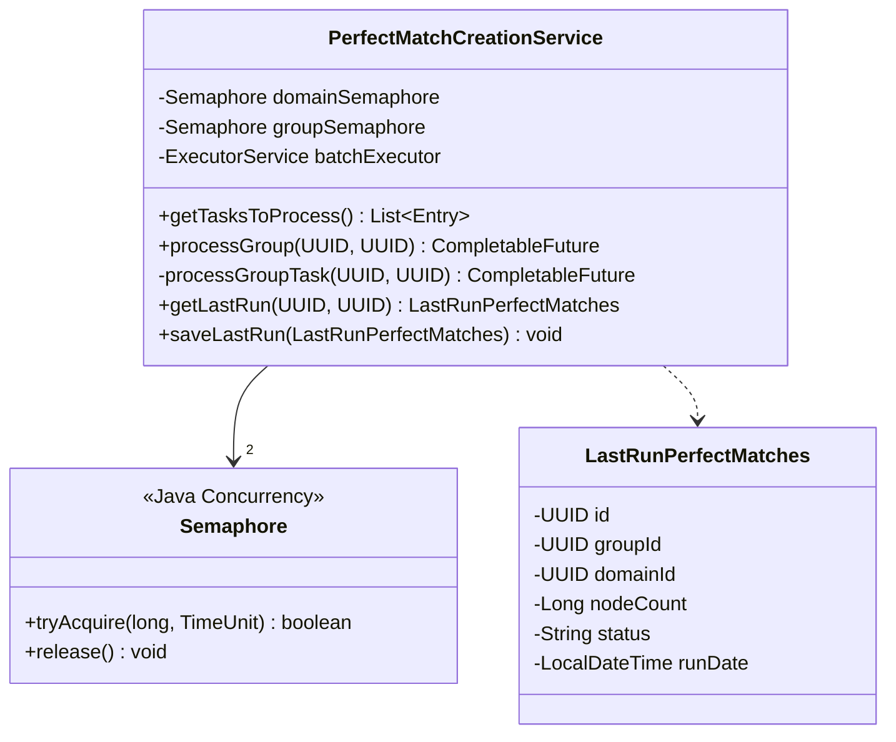
```mermaid
classDiagram
    class PerfectMatchCreationService {
        -Semaphore domainSemaphore
        -Semaphore groupSemaphore
        -ExecutorService batchExecutor
        +getTasksToProcess() List~Entry~
        +processGroup(UUID, UUID) CompletableFuture
        -processGroupTask(UUID, UUID) CompletableFuture
        +getLastRun(UUID, UUID) LastRunPerfectMatches
        +saveLastRun(LastRunPerfectMatches) void
    }
    
    class Semaphore {
        <<Java Concurrency>>
        +tryAcquire(long, TimeUnit) boolean
        +release() void
    }
    
    class LastRunPerfectMatches {
        -UUID id
        -UUID groupId
        -UUID domainId
        -Long nodeCount
        -String status
        -LocalDateTime runDate
    }
    
    PerfectMatchCreationService --> "2" Semaphore
    PerfectMatchCreationService ..> LastRunPerfectMatches
```

**Concurrency Control:**
Hierarchical semaphore model to limit parallel domain and group execution.

**Task Selection Logic:**
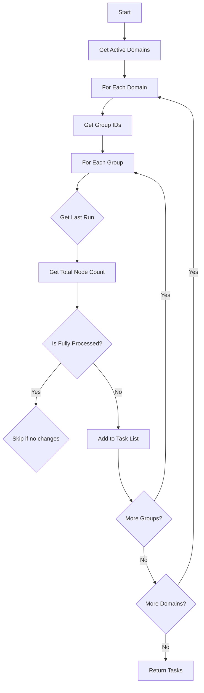
```mermaid
flowchart TD
    A[Start] --> B[Get Active Domains]
    B --> C[For Each Domain]
    C --> D[Get Group IDs]
    D --> E[For Each Group]
    E --> F{Get Last Run}
    F --> G[Get Total Node Count]
    G --> H{Is Fully Processed?}
    H -->|Yes| I{Skip if no changes}
    H -->|No| J[Add to Task List]
    J --> L{More Groups?}
    L -->|Yes| E
    L -->|No| M{More Domains?}
    M -->|Yes| C
    M -->|No| N[Return Tasks]
```

### 3.3 Job Executor Component

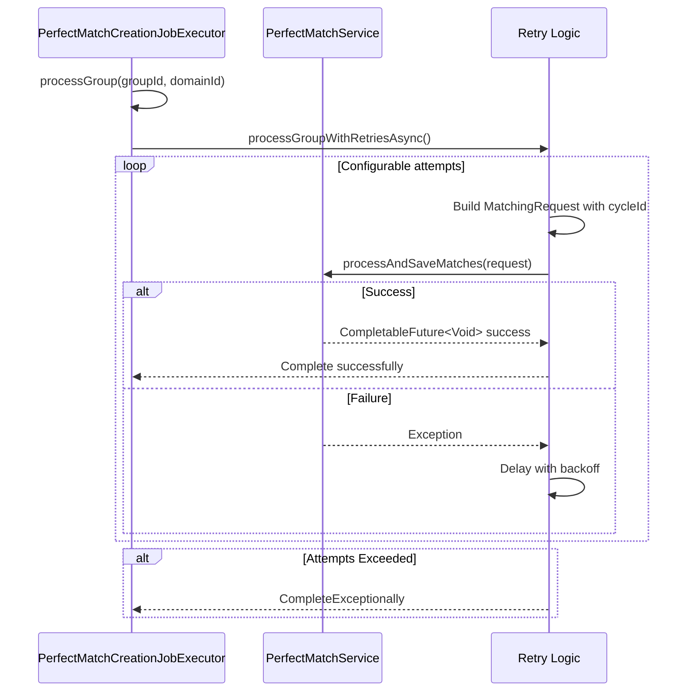
```mermaid
sequenceDiagram
    participant Executor as PerfectMatchCreationJobExecutor
    participant Service as PerfectMatchService
    participant Retry as Retry Logic
    
    Executor->>Executor: processGroup(groupId, domainId)
    Executor->>Retry: processGroupWithRetriesAsync()
    
    loop Configurable attempts
        Retry->>Retry: Build MatchingRequest with cycleId
        Retry->>Service: processAndSaveMatches(request)
        
        alt Success
            Service-->>Retry: CompletableFuture<Void> success
            Retry-->>Executor: Complete successfully
        else Failure
            Service-->>Retry: Exception
            Retry->>Retry: Delay with backoff
        end
    end
    
    alt Attempts Exceeded
        Retry-->>Executor: CompleteExceptionally
    end
```

### 3.4 Processing Engine Component

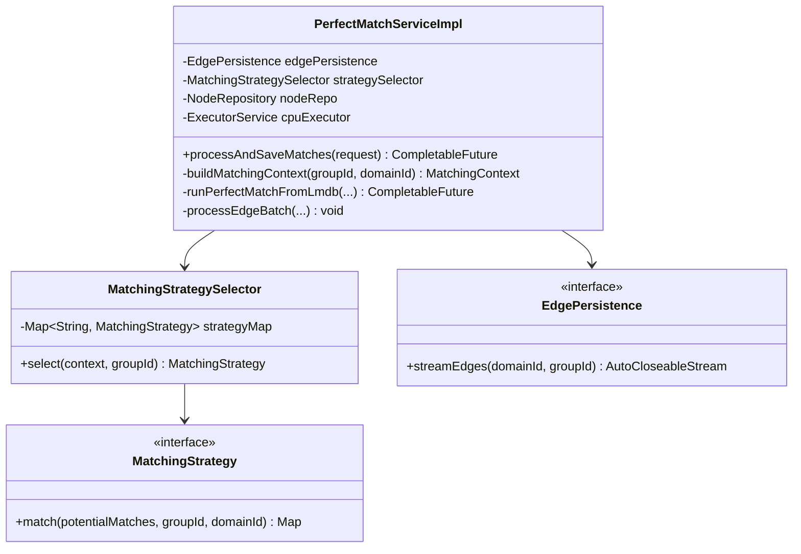
```mermaid
classDiagram
    class PerfectMatchServiceImpl {
        -EdgePersistence edgePersistence
        -MatchingStrategySelector strategySelector
        -NodeRepository nodeRepo
        -ExecutorService cpuExecutor
        +processAndSaveMatches(request) CompletableFuture
        -buildMatchingContext(groupId, domainId) MatchingContext
        -runPerfectMatchFromLmdb(...) CompletableFuture
        -processEdgeBatch(...) void
    }
    
    class MatchingStrategySelector {
        -Map~String, MatchingStrategy~ strategyMap
        +select(context, groupId) MatchingStrategy
    }
    
    class MatchingStrategy {
        <<interface>>
        +match(potentialMatches, groupId, domainId) Map
    }
    
    class EdgePersistence {
        <<interface>>
        +streamEdges(domainId, groupId) AutoCloseableStream
    }
    
    PerfectMatchServiceImpl --> MatchingStrategySelector
    PerfectMatchServiceImpl --> EdgePersistence
    MatchingStrategySelector --> MatchingStrategy
```

**Processing Pipeline:**

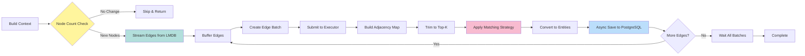
```mermaid
flowchart LR
    A[Build Context] --> B{Node Count Check}
    B -->|No Change| C[Skip & Return]
    B -->|New Nodes| D[Stream Edges from LMDB]
    D --> E[Buffer Edges]
    E --> F[Create Edge Batch]
    F --> G[Submit to Executor]
    G --> H[Build Adjacency Map]
    H --> I[Trim to Top-K]
    I --> J[Apply Matching Strategy]
    J --> K[Convert to Entities]
    K --> L[Async Save to PostgreSQL]
    L --> M{More Edges?}
    M -->|Yes| E
    M -->|No| N[Wait All Batches]
    N --> O[Complete]
    
    style B fill:#FFF59D
    style D fill:#B2DFDB
    style J fill:#F8BBD0
    style L fill:#BBDEFB
```

---

## 4. Data Flow

### 4.1 End-to-End Data Flow

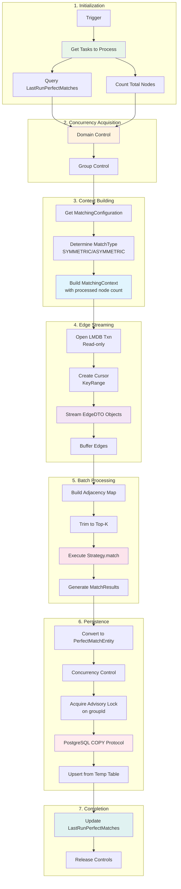
```mermaid
graph TB
    subgraph "1. Initialization"
        A1[Trigger] --> A2[Get Tasks to Process]
        A2 --> A3[Query LastRunPerfectMatches]
        A2 --> A4[Count Total Nodes]
    end
    
    subgraph "2. Concurrency Acquisition"
        B1[Domain Control]
        B2[Group Control]
        B1 --> B2
    end
    
    subgraph "3. Context Building"
        C1[Get MatchingConfiguration]
        C2[Determine MatchType<br/>SYMMETRIC/ASYMMETRIC]
        C3[Build MatchingContext<br/>with processed node count]
        C1 --> C2 --> C3
    end
    
    subgraph "4. Edge Streaming"
        D1[Open LMDB Txn<br/>Read-only]
        D2[Create Cursor<br/>KeyRange]
        D3[Stream EdgeDTO Objects]
        D4[Buffer Edges]
        D1 --> D2 --> D3 --> D4
    end
    
    subgraph "5. Batch Processing"
        E1[Build Adjacency Map]
        E2[Trim to Top-K]
        E3[Execute Strategy.match]
        E4[Generate MatchResults]
        E1 --> E2 --> E3 --> E4
    end
    
    subgraph "6. Persistence"
        F1[Convert to PerfectMatchEntity]
        F2[Concurrency Control]
        F3[Acquire Advisory Lock<br/>on groupId]
        F4[PostgreSQL COPY Protocol]
        F5[Upsert from Temp Table]
        F1 --> F2 --> F3 --> F4 --> F5
    end
    
    subgraph "7. Completion"
        G1[Update LastRunPerfectMatches]
        G2[Release Controls]
    end
    
    A3 --> B1
    A4 --> B1
    B2 --> C1
    C3 --> D1
    D4 --> E1
    E4 --> F1
    F5 --> G1
    G1 --> G2
    
    style A2 fill:#E8F5E9
    style B1 fill:#FFF3E0
    style C3 fill:#E1F5FE
    style D3 fill:#F3E5F5
    style E3 fill:#FCE4EC
    style F4 fill:#FFEBEE
    style G1 fill:#E0F2F1
```

### 4.2 Edge Streaming Detail

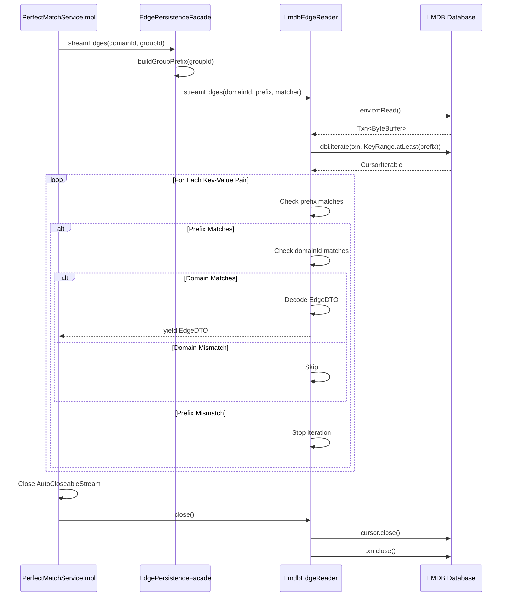
```mermaid
sequenceDiagram
    participant Client as PerfectMatchServiceImpl
    participant Facade as EdgePersistenceFacade
    participant Reader as LmdbEdgeReader
    participant LMDB as LMDB Database
    
    Client->>Facade: streamEdges(domainId, groupId)
    Facade->>Facade: buildGroupPrefix(groupId)
    
    Facade->>Reader: streamEdges(domainId, prefix, matcher)
    Reader->>LMDB: env.txnRead()
    LMDB-->>Reader: Txn<ByteBuffer>
    
    Reader->>LMDB: dbi.iterate(txn, KeyRange.atLeast(prefix))
    LMDB-->>Reader: CursorIterable
    
    loop For Each Key-Value Pair
        Reader->>Reader: Check prefix matches
        alt Prefix Matches
            Reader->>Reader: Check domainId matches
            alt Domain Matches
                Reader->>Reader: Decode EdgeDTO
                Reader-->>Client: yield EdgeDTO
            else Domain Mismatch
                Reader->>Reader: Skip
            end
        else Prefix Mismatch
            Reader->>Reader: Stop iteration
        end
    end
    
    Client->>Client: Close AutoCloseableStream
    Client->>Reader: close()
    Reader->>LMDB: cursor.close()
    Reader->>LMDB: txn.close()
```

**LMDB Key Structure:**
Group ID combined with hashes for efficient prefix scanning.

**LMDB Value Structure:**
Score, domain ID, and node identifiers.

### 4.3 Matching Algorithm Flow

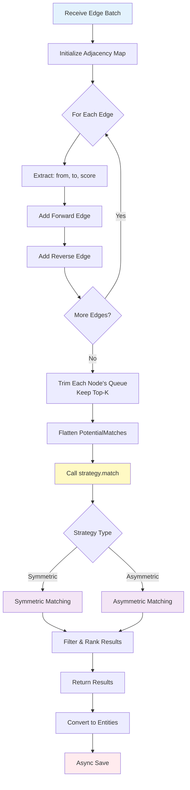
```mermaid
flowchart TD
    A[Receive Edge Batch] --> B[Initialize Adjacency Map]
    
    B --> C{For Each Edge}
    C --> D[Extract: from, to, score]
    D --> E[Add Forward Edge]
    E --> F[Add Reverse Edge]
    F --> G{More Edges?}
    G -->|Yes| C
    G -->|No| H[Trim Each Node's Queue<br/>Keep Top-K]
    
    H --> I[Flatten PotentialMatches]
    I --> J[Call strategy.match]
    
    J --> K{Strategy Type}
    K -->|Symmetric| L[Symmetric Matching]
    K -->|Asymmetric| M[Asymmetric Matching]
    
    L --> N[Filter & Rank Results]
    M --> N
    
    N --> O[Return Results]
    O --> P[Convert to Entities]
    P --> Q[Async Save]
    
    style A fill:#E3F2FD
    style J fill:#FFF9C4
    style L fill:#F3E5F5
    style M fill:#F3E5F5
    style Q fill:#FFEBEE
```

---

## 5. Concurrency Model

### 5.1 Thread Pool Architecture

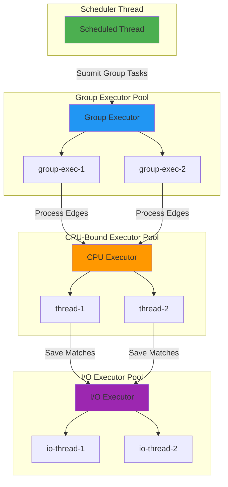
```mermaid
graph TB
    subgraph "Scheduler Thread"
        ST[Scheduled Thread]
    end
    
    subgraph "Group Executor Pool"
        GE[Group Executor]
        GE1[group-exec-1]
        GE2[group-exec-2]
        GE --> GE1
        GE --> GE2
    end
    
    subgraph "CPU-Bound Executor Pool"
        CPUE[CPU Executor]
        CPU1[thread-1]
        CPU2[thread-2]
        CPUE --> CPU1
        CPUE --> CPU2
    end
    
    subgraph "I/O Executor Pool"
        IOE[I/O Executor]
        IO1[io-thread-1]
        IO2[io-thread-2]
        IOE --> IO1
        IOE --> IO2
    end
    
    ST -->|Submit Group Tasks| GE
    GE1 -->|Process Edges| CPUE
    GE2 -->|Process Edges| CPUE
    CPU1 -->|Save Matches| IOE
    CPU2 -->|Save Matches| IOE
    
    style ST fill:#4CAF50
    style GE fill:#2196F3
    style CPUE fill:#FF9800
    style IOE fill:#9C27B0
```

### 5.2 Concurrency Control Flow

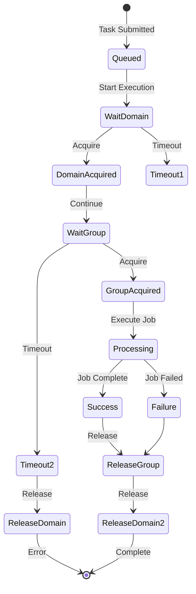
```mermaid
stateDiagram-v2
    [*] --> Queued: Task Submitted
    
    Queued --> WaitDomain: Start Execution
    WaitDomain --> DomainAcquired: Acquire
    WaitDomain --> Timeout1: Timeout
    
    DomainAcquired --> WaitGroup: Continue
    WaitGroup --> GroupAcquired: Acquire
    WaitGroup --> Timeout2: Timeout
    Timeout2 --> ReleaseDomain: Release
    ReleaseDomain --> [*]: Error
    
    GroupAcquired --> Processing: Execute Job
    Processing --> Success: Job Complete
    Processing --> Failure: Job Failed
    
    Success --> ReleaseGroup: Release
    Failure --> ReleaseGroup
    ReleaseGroup --> ReleaseDomain2: Release
    ReleaseDomain2 --> [*]: Complete
```

### 5.3 Concurrency Patterns

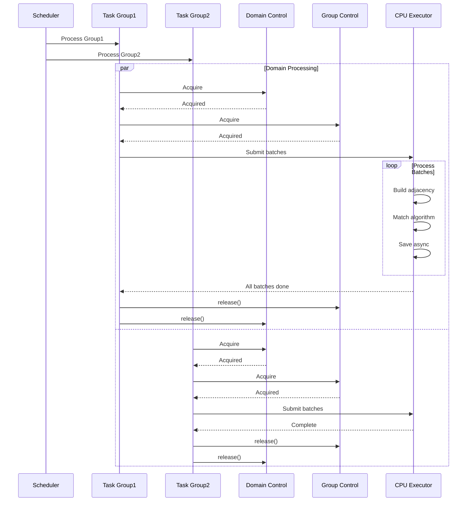
```mermaid
sequenceDiagram
    participant S as Scheduler
    participant T1 as Task Group1
    participant T2 as Task Group2
    participant DS as Domain Control
    participant GS as Group Control
    participant CPU as CPU Executor
    
    S->>T1: Process Group1
    S->>T2: Process Group2
    
    par Domain Processing
        T1->>DS: Acquire
        DS-->>T1: Acquired
        T1->>GS: Acquire
        GS-->>T1: Acquired
        
        T1->>CPU: Submit batches
        
        loop Process Batches
            CPU->>CPU: Build adjacency
            CPU->>CPU: Match algorithm
            CPU->>CPU: Save async
        end
        
        CPU-->>T1: All batches done
        T1->>GS: release()
        T1->>DS: release()
    and
        T2->>DS: Acquire
        DS-->>T2: Acquired
        T2->>GS: Acquire
        GS-->>T2: Acquired
        
        T2->>CPU: Submit batches
        CPU-->>T2: Complete
        T2->>GS: release()
        T2->>DS: release()
    end
```

---

## 6. Error Handling & Resilience

### 6.1 Resilience Architecture

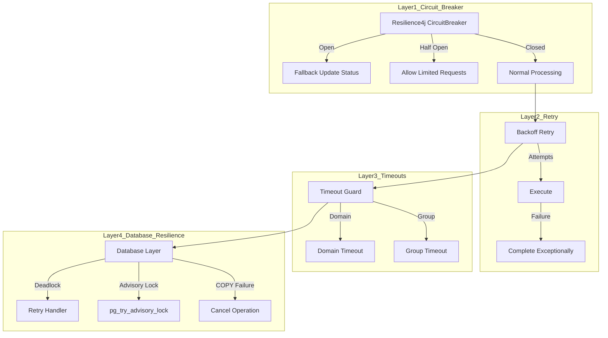
```mermaid
graph TB

    subgraph Layer1_Circuit_Breaker
        CB[Resilience4j CircuitBreaker]
        CB -->|Open| FB1[Fallback Update Status]
        CB -->|Half Open| RETRY1[Allow Limited Requests]
        CB -->|Closed| PROCEED1[Normal Processing]
    end

    subgraph Layer2_Retry
        RT[Backoff Retry]
        RT -->|Attempts| EXEC[Execute]
        EXEC -->|Failure| FB2[Complete Exceptionally]
    end

    subgraph Layer3_Timeouts
        TO[Timeout Guard]
        TO -->|Domain| TO1[Domain Timeout]
        TO -->|Group| TO2[Group Timeout]
    end

    subgraph Layer4_Database_Resilience
        DB[Database Layer]
        DB -->|Deadlock| DBR[Retry Handler]
        DB -->|Advisory Lock| AL[pg_try_advisory_lock]
        DB -->|COPY Failure| CANCEL[Cancel Operation]
    end

    PROCEED1 --> RT
    RT --> TO
    TO --> DB

```

### 6.2 Error Handling Flow

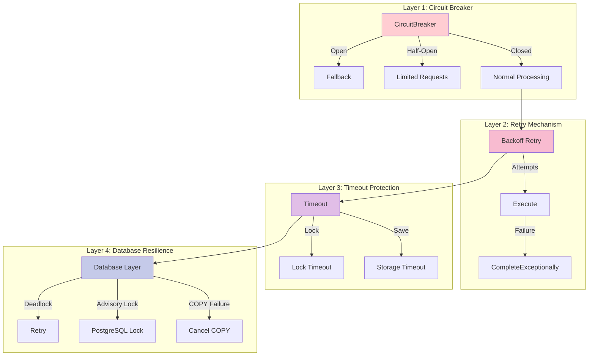
```mermaid
graph TB
    subgraph "Layer 1: Circuit Breaker"
        CB[CircuitBreaker]
        CB -->|Open| FB1[Fallback]
        CB -->|Half-Open| RETRY1[Limited Requests]
        CB -->|Closed| PROCEED1[Normal Processing]
    end

    subgraph "Layer 2: Retry Mechanism"
        RT[Backoff Retry]
        RT -->|Attempts| EXEC[Execute]
        EXEC -->|Failure| FB2[CompleteExceptionally]
    end

    subgraph "Layer 3: Timeout Protection"
        TO[Timeout]
        TO -->|Lock| TO1[Lock Timeout]
        TO -->|Save| TO2[Storage Timeout]
    end

    subgraph "Layer 4: Database Resilience"
        DB[Database Layer]
        DB -->|Deadlock| DBR[Retry]
        DB -->|Advisory Lock| AL[PostgreSQL Lock]
        DB -->|COPY Failure| CANCEL[Cancel COPY]
    end

    PROCEED1 --> RT
    RT --> TO
    TO --> DB

    style CB fill:#FFCDD2
    style RT fill:#F8BBD0
    style TO fill:#E1BEE7
    style DB fill:#C5CAE9

```

### 6.3 Exception Hierarchy

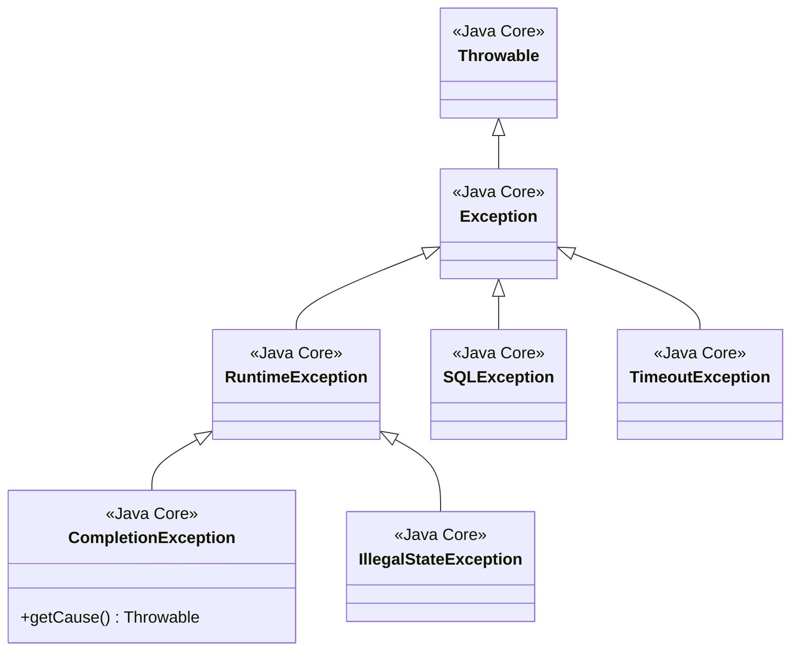
```mermaid
classDiagram
    class Throwable {
        <<Java Core>>
    }
    
    class Exception {
        <<Java Core>>
    }
    
    class RuntimeException {
        <<Java Core>>
    }
    
    class SQLException {
        <<Java Core>>
    }
    
    class CompletionException {
        <<Java Core>>
        +getCause() Throwable
    }
    
    class TimeoutException {
        <<Java Core>>
    }
    
    class IllegalStateException {
        <<Java Core>>
    }
    
    Throwable <|-- Exception
    Exception <|-- RuntimeException
    Exception <|-- SQLException
    RuntimeException <|-- CompletionException
    RuntimeException <|-- IllegalStateException
    Exception <|-- TimeoutException
```

**Exception Handling Strategy:**

| Exception Type | Handling Strategy | Retry | Fallback |
|----------------|-------------------|-------|----------|
| `TimeoutException` | Release controls, error | No | Status update |
| `SQLException` (Deadlock) | Retry with backoff | Yes | Rollback |
| `CompletionException` | Unwrap cause, propagate | Depends | Circuit breaker |
| `InterruptedException` | Restore flag, fail | No | Status update |
| `IllegalStateException` | Propagate | No | Empty result |

---

## 7. Database Design

### 7.1 Schema Design

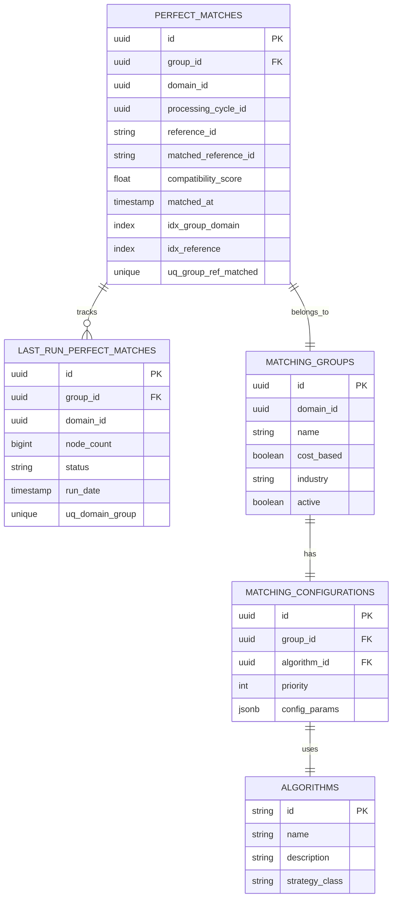
```mermaid
erDiagram
    PERFECT_MATCHES ||--o{ LAST_RUN_PERFECT_MATCHES : tracks
    PERFECT_MATCHES ||--|| MATCHING_GROUPS : belongs_to
    MATCHING_GROUPS ||--|| MATCHING_CONFIGURATIONS : has
    MATCHING_CONFIGURATIONS ||--|| ALGORITHMS : uses
    
    PERFECT_MATCHES {
        uuid id PK
        uuid group_id FK
        uuid domain_id
        uuid processing_cycle_id
        string reference_id
        string matched_reference_id
        float compatibility_score
        timestamp matched_at
        index idx_group_domain
        index idx_reference
        unique uq_group_ref_matched
    }
    
    LAST_RUN_PERFECT_MATCHES {
        uuid id PK
        uuid group_id FK
        uuid domain_id
        bigint node_count
        string status
        timestamp run_date
        unique uq_domain_group
    }
    
    MATCHING_GROUPS {
        uuid id PK
        uuid domain_id
        string name
        boolean cost_based
        string industry
        boolean active
    }
    
    MATCHING_CONFIGURATIONS {
        uuid id PK
        uuid group_id FK
        uuid algorithm_id FK
        int priority
        jsonb config_params
    }
    
    ALGORITHMS {
        string id PK
        string name
        string description
        string strategy_class
    }
```

### 7.2 Index Strategy

```sql
CREATE INDEX CONCURRENTLY idx_pm_group_domain 
    ON perfect_matches(group_id, domain_id);

CREATE INDEX CONCURRENTLY idx_pm_reference 
    ON perfect_matches(reference_id);

CREATE INDEX CONCURRENTLY idx_pm_cycle 
    ON perfect_matches(processing_cycle_id);

CREATE UNIQUE INDEX uq_pm_group_ref_matched 
    ON perfect_matches(group_id, reference_id, matched_reference_id);

CREATE UNIQUE INDEX uq_last_run_domain_group 
    ON last_run_perfect_matches(domain_id, group_id);
```

### 7.3 Transaction Isolation

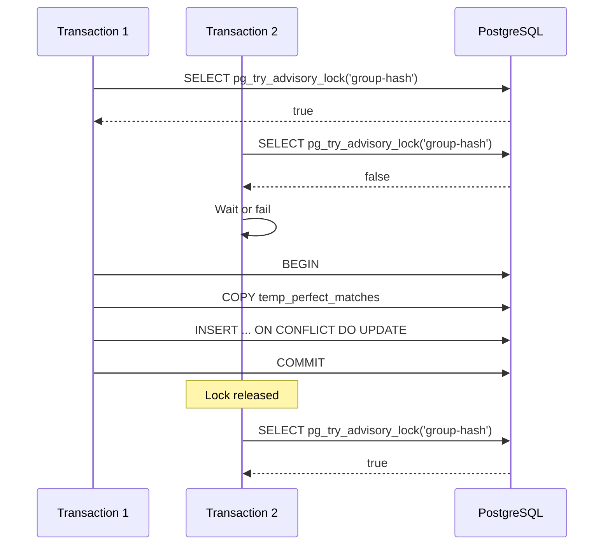
```mermaid
sequenceDiagram
    participant T1 as Transaction 1
    participant T2 as Transaction 2
    participant PG as PostgreSQL
    
    T1->>PG: SELECT pg_try_advisory_lock('group-hash')
    PG-->>T1: true
    
    T2->>PG: SELECT pg_try_advisory_lock('group-hash')
    PG-->>T2: false
    T2->>T2: Wait or fail
    
    T1->>PG: BEGIN
    T1->>PG: COPY temp_perfect_matches
    T1->>PG: INSERT ... ON CONFLICT DO UPDATE
    T1->>PG: COMMIT
    
    Note over T2: Lock released
    T2->>PG: SELECT pg_try_advisory_lock('group-hash')
    PG-->>T2: true
```

**Lock Hierarchy:**
Application-level controls combined with database advisory locks.

---

## Appendix A: Sequence Diagram - Complete Flow

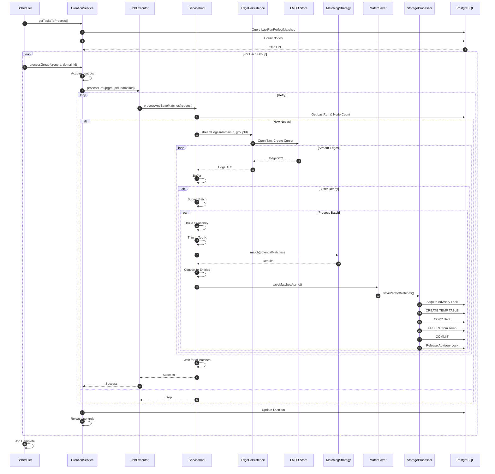
```mermaid
sequenceDiagram
    autonumber
    participant SCH as Scheduler
    participant SVC as CreationService
    participant EXE as JobExecutor
    participant IMPL as ServiceImpl
    participant EDGE as EdgePersistence
    participant LMDB as LMDB Store
    participant STRAT as MatchingStrategy
    participant SAVER as MatchSaver
    participant STORE as StorageProcessor
    participant PG as PostgreSQL

    SCH->>SVC: getTasksToProcess()
    SVC->>PG: Query LastRunPerfectMatches
    SVC->>PG: Count Nodes
    PG-->>SVC: Tasks List

    loop For Each Group
        SCH->>SVC: processGroup(groupId, domainId)
        SVC->>SVC: Acquire controls

        SVC->>EXE: processGroup(groupId, domainId)

        loop Retry
            EXE->>IMPL: processAndSaveMatches(request)
            IMPL->>PG: Get LastRun & Node Count

            alt New Nodes
                IMPL->>EDGE: streamEdges(domainId, groupId)
                EDGE->>LMDB: Open Txn, Create Cursor

                loop Stream Edges
                    LMDB-->>EDGE: EdgeDTO
                    EDGE-->>IMPL: EdgeDTO
                    IMPL->>IMPL: Buffer

                    alt Buffer Ready
                        IMPL->>IMPL: Submit Batch

                        par Process Batch
                            IMPL->>IMPL: Build adjacency
                            IMPL->>IMPL: Trim to Top-K
                            IMPL->>STRAT: match(potentialMatches)
                            STRAT-->>IMPL: Results
                            IMPL->>IMPL: Convert to Entities
                            IMPL->>SAVER: saveMatchesAsync()

                            SAVER->>STORE: savePerfectMatches()
                            STORE->>PG: Acquire Advisory Lock
                            STORE->>PG: CREATE TEMP TABLE
                            STORE->>PG: COPY Data
                            STORE->>PG: UPSERT from Temp
                            STORE->>PG: COMMIT
                            STORE->>PG: Release Advisory Lock
                        end
                    end
                end

                IMPL->>IMPL: Wait for all batches
                IMPL-->>EXE: Success
                EXE-->>SVC: Success
            else
                IMPL-->>EXE: Skip
            end
        end

        SVC->>PG: Update LastRun
        SVC->>SVC: Release controls
    end

    SCH->>SCH: Job Complete

```