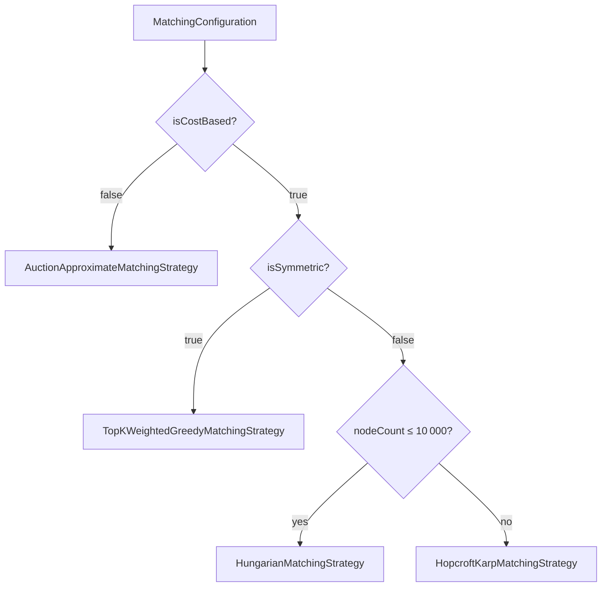
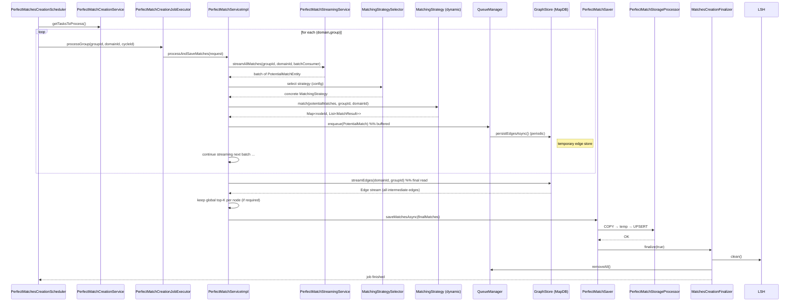

# Perfect‑Matches Creation Module – Low‑Level Design (LLD)

> **Goal** – Every night (03:00 IST) produce a *deterministic* set of **perfect matches** for every active `(domainId, groupId)` pair.  
> The pipeline re‑uses most of the “potential‑matches” infrastructure (queues, MapDB, LSH) but adds a **dynamic, cost‑aware matching strategy** that can switch between four algorithms at run‑time.

---

##  High‑Level Flow (Cron → Final DB)

```mermaid
flowchart TD
    S[PerfectMatchesCreationScheduler (cron 03:00)] -->|tasks| CS[PerfectMatchCreationService]
    CS -->|domain/group semaphores| JE[PerfectMatchCreationJobExecutor]
    JE -->|processGroup| PS[PerfectMatchServiceImpl]
    PS -->|stream potential matches| PSS[PerfectMatchStreamingService]
    PS -->|select strategy| MS[MatchingStrategySelector]
    MS -->|strategy| A[AuctionApproximate]
    MS -->|strategy| H[Hopcroft-Karp]
    MS -->|strategy| HU[Hungarian]
    MS -->|strategy| TG[Top-K Weighted Greedy]
    A & H & HU & TG -->|run on in-memory adjacency| PS
    PS -->|buffer edges| QM[QueueManager (same impl as potential-matches)]
    QM -->|periodic/boosted flush| GS[GraphStore (MapDB)]
    PS -->|final stream from MapDB| GS
    GS -->|top-K extraction| PS
    PS -->|persist final matches| PMS[PerfectMatchSaver]
    PMS -->|COPY/UPSERT| PMST[PerfectMatchStorageProcessor -> PostgreSQL]
    PMST -->|metrics & cleanup| FM[MatchesCreationFinalizer]
    FM -->|clean LSH, queues, GC| LSH[LSHIndex]


```

*The **strategy selector** decides which of the four algorithms to run **per group** based on the group’s configuration (cost‑based flag, symmetric flag, node‑count). The rest of the pipeline is identical for every strategy.*

---

## Core Components & Responsibilities

| Component | Main Duties | Important Methods | Concurrency Controls |
|-----------|--------------|-------------------|----------------------|
| **PerfectMatchesCreationScheduler** | Cron entry (`@Scheduled(cron="0 0 3 * * *", zone="Asia/Kolkata")`). Builds a list of `(Domain, groupId)` tasks via `PerfectMatchCreationService.getTasksToProcess()`. Wraps each call in a Spring `@Retry` + `@CircuitBreaker`. | `createPerfectMatches()`, `generatePerfectMatchesCreationGroup()` (fallback) | None – just fires the job. |
| **PerfectMatchCreationService** | Orchestrates **domain‑ and group‑level throttling** (`domainSemaphore`, `groupSemaphore`). Persists `LastRunPerfectMatches` (run‑date, node‑count, status). | `getTasksToProcess()`, `processAllDomains()`, `processGroupTask()` | `domainSemaphore` (max‑concurrent‑domains, default 2) <br> `groupSemaphore` (max‑concurrent‑groups, default 1) |
| **PerfectMatchCreationJobExecutor** | Thin wrapper that **acquires a per‑group semaphore** (`groupSemaphores`) and delegates to `PerfectMatchService.processAndSaveMatches()`. Handles its own retry loop (`maxRetries`, exponential back‑off). | `processGroup()`, `processGroupWithRetriesAsync()` | `groupSemaphores` (max‑concurrent‑groups, default 1) |
| **PerfectMatchServiceImpl** | **Core engine** – streams potential matches, builds an adjacency map, runs the **selected strategy**, buffers intermediate edges, flushes to MapDB, finally streams back, extracts top‑K (if required) and writes final rows. | `processAndSaveMatches()`, `processMatchesWithCursor()`, `processPageMatches()` | `cpuTaskSemaphore` (≈ 2 × availableProcessors) limits parallel adjacency‑map building. |
| **PerfectMatchStreamingService** | JDBC **forward‑only cursor** (`ResultSet.TYPE_FORWARD_ONLY`) that yields batches of `PotentialMatchEntity`. Retries up to 3 times. | `streamAllMatches(UUID groupId, UUID domainId, Consumer<List<PotentialMatchEntity>> batchConsumer, int batchSize)` | Runs on `ioExecutor` (single‑threaded or small pool). |
| **MatchingStrategySelector** | Reads `MatchingConfiguration` (JPA) for the group and decides **which algorithm** to use. The decision matrix is: <br>• `isCostBased && isSymmetric` → **Top‑K Weighted Greedy** <br>• `isCostBased && !isSymmetric && nodeCount ≤ 10 000` → **Hungarian** <br>• `isCostBased && !isSymmetric && nodeCount > 10 000` → **Hopcroft‑Karp** <br>• otherwise → **Auction Approximate** | `select(MatchingContext ctx, UUID groupId)` | Stateless – just a map lookup (`strategyMap`). |
| **MatchingStrategy** (interface) | Four concrete implementations (see below). Each receives a **flat list of `PotentialMatch`** (already filtered by group/domain) and returns `Map<nodeId, List<MatchResult>>`. | `match(List<PotentialMatch> allPMs, UUID groupId, UUID domainId)` | Implementations are **stateless**; they run inside the `cpuExecutor`. |
| **AuctionApproximateMatchingStrategy** | Auction‑style greedy algorithm with price‑updates. Works for any graph size. | `match(...)` | No extra concurrency – runs in the caller’s thread. |
| **HopcroftKarpMatchingStrategy** | Maximum‑cardinality bipartite matching (O(E·√V)). Uses `BipartiteGraphBuilderService` to materialise the graph first. | `match(...)` | Calls `bipartiteGraphBuilderService.build(...)` (async) → waits on the future. |
| **HungarianMatchingStrategy** | Optimal assignment (O(N³)) – used only when the bipartite graph is **small** (≤ 10 k nodes). | `match(...)` | Same as Hopcroft‑Karp but with a cost matrix. |
| **TopKWeightedGreedyMatchingStrategy** | Fast “keep‑top‑K per node” greedy algorithm. Memory‑aware, does **not** guarantee a global top‑K when the node count is huge. | `match(...)` | Uses its own `computeSemaphore` to bound parallel sub‑batches. |
| **QueueManager / QueueManagerFactory** | Same implementation as the potential‑matches module – a bounded `LinkedBlockingQueue<PotentialMatch>` per group, with periodic & boosted flushes. | `enqueue()`, `flushQueueBlocking()` | `periodicFlushSemaphore`, `boostedFlushSemaphore`. |
| **GraphStore** | MapDB‑backed edge store (temporary). `persistEdgesAsync()` writes batches, `streamEdges()` reads them back for the final top‑K extraction. | `persistEdgesAsync()`, `streamEdges()`, `cleanEdges()` | `mapdbExecutor` + `commitExecutor`. |
| **PerfectMatchSaver** | Thin façade that forwards a batch of `PerfectMatchEntity` to the storage processor. Guarded by a **semaphore (2 permits)** to avoid too many concurrent COPY jobs. | `saveMatchesAsync(...)` | `saveSemaphore`. |
| **PerfectMatchStorageProcessor** | **COPY → temp table → UPSERT** into `perfect_matches`. Retries on `SQLException`/`TimeoutException` (3 attempts, exponential back‑off). | `savePerfectMatches(...)`, `saveBatch(...)` | Runs on `ioExecutor`. |
| **MatchesCreationFinalizer** | After the whole batch finishes: `QueueManager.removeAll()`, `LSHIndex.clean()`, optional `System.gc()`. Also logs heap usage before/after. | `finalize(boolean cycleCompleted)` | None. |
| **LSHIndex** | Shared with the potential‑matches pipeline – kept alive for the whole day, cleaned at the end of the perfect‑match run. | `clean()` | None (single‑process). |

---

## 3️⃣  Data Model (simplified)

```sql
-- Potential matches (produced by the “potential” job)
CREATE TABLE potential_matches (
    id UUID PRIMARY KEY,
    group_id UUID NOT NULL,
    domain_id UUID NOT NULL,
    processing_cycle_id VARCHAR(36) NOT NULL,
    reference_id VARCHAR(255) NOT NULL,
    matched_reference_id VARCHAR(255) NOT NULL,
    compatibility_score DOUBLE PRECISION NOT NULL,
    matched_at TIMESTAMP NOT NULL,
    UNIQUE (group_id, reference_id, matched_reference_id)
);

-- Perfect matches (final output)
CREATE TABLE perfect_matches (
    id UUID PRIMARY KEY,
    group_id UUID NOT NULL,
    domain_id UUID NOT NULL,
    processing_cycle_id VARCHAR(36) NOT NULL,
    reference_id VARCHAR(255) NOT NULL,
    matched_reference_id VARCHAR(255) NOT NULL,
    compatibility_score DOUBLE PRECISION NOT NULL,
    matched_at TIMESTAMP NOT NULL,
    UNIQUE (group_id, reference_id, matched_reference_id)
);

-- Book‑keeping for the scheduler
CREATE TABLE last_run_perfect_matches (
    id UUID PRIMARY KEY,
    group_id UUID NOT NULL,
    domain_id UUID NOT NULL,
    run_date TIMESTAMP,
    node_count BIGINT,
    status VARCHAR(20)   -- PENDING, COMPLETED, FAILED
);
```

*All IDs are `UUID`. The `perfect_matches` table is **append‑only**; the `UPSERT` in the storage processor guarantees idempotence.*

---

## Dynamic Strategy Selection



*The selector (`MatchingStrategySelector.select`) reads the `MatchingConfiguration` row for the group, extracts:*

| Flag | Meaning |
|------|---------|
| `isCostBased` | The business wants a **cost‑optimised** solution (i.e. top‑K per node). |
| `isSymmetric` | Graph is symmetric (same node set on both sides). |
| `nodeCount` | Number of distinct nodes in the **potential‑match** stream (computed on‑the‑fly). |

*If the configuration does not request cost‑based matching, we fall back to the **Auction Approximate** algorithm – a fast, price‑adjusting greedy method that works for any size.*

---

## Detailed Sequence – One Group (Happy Path)



### Failure‑Handling Points (annotated)

| Step | What can fail? | Recovery / Fallback |
|------|----------------|---------------------|
| **`streamAllMatches`** | JDBC timeout / dead connection | Retry up to 3 × with back‑off; on final failure the whole group is marked **FAILED** (`LastRun.status = FAILED`). |
| **Strategy execution** | Illegal arguments, OOM, algorithm‑specific exception | Caught in `processMatchesWithCursor`; group marked **FAILED**; `finalizer` still runs to clean resources. |
| **Queue enqueue** | Queue full (capacity reached) | `enqueue()` times out → match is **dropped**; metric `match_drops_total{reason="queue_timeout"}` is incremented. |
| **MapDB persist** | Disk I/O error, commit timeout | `persistEdgesAsync(...).orTimeout(100s)` → on timeout the future fails → group marked **FAILED**. |
| **Final COPY** | PostgreSQL error, deadlock | `PerfectMatchStorageProcessor.saveBatch` is `@Retryable` (3 attempts, exponential back‑off). After retries, group fails. |
| **Circuit‑breaker** (scheduler) | Repeated failures across groups | Spring `@CircuitBreaker` trips → `generatePerfectMatchesCreationGroupFallback` runs, persisting a **FAILED** `LastRun`. |

All failures increment a **counter** (`perfect_matches_creation_errors_total`) and are logged with the full stack‑trace.

---

## Concurrency & Back‑Pressure Model

| Resource | Guard | Default Permit Count | Why |
|----------|-------|----------------------|-----|
| **Domain semaphore** (`domainSemaphore`) | `java.util.concurrent.Semaphore` | `match.max-concurrent-domains` (2) | Prevents DB/CPU overload when many domains are active. |
| **Group semaphore** (`groupSemaphore`) | `Semaphore` | `match.max-concurrent-groups` (1) | Guarantees **exactly‑once** processing per group. |
| **Per‑group semaphore** (`groupSemaphores` in `JobExecutor`) | `ConcurrentMap<UUID, Semaphore>` | `match.max-concurrent-groups` (1) | Allows parallel groups if the config is raised. |
| **CPU‑task semaphore** (`cpuTaskSemaphore`) | `Semaphore` | `2 × availableProcessors` | Limits parallel adjacency‑map building / strategy execution. |
| **Queue flush semaphores** (`periodicFlushSemaphore`, `boostedFlushSemaphore`) | `Semaphore` | 2 / 1 | Guarantees only one flush runs at a time; boosted flush is exclusive. |
| **Perfect‑match saver semaphore** (`saveSemaphore`) | `Semaphore(2)` | 2 | Limits concurrent COPY jobs (I/O‑heavy). |
| **Queue capacity** | `LinkedBlockingQueue` (via `QueueManager`) | `match.queue.capacity` (default 500 000) | Back‑pressure – if the queue fills, `enqueue()` times out and the match is dropped. |

**Back‑pressure cascade**

1. **Streaming** → batches of potential matches.
2. **Strategy** → produces `PotentialMatch` objects.
3. **QueueManager** buffers them.
4. When `size / capacity > drainWarningThreshold (0.9)` → **boosted flush** (larger batch, exclusive semaphore).
5. If `enqueue()` cannot insert within 1 s → match is dropped and counted.

---

## Observability (Micrometer)

| Metric | Tags | Type | When emitted |
|--------|------|------|---------------|
| `perfect_matches_creation` | `domainId`, `groupId` | Counter | After a group finishes successfully. |
| `perfect_matches_creation_errors_total` | `groupId` | Counter | Any uncaught exception in the group pipeline. |
| `perfect_match_storage_duration` | `groupId` | Timer | Whole COPY‑UPSERT operation. |
| `perfect_match_storage_batch_duration` | `groupId` | Timer | Each batch inside `saveBatch`. |
| `perfect_match_storage_errors_total` | `groupId`, `error_type` | Counter | DB‑level failures after retries. |
| `matching_duration` | `groupId`, `domainId`, `cycleId` | Timer | Whole `processAndSaveMatches` call. |
| `matching_errors_total` | `groupId`, `domainId`, `cycleId` | Counter | Any exception inside `PerfectMatchServiceImpl`. |
| `match_drops_total` | `groupId`, `reason`, `match_type` | Counter | Queue full / timeout / interrupt. |
| `queue_drain_warnings_total` | `groupId` | Counter | Queue > `drainWarningThreshold`. |
| `heap_usage_before_cleanup` / `heap_usage_after_cleanup` | – | Gauge | Logged by `MatchesCreationFinalizer`. |
| `system_cpu_usage` | – | Gauge | Added by `PerfectMatchStorageProcessor`. |
| `strategy_used` | `groupId`, `strategy` | Counter | Incremented once per group after the selector decides. |

All timers are **sampled per group** so you can drill down to the slowest groups in Grafana.

---

##  Scaling & Distributed Coordination (Optional)

The current implementation is **single‑process** (only one pod runs the cron). To run on a cluster:

| Concern | Distributed Solution |
|---------|----------------------|
| **Leader election** (only one scheduler) | Kubernetes `Lease` (`spring-cloud-kubernetes-leader`) or Redis Redlock. |
| **Domain / Group semaphores** | Redis `SETNX` with TTL (key `sem:domain:{id}` or `sem:group:{id}`). |
| **QueueManager** | Replace the in‑process `LinkedBlockingQueue` with **Redis Streams** (one stream per `groupId`). |
| **MapDB** | Use a **distributed KV store** (RocksDB with shared storage, or Ignite) or keep MapDB **local** and shard groups (`groupId % N`). |
| **Final DB writes** | No change – PostgreSQL handles concurrent COPY jobs (each job uses its own temp table). |
| **Metrics aggregation** | Prometheus scrapes each pod; use `groupId` tag to aggregate across pods. |

**Sharding by group** (simpler) – each node processes only groups where `hash(groupId) % NUM_NODES == nodeIndex`. No distributed locks are needed; the scheduler still runs on every node but each node’s `getTasksToProcess()` filters out groups that belong to other shards.

---

##  Memory‑vs‑Throughput Sizing Guide

| Parameter | Recommended Starting Value | How to tune |
|-----------|---------------------------|-------------|
| `matching.topk.count` | 100 | Increase only if business needs more per‑node matches; watch `maxMatchesPerNode` memory (≈ 16 B per edge). |
| `matching.max.memory.mb` | 1024 MiB | Raise on machines with > 4 GiB heap. The service aborts if usage > 80 % of this value. |
| `matching.max.distinct.nodes` | 10 000 | Upper bound for the **Top‑K Greedy** strategy; larger graphs will be routed to Hopcroft‑Karp. |
| `node-fetch.batch-size` | 500 | Larger batches reduce round‑trips but increase per‑batch memory. |
| `match.max-concurrent-domains` | 2 | Raise if DB can handle more parallel domains. |
| `match.max-concurrent-groups` | 1 (default) | Raise to 2‑3 on a 16‑core box if you have many groups. |
| `match.flush.interval-seconds` | 5 | Lower (2 s) if the queue fills fast; higher (10 s) if DB can absorb larger batches. |
| `match.drain-warning-threshold` | 0.9 | Keep at 0.9; if you see many warnings, increase `maxConcurrentBatches` or `queue.capacity`. |

**Rule of thumb** – keep **CPU utilisation** ≤ 70 % and **memory** ≤ 80 % of the configured limits. Adjust the semaphores accordingly.

---

## Fault‑Tolerance Lifecycle Diagram (Retry / Fallback)

```mermaid
flowchart TD
    A[Start group] --> B{Acquire semaphores}
    B -->|OK| C[Stream potential matches]
    C -->|SQL error| D[Retry (max 3) -> back-off]
    D -->|exhausted| E[Mark LastRun FAILED, abort]
    C -->|Success| F[Chunk -> build adjacency]
    F -->|OOM / algorithm error| G[Abort, mark FAILED]
    F -->|All chunks OK| H[Flush Queue -> MapDB]
    H --> I[Stream edges from MapDB]
    I --> J[Apply final top-K (if needed)]
    J --> K[Copy/UPSERT to PostgreSQL]
    K -->|SQL error| L[Retry (max 3) -> back-off]
    L -->|exhausted| E
    K --> M[Mark LastRun COMPLETED]
    M --> N[Finalizer (clean LSH, queues, GC)]
    N --> O[Group finished]

```

*Every branch that ends in **E** increments `perfect_matches_creation_errors_total` and updates `LastRun.status = FAILED`. The finalizer always runs (even on failure) to avoid resource leaks.*

---

##  Quick‑Start Checklist (what to verify before go‑live)

| Item | How to confirm |
|------|-----------------|
| **Scheduler runs only once** | Verify only one pod holds the Kubernetes `Lease` (or Redis lock). |
| **Domain / Group semaphores respect limits** | `domainSemaphore.availablePermits()` never goes negative; logs show “acquired … permits left”. |
| **Strategy selection works** | Insert a few rows in `matching_configuration` with different flags; check `strategy_used` counter in Prometheus. |
| **Queue never overflows** | `match_drops_total{reason="queue_timeout"}` stays at 0; `queue_drain_warnings_total` < 5 per day. |
| **MapDB writes < 200 ms per batch** | Look at `mapdb_persist_latency` 95th‑pctile. |
| **COPY‑UPSERT finishes < 5 min per group** | `perfect_match_storage_duration` metric. |
| **Final heap < 80 %** | `heap_usage_after_cleanup` gauge. |
| **Graceful shutdown** | `@PreDestroy` methods close executors, DB pools, and clear queues within 30 s. |
| **Metrics & alerts** | Grafana dashboards show all counters; alerts fire on `perfect_matches_creation_errors_total > 0` or `queue_drain_warnings_total > 0`. |

---
