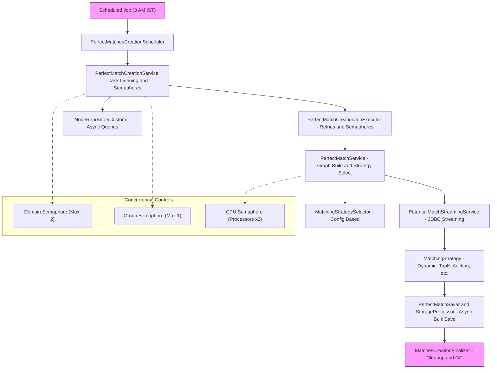
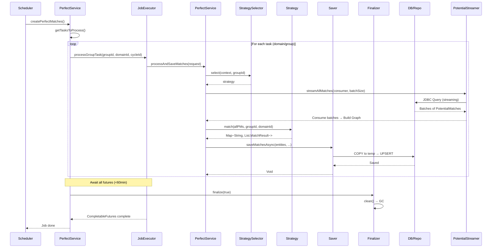
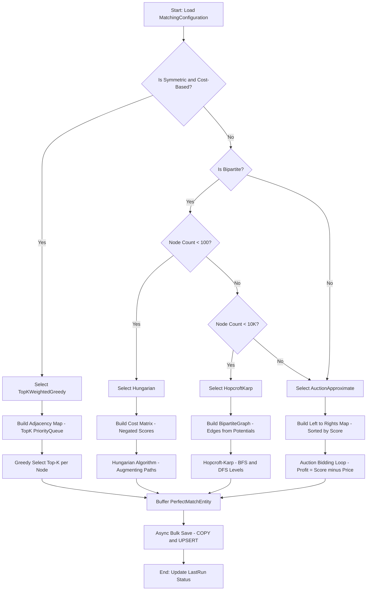
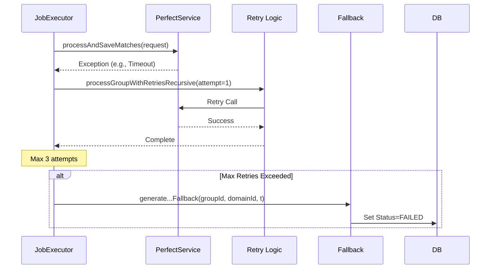

# Low-Level Design (LLD) Document: Scheduled Perfect Matches Creation Module

## 1. Introduction

### 1.1 Purpose
The **Scheduled Perfect Matches Creation Module** is a batch processing system designed to generate "perfect matches" (optimized pairings) from pre-computed "potential matches" in a graph-based matching engine. This module runs as a scheduled job (daily at 3:00 AM IST) and is "stronger" than potential match generation, as it applies advanced algorithms to select high-quality, non-overlapping matches while respecting constraints like memory limits, concurrency, and node counts.

Key Goals:
- **Scalability**: Handle large datasets (e.g., 10K+ nodes) with bounded memory (default: 1GB) and concurrency.
- **Reliability**: Retries, circuit breakers, semaphores, and fallbacks for failures.
- **Observability**: Micrometer metrics for timers, counters, and gauges.
- **Flexibility**: Dynamic strategy selection (e.g., Top-K Greedy for symmetric graphs, Hungarian for bipartite) based on configuration.

### 1.2 Scope
- **In Scope**: Scheduling, task queuing, streaming potential matches, graph construction, strategy-based matching, persistence, cleanup.
- **Out of Scope**: Potential match generation (assumed pre-existing), real-time matching, UI/integration layers.
- **Assumptions**: PostgreSQL backend, Spring Boot environment, entities like `Node`, `PotentialMatchEntity`, `PerfectMatchEntity` exist.

### 1.3 Non-Functional Requirements
- **Performance**: Process 10K nodes in <60 minutes; batch sizes tunable (default: 500-5000).
- **Concurrency**: Max 2 domains, 1 group per domain; CPU-bound tasks limited by processors.
- **Memory**: <80% heap usage; GC triggers on thresholds.
- **Error Handling**: Retries (3x), timeouts (30-600s), fallbacks to "FAILED" status.
- **Profiling**: `@Profile("!singleton")` for multi-instance deployments.

## 2. Architecture Overview

### 2.1 High-Level Components
The module follows a **pipeline architecture**:
1. **Scheduler** → Triggers daily job.
2. **Task Orchestrator** → Queues domains/groups.
3. **Executor** → Runs jobs with retries.
4. **Streamer** → Fetches potential matches via JDBC streaming.
5. **Processor** → Builds adjacency graph, applies strategy.
6. **Saver** → Bulk-inserts via PostgreSQL COPY.
7. **Finalizer** → Cleanup (GC, index flush).

### 2.2 System Diagram

### 2.3 Data Flow
- **Input**: Nodes (processed=true), PotentialMatches (from prior module).
- **Output**: PerfectMatchEntity (upserted to DB).
- **Entities**:
    - `Node`: Reference ID, group/domain, metadata, processed flag.
    - `PotentialMatchEntity`: refId, matchedRefId, score (0-1).
    - `PerfectMatchEntity`: Similar to Potential, plus matchedAt, cycleId.
    - `LastRunPerfectMatches`: Tracks run status, node counts for delta processing.
    - `MatchingConfiguration`: Links group to algorithm (e.g., "topKWeightedGreedy").

### 2.4 Key Diagrams

#### 2.4.1 Class Diagram

```mermaid
classDiagram
    class PerfectMatchesCreationScheduler {
        +createPerfectMatches()
        +generatePerfectMatchesCreationGroup(groupId, domainId)
        +generatePerfectMatchesCreationGroupFallback(groupId, domainId, Throwable)
    }
    class PerfectMatchCreationService {
        +getTasksToProcess() List~Map.Entry~>
        +processAllDomains()
        +processGroupTask(groupId, domainId, cycleId) CompletableFuture~Void~>
        -domainSemaphore Semaphore
        -groupSemaphore Semaphore
    }
    class PerfectMatchCreationJobExecutor {
        +processGroup(groupId, domainId, cycleId) CompletableFuture~Void~>
        +processGroupWithRetriesAsync(groupId, domainId, cycleId) CompletableFuture~Void~>
        -groupSemaphores ConcurrentMap~UUID, Semaphore~>
    }
    class PerfectMatchService {
        +processAndSaveMatches(request) CompletableFuture~Void~>
        +processMatchesWithCursor(context, groupId, domainId, cycleId) CompletableFuture~Void~>
        -cpuTaskSemaphore Semaphore
    }
    class PotentialMatchStreamingService {
        +streamAllMatches(groupId, domainId, consumer, batchSize)
    }
    class MatchingStrategySelector {
        +select(context, groupId) MatchingStrategy
    }
    class MatchingStrategy {
        <<interface>>
        +match(potentialMatches, groupId, domainId) Map~String, List.MatchResult~>
        +supports(mode) boolean
    }
    class TopKWeightedGreedyMatchingStrategy {
        +match(potentialMatches, groupId, domainId) Map~String, List.MatchResult~>
    }
    class AuctionApproximateMatchingStrategy {
        +match(potentialMatches, groupId, domainId) Map~String, List.MatchResult~>
    }
    class HungarianMatchingStrategy {
        +match(potentialMatches, groupId, domainId) Map~String, List.MatchResult~>
    }
    class HopcroftKarpMatchingStrategy {
        +match(potentialMatches, groupId, domainId) Map~String, List.MatchResult~>
    }
    class PerfectMatchSaver {
        +saveMatchesAsync(matches, groupId, domainId, cycleId) CompletableFuture~Void~>
    }
    class PerfectMatchStorageProcessor {
        +savePerfectMatches(matches, groupId, domainId, cycleId) CompletableFuture~Void~>
        +saveBatch(batch, groupId, domainId, cycleId)
    }
    class MatchesCreationFinalizer {
        +finalize(cycleCompleted)
        -clean(cycleCompleted)
    }
    class NodeRepositoryCustom {
        +findByGroupIdAsync(groupId) CompletableFuture~List.Node~>
        +markAsProcessed(ids)
    }
    class MatchingConfiguration {
        +group MatchingGroup
        +algorithm MatchingAlgorithm
        +nodeCountMin int
        +priority int
    }
    class MatchingGroup {
        +domainId UUID
        +isCostBased boolean
        +isSymmetric boolean
    }

    PerfectMatchesCreationScheduler --> PerfectMatchCreationService
    PerfectMatchCreationService --> PerfectMatchCreationJobExecutor
    PerfectMatchCreationJobExecutor --> PerfectMatchService
    PerfectMatchService ..> PotentialMatchStreamingService
    PerfectMatchService --> MatchingStrategySelector
    MatchingStrategySelector --> MatchingStrategy
    TopKWeightedGreedyMatchingStrategy <|.. MatchingStrategy
    AuctionApproximateMatchingStrategy <|.. MatchingStrategy
    HungarianMatchingStrategy <|.. MatchingStrategy
    HopcroftKarpMatchingStrategy <|.. MatchingStrategy
    PerfectMatchService --> PerfectMatchSaver
    PerfectMatchSaver --> PerfectMatchStorageProcessor
    PerfectMatchCreationService --> MatchesCreationFinalizer
    PerfectMatchCreationService --> NodeRepositoryCustom
    MatchingConfiguration --> MatchingGroup
    MatchingConfiguration --> MatchingAlgorithm
```

#### 2.4.2 Sequence Diagram: Overall Job Flow

#### 2.4.3 Flowchart: Strategy Selection & Matching

#### 2.4.4 Sequence Diagram: Error Handling in Executor

## 3. Detailed Component Design

### 3.1 PerfectMatchesCreationScheduler
- **Role**: Entry point; cron-scheduled (`0 0 3 * * * Asia/Kolkata`).
- **Flow**:
    1. Fetch tasks (domains/groups needing processing via delta: new nodes or failed runs).
    2. For each task: Call `generatePerfectMatchesCreationGroup` with Resilience4j (@Retry, @CircuitBreaker).
    3. Metrics: Timer for full run, counter for errors.
- **Fallback**: Marks run as FAILED, increments fallback counter.
- **Dependencies**: MatchCache (clear), PerfectMatchCreationService.

### 3.2 PerfectMatchCreationService
- **Role**: Orchestrates batches; enforces concurrency (semaphores: domains=2, groups=1).
- **Flow**:
    1. `getTasksToProcess()`: Scan active domains/groups; process if nodes increased or status=PENDING/FAILED.
    2. `processAllDomains()`: Submit CompletableFutures for tasks; await all (<60min timeout).
    3. Per-task: Acquire semaphores (3min timeout), run job, flush, update LastRun.
    4. Finalize via MatchesCreationFinalizer.
- **Config**: `@Value` for maxConcurrentDomains/groups; validates executor pool size.
- **Error Handling**: Log errors, mark FAILED, release semaphores.
- **Metrics**: Timers for batch/task duration; counters for errors.

### 3.3 PerfectMatchCreationJobExecutor
- **Role**: Executes per-group with retries (3x, exponential backoff).
- **Flow**:
    1. Acquire group semaphore (60s timeout).
    2. Recursive retry: Call `perfectMatchService.processAndSaveMatches`.
    3. On success: Log completion.
- **Concurrency**: Per-group semaphore (max=1); tracks active threads.
- **Metrics**: Counters for retries, timeouts, errors.

### 3.4 MatchesCreationFinalizer
- **Role**: Post-batch cleanup.
- **Flow**:
    1. Log heap usage (warn >75%, error >90%).
    2. Clear QueueManager, LSHIndex; remove SerializerContext (if cycle complete).
    3. Trigger `System.gc()`.
    4. Log post-cleanup usage.
- **Dependencies**: LSHIndex (custom index?).

### 3.5 NodeRepositoryCustom (Impl)
- **Role**: Async JPA queries for nodes/matches.
- **Key Methods**:
    - `findIdsByGroupIdAndDomainId`: Paginated ID fetch (keyset pagination).
    - `findByIdsWithMetadataAsync`: Batched JOIN FETCH (100-size).
    - `markAsProcessed`: Bulk UPDATE.
    - `findByGroupIdAsync`: Unprocessed nodes post-creation date.
- **Impl Details**:
    - ThreadPoolExecutor (processors*2, queue=100).
    - TransactionTemplate (read-only, REQUIRES_NEW).
    - Hints: Cacheable, fetchSize=100.
    - Partitioning: For large lists (e.g., 100 batches).
- **Shutdown**: Graceful (10s await, then force).
- **Metrics**: Timers/counters per operation.

### 3.6 PerfectMatchService (Impl)
- **Role**: Core matching logic; streams potentials → graph → strategy → save.
- **Flow** (`processAndSaveMatches`):
    1. Load config; build MatchingContext (matchType via GraphPreProcessor).
    2. Stream potentials (cursor-based, 5000-batch).
    3. Per-batch: Adjust sub-batch (memory-aware), group by refId, build top-K queues.
    4. Select strategy; match → buffer PerfectEntities → async save.
    5. Monitor memory (80% threshold → cancel).
- **Concurrency**: CPU semaphore (processors*2).
- **Config**: topk=100, memory=1GB.
- **Metrics**: Gauges for adjacency size; counters for processed/saved.

### 3.7 PotentialMatchStreamingService
- **Role**: Efficient streaming of PotentialMatchEntity.
- **Flow** (`streamAllMatches`):
    1. JDBC PreparedStatement (forward-only, fetchSize=batch).
    2. Buffer (batchSize=5000); consumer.accept on full.
    3. Retries (3x, 1s*attempt delay) on SQLException.
- **Alternative**: JPA Stream (offset/limit) for smaller sets.
- **SQL**: Custom `QueryUtils.getAllPotentialMatchesStreamingSQL()` (assumed: SELECT ref_id, score, etc.).

### 3.8 PerfectMatchSaver & PerfectMatchStorageProcessor
- **Role**: Async bulk-save with timeouts.
- **Flow**:
    1. Saver: Semaphore(2); queue to processor (1.8Mms timeout).
    2. Processor: Partition (1000-batch); COPY to temp table → UPSERT.
    3. SQL: `SET synchronous_commit=OFF`; Binary COPY via CopyManager.
    4. Retryable (3x) on SQLException/Timeout.
- **Shutdown**: Close DS/executor.
- **Metrics**: Timers for save/batch; counters for saved/errors.

### 3.9 MatchingStrategySelector
- **Role**: Dynamic selection.
- **Flow**: Fetch config by group/domain → algorithm.id → strategyMap.get(id).
- **Strategies** (4 total; selected by config):
  | Strategy | Mode | Use Case | Supports |
  |----------|------|----------|----------|
  | TopKWeightedGreedy | Symmetric/Cost-based, small-med nodes | Fast top-K selection | Streaming, memory-bound |
  | AuctionApproximate | Bipartite, approx-optimal | Auction-like bidding | Iterative (10K max) |
  | Hungarian | Bipartite, exact | Small graphs (<100 nodes) | Cost-matrix O(n^3) |
  | HopcroftKarp | Bipartite, max-cardinality | Large bipartite | BFS/DFS, O(E√V) |

- **Selection Logic** (from code/config):
    - Symmetric + Cost-based → TopK.
    - Bipartite + Node size < threshold → Hungarian/Hopcroft.
    - Else → Auction.

#### 3.9.1 TopKWeightedGreedyMatchingStrategy
- **Flow**: Partition potentials → build top-K adjacency (PriorityQueue, score-desc) → greedy select per-node.
- **Optimizations**: Memory-adjusted batches, parallel streams (if >1K nodes), GC cooldown.
- **Limits**: maxDistinctNodes=10K, topK=100.

#### 3.9.2 AuctionApproximateMatchingStrategy
- **Flow**: Build left→rights map; iterative bidding (profit = score - price).
- **Details**: ε-scaling (min increment=1e-6); fallback for unmatched.
- **Termination**: No progress or maxIterations=10K.

#### 3.9.3 HungarianMatchingStrategy
- **Flow**: Cost matrix (negated scores); augmenting paths for assignment.
- **Details**: O(n^3); MAX_COST for no-edge.

#### 3.9.4 HopcroftKarpMatchingStrategy
- **Flow**: BFS for levels + DFS for paths; max cardinality.
- **Details**: Builds BipartiteGraph; assumes unit weights (score=1.0).

### 3.10 Entities & Repos
- **MatchingConfiguration**: group, algorithm, nodeMin/Max, priority, realtime, timeout.
- **MatchingGroup**: id, domainId, groupId (str), industry, costBased, symmetric.
- **Repos**: JPA for config/group; custom for nodes/lastRun.

### 3.11 TestDataSeeder
- **Role**: @PostConstruct (dev profile); seeds configs linking groups to algorithms.
- **Example**: Dating → TopK (priority=1); Marriage → Weighted (priority=2).

## 4. Error Handling & Observability

### 4.1 Errors
- **Timeouts**: Semaphores (3min), futures (30-600s).
- **Retries**: Resilience4j (3x, 2x backoff); SQL-specific.
- **Fallbacks**: Mark FAILED; circuit breaker to fallback method.
- **Memory**: Cancel on 80%; adjust batches.

### 4.2 Metrics (Micrometer)
| Metric | Type | Tags | Description |
|--------|------|------|-------------|
| perfect_matches_creation | Counter | domainId, groupId | Runs completed |
| perfect_matches_creation_errors_total | Counter | groupId | Errors per group |
| node_fetch_by_group_duration | Timer | groupId | Query times |
| matching_duration | Timer | groupId, domainId, cycleId | End-to-end |
| adjacency_map_current_size | Gauge | - | Live nodes in graph |
| perfect_matches_saved_total | Counter | groupId, domainId, cycleId | Saved matches |

### 4.3 Logging
- SLF4J: Levels (DEBUG for batches, INFO for progress, ERROR for failures).
- Traces: cycleId for correlation.

## 5. Configuration & Deployment

### 5.1 Properties
| Key | Default | Description |
|-----|---------|-------------|
| match.max-concurrent-domains | 2 | Parallel domains |
| match.max-retries | 3 | Job retries |
| matching.topk.count | 100 | Max matches/node |
| matching.max.memory.mb | 1024 | Heap threshold |
| node-fetch.batch-size | 100 | Query batches |

### 5.2 Deployment
- **Profiles**: `!singleton` for clustering.
- **Dependencies**: Spring Scheduler, Resilience4j, HikariCP, Micrometer.
- **DB**: Indexes on groupId/domainId/processed; temp tables for COPY.

## 6. Risks & Mitigations
- **Risk**: OOM on large graphs → Mitigate: Dynamic batching, GC, node limits.
- **Risk**: Deadlock on semaphores → Mitigate: Timeouts, interrupt handling.
- **Risk**: Strategy mismatch → Mitigate: Config validation in selector.

## 7. Future Enhancements
- Parallel strategy execution (A/B testing).
- ML-based strategy selection.
- Distributed processing (Kafka for tasks).

*Document Version: 1.1 | Date: Oct 27, 2025 | Author: Grok*