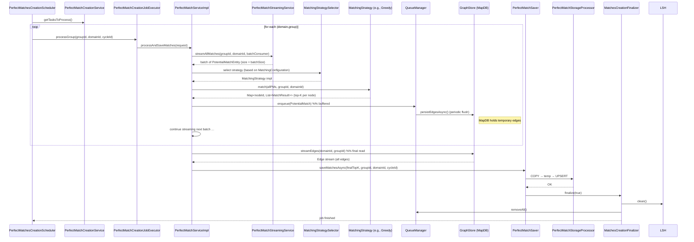

# Perfect‑Matches Creation Module – Low‑Level Design (LLD)

> **Goal** – Produce a *deterministic, high‑quality* set of **perfect matches** (the “gold‑standard” matches) for every active `groupId` / `domainId` pair every night.  
> The flow is similar to the “potential‑matches” pipeline but adds **strict top‑K per node**, **strategy‑driven graph processing**, and a **stream‑‑‑save** pattern that works on *already‑persisted* potential‑match data.

---

## High‑Level Overview

```mermaid
graph TD
    S[PerfectMatchesCreationScheduler (cron 03:00 IST)] -->|tasks| SC[PerfectMatchCreationService]
    SC -->|domain/group semaphores| PEX[PerfectMatchCreationJobExecutor]
    PEX -->|processGroup| PMS[PerfectMatchServiceImpl]
    PMS -->|stream potential matches| PSS[PerfectMatchStreamingService]
    PSS -->|batch -> Consumer| PMS
    PMS -->|select strategy| MSS[MatchingStrategySelector]
    MSS -->|strategy| MS[MatchingStrategy (Greedy, Hungarian, etc)]
    MS -->|graph -> top-K| PMR[PerfectMatchResultBuilder]
    PMR -->|buffer| QM[QueueManager (same impl as potential-matches)]
    QM -->|periodic flush| GS[GraphStore (MapDB temporary edge store)]
    GS -->|final stream| PMS2[PerfectMatchServiceImpl (final-stage)]
    PMS2 -->|save final top-K| PMSV[PerfectMatchSaver]
    PMSV -->|COPY/UPSERT| PMST[PerfectMatchStorageProcessor -> PostgreSQL]
    PMST -->|metrics / cleanup| FM[MatchesCreationFinalizer]
    FM -->|clean LSH, queues, GC| LSH[LSHIndex (shared with potential-matches)]

```

*The **perfect‑matches** pipeline runs **once per day** (cron) and **only on the leader** (see § 9). All other components (queues, LSH, MapDB) are **re‑used** from the potential‑matches module, keeping the code‑base DRY.*

---

## 2️⃣  Component‑by‑Component Deep Dive

| Component | Primary Responsibility | Key Methods | Concurrency Controls | Important Config |
|-----------|------------------------|-------------|----------------------|------------------|
| **PerfectMatchesCreationScheduler** | Top‑level cron driver (`@Scheduled(cron="0 0 3 * * *", zone="Asia/Kolkata")`). Builds a list of `(Domain, groupId)` tasks via `PerfectMatchCreationService.getTasksToProcess()`. | `createPerfectMatches()`, `generatePerfectMatchesCreationGroup()` (retry + circuit‑breaker) | None – just fires the job. | `perfect_matches_creation` timer, error counters |
| **PerfectMatchCreationService** | Orchestrates **domain‑ and group‑level throttling** (`domainSemaphore`, `groupSemaphore`). Creates a `cycleId` and launches a `CompletableFuture` per group (`processGroupTask`). Persists `LastRunPerfectMatches` (status, node count). | `getTasksToProcess()`, `processAllDomains()`, `processGroupTask()` | `domainSemaphore` (max‑concurrent‑domains, default 2) <br> `groupSemaphore` (max‑concurrent‑groups, default 1) | `match.max-concurrent-domains`, `match.max-concurrent-groups` |
| **PerfectMatchCreationJobExecutor** | Thin wrapper that **acquires a per‑group semaphore** (`groupSemaphores`) and delegates to `PerfectMatchService.processAndSaveMatches()`. Handles retries (configurable) and back‑off. | `processGroup()`, `processGroupWithRetriesAsync()` | `groupSemaphores` (max‑concurrent‑groups, default 1) | `match.max-concurrent-groups`, `match.max-retries`, `match.retry-delay-millis` |
| **PerfectMatchServiceImpl** | Core **graph‑building + top‑K extraction** logic. <br>1️⃣ Streams *potential‑match* rows from PostgreSQL (`PerfectMatchStreamingService`). <br>2️⃣ Partitions them into **chunks** (memory‑bounded). <br>3️⃣ For each chunk: <br> • Build an adjacency map per node (priority‑queue limited to `maxMatchesPerNode`). <br> • Apply the **selected `MatchingStrategy`** (e.g., greedy, Hungarian). <br>4️⃣ Persist intermediate edges to `GraphStore` (MapDB) via `QueueManager`. <br>5️⃣ After all chunks, **stream back** from MapDB, keep only the global top‑K per node, and write final rows to PostgreSQL (`PerfectMatchSaver`). | `processAndSaveMatches()`, `processMatchesWithCursor()`, `processPageMatches()` | `cpuTaskSemaphore` (limits concurrent CPU‑heavy sub‑tasks) <br> `memoryExceeded` flag (stops processing if JVM memory > 80 % of `maxMemoryMb`) | `matching.topk.count` (default 100), `matching.max.memory.mb` (default 1024 MiB), `matching.max.concurrent-groups` |
| **PerfectMatchStreamingService** | **Streaming SELECT** of *potential‑matches* (the output of the “potential” job). Uses **JDBC cursor** (`ResultSet.TYPE_FORWARD_ONLY`) with a configurable fetch size (`batchSize`). Retries on SQL errors. | `streamAllMatches(UUID groupId, UUID domainId, Consumer<List<PotentialMatchEntity>> batchConsumer, int batchSize)` | None – runs in the caller’s thread pool (`ioExecutor`). | `node-fetch.batch-size`, `node-fetch.future-timeout-seconds` |
| **MatchingStrategySelector** | Looks up the **algorithm** to use for a given `groupId`/`domainId` based on `MatchingConfiguration`. The map `strategyMap` is populated at startup (Spring `@Component` with all `MatchingStrategy` beans). | `select(MatchingContext ctx, UUID groupId)` | None – pure lookup. | `matching.configuration` tables |
| **MatchingStrategy** (interface) | **Pluggable graph‑matching algorithms** (Greedy, Weighted‑Greedy, Hungarian, Hop‑croft, etc.). Each implementation receives a **flat list of `PotentialMatch`** (already filtered by similarity) and returns a **map**: `nodeId → List<MatchResult>` (top‑K per node). | `match(List<GraphRecords.PotentialMatch> allPMs, UUID groupId, UUID domainId)` | Implementations are **stateless**; they run inside the `cpuExecutor` of `PerfectMatchServiceImpl`. | `matching.topk.count` (global cap) |
| **PerfectMatchSaver** | Thin façade that forwards a batch of `PerfectMatchEntity` to `PerfectMatchStorageProcessor`. Uses a **semaphore (2 permits)** to bound concurrent DB‑COPY operations. | `saveMatchesAsync(List<PerfectMatchEntity> matches, UUID groupId, UUID domainId, String processingCycleId)` | `saveSemaphore` (max 2 concurrent COPY jobs) | `import.batch-size` |
| **PerfectMatchStorageProcessor** | **Bulk‑load** of final perfect matches into PostgreSQL via **COPY → temp table → UPSERT**. Retries on `SQLException`/`TimeoutException`. | `savePerfectMatches(List<PerfectMatchEntity> matches, UUID groupId, UUID domainId, String processingCycleId)` | `ioExecutor` (single‑threaded or small pool) | `import.batch-size`, `SAVE_OPERATION_TIMEOUT_MS` |
| **MatchesCreationFinalizer** | Same component used by the potential‑matches pipeline. After a perfect‑match run it **cleans the LSH index**, **removes all QueueManager instances**, and **forces a GC**. | `finalize(boolean cycleCompleted)` | None (called after the whole batch finishes) | – |
| **QueueManager / QueueManagerFactory** | Re‑used from the potential‑matches module. Buffers `PotentialMatch` objects before they are persisted to MapDB. | `enqueue()`, `flushQueueBlocking()` | Internal semaphores (`periodicFlushSemaphore`, `boostedFlushSemaphore`) | `match.queue.capacity`, `match.flush.interval-seconds`, `match.flush.min-interval-seconds` |
| **GraphStore** | Same MapDB‑based edge store used by the potential‑matches pipeline. Holds **temporary edges** while the perfect‑match job is running. | `persistEdgesAsync()`, `streamEdges()`, `cleanEdges()` | Internal `mapdbExecutor` + `commitExecutor` | `mapdb.batch-size`, `mapdb.commit-threads` |

---

## 3️⃣  Data Model Snapshot

```sql
-- Potential matches (produced by the “potential” job)
CREATE TABLE potential_matches (
    id UUID PRIMARY KEY,
    group_id UUID NOT NULL,
    domain_id UUID NOT NULL,
    processing_cycle_id VARCHAR(36) NOT NULL,
    reference_id VARCHAR(255) NOT NULL,
    matched_reference_id VARCHAR(255) NOT NULL,
    compatibility_score DOUBLE PRECISION NOT NULL,
    matched_at TIMESTAMP NOT NULL,
    UNIQUE (group_id, reference_id, matched_reference_id)
);

-- Perfect matches (final output)
CREATE TABLE perfect_matches (
    id UUID PRIMARY KEY,
    group_id UUID NOT NULL,
    domain_id UUID NOT NULL,
    processing_cycle_id VARCHAR(36) NOT NULL,
    reference_id VARCHAR(255) NOT NULL,
    matched_reference_id VARCHAR(255) NOT NULL,
    compatibility_score DOUBLE PRECISION NOT NULL,
    matched_at TIMESTAMP NOT NULL,
    UNIQUE (group_id, reference_id, matched_reference_id)
);

--  Last run bookkeeping (used by the scheduler)
CREATE TABLE last_run_perfect_matches (
    id UUID PRIMARY KEY,
    group_id UUID NOT NULL,
    domain_id UUID NOT NULL,
    run_date TIMESTAMP,
    node_count BIGINT,
    status VARCHAR(20)   -- PENDING, COMPLETED, FAILED
);
```

*All IDs are `UUID`. The `perfect_matches` table is **append‑only**; the `UPSERT` in `PerfectMatchStorageProcessor` guarantees idempotence.*

---

## 4️⃣  End‑to‑End Sequence (per group)



### Key Phases

| Phase | What Happens | Concurrency | Failure Handling |
|------|--------------|-------------|------------------|
| **Task discovery** | `PerfectMatchCreationService.getTasksToProcess()` decides which groups need a run (node‑count changed or previous run failed). | Single thread (scheduler) | If DB query fails → job aborts, error counter `perfect_matches_creation_errors_total`. |
| **Domain / Group lock acquisition** | `domainSemaphore` → `groupSemaphore` → `groupSemaphores` (per‑group). | Bounded by config (`max-concurrent-domains`, `max-concurrent-groups`). | Timeout → `generatePerfectMatchesCreationGroupFallback` marks run as **FAILED**. |
| **Streaming potential matches** | JDBC cursor (`ResultSet.TYPE_FORWARD_ONLY`) with fetch size = `batchSize`. | Runs on `ioExecutor` (single‑threaded or small pool). | Retries up to 3 (`maxRetries`). On final failure → whole group marked **FAILED**. |
| **Chunk processing** | Each batch is split into **sub‑batches** (`adjustBatchSize()`) to keep memory < `maxMemoryMb * 0.8`. A `cpuTaskSemaphore` limits parallel CPU work. | `cpuExecutor` (size = `availableProcessors * 2`). | If memory threshold exceeded → `CancellationException` aborts all remaining futures, group marked **FAILED**. |
| **Strategy execution** | Stateless `MatchingStrategy` receives a flat list of `PotentialMatch`. It builds a **priority‑queue per node** (size = `maxMatchesPerNode`) and then runs the algorithm (greedy, Hungarian, …). | Same `cpuExecutor`. | Exceptions bubble up → caught by `processMatchesWithCursor` → group marked **FAILED**. |
| **Queue → MapDB** | `QueueManager.enqueue()` → periodic flush (every `flushIntervalSeconds`). Boosted flush when queue > `drainWarningThreshold`. | `flushExecutor` (single‑threaded) + `periodicFlushSemaphore`. | Flush failures → `flushQueueBlocking` fallback logs and drops remaining items; metric `match_drops_total`. |
| **Final edge stream** | After all chunks, `GraphStore.streamEdges()` returns a **stream of all edges** (including duplicates). The service re‑aggregates per node, keeps global top‑K, and builds `PerfectMatchEntity`. | Runs on the same `cpuExecutor`. | If streaming throws → group marked **FAILED**. |
| **Persist final matches** | `PerfectMatchSaver.saveMatchesAsync()` → `PerfectMatchStorageProcessor.savePerfectMatches()` (COPY → temp → UPSERT). | `ioExecutor` (single‑threaded, bounded by `saveSemaphore`). | `@Retryable` (3 attempts, exponential back‑off). On final failure → group marked **FAILED**. |
| **Finalizer** | `MatchesCreationFinalizer.finalize(true)` → `QueueManager.removeAll()`, `LSHIndex.clean()`, `System.gc()`. | Runs on the scheduler thread after `CompletableFuture.allOf` completes. | Errors are logged; they do **not** affect the already‑committed matches. |

---

## 5️⃣  Concurrency & Back‑Pressure Model

| Resource | Semaphore / Guard | Max Permits (default) | Reason |
|----------|-------------------|-----------------------|--------|
| `domainSemaphore` | `java.util.concurrent.Semaphore` | 2 | Prevents the DB/CPU from being hammered by many domains simultaneously. |
| `groupSemaphore` (service‑level) | `Semaphore` | 1 | Guarantees **exactly‑once** processing per group. |
| `groupSemaphores` (executor‑level) | `ConcurrentMap<UUID, Semaphore>` | 1 per group (max‑concurrent‑groups) | Allows **parallel groups** when the config permits it. |
| `cpuTaskSemaphore` | `Semaphore` | `availableProcessors * 2` | Limits the number of CPU‑heavy sub‑tasks (building adjacency maps, running Hungarian, etc.). |
| `saveSemaphore` (PerfectMatchSaver) | `Semaphore` | 2 | Limits concurrent COPY jobs (COPY is I/O‑heavy). |
| `periodicFlushSemaphore` / `boostedFlushSemaphore` (QueueManager) | `Semaphore` | 2 / 1 | Guarantees only one flush runs at a time; boosted flush is exclusive. |

**Back‑pressure flow:**

1. **QueueManager** monitors its internal `LinkedBlockingQueue`. When `size / capacity > drainWarningThreshold` it triggers a **boosted flush** (larger batch, exclusive semaphore).
2. If `enqueue()` times out (1 s) the match is **dropped** and counted under `match_drops_total{reason="queue_timeout"}`.
3. The **MapDB** writer (`persistEdgesAsync`) is also bounded by a **batch size** (`batchSize` config) and a **commit timeout** (100 s). If a commit stalls, the future fails → the whole group is marked **FAILED**.

---

## 6️⃣  Fault‑Tolerance & Retry Lifecycle

### 6.1  Retry / Circuit‑Breaker Summary

| Layer | Retry Mechanism | Max Attempts | Back‑off | Circuit‑Breaker | Fallback |
|-------|----------------|--------------|----------|-----------------|----------|
| Scheduler → `generatePerfectMatchesCreationGroup` | Spring `@Retry(name="perfect_matches")` | 3 | Exponential (default) | Spring `@CircuitBreaker(name="perfect_matches")` | `generatePerfectMatchesCreationGroupFallback` (marks run **FAILED**) |
| JobExecutor → `processGroup` | Manual loop (`processGroupWithRetriesRecursive`) | `maxRetries` (config) | `retryDelayMillis * 2^(attempt‑1)` | Same circuit‑breaker as above | No extra fallback – failure bubbles up |
| Streaming Service → `streamAllMatches` | Manual retry loop (3 attempts) | 3 | Linear (1 s, 2 s, 3 s) | – | Throws RuntimeException → group fails |
| PerfectMatchStorageProcessor → `saveBatch` | Spring `@Retryable` (SQL/Timeout) | 3 | 1 s → 2 s → 4 s | – | Throws `CompletionException` → group fails |
| LSH Index (if used) | Handled in `MetadataEdgeBuildingStrategy` (not used for perfect matches) | – | – | – | Not applicable |

### 6.2  Failure Propagation Flowchart

```mermaid
flowchart TD
    A[Start group] --> B{Acquire semaphores}
    B -->|OK| C[Stream potential matches]
    C -->|SQL error| D[Retry up to 3]
    D -->|Exhausted| E[Mark LastRun FAILED, abort]
    C -->|Success| F[Chunk processing]
    F -->|Memory > limit| G[Cancel all futures]
    G --> E
    F -->|Algorithm exception| H[Log and mark FAILED]
    H --> E
    F -->|All chunks OK| I[Flush Queue -> MapDB]
    I --> J[Stream edges from MapDB]
    J --> K[Apply final top-K]
    K --> L[Save final matches (COPY)]
    L -->|SQL error| M[Retry up to 3]
    M -->|Exhausted| E
    L --> N[Mark LastRun COMPLETED]
    N --> O[Finalizer clean LSH, queues, GC]
    O --> P[Group finished]

```

*Every branch that ends in **E** increments `perfect_matches_creation_errors_total` and updates `LastRunPerfectMatches.status = FAILED`.*

---

## 7️⃣  Observability (Micrometer)

| Metric (name) | Tags | Type | When emitted |
|---------------|------|------|--------------|
| `perfect_matches_creation` | `domainId`, `groupId` | Counter | After a group finishes successfully. |
| `perfect_matches_creation_errors_total` | `groupId` | Counter | Any uncaught exception in the group pipeline. |
| `perfect_match_storage_duration` | `groupId` | Timer | Whole COPY‑UPSERT operation. |
| `perfect_match_storage_batch_duration` | `groupId` | Timer | Each batch inside `saveBatch`. |
| `perfect_match_storage_errors_total` | `groupId`, `error_type` | Counter | DB‑level failures. |
| `matching_duration` | `groupId`, `domainId`, `cycleId` | Timer | Whole `processAndSaveMatches` call. |
| `matching_errors_total` | `groupId`, `domainId`, `cycleId` | Counter | Any exception inside `PerfectMatchServiceImpl`. |
| `match_drops_total` | `groupId`, `reason`, `match_type` | Counter | Queue full / timeout / interrupt. |
| `queue_drain_warnings_total` | `groupId` | Counter | Queue > `drainWarningThreshold`. |
| `graph_preprocessor_duration` | `groupId` | Timer | Time spent building the graph (same as potential‑matches). |
| `heap_usage_before_cleanup` / `heap_usage_after_cleanup` | – | Gauge | Logged by `MatchesCreationFinalizer`. |
| `system_cpu_usage` | – | Gauge | Added by `PerfectMatchStorageProcessor`. |

All timers are **sampled per group** (`groupId` tag) so you can drill down to the slowest groups in Grafana.

---

## 8️⃣  Throughput vs Latency – Sizing Guide

| Parameter | Recommended Starting Value | How to tune |
|-----------|---------------------------|-------------|
| `matching.topk.count` | 100 | Increase only if business needs more candidates per node; watch memory (each extra slot adds ~16 B per edge). |
| `matching.max.memory.mb` | 1024 MiB | Raise on machines with > 4 GiB heap; keep `maxMemoryMb * 0.8` < JVM max‑heap. |
| `node-fetch.batch-size` | 500 | Larger batches reduce round‑trips but increase per‑batch memory. |
| `import.batch-size` (final COPY) | 1000 | Larger batches improve DB throughput but increase latency of a single batch failure. |
| `match.max-concurrent-groups` | 1 (default) | Raise to 2‑3 on a 16‑core box if DB I/O can keep up. |
| `match.max-concurrent-domains` | 2 | Same as above – keep total permits ≤ `cpuExecutor` size. |
| `match.flush.interval-seconds` | 5 | Lower (e.g., 2 s) if the queue grows fast; higher (10 s) if DB can tolerate larger batches. |
| `match.drain-warning-threshold` | 0.8 | Keep at 0.8; if you see many “boosted drain” warnings, increase `maxConcurrentBatches` or `queue.capacity`. |

**Rule of thumb:**
- **Memory bound** → keep `maxMatchesPerNode * maxMatchesPerNode * #nodes` < `maxMemoryMb`.
- **CPU bound** → `cpuTaskSemaphore` permits ≈ `availableProcessors * 2`.
- **I/O bound** → monitor `perfect_match_storage_batch_duration`; if > 2 s, increase `import.batch-size` or add a second `ioExecutor` thread.

---

## 9️⃣  Horizontal Scaling & Distributed Coordination

The **perfect‑matches** job is *stateful* (it writes to a shared MapDB file and updates a global `LastRunPerfectMatches` table). To run it on a **cluster** you need:

| Concern | Distributed Solution |
|---------|----------------------|
| **Leader election** (only one instance runs the cron) | **Kubernetes Lease** (`spring-cloud-kubernetes-leader`) or **Redis Redlock**. |
| **Domain / Group semaphores** (prevent two nodes from processing the same group) | **Redis SETNX** with TTL (same key pattern as the in‑process semaphore). The key expires automatically if the node crashes. |
| **QueueManager** (shared buffer) | Replace the in‑process `QueueManager` with **Redis Streams** (one stream per `groupId`). The existing `flushSignalCallback` can stay – it just reads from the stream instead of a local queue. |
| **MapDB** (temporary edge store) | **RocksDB** or **Apache Ignite** (distributed key‑value) – or keep MapDB *local* and let each node process a **disjoint subset of groups** (sharding by `groupId % N`). |
| **Final persistence** | No change – all nodes write to the same PostgreSQL table via COPY; PostgreSQL handles concurrent COPY with separate temp tables. |
| **Metrics aggregation** | Prometheus scrapes each pod; use `groupId` tag to aggregate across pods. |

**Sharding strategy (simpler)**
- Partition groups by `hash(groupId) % NUM_NODES`.
- Each node only sees its own slice → no distributed locks needed.
- The scheduler still runs on every node, but each node’s `getTasksToProcess()` filters out groups that belong to other shards.

---

## 🔧  Detailed Flow of a Single Chunk (CPU‑heavy part)

```mermaid
flowchart TD
    subgraph ChunkProcessing
        A[Receive sub-batch of PotentialMatchEntity] --> B[Group by nodeId (Map String, PriorityQueue)];
        B --> C[Trim each PQ to maxMatchesPerNode];
        C --> D[Select MatchingStrategy];
        D --> E[Run algorithm (e.g., Greedy) to Map nodeId -> List MatchResult];
        E --> F[Convert MatchResult to PerfectMatchEntity];
        F --> G[Add to buffer];
        G --> H{buffer size >= batchSize?}
        H -->|yes| I[saveMatchesAsync(buffer)];
        H -->|no| J[continue];
        I --> K[clear buffer];
    end

```

*All steps run inside `cpuExecutor`. The `cpuTaskSemaphore` guarantees that at most `availableProcessors * 2` such pipelines are active simultaneously.*

---

## 📦  Supporting Classes (Brief)

| Class | Role |
|-------|------|
| `MatchingContext` | Holds `groupId`, `domainId`, `matchType`, `isCostBased`, `industry`, etc. – passed from `PerfectMatchServiceImpl` to the selector. |
| `MatchResult` | Simple DTO: `partnerId`, `score`. |
| `PerfectMatchEntity` | JPA/DTO for the final table (same fields as `PotentialMatchEntity`). |
| `PerfectMatchSerializer` | Implements `CopyStreamSerializer<PerfectMatchEntity>` – writes binary COPY rows. |
| `BinaryCopyInputStream` | Utility that wraps a list + serializer into an `InputStream` for `CopyManager`. |
| `QueryUtils` | Holds static SQL strings (`getAllPotentialMatchesStreamingSQL()`, `getPrefectMatchesTempTableSQL()`, `getUpsertPerfectMatchesSql()`). |
| `GraphRequestFactory` | Builds `MatchingContext` and other request objects (re‑used from potential‑matches). |
| `MatchingConfigurationRepository` / `MatchingGroupRepository` | JPA repos for the config tables. |
| `LastRunPerfectMatchesRepository` | JPA repo for the bookkeeping table. |

---

## 🛡️  Cleanup & Resource Release

| When | Action |
|------|--------|
| **After each group** (`processGroupTask` `whenComplete`) | `groupSemaphore.release()`, `domainSemaphore.release()`, `matchesCreationFinalizer.finalize(true)` (cleans LSH, queues, GC). |
| **On application shutdown** (`@PreDestroy` in `PerfectMatchStorageProcessor`, `PerfectMatchSaver`, `PerfectMatchCreationJobExecutor`) | Shut down executors, close DB connections, release semaphores. |
| **If memory limit exceeded** | `memoryExceeded` flag set → all pending futures cancelled, `LastRun` set to **FAILED**, finalizer still runs (cleans LSH). |
| **If a batch fails after retries** | The `CompletableFuture` for that group completes exceptionally → `processAllDomains` logs the error, increments error counters, and continues with other groups. |

---

## 📈  Metrics Dashboard (Suggested Grafana Panels)

1. **Perfect‑Match Job Overview** – `perfect_matches_creation` (counter) + `perfect_matches_creation_errors_total`.
2. **Per‑Group Latency** – heat‑map of `matching_duration` (groupId on Y‑axis, time on X‑axis).
3. **Queue Health** – line chart of `queue_drain_warnings_total` and `match_drops_total{reason="queue_timeout"}`.
4. **DB Load** – `perfect_match_storage_batch_duration` and `perfect_match_storage_matches_saved_total`.
5. **CPU Utilisation** – `cpu_executor_active` gauge (from `cpuExecutor`).
6. **Memory Pressure** – `heap_usage_before_cleanup` vs `heap_usage_after_cleanup`.
7. **Strategy‑Specific Counters** – each `MatchingStrategy` can emit `matches_generated_total{strategy="greedy"}`.

---

