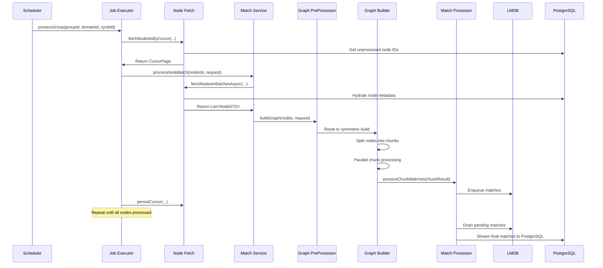
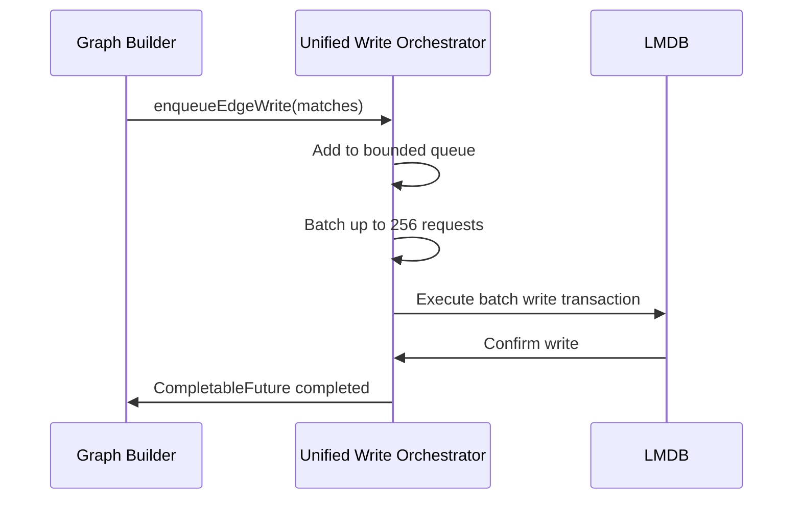

# Low-Level Design (LLD) Document: Potential Matches Creation Module
## Version 1.0 | Last Updated: October 2024
### Audience: Engineering Team, Architects, Technical Stakeholders
### Purpose: This document provides a detailed technical specification of the batch processing module responsible for computing potential similarity matches between graph nodes across domains and matching groups. It includes component-level design, data flows, concurrency models, and operational specifications.

---

## 1.0 Document Overview
This module is a production-grade Spring Boot batch processing system that runs daily scheduled workflows to compute potential similarity matches between millions of graph nodes. The system is designed for scalability, fault tolerance, and observability, with support for resumable processing, high-performance intermediate storage, and bulk persistent storage.

## 2.0 Scope
### Included
- Scheduled batch cycle orchestration
- Cursor-based resumable node fetching
- Dynamic weight function resolution for matching
- Parallel graph construction and match computation
- Intermediate match storage (LMDB)
- Bulk persistent storage (PostgreSQL)
- Concurrency control and fault tolerance
- Observability and metrics tracking

### Excluded
- Real-time matching workflows
- User interface components
- External API endpoints for manual triggering
- Third-party integration logic

## 3.0 System Context
```mermaid
contextDiagram
    participant Scheduler as "Scheduled Trigger"
    participant Module as "Potential Matches Creation Module"
    participant NodeDB as "Node Metadata Database"
    participant MatchDB as "Potential Matches Database"
    participant LMDB as "LMDB Intermediate Storage"
    participant Monitor as "Monitoring System (Prometheus/Grafana)"

    Scheduler --> Module: Daily Trigger
    Module --> NodeDB: Fetch Nodes & Metadata
    Module --> LMDB: Intermediate Match Storage
    Module --> MatchDB: Final Match Persistence
    Module --> Monitor: Metrics & Logs
```

## 4.0 Component-Level Design
### 4.1 Core Orchestration Layer

#### 4.1.1 PotentialMatchesCreationScheduler
| Attribute | Details |
|-----------|---------|
| **Type** | Spring `@Component` with `@Scheduled` and `@Profile("!singleton")` |
| **Core Responsibilities** | Orchestrate daily batch cycles; manage domain-level concurrency; coordinate group processing tasks; handle cycle completion/timeout/cleanup |
| **Key APIs** | <ul><li>`processAllDomainsScheduled()`: Scheduled entry point (cron: `0 5 11 * * * Asia/Kolkata`)</li><li>`processGroupTask(GroupTaskRequest request)`: Asynchronous task for group processing</li><li>`executeGroupTaskChain(GroupTaskRequest req)`: Core processing chain for a group</li></ul> |
| **Dependencies** | `DomainService`, `MatchingGroupRepository`, `PotentialMatchesCreationJobExecutor`, `PotentialMatchComputationProcessor`, `MatchesCreationFinalizer` |
| **Critical Implementation Details** | <ul><li>Uses `ConcurrentHashMap<UUID, CompletableFuture<Void>> groupLocks` to enforce sequential processing per group</li><li>Validates executor pool size to avoid deadlocks: `batchExecutor` must have ≥ `maxConcurrentDomains + 2` threads</li><li>Global cycle timeout: 3 hours via `CompletableFuture.orTimeout()`</li></ul> |

#### 4.1.2 PotentialMatchesCreationJobExecutor
| Attribute | Details |
|-----------|---------|
| **Type** | Spring `@Component` |
| **Core Responsibilities** | Recursive node batch processing; cursor-based pagination; retry logic for failed batches |
| **Key APIs** | <ul><li>`processGroup(UUID groupId, UUID domainId, String cycleId)`: Initiate group processing</li><li>`processGroupRecursive(...)`: Recursive batch fetching and processing</li></ul> |
| **Dependencies** | `PotentialMatchService`, `NodeFetchService`, `MeterRegistry` |
| **Critical Implementation Details** | <ul><li>Exponential backoff retries: 3 max attempts with 1s base delay</li><li>Empty batch tolerance: Stops processing after 3 consecutive empty batches</li><li>Cursor persistence: Saves last processed node ID/timestamp to resume processing</li></ul> |

### 4.2 Node Fetch Layer

#### 4.2.1 NodeFetchService
| Attribute | Details |
|-----------|---------|
| **Type** | Spring `@Service` |
| **Core Responsibilities** | Node ID fetching; metadata hydration; cursor persistence; node state management |
| **Key APIs** | <ul><li>`fetchNodeIdsByCursor(...)`: Cursor-based node ID pagination</li><li>`fetchNodesInBatchesAsync(...)`: Hydrate node metadata</li><li>`persistCursor(...)`: Save cursor state</li><li>`markNodesAsProcessed(...)`: Mark nodes as processed to avoid rework</li></ul> |
| **Dependencies** | `NodeRepository`, `NodesCursorRepository`, `MeterRegistry` |
| **Critical Implementation Details** | <ul><li>Sliding window pagination: 200-node overlap to prevent missing cross-batch matches</li><li>Semaphore-controlled DB fetch: 4 concurrent queries max</li><li>30-second timeout for all async operations</li></ul> |

### 4.3 Graph Processing Layer

#### 4.3.1 WeightFunctionResolver
| Attribute | Details |
|-----------|---------|
| **Type** | Spring `@Component` |
| **Core Responsibilities** | Dynamically resolve matching strategies based on node metadata; register new weight functions |
| **Key APIs** | <ul><li>`resolveWeightFunctionKey(UUID groupId)`: Generate unique weight function key from metadata</li></ul> |
| **Dependencies** | `NodeRepository`, `WeightFunctionRegistry` |
| **Critical Implementation Details** | <ul><li>Falls back to "flat" strategy if no valid metadata is found</li><li>Registers new weight functions with `WeightFunctionRegistry` if not present</li></ul> |

#### 4.3.2 GraphPreProcessor
| Attribute | Details |
|-----------|---------|
| **Type** | Spring `@Component` |
| **Core Responsibilities** | Graph build orchestration; concurrency control; match type inference |
| **Key APIs** | <ul><li>`buildGraph(List<NodeDTO>, MatchingRequest)`: Coordinate graph construction</li><li>`inferMatchType(List<NodeDTO>, List<NodeDTO>)`: Detect symmetric/bipartite match type</li></ul> |
| **Dependencies** | `SymmetricGraphBuilderService`, `BipartiteGraphBuilderService`, `PartitionStrategy` |
| **Critical Implementation Details** | <ul><li>Semaphore-controlled graph builds: 2 concurrent builds max</li><li>45-minute hard timeout for graph builds</li><li>Can infer match type from existing LMDB edges</li></ul> |

#### 4.3.3 SymmetricGraphBuilder
| Attribute | Details |
|-----------|---------|
| **Type** | Spring `@Service` |
| **Core Responsibilities** | Parallel symmetric graph construction; chunked node processing |
| **Key APIs** | <ul><li>`build(List<NodeDTO>, MatchingRequest)`: Execute symmetric graph build</li></ul> |
| **Dependencies** | `SymmetricEdgeBuildingStrategyFactory`, `PotentialMatchComputationProcessor` |
| **Critical Implementation Details** | <ul><li>Chunk size: 500 nodes per chunk</li><li>Parallel workers: 8 max concurrent batch processors</li><li>Caffeine cache for cleanup guards during shutdown</li></ul> |

### 4.4 Processing & Storage Layer

#### 4.4.1 PotentialMatchComputationProcessorImp
| Attribute | Details |
|-----------|---------|
| **Type** | Spring `@Component` |
| **Core Responsibilities** | Match queueing; intermediate storage; final persistence orchestration |
| **Key APIs** | <ul><li>`processChunkMatches(...)`: Enqueue matches from graph builds</li><li>`savePendingMatchesAsync(...)`: Flush queue to LMDB</li><li>`saveFinalMatches(...)`: Stream matches from LMDB to PostgreSQL</li></ul> |
| **Dependencies** | `GraphStore`, `PotentialMatchSaver`, `QueueManagerFactory` |
| **Critical Implementation Details** | <ul><li>Disk-spilling queue: 1M in-memory capacity with automatic disk spill</li><li>Backpressure handling: Pauses queue draining when system is overloaded</li><li>Graceful shutdown: Flushes all pending queues before termination</li></ul> |

#### 4.4.2 UnifiedWriteOrchestrator
| Attribute | Details |
|-----------|---------|
| **Type** | Spring `@Component` |
| **Core Responsibilities** | LMDB write orchestration; single-threaded writer to avoid contention |
| **Key APIs** | <ul><li>`enqueueEdgeWrite(...)`: Enqueue edge matches for LMDB persistence</li><li>`enqueueLshWrite(...)`: Enqueue LSH bucket updates</li></ul> |
| **Dependencies** | `LmdbEnvironment`, `LshBucketManager` |
| **Critical Implementation Details** | <ul><li>Bounded queue: 10k capacity</li><li>Batch processing: 256 max requests per batch</li><li>Retry logic: 3 attempts with 100ms base delay</li></ul> |

#### 4.4.3 PotentialMatchStorageProcessor
| Attribute | Details |
|-----------|---------|
| **Type** | Spring `@Component` |
| **Core Responsibilities** | PostgreSQL bulk persistence; transaction management; advisory locking |
| **Key APIs** | <ul><li>`savePotentialMatches(...)`: Bulk save intermediate matches</li><li>`saveAndFinalizeMatches(...)`: Finalize matches and merge to main table</li></ul> |
| **Dependencies** | `HikariDataSource`, `CopyManager` (PostgreSQL) |
| **Critical Implementation Details** | <ul><li>PostgreSQL `COPY` command for high-throughput inserts (50k batch size)</li><li>Advisory locks to prevent concurrent writes to the same group</li><li>Deadlock retries: 3 attempts with exponential backoff</li></ul> |

## 5.0 Data Models & Schemas
### 5.1 Core DTOs & Value Objects
```java
// Group Task Request
record GroupTaskRequest(Domain domain, UUID groupId, String cycleId) {}

// Cursor Page for Pagination
record CursorPage(List<UUID> ids, boolean hasMore, LocalDateTime lastCreatedAt, UUID lastId) {}

// Potential Match (Graph Records)
public class PotentialMatch {
    private String referenceId;
    private String matchedReferenceId;
    private double compatibilityScore;
    private UUID domainId;
}

// Edge DTO for LMDB Storage
public class EdgeDTO {
    private String fromNodeHash;
    private String toNodeHash;
    private float score;
    private UUID domainId;
    private UUID groupId;
}
```

### 5.2 Database Schemas (Relevant Snippets)
#### Potential Matches Table
```sql
CREATE TABLE potential_matches (
    id UUID PRIMARY KEY DEFAULT uuid_generate_v4(),
    group_id UUID NOT NULL,
    domain_id UUID NOT NULL,
    processing_cycle_id VARCHAR(64) NOT NULL,
    reference_id VARCHAR(255) NOT NULL,
    matched_reference_id VARCHAR(255) NOT NULL,
    compatibility_score FLOAT NOT NULL,
    matched_at TIMESTAMP NOT NULL DEFAULT CURRENT_TIMESTAMP,
    CONSTRAINT idx_group_cycle UNIQUE (group_id, processing_cycle_id, reference_id, matched_reference_id)
);
```

#### Nodes Cursor Table
```sql
CREATE TABLE nodes_cursor (
    group_id UUID NOT NULL,
    domain_id UUID NOT NULL,
    cursor_created_at TIMESTAMP WITH TIME ZONE,
    cursor_id UUID,
    updated_at TIMESTAMP WITH TIME ZONE DEFAULT CURRENT_TIMESTAMP,
    PRIMARY KEY (group_id, domain_id)
);
```

## 6.0 Critical Workflow Sequences
### 6.1 Group Processing Pipeline


### 6.2 LMDB Write Orchestration


## 7.0 Concurrency & Thread Safety
### 7.1 Semaphore Controls
| Semaphore | Purpose | Default Permits | Timeout |
|-----------|---------|-----------------|---------|
| `domainSemaphore` | Limit concurrent domain processing | 2 | 120 minutes |
| `buildSemaphore` | Limit concurrent graph builds | 2 | 60 minutes |
| `dbFetchSemaphore` | Limit concurrent node fetch DB calls | 4 | 60 seconds |
| `saveSemaphore` | Limit concurrent match save operations | 16 | N/A |

### 7.2 Executor Services
| Executor | Purpose | Core Pool Size | Max Pool Size |
|----------|---------|----------------|---------------|
| `matchCreationExecutorService` | Core batch processing | 8 | 16 |
| `graphBuildExecutor` | Graph construction | 8 | 16 |
| `persistenceExecutor` | LMDB persistence | 4 | 8 |
| `matchesStorageExecutor` | PostgreSQL bulk writes | 8 | 16 |

## 8.0 Error Handling & Fault Tolerance
### 8.1 Timeout Strategy
| Operation | Timeout |
|-----------|---------|
| Global batch cycle | 3 hours |
| Graph build | 45 minutes |
| Domain semaphore acquisition | 120 minutes |
| Match save operation | 300 seconds |

### 8.2 Retry Strategy
| Operation | Max Retries | Backoff |
|-----------|-------------|---------|
| Node batch processing | 3 | Exponential (1s → 2s → 4s) |
| LMDB persistence | 5 | Exponential (100ms → 200ms → 400ms) |
| Database deadlocks | 3 | Exponential (500ms → 1s → 2s) |

### 8.3 Idempotency Measures
- Nodes are marked as processed after successful matching
- Cursor persistence enables resumable processing after interruptions
- Database merge operations prevent duplicate match entries

## 9.0 Performance Optimizations
| Optimization | Implementation |
|--------------|----------------|
| **Chunked Processing** | Nodes split into 500-node chunks for parallel graph building |
| **Bulk Inserts** | PostgreSQL `COPY` command for 50k-match batches |
| **LMDB Batching** | Single-threaded writer with 256-request batch size |
| **Disk-Spilling Queues** | 1M in-memory capacity with automatic disk spill for match queueing |
| **Sliding Window Pagination** | 200-node overlap to prevent missing cross-batch matches |

## 10.0 Configuration Management
### 10.1 Core Configuration Parameters
| Parameter | Default Value | Description |
|-----------|---------------|-------------|
| `match.max-concurrent-domains` | 2 | Maximum concurrent domains processed |
| `graph.chunk-size` | 500 | Node chunk size for parallel processing |
| `match.queue.capacity` | 1,000,000 | In-memory match queue capacity |
| `matches.save.batch-size` | 50,000 | PostgreSQL bulk insert batch size |
| `graph.max-concurrent-builds` | 2 | Maximum concurrent graph builds |

## 11.0 Observability & Monitoring
### 11.1 Key Metrics
| Metric Category | Critical Metrics |
|-----------------|------------------|
| **Batch Cycle** | `batch_matches_total_duration`, `batch_cycle_timeout`, `batch_cycle_failure` |
| **Graph Build** | `graph_build_queue_length`, `graph_preprocessor_duration`, `graph_build_failure` |
| **Storage** | `edges_written_total`, `storage_processor_matches_saved_total`, `lsh.bulk_ingest.success` |
| **Error Tracking** | `matches_creation_error`, `match.job.failed_max_retries`, `final_save.error` |

### 11.2 Logging Strategy
- Structured logging with SLF4J/Logback
- Unique `cycleId` for tracing entire batch runs
- Detailed progress logging for long-running operations
- Error logging with root cause tracking

## 12.0 Deployment & Operational Considerations
### 12.1 Profile Usage
- `@Profile("!singleton")`: Disables the scheduler for local development/single-instance deployments
- Production profile: Enables all scheduled workflows and production optimizations

### 12.2 LMDB Storage Requirements
- Dedicated disk volume for LMDB storage (low latency, high IOPS)
- Minimum 100GB free space for intermediate match storage
- Transaction logging enabled for data consistency

### 12.3 Sizing Guidelines
- For 10M+ nodes: Increase `graph.max-concurrent-batches` to 16
- For high-volume match datasets: Increase `match.queue.capacity` to 2M
- For large domains: Increase `match.max-concurrent-domains` to 4 (with corresponding executor pool sizing)