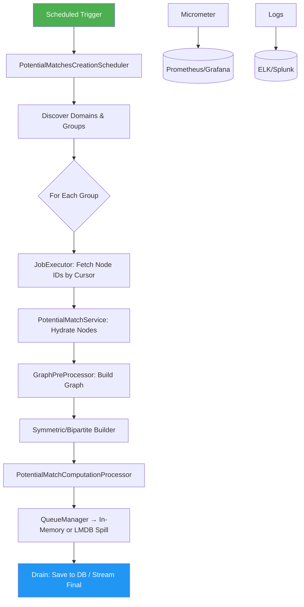
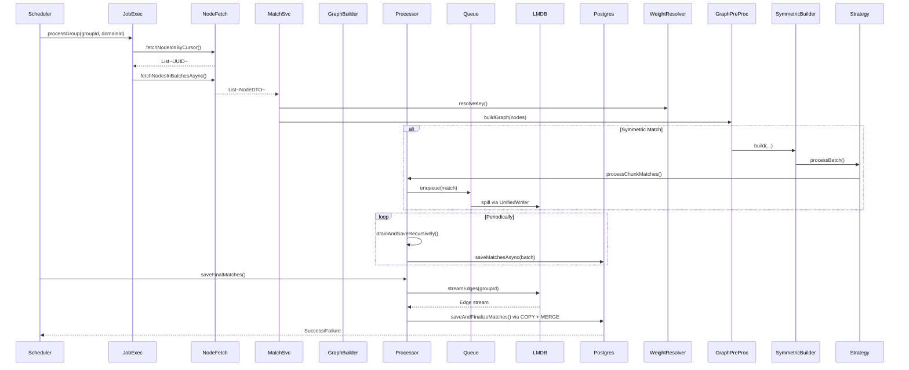
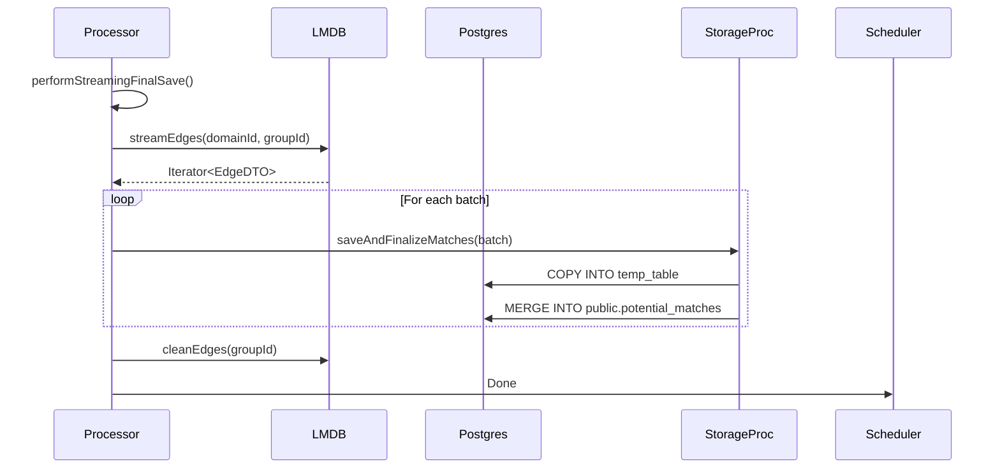

# 📚 **Low-Level Design (LLD) Document: Potential Matches Creation Module**

> **Version:** 1.0  
> **Author:** [Your Name]  
> **Team:** Matching Engine Team  
> **Date:** May 2025

---

## Table of Contents

1. [Overview](#1-overview)
2. [Requirements](#2-requirements)
3. [High-Level Architecture](#3-high-level-architecture)
4. [Component-Level Design](#4-component-level-design)
5. [Data Flow & Sequence Diagrams](#5-data-flow--sequence-diagrams)
6. [Class Diagram](#6-class-diagram)
7. [Concurrency Model](#7-concurrency-model)
8. [Error Handling & Resilience](#8-error-handling--resilience)
9. [Persistence Strategy](#9-persistence-strategy)
10. [Observability & Monitoring](#10-observability--monitoring)
11. [Performance Considerations](#11-performance-considerations)
12. [Scalability & Extensibility](#12-scalability--extensibility)
13. [Testing Strategy](#13-testing-strategy)
14. [Deployment & Operations](#14-deployment--operations)
15. [Open Questions & Future Work](#15-open-questions--future-work)

---

## 1. Overview

The **Potential Matches Creation Module** is a high-throughput, fault-tolerant batch processing system that computes similarity-based matches between large datasets using graph algorithms and metadata-driven weighting.

It processes millions of nodes daily across multiple domains and matching groups, ensuring:
- No data loss
- Resume-on-failure capability
- Controlled concurrency
- Memory safety via spill-to-disk
- Final persistence into PostgreSQL with deduplication

This document provides a **comprehensive low-level design (LLD)** covering architecture, components, flow, error handling, threading model, and operational concerns.

---

## 2. Requirements

### 2.1 Functional Requirements

| ID | Requirement |
|----|-----------|
| FR-01 | Run once daily at 11:05 AM IST (`Asia/Kolkata`) |
| FR-02 | Process all active `Domain`s and their associated `MatchingGroup`s |
| FR-03 | For each group, compute potential matches from unprocessed nodes only |
| FR-04 | Use dynamic weight functions based on node metadata schema |
| FR-05 | Support both symmetric (self-matching) and bipartite (cross-type) matching |
| FR-06 | Persist intermediate results to disk (LMDB) to prevent OOM |
| FR-07 | Finalize matches into relational database (PostgreSQL) |
| FR-08 | Ensure exactly-once semantics per `(groupId, cycleId)` |

### 2.2 Non-Functional Requirements

| ID | Requirement |
|----|-----------|
| NFR-01 | Throughput: Handle up to **50M nodes/day** |
| NFR-02 | Latency: Complete cycle within **<3 hours** |
| NFR-03 | Reliability: Resume after restart/failure without reprocessing |
| NFR-04 | Observability: Full metrics + structured logging |
| NFR-05 | Concurrency: Limit parallel domain execution; serialize per-group |
| NFR-06 | Fault Tolerance: Retry transient failures with exponential backoff |
| NFR-07 | Scalability: Horizontally scalable via domain partitioning |
| NFR-08 | Graceful Shutdown: Flush pending matches before exit |

---

## 3. High-Level Architecture



### Key Layers:
1. **Orchestration Layer**: Scheduler, task chaining
2. **Processing Layer**: Graph building, edge generation
3. **Buffering Layer**: QueueManager + LMDB spill
4. **Persistence Layer**: Unified writer → LMDB + PostgreSQL
5. **Observability Layer**: Metrics, logs, tracing

---

## 4. Component-Level Design

### 4.1 `PotentialMatchesCreationScheduler`

**Responsibility:** Top-level orchestration of the entire batch cycle.

#### Key Features:
- Uses `@Scheduled(cron = "0 5 11 * * *", zone = "Asia/Kolkata")`
- Limits concurrent domains via `Semaphore(maxConcurrentDomains)`
- Prevents overlapping group executions using `groupLocks: Map<UUID, CompletableFuture>`
- Emits metrics for total duration and timeouts
- Handles cleanup post-cycle

#### State Management:
```java
private final Semaphore domainSemaphore;
private final ConcurrentMap<UUID, CompletableFuture<Void>> groupLocks;
```

> Ensures max two domains run in parallel, but unlimited groups as long as not conflicting.

---

### 4.2 `PotentialMatchesCreationJobExecutor`

**Responsibility:** Iteratively fetches unprocessed node IDs using cursor pagination.

#### Pagination Logic:
- Queries `nodeRepository.findUnprocessedNodeIdsAndDatesByCursor(...)`
- Applies overlap (`+200`) to avoid missing records due to clock skew
- Stops when 3 consecutive empty pages returned
- Persists cursor after every page

#### Retry Strategy:
- Retries failed batches up to `max-retries=3`
- Exponential backoff: `delay = baseDelay * 2^(attempt−1)`
- Logs retry attempts and warns on max retries reached

---

### 4.3 `NodeFetchService`

**Responsibility:** Hydration and state tracking of nodes.

#### Methods:
| Method | Purpose |
|------|--------|
| `fetchNodeIdsByCursor()` | Paginate unprocessed node IDs |
| `fetchNodesInBatchesAsync()` | Load full node objects from DB |
| `markNodesAsProcessed()` | Mark processed (idempotent) |
| `persistCursor()` | Save progress for resume capability |

#### Thread Safety:
All async methods use dedicated executor (`nodesFetchExecutor`) with timeout protection.

---

### 4.4 `PotentialMatchServiceImpl`

**Responsibility:** Coordinate one batch of node processing.

#### Flow:
1. Partition input into sub-batches (`NODE_FETCH_BATCH_SIZE = 1000`)
2. Acquire DB semaphore (`permits=4`) before hydration
3. Resolve `weightFunctionKey` via `WeightFunctionResolver`
4. Call `graphPreProcessor.buildGraph(...)`
5. Buffer participation history → flush every 5 pages

#### Async Pipeline:
Uses `CompletableFuture` chaining:
```java
fetchNodes()
  .thenCompose(processGraph)
  .whenComplete(logDuration);
```

---

### 4.5 `WeightFunctionResolver`

**Responsibility:** Dynamically determine how to score matches.

#### Algorithm:
```java
Set<String> headers = nodeRepo.findDistinctMetadataKeysByGroupId(groupId);
String key = groupId + "-" + sorted(headers).joining("-");
```

- Registers new `ConfigurableMetadataWeightFunction` if unknown.
- Falls back to `"flat"` (equal weights) if no valid keys.

> Enables zero-code-deploy adaptation per tenant/group.

---

### 4.6 `GraphPreProcessor`

**Responsibility:** Decide whether to build symmetric or bipartite graph.

#### Routing Logic:

| Condition | Decision |
|---------|----------|
| No partition config | Symmetric |
| Left/right values defined | Bipartite |
| Type inference: same type? | Symmetric else Bipartite |

Also infers match type from existing edges in LMDB stream.

#### Concurrency Control:
- `buildSemaphore`: limits simultaneous graph builds (`default=2`)
- Hard timeout: **45 minutes**

---

### 4.7 `SymmetricGraphBuilder`

**Responsibility:** Compute pairwise matches between chunks of nodes.

#### Architecture:
- Chunks nodes (`chunk-size=500`)
- Spawns workers (`maxConcurrentWorkers=8`)
- Each worker runs recursively until done
- Finalizes via `processor.savePendingMatchesAsync()` → `saveFinalMatches()`

#### Threading:
Runs on `graphBuildExecutor`. Workers are chained via `CompletableFuture`.

---

### 4.8 `PotentialMatchComputationProcessorImp`

**Responsibility:** Core buffering, draining, and finalization logic.

#### Responsibilities:
| Subsystem | Implementation |
|--------|----------------|
| **Enqueue** | Accepts match chunks → stores in `QueueManagerImpl` |
| **Drain Pending** | Pulls from queue → saves to DB/LMDB |
| **Final Save** | Streams from LMDB → writes final matches to SQL |
| **Cleanup** | Removes queue manager on completion |
| **Metrics** | Tracks timeouts, retries, backpressure |

#### Backpressure:
Pauses drain if `saveSemaphore.availablePermits() < 4`.

#### Graceful Shutdown:
Flushes all queues during `@PreDestroy`.

---

### 4.9 `GraphStore`

**Responsibility:** Unified interface for reading/writing edges and LSH buckets.

#### Implemented By:
- `EdgePersistenceFacade` → delegates to orchestrator/reader/cleaner
- Internally uses `LmdbEnvironment`, `LshBucketManager`, etc.

#### Key Methods:
```java
persistEdgesAsync(...)     // → LMDB
streamEdges(...)           // → Stream from LMDB
cleanEdges(...)            // Delete prefix
bulkIngestLSH(...)         // Update LSH tables
```

---

### 4.10 `UnifiedWriteOrchestrator`

**Responsibility:** Single-threaded writer for thread-safe LMDB access.

#### Why Needed?
- LMDB requires single-writer semantics per process
- Avoids MDB_BAD_RSLOT errors

#### How It Works:
- `BlockingQueue<WriteRequest>` with capacity `10,000`
- Dedicated thread pulls and batches writes
- Processes both edge and LSH updates
- Retries failed transactions up to 3 times

#### Request Types:
- `EdgeWriteRequest`
- `LshWriteRequest`

Each returns `CompletableFuture<Void>` for caller notification.

---

### 4.11 `PotentialMatchSaver` & `StorageProcessor`

**Responsibility:** Final persistence into PostgreSQL.

#### Strategy:
- Use temporary table + binary `COPY FROM STDIN`
- Merge into main table using `ON CONFLICT DO UPDATE`

#### Transaction Safety:
- Advisory lock per `groupId` prevents race conditions
- Session tuning: `statement_timeout`, `lock_timeout`, `synchronous_commit=off`

#### Binary Copy Format:
Efficient streaming format avoids JSON/string parsing overhead.

---

## 5. Data Flow & Sequence Diagrams

### 5.1 End-to-End Batch Cycle



---

### 5.2 Final Save Sequence



---

## 6. Class Diagram

```mermaid
classDiagram

    class PotentialMatchesCreationScheduler {
        -domainService
        -matchingGroupRepository
        -jobExecutor
        -processor
        -meterRegistry
        -domainSemaphore
        -groupLocks
        +processAllDomainsScheduled()
    }

    class PotentialMatchesCreationJobExecutor {
        -potentialMatchService
        -nodeFetchService
        +processGroup()
    }

    class NodeFetchService {
        +fetchNodeIdsByCursor()
        +fetchNodesInBatchesAsync()
        +markNodesAsProcessed()
        +persistCursor()
    }

    class PotentialMatchServiceImpl {
        +processNodeBatch()
        -fetchNodesInSubBatches()
        -processGraphAndMatches()
    }

    class WeightFunctionResolver {
        +resolveWeightFunctionKey()
    }

    class GraphPreProcessor {
        +buildGraph()
        +determineMatchTypeFromExistingData()
    }

    class SymmetricGraphBuilder {
        +build()
        -runWorkerChain()
    }

    class PotentialMatchComputationProcessorImp {
        +processChunkMatches()
        +savePendingMatchesAsync()
        +saveFinalMatches()
        +cleanup()
    }

    class GraphStore {
        +persistEdgesAsync()
        +streamEdges()
        +cleanEdges()
        +bulkIngestLSH()
    }

    class EdgePersistenceFacade {
        +persistAsync()
        +enqueueLshChunk()
        +streamEdges()
    }

    class UnifiedWriteOrchestrator {
        -queue: BlockingQueue~WriteRequest~
        +enqueueEdgeWrite()
        +enqueueLshWrite()
        +run()
    }

    class LmdbEdgeReader {
        +streamEdges()
    }

    class LmdbEdgeCleaner {
        +deleteByPrefix()
    }

    class DefaultKeyPrefixProvider {
        +makePrefix()
        +matchesPrefix()
    }

    class PotentialMatchSaver {
        +saveMatchesAsync()
        +countFinalMatches()
        +deleteByGroupId()
    }

    class PotentialMatchStorageProcessor {
        +saveAndFinalizeMatches()
        +savePotentialMatches()
        -copyBatchWithCancellation()
        -withAdvisoryLock()
    }

    class QueueManagerImpl {
        +enqueue()
        +drainBatch()
        +flushAllQueuesAsync()
    }

    ' Relationships
    PotentialMatchesCreationScheduler --> PotentialMatchesCreationJobExecutor : uses
    PotentialMatchesCreationScheduler --> PotentialMatchComputationProcessorImp : finalizes
    PotentialMatchesCreationJobExecutor --> NodeFetchService : reads
    PotentialMatchServiceImpl --> NodeFetchService : hydrates
    PotentialMatchServiceImpl --> WeightFunctionResolver : resolves
    PotentialMatchServiceImpl --> GraphPreProcessor : triggers
    GraphPreProcessor --> SymmetricGraphBuilder : builds
    SymmetricGraphBuilder --> PotentialMatchComputationProcessorImp : sends
    PotentialMatchComputationProcessorImp --> QueueManagerImpl : buffers
    QueueManagerImpl --> GraphStore : persists
    GraphStore --> EdgePersistenceFacade : delegates
    EdgePersistenceFacade --> UnifiedWriteOrchestrator : enqueues
    UnifiedWriteOrchestrator --> LmdbEnvironment : writes
    PotentialMatchComputationProcessorImp --> PotentialMatchSaver : saves final
    PotentialMatchSaver --> PotentialMatchStorageProcessor : executes
    PotentialMatchStorageProcessor --> HikariDataSource : connects
```

---

## 7. Concurrency Model

| Executor | Purpose | Size | Notes |
|--------|--------|------|-------|
| `matchCreationExecutorService` | Coordination tasks | ≥ `maxConcurrentDomains + 2` | Must be larger than semaphores |
| `graphBuildExecutor` | Parallel chunk processing | Configurable | Used by graph builders |
| `persistenceExecutor` | Mapping work | Fixed | Convert DTOs to entities |
| `matchesProcessExecutor` | Final DB saves | Fixed | Large batches |
| `ioExecutorService` | Async history flush | Cached | Low-frequency writes |
| `watchdogExecutor` | Health checks | Single | Background monitoring |
| `nodesFetchExecutor` | Node hydration | Fixed | DB read isolation |

> All executors injected via `@Qualifier`.

---

## 8. Error Handling & Resilience

| Failure Mode | Mitigation |
|------------|-----------|
| DB Timeout | Retry with exponential backoff |
| Network Lag | Timeout guards (30s–3h) |
| LMDB Write Conflict | Retry up to 3x |
| OOM Risk | Spill-to-disk via LMDB |
| Restart During Cycle | Resume via cursor |
| Duplicate Execution | Group-level locking |
| Queue Full | Reject gracefully, emit metric |
| Final Save Failure | Retryable exception with alert |
| Thread Interruption | Restore interrupt flag |

### Critical Safeguards:
- `orTimeout()` on all futures
- `tryAcquire(timeout)` on semaphores
- Graceful shutdown with flush timeout
- Advisory locks in PostgreSQL

---

## 9. Persistence Strategy

### 9.1 Two-Tier Storage

| Tier | Technology | Role |
|-----|-----------|------|
| **Tier 1 (Hot)** | JVM Heap + `QueueManagerImpl` | Fast enqueue |
| **Tier 2 (Warm/Cold)** | LMDB (on-disk) | Spill buffer |
| **Tier 3 (Final)** | PostgreSQL | Queryable result store |

### 9.2 Why This Works
- **Memory Efficiency**: Never load all matches in RAM
- **Durability**: LMDB ACID guarantees
- **Speed**: Binary copy into PostgreSQL > 100K rows/sec

---

## 10. Observability & Monitoring

### 10.1 Logging
- Structured JSON logs with fields: `cycleId`, `groupId`, `domainId`, `status`
- Levels: INFO for progress, DEBUG for internals, ERROR for exceptions

### 10.2 Metrics (Micrometer)

| Category | Examples |
|--------|---------|
| Timers | `batch_matches_total_duration`, `graph.build.duration` |
| Counters | `match.job.failed_max_retries`, `final_save.error` |
| Gauges | `write_queue_size`, `graph_build_queue_length` |
| Histograms | `lsh.txn.buckets_per_txn` |

Integrated with Prometheus + Grafana dashboards.

---

## 11. Performance Considerations

| Optimization | Benefit |
|-------------|--------|
| Sliding window with overlap | Prevents missed records |
| Chunked processing | Better CPU utilization |
| Binary COPY protocol | 3–5x faster than INSERT |
| Asynchronous I/O | Overlap network and compute |
| Thread-local buffers | Reduce allocation pressure |
| Pre-sized collections | Avoid resizing |
| Connection pooling (HikariCP) | Reuse DB connections |

---

## 12. Scalability & Extensibility

### 12.1 Horizontal Scaling
- Scale out via **domain sharding**
- Deploy multiple instances filtering on `domainId % N == instanceIndex`

### 12.2 Extensible Components
| Extension Point | Example |
|---------------|--------|
| `WeightFunctionResolver` | Add ML-based scorers |
| `PartitionStrategy` | Custom logic for left/right split |
| `EdgeBuildingStrategy` | New similarity models |
| `QueueManagerConfig` | Tune spill thresholds |

---

## 13. Testing Strategy

### 13.1 Unit Tests
- Mock repositories → test resolver logic
- Test partitioning strategies
- Validate cursor overlap behavior

### 13.2 Integration Tests
- Simulate restart → verify resume works
- Inject partial failure → confirm retries
- Measure throughput vs config changes

### 13.3 Chaos Engineering
- Kill app mid-cycle
- Fill disk → see spill behavior
- Induce network lag → validate timeouts

---

## 14. Deployment & Operations

### 14.1 Deployment Options
- **Standalone Spring Boot App**
- **Kubernetes Pod** with resource limits
- **JVM Tuning**: `-Xmx8g`, `-XX:+UseZGC`

### 14.2 Operational Commands

```bash
# View current cycle
kubectl logs deploy/match-engine | grep "Starting BATCH MATCHING CYCLE"

# Check metrics endpoint
curl http://localhost:8080/actuator/metrics

# Force cleanup (if needed)
curl -X POST http://localhost/admin/cleanup
```

### 14.3 Rollback Plan
- Revert image tag
- Monitor for duplicate cycles
- Manually delete cursors if required

---

## 15. Open Questions & Future Work

| Question | Status |
|--------|--------|
| Can we support real-time ingestion alongside batch? | ✅ Planned Q3 |
| Should we shard further by `tenantId`? | Under review |
| Can we replace manual advisory locks with distributed coordination (e.g., Redis)? | Exploring |
| Is there value in caching frequently used metadata? | Yes – POC in progress |
| Can we reduce finalization time via parallel merge? | Limited by PK constraints |

---
