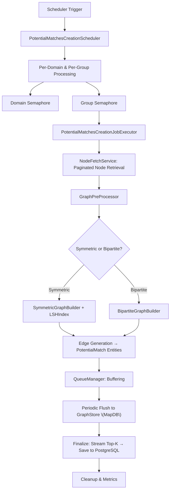
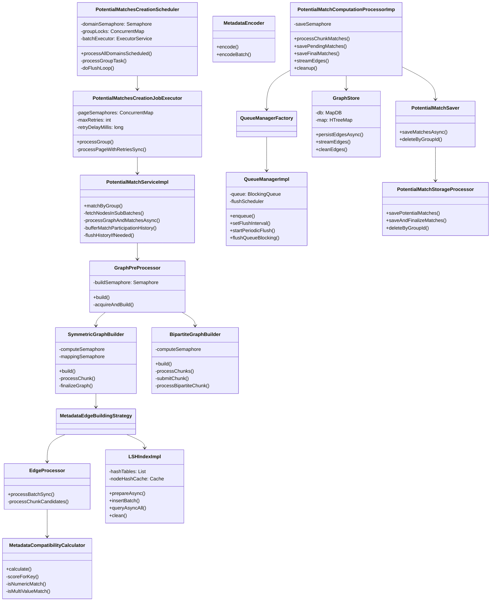
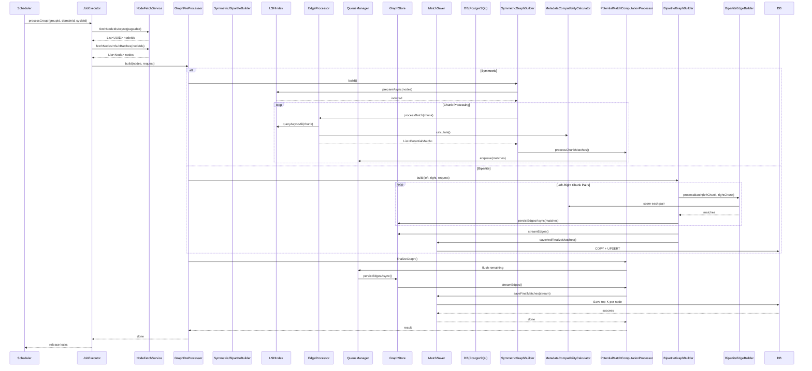

Here's the **Low-Level Design (LLD)** for the entire **Potential Matches Creation Module**, including architectural diagrams, sequence flows, data models, concurrency control, failure handling, and observability.

---

# **Low-Level Design: Potential Matches Creation System**

## 1. **Overview**
A **scheduled, distributed batch matching engine** that:
- Processes groups of entities (nodes) within domains.
- Generates potential matches using similarity strategies (LSH-based or flat).
- Buffers, persists, and finalizes matches with fault tolerance.
- Supports both **symmetric** (within-group) and **bipartite** (cross-partition) matching.

---

## 2. **High-Level Architecture Diagram**



---

## 3. **Component Diagram**



---

## 4. **Sequence Diagram: Batch Matching for One Group**



---

## 5. **Data Flow & Models**

### Core Data Structures

#### `Node`
```java
@Data
public class Node {
    private UUID id;
    private String referenceId; // external ID
    private String type;        // "patient", "user", etc.
    private Map<String, String> metaData;
    private LocalDateTime createdAt;
}
```

#### `PotentialMatchEntity` (DB Model)
```sql
CREATE TABLE potential_matches (
    id UUID PRIMARY KEY,
    group_id UUID NOT NULL,
    domain_id UUID NOT NULL,
    processing_cycle_id VARCHAR(36) NOT NULL,
    reference_id VARCHAR(255) NOT NULL,
    matched_reference_id VARCHAR(255) NOT NULL,
    compatibility_score FLOAT NOT NULL,
    matched_at TIMESTAMP NOT NULL,
    UNIQUE (group_id, reference_id, matched_reference_id)
);
```

#### `MatchingRequest`
```java
@Builder
public class MatchingRequest {
    UUID groupId;
    UUID domainId;
    String processingCycleId;
    int page, limit;
    LocalDateTime createdAfter;
    MatchType matchType; // AUTO, SYMMETRIC, BIPARTITE
    String partitionKey, leftPartitionValue, rightPartitionValue;
    String weightFunctionKey;
}
```

---

## 6. **Concurrency & Resource Management**

| Resource | Control Mechanism | Purpose |
|--------|-------------------|--------|
| Domains | `Semaphore(maxConcurrentDomains)` | Limit parallel domains |
| Groups | `ConcurrentMap<UUID, Semaphore(1)>` | Prevent concurrent group processing |
| LSH Builds | `Semaphore(maxConcurrentBuilds)` | Avoid OOM during indexing |
| Chunk Compute | `computeSemaphore` in GraphBuilder | Parallel chunk processing cap |
| DB Persistence | `storageSemaphore` | Throttle concurrent DB writes |
| Page-Level | `pageSemaphores` per group | Max concurrent pages per group |

> All executors are bounded and monitored via Micrometer gauges.

---

## 7. **Error Handling & Recovery**

### Failure Modes & Mitigations
| Failure | Strategy |
|--------|----------|
| Node fetch timeout | Retry up to `maxRetries` with backoff |
| LSH index build fails | Fallback to flat strategy? (Not implemented – currently retries) |
| Graph processing OOM | Chunking + semaphore limits |
| MapDB/Postgres write fails | Async retry + fallback metrics |
| Thread interrupt | Propagate `InterruptedException`, restore flag |
| Queue full | Drop matches + metric (`match_drops_total`) |
| Finalization timeout | Log warning, increment `matches_dropped_due_to_shutdown` |

### Circuit Breaker
- Used in `BipartiteGraphBuilder.build()` via `@CircuitBreaker`
- Fallback returns empty graph, logs incident, increments counter

### Retry Policies
```yaml
match:
  max-retries: 3
  retry-delay-millis: 1000
graph:
  chunk-retry.max-attempts: 3
  chunk-retry.initial-backoff-seconds: 1
```
Implemented via:
- Manual loops + `Thread.sleep()` (LSH/Chunk level)
- Spring `@Retryable` (DB layer)

---

## 8. **Observability (Micrometer Metrics)**

### Key Timers
| Metric | Tags | Purpose |
|-------|------|--------|
| `batch_matches_duration` | `groupId, domainId, cycleId` | End-to-end group processing |
| `graph_build_duration` | `mode=batch|incremental` | Time to generate candidate edges |
| `lsh_query_duration` | `sampled` | LSH candidate retrieval latency |
| `storage_processor_batch_duration` | `groupId` | DB insert time |
| `queue_drain_latency` | `groupId` | Time to flush queue to DB |

### Key Counters
| Metric | Use Case |
|-------|---------|
| `matches_generated_total` | Track output volume |
| `match_drops_total{reason="queue_full"}` | Backpressure signal |
| `chunk_retry_attempts` | Health of compute layer |
| `graph_build_errors` | Debugging failed groups |
| `semaphore.acquire.timeout` | Resource contention alerts |

### Gauges
- Active threads in executors
- Queue sizes (`queueManager.getQueueSize()`)
- LSH bucket sizes, hash collisions

---

## 9. **Persistence Layers**

### Two-Tier Storage Strategy
| Layer | Technology | Role |
|------|-----------|------|
| **Stage 1: Temporary** | MapDB (Disk-backed, memory-mapped) | High-speed buffer for intermediate matches |
| **Stage 2: Final** | PostgreSQL | Durable, deduplicated, finalized matches |

#### Write Path
```
Computed Matches
      ↓
QueueManager (bounded buffer)
      ↓
GraphStore.persistEdgesAsync() → MapDB (async, batched)
      ↓
Periodic/forced flush → streamEdges() from MapDB
      ↓
MatchSaver.saveFinalMatches() → PostgreSQL via COPY + UPSERT
```

#### Read Path
- Only during finalization: stream from MapDB → aggregate per-node top-K → upsert to DB.

---

## 10. **Lifecycle of a Matching Cycle**

1. **Trigger**  
   `@Scheduled` fires → `processAllDomainsScheduled()`

2. **Domain/Group Locking**  
   Acquires domain semaphore → group semaphore

3. **Node Fetching**
    - Pages through node IDs → loads full nodes in sub-batches
    - Buffers participation history (flushed every 5 pages)

4. **Graph Building**
    - **Symmetric**: LSH index built → nodes chunked → candidates retrieved → scored → buffered
    - **Bipartite**: Cartesian product of left/right chunks → scored → persisted immediately

5. **Queue Flushing**
    - Periodic: Based on `flushIntervalSeconds`
    - On-demand: At end of group processing
    - Boosted: When queue > `drainWarningThreshold`

6. **Finalization**
    - Stream all edges from MapDB
    - Group by `referenceId`, keep top-K matches per node
    - Bulk insert to PostgreSQL with conflict resolution

7. **Cleanup**
    - Release semaphores
    - Delete MapDB entries for group
    - Log duration & errors

---

## 11. **Configuration Summary**

| Category | Property | Default | Purpose |
|--------|---------|--------|--------|
| **Batch** | `match.batch-limit` | 500 | Nodes per page |
| **Concurrency** | `match.max-concurrent-domains` | 2 | Global domain parallelism |
| **LSH** | `graph.num-hash-tables` | 10 | Recall/precision tradeoff |
| **Queue** | `match.queue.capacity` | 500,000 | Max buffered matches |
| **Flush** | `match.flush-interval-seconds` | 5 | How often to persist |
| **Timeouts** | `match.shutdown-limit-seconds` | 1800 | Max runtime per group |
| **DB** | `matches.save.batch-size` | 5000 | JDBC batch size |

---

## 12. **Failure Scenarios & Recovery**

| Scenario | Behavior |
|--------|---------|
| Node fetch fails after retries | Skip page, log error, continue |
| LSH index build timeout | Mark as failed, retry next page? (No — whole group fails) |
| Graph chunk processing timeout | Retry chunk up to N times → then skip |
| MapDB full / disk error | Exception → fallback → metrics → abort group |
| PostgreSQL down | `saveFinalMatches` fails → circuit breaker → retry later |
| Scheduler killed mid-run | On restart, new `cycleId` → old cycles may leave orphaned temp data (TTL cleans up) |

> ⚠️ **No exactly-once semantics** – possible duplicate matches across cycles if finalization fails after DB commit but before cleanup.

---

## 13. **Scalability Considerations**

- **Horizontal Scaling**: Not supported — designed for single-node batch. To scale:
    - Shard by `domainId` across instances
    - Use profile `singleton` to disable on replicas
- **Vertical Scaling**:
    - Increase `maxConcurrentDomains`, `maxConcurrentPages`, thread pool sizes
    - Tune LSH parameters (`numTables`, `bands`) for recall vs speed
- **Memory**:
    - LSH index + node cache per group → limit max nodes/group
    - Use `-XX:+UseZGC` for low-latency GC with large heaps

---

## 14. **Extensibility Points**

| Extension Point | Current Impl | Swap With |
|----------------|-------------|----------|
| Edge Strategy | `MetadataEdgeBuildingStrategy` | `MLModelEdgeStrategy` |
| Partitioning | `MetadataBasedPartitioningStrategy` | `GeospatialPartitioningStrategy` |
| Similarity | `MetadataCompatibilityCalculator` | `EmbeddingCosineCalculator` |
| Queue Store | `GraphStore` (MapDB) | Redis Streams / Kafka |
| Final Match Selection | Top-K per node | ML ranking model |

---

## 15. **Deployment & Operations**

### Profiles
- `!singleton`: Run scheduler (only on primary instance)
- `singleton`: Disable scheduled processing (for replicas)

### Monitoring Dashboard (Prometheus + Grafana)
- **Key Panels**:
    - Matches generated per minute (by domain/group)
    - Batch duration percentiles
    - Queue sizes & drop rates
    - LSH query latency & collisions
    - DB write throughput & errors
    - Thread pool utilization

### Alert Rules
- `increase(match_drops_total[5m]) > 100`
- `graph_build_errors > 0`
- `semaphore.acquire.timeout > 0`
- `bipartite_build_fallbacks > 0`

---

## 16. **Trade-offs & Limitations**

| Trade-off | Rationale | Risk |
|---------|----------|------|
| Batch-only (no streaming) | Simplicity, backpressure control | Delayed matches |
| In-memory LSH per batch | Speed | Re-indexing cost; no cross-batch reuse |
| MapDB as staging | Faster than direct DB writes | Extra component to operate |
| No dedupe across cycles | Performance | Possible duplicates |
| Single-threaded finalization per group | Simplicity | Bottleneck for large groups |

---

## 17. **Future Improvements**

1. **Delta Processing**: Only re-process changed nodes since last run.
2. **Streaming Mode**: Real-time matching via Kafka/input topics.
3. **Distributed Coordination**: Use ZooKeeper/Redis for leader election.
4. **Vector Indexing**: Replace LSH with FAISS/HNSW for better accuracy.
5. **State Checkpointing**: Resume from last successful chunk on crash.

---
