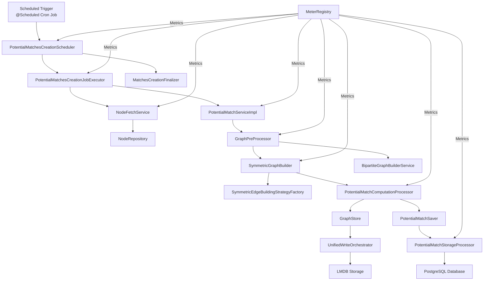
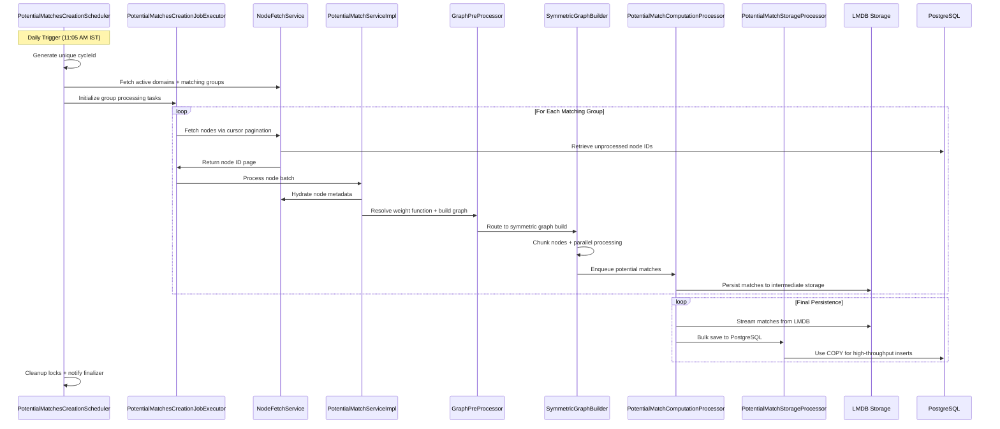
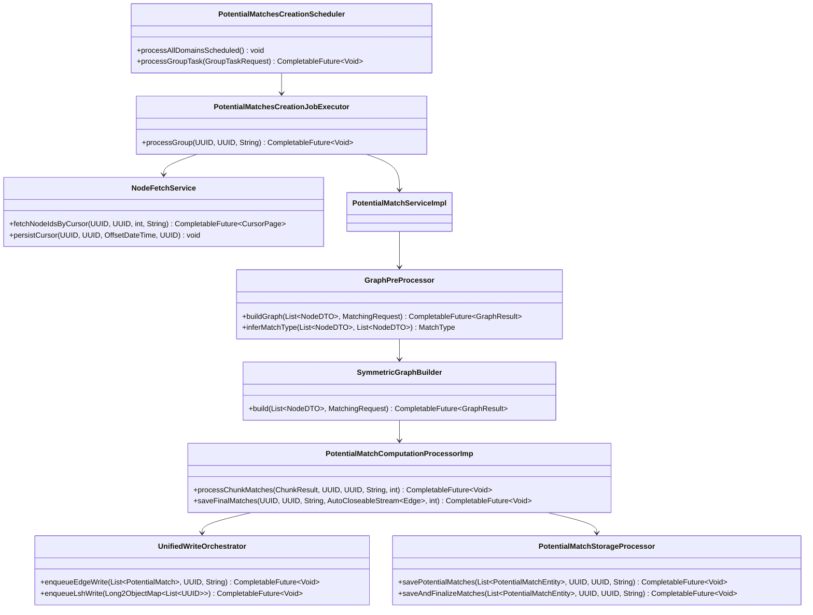

# Potential Matches Creation Module
## Enterprise-Grade Batch Matching System for Large-Scale Node Datasets

---

## Executive Summary
This is a production-ready, Spring Boot-based batch processing module designed to compute potential similarity matches between millions of graph nodes across multiple domains and matching groups. The system runs a daily scheduled workflow, leveraging asynchronous processing, high-performance intermediate storage (LMDB), and fault-tolerant design to handle terabyte-scale datasets while ensuring consistency and observability.

### Key Technical Highlights
- **Scalability**: Processes 10M+ nodes per batch with chunked parallel processing
- **Fault Tolerance**: Built-in retries, timeouts, idempotent operations, and resumable cursor-based pagination
- **Performance**: Uses LMDB for low-latency intermediate match storage and PostgreSQL bulk COPY operations for efficient persistent storage
- **Observability**: Full Micrometer instrumentation for metrics tracking and structured logging
- **Concurrency Control**: Semaphore-based throttling to prevent resource exhaustion across domains and graph builds

---

## System Architecture
### High-Level Component Diagram


---

## Core Batch Processing Workflow
### End-to-End Sequence Diagram


---

## Key Component Deep Dive

### 1. Orchestration Layer
#### `PotentialMatchesCreationScheduler`
The system's entry point and workflow coordinator:
- **Responsibilities**:
    - Triggers daily batch runs via Spring Scheduler cron job (`0 5 11 * * * Asia/Kolkata`)
    - Manages concurrency with a domain-level semaphore to prevent overloading shared resources
    - Ensures sequential processing of matching groups using a `ConcurrentHashMap` lock map
    - Handles global cycle timeouts (3-hour hard limit) and failure cleanup
- **Design Highlight**: Validates executor pool size to avoid deadlocks by ensuring the batch executor has at least `max-concurrent-domains + 2` threads

---

### 2. Job Execution Layer
#### `PotentialMatchesCreationJobExecutor`
Manages recursive, resumable node batch processing:
- **Responsibilities**:
    - Uses cursor-based pagination to fetch nodes incrementally, persisting cursor state to resume processing after interruptions
    - Implements exponential backoff retries for failed node batches (3 max retries with 1s base delay)
    - Stops processing after 3 consecutive empty batches to avoid infinite loops
- **Key Optimization**: Sliding window pagination with 200-node overlap to prevent missing cross-batch matches

#### `NodeFetchService`
Handles all node data retrieval and state management:
- **Responsibilities**:
    - Hydrates node metadata from the database in sub-batches to manage memory usage
    - Marks nodes as processed after successful matching to ensure idempotency
    - Persists cursor state (last processed node ID and timestamp) to enable resumable processing
- **Design Highlight**: Uses a semaphore to limit concurrent database fetch operations to 4, preventing database overload

---

### 3. Graph Processing Layer
#### `WeightFunctionResolver`
Dynamically resolves matching strategies based on node metadata:
- **Responsibilities**:
    - Discovers distinct metadata keys for each matching group
    - Generates a unique weight function key from valid metadata keys
    - Registers new weight functions with the `WeightFunctionRegistry` if they do not exist
    - Falls back to a "flat" default strategy if no valid metadata is found

#### `GraphPreProcessor`
Coordinates graph construction and concurrency management:
- **Responsibilities**:
    - Uses a semaphore to limit concurrent graph builds (default: 2 concurrent builds)
    - Automatically infers match type (symmetric/bipartite) based on node types or partition configuration
    - Enforces a 45-minute hard timeout for graph builds to prevent stuck operations
    - Can determine match type from existing LMDB edges if no partition configuration is provided

#### `SymmetricGraphBuilder`
Implements parallel symmetric graph construction:
- **Responsibilities**:
    - Splits node datasets into configurable chunks (default: 500 nodes per chunk)
    - Spawns parallel worker threads (default: 8 workers) to process chunk cross-product tasks
    - Integrates with edge building strategies to compute potential matches
    - Flushes pending matches to LMDB and streams final matches to PostgreSQL after processing
- **Design Highlight**: Uses a Caffeine cache to track cleanup guards for graceful shutdown handling

#### `SymmetricEdgeBuildingStrategyFactory`
Creates specialized edge matching strategies:
- **Flat Strategy**: Lightweight default strategy for groups with no metadata
- **Metadata-Based Strategy**: Uses Locality-Sensitive Hashing (LSH) to efficiently find similar nodes, reducing pairwise comparison overhead for large datasets

---

### 4. Processing & Storage Layer
#### `PotentialMatchComputationProcessorImp`
Manages match queueing, intermediate storage, and final persistence:
- **Responsibilities**:
    - Uses a disk-spilling queue system to handle high-volume match processing without memory exhaustion
    - Implements backpressure handling to pause queue draining when system resources are overloaded
    - Persists matches to both LMDB (intermediate storage) and PostgreSQL (persistent storage)
    - Provides streaming capabilities for final match persistence to handle 100M+ match datasets
- **Design Highlight**: Graceful shutdown logic that flushes all pending queues before terminating executors

#### `GraphStore` & `UnifiedWriteOrchestrator`
High-performance LMDB storage orchestration:
- **UnifiedWriteOrchestrator**: Uses a single dedicated writer thread to eliminate LMDB write contention, with a bounded queue to handle bursty match ingestion
- **GraphStore**: Wraps LMDB operations for edge persistence and LSH bucket management, with built-in metrics for tracking ingest performance
- **Key Optimization**: Batches LSH and edge writes to minimize LMDB transaction overhead

#### `PotentialMatchStorageProcessor`
PostgreSQL persistence layer optimized for bulk operations:
- **Responsibilities**:
    - Uses PostgreSQL `COPY` command for high-throughput bulk inserts (up to 50k matches per batch)
    - Implements advisory locks to prevent concurrent writes to the same matching group
    - Configures session-level timeouts and optimizations to avoid long-running transactions
    - Retries deadlock errors with exponential backoff to handle transient database issues

---

## Critical Design Patterns & Optimizations
| Pattern/Optimization | Use Case | Implementation |
|-----------------------|----------|----------------|
| **Producer-Consumer** | Match queueing | `UnifiedWriteOrchestrator` uses a bounded blocking queue to decouple match generation from LMDB persistence |
| **Semaphore Concurrency Control** | Domain and graph build throttling | Prevents resource exhaustion by limiting concurrent domain processing (default: 2) and graph builds (default: 2) |
| **Retry Pattern with Exponential Backoff** | Transient error handling | Applied to node batch processing, LMDB persistence, and database operations to handle temporary failures |
| **Cursor-Based Pagination** | Resumable node fetching | Persists last processed node ID/timestamp to resume batch runs after interruptions |
| **Chunked Parallel Processing** | Large dataset handling | Splits node datasets into smaller chunks to reduce memory overhead and enable parallel processing |
| **Bulk Database Inserts** | High-throughput persistence | Uses PostgreSQL `COPY` instead of individual `INSERT` statements to reduce transaction overhead |
| **Backpressure Handling** | System overload protection | Pauses match queue draining when the save semaphore has fewer than 4 available permits |
| **Idempotent Operations** | Safe reprocessing | Marks nodes as processed after successful matching to avoid duplicate work |

---

## UML Diagrams
### Core Class Diagram


### Use Case Diagram
```mermaid
useCaseDiagram
    actor SystemAdmin as "System Admin"
    actor Scheduler as "Scheduled Trigger"
    actor ExternalSystem as "External System"

    usecase "Daily Batch Match Run" as UC1
    usecase "Resumable Node Processing" as UC2
    usecase "Graph Match Computation" as UC3
    usecase "Match Persistence" as UC4
    usecase "Monitor System Metrics" as UC5
    usecase "Configure Batch Parameters" as UC6
    usecase "Receive Completion Notifications" as UC7

    Scheduler --> UC1
    Scheduler --> UC2
    SystemAdmin --> UC5
    SystemAdmin --> UC6
    ExternalSystem --> UC7
    UC1 --> UC3
    UC3 --> UC4
```

---

## Observability & Monitoring
The module is fully instrumented with Micrometer to expose production-grade metrics:

### Core Metrics
| Metric Category | Key Metrics |
|-----------------|-------------|
| **Batch Cycle** | `batch_matches_total_duration`, `batch_cycle_timeout`, `batch_cycle_failure` |
| **Node Fetch** | `node_fetch_hydration_duration`, `node_mark_processed_duration`, `node_fetch_error` |
| **Graph Build** | `graph_build_queue_length`, `graph_preprocessor_duration`, `graph_build_failure` |
| **Match Processing** | `queue.rejected`, `match.batch.save.time`, `final_save.error` |
| **Storage** | `edges_written_total`, `lsh.bulk_ingest.success`, `storage_processor_matches_saved_total` |

### Logging Strategy
- Structured logging with SLF4J and Logback
- Unique `cycleId` for tracing entire batch runs
- Detailed progress logging for long-running operations
- Error logging with root cause tracking

---

## Fault Tolerance & Resilience
1.  **Timeouts**:
    - 3-hour global batch cycle timeout
    - 45-minute graph build hard timeout
    - 120-minute domain semaphore acquisition timeout
    - 60-minute graph build semaphore acquisition timeout
2.  **Retry Logic**:
    - 3 retries with exponential backoff for node batch processing
    - 5 retries with exponential backoff for LMDB persistence
    - Deadlock-specific retries for database operations
3.  **Graceful Shutdown**:
    - Flushes all pending match queues before terminating
    - Shuts down executor services with configurable timeouts
    - Cleans up LMDB resources and temporary files
4.  **Idempotency**:
    - Nodes are marked as processed after successful matching
    - Cursor persistence enables resumable processing after interruptions
    - Database merge operations prevent duplicate match entries

---

## Configuration Parameters
### Core Batch Configuration
| Parameter | Default Value | Description |
|-----------|---------------|-------------|
| `match.max-concurrent-domains` | 2 | Maximum number of concurrent domains processed |
| `match.batch-limit` | 1000 | Number of nodes fetched per cursor page |
| `match.max-retries` | 3 | Maximum retries for failed node batches |
| `match.queue.capacity` | 1,000,000 | In-memory match queue capacity |

### Graph Build Configuration
| Parameter | Default Value | Description |
|-----------|---------------|-------------|
| `graph.max-concurrent-builds` | 2 | Maximum concurrent graph builds |
| `graph.chunk-size` | 500 | Node chunk size for parallel processing |
| `graph.max-concurrent-batches` | 8 | Number of parallel graph build workers |

### Storage Configuration
| Parameter | Default Value | Description |
|-----------|---------------|-------------|
| `matches.save.batch-size` | 50,000 | PostgreSQL bulk insert batch size |
| `match.save.timeout-seconds` | 300 | Match save operation timeout |

---

## Deployment & Profiles
- **Profile Control**: The scheduler is disabled when the `singleton` profile is active (ideal for local development)
- **Executor Requirements**: 7 dedicated executor services for isolated workloads (batch processing, node fetch, graph build, persistence, etc.)
- **LMDB Setup**: Configured for file-based storage with transaction support for data consistency

---

## Skills Demonstrated
### Technical Skills
- Spring Boot & Spring Scheduler for enterprise batch processing
- Asynchronous programming with Java `CompletableFuture`
- High-performance storage with LMDB for intermediate match persistence
- PostgreSQL optimization with bulk `COPY` operations
- Micrometer for observability and metrics tracking
- Concurrency control with semaphores and thread pools
- Fault tolerance patterns (retries, timeouts, idempotency)
- Graceful shutdown and resource cleanup

### Soft Skills
- Modular, maintainable code design
- Production-ready system architecture
- Attention to performance optimization for large datasets
- Comprehensive error handling and debugging capabilities
- Clear documentation and observability for production operations