# Potential Matches Creation System - Low-Level Design Document
---
## Table of Contents
1. [System Overview](#1-system-overview)
2. [Architecture Design](#2-architecture-design)
3. [Component Design](#3-component-design)
4. [Data Flow Architecture](#4-data-flow-architecture)
5. [Graph Processing Engine](#5-graph-processing-engine)
6. [Storage Architecture](#6-storage-architecture)
7. [Queue Management System](#7-queue-management-system)
8. [Error Handling & Resilience](#8-error-handling--resilience)
---
## 1. System Overview
### 1.1 Purpose
This document describes a low-level reference design for a batch-oriented potential-match computation system, focusing on algorithmic structure and data flow rather than production deployment, tuning, or observed performance.

The **Potential Matches Creation System** is a batch-oriented graph processing design for computing compatibility relationships between entities using multiple edge-building strategies.

### 1.2 Key Capabilities

---
## 2. Architecture Design
### 2.1 Layered Architecture

### 2.3 Component Interaction Overview

---
## 3. Component Design
### 3.1 Scheduler Component

**Responsibility Matrix**:
| Responsibility | Implementation | Rationale |
|----------------|----------------|-----------|
| **Job Scheduling** | `@Scheduled` annotation with cron | Spring-managed, reliable timing |
| **Concurrency Control** | Semaphore (configurable permits) | Limit concurrent domain processing |
| **Task Distribution** | `CompletableFuture` chains | Async, non-blocking execution |
| **Group Serialization** | `ConcurrentMap` of futures | Prevent concurrent processing of same group |
| **Resource Cleanup** | `cleanupIdleGroupLocks()` | Remove completed futures from map |
**Processing Flow**:

### 3.2 Job Executor Component

**Cursor-Based Pagination Strategy**:

**Why Overlapping Window?**
- **Prevents Data Loss**: Concurrent inserts with same `createdAt` won't be skipped
- **Idempotency**: Duplicate processing handled by `processed=false` filter
- **Safety Margin**: Configurable overlap ensures completeness
### 3.3 Service Layer Component

**Node Fetching Optimization**:

**Semaphore Strategy**:
- **Purpose**: Limit concurrent database queries to prevent connection pool exhaustion
- **Permits**: Configurable
- **Timeout**: Configurable
- **Benefits**: Prevents thundering herd, maintains predictable load
---
## 4. Data Flow Architecture
### 4.1 End-to-End Data Flow

### 4.2 Detailed Sequence Diagram

---
## 5. Graph Processing Engine
### 5.1 Graph Builder Architecture

### 5.2 Strategy Selection Flow

### 5.3 Symmetric Graph Building Process

### 5.4 Bipartite Graph Building Process
Handles matching between two disjoint node sets (e.g., Patients vs Doctors). Uses brute-force chunked comparison (no LSH).

```mermaid
sequenceDiagram
    autonumber
    participant PreProc as GraphPreProcessor
    participant PartStrat as PartitionStrategy
    participant Builder as BipartiteGraphBuilder
    participant EdgeStrat as BipartiteEdgeBuildingStrategy
    participant Queue as QueueManager
    participant Store as GraphStore
    PreProc->>PartStrat: partition(nodes, key, leftValue, rightValue)
    PartStrat-->>PreProc: leftNodes, rightNodes
    alt MatchType == SYMMETRIC
        PreProc->>PreProc: Route to SymmetricBuilder
    else MatchType == BIPARTITE
        PreProc->>Builder: build(leftNodes, rightNodes, request)
       
        Builder->>Builder: Split left/right into configurable chunks
        Note over Builder: leftChunks = BatchUtils.partition(left, configurable)<br/>rightChunks = BatchUtils.partition(right, configurable)
        Builder->>Builder: Create task pairs (leftChunk[i] × rightChunk[j])
        Note over Builder: Total tasks = leftChunks.size() × rightChunks.size()
        loop For each chunk pair
            Builder->>EdgeStrat: processBatch(leftChunk, rightChunk)
            EdgeStrat->>EdgeStrat: Compute metadata similarity
            EdgeStrat-->>Builder: List<PotentialMatch>
            Builder->>Queue: enqueue(matches)
        end
        Builder->>Store: persistEdgesAsync(matches)
        Store->>Store: Save to LMDB + PostgreSQL (async)
        Builder-->>PreProc: GraphResult
    end
```

### 5.5 Bipartite Edge Computation Flow
Edge creation logic in BipartiteEdgeBuildingStrategy.processBatch():

**Similarity Calculation** (`MetadataCompatibilityCalculator`):
| Step | Logic |
|-------------------------------|----------------------------------------------------------------------|
| **1. Common Keys** | `commonKeys = meta1.keySet() ∩ meta2.keySet()` |
| **2. Per-Key Scoring** | |
| &nbsp;&nbsp;- Exact match | High score |
| &nbsp;&nbsp;- Numeric match | High score if within tolerance |
| &nbsp;&nbsp;- Multi-value | High score if shared item in comma-separated list |
| &nbsp;&nbsp;- Partial match | Moderate score if one value contains the other |
| &nbsp;&nbsp;- No match | Zero score |
| **3. Final Score** | Aggregated per-key scores |
| **4. Threshold** | Only create edge if score exceeds configurable threshold |
> 💡 **Why no LSH?**
> Bipartite graphs compare **distinct sets**. LSH is inefficient here because:
> 1. No need to reduce O(*m×n*) comparisons beyond chunking.
> 2. Metadata-based similarity is cheap to compute (string operations).
### 5.6 Cross-Product Task Calculation
**Formula**: For N chunks, total tasks = N × (N + 1) / 2 (symmetric) or leftChunks × rightChunks (bipartite).
---
## 6. Storage Architecture
### 6.1 Dual Storage Design

### 6.2 LMDB Key-Value Structure

**Key Design Rationale**:
- **Grouping by groupId**: Efficient prefix scans for cleanup
- **Cycle Hash**: Isolates processing runs, enables concurrent cycles
- **Sorted Node Pair**: Ensures undirected edge deduplication (A→B == B→A)
- **Fixed-size prefix**: Fast prefix matching for streaming
### 6.3 UnifiedWriteOrchestrator Design

**Design Benefits**:
- **Single Writer Thread**: Eliminates LMDB write contention
- **Batching**: Groups multiple requests into single transaction
- **Async API**: Non-blocking enqueue with CompletableFuture
- **Bounded Queue**: Backpressure when queue full
### 6.4 PostgreSQL Storage Optimization

**Performance Optimizations**:
| Technique | Benefit | Implementation |
|-----------|---------|----------------|
| **Binary COPY** | Faster bulk loading | PostgreSQL CopyManager |
| **Temp Tables** | Reduced overhead | Session-scoped TEMP TABLE |
| **Advisory Locks** | Prevent concurrent group writes | `pg_try_advisory_lock(hashtext(groupId))` |
| **Batch Merging** | Single UPSERT for all rows | INSERT ON CONFLICT DO UPDATE |
---
## 7. Queue Management System
### 7.1 QueueManager Architecture
```mermaid
classDiagram
    class QueueManagerImpl {
        -memoryQueue
        -memoryQueueSize
        -diskSpillManager
        -flushScheduler
        -capacity
        -flushIntervalSeconds
        -drainWarningThreshold
        -useDiskSpill
        +enqueue(match)
        +drainBatch(limit)
        +getQueueSize()
        +getDiskSpillSize()
    }
    class DiskSpillManager {
        -spillDirectory
        -spilledCount
        -spillFiles
        +spillBatch(batch)
        +readBatch(limit)
        +cleanup()
    }
    class QueueManagerFactory {
        -watchdogExecutor
        -meterRegistry
        +create(config)
    }
    class QueueConfig {
        +groupId
        +domainId
        +processingCycleId
        +capacity
        +flushIntervalSeconds
        +drainWarningThreshold
        +boostBatchFactor
        +maxFinalBatchSize
        +useDiskSpill
    }
    QueueManagerImpl --> DiskSpillManager : spills to
    QueueManagerFactory ..> QueueManagerImpl : creates
    QueueManagerFactory ..> QueueConfig : uses
```
### 7.2 Queue Operation Flow
```mermaid
flowchart TD
    Start([Start]) --> Enqueue[Enqueue match]
    Enqueue --> CheckCapacity[Check capacity]
    CheckCapacity -->|Below limit| InMemory[Store in memory]
    CheckCapacity -->|At limit| SpillToDisk[Spill to disk]
    InMemory --> PeriodicFlush[Periodic flush trigger]
    SpillToDisk --> DiskWrite[Write batch to disk]
    DiskWrite --> Enqueue
    PeriodicFlush --> DrainBatch[Drain batch]
    DrainBatch --> ReadMemory[Read from memory]
    ReadMemory -->|Empty| ReadDisk[Read from disk]
    ReadMemory -->|Has data| ProcessBatch[Process batch]
    ReadDisk --> ProcessBatch
    ProcessBatch --> SaveLMDB[Persist to LMDB]
    ProcessBatch --> SavePostgres[Persist to PostgreSQL]
    SaveLMDB --> Enqueue
    SavePostgres --> Enqueue
    Enqueue -->|All processed| Finalize[Finalize]
    Finalize --> Cleanup[Cleanup group]
```
### 7.3 Disk Spillover Mechanism
**Spill File Format**:
```
┌─────────────────┬─────────────────┬─────────────────┬───────┐
│ Magic Header │ Version │ Batch Size │ Data │
│ Fixed bytes │ Fixed bytes │ int │ ... │
└─────────────────┴─────────────────┴─────────────────┴───────┘
Data Section (repeated):
┌─────────────────┬─────────────────┬─────────────────┬───────┐
│ GroupId UUID │ DomainId UUID │ RefId Length │ RefId │
│ Fixed │ Fixed │ int │ Variable │
├─────────────────┼─────────────────┼─────────────────┼───────┤
│ MatchId Length │ MatchId │ Score │ │
│ int │ Variable │ float │ │
└─────────────────┴─────────────────┴─────────────────┴───────┘
```
---
## 8. Error Handling & Resilience
### 8.1 Retry Mechanism
```mermaid
flowchart TD
    A[Process Batch] --> B{Success?}
    B -->|Yes| C[Mark Nodes Processed]
    B -->|No| D{Retry Count < limit?}
   
    D -->|Yes| E[Exponential Backoff]
    E --> F[Wait]
    F --> A
   
    D -->|No| G[Log Error]
    G --> H[Skip Batch<br/>Continue with Next]
   
    C --> I[Persist Cursor]
    H --> I
    I --> J[Next Batch]
   
    style A fill:#2196F3
    style C fill:#4CAF50
    style G fill:#F44336
    style I fill:#FF9800
```
### 8.2 Backpressure Handling
```mermaid
sequenceDiagram
    participant Prod as Producer (Graph Builder)
    participant Queue as QueueManager
    participant Proc as Processor
    participant Sem as Storage Semaphore
   
    loop Fast Production
        Prod->>Queue: enqueue(match)
        Queue->>Queue: Check capacity
       
        alt Queue below threshold
            Queue-->>Prod: Accepted
        else Queue at threshold
            Queue->>Queue: Spill to disk
            Queue-->>Prod: Accepted (after spill)
        end
    end
   
    Note over Proc,Sem: Slower Consumption
   
    Proc->>Sem: tryAcquire()
    Sem-->>Proc: Wait (configurable permits)
   
    Proc->>Queue: drainBatch()
    Queue-->>Proc: Batch
   
    Proc->>Proc: Save to DB
    Proc->>Sem: release()
   
    alt Queue growing
        Queue->>Proc: Apply backpressure
        Proc->>Proc: Controlled delay
        Proc->>Proc: Continue draining
    end
```
### 8.3 Graceful Shutdown
```mermaid
stateDiagram-v2
    [*] --> Running: System Active
   
    Running --> PreDestroy: @PreDestroy Triggered
   
    PreDestroy --> FlushQueues: Flush all pending queues
   
    FlushQueues --> WaitDrain: savePendingMatchesAsync()
    WaitDrain --> DrainComplete: Timeout
    WaitDrain --> DrainTimeout: Timeout exceeded
   
    DrainComplete --> ShutdownExecutors: Graceful shutdown
    DrainTimeout --> ForceShutdownExecutors: Force shutdown
   
    ShutdownExecutors --> CloseConnections: Close DB connections
    ForceShutdownExecutors --> CloseConnections
   
    CloseConnections --> CloseLMDB: Close LMDB environment
   
    CloseLMDB --> [*]: Shutdown complete
```
**Shutdown Sequence**:
1. Set shutdown flag
2. Flush all QueueManagers (configurable timeout)
3. Shutdown executors gracefully (configurable timeout)
4. Force shutdown if needed
5. Close database connections
6. Close LMDB environment
7. Log completion metrics
---
## Appendix A: Database Schema
### A.1 Core Tables
```sql
-- Nodes Table
CREATE TABLE public.nodes (
    id UUID PRIMARY KEY,
    group_id UUID NOT NULL,
    domain_id UUID NOT NULL,
    reference_id VARCHAR(255) NOT NULL,
    type VARCHAR(50),
    metadata JSONB,
    processed BOOLEAN DEFAULT FALSE,
    created_at TIMESTAMP NOT NULL,
    updated_at TIMESTAMP,
    CONSTRAINT uq_node_reference UNIQUE (group_id, domain_id, reference_id)
);
CREATE INDEX idx_nodes_group_domain ON nodes(group_id, domain_id);
CREATE INDEX idx_nodes_processed ON nodes(group_id, domain_id, processed) WHERE processed = false;
CREATE INDEX idx_nodes_cursor ON nodes(group_id, domain_id, created_at, id) WHERE processed = false;
-- Potential Matches Table
CREATE TABLE public.potential_matches (
    id UUID PRIMARY KEY DEFAULT gen_random_uuid(),
    group_id UUID NOT NULL,
    domain_id UUID NOT NULL,
    processing_cycle_id VARCHAR(255),
    reference_id VARCHAR(255) NOT NULL,
    matched_reference_id VARCHAR(255) NOT NULL,
    compatibility_score FLOAT NOT NULL,
    matched_at TIMESTAMP NOT NULL DEFAULT NOW(),
    CONSTRAINT uq_match UNIQUE (group_id, reference_id, matched_reference_id)
);
CREATE INDEX idx_matches_group ON potential_matches(group_id, domain_id);
CREATE INDEX idx_matches_cycle ON potential_matches(processing_cycle_id);
CREATE INDEX idx_matches_reference ON potential_matches(reference_id);
-- Nodes Cursor Table
CREATE TABLE public.nodes_cursor (
    group_id UUID NOT NULL,
    domain_id UUID NOT NULL,
    cursor_created_at TIMESTAMP WITH TIME ZONE,
    cursor_id UUID,
    updated_at TIMESTAMP WITH TIME ZONE DEFAULT NOW(),
    PRIMARY KEY (group_id, domain_id)
);
-- Match Participation History
CREATE TABLE public.match_participation_history (
    id BIGSERIAL PRIMARY KEY,
    node_id UUID NOT NULL,
    group_id UUID NOT NULL,
    domain_id UUID NOT NULL,
    processing_cycle_id VARCHAR(255),
    participated_at TIMESTAMP NOT NULL,
    CONSTRAINT fk_node FOREIGN KEY (node_id) REFERENCES nodes(id) ON DELETE CASCADE
);
CREATE INDEX idx_participation_node ON match_participation_history(node_id);
CREATE INDEX idx_participation_cycle ON match_participation_history(processing_cycle_id);
```