# Potential Matches Creation System - Low-Level Design Document


---

## Table of Contents

1. [System Overview](#1-system-overview)
2. [Architecture Design](#2-architecture-design)
3. [Component Design](#3-component-design)
4. [Data Flow Architecture](#4-data-flow-architecture)
5. [Concurrency & Threading Model](#5-concurrency--threading-model)
6. [Graph Processing Engine](#6-graph-processing-engine)
7. [Storage Architecture](#7-storage-architecture)
8. [Queue Management System](#8-queue-management-system)
9. [Performance Optimization](#9-performance-optimization)
10. [Error Handling & Resilience](#10-error-handling--resilience)


---

## 1. System Overview

### 1.1 Purpose

The **Potential Matches Creation System** is a high-throughput, distributed graph processing platform designed to compute compatibility scores between entities (nodes) and persist match relationships. It processes millions of nodes daily using sophisticated edge-building strategies (LSH, metadata-based, flat) and dual storage (LMDB + PostgreSQL).

### 1.2 Key Capabilities


### 1.3 System Metrics

| Metric | Current Capacity | Target Scale |
|--------|------------------|--------------|
| **Nodes/Group** | 2,500 | 50,000 |
| **Edges/Second** | 100K | 500K |
| **Concurrent Domains** | 2 | 5 |
| **Memory Footprint** | 8GB | 16GB |
| **Processing Time** | 15 min/group | <10 min/group |
| **Queue Capacity** | 1M matches | 10M matches |

---

## 2. Architecture Design

### 2.1 Layered Architecture


### 2.2 System Context Diagram


### 2.3 Component Interaction Overview

```mermaid
graph TB
    subgraph "Phase 1: Initialization"
        P1A[Scheduler Trigger] --> P1B[Get Tasks to Process]
        P1B --> P1C[Acquire Domain Semaphore]
    end
    
    subgraph "Phase 2: Node Fetching"
        P2A[Cursor-based Pagination] --> P2B[Fetch Node Batch 1000]
        P2B --> P2C[Hydrate Node Metadata]
        P2C --> P2D[Mark as Processed]
    end
    
    subgraph "Phase 3: Graph Building"
        P3A[Determine Match Type] --> P3B{Symmetric?}
        P3B -->|Yes| P3C[Symmetric Builder]
        P3B -->|No| P3D[Bipartite Builder]
        P3C --> P3E[Chunk into 500-node batches]
        P3D --> P3E
        P3E --> P3F[Parallel Edge Computation]
    end
    
    subgraph "Phase 4: Edge Processing"
        P4A[PotentialMatch Objects] --> P4B[Enqueue to QueueManager]
        P4B --> P4C{Queue Full?}
        P4C -->|Yes| P4D[Spill to Disk]
        P4C -->|No| P4E[Keep in Memory]
        P4D --> P4F[Flush Batch 500]
        P4E --> P4F
    end
    
    subgraph "Phase 5: Dual Persistence"
        P5A[Batch Ready] --> P5B[Save to LMDB]
        P5A --> P5C[Save to PostgreSQL]
        P5B --> P5D[UnifiedWriteOrchestrator]
        P5C --> P5E[StorageProcessor COPY]
    end
    
    subgraph "Phase 6: Finalization"
        P6A[Drain Pending Queue] --> P6B[Final Save Stream]
        P6B --> P6C[LMDB → PostgreSQL]
        P6C --> P6D[Update Job Status]
        P6D --> P6E[Cleanup & Release]
    end
    
    P1C --> P2A
    P2D --> P3A
    P3F --> P4A
    P4F --> P5A
    P5E --> P6A
    
    style P1A fill:#E8F5E9
    style P2A fill:#E3F2FD
    style P3A fill:#FFF9C4
    style P4A fill:#F3E5F5
    style P5A fill:#FFEBEE
    style P6A fill:#E0F2F1
```



---

## 3. Component Design

### 3.1 Scheduler Component


**Responsibility Matrix**:

| Responsibility | Implementation | Rationale |
|----------------|----------------|-----------|
| **Job Scheduling** | `@Scheduled` annotation with cron | Spring-managed, reliable timing |
| **Concurrency Control** | Semaphore (permits=2) | Limit concurrent domain processing |
| **Task Distribution** | `CompletableFuture` chains | Async, non-blocking execution |
| **Group Serialization** | `ConcurrentMap` of futures | Prevent concurrent processing of same group |
| **Resource Cleanup** | `cleanupIdleGroupLocks()` | Remove completed futures from map |

**Processing Flow**:


### 3.2 Job Executor Component


**Cursor-Based Pagination Strategy**:


**Why Overlapping Window?**
- **Prevents Data Loss**: Concurrent inserts with same `createdAt` won't be skipped
- **Idempotency**: Duplicate processing handled by `processed=false` filter
- **Safety Margin**: 200-node overlap ensures completeness

### 3.3 Service Layer Component


**Node Fetching Optimization**:


**Semaphore Strategy**:
- **Purpose**: Limit concurrent database queries to prevent connection pool exhaustion
- **Permits**: 4 (tunable)
- **Timeout**: 60 seconds per query
- **Benefits**: Prevents thundering herd, maintains predictable load

---

## 4. Data Flow Architecture

### 4.1 End-to-End Data Flow


### 4.2 Detailed Sequence Diagram


---

## 5. Concurrency & Threading Model

### 5.1 Thread Pool Architecture


### 5.2 Semaphore Control Flow


### 5.3 Semaphore Configuration


**Semaphore Hierarchy**:

| Semaphore | Permits | Purpose | Timeout | Scope |
|-----------|---------|---------|---------|-------|
| **domainSemaphore** | 2 | Limit concurrent domains | 120 min | Scheduler |
| **buildSemaphore** | 2 | Limit concurrent graph builds | 60 sec | GraphPreProcessor |
| **dbFetchSemaphore** | 4 | Prevent DB connection exhaustion | 60 sec | PotentialMatchService |
| **storageSemaphore** | 16 | Limit concurrent DB writes | None | StorageProcessor |

---

## 6. Graph Processing Engine

### 6.1 Graph Builder Architecture


### 6.2 Strategy Selection Flow


### 6.3 Symmetric Graph Building Process


### 6.4 Bipartite Graph Building Process

Handles matching between two disjoint node sets (e.g., Patients vs Doctors). Uses brute-force chunked comparison (no LSH).

```mermaid
sequenceDiagram
    autonumber
    participant PreProc as GraphPreProcessor
    participant PartStrat as PartitionStrategy
    participant Builder as BipartiteGraphBuilder
    participant EdgeStrat as BipartiteEdgeBuildingStrategy
    participant Queue as QueueManager
    participant Store as GraphStore

    PreProc->>PartStrat: partition(nodes, key, leftValue, rightValue)
    PartStrat-->>PreProc: leftNodes, rightNodes

    alt MatchType == SYMMETRIC
        PreProc->>PreProc: Route to SymmetricBuilder
    else MatchType == BIPARTITE
        PreProc->>Builder: build(leftNodes, rightNodes, request)
        
        Builder->>Builder: Split left/right into chunks (size=500)
        Note over Builder: leftChunks = BatchUtils.partition(left, 500)<br/>rightChunks = BatchUtils.partition(right, 500)

        Builder->>Builder: Create task pairs (leftChunk[i] × rightChunk[j])
        Note over Builder: Total tasks = leftChunks.size() × rightChunks.size()

        loop For each chunk pair
            Builder->>EdgeStrat: processBatch(leftChunk, rightChunk)
            EdgeStrat->>EdgeStrat: Compute metadata similarity
            EdgeStrat-->>Builder: List<PotentialMatch>
            Builder->>Queue: enqueue(matches)
        end

        Builder->>Store: persistEdgesAsync(matches)
        Store->>Store: Save to LMDB + PostgreSQL (async)
        Builder-->>PreProc: GraphResult
    end
```



### 6.5 Bipartite Edge Computation Flow

Edge creation logic in BipartiteEdgeBuildingStrategy.processBatch():


**Similarity Calculation** (`MetadataCompatibilityCalculator`):  
| Step                          | Logic                                                                 |
|-------------------------------|----------------------------------------------------------------------|
| **1. Common Keys**            | `commonKeys = meta1.keySet() ∩ meta2.keySet()`                       |
| **2. Per-Key Scoring**        |                                                                      |
| &nbsp;&nbsp;- Exact match     | `score = 0.7`                                                       |
| &nbsp;&nbsp;- Numeric match   | `score = 0.7` if within 60% tolerance                              |
| &nbsp;&nbsp;- Multi-value     | `score = 0.7` if shared item in comma-separated list                |
| &nbsp;&nbsp;- Partial match   | `score = 0.35` if one value contains the other                       |
| &nbsp;&nbsp;- No match        | `score = 0.0`                                                       |
| **3. Final Score**            | `max(Σ per-key scores, 0.4)`                                        |
| **4. Threshold**              | Only create edge if `score > 0.05`                                   |

> 💡 **Why no LSH?**  
> Bipartite graphs compare **distinct sets** (e.g., `Customers` vs `Products`). LSH is inefficient here because:
> 1. No need to reduce O(*m×n*) comparisons (chunking limits work).
> 2. Metadata-based similarity is cheap to compute (string operations).


### 6.6 Cross-Product Task Calculation

```mermaid
graph TB
    subgraph "Input: 2000 Nodes"
        A[Chunk 1<br/>Nodes 1-500]
        B[Chunk 2<br/>Nodes 501-1000]
        C[Chunk 3<br/>Nodes 1001-1500]
        D[Chunk 4<br/>Nodes 1501-2000]
    end
    
    subgraph "Cross-Product Tasks"
        T1[Task 0: C1 × C1]
        T2[Task 1: C1 × C2]
        T3[Task 2: C1 × C3]
        T4[Task 3: C1 × C4]
        T5[Task 4: C2 × C2]
        T6[Task 5: C2 × C3]
        T7[Task 6: C2 × C4]
        T8[Task 7: C3 × C3]
        T9[Task 8: C3 × C4]
        T10[Task 9: C4 × C4]
    end
    
    A --> T1
    A --> T2
    A --> T3
    A --> T4
    B --> T5
    B --> T6
    B --> T7
    C --> T8
    C --> T9
    D --> T10
    
    style A fill:#E3F2FD
    style B fill:#E3F2FD
    style C fill:#E3F2FD
    style D fill:#E3F2FD
    style T1 fill:#C8E6C9
    style T5 fill:#C8E6C9
    style T8 fill:#C8E6C9
    style T10 fill:#C8E6C9
```

**Formula**: For N chunks, total tasks = N × (N + 1) / 2
- 4 chunks → 10 tasks
- 10 chunks → 55 tasks
- 20 chunks → 210 tasks

---

## 7. Storage Architecture

### 7.1 Dual Storage Design

```mermaid
graph TB
    subgraph "Match Generation"
        A[PotentialMatch Objects]
    end
    
    subgraph "Write Path"
        A --> B{Queue Manager}
        B -->|In-Memory| C[Memory Queue<br/>Capacity: 1M]
        B -->|Overflow| D[Disk Spill<br/>Temp Files]
        C --> E[Flush Batch 500]
        D --> E
    end
    
    subgraph "Dual Persistence"
        E --> F[LMDB Write]
        E --> G[PostgreSQL Write]
    end
    
    subgraph "LMDB Storage"
        F --> H[UnifiedWriteOrchestrator]
        H --> I[Writer Thread Queue]
        I --> J[Batch Write Transaction]
        J --> K[(LMDB Files<br/>Edge Cache)]
    end
    
    subgraph "PostgreSQL Storage"
        G --> L[StorageProcessor]
        L --> M[Acquire Advisory Lock]
        M --> N[CREATE TEMP TABLE]
        N --> O[COPY Binary Protocol]
        O --> P[MERGE via INSERT ON CONFLICT]
        P --> Q[(PostgreSQL<br/>potential_matches)]
    end
    
    subgraph "Final Save Phase"
        K --> R[Stream Edges]
        R --> S[Convert to Entities]
        S --> T[Final Batch Save]
        T --> Q
    end
    
    style A fill:#4CAF50
    style E fill:#FF9800
    style K fill:#2196F3
    style Q fill:#9C27B0
    style T fill:#F44336
```

### 7.2 LMDB Key-Value Structure

```mermaid
graph LR
    subgraph "Edge Key Structure"
        K1[Group ID<br/>16 bytes<br/>UUID] --> K2[Cycle Hash<br/>32 bytes<br/>Murmur3 128-bit]
        K2 --> K3[Node Pair Hash<br/>32 bytes<br/>Murmur3 sorted]
    end
    
    subgraph "Edge Value Structure"
        V1[Score<br/>4 bytes<br/>float] --> V2[Domain ID<br/>16 bytes<br/>UUID]
        V2 --> V3[From Length<br/>4 bytes<br/>int]
        V3 --> V4[From NodeHash<br/>N bytes<br/>UTF-8]
        V4 --> V5[To Length<br/>4 bytes<br/>int]
        V5 --> V6[To NodeHash<br/>M bytes<br/>UTF-8]
    end
    
    K1 -.->|Maps to| V1
    
    style K1 fill:#E3F2FD
    style K2 fill:#E3F2FD
    style K3 fill:#E3F2FD
    style V1 fill:#FFF9C4
    style V2 fill:#FFF9C4
```

**Key Design Rationale**:
- **Grouping by groupId**: Efficient prefix scans for cleanup
- **Cycle Hash**: Isolates processing runs, enables concurrent cycles
- **Sorted Node Pair**: Ensures undirected edge deduplication (A→B == B→A)
- **Fixed-size prefix**: Fast prefix matching for streaming

### 7.3 UnifiedWriteOrchestrator Design

```mermaid
sequenceDiagram
    participant Client as Client Thread
    participant Queue as BlockingQueue<br/>Capacity: 10K
    participant Writer as Writer Thread
    participant LMDB as LMDB Env
    
    loop Concurrent Enqueue
        Client->>Queue: enqueueEdgeWrite(matches)
        Queue-->>Client: CompletableFuture
        Client->>Queue: enqueueLshWrite(buckets)
        Queue-->>Client: CompletableFuture
    end
    
    loop Writer Thread Loop
        Writer->>Queue: poll(100ms)
        Queue-->>Writer: WriteRequest
        
        Writer->>Writer: drainTo(batch, 256)
        Writer->>Writer: Partition by type
        
        alt Edge Writes
            Writer->>Writer: Partition into 1024-chunk batches
            loop For each chunk
                Writer->>LMDB: txnWrite()
                Writer->>LMDB: dbi.put(key, value) × 1024
                Writer->>LMDB: txn.commit()
                Writer->>Client: future.complete()
            end
        end
        
        alt LSH Writes
            loop For each LSH request
                Writer->>LMDB: txnWrite()
                Writer->>LMDB: Merge bucket data
                Writer->>LMDB: txn.commit()
                Writer->>Client: future.complete()
            end
        end
    end
```

**Design Benefits**:
- **Single Writer Thread**: Eliminates LMDB write contention
- **Batching**: Groups multiple requests into single transaction
- **Async API**: Non-blocking enqueue with CompletableFuture
- **Bounded Queue**: Backpressure when queue full

### 7.4 PostgreSQL Storage Optimization

```mermaid
flowchart TB
    A[Batch Ready: 50K entities] --> B[Acquire advisory lock]
    B --> C[Begin transaction]
    C --> D[Set session parameters]
    D --> E[Create temp table]

    E --> F[Partition into chunks]
    F --> G1[COPY chunk to temp table]
    F --> G2[COPY chunk to temp table]
    F --> GN[COPY chunk to temp table]

    G1 --> H[Upsert into potential_matches]
    G2 --> H
    GN --> H

    H --> I[Commit transaction]
    I --> J[Release advisory lock]

```

**Performance Optimizations**:

| Technique | Benefit | Implementation |
|-----------|---------|----------------|
| **Binary COPY** | 10-15x faster than INSERT | PostgreSQL CopyManager |
| **Temp Tables** | No WAL overhead | Session-scoped TEMP TABLE |
| **Advisory Locks** | Prevent concurrent group writes | `pg_try_advisory_lock(hashtext(groupId))` |
| **synchronous_commit=off** | 2-3x write throughput | Session-level setting |
| **Batch Merging** | Single UPSERT for all rows | INSERT ON CONFLICT DO UPDATE |

---

### **Performance Impact of Bipartite Flow**
| Metric                          | Symmetric (LSH)       | Bipartite (Metadata)  |
|---------------------------------|-----------------------|-----------------------|
| **Edge Computation**            | O(*n*) (approx)       | O(*m×n*)              |
| **Chunk Processing**            | Cross-chunk LSH lookups| Direct pairwise loops |
| **Latency**                     | Faster for large *n*  | Predictable (fixed chunk size) |
| **Use Case**                    | Same-type matching    | Cross-type matching   |

**Optimization for Bipartite**:
- **Parallel Chunk Pairs**: Processes `left[i] × right[j]` in parallel (up `maxConcurrentBatches=4`).
- **Early Termination**: Skips pairs where metadata has no common keys.

---

## 8. Queue Management System

### 8.1 QueueManager Architecture

```mermaid
classDiagram
    class QueueManagerImpl {
        -memoryQueue
        -memoryQueueSize
        -diskSpillManager
        -flushScheduler
        -capacity
        -flushIntervalSeconds
        -drainWarningThreshold
        -useDiskSpill
        +enqueue(match)
        +drainBatch(limit)
        +getQueueSize()
        +getDiskSpillSize()
    }

    class DiskSpillManager {
        -spillDirectory
        -spilledCount
        -spillFiles
        +spillBatch(batch)
        +readBatch(limit)
        +cleanup()
    }

    class QueueManagerFactory {
        -watchdogExecutor
        -meterRegistry
        +create(config)
    }

    class QueueConfig {
        +groupId
        +domainId
        +processingCycleId
        +capacity
        +flushIntervalSeconds
        +drainWarningThreshold
        +boostBatchFactor
        +maxFinalBatchSize
        +useDiskSpill
    }

    QueueManagerImpl --> DiskSpillManager : spills to
    QueueManagerFactory ..> QueueManagerImpl : creates
    QueueManagerFactory ..> QueueConfig : uses

```

### 8.2 Queue Operation Flow

```mermaid
flowchart TD
    Start([Start]) --> Enqueue[Enqueue match]

    Enqueue --> CheckCapacity[Check capacity]

    CheckCapacity -->|Below limit| InMemory[Store in memory]
    CheckCapacity -->|At limit| SpillToDisk[Spill to disk]

    InMemory --> PeriodicFlush[Periodic flush trigger]
    SpillToDisk --> DiskWrite[Write batch to disk]
    DiskWrite --> Enqueue

    PeriodicFlush --> DrainBatch[Drain batch]
    DrainBatch --> ReadMemory[Read from memory]

    ReadMemory -->|Empty| ReadDisk[Read from disk]
    ReadMemory -->|Has data| ProcessBatch[Process batch]
    ReadDisk --> ProcessBatch

    ProcessBatch --> SaveLMDB[Persist to LMDB]
    ProcessBatch --> SavePostgres[Persist to PostgreSQL]

    SaveLMDB --> Enqueue
    SavePostgres --> Enqueue

    Enqueue -->|All processed| Finalize[Finalize]
    Finalize --> Cleanup[Cleanup group]

```

### 8.3 Disk Spillover Mechanism


**Spill File Format**:
```
┌─────────────────┬─────────────────┬─────────────────┬───────┐
│  Magic Header   │  Version        │  Batch Size     │ Data  │
│  4 bytes        │  2 bytes        │  4 bytes (int)  │  ...  │
└─────────────────┴─────────────────┴─────────────────┴───────┘

Data Section (repeated):
┌─────────────────┬─────────────────┬─────────────────┬───────┐
│  GroupId UUID   │  DomainId UUID  │  RefId Length   │ RefId │
│  16 bytes       │  16 bytes       │  4 bytes        │ N     │
├─────────────────┼─────────────────┼─────────────────┼───────┤
│  MatchId Length │  MatchId        │  Score          │       │
│  4 bytes        │  M bytes        │  4 bytes float  │       │
└─────────────────┴─────────────────┴─────────────────┴───────┘
```

---

## 9. Performance Optimization

### 9.1 Throughput Optimization Strategy

```mermaid
flowchart TB
    subgraph Input_Optimization
        A1[Cursor-based pagination]
        A2[Batch fetching]
        A3[DB semaphore]
    end

    subgraph Processing_Optimization
        B1[Chunking]
        B2[Parallel workers]
        B3[LSH indexing]
        B4[Memory queue]
    end

    subgraph Output_Optimization
        C1[Batch writes]
        C2[Binary COPY]
        C3[LMDB single writer]
        C4[Async persistence]
    end

    A1 --> B1
    A2 --> B2
    A3 --> B3
    B1 --> C1
    B2 --> C2
    B3 --> C3
    B4 --> C4

```

### 9.2 Memory Management

```mermaid
pie title Memory Allocation Distribution
    "Node Objects (NodeDTO)" : 25
    "Edge Objects (PotentialMatch)" : 30
    "Queue Buffers" : 20
    "LSH Index (if enabled)" : 15
    "Database Connection Pool" : 5
    "Thread Stacks" : 3
    "LMDB ByteBuffers (Direct)" : 2
```

**Memory Optimization Techniques**:

| Technique | Saving | Implementation |
|-----------|--------|----------------|
| **Cursor Pagination** | ~80% memory | Don't load all nodes at once |
| **Streaming Processing** | ~90% memory | Process nodes in batches, discard after |
| **Direct ByteBuffers** | Off-heap | LMDB uses memory-mapped files |
| **Queue Disk Spillover** | Unlimited | Spill to disk when > 1M items |
| **Batch Clearing** | Reuse capacity | `buffer.clear()` instead of new list |

### 9.3 Latency Optimization

```mermaid
gantt
    title Processing Timeline Optimization (2000 Nodes)
    dateFormat X
    axisFormat %s

    section Sequential (Before)
    Fetch All Nodes    :a1, 0, 10s
    Build Full Graph   :a2, after a1, 30s
    Compute All Edges  :a3, after a2, 60s
    Save All Matches   :a4, after a3, 20s

    section Parallel (After)
    Fetch Batch 1      :b1, 0, 2s
    Process Batch 1    :b2, after b1, 5s
    Save Batch 1       :b3, after b2, 3s
    Fetch Batch 2      :b4, 2, 2s
    Process Batch 2    :b5, after b4, 5s
    Save Batch 2       :b6, after b5, 3s
    Fetch Batch 3      :b7, 4, 2s
    Process Batch 3    :b8, after b7, 5s
    Save Batch 3       :b9, after b8, 3s
```

**Latency Reduction**: 120s → 15s (8x improvement)

---

## 10. Error Handling & Resilience

### 10.1 Retry Mechanism

```mermaid
flowchart TD
    A[Process Batch] --> B{Success?}
    B -->|Yes| C[Mark Nodes Processed]
    B -->|No| D{Retry Count < 3?}
    
    D -->|Yes| E[Exponential Backoff<br/>delay = 1000ms × 2^attempt-1]
    E --> F[Wait]
    F --> A
    
    D -->|No| G[Log Error<br/>Increment max_retries_exceeded]
    G --> H[Skip Batch<br/>Continue with Next]
    
    C --> I[Persist Cursor]
    H --> I
    I --> J[Next Batch]
    
    style A fill:#2196F3
    style C fill:#4CAF50
    style G fill:#F44336
    style I fill:#FF9800
```

**Retry Configuration**:

| Attempt | Delay | Total Wait Time |
|---------|-------|-----------------|
| 1 | 0ms | 0ms |
| 2 | 1000ms (1s) | 1s |
| 3 | 2000ms (2s) | 3s |
| Failure | - | Give up |

### 10.2 Backpressure Handling

```mermaid
sequenceDiagram
    participant Prod as Producer (Graph Builder)
    participant Queue as QueueManager
    participant Proc as Processor
    participant Sem as Storage Semaphore
    
    loop Fast Production
        Prod->>Queue: enqueue(match)
        Queue->>Queue: Check capacity
        
        alt Queue < 1M
            Queue-->>Prod: Accepted
        else Queue >= 1M
            Queue->>Queue: Spill to disk
            Queue-->>Prod: Accepted (after spill)
        end
    end
    
    Note over Proc,Sem: Slow Consumption
    
    Proc->>Sem: tryAcquire()
    Sem-->>Proc: Wait (only 16 permits)
    
    Proc->>Queue: drainBatch(2000)
    Queue-->>Proc: Batch
    
    Proc->>Proc: Save to DB (slow)
    Proc->>Sem: release()
    
    alt Queue growing
        Queue->>Proc: Apply backpressure
        Proc->>Proc: Sleep 2000ms
        Proc->>Proc: Continue draining
    end
```

### 10.3 Graceful Shutdown

```mermaid
stateDiagram-v2
    [*] --> Running: System Active
    
    Running --> PreDestroy: @PreDestroy Triggered
    
    PreDestroy --> FlushQueues: Flush all pending queues
    
    FlushQueues --> WaitDrain: savePendingMatchesAsync()
    WaitDrain --> DrainComplete: Timeout 5 min
    WaitDrain --> DrainTimeout: Timeout exceeded
    
    DrainComplete --> ShutdownExecutors: Graceful shutdown
    DrainTimeout --> ForceShutdownExecutors: Force shutdown
    
    ShutdownExecutors --> CloseConnections: Close DB connections
    ForceShutdownExecutors --> CloseConnections
    
    CloseConnections --> CloseLMDB: Close LMDB environment
    
    CloseLMDB --> [*]: Shutdown complete
```

**Shutdown Sequence**:
1. Set `shutdownInitiated = true`
2. Flush all QueueManagers (5 min timeout)
3. Shutdown executors gracefully (30 sec timeout)
4. Force shutdown if needed (10 sec timeout)
5. Close database connections
6. Close LMDB environment
7. Log completion metrics

---


## Appendix A: Database Schema

### A.1 Core Tables

```sql
-- Nodes Table
CREATE TABLE public.nodes (
    id UUID PRIMARY KEY,
    group_id UUID NOT NULL,
    domain_id UUID NOT NULL,
    reference_id VARCHAR(255) NOT NULL,
    type VARCHAR(50),
    metadata JSONB,
    processed BOOLEAN DEFAULT FALSE,
    created_at TIMESTAMP NOT NULL,
    updated_at TIMESTAMP,
    CONSTRAINT uq_node_reference UNIQUE (group_id, domain_id, reference_id)
);

CREATE INDEX idx_nodes_group_domain ON nodes(group_id, domain_id);
CREATE INDEX idx_nodes_processed ON nodes(group_id, domain_id, processed) WHERE processed = false;
CREATE INDEX idx_nodes_cursor ON nodes(group_id, domain_id, created_at, id) WHERE processed = false;

-- Potential Matches Table
CREATE TABLE public.potential_matches (
    id UUID PRIMARY KEY DEFAULT gen_random_uuid(),
    group_id UUID NOT NULL,
    domain_id UUID NOT NULL,
    processing_cycle_id VARCHAR(255),
    reference_id VARCHAR(255) NOT NULL,
    matched_reference_id VARCHAR(255) NOT NULL,
    compatibility_score FLOAT NOT NULL,
    matched_at TIMESTAMP NOT NULL DEFAULT NOW(),
    CONSTRAINT uq_match UNIQUE (group_id, reference_id, matched_reference_id)
);

CREATE INDEX idx_matches_group ON potential_matches(group_id, domain_id);
CREATE INDEX idx_matches_cycle ON potential_matches(processing_cycle_id);
CREATE INDEX idx_matches_reference ON potential_matches(reference_id);

-- Nodes Cursor Table
CREATE TABLE public.nodes_cursor (
    group_id UUID NOT NULL,
    domain_id UUID NOT NULL,
    cursor_created_at TIMESTAMP WITH TIME ZONE,
    cursor_id UUID,
    updated_at TIMESTAMP WITH TIME ZONE DEFAULT NOW(),
    PRIMARY KEY (group_id, domain_id)
);

-- Match Participation History
CREATE TABLE public.match_participation_history (
    id BIGSERIAL PRIMARY KEY,
    node_id UUID NOT NULL,
    group_id UUID NOT NULL,
    domain_id UUID NOT NULL,
    processing_cycle_id VARCHAR(255),
    participated_at TIMESTAMP NOT NULL,
    CONSTRAINT fk_node FOREIGN KEY (node_id) REFERENCES nodes(id) ON DELETE CASCADE
);

CREATE INDEX idx_participation_node ON match_participation_history(node_id);
CREATE INDEX idx_participation_cycle ON match_participation_history(processing_cycle_id);
```

---

## Appendix B: Configuration Reference

```yaml
# Application Configuration
scheduling:
  potential-match:
    cron: "0 5 11 * * *"  # 11:05 IST daily
    zone: "Asia/Kolkata"

# Concurrency Control
match:
  max-concurrent-domains: 2
  max-final-batch-size: 50000
  save:
    delay: 300000  # 5 minutes
    timeout-seconds: 300
    batch-size: 50000
  batch-limit: 1000
  max-retries: 3
  retry-delay-millis: 1000
  semaphore:
    permits: 16

# Graph Processing
graph:
  chunk-size: 500
  max-concurrent-batches: 8
  max-concurrent-builds: 2
  match-batch-size: 500
  top-k: 1000

# Queue Management
match:
  queue:
    capacity: 1000000
    drain-warning-threshold: 0.8
    spill-enabled: true
  flush:
    interval-seconds: 5
  final-save:
    batch-size: 2000

# Node Fetching
node:
  fetch:
    batch-size: 1000
    overlap: 200

# Database
spring:
  datasource:
    hikari:
      maximum-pool-size: 20
      minimum-idle: 5
      connection-timeout: 30000
      idle-timeout: 600000
      max-lifetime: 1800000

# LMDB
lmdb:
  path: /var/lib/matchsystem/lmdb
  max-dbs: 10
  map-size: 107374182400  # 100GB

# Matching
matching:
  topk:
    count: 100
  lsh:
    num-tables: 5
    bands-per-table: 20
    candidate-limit: 1000
    similarity-threshold: 0.7
```

---

## Appendix C: Thread Pool Configuration

```java
@Configuration
public class ExecutorConfig {
    
    @Bean(name = "matchCreationExecutorService")
    public ThreadPoolExecutor matchCreationExecutor() {
        return new ThreadPoolExecutor(
            4,  // core
            16, // max
            60L, TimeUnit.SECONDS,
            new LinkedBlockingQueue<>(100),
            new ThreadFactoryBuilder().setNameFormat("match-create-%d").build(),
            new ThreadPoolExecutor.CallerRunsPolicy()
        );
    }
    
    @Bean(name = "graphBuildExecutor")
    public ThreadPoolExecutor graphBuildExecutor() {
        int cores = Runtime.getRuntime().availableProcessors();
        return new ThreadPoolExecutor(
            cores,
            cores * 2,
            60L, TimeUnit.SECONDS,
            new LinkedBlockingQueue<>(500),
            new ThreadFactoryBuilder().setNameFormat("graph-build-%d").build(),
            new ThreadPoolExecutor.CallerRunsPolicy()
        );
    }
    
    @Bean(name = "nodesFetchExecutor")
    public Executor nodesFetchExecutor() {
        return Executors.newFixedThreadPool(
            8,
            new ThreadFactoryBuilder().setNameFormat("node-fetch-%d").build()
        );
    }
    
    @Bean(name = "persistenceExecutor")
    public ExecutorService persistenceExecutor() {
        return Executors.newFixedThreadPool(
            16,
            new ThreadFactoryBuilder().setNameFormat("persist-%d").build()
        );
    }
    
    @Bean(name = "matchesStorageExecutor")
    public ExecutorService storageExecutor() {
        return Executors.newFixedThreadPool(
            8,
            new ThreadFactoryBuilder().setNameFormat("storage-%d").build()
        );
    }
    
    @Bean(name = "ioExecutorService")
    public ExecutorService ioExecutor() {
        return Executors.newFixedThreadPool(
            12,
            new ThreadFactoryBuilder().setNameFormat("io-%d").build()
        );
    }
    
    @Bean(name = "watchdogExecutor")
    public ScheduledExecutorService watchdogExecutor() {
        return Executors.newScheduledThreadPool(
            2,
            new ThreadFactoryBuilder().setNameFormat("watchdog-%d").build()
        );
    }
}
```

---

